# Turboproof

Turboproof is a web frontend for the Lean 4 proof assistant, built as the third application in the hyperslop-systems pbui family after datalab and agentlogic. A single Go binary (`github.com/hyperslop-systems/turboproof`) serves an embedded React workbench in which every visible object — a goal, a hypothesis, a tagged subterm, a diagnostic, a tactic step, a tile, a workspace — is a typed presentation carrying its own context menu of verbs. The system was built in one day, from repository bootstrap to a browser session displaying real Lean 4 goals, and this note records both the architecture and the reasoning that produced it.

> [!summary]
> Three ideas define the project:
> 1. **Two planes, one seam.** Layout and documents persist through the shared pbui workbench protocol (revisioned protobuf-JSON over HTTP plus an SSE revision stream); live proof state flows through Lean's own LSP/RPC protocol over a WebSocket. The workbench *document* is the only object both planes know.
> 2. **The protocol was verified before the product was built.** A stdio spike against a real `lean --server` produced wire evidence (string session ids, server-side typed RPC references, the exact keepalive contract) that corrected the design before any UI code existed.
> 3. **A new pbui app really is catalog + validator + tiles.** Turboproof is the empirical test of the family's alignment plan (AGENTLOGIC-3 "Phase D"), and the test passed: everything except those three inputs came from shared or vendored code.

## Why this project exists

The pbui family is converging on one architecture for tile-based analysis workbenches: datalab (research data), agentlogic (agent transcripts), and now turboproof (Lean 4 proofs). The stated goal of the alignment effort is that a new application consists of a Go binary embedding a SPA, the pbui component and protocol packages, an application catalog, a document validator, and the tiles themselves — with the tiling tree, view model, persistence, and synchronization all coming from shared code. Turboproof exists to be a real product (an interactive proof environment in the Symbolics Genera / CLIM tradition) and, simultaneously, to prove that the platform claim holds for a domain the shared code was never designed around: a live language-server session with server-held object references.

Two design artifacts preceded the implementation. A 3011-line JSX sketch (`pbui-proof-workbench.jsx`) established the interaction vocabulary: 25 tile applications over a working toy dependently-typed kernel, a transport ribbon that scrubs a traversal of the proof tree, and a context-menu verb set for every object type. A runnable mock (`pbui-lean-mock`, ~6000 lines) established the wire protocol: a dependency-free Go server impersonating a Lean 4 language server over JSON-RPC 2.0, faithful down to the `__rpcref` wire format and the `-32900` stale-session error code. The sketch answered *what should exist*; the mock answered *what the bytes look like*.

## Current project status

The backend and frontend are complete through the first milestone and verified end to end:

- The workbench plane (seven HTTP routes, SQLite persistence with compare-and-swap and idempotency replay, SSE revision stream) passes a live protocol walkthrough: 201 with ETag, 428 on a missing precondition, replay on a repeated idempotency key, 409 with the current revision on a stale write, 422 with a structured code and path on an invalid mutation, 400 on unknown JSON fields.
- The proof plane runs in two modes. `--lean-mode mock` serves the vendored protocol laboratory and reproduces the mock's original validation record byte for byte. `--lean-mode proc` bridges each browser connection to a real `lean --server` process; the full sequence — interactive goals with twenty live RPC references, a typed-reference popup, go-to-definition into `Init/Prelude.lean`, stale-session rejection — was verified first over stdio, then over the WebSocket bridge, then in a browser.
- The UI is built on the published `@hyperslop-systems/pbui@0.1.0` and `@hyperslop-systems/workbench-protocol@0.1.0` packages (the latter was published during this project; its publish workflow did not exist before), with thirteen registered tile applications, Storybook stories rendered from the tile registry, and vitest suites for the store semantics and the catalog parity rule.
- All quality gates are wired and green: golangci-lint, glazed-lint, logcopter-check, `go test`, TypeScript strict mode with `noUncheckedIndexedAccess`, a CSS token gate, and two live Lean protocol suites.

The work is recorded across eighteen diary steps in the TURBOPROOF-1 ticket (`turboproof/ttmp/2026/07/31/TURBOPROOF-1--…`), alongside two design documents and the archived wire evidence.

## Project shape

```
turboproof/
  cmd/turboproof/          glazed/cobra entry point
  pkg/cli/                 root + serve commands; --lean-mode mock|proc
  pkg/server/              7 workbench routes, SSE hub, problem+json, /ws mount
  pkg/store/               SQLite: workbenches + workbench_requests (CAS + replay)
  pkg/workbenchapp/        the two product inputs: catalog + document validator
  pkg/webui/               /{$} /ui/ /static/ mount discipline; go:embed all:dist
  pkg/leanproto|leanmock|leanserver|ws/   the vendored mock Lean plane
  pkg/leanproc/            the real-Lean bridge: one lean --server per connection
  ui/                      React 19 + Redux Toolkit + pbui; builds into pkg/webui/dist
  fixtures/                Demo.lean (mock corpus), Spike.lean (real-Lean corpus)
  scripts/                 lean-smoke, protocol suite, lean-ws-spike (acceptance)
  ttmp/2026/07/31/TURBOPROOF-1--…/   design docs, diary, sources, wire traces
```

## Architecture

The central decision is the separation into two protocol planes with different consistency models, meeting only at the workbench document.

```mermaid
flowchart TD
    subgraph Browser
        P[pbui presentations<br/>verbs → one interpreter]
        R[Redux store<br/>WorkbenchDocument held in<br/>generated protobuf-es types]
        S[LeanSessionProvider<br/>ref-counted __rpcref leases,<br/>epoch-guarded fetches]
        P --> R
        P --> S
    end
    subgraph turboproof[turboproof — one Go binary]
        W[pkg/server<br/>7 workbench routes + SSE hub]
        DB[(SQLite<br/>workbenches + requests)]
        L{--lean-mode}
        M[pkg/leanserver<br/>mock analyzer]
        B[pkg/leanproc<br/>WS ⇄ stdio passthrough]
        W --> DB
        L --> M
        L --> B
    end
    LEAN[lean --server<br/>watchdog + file workers]
    R -- "HTTP: If-Match + Idempotency-Key<br/>SSE: revision stream" --> W
    S -- "JSON-RPC 2.0 over WebSocket /ws" --> L
    B -- "Content-Length framing on stdio" --> LEAN
    style DB fill:#f4e8d0
    style LEAN fill:#d9ead3
```



The workbench plane is a persistence protocol. Its unit is a durable document; every write names the revision it read and an idempotency key; the server's stream announces revisions, never documents, so a slow consumer can only ever be behind, not wrong. The proof plane is a session protocol. Its unit is a live connection; the server holds object references on the client's behalf; state dies with the session and is expected to. Forcing either through the other's transport would mean either putting ephemeral leases into revisioned storage or rebuilding request correlation and cancellation over server-sent events. The document that a view binds — format `turboproof.lean-source`, body `{uri, displayName?, text?}` — is the one durable fact the proof plane consumes: which file this tile is about, and (for the demo path) its text.

## Implementation details

### The workbench plane: compare-and-swap with replay

Every workbench row stores the document as canonical protobuf JSON at a monotonic revision. The mutate handler's order of operations is the part worth memorizing, because one reordering produces a subtle bug:

```
authorize
read If-Match         → expected revision      (absent/malformed ⇒ 428)
read Idempotency-Key  → requestID              (required)
decode MutationBatch    (unknown JSON fields are an error, not a warning)
REPLAY check FIRST    → return the stored response if this exact
                        (owner, workbench, requestID, payload-hash) was seen
load current          → revision mismatch      ⇒ 409 + current_revision
ApplyMutations          (pbui's pkg/workbench: clone, apply, validate once)
ReplaceWorkbench        (SQL compare-and-swap, recording requestID)
respond; publish the new revision on the SSE stream
```

The replay check precedes the revision check because a retried batch already moved the revision: checking the revision first would answer the retry with a conflict against its own earlier success. The idempotency table stores a SHA-256 of the deterministic protobuf encoding of the request; the same key with a different payload is an error rather than a replay, because it means the client reused a key.

The document semantics themselves — what a legal workbench is, what each of the fifteen mutations does — live in pbui's `pkg/workbench` and are identical for every host. Turboproof supplies exactly two inputs: an `ApplicationCatalog` (thirteen tile ids with singleton flags and a `source` document binding, required only on the source tile) and a `DocumentValidator` for `turboproof.lean-source` that checks shape only. Shape-only validation is a deliberate rule inherited from agentlogic (decision DR-30): validation runs inside `ApplyMutations` with no session in scope, so liveness is unknowable there — and a workbench must remain loadable after the file it references is gone. The tile renders a dangling reference as an explanatory empty state.

A parity test keeps the two sides honest: one fixture file (`ui/src/appkit/registry.fixture.json`) lists every application id and singleton flag, and both the Go catalog test and the TypeScript registry test assert against it. A drift fails a test on whichever side moved.

### The proof plane: Lean's protocol, taken seriously

The proof plane implements Lean's actual language-server surface: LSP document synchronization plus the `$/lean/rpc/*` session methods, with goals delivered as `CodeWithInfos` — a recursive `text | append | tag` structure in which every `tag` carries a v1 RPC reference (`{"__rpcref": "17"}`), a lease on a server-held object.

Before the product was built, a stdio spike drove a real `lean --server` (Lean 4.32.2, via elan) through the full sequence and archived thirty wire frames. Three findings from that spike changed the code:

1. **`sessionId` is a JSON string on the wire.** The Lean type is a `UInt64` minted from eight random bytes — which exceeds `Number.MAX_SAFE_INTEGER` about half the time — but Lean serializes it as a string, so a JavaScript client is safe as long as it treats the value as opaque and echoes it verbatim. The design had assumed a numeric-precision hazard requiring bridge-side rewriting; the evidence dissolved that machinery before it was written.
2. **RPC references are typed server-side.** A goal's `ctx` reference is a `Lean.Elab.ContextInfo`; a tag's `info` reference is a `Lean.Elab.InfoWithCtx`. Passing the former to `infoToInteractive` fails with `-32602: RPC call type mismatch in reference '19'`. The client must therefore preserve reference provenance — which the handle types already did, but now it is a verified requirement rather than a stylistic choice.
3. **The keepalive contract is exactly 10 s / 30 s.** The client must notify `$/lean/rpc/keepAlive` every ten seconds; three missed periods drop the session and its references. A subsequent call answers `-32900 rpcNeedsReconnect`, and the client reconnects and retries once.

The bridge (`pkg/leanproc`) follows the lean4web production model: one Lean server process per WebSocket connection, spawned with the correct working directory (Lean ignores the LSP `rootUri` and uses the process cwd), and a pure passthrough between WebSocket text frames and Content-Length-framed stdio. The bridge parses nothing. Session ids, typed references, and worker-death errors (`-32901`, `-32902`) reach the client untouched. Supervision is a `sync.Once` shutdown that closes the socket, closes the child's stdin (the watchdog's clean-exit signal), and escalates to `Process.Kill` after three seconds.

The mock remains permanently useful as `--lean-mode mock`: deterministic CI without a toolchain download, offline demos, and the target for the two protocol suites. The mock's fidelity turned out to be exceptional — its initialize capabilities, wire-format negotiation, keepalive numbers, bare-reference call parameters, and `-32900` code are all byte-compatible with real Lean — so everything built against it transferred directly.

### The frontend: presentations over two stores

The UI instantiates pbui's presentation system once (`createPbui<PresentationValues, PbuiEnvironment, Verb>`). The vocabulary is ten types whose values are *handles*, not raw protocol objects: a `TaggedTermHandle` carries the reference, the display text, the cursor position, the owning document uri, and — critically — the document version and session epoch at which it was minted. Staleness is therefore checkable at the point of use: a pinned watchlist item whose version no longer matches renders a stale badge, and its reference is never invoked again.

Verbs are one flat serializable union, and a single `perform` callback interprets all of them. Workbench verbs (`splitTile`, `replaceView`, `closeTile`, `swapTilesByAccept`, …) call pure model functions that return protocol `Mutation`s, which one reducer applies locally and queues for the server. Proof verbs (`inspectTerm`, `goToTerm`, `insertTactic`, …) route to the owning Lean session by the uri stamped on the handle. Descriptors — the per-type answers to "how does this label, describe, and act" — emit verbs and know nothing about reducers or sessions. That one callback is the entire seam between the presentation layer and both planes.

State management merges the family's two prior approaches. Following agentlogic's DR-31, the `WorkbenchDocument` is held *directly in the generated protobuf-es types* — no mirror shape, no codec — but inside a Redux Toolkit slice rather than a React context, which works because protobuf-es v2 messages are plain serializable objects. The slice maintains an outbox:

```
perform(mutations):
    for each m: try next = applyMutation(next, m); queue m
                catch: drop m            # it would 422 server-side too
    consecutive DocumentPuts of one document coalesce   # typing ⇒ one queued put

flush loop (400 ms debounce, serialized):
    POST /mutate with If-Match + fresh Idempotency-Key
    on 409: refetch → rebased(serverDoc, revision) → retry
    rebased: replay the outbox onto the SERVER document, dropping
             mutations the new document cannot take
```

The rebase replays against the server's document, not the local one; replaying locally would resurrect exactly the mutations the server rejected, and the loop would never converge.

The Lean sessions live outside Redux, because their lifecycle machinery (a WebSocket client, abort controllers, reference-count maps, timers) is not serializable state. A `SessionHost` component derives the set of *distinct* bound documents from the Redux store and mounts one `LeanSessionProvider` per document; each provider publishes its imperative surface into a module-level registry consumed through `useSyncExternalStore`. Tiles are session consumers, never session owners — which is what lets three goal tiles over one document share a single WebSocket and a single reference economy. The topology matters: a tile and its session provider are siblings in the component tree (tiles move between workspaces; providers must not), so ordinary context nesting cannot connect them.

### The reference economy

The hardest correctness problem in the system is the lifecycle of `__rpcref` leases, and the discipline ports from the mock unchanged. Four invariants:

```
fetchCursorState(pos):
    epoch = ++requestEpoch
    v, e  = documentVersion, rpcEpoch          # captured at issue time
    results = await parallel(goals, plainGoal, diagnostics)
    if aborted or epoch ≠ requestEpoch or v ≠ version or e ≠ rpcEpoch:
        release(refs found in results)          # never commit a stale lease
        return
    replaceOwnedRefs("cursor", results)         # per-owner diff: release only
    commit results                              # what no owner still holds
```

Each owner (`cursor`, `document`, `inspector`, `watch:<id>`) holds a reference-counted set; replacing an owner's value releases exactly the references no other owner still holds, matching the server's own reference counting (Lean serves the same reference multiple times and expects as many releases). A document edit bumps the version, clears interactive state, releases everything, and bumps the session epoch — after which held handles render as stale rather than dangling. Losing any one of the four invariants produces either a server-side leak or a storm of `-32900` errors; the mock's demo path (edit the source, watch a pinned term go stale) exercises the failure surface directly.

### Bugs that only running the system could find

Three defects surfaced during integration, and each is instructive because no unit test in the repository could have caught it.

**The hijack through the middleware wrapper.** The vendored WebSocket upgrader asserted `w.(http.Hijacker)` directly. The server's logging middleware wraps the `ResponseWriter` in a recorder, and an interface assertion does not see through a wrapper — so every upgrade failed. The fix is `http.NewResponseController(w).Hijack()`, which follows the `Unwrap` chain. The failure mode had been predicted in the diary one phase earlier ("verify against the vendored ws package's upgrade path"), which shortened the diagnosis to minutes.

**The twenty-nine-second death.** The proof-plane connection closed after exactly ~29 s, twice, with near-identical durations in the server log (`29020 ms`, `29128 ms`). That signature — a repeatable timeout, not a crash — pointed at the keepalive path: `WriteControl` set a write deadline for a ping (sent at 25 s, deadline +4 s) and never cleared it, so every subsequent data write failed instantly with a timeout. The fix scopes the deadline to the control write under the write mutex and clears it before unlock. The upstream mock has the same latent bug and has never noticed, because all of its validation suites finish in seconds; a keepalive soak past the first ping interval is now part of the acceptance checklist.

**The generated-name collision.** The logging generator mints a package-level `log` variable in every package, which collided with the vendored code's stdlib `log` import. Trivial to fix (an import alias), but a reminder that vendoring into a repo with code generators means the generators run over the vendored code too.

### The verification ladder

The project's confidence rests on a ladder of checks, each one cheap enough to run constantly:

| Rung | What it proves | Command |
|------|----------------|---------|
| Go unit tests | store CAS/replay semantics, analyzer, validator, catalog parity | `go test ./...` |
| Protocol suites | the full mock Lean lifecycle, including branching diffs, released-reference rejection, session invalidation | `make lean-smoke`, `make lean-protocol-suite` |
| WS acceptance spike | the same sequence through the real bridge against real Lean | `node scripts/lean-ws-spike.mjs` |
| UI tests | slice apply/queue/coalesce/rebase, registry parity, tones-are-tokens | `pnpm run test` |
| Token gate | every fallback-less `var(--pbui-*)` read in the built CSS is defined | `make ui-token-check` |
| Browser run | the demo path, screenshots archived in the ticket | `turboproof serve --lean-mode proc` |

The token gate deserves a sentence: pbui components read roughly sixty custom properties and define none, and an undefined custom property fails silently at computed-value time — every component renders borderless with no error anywhere. The gate compares the set of tokens the built bundle reads against the set it defines, ignoring reads that carry inline fallbacks, and fails the build on any difference.

## Important project docs

- `ttmp/2026/07/31/TURBOPROOF-1--…/design-doc/01-…` — the intern guide: the pbui ecosystem, the workbench protocol, sibling-app anatomy with the divergence ledger, eight decision records, the phased plan.
- `ttmp/…/design-doc/02-real-lean-4-server-integration-…` — the live-verified protocol evidence and the bridge design; supersedes the guide's original "real Lean later" sketch.
- `ttmp/…/reference/01-investigation-diary.md` — eighteen steps, with verbatim errors and per-step review instructions.
- `ttmp/…/sources/` — the JSX sketch, the complete mock, pinned Lean 4.32.2 server sources, the lean4web bridge, the official infoview client, and the raw spike wire trace.

## Open questions

- Where should `PBUI.getProofTimeline` live long-term: synthesized by the Go bridge from repeated `getInteractiveGoals` sweeps, or served by a Lean companion package registering real `@[server_rpc_method]`s over `InfoTree` data? The timeline tile currently explains its own absence in proc mode.
- When does the inline `text` field leave the workbench document? It exists so the demo ships without a server-side file store; the shape-only validator makes dropping it later a compatible change.
- One Lean server per WebSocket connection is the lean4web model and needs no multiplexing; sharing a watchdog across connections would save memory at the cost of request-id rewriting. Deferred until the cost is measured.
- The `--lean-mode proc` path executes user code at elaboration time with no sandbox. Acceptable locally; any multi-tenant deployment needs lean4web's bubblewrap posture first.

## Near-term next steps

- Rehearse worker death: an integration test that kills a Lean file worker and asserts the client sees `-32901` and recovers by reopening.
- Add a keepalive soak (past the 25 s first-ping mark) to the protocol suite, and upstream the write-deadline fix note to the mock sources.
- Lake project support: `--lean-project` already spawns `lake serve --`; a project picker and Mathlib-scale cold-start UX are unbuilt.
- Terraform: a turboproof-scoped Vault npm read token and the `turboproof-private-dependencies` CI role (both currently borrow or lack datalab's plumbing).
- The sketch's remaining tiles — proof tree, kernel, reduction, revocation, search, and grammar-of-graphics charts over proof metrics — are the second milestone.

## Project working rule

The proto file is the only source of workbench-model truth (protojson with unknown-field rejection at every boundary, never `encoding/json`); every workbench write names its revision and its idempotency key; every RPC reference is released exactly as many times as it was received; and no color is ever written where a `--pbui-*` token exists.
