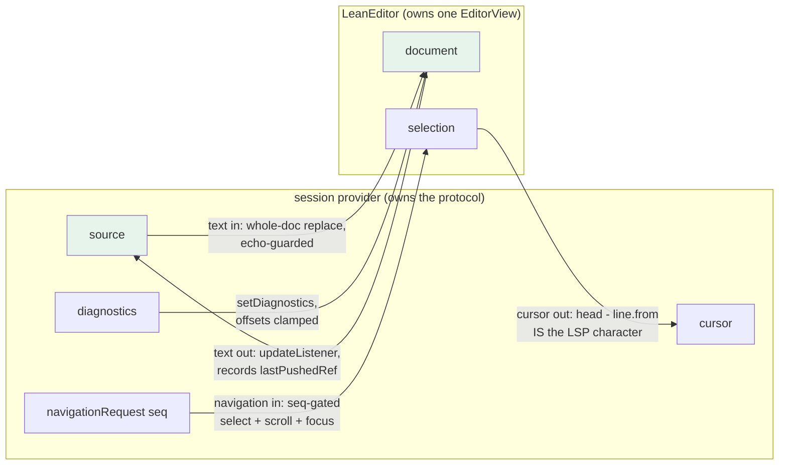
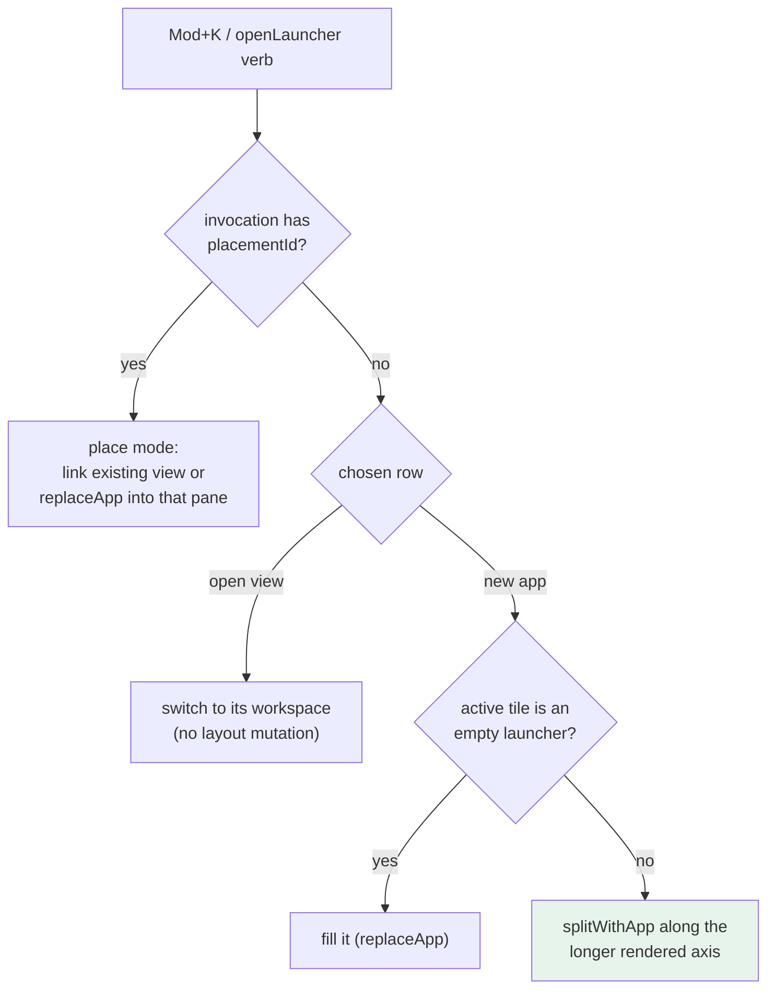

# Turboproof Tier A: The Real Editor, LSP-Native Tiles, and the Chrome Parity Campaign

This note documents the implementation of TURBOPROOF-2, the first of turboproof's three milestone tickets. In one working day the source tile's textarea became a CodeMirror 6 editor with Lean syntax highlighting and vim keybindings, four new tiles landed on capabilities the stock Lean 4 language server already provides, and a round of subagent-driven usability testing exposed — and forced the repair of — three defects that no unit test had caught, including one that had silently disabled the product's entire right-click interaction layer. The chapter on that last defect is the most instructive part of this note, because the defect survived every mechanical verification pass and fell only to a human description of what the screen actually looked like.

The architectural background — the two-plane design, the workbench protocol, the session provider's reference economy — is covered in [[PROJ - Turboproof - A pbui Proof Workbench for Lean 4]]. This note assumes that context and concentrates on what this cycle added and what it taught.

> [!summary]
> - The source tile now hosts a CodeMirror 6 editor behind an unchanged tile boundary: a hand-written `StreamLanguage` tokenizer, a four-flow integration contract with the session provider, LSP diagnostics with clamped offsets, and vim mode in a reconfigurable compartment.
> - Four tiles were built on plain LSP plus pure client-side models: a tactic script with a comment-toggle counterfactual flow, a before/after goal diff, a declaration-status overview, and workspace-symbol library search.
> - Subagent user testing found a real blocker (launcher-placed tiles never received their document binding) and then demonstrated its own blind spot: the object menu had rendered off-screen for the whole session, every mechanical check passed, and only the user's visual report identified it. The working rule that came out of this: for chrome, assert geometry, not presence.
> - The window chrome, drag-dock overlay, Ctrl/⌘-K launcher modal, and mouse-documentation footer were brought to parity with datalab-ui, and a devctl profile setup now orchestrates the server, the Vite dev UI, and Storybook.
> - Reaching parity meant re-implementing eleven capabilities that datalab-ui (and mostly agentlogic) already carry as private copies. The section "What was re-implemented from datalab, and where it should live" is the extraction inventory for the pbui architecture discussion.

## Why this cycle exists

TURBOPROOF-2 is the Tier A milestone: everything the stock Lean 4 language server can already power, with no new backend code and no Lean-side code. The tier boundary is a dependency boundary. Tier A consumes `textDocument/documentSymbol`, `workspace/symbol`, interactive goals at arbitrary positions, and published diagnostics — all verified against real Lean 4.32.2 during the earlier protocol investigation. Tier B (shadow-document synthesis) and Tier C (a Lean companion package) each require new server-side machinery, so Tier A ships value while the other tiers remain design documents.

The instruction that shaped the cycle's method was explicit: implement the ticket, and then have "dumber subagents" use the product as first-time Lean users, with screenshots and step-by-step logs, "so that we can assess and revise. This is really user testing." The second half of this note is about what that method caught and what it missed.

## The editor

### Why CodeMirror 6 and not Monaco

lean4web, the official web editor, uses Monaco with the vscode extension-host compatibility layers. That stack brings web workers, the `monaco-vscode-api` shim ecosystem, and megabytes of runtime, in exchange for the full vscode extension experience. Turboproof needs highlighting, vim keybindings, external diagnostics, and precise cursor control inside one tile among fifteen. CodeMirror 6 provides exactly those as tree-shakeable ES modules with no worker requirement, an official lint subsystem that accepts externally produced diagnostics, and a theming system that reads CSS custom properties directly — which means the pbui design tokens style the editor with no translation layer. The measured cost was ≈370 kB minified added to the bundle (853 kB total, 268 kB gzipped), against the decision record's ~350 kB estimate. If that number ever becomes a complaint, the fallback is a dynamic import inside the tile body; nothing about the tile boundary changes.

### The tokenizer is a lexical approximation, on purpose

There is no maintained lezer grammar for Lean 4, and highlighting needs tokens, not parse trees. The tokenizer is a `StreamLanguage` definition — line-at-a-time with a small persistent state — and the only state it carries is the nesting depth of `/- -/` block comments, because comment nesting is the single multi-line construct in Lean's lexical surface:

```
state = { commentDepth: int }          # /- -/ comments NEST in Lean

token(stream, state):
  inside a block comment → consume, adjusting depth on /- and -/
  "--"                   → line comment
  '"'                    → string with backslash escapes
  @[...]                 → attribute (meta)
  digits                 → number
  identifier             → sorry/admit → INVALID (loud, deliberately)
                           declaration keywords → definitionKeyword
                           tactic keywords      → keyword
                           uppercase or ℕℤℚℝℂ   → typeName
                           otherwise            → variableName
  operators (∀ ∃ λ → := … and ASCII forms) → operator
```

Two choices deserve their rationale. First, `sorry` maps to the *invalid* highlight tag: the trust story of the whole product begins with incomplete proofs being visually loud in the source, before any axiom-tracking tile exists. Second, the identifier class is deliberately generous with unicode (Greek letters, blackboard types, subscripts, primes), because over-matching an identifier is harmless in a highlighter while splitting one is visibly wrong. Exactness is not this component's job; when semantic tokens arrive over the same LSP connection, they will refine the display without changing the architecture.

### The four-flow contract

The editor owns nothing protocol-shaped. The session provider owns the connection, the document version, the debounced `didChange`, and the diagnostics stream; the editor is a view over `session.source` with four data flows, each implemented as an isolated React effect:



The load-bearing piece is the echo guard on the text-in flow. Every keystroke calls `session.setSource(text)`, which dispatches into Redux; the same string returns as the `source` prop one render later. Applying that echo as a whole-document replace would reset the cursor and the vim state on every keystroke. The guard is two comparisons:

```ts
// text out (inside the updateListener):
lastPushedRef.current = text;
session.setSource(text);

// text in (the source-prop effect):
if (session.source === lastPushedRef.current) return;   // our own echo
if (session.source === view.state.doc.toString()) return; // already identical
view.dispatch({ changes: { from: 0, to: doc.length, insert: session.source } });
```

Three details make the rest of the contract cheap. CodeMirror offsets and LSP positions are both UTF-16 code-unit based, so `head - line.from` *is* the LSP `character` with no codepoint conversion. The navigation request carries a monotonic `seq` precisely so that navigating twice to the same position still fires — position equality cannot be the change signal. And diagnostics for version N can arrive while the editor holds version N+1 text, so every incoming range is clamped into the current document rather than trusted; the window is one edit wide, but it is real, and an unclamped offset throws inside CodeMirror.

### Vim, and who owns Escape

Vim mode is `@replit/codemirror-vim` inside a `Compartment`, which allows the toggle to reconfigure the live view without recreating it. The extension order constraint is documented and non-negotiable: `vim()` must precede the default keymaps or insert-mode typing fights them. The toggle persists in `localStorage`, surfaces as a toolbar checkbox, and is also reachable as the ex command `:novim` — whose handler is global to the Vim runtime and therefore reaches the owning React component through a bubbling DOM event on the view's element, because a captured setter would go stale the moment a second source tile mounted.

Escape is claimed by three parties: vim mode-exit, the pbui accept-cancel, and menu-close. The resolution is a rule, not a heuristic: when the editor has focus and vim is enabled, Escape belongs to vim. The implementation is a high-precedence keymap entry that returns `vimEnabledRef.current` — consuming the key when vim is on, declining it when vim is off so the pbui surfaces see it. The launcher modal (section below) sidesteps the question entirely by stealing focus while open.

## The pure models

Two new modules under `ui/src/model/` carry the analytical weight of the new tiles, and both are plain functions with no React and no fetching.

`tacticBlocks.ts` answers "which tactic lines exist, and where does each begin" by lexical scanning: a declaration pattern opens a context, a line ending in `by` opens a block, indented lines inside it are steps, bare focus markers (`| zero =>`) are structure rather than steps while `| zero => rfl` contributes `rfl`, and a leading `--` marks a step as switched off. The parser is an approximation by design — a one-line `by exact` proof yields zero steps rather than garbage, and term-mode proofs yield no blocks, which the script tile reports honestly. Exactness is what the InfoTree gives Tier C; the approximation is what makes the tile buildable today, and the tile's contract will not change when the data source improves.

`goalDiff.ts` answers "what did this tactic do" given two goal lists:

```
key(goal, index) = goal.mvarId ?? (goal.userName ?? "goal") + ":" + index

consumed = before where key ∉ after      # the tactic closed or transformed it
kept     = after  where key ∈ before     # untouched, rendered dimmed
produced = after  where key ∉ before     # new branches
```

The single correctness constraint is temporal: metavariable identifiers are stable within one elaboration and never across a `didChange`. The session therefore version-stamps the whole diff state and replaces it wholesale; nothing is ever cached across versions.

## The tiles

| Tile | Data source | What it answers |
|---|---|---|
| script | `tacticBlocks` over the source text | which tactic lines exist; scrub, switch off, duplicate, delete each |
| step | two `getInteractiveGoals` calls + `goalDiff` | what the tactic under the cursor consumed and produced |
| overview | `textDocument/documentSymbol` × published diagnostics | every declaration and its status: clean, sorry, or error |
| environment (extended) | `workspace/symbol` | project-wide library search from the `.ilean` index |

The script tile's "switch it off" verb is the sketch's original promise — disable a tactic and re-run — realized with no protocol extension at all: the interpreter rewrites the line with a leading `-- ` through `session.setSource`, the server re-elaborates, and the goals and diagnostics display the counterfactual. Verified end to end in the browser: commenting the `simp` in `plus_n_zero` produced "unsolved goals at end of plus_n_zero", and switching it back on recovered the proof. Every step verb is a source edit or a navigation; the tile itself writes nothing.

The step tile required one genuinely new piece of session machinery: a third epoch-guarded fetch family. It derives the active tactic line from the source and cursor, queries interactive goals at the line's indent (before) and at its end (after), and commits both responses through the reference economy — both carry `__rpcref` leases, so a stale response releases its references without committing them, exactly as the cursor and document families already did. Querying the same line at two columns rather than two different lines is what makes the semantics identical under the mock's positional snapshots and under real Lean.

The overview tile is a join with one repair. The mock's `documentSymbol` ranges cover only the declaration's name line, so a `sorry` warning one line below never intersected and `trusted_gap` reported clean — a bug a subagent tester walked past and a post-session audit caught. The fix extends each symbol's effective extent to just before the next declaration (or end of file), which is a no-op under real Lean's whole-declaration ranges and repairs the mock's. The status word rides on a chip; color never carries the meaning alone.

Library search folds into the environment tile as a debounced `workspace/symbol` query. Real Lean serves it from the project-wide `.ilean` index — the payoff arrives in `--lean-mode proc` with a lake project — and the mock answers method-not-found, which degrades to the file-local declaration list with an explanatory line. Foreign-file hits open in the inspector rather than pretending the current document contains them.

The accept flow completes the set: "Close with… (accept a declaration)" on the goals toolbar and the goal menu arms pbui's accept mode over `lean.declaration` presentations everywhere — environment rows, overview rows, search results — and inserts `exact <name>` at the cursor. It is pure wiring of machinery that already existed; the only new code is the two call sites.

## User testing by subagent: what it caught

Three haiku-model subagents drove the running product through Playwright as first-time Lean users, each with a persona, a task list, and instructions to record expectation, observation, and a severity per step, with screenshots. Their logs live in the ticket's `various/user-test-0{1,2,3}/` directories.

The method earned its cost within minutes. Tester 2 placed the tactic script tile from the launcher and hit "This tile is not bound to a Lean source document" — and then correctly reported the entire switch-off feature as unreachable, since the tile that carries it never rendered. The root cause was structural: `replaceApp`, the verb that fills a pane, never set the `source` document binding on either of its paths (the launcher's in-place `viewConfigure` retarget and the fresh `viewCreate`). Only the seeded default layout had ever bound its views, so every proof tile placed at runtime was born unbound. The binding is optional in the catalog — correctly, since a launcher binds nothing — so no validator could have objected; only a user walking the launcher path could surface it. The fix binds every placed non-launcher view to the document existing views already bind (else the first lean-source document), and the empty state's hint was corrected because it advertised a "bind through the tile menu" flow that did not exist.

Two structural observations about the method. First, testers over-report success: tester 3's log claimed the accept banner "cancelled cleanly" while the post-session DOM still showed it armed — auditing the end state is part of the method, not an optional extra. Second, the personas' failure to *find* things is itself data: "right-click anything for its verbs" in the demo text oversold a surface that only presentation elements provide, and that mismatch went into the backlog as a discoverability finding before it turned out to be something much worse.

## The unpositioned menu: what user testing missed

The user reported, across several messages: no colored tile titles, no drag handle, no split or close buttons, right-click doing nothing, and finally the decisive observation — the menu "appears underneath the status bar." The first three complaints were a genuine chrome gap (next section). The right-click complaint was misdiagnosed twice before the final message resolved it.

The facts. pbui ships *structure* for its presentation system: components emit `data-part` attributes (`presentation`, `menu`, `menu-header`, `menu-item`, `menu-reason`) and each product styles those hooks itself. datalab-ui carries that stylesheet block; turboproof never ported it. The consequence of a missing `[data-part="menu"]` rule is not a broken menu — it is a menu with no `position: fixed` and no z-index, which renders in normal document flow after the footer, at the bottom of the page, on every single click. The interaction layer was fully functional and fully invisible.

Why every verification passed. The mechanical checks queried the accessibility tree ("the menu contains these items"), dispatched synthetic clicks through `evaluate`, and used Playwright's role-based clicks — which scroll off-screen targets into view before clicking, by design. Every check answered "does the menu exist and do its items work" and none asked "is the menu where the pointer is." Three user reports and two subagent test rounds ran against a menu no human could see, and the test harness compensated for the bug at every step.

The repair was a transcription: datalab-ui's presentation-parts block, ported as global attribute selectors — the fixed, z-indexed menu with its sticky inverted header; the hover affordance (dotted outline plus selected wash) that finally makes the eleven presentation types *look* interactive; and the accept mode's pulsing "acceptable" outline with its reduced-motion fallback. Verification this time measured geometry: computed `position`, z-index, and the menu box's coordinates against the contextmenu coordinates.

The lesson generalizes beyond this bug and is now a working rule: **for chrome defects, assert geometry — position, viewport containment, stacking — not presence.** An accessibility tree is a statement about structure; a usability failure is frequently a statement about layout, and the two toolchains are almost disjoint. A second lesson is a checklist item for the pbui family: any new product must port the presentation-parts stylesheet on day one, or consider upstreaming a starter into the package so the block stops being re-transcribed.

## The chrome parity campaign

The remaining user reports drove the window chrome to family parity, one datalab-ui organism at a time.

**The tile frame.** The tone is the title bar — datadrop's signature, matched deliberately (DR-26) — not a stripe beside it. The bar carries the `⠿` grip, the title (still a `<tile>` presentation, so the object menu and the chrome buttons are two doors to the same serializable verbs), and split ⬌ / split ⬍ / close ✕ buttons. `canClose` now counts the workspace's real leaves rather than a placeholder.

**Drag, swap, and dock.** The grip drag is imperative on purpose: the preview paints on the *target* tile, which the dragged tile does not render, and threading that through React state would put every tile on the drag's re-render path for the sake of a border that `pointermove` can paint directly. The drop preview is datalab's zone overlay — a translucent dashed area covering exactly the half of the target the docked view would occupy (the whole tile for a swap), with a label naming the outcome before release: "split-dock here · the source tile closes." Releasing on the center performs `swapTiles`; on an edge, the new `dockTile` verb runs `dockPlacement`, whose mutation order (placement-split first, source-close second) guarantees the moving view always has a placement and can never be garbage-collected as abandoned.

**The launcher.** Mod+K (Meta on Apple platforms, Control elsewhere) opens a searchable modal — datalab-ui's `LauncherDialog`, right-sized. The invocation lives in the Redux slice rather than a React context because a serializable tile verb must be able to open it. Search runs over a pure rows model: open views (with workspace and placement counts) and creatable applications (singletons that already have a view are excluded — their view row covers them). The placement semantics preserve datalab's central decision: a global new view must never destroy a working tile, so it splits the tile the chord fired in along its longer *rendered* axis — the DOM knows pixels; the tree only knows ratios — and the status line names the landing site before Enter commits. Escape belongs to the `Dialog` alone; datalab's history records the bug where a second escape-surface registration left Escape closing nothing, and the port keeps that rule rather than rediscovering it.



**The footer.** The mouse-documentation line is now datalab's inverted Genera strip: the READY / ACCEPT MODE word, the description of whatever is under the pointer with the idle text "hover anything · L is the default verb · R opens its menu", an `aria-live` mirror so the self-documentation is announced to screen readers, and the ambient counts right-aligned. The visible copy is aria-hidden so the text is not read twice.

## Orchestration: devctl profiles

The repository gained the family's devctl arrangement: a `.devctl.yaml` declaring profiles and a repo-local plugin speaking the v2 JSON protocol (`config.mutate`, `validate.run`, `launch.plan`). Four profiles cover the useful configurations — `dev-stack` (Go server in mock mode on :8666, Vite dev UI on :5174, Storybook on :6008), `ui-only`, `go-embedded` (the committed production bundle alone), and `real-lean` (`--lean-mode proc`, which validation gates on a `lean` binary and annotates with the no-sandbox warning). Validation errors point at the repairs (`make ui-install` for missing node modules, `make ui` for a missing dist), and every service carries an HTTP health check, so `devctl up` is the entire start procedure.

## What was re-implemented from datalab, and where it should live

This section is the hand-off inventory for the pbui architecture discussion. Reaching family parity in this cycle meant transcribing or re-deriving a substantial amount of code that already exists in datalab-ui — in several cases for the third time, since agentlogic carries its own copy. Each transcription is a divergence waiting to happen, and one of them (the presentation-parts stylesheet) has now demonstrated the worst-case failure mode: forgetting the copy does not break the build, it silently disables the interaction layer. The inventory below records what was duplicated, where each copy lives, and where the shared version most plausibly belongs.

The suggested targets fall into three homes. **The pbui npm package** should absorb anything that is a pure function of pbui's own state or a stylesheet for pbui's own `data-part` hooks. **The workbench-protocol package** (or a small `workbench-react` companion) should absorb anything that is a pure function of `WorkbenchDocument` — the mutation builders and the local applier mirror the Go semantics and have no product content at all. **Product code** keeps only what genuinely differs per product: the verb vocabulary, the descriptors, the tiles.

| # | Capability | datalab-ui | agentlogic | turboproof | Suggested home |
|---|---|---|---|---|---|
| 1 | Presentation-parts CSS: `[data-part=presentation]` hover, acceptable pulse + reduced-motion, `[data-part=menu]` positioning and items | `src/pbui/pbui.module.css` | own copy | `app.css` (ported this cycle, after the invisible-menu incident) | pbui package, as an importable `presentation-parts.css` |
| 2 | MouseDocLine (Genera footer: mode word, hover doc, aria-live mirror, ambient) | `src/pbui/MouseDocLine.tsx` | variant | `Chrome.tsx` (ported verbatim) | pbui package; it reads only `usePbui()` state plus one prop |
| 3 | AcceptBanner | `src/pbui/AcceptBanner.tsx` | variant | `Chrome.tsx` (styling still diverges) | pbui package, same argument as #2 |
| 4 | Tile frame: tone-as-title-bar (DR-26), ⠿ grip, split ⬌/⬍ + close ✕ buttons, canClose from leaf count | `organisms/Tile` | `Frame` in `organisms/Tile.tsx` | `organisms/Tile.tsx` (ported this cycle) | a pbui `TileFrame` organism with verb callbacks and a title slot |
| 5 | Drag/swap/dock: quarter-edge hit-test, labeled zone overlay ("names the outcome before the release"), imperative preview painting | `useDrag` + `Tile.module.css` `.zone` | imperative variant, inset-shadow preview | ported datalab's overlay this cycle | pbui `useTileDrag` hook + the zone CSS, alongside #4 |
| 6 | LauncherDialog: Mod+K modal, search over views/apps, keyboard nav with wrap, split-along-longer-rendered-axis, never-destroy-a-working-tile, Escape owned by Dialog alone | `organisms/LauncherDialog` + `ViewSwitcher` model | absent | right-sized port this cycle | harder: the rows model is product-flavored; extract the modal shell + keyboard machinery, inject the rows model |
| 7 | Shortcut routing: `isModKey` (Meta on Apple, Ctrl elsewhere), editable-target detection, transient-surface blocking | `shortcutRouting.ts` (pure, tested) | absent | simplified inline copy | pbui package verbatim; it is already a dependency-free pure module |
| 8 | Split-tree renderer: divider drag with local preview and one commit, keyboard-operable dividers, snap ratios | own | `SplitView` | `NodeView.tsx` (from agentlogic) | `workbench-react`: it renders protocol `Node`s and knows nothing product-specific |
| 9 | Mutation builders: `splitPlacement`, `closePlacement`, `swapPlacements`, `dockPlacement`, `resizeSplit`, `snapRatio`; this cycle added `linkViewIntoPlacement`, `splitWithApp` | layout-store equivalents | `store/workbench.ts` | copied from agentlogic, extended | workbench-protocol utils: pure `WorkbenchDocument → Mutation[]`, mirrored by the Go applier |
| 10 | The local applier + outbox/rebase sync: apply-then-queue, DocumentPut coalescing, 409 → rebase → replay, SSE revision stream | layout/world stores | `slice.ts` + `sync.tsx` | copied from agentlogic | a `workbench-client` module beside the protocol package |
| 11 | The app registry: side-effect registration, `appFor`/`allApps`, the registry↔Go-catalog parity fixture pattern | `appkit/` | `appkit/` | `appkit/` | the interface types into pbui; the parity-test pattern into family documentation |

Three observations for the extraction discussion.

First, the ordering is not arbitrary: rows 1–3 are the cheapest and the most dangerous to leave duplicated. They are pure functions of pbui's own state (or stylesheets for pbui's own DOM), they have no product content, and the cost of a missing or drifted copy is invisible breakage rather than a compile error. Row 1 should ship in the very next pbui release; this cycle is its incident report.

Second, rows 8–10 argue for a package boundary that does not exist yet. The workbench-protocol package currently ships generated types only, while every consumer re-implements the same pure functions over those types — and then must keep them semantically identical to `pkg/workbench`'s Go applier, because a mutation the local applier accepts and the server rejects (or the reverse) breaks the outbox contract. Centralizing the TypeScript applier and builders next to the generated types would make the TS↔Go parity a single test surface instead of three.

Third, the launcher (row 6) is the one candidate where premature extraction could hurt. datalab's launcher carries workspace scoping, stages, audiences, and a query language that turboproof deliberately omitted; the shared core is the modal shell, the keyboard loop, and the two placement rules (never destroy a working tile; Escape has exactly one owner). Extracting that core and leaving the rows model injectable is the version worth proposing; extracting datalab's launcher wholesale would export its product policy.

## Current project status

TURBOPROOF-2 is implemented, user-tested, and green: 45 UI tests (tokenizer, editor contract, tactic blocks, goal diff, overview join, launcher model), the Go catalog parity test, typecheck, token check, and the production build. The repository holds the work as a sequence of focused commits with a nine-step implementation diary in the ticket (`ttmp/2026/07/31/TURBOPROOF-2--*/reference/01-implementation-diary.md`), including verbatim failure records and the menu post-mortem. Known pre-existing debt: thirteen lint findings confined to the vendored mock packages, byte-identical to their state before this cycle.

## Open questions

- Should the presentation-parts stylesheet move into the pbui package as an optional import? Three products now carry hand-transcribed copies of the same block, and the failure mode of forgetting it is a silently invisible interaction layer.
- The step tile queries goals at two columns of one line; whether hypothesis-level diffs (the `isInserted`/`isRemoved` flags within kept goals) justify their rendering cost is unmeasured.
- Focus restoration after the launcher closes (datalab restores by placement id) is unported; the workspace switch works but leaves focus where the modal left it.

## Near-term next steps

- Run the three user-testing scenarios against `--lean-mode proc` with a lake project, where `workspace/symbol` and real `documentSymbol` ranges change the answers.
- TURBOPROOF-3: the shadow-document synthesis engine (library search as a tactic, trust reports, what-if), which turns several Tier A degradation paths into live features.
- The Terraform items carried from the first cycle: a turboproof-scoped packages token and CI roles.

## Project working rule

When a user reports that an interaction does nothing, treat "the handler did not fire" and "the result rendered where no one can see it" as equally probable until geometry has been measured. Presence in the accessibility tree, successful synthetic clicks, and passing role-based queries are all compatible with a fully invisible UI.
