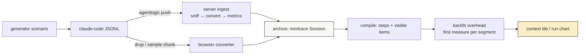
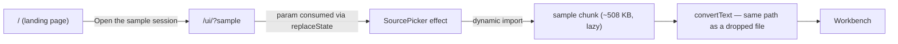

# PROJECT REPORT - Agentlogic and DATA LAB - Demo Data, Front Doors, and the Landing Rewrite

This report continues [[PROJECT REPORT - Agentlogic - A Transcript Analysis Workbench Built on PBUI]] and [[PROJECT REPORT - Agentlogic - The First Outside Review and the Alignment With Datalab]]. At the end of those two reports, agentlogic was a working product with no way to show itself: the repository contained only a minimal converter-pinning corpus ("fix the greeting in main.go"), the root URL served the application shell, and the sibling product's marketing page carried copy inherited from a prototype with the product name substituted. This report covers the work that closed all three gaps — synthetic demo data rich enough to fill every tile, a marketing front door for agentlogic, and a from-scratch rewrite of DATA LAB's landing copy and demo seeds — and the four product defects the work surfaced along the way.

> [!summary]
> - **Demo data is a verification mechanism.** Building three realistic synthetic sessions exposed two live defects that every prior mechanism had missed: a `Cache-Control: immutable` header on a URL whose meaning changes (`latest`), and a context tile that weighed truncated tool results by their stored preview instead of their recorded full size. Both defects only manifest at realistic data volume.
> - **The context tile has a precise measurement model, and demo data must respect it**: per-step context is the sum of *visible* item estimates plus one measured-overhead constant per compaction segment, anchored at the segment's *first* measured turn. Token pressure hidden in `cache_read_input_tokens` is invisible to it by design.
> - **Marketing that cannot drift**: agentlogic's landing page renders its step-kind chips and app catalog from the live registry, and both landing pages operate under one rule — a claim must name something a reader could go and find in the repository.
> - **Concept before product**: DATA LAB's page now teaches the PBUI idea (objects and verbs, tiles over documents) before any feature list, and closes by naming agentlogic as a second application of the same idiom.

## 1. Why this report exists

A workbench is judged in its first thirty seconds. The previous reports describe a system whose correctness was earned through seven distinct verification mechanisms, but a visitor arriving at the deployment met a source picker with an empty project list, and a visitor arriving at DATA LAB met copy that its own header comment flagged as inherited and unreviewed. The task for this cycle was explicitly presentational: mock data that makes agentlogic attractive, a landing page that sells and explains it, and a rewrite of DATA LAB's landing copy and demo workbenches with the PBUI concept carrying the narrative.

The report's analytical interest is that presentational work turned out to be verification work. Three of the four defects fixed in this cycle were invisible to unit tests, browser checks, real-transcript smoke runs, an outside reviewer, and a second consuming application — the six mechanisms catalogued previously — and became visible only when the system held data of realistic size and shape. Section 9 returns to this observation.

## 2. The demo-data problem, stated precisely

The obvious way to obtain convincing demo data — commit a real session transcript — is forbidden by a constraint the first report established: a real transcript records file paths, source code, command output, and frequently credentials. The repository's own frontend smoke test carries the warning "NEVER COMMIT AN ARCHIVE" for exactly this reason. Synthetic data is therefore not a compromise; it is the only committable form.

The second constraint is that the existing corpus cannot serve. `testdata/corpus/` exists to pin converter behavior — one record shape per file, nineteen lines in the largest — and a corpus session renders as a workbench with three timeline rows and an empty diff. Demo data has the opposite requirement profile. Enumerating what each tile needs to look alive produces a concrete checklist:

| Tile | Requires |
|---|---|
| timeline, deck | many steps of varied kinds, so the strip shows a full palette |
| tasks | a `TodoWrite` plan whose items transition to completed at visible steps |
| diffs, semdiff, files | `Write` and multi-hunk `Edit` calls across several files, with consistent original-content payloads |
| tools | real arguments, real output, and at least one `is_error` result |
| chart | per-turn `usage` so the token series is not flat |
| context | an `isCompactSummary` record under believable token pressure |
| (metrics) | a `Task` delegate call, so `subagent_count` is non-zero |

The eleven step kinds the compiler can classify (`user`, `think`, `tool`, `edit`, `create`, `taskAdd`, `taskDone`, `compact`, `respond`, plus the defined-but-unproduced `mem`/`memRead`) bound what a session can display; the checklist above is the subset a demo must actually exercise.

## 3. The generator and its consistency invariants

The three sessions are produced by a Python generator (`ttmp/.../AGENTLOGIC-4.../scripts/01-generate-demo-transcripts.py`) whose `Session` builder emits claude-code JSONL records mirroring the corpus shapes exactly — the corpus is what pins both converters, so anything it accepts, the generator may emit. Three scenarios were written:

| File | Story | Records | Distinguishing load |
|---|---|---|---|
| `skyline-rate-limit.jsonl` | a token-bucket rate limiter built end to end | 51 | plan, 5 files, compile error, flaky test, subagent, one compaction at ~120k tokens |
| `skyline-flaky-worker.jsonl` | a "send on closed channel" race, fixed by reordering shutdown | 23 | read-heavy investigation, goroutine dump, 200×`-race` verification |
| `meridian-toml-migration.jsonl` | a YAML→TOML config migration | 53 | two compactions, two subagents, sawtooth context curve |

Two invariants make or break the result, and both are worth recording because they are not obvious until violated.

**The edit-triple invariant.** The workbench rebuilds a shadow workspace from the transcript: a `Read` result's `toolUseResult.file.content` seeds a file, an `Edit`'s `old_string` must be found in the current shadow state, and the `originalFile` payload is the fallback base. If any of the three disagrees, the diff tile flags drift — correctly, since drift detection is a feature. The generator therefore holds each fictional file as one Python constant and derives every later state from it by the same `replace` operations the fictional agent performs.

**The usage-consistency invariant.** Each assistant record carries `usage` (`input_tokens`, `output_tokens`, `cache_read_input_tokens`, `cache_creation_input_tokens`). The first version of the generator treated these as free parameters and grew `cache_read` to ~150k while keeping tool-result contents small. The context tile showed 14.8k at what should have been the peak. The explanation is the measurement model of the next section; the consequence is that emitted usage must be *derived from* the visible content sizes, not invented beside them.

## 4. The context tile's measurement model

The failure above is worth a full section because the model it revealed is load-bearing for anyone who authors data for this workbench, and because the model is a deliberate design, not an accident.

The compiler (`ui/src/model/compile.ts`) computes a per-step context total from two sources:

1. **Visible items.** Every step contributes items whose token cost is estimated from content: `estimateTokens(value) = max(2, len(text)/4)`. A tool call's item costs `estimate(args) + estimate(result)`.
2. **Measured overhead.** Real usage measurements exist only where the transcript recorded them. `measuredUsage` collects, per assistant turn, the total `input + cache_read + cache_creation + output`, anchored at the last step that turn produced. `backfitContextOverhead` then, for each compaction segment, takes the **first** measurement in the segment and defines

```text
overhead(segment) = max(0, measured_total_at_first_anchor − visible_items_at_that_step)
```

injected as one explicit "unrecorded context" item — the system prompt, tool schemas, and cache bookkeeping a session file never carries verbatim — and added to every subsequent step of the segment as a constant.

The model in one sentence: **visible items carry the growth; overhead is constant per segment, anchored at the segment's first measured turn.** A large `cache_read` value on a *later* turn of the segment is never consulted. This is defensible — overhead genuinely is roughly constant within a segment, and the first anchor is the least contaminated by accumulated content — but it means the authoring rule for demo data is strict: token pressure must live in content the reader could scroll through.

The correction followed the rule instead of fighting it. The flagship session's pressure event became a genuinely large visible artifact — a ~360 KB generated OpenAPI file, read by the fictional agent one step before the compaction — plus a vendor-wide grep and verbose test logs in the migration session, with first-turn `cache_creation` raised to ~21k to model the real system-prompt overhead. After the correction the flagship peaks at 119.8k of 200k, the compaction folds 31 steps, and the run chart draws the spike and the cliff.



## 5. Two defects that only realistic data could reach

**Defect 1: `immutable` on a moving target.** After regenerating the transcripts and re-pushing, the browser kept rendering version 1. The server's blob handler set one cache policy for every archive URL:

```text
Cache-Control: private, max-age=31536000, immutable
```

The reasoning recorded in the code — "a committed version can never change" — is true of a *version* and false of the URL `/versions/latest/archive`, which re-resolves on every push. A browser that has seen `latest` once will not ask again for a year. The fix distinguishes the two path shapes: `latest` now answers `private, no-cache`, and the ETag already present (the content digest) turns revalidation into a 304 whenever nothing moved; version-pinned URLs keep the immutable policy. The defect was unreachable by every prior mechanism because no prior workflow pushed a *changed* transcript under a *stable* name and then re-read it through a browser cache.

**Defect 2: preview-weighted truncation.** The server-side converter truncates large tool outputs at a fixed limit and records the true size in `output.full_bytes`. The compiler estimated a tool item's cost from `step.result` — the truncated preview. The consequence composes badly: the items most likely to be truncated are exactly the oversized reads that force compactions, so the archive-backed view systematically undercounted the events the context tile exists to explain, while the browser-converted view of the same session (which never truncates) told the true story. The fix weighs a truncated result by `full_bytes / 4`; a two-case regression test pins both branches. The general observation: **the same session must produce the same context account through both converters**, and any field one path records but the other path's consumer ignores is a divergence waiting for data large enough to show it.

## 6. The sample funnel

Demo data that requires an account teaches nothing. The funnel that removes every step between "curious" and "looking at the product":



Three decisions carry the design:

1. **The transcript ships as a lazy module, not a fetched asset.** `ui/src/demo/sample.ts` imports the JSONL with Vite's `?raw` (the same mechanism the Storybook fixtures already use against the corpus) and is loaded with a dynamic `import()` from the picker. The main bundle stays at 380 KB; the sample rides in its own 508 KB chunk that costs nothing until requested.
2. **The no-network fence stays intact.** The privacy claim "a dropped file does not leave the tab" is enforced by a test that reads the source of the conversion modules and fails on `fetch`, `XMLHttpRequest`, `sendBeacon`, `WebSocket`, `EventSource`, or `import(` — but the fence encloses exactly the modules it names. The dynamic import lives in the picker, outside the fence, which is the correct placement rather than a loophole: the fenced modules convert; the picker orchestrates.
3. **The URL parameter is consumed on arrival.** `/ui/?sample` auto-opens the sample, then `history.replaceState` strips the parameter. Without this, closing the workbench remounts the picker, which re-reads the URL and reopens the sample — a loop with no exit.

The same data seeds the server path: `make demo-seed` creates two projects and pushes all three transcripts through the real CLI, so a deployment can be populated with one command.

## 7. The agentlogic front door

The webui package had already reserved the space: its router mounts `GET /{$}` — Go's exact-match root — separately from the SPA shell, and its package comment states that any second marketing path must be added as its own exact route, deliberate friction against a catch-all that would turn API 404s into HTML. The landing page therefore required no Go changes at all: the same shell is served at `/`, and the React root dispatches on `pathname === "/"`.

Two properties distinguish the page from ordinary marketing:

**It renders from the product's own registries.** The step-kind chips are `Object.entries(KIND)` from `ui/src/model/kinds.ts` — tag, tone, and hover documentation included — and the application cards are `allApps()` from the appkit registry, each with the same one-line blurb the launcher shows. A new tile or a re-toned kind appears on the landing page the day it registers. Marketing rendered from the registry cannot drift from the product, which converts a class of documentation rot into a non-problem.

**Every claim is traceable.** The page adopts the rule DATA LAB's copy file states (section 8): a claim must name something a reader could go and find. The privacy paragraph names the mechanism ("a test reads the source of that code path and fails on any network call"); the ingest paragraph names the sniffer's refusal behavior; the self-host section shows the actual three commands. The hero figures are screenshots of the real workbench over the demo sessions — captured in the browser during verification, served as hashed static assets — with captions that state what the reader is looking at (36 steps, two failing commands, one compaction; 119.8k of 200k used).

The visual language is the product's: IBM Plex Mono, paper surfaces, 1px/2px ink hairlines, zero border radius, and the eleven step-kind tones as the only accent palette. A landing page in a different language would promise a product other than the one behind the button.

## 8. The DATA LAB rewrite: concept before product

The previous copy's own header documented its provenance: lifted from a prototype reference page with "PBUI" replaced by "DATA LAB", the substitution chosen deliberately and flagged for revisit. The header also recorded the cautionary tale that motivated the file's central rule — the prototype's runtime cards described a JavaScript evaluator, an LRU geometry cache, and LTTB decimation, none of which existed anywhere in the product's source. Marketing copy describing a system nobody built, in a file no test reads.

The rewrite keeps the rule and replaces the narrative. The old page's structural defect was ordering: the idea that makes the product coherent — presentation-based interaction — sat in a design note at the bottom, below the features it explains. The new order:

| Section | Content |
|---|---|
| hero | "The chart is not a picture." — the hook states the concept, beside a live embedded workbench |
| concept (`#concept`) | the PBUI idea in three cards: objects not pixels · verbs that can ask · tiles are windows, documents are the thing — with the Genera/CLIM lineage named |
| product | what DATA LAB builds on it: visible pipeline (the exact five-transform enumeration), the grammar (`source ⊳ steps ↦ mapping · geom · scale`), branching without flattening |
| tutorial | the five embedded exercises, unchanged in structure |
| runtime | the four previously-verified cards, kept and reworded |
| family | "DATA LAB is one PBUI application" — naming agentlogic as a second application of the same idiom: same tiles, same right-click, different world underneath |

The family section is the report's cross-product thesis made visible to visitors: the workbench idiom is a library, the products differ by backend, and learning one is learning both.

## 9. Demo seeds v2 and the two-phase typing problem

The page's first screen claims "visible pipeline steps" in its chips. In the old seeds, the pipeline tile beside that claim was empty — the hero document arrived with a bare default encoding and zero transforms. The v2 seeds close the self-contradiction: the hero document and both climate welcome documents now arrive with a quality-control filter (`data.ok = true` on the fixture stream; `ok = true` on the seeded dataset), a defects-by-line document joins the welcome set, and the document ids move from `demo-v1-…` to `demo-v2-…` — the versioning scheme exists precisely so a revision mints new documents instead of mutating anything persisted.

The filter step surfaced a typing problem worth recording. The workbench's field model has three semantic types (`q`/`n`/`t`), and a field's *physical* type is inferred from the rows currently on screen: a boolean column is `boolean` once data has arrived and `string` while the table is empty. The `eq` validator requires both operands to share a physical type. Therefore no single literal can type-check in both phases:

```text
eq(field ok, literal true)     — valid with rows, signature error while loading
eq(field ok, literal "true")   — valid while loading, signature error with rows
```

The seeded predicate resolves the dilemma with an explicit cast, valid in both phases, under which DuckDB renders booleans as `'true'`/`'false'`:

```text
eq( cast(field ok → string, onFailure null), literal "true" )
```

Two adjacent findings came out of the same investigation. First, the step-caption code (`transformToDraft` → `expressionField`) did not look through a cast, so the seeded step rendered as "filter  = true" with a hole where the field name belongs; `expressionField` now recurses through `cast` nodes. Second — an open defect, documented but not fixed — the transform editor cannot author a boolean comparison at all: `draftToTransform` always emits a bare string literal, so a user who edits the seeded step will have it rebuilt without the cast, and it will break the moment rows are present. The seeds currently use the only working shape for boolean columns, and the editor's round-trip should learn to preserve it.

The exposure mechanism deserves a note: the running hero never showed the error, because the tour fixtures always have rows. The failing case appeared only in the welcome-demo test, whose fixture table is deliberately empty. A two-phase defect requires a test that holds the system in the second phase.

## 10. What this cycle adds to the defect taxonomy

The first report classified twenty-four defects by discovery mechanism; the second added the outside review as a seventh mechanism reaching cross-subsystem seams. This cycle adds an eighth: **data of realistic size and shape**, distinct from the "real transcripts" mechanism because the transcripts here are synthetic — the operative property is volume and structure, not authenticity.

| Defect | Why only this mechanism reached it |
|---|---|
| `immutable` on `latest` | requires re-pushing changed content under a stable name, then re-reading through a browser cache |
| preview-weighted truncation | requires a tool result large enough to be truncated server-side |
| empty pipeline beside the "visible steps" claim | requires reading the page as a visitor, with the claim and the evidence in one glance |
| boolean two-phase typing | requires a document seeded before its data loads |

The pattern across all four: each is a disagreement between two representations of the same thing (a URL and its resolution; a preview and its full size; a claim and its demonstration; a field's two physical types), and small data lets the two representations coincide. Scale separates them.

## 11. Current state

- **agentlogic** (`task/transcript-agent` @f6dca6a): three demo transcripts in `testdata/demo/` with their generator in the ticket; the sample chunk and `/ui/?sample` funnel; the landing page at `/`; `make demo-seed`; the two archive-path fixes with regression tests. 100 UI tests, full Go suite, typecheck, and lint green.
- **pbui** (`task/transcript-agent` @7c7d3a1): the rewritten `copy.ts` and restructured `MarketingPage`, the enriched `heroSeed`, the `demo-v2` welcome set with the cast-form QC filters, and the cast-transparent step captions. 504 datalab-ui tests, typecheck, and lint green.
- Verified in a live browser end to end: seeded server, sample funnel, both landing pages; twelve screenshots in the ticket's `various/`.

## 12. Open questions and next steps

- **Publication gates deployment.** The datalab binary embeds a built copy of `@hyperslop-systems/datalab-ui` from the package registry; until a new version is published and datalab's committed `dist` rebuilt, production serves the previous landing page. This is the same publication task (s6en) that gates the npm story generally.
- **Pin the demo transcripts in CI.** They drift silently if converter record shapes evolve; a check that pushes `testdata/demo/` through `pkg/ingest` — as the corpus tests already do for their files — would pin them.
- **Teach the transform editor booleans.** Either preserve a cast through the draft round-trip or give the filter draft a typed-literal notion; the current seeds work but are editable into a broken state.
- **Prerender for crawlers.** Both landing pages render client-side inside the SPA shell; a static prerender is the standard next step if search visibility ever matters.

## Project working rule

A claim on a marketing page must name something a reader could go and find in the repository — and wherever possible, the page should render the claim *from* the thing itself (the registry, the kind table, a screenshot of the seeded product), so that the claim and its referent cannot drift apart silently.
