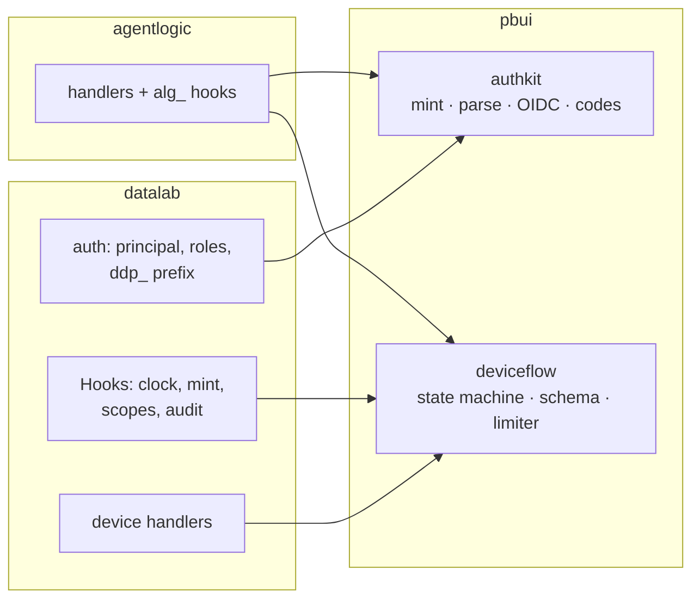

# PROJECT REPORT - Agentlogic and DATA LAB - The Hardening Cycle, DR-37, and the Glazed Migration

This report continues [[PROJECT REPORT - Agentlogic and DATA LAB - Demo Data, Front Doors, and the Landing Rewrite]]. The two feature cycles it and its predecessors describe each left a documented residue: security code that existed twice, defects found and deliberately deferred, invariants that held only because nobody had touched them, and a CLI whose verbs predated the repository's own framework rule. This cycle (ticket AGENTLOGIC-5) collected that residue into one ticket with a written implementation guide, then cleared all nine items. The report analyzes what the cycle produced — and, more durably, what it demonstrates about debt that is *catalogued* versus debt that is merely *known*: every item was closed in a working day precisely because a previous session had already written down its cause, its file references, and its acceptance criteria.

> [!summary]
> - **DR-37 is complete**: datalab deleted the auth mechanics that authkit was transcribed from and now runs on the shared package. The adoption is a 206-line adapter wiring a host-vocabulary seam (clock, time format, `ddp_` mint, scope list, audit) into the shared state machine — and the whole existing test suite passed without behavioral edits, which is the property that made the refactor safe to do quickly.
> - **A pin test's first run probes the present, not just the future.** The new CI test for the demo transcripts failed immediately on its delegate-count floor — exposing that the browser converter and every stored archive spell the operation vocabulary differently, which had silently broken a UI filter for archive-backed sessions.
> - **Two-phase defects need tests that hold the system in the second phase.** The boolean-filter fix and its verification both follow from one fact: a column's physical type differs between "rows on screen" and "table still loading", so any single-phase test is blind to half the behavior.
> - **The glazed migration ended with zero lint pragmas** — and the decisive step was recognizing that the linter's complaint about root flags was an architecture critique, answered by adopting hyperslop-cli's client-section pattern (DR-76) rather than by widening an ignore.

## 1. Why this cycle exists, and why it was fast

The previous cycles closed with lists of follow-ups scattered across diaries, decision records, and review notes. AGENTLOGIC-5 began by consolidating them: a ticket with nine tasks and a design document (`ttmp/2026/07/31/AGENTLOGIC-5--*/design-doc/01-*.md`) giving each item its cause, its current state verified against source, its design, its steps, and a testable acceptance criterion. The guide was written — and uploaded for reading — before any implementation started.

The economics are worth recording. The implementation session executed nine items across three repositories in one sitting, and at no point did it re-derive context: the DR-37 file-verdict table, the SSE fix's exact hunk, the cast-form predicate, and the glazed migration order were all decided on paper. The pattern generalizes: a backlog item's cost has two parts, rediscovery and execution, and the guide converts the rediscovery part into a one-time cost paid while the context is still warm. Every "what didn't work" entry in the cycle's diary is an execution surprise; none is a context surprise.

## 2. DR-37: the completion of an extraction

The authkit extraction (previous report) transcribed datalab's auth code into `pbui/pkg/authkit` so agentlogic could share it. That left two implementations of security-critical code, identical only until the first divergent fix. DR-37 states the completion criterion for any extraction in this codebase family: **the extraction is complete when the source deletes its own copy.** This cycle is that deletion.

### 2.1 The mechanics/vocabulary split

The whole task reduces to one classification: authkit holds *mechanics* — code identical across hosts — while each host keeps its *vocabulary*. Applied to datalab's `pkg/auth`:

| File | Verdict | Reason |
|---|---|---|
| `oidc.go` | deleted | the relying party is pure mechanics; ported verbatim originally |
| `device.go` | deleted | pairing codes, HMAC, normalization — mechanics |
| `token.go` | deleted | mint/parse/verify — mechanics; the `ddp_` prefix moved out as a call-site argument |
| `principal.go`, `role.go` | kept | what a principal is and which roles exist is datalab's business |

`principal.go` gained the two vocabulary items that had lived in the deleted files: the `TokenPrefix = "ddp_"` constant (with the DR-34 warning that renaming it invalidates every issued credential) and `NewUserID`, a one-line delegation. The API inventories matched line for line before the swap — verified by diffing function signatures, not assumed — with exactly one systematic difference: prefix parametrization (`MintToken()` became `authkit.MintToken(auth.TokenPrefix)`, and the parse/looks-like pair likewise).

### 2.2 The Hooks seam

The device-authorization store is the deeper half. `deviceflow.Flow` owns the state machine — pending → approved/denied → consumed, the poll cadence, the sweep — and deliberately owns no clock, no token mint, and no scope list. The host supplies them:

```go
deviceflow.New(deviceflow.Hooks{
    Begin:      s.beginImmediate,        // datalab's BEGIN IMMEDIATE convention
    Now:        s.Now,                   // the store's injectable clock
    FormatTime: FormatTime, ParseTime: ParseTime,
    MintToken:  func(ctx, tx, ...) { /* ddp_ mint INSIDE the consuming tx */ },
    UserDisabled:   /* users.disabled, read in the same tx */,
    ValidateScopes: /* datadrop's vocabulary, admin excluded */,
    Audit:          /* datalab's audit rows, same tx */,
})
```

The transactional placement of `MintToken` is the invariant that justifies the seam's shape: the single-use consume and the token creation must commit or roll back together, so the hook receives the flow's transaction rather than opening its own. The error sentinels are aliased (`ErrDeviceAuthorizationPending = deviceflow.ErrPending`), which keeps every `errors.Is` in the handlers untouched — the adapter changes where behavior comes from without changing how callers name it.



### 2.3 The evidence

Three facts constitute the acceptance. First, the deleting commit exists — 502 lines of mechanics removed, the device store shrunk from a 390-line SQL state machine to a 206-line adapter. Second, the existing tests passed unchanged: the pairing suite (single-use consume under concurrent polls, admin-scope rejection, wrong-approval-code rejection) is the behavioral contract, and it never learned the engine was swapped. Third, the schema diff was empty — `deviceflow.Schema` was transcribed from datalab's migrations, so no migration ships and the flow's explicit column lists tolerate the historical column order.

One narrowing is deliberate and recorded: the pairing window and poll cadence are now the flow's constants rather than caller parameters. A test that had minted a custom one-minute window was updated to advance past `deviceflow.AuthorizationLifetime` instead — the RFC posture wants fixed windows, and the parameter existed only because the old store took whatever the handler computed.

### 2.4 Why the small fix came first

The cycle opened not with DR-37 but with a one-hunk fix: datalab's workbench SSE stream never flushed headers before its first event, so a reconnecting client with a current revision blocked for up to twenty seconds. The fix had already been made — in agentlogic's *copy* of the same handler, two cycles earlier. That is the divergent-fix failure mode in its purest form: the bug was found and fixed once, and the second implementation kept it for two more cycles. Sequencing the port first made the motivation for DR-37 concrete before the large refactor began. The regression test binds the defect precisely: a client with `ResponseHeaderTimeout: 2s` fails in 2.04 seconds without the fix and receives headers in 30 milliseconds with it — validated in both directions by stashing the fix.

## 3. Executable invariants, and what the first one caught

Three claims that previously lived as prose became code this cycle, and the first failed on its first run — against a defect nobody knew existed.

### 3.1 The demo pin and the vocabulary divergence

The demo transcripts (previous report) are load-bearing — the landing funnel bundles one, `make demo-seed` pushes all three — and were exercised by nothing in CI. The new `pkg/ingest/demo_test.go` converts each through the server path and asserts *floors* (turns, tools, compactions, delegate calls) rather than exact numbers, so a regenerated demo fails only when it lost substance.

The delegate floor read zero on sessions that contain `Task` calls. The cause: every go-minitrace adapter, and therefore every stored archive, spells the operation classes `READ / MODIFY / NEW / EXECUTE / DELEGATE`, while the browser converter — which claims in its own comment to match the Go adapter — emitted `read / modify / create / execute / delegate`. TypeScript's structural typing hid it (the type is erased at runtime; archives carrying `"READ"` flow into a field typed `"read" | …` without complaint), and the user-visible symptom was real: the tools tile's operation filter compared its lowercase display values against the stored values, making it a **silent no-op on every archive-backed session** while working correctly in demo mode.

The resolution followed persistence: the archives are canonical because every stored blob already carries the uppercase names, so the browser converter, the `OperationType` union, and the tile moved (the tile uppercases on read, so sessions converted by older bundles still filter). The general lesson extends the previous report's: any field one converter records and the other's consumer ignores is a divergence waiting for data — and a floor-based pin over realistic data is a cheap detector for the whole class, because its first run interrogates the present system, not merely future regressions.

### 3.2 Claims as tests, claims as types

The other two executable invariants use different enforcement layers deliberately. DATA LAB's marketing card enumerates the five transform kinds; a test now checks the enumeration against the runtime `STEP_KINDS` array, so a sixth transform fails the build *in the copy file* — the correct location to be forced to edit. Agentlogic's landing-page format grid went one layer stronger: the sniffer now exports `KNOWN_FORMATS` as a runtime constant with the type derived from it, and the page's per-format notes are a `Record<KnownFormat, string>` — a new adapter fails the *typecheck* until described. A test detects drift after the fact; an exhaustively-typed record makes the drift unrepresentable. Where the stronger form is available at equal cost, it is the better choice.

## 4. Two-phase defects

The boolean-filter fix closes the gap the previous report documented. The underlying fact: a column's *physical* type is inferred from the rows on screen (`physicalTypeForField`), so a boolean column is `boolean` once data has arrived and `string` while the table is empty — and the `eq` validator requires operands of one physical type. No bare literal can therefore type-check in both phases:

```text
eq(ok, true)     valid with rows     · signature error while loading
eq(ok, "true")   valid while loading · signature error with rows
eq(cast(ok → string, onFailure null), "true")   valid in both
```

The editor (`draftToTransform`) now emits the cast form for every non-quantitative, non-temporal field — for plain string columns the extra `TRY_CAST` is a no-op DuckDB folds away, which is what makes the uniform rule affordable — and the round-trip preserves it, so editing the seeded QC steps no longer rebuilds them into the broken bare form.

The verification principle matters more than the fix. The defect had been invisible in the running product because the tour fixtures always have rows; it surfaced only in a test whose fixture table is deliberately empty. The welcome suite now compiles the seeded filter in *both* phases — rows present and rows absent — and that pattern names a class: whenever a system derives types (or any behavior) from data that arrives asynchronously, the test suite must include a case pinned in the pre-arrival state, because the running application spends almost all of its observable life in the post-arrival state.

## 5. The glazed migration: a framework adoption analyzed

Agentlogic's CLI predated the repository rule that verbs use the glazed command framework; the legacy files carried reasoned lint pragmas. The migration converted seven data verbs to `GlazeCommand`s (rows emitted through the framework's structured output — the same `--format table|json|jsonl` contract, with csv/tsv/yaml free) and four byte-or-side-effect verbs to `BareCommand`s, then deleted the hand-rolled `Row`/`writeRows`/tabwriter layer entirely.

Two moments carry the analysis:

**The linter as architecture critic.** With the file pragmas removed, glazed-lint's next complaint was the root command's own persistent `--addr`/`--token`/`--format` flags. The wrong response was a fresh pragma. The right one was recognizing the complaint as pointing at a known pattern: hyperslop-cli's DR-76 records why connection settings are a glazed *section* rather than root-persistent flags — the section fills from env or config with framework precedence, `--print-parsed-fields` can report where a value came from, and the flags appear only on verbs that talk to a server (`serve` had carried a client `--token` it never read, purely because the flag was persistent). The port includes the detail whose omission would have been silent: `--token` is `fields.TypeSecret`, and that is load-bearing, because glazed's field-dump redacts only types reporting `IsSensitive()` — declared as a string, a bearer token prints in full together with the environment variable it came from.

**The contract as the specification of the rewrite.** The CLI's documented promises — stable exit codes 0/1/2/3/4/5, per-verb formats, idempotent push — had no tests, so the migration was verified by a live sweep against the seeded scratch server: every verb, every format, and the full exit-code matrix. One genuine break was caught this way: glazed positional arguments are optional by default, so a missing argument reached the server as an empty string and exited 4 (not found) instead of 2 (usage). `fields.WithRequired(true)` restores cobra's argument validator, which the tree-wide usage-marker wrapper already maps to code 2. The sweep is now written into the diary as the specification for the contract-test file the CLI still deserves — a rewrite that survives on manual verification once is a warning, not a method.

The end state: zero plain-cobra verbs, zero `//glazedclilint:file-ignore` pragmas, one fewer output stack, and the flag-topology change (section flags follow the verb; root-persistent flags preceded it) recorded as the single operator-visible consequence.

## 6. The vocabulary made honest: mem and memRead

The step-kind vocabulary had carried `mem` ("a durable memory write; it costs no context") and `memRead` since the original artifact, produced by nothing — and the landing page renders every chip, so the gap was public. The compiler now classifies a `Write`/`Edit` under a `.claude/…/memory/` tree as a MEM step contributing no context item, and a `Read` of one as a RECALL entering the window at full size (reusing the truncation weighting from the previous cycle). The predicate is deliberately conservative — anchored on the `.claude` segment — because a repository legitimately containing its own `memory/` source directory must never be reclassified; the negative case is a test. The demo transcripts gained a memory write (the fake-clock lesson the fictional session actually learned) and a recall (a known-flaky-tests note opening the debugging session), so the demonstrated palette now equals the declared vocabulary.

## 7. What the cycle demonstrates

Three threads run through all nine items:

1. **The one-implementation rule, applied layer by layer.** The SSE stall was the cost of duplication observed; DR-37 removed the duplication for auth; the same rule already names the next target — the workbench chrome (Tile, ViewSwitcher, LauncherDialog) that agentlogic and datalab-ui still carry twice, scheduled as AGENTLOGIC-3 Phase C.
2. **Claims want an enforcement layer.** Prose claims rot (the marketing-copy incident of the previous cycle); test-backed claims fail loudly; type-backed claims cannot drift at all. The cycle moved claims up this ladder wherever a rung was affordable.
3. **Written guides convert backlog into execution.** The guide-first structure is why nine cross-repository items landed in one session, and the pattern is repeatable for the remaining backlogs.

## 8. Current state

- **datalab**: `task/stream-flush-fix` (the SSE fix) and `task/adopt-authkit` (DR-37, stacked on it) pushed; both need PRs, and the adoption branch needs datalab CI to gain `GOPRIVATE` plus read access to the private pbui module.
- **pbui** `task/transcript-agent`: boolean-filter fix and the copy-traceability test added on top of authkit and the landing rewrite; 508 datalab-ui tests green.
- **agentlogic** `task/transcript-agent`: demo pin, vocabulary alignment, mem/memRead, provider-first device page, and the complete glazed migration; full Go and UI suites, glazed-lint, and golangci clean.
- All AGENTLOGIC-5 tasks checked; the diary carries seven steps with the failure record.

## 9. Open questions and near-term next steps

- **The release path** is unchanged and now longer by two branches: merge order is hyperslop-cli rename → datalab rename → stream fix → authkit adoption → pbui branch (after syncing main) → agentlogic PR #1; then publish `datalab-ui` 0.1.3 and rebuild datalab's committed dist; then agentlogic's first deployment with the DR-36 relying-party registration.
- **A CLI contract test** for agentlogic, from the sweep recorded in the diary.
- **Phase C** (workbench-chrome promotion) is the next engineering block once the branches merge — attempting it with six branches in flight would compound conflicts.
- **AGENTLOGIC-6** (font mode, screenshot pipeline, prerender) remains fully specified and unstarted.

## Project working rule

An extraction is complete when the source deletes its copy; a claim is safe when a build fails on its violation. Both rules were applied this cycle, and both have named remaining targets — the workbench chrome for the first, the CLI exit-code contract for the second.
