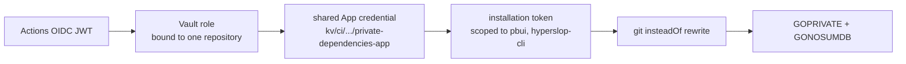

# PROJECT REPORT - Agentlogic and DATA LAB - The Release Train, a CI Debut, and the Road to Production

This report continues [[PROJECT REPORT - Agentlogic and DATA LAB - The Hardening Cycle, DR-37, and the Glazed Migration]]. That report closed with every deliverable on unmerged branches; this one covers the passage from branches to production: seven pull requests opened and merged across five repositories, a repository's first-ever CI runs and the five latent defects they surfaced, the Vault-backed credential chain for private Go modules applied end to end, two npm packages published through a workflow that needed three fixes of its own, and the DATA LAB release verified against its actual binary before the GitOps pin that ships it. The analytical thread running through all of it: **a check that never executes preserves exactly the defects it exists to catch**, and this cycle executed several classes of check for the first time.

> [!summary]
> - **The release was a dependency-ordered train, not a batch.** Version pins and stacked bases enforced the merge order mechanically: hyperslop-cli's rename before datalab's adoption of it, the stream fix before the DR-37 branch stacked on it, pbui before anything whose CI fetches it.
> - **A fork's dormant Actions were an archive of latent defects.** The first runs on `wesen/agentlogic` found five, the sharpest being a `.gitignore` pattern that had made every fresh checkout unbuildable while the code's own comments described the opposite state — a documentation/mechanism divergence that only an executor could expose.
> - **Duplicated workflow steps drift exactly like duplicated code.** The datalab-ui publish workflow failed three times, each failure a step that `ci.yml` had and the publish workflow lacked — plus one hardcoded version expectation that rotted on the first version bump, the same defect class as a copy enumeration.
> - **The release binary was verified as a binary.** A twenty-line stub OIDC issuer satisfied the server's mandatory discovery, the embedded bundle rendered the new landing and demo-v2 catalog in a real browser, and the startup error path incidentally proved DR-37 in production code (`authkit:` prefixes on the discovery failure).

## 1. The train and its couplings

Seven pull requests moved this cycle, and their order was not a convention — it was enforced by artifacts:

| Order | PR | Coupling |
|---|---|---|
| 1 | hyperslop-cli#4 (rename) | datalab#13 pins this branch's commit in go.mod |
| 2 | datalab#13 (rename adoption) | requires 1 |
| 3 | datalab#14 (stream flush fix) | independent |
| 4 | datalab#15 (DR-37 adoption) | **stacked on #14** — its base branch, retargeted by GitHub on merge |
| 5 | pbui#5 (authkit, landing, demo-v2) | datalab#15's CI fetches this module |
| 6 | agentlogic#1 (the platform) | fetches pbui; CI wiring via k3s#264 |
| 7 | k3s#264 (Vault roles) | prerequisite for 6's CI |

Two mechanics are worth recording. A **stacked PR base** (datalab#15 based on #14's branch) confines the review diff to the adoption itself and dissolves automatically — GitHub retargets the base to main when the underlying PR merges. And a **pseudo-version pin** (datalab's go.mod naming the exact hyperslop-cli commit) turns "merge order matters" from tribal knowledge into a build failure for anyone who tries the wrong order.

The order also interacted with local state: a workspace `go.work` spans all five repositories, so main-based work in one repo required the *checkout* of another to sit at the matching revision (the rename branches and main could not coexist; hyperslop-cli had to be detached at `origin/main` for the DR-37 work and returned to the rename branch afterwards). A multi-repo workspace couples working trees the way go.mod couples modules, and the coupling surfaces as "no required module provides package" errors that look like auth failures.

## 2. The CI debut: five defects from zero runs

`wesen/agentlogic` is a fork, and forks keep GitHub Actions dormant until a human enables them. The repository had workflows on its default branch, sixty-three commits of platform work, and **zero workflow runs ever** — a state that read as a CI outage and was actually a latent archive. Enabling Actions and pushing produced five findings in three rounds:

1. **An ungenerated logcopter file** (`pkg/workbenchapp/logcopter.go`): the package was added two cycles earlier and no local flow had run `logcopter-check` since.
2. **The unbuildable-checkout defect**, the sharpest of the five. `pkg/webui/webui.go` embeds the frontend with `//go:embed all:dist`, and both the code comment and the `.gitignore`'s own commentary state the directory IS committed ("`go install` of this module must not need a JavaScript toolchain"). But an unanchored `dist/` pattern — written for the goreleaser output at the repository root — swallowed `pkg/webui/dist` too, so the bundle had never been committed and every fresh checkout failed to compile. Locally this was invisible because `make ui` always left a dist in place. The documentation and the mechanism disagreed for the repository's whole life, and nothing could observe the disagreement until an executor (CI's clean checkout) tried both at once. The fix is one character of anchoring (`/dist/`) plus the 1.7 MB bundle.
3. **`reflect.Ptr` vs `reflect.Pointer`**: CI's golangci 2.12.2 carries a govet analyzer the local 2.4.0 lacks. Linter version skew means "lint passes locally" bounds nothing.
4. **21 gosec findings**, resolved at their sites rather than by exclusion: the seven `int64→uint64` revision casts route through one `dbRevision` helper that clamps a hypothetically corrupted negative row; the remainder were deliberate patterns that now carry their reasons as annotations — operator-flagged `Secure` on cookies, protojson SSE writes, redirects that only target the configured IdP, compile-time SQL fragments, a GC walk over the store's own root. The distinction that guided each choice: a **guard** where the invariant is data-dependent, an **annotation** where the pattern is deliberate and the annotation names the defense.
5. **GHAS-gated jobs** (CodeQL upload, Dependency Review) fail on a private repository without an Advanced Security license; both now skip unless the repo is public — a decision pbui had recorded twelve hours earlier, copied rather than rediscovered. The workflow's gosec invocation was also aligned verbatim with `make gosec`, because two invocation lists drift like any other duplication.

## 3. The credential chain, applied

The infra playbook (`private-go-module-authentication-playbook.md`) states the chain and this cycle exercised every link:

Three details from the application are the reusable knowledge:

- **datalab needed nothing** — it is the playbook's own reference implementation, its composite action already on every Go workflow. The initial PR warning about CI prerequisites was wrong, and correcting a PR body matters: a reviewer who reads a stale warning re-investigates a solved problem.
- **The bound-claims warning is real.** The GitOps PR roles bind `ref: refs/heads/main` and `event_name: push`; a private-dependency role must not, because it serves `test` and `lint` on pull requests. The new `agentlogic-private-dependencies` role binds only the repository — and binds `repository_owner: wesen`, because the active repo is the personal-org fork, a deviation recorded in the role file itself.
- **The playbook's "known gap" was closed in passing**: datalab's role and policy existed only inside Vault, unreviewable and unrestorable; both are now declared in `wesen/2026-03-27--hetzner-k3s/vault/` alongside the new role, and the bootstrap script's generic directory iteration applied all of it idempotently (15 policies, 15 roles).

One asymmetry to keep in mind: the *role* is per-source-repository, the *App credential* is shared. Isolation lives entirely in the Vault role's bound claims, which is why those claims deserve file-by-file review.

## 4. Publishing: duplicated steps drift like duplicated code

`pbui@0.1.1` published cleanly on the first attempt (dry-run, then a `CONFIRM_LATEST`-gated real run). `datalab-ui@0.1.3` took three fixes, and their pattern is the section's point — every failure was a divergence between `publish-datalab.yml` and `ci.yml`, two workflows that describe the same build:

1. **The missing protocol build.** The publish workflow predates datalab-ui's dependency on `@hyperslop-systems/workbench-protocol`, whose dist is deliberately uncommitted; `ci.yml` builds it before typecheck, the publish workflow did not, and typecheck failed on a module that exists but has no compiled output.
2. **The unauthenticated consumer smoke.** The clean-tarball consumer installs `@hyperslop-systems/plot` from the registry; `ci.yml` passes `NODE_AUTH_TOKEN` to that step, the publish workflow passed it only to the earlier install.
3. **A hardcoded version expectation.** The smoke script asserted the workspace dependency rewrite produced exactly `"^0.1.0"` — so the pbui bump to 0.1.1 failed the check whose error message blamed the rewrite. This is the same defect class as a marketing-copy enumeration: a literal that restates a value maintained elsewhere. The fix is the same move as rendering copy from the registry — the script now reads the workspace pbui version and expects `^${version}`.

The general rule the three failures argue for: when two workflows share a build sequence, the sequence belongs in one place (a composite action, a script both call), because each divergence is a publish that fails only at release time — the worst possible moment to discover a drift.

The registry, incidentally, quietly closed an old blocker: `pbui`, `workbench-protocol`, `datalab-ui`, and `plot` all now serve from GitHub Packages, which retires the AGENTLOGIC-3 era's sibling-checkout guard rationale (task s6en) once consumers migrate.

## 5. Verifying the release as a binary

The adoption PR (datalab#16) regenerates the committed `pkg/webui/dist` — but a regenerated bundle proves only that Vite ran. The verification that matters runs the artifact that ships: the Go binary with the bundle embedded.

Two obstacles made this instructive. First, `datalab serve` hard-requires OIDC configuration — there is no dev bypass, deliberately. Discovery, however, validates only the discovery document: a twenty-line Python stub serving `/.well-known/openid-configuration` (issuer equality is the one thing checked) plus an empty JWKS satisfies startup, with no sign-in capability and no pretense of one. This is a legitimate verification tool precisely because the thing under test — the embedded frontend — is orthogonal to the identity provider. Second, the first stub attempt (`https://idp.invalid`) produced a startup failure whose error text began `authkit:` — incidental but pleasing proof that the DR-37 adoption is what runs in the production path, one cycle after the extraction's completion criterion was met.

With the stub in place, a real browser against the release binary confirmed the three claims the PR makes: `/` renders "The chart is not a picture." with the live `filter data.ok = true` step in the hero's pipeline tile; the `#concept` section leads with presentation-based interaction; anonymous `/ui/` lands on the welcome workspace with the demo-v2 catalog, including the new "Defects by line" document.

One merge-conflict recipe from this phase is worth naming as a pattern. datalab#13 (the rename) went stale when #14/#15 merged first, and its conflicts all had the same shape: main's side carries authoritative *content* (the DR-37 rewrite), the branch's side carries a mechanical *transform* (the rename). The resolution is not line-by-line adjudication — it is `checkout --theirs` followed by re-applying the transform (import paths, identifiers, prose; the wire-literal `io.datadrop.event` exempted, as the rename originally decided). **Content-vs-transform conflicts resolve by composition, not by merging.**

## 6. Current state

- All seven PRs merged. `pbui@0.1.1` and `datalab-ui@0.1.3` published.
- The datalab release image `sha-6527b6d` is built, and its GitOps PR (k3s#271) is open — merging it rolls datalab.hyperslop.systems onto the new landing. Two stale auto-opened deploy PRs (#269, #270) are superseded and can close unmerged.
- agentlogic CI is fully green (five workflows: four passing, CodeQL deliberately skipped), on a repository whose checks had never run before this cycle.

## 7. Open questions and near-term next steps

- **Merge k3s#271**, then smoke the live site — the last step of the DATA LAB rollout.
- **agentlogic's first deployment**: Dockerfile and publish profile on datalab's pattern, gitops application + local-path PVC for the SQLite/blob volume, runtime secret provisioning, the ZITADEL relying-party registration (DR-36 — also the first live-IdP test of the OIDC path), DNS, first roll. The infra playbooks cover each step; most of it is repo-work, with the IdP client creation and DNS as console actions.
- **The fork question**: the canonical home is `hyperslop-systems/agentlogic`; the active repo is the `wesen` fork, and the Vault role binds the fork. Promoting the canonical repo requires a sibling role with org claims — two files and a bootstrap run.
- **Consolidate the publish/CI build sequence** (section 4's rule) before the next package release.
- Then the engineering queue: Phase C (workbench-chrome promotion, now unblocked by the merges) and AGENTLOGIC-6.

## Project working rule

Enable every executor early — a CI that has never run, a publish workflow that has never published, a binary that has never booted outside `make dist` — because each first execution audits a class of claims nothing else reads. This cycle's five CI findings, three publish fixes, and one stub-issuer boot were all first executions, and every one of them found something.
