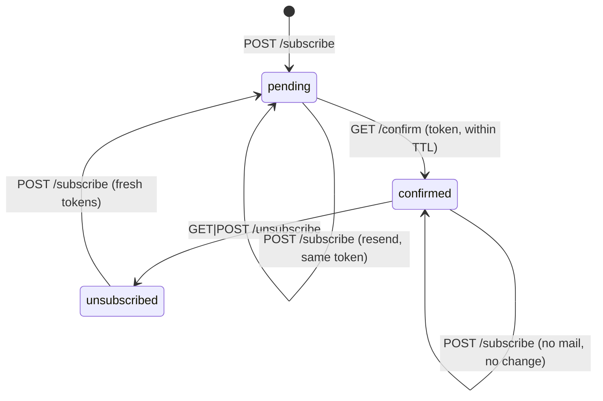

# Hyperslop Mailing List — A Double Opt-In Service from Zero to Production

This report covers the design, review, and deployment of `maillist`, the double opt-in
mailing list service behind the signup row on hyperslop.systems. It runs at
`https://list.hyperslop.systems`, sends through AWS SES as `hello@hyperslop.systems`, and
was taken from an empty repository to production in a single session across four
repositories.

The interesting material is not the CRUD. It is a small number of properties that are easy
to state, easy to believe you have implemented, and easy to break in ways that no obvious
test catches: that a public endpoint must not reveal who is subscribed, that consent is a
state machine rather than a boolean, that an HTTP 200 is not evidence that an endpoint
exists, and that a merged manifest is not a deployed one.

> [!summary]
> - **Service:** Go, SQLite via `modernc` (no cgo), distroless, 16MB image, one replica with `Recreate`.
> - **Delivery:** SES domain identity for the apex, a terraform-managed IAM user for SMTP whose access key is created out-of-band and lives only in Vault, DKIM/MX/SPF in Cloudflare.
> - **Platform:** Argo CD on Hetzner k3s, Vault-issued credentials, HTTP-01 certificate, NetworkPolicy that opens TCP 587.
> - **Review:** an automated review produced 16 comments across two pull requests; 15 were correct and 1 was factually wrong. Four were P1.

## 1. What the service does

A subscription is the pair `(list, email)`. Lists are declared in configuration and never
created at runtime, so an undeclared list id is rejected. Four endpoints:

| Method | Path | Purpose |
|---|---|---|
| `POST` | `/subscribe` | Record a pending subscription and mail a confirmation |
| `GET` | `/confirm` | Promote pending to confirmed |
| `GET`, `POST` | `/unsubscribe` | Tombstone the subscription |
| `GET` | `/healthz` | Readiness, including a database query |

`POST /unsubscribe` exists because RFC 8058 one-click unsubscribe arrives as a POST from
the mail client, not as a link click.

Storage is SQLite. That choice determines the deployment shape: SQLite has a single
writer, so the Deployment runs `replicas: 1` with `strategy: Recreate`, and the driver is
`modernc.org/sqlite`, which is pure Go, so `CGO_ENABLED=0` holds and the binary runs on
`distroless/static` as `nonroot`.

## 2. The endpoint must answer identically, or it is an oracle

`POST /subscribe` is public and unauthenticated. Anyone can submit any address. If the
response differs depending on whether that address is already on the list, the endpoint
answers the question "is this person subscribed?" for any address a stranger cares to
try. That is the property the whole handler is organized around.

The first implementation held it in the obvious place. Three cases produce one response:

```go
// The bool reports whether a confirmation mail should be sent. It is false when
// the address is already confirmed, so re-submitting an address never mails a
// confirmed subscriber again.
func (s *SQLite) Subscribe(ctx context.Context, list, email string) (*Subscription, bool, error)
```

A new address inserts a pending row and mails. A pending address reuses its token and
mails again, so an older confirmation link keeps working. A confirmed address changes
nothing and mails nothing. All three return the same JSON.

The test asserts the responses are byte-identical rather than merely both-successful:

```go
if fresh.Body.String() != known.Body.String() {
    t.Errorf("body differs:\n fresh=%s known=%s — that reveals membership", ...)
}
```

### 2.1 The failure mode the review found

The property held in normal operation and broke during a relay outage. Mail was sent
inline, inside the request:

```go
if err := s.mailer.Send(r.Context(), msg); err != nil {
    writeJSON(w, http.StatusBadGateway, ...)   // 502
    return
}
```

A new or pending address reaches that call and gets 502 when SES is unreachable. A
confirmed address never reaches it, because `shouldSend` is false, and gets 200. The
status code therefore separates confirmed subscribers from everyone else, precisely when
the operator is least likely to be watching. The anti-enumeration property was not
implemented in one place; it was implemented in the store and silently undone in the
transport.

The fix removes delivery from the request path entirely:

```go
func (s *Server) deliver(msg mailer.Outgoing, list string) {
	s.sending.Add(1)
	go func() {
		defer s.sending.Done()
		ctx, cancel := context.WithTimeout(context.Background(), 60*time.Second)
		defer cancel()
		if err := s.mailer.Send(ctx, msg); err != nil {
			log.Error().Err(err).Str("list", list).Msg("sending confirmation failed")
		}
	}()
}
```

The response now depends only on validation and storage, neither of which varies by
membership. A send lost to a restart is recoverable: the row stays pending, and
re-submitting the address resends against the same token. The `WaitGroup` is not
decoration — `serve` calls `srv.Wait()` after the HTTP server stops, so shutdown drains
in-flight sends rather than dropping them.

The general lesson is that an invariant stated over one layer is not an invariant of the
system. This one had a test, and the test passed, because the test exercised the store.

## 3. Consent is a state machine, not a boolean

A subscription has three states and the transitions between them carry the consent
semantics.



Unsubscribing tombstones the row rather than deleting it. Deleting would make a later
signup look like a first signup, which loses the fact that this address once opted out.
Returning from `unsubscribed` goes to `pending` with **new** tokens, so opting back in
requires a fresh confirmation click and cannot happen silently.

### 3.1 The bug that the tombstone test did not catch

Unsubscribing sets `status` and a timestamp. It does not touch `confirm_token`. The
original `Confirm` promoted anything that was not already confirmed:

```go
if sub.Status == StatusConfirmed {
    return sub, nil
}
// ... promote to confirmed
```

So a confirmation email from before the unsubscribe still worked. Clicking a months-old
link silently reversed an opt-out, bypassing both the fresh signup and the token rotation
that the flow promises.

The existing test did not catch this because it tested the wrong half of the property. It
asserted that *signing up again* rotates the tokens. It never asserted that the *old*
token stops working — which is the path an old email actually takes. The fix adds an
explicit refusal:

```go
// An unsubscribe does not invalidate the confirm token on its own, so
// without this an old confirmation email would silently reverse the opt-out.
if sub.Status == StatusUnsubscribed {
    return nil, ErrUnsubscribed
}
```

The new test was verified by removing the fix and confirming it fails:

```
--- FAIL: TestConfirmRefusesAfterUnsubscribe (0.01s)
    store_test.go:234: confirm after unsubscribe: err = <nil>, want ErrUnsubscribed
```

A regression test that has never been observed to fail is an assertion about the author's
intent, not about the code.

### 3.2 Two tokens, not one

Confirm and unsubscribe use separate tokens. With a single token, the confirmation link in
the welcome mail would also unsubscribe whoever followed it with the wrong query
parameter, and any leak of the confirm token would grant the unsubscribe capability. The
tokens are 32 bytes from `crypto/rand`, base64url-encoded, and both are rotated together
whenever the row returns to `pending`.

Pending tokens also expire. The README promised that unconfirmed rows expire before
anything implemented it; the TTL is now 7 days, `Confirm` returns `ErrExpired` past it,
and re-signup rotates. Documentation that describes behaviour the code does not have is
worse than absent documentation, because it is trusted.

## 4. Mail is two documents

Every message is `multipart/alternative` with a text part and an HTML part. The text part
is not a courtesy. A message with no text alternative scores worse with spam filters, and
a meaningful share of recipients read mail as text.

A template is a pair of files under `pkg/templates/files/`. The `.txt` file carries the
subject on its first line, which keeps one template in one place:

```
Subject: Confirm your subscription to {{.ListName}}

Someone (hopefully you) asked to join {{.ListName}}.
```

The `.html` file fills a shared `layout.html`. The HTML is written for mail clients rather
than browsers: table layout, inline styles, no webfonts, so the brand mono degrades to
Courier instead of breaking. Four templates ship — `confirm`, `welcome`, `announce`,
`launch` — and `launch` takes the product's accent colour from the landing page, so a
launch mail is visually the same object as its row on the site.

Correctness here was verified against a real SMTP transaction rather than by inspection. A
minimal SMTP sink captured the messages, and Python's `email` module parsed them back:

```
Content-Type: multipart/alternative
parts: ['text/plain', 'text/html']      ← text first, per RFC 2046
List-Unsubscribe: <https://list.hyperslop.systems/unsubscribe?token=...>
List-Unsubscribe-Post: List-Unsubscribe=One-Click
per-recipient tokens: distinct
```

Part ordering matters: RFC 2046 requires increasing order of preference, so a client that
prefers HTML must find it last. Unit tests would not have caught a reversed order, a
broken quoted-printable encoding, or a missing header, because all three are properties of
the serialized message rather than of the struct.

### 4.1 Per-recipient rendering

`broadcast` renders the template once per recipient rather than once per broadcast,
because each message must carry that recipient's unsubscribe token. Sharing one token
across a broadcast would let any recipient unsubscribe every other. This is asserted
directly:

```go
if byAddr["a@example.com"].UnsubscribeURL == byAddr["b@example.com"].UnsubscribeURL {
    t.Error("both recipients share an unsubscribe link")
}
```

`broadcast` defaults to a dry run. Nothing is delivered without `--send`.

## 5. A 200 is not evidence that an endpoint exists

The landing page posts to the service with `fetch`. The obvious client checks `res.ok`.
That is wrong on this platform, and the reason is a property of the static host rather
than of the service.

Caddy serves every static site in the cluster from one configuration:

```caddyfile
root * /srv/sites/{host}/current
try_files {path} {path}/ /index.html
file_server
```

`try_files` answers **any** unmatched path with `index.html` and HTTP 200 — including a
POST. A request to an endpoint that is not routed therefore returns 200 with an HTML body.
A client that trusts `res.ok` reports a successful signup to the visitor while nothing has
been recorded anywhere.

The client checks the content type before parsing:

```js
var type = res.headers.get('Content-Type') || '';
if (type.indexOf('application/json') === -1) {
    throw new Error('signup is not available yet');
}
```

This was verified against a server that reproduces Caddy's behaviour exactly, not against
a 404. The guard correctly refused a 200 carrying `text/html`, where the naive client would
have shown success.

The same fallback has an operational consequence worth remembering: **HTTP status cannot
be used to test whether an asset exists on this host.** Probing a path that should not
exist returns 200. Only the content type distinguishes a real asset from the fallback.

## 6. Deployment is a sequence of ordering constraints

The service was correct and tested well before it could send a single message. Deployment
spanned four repositories, and nearly every failure in it was an ordering or bootstrapping
problem rather than a logic problem.

### 6.1 An SES identity is not an SES credential

These are separate objects and the distinction is easy to miss. The **identity** is the
verified domain, and it determines what a message may claim in `From:`. The **credential**
is an IAM user whose access key is converted into an SMTP password. Creating the identity
does not produce a credential, and a credential is account-scoped rather than
identity-scoped, so the IAM policy is what restricts sending to one domain:

```hcl
Action = "ses:SendRawEmail"
Resource = [
  module.ses_domain.identity_arn,
  "arn:aws:ses:${var.aws_region}:${...}:configuration-set/${var.configuration_set_name}",
]
```

The identity is the **apex**, `hyperslop.systems`, not a `mail.` subdomain. Verifying
`mail.hyperslop.systems` would only permit sending as `@mail.hyperslop.systems`, and the
requirement was `hello@hyperslop.systems`.

The hand-created user was **imported** rather than recreated, and the plan then showed no
diff on the policy, which confirmed the hand-written policy already matched the declared
one.

### 6.1.1 Where the credential must not live

The SMTP password is a SigV4 derivation over the IAM secret with a fixed date, the message
`SendRawEmail`, and a `0x04` version byte. Terraform can perform that derivation:
`aws_iam_access_key` exposes `ses_smtp_password_v4`. The first implementation used it, on
the reasoning that a derivation in the provider cannot be re-run incorrectly by hand.

That was the wrong trade, and [[Projects/2026/07/26/PROJECT REPORT - ZITADEL SES SMTP - Vault Backed Verification and Recovery]]
had already established why:

> Terraform does not create or retain the SMTP access key secret… Storing either in
> Terraform inputs or provider-managed application resources would extend their lifetime
> into state snapshots, plans, logs, and state-reader permissions.

The consequence is observable rather than theoretical. Pulling the state after that apply
showed both values present on the resource:

```
aws_iam_access_key attributes carrying secret material in state: ['secret', 'ses_smtp_password_v4']
  secret: 40 chars
  ses_smtp_password_v4: 44 chars
```

The boundary that report draws is the correct one, and it is worth stating precisely
because it is not the obvious one. Terraform owns the **sending boundary**: the identity,
DKIM, the MAIL FROM domain, the configuration set, the IAM principal, and the policy that
restricts what that principal may send as. All of those are reviewable, benefit from a
plan, and contain no secrets. Vault owns the **credential values**, whose lifetime should
be as short and as narrowly readable as possible.

Reverting is a rotation, not a detach. The secret was already written to state history, so
removing the resource does not unpublish it. The sequence that actually restores the
property:

1. Issue a new access key out-of-band and write it straight to `kv/apps/maillist/prod/ses`.
2. `terraform state rm aws_iam_access_key.smtp`, then delete that key in AWS, so the copy
   in state history authenticates nothing.
3. Remove the resource and its outputs from the configuration.
4. Restart the Deployment.

Step 4 is not optional and is easy to miss. Environment variables sourced from a Secret are
injected when the container starts. The Vault Secrets Operator refreshing the Secret does
not change the environment of a running process, so the pod would have kept presenting the
deleted credential until it was replaced. Verified after the restart: the SES `Send` metric
moved from 3 to 4 on a live signup.

This report's earlier position on that point was wrong, and the vault should not be read as
carrying two standards. The ZITADEL report's boundary stands. What this work adds is the
other half of its recommendation — that report noted a shared credential should become "a
dedicated IAM SMTP principal … with `ses:SendRawEmail` limited to the verified identity",
which is what `maillist-ses-smtp-prod` now is.

### 6.2 `terraform_remote_state` creates a hard apply order

The DNS zone consumes the SES package's output through `terraform_remote_state`. Until the
SES package has been applied, the state does not exist, and the zone cannot be planned at
all:

```
Error: Unable to find remote state
  with data.terraform_remote_state.ses_hyperslop_systems
```

This is not a warning or a partial plan. It is a hard failure with an error that does not
name the cause. The dependency is now recorded as a comment at the data source.

### 6.3 Provider shape is not portable between zones

The equivalent wiring for another zone could not be copied. That zone is DigitalOcean; its
emitted records use `value` and carry no priority. Cloudflare requires `content`, and the
MAIL FROM record is an MX, which needs a priority the shared resource did not pass through:

```hcl
priority = lookup(each.value, "priority", null)
```

Two further Cloudflare-specific constraints were already documented from earlier work and
cost an apply each to learn: this zone's plan has a DNS-record tag quota of zero, so any
`tags` value fails the apply; and record content must not carry a trailing dot, because
Cloudflare normalizes to the un-dotted form and a dotted value produces perpetual plan
drift. Both are repeated as comments at the point where the code makes the choice, rather
than in a document nobody reads at the moment of editing.

### 6.4 Kubernetes ordering: sync waves, egress, and bootstrap

Three platform constraints applied, and all three would have produced confusing failures.

**The PVC must share the Deployment's sync wave.** `local-path` is
`WaitForFirstConsumer`, so the volume binds only once a consuming Pod exists. A PVC in an
earlier wave makes Argo CD wait for a PVC that is waiting for a Pod that Argo CD has not
created. `scripts/validate_gitops.sh` enforces this invariant across all 48 packages.

**Nothing else in the cluster opens TCP 587.** Egress had to be added explicitly:

```yaml
# SES submission. No other policy in this cluster opens 587, so without
# this rule every confirmation would hang until the SMTP deadline.
- to:
    - ipBlock: {cidr: 0.0.0.0/0}
  ports:
    - {protocol: TCP, port: 587}
```

The failure mode without it is a hang rather than a refusal, which is why the SMTP
deadline added during review matters: `smtp.Dial` takes neither a context nor a timeout, so
a relay that accepts a connection and then stops responding blocks the goroutine
indefinitely. The HTTP server's write timeout does not reach that socket.

**Merging a manifest does not deploy it.** This repository has no app-of-apps or
`ApplicationSet` layer, so a new `Application` object never appears merely because its file
reached `main`. That is documented. What is less obvious, and what actually cost time here,
is that the **AppProject allowlist has the same property**: the file gained the namespace,
the live object did not, and Argo CD rejected the destination. The Application sat at
`Unknown/Unknown` and only the conditions explained it:

```
InvalidSpecError: application destination server 'https://kubernetes.default.svc'
and namespace 'maillist' do not match any of the allowed destinations
in project 'prod-services'
```

Both objects need a one-time `kubectl apply`. This is now in the package README.

### 6.5 CI ordering

Two CI faults, both ordering-related. The image publish succeeded but the GitOps PR job
failed validation because `gitops_pr_token_source=github_app` requires
`gitops_app_repositories` alongside `gitops_app_owner`, and only the owner was set. After
fixing that, a manual `workflow_dispatch` run failed to authenticate to Vault, because the
role binds `event_name: push` — a deliberate restriction, so the correct response was to
trigger a real push rather than loosen the claim.

The remaining subtlety: the workflow ignores `.github/**` and `*.md`, so neither the CI fix
nor a documentation change re-triggers a publish. Since no runtime code had changed since
the published image, the GitOps pin was opened by hand for the same SHA that CI would have
produced.

## 7. What the verification actually proved

Deployment was verified against production rather than against a local approximation.

| Check | Evidence |
|---|---|
| Service reachable, certificate issued | `https://list.hyperslop.systems/healthz` → 200, `Certificate.Ready=True` |
| Argo CD state | `Synced/Healthy`, pod 0 restarts, ready |
| SES verification | `Verified: true`, `Dkim: SUCCESS`, `MailFrom: SUCCESS` |
| Mail actually sent | CloudWatch `AWS/SES` `Send` = 2.0, matching exactly the two valid signups |
| Origin policy in production | allowed origin 200, foreign origin 403, unknown list 400 |
| End to end from the live page | cross-origin submit from hyperslop.systems returned `status: ok` |

Two of these deserve comment.

**A stale metric nearly produced a wrong conclusion.** `SendQuota.SentLast24Hours`
reported `0.0` after signups that had in fact succeeded. Taken alone it suggests nothing
was sent. The CloudWatch `Send` metric reported 2.0 for the same period, matching the two
valid submissions exactly. Two independent sources disagreed, and the more specific one
was correct.

**One check proved nothing, and it took a second look to notice.** The pod logs were
inspected for send failures and were empty, which was read as success. The logs were empty
because **the service emits no logs at all** — not even the startup line. The `logcopter`
logger is never given a writer. Absence of errors in an empty log is not evidence. The real
evidence came from CloudWatch.

That gap is the most operationally significant finding in this report: the service's
failure path — the asynchronous send introduced in section 2.1 — reports exclusively
through a logger that produces no output. A relay outage would currently be silent.

## 8. Review findings

An automated review produced 16 comments across two pull requests. Fifteen were correct.
Four were P1, and the two most serious are described in sections 2.1 and 3.1.

The one incorrect comment asked for the email input to be trimmed before native validation,
on the theory that a pasted address with surrounding whitespace fails `type="email"`. The
HTML value sanitization algorithm for that input type strips newlines and then leading and
trailing whitespace before constraint validation runs. Measured in the browser:

```
set:              "  wesen@example.com  "
input.value:      "wesen@example.com"
checkValidity():  true
```

The described failure cannot occur, so the comment was declined with the measurement
attached rather than accommodated. Accepting a plausible-sounding correction that is
factually wrong adds code that implies a hazard which does not exist.

## 9. Key points

- A property that holds in the store can be undone in the transport. The anti-enumeration
  invariant had a passing test and was still broken by a synchronous send that only fails
  for non-members.
- Unsubscribing must invalidate the confirmation token, not merely change a status. A
  tombstone that leaves a working token is not a tombstone.
- A regression test that has never been observed to fail asserts the author's intent, not
  the code's behaviour. Removing the fix and watching the test fail costs seconds.
- On this platform an HTTP 200 does not mean an endpoint exists. Caddy's `try_files`
  fallback answers any unmatched path, including a POST, with `index.html`. Check the
  content type.
- An SES identity and an SES credential are separate objects. The identity constrains
  `From:`; the IAM policy constrains what the credential may send as.
- Terraform should own the sending boundary and not the credential value.
  `aws_iam_access_key` writes both `secret` and `ses_smtp_password_v4` into state, which
  extends their lifetime into every state snapshot, plan, log, and state-reader's
  permissions.
- Rotating a Secret does not rotate a running Pod. Environment variables sourced from a
  Secret are injected at container start, so a credential change needs a rollout restart.
- `terraform_remote_state` introduces an apply order that fails with an error naming
  neither package.
- Merging a manifest does not deploy it when the cluster has no app-of-apps layer, and the
  AppProject allowlist has the same property with a much more confusing failure.
- Logging that produces no output turns every asynchronous failure into silence, and makes
  "no errors in the logs" a meaningless observation.

## 10. Open items

- **The service emits no logs.** `logcopter`'s logger has no writer configured, so startup,
  send failures, and health-check failures are all silent. This should be fixed before the
  list carries real traffic.
- **The CI GitOps path is unproven.** The validation fault and the Vault role are both
  fixed, but no push-triggered run has exercised the full path, because every commit since
  the image was built touches only ignored paths. The next runtime change will prove it.
- **`site/index-rows.html` remains a byte-identical duplicate** of `index.html`, carried
  along by every change. Deleting it requires updating the CI `test_command` in the same
  commit.
- **No sweeper for abandoned pending rows.** They no longer carry a usable token after the
  TTL, so this is storage tidiness rather than correctness.

## Repository map

| Repository | Contribution |
|---|---|
| `hyperslop-systems/maillist` | Service, templates, broadcast, Dockerfile, publish workflow |
| `hyperslop-systems/infra` | Signup row and dialog on the landing page |
| `wesen/terraform` | SES identity, SMTP IAM user, DKIM/MX/SPF, `list` A record |
| `wesen/2026-03-27--hetzner-k3s` | Argo CD package, NetworkPolicy, Vault policy and roles |

## Related material

Nothing in the vault is marked `deprecated`, so the notes below are still accurate about
what they describe. Several describe an *earlier* arrangement of the same system, and the
differences are worth stating so a reader does not follow the older shape by accident.

| Note | Relation |
|---|---|
| [[Projects/2026/07/26/PROJECT REPORT - ZITADEL SES SMTP - Vault Backed Verification and Recovery]] | Sets the credential boundary this work follows, and asked for exactly the principal this work built |
| [[Projects/2026/07/29/ARTICLE - Static Site Delivery Through GHCR GitOps Argo CD and Cloudflare]] | The delivery path for the page the signup row was added to |
| [[Research/playbooks/infra/PLAYBOOK - Argo CD Application with a local-path PVC on k3s]] | The procedure the `maillist` package follows; its sync-wave rule is why the PVC is in wave 1 |
| [[Projects/2026/07/24/PROJECT REPORT - tiny-idp - From Transcript Audit to an Enforced GitOps Invariant]] | Where that sync-wave rule became an enforced check rather than documentation |
| [[Projects/2026/06/17/PROJECT REPORT - Workshops Wildcard DNS and TLS - DigitalOcean Delegation Deep Dive]] | The DNS-01 wildcard path, contrasted below with the HTTP-01 path used here |
| [[Projects/2026/05/20/ARTICLE - DMETA Examples Production Rollout - Static Publisher GitOps and Vault OIDC]] | The origin of the Vault OIDC GitOps-PR automation that `publish-image.yaml` reuses |
| [[Projects/2026/03/25/PROJ - wesen terraform - Infra Session Report]] | The first SES domain in this account, `mail.scapegoat.dev` |
| [[Projects/2026/03/25/PROJ - Hair Booking - MVP Buildout, Hosted Auth, Vault, and Production Fixes]] | The first SES consumer, and the source of the credential shape at `kv/apps/hair-booking/prod/ses` |
| [[Projects/2026/07/29/PROJ - Hyperslop Systems Infra - Font Lab and Landing Page]] | The landing page project note |

### Where the older notes no longer describe the current system

**The SES credential model.** The March 2026 notes describe SES set up for
`mail.scapegoat.dev` with a credential created by hand and placed in Vault. That was the
right call on the state question and the wrong call on the principal question: one shared
credential served every consumer, so it could not be rotated for one application without
breaking the others, and its policy did not restrict which identity it could send as. The
ZITADEL report of 2026-07-26 named the fix. `maillist` is the first application to have it:
a dedicated IAM user whose `ses:SendRawEmail` is scoped by `Resource` to this identity's
ARN and configuration set, at a Vault path only its own Kubernetes role can read. Treat the shared-credential arrangement as
the thing being migrated away from, not as the pattern to copy.

**The DNS provider is not the same for every zone.** The Workshops report and the March
Terraform report both describe DigitalOcean zones, where a record's value field is `value`
and MX priority is part of the record. `hyperslop.systems` is a Cloudflare zone, where the
field is `content`, `priority` is separate, `tags` cannot be set at all on the current plan,
and record values must not carry a trailing dot. A DNS map copied between the two providers
does not apply; section 6.3 covers the translation.

**Certificate issuance differs by hostname shape.** The Workshops report covers a wildcard
certificate, which requires the DNS-01 challenge and therefore a DNS provider credential in
the cluster. `list.hyperslop.systems` is a single name, so it uses HTTP-01 and needs no such
credential — only that the A record resolves to the ingress before Argo syncs.

**The landing page's typeface.** The Font Lab note describes OPS Cubic Trial as the default
with Berkeley Mono as the fallback. The production page now defaults to IBM Plex Mono, and
the trial fonts are excluded from the published static artifact. The font lab itself is
unchanged.
