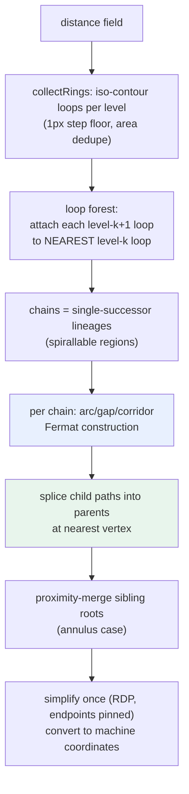

# Connected Fermat Spirals: Retract-Free Pocket Toolpaths from Distance-Field Iso-Contours

This note preserves the algorithm knowledge from implementing connected Fermat spirals (Zhao et al., SIGGRAPH 2016) as a pocket-clearing strategy in the [[PROJ - ABS Bicolor V-Engraver - From Single-File Artifact to Multi-Tool CAM Pipeline|ABS Bicolor V-Engraver]]. The result is a toolpath that fills an arbitrary 2D pocket with **one continuous cut per connected region** — one plunge, one retract, entry and exit adjacent on the outer boundary. On the project's checkerboard test job this reduced 513 plunges to 36 and cut the estimated runtime from 7m45s to 4m36s; against the project's original raster strategy the cumulative reduction is 3.8×.

> [!summary]
> 1. A Fermat spiral fills a region with two interleaved sub-spirals — inward on even offset lanes, outward on odd lanes — so the path begins and ends next to each other on the boundary, which is what makes regional fills composable into one global curve.
> 2. If a CAM pipeline already computes distance-transform iso-contours, the entire algorithm reduces to list manipulation over existing rings: no gradient tracing, no polygon offsetting library, no new geometry code.
> 3. Verify continuous-path algorithms numerically (radius profiles, plunge counts) before trusting renderings; a correct and an incorrect construction can be visually indistinguishable at production lane densities.

## Why this note exists

Pocket machining and additive infill share a problem: contour-parallel fills produce one closed loop per offset level, and every loop costs a retract-travel-plunge cycle (machining) or an extrusion stop/start (printing). Stay-down linking between adjacent rings helps but still leaves one plunge per ring *group*, and ladder-style traversal breaks on any region whose topology changes with depth. The 2016 CFS paper solves the general problem, but it is written against a vector-geometry stack (Clipper offsets, gradient fields, Gauss–Newton curve fairing). The implementation documented here shows that the essential algorithm survives translation to a much cruder substrate — pixel-grid distance fields and marching-squares-style boundary loops — with about 230 lines of code and no new dependencies. That translation, and the traps met along the way, are the reusable content.

## When to use this pattern

- The fill region is defined by a binary mask or a distance field rather than clean vector outlines.
- Offset lanes (iso-contours at spacing `w`) are already available or cheap to compute.
- The cost model punishes path discontinuities: plunge/retract cycles, extrusion toggles, pen lifts, laser on/off latency.
- Constant-depth clearing, so cutting along lane-crossing connectors is harmless — the connector crosses material scheduled for removal at the same depth. The pattern does *not* transfer directly to variable-depth carving.

## Core mental model

A conventional spiral converts nested rings into one path by breaking each ring and joining it to its neighbor, but it travels one way: it ends at the region's center, and the tool must cross the finished fill to leave. A **Fermat spiral** threads the same rings as two interleaved passes — inward on the even-indexed lanes, a single turn at the center, outward on the odd-indexed lanes — so both endpoints land on the outermost lanes, adjacent to each other. Adjacency of entry and exit is the property that composes: a child region's fill can be spliced into its parent's path with two short jumps, and the global result remains a single open curve.

The decomposition question — which parts of a region admit a single spiral — has a precise answer in the paper: a region is *spirallable* iff its distance field has a single local maximum. Operationally, this falls out of the ring structure: follow rings inward level by level; as long as each ring has exactly one successor, the lineage is one spirallable chain; where a ring has two or more successors (the level set split), the chain ends and each successor starts a child chain.

## Pattern shape



### The arc/gap/corridor construction

The paper builds the Fermat path with inward/outward gradient links traced over the distance field. On dense pixel loops there is a simpler equivalent that needs only nearest-point queries and arc-length walking:

```
fermatChainPath(loops L0..L(n-1), step):        # L0 outermost, all CCW
    a[0] = vertex of L0 nearest to the start hint
    a[i] = vertex of Li nearest to a[i-1]        # anchors form a radial corridor
    gapEnd[i] = walk 2*step forward from a[i]    # each lane keeps a small gap

    inward:  for i = 0, 2, 4, ...:
                 emit arc of Li from gapEnd[i] the long way around to a[i]
                 # implicit jump a[i] -> gapEnd[i+2] crosses lane i+1 inside ITS gap
    turn:    short link from the deepest even lane to the deepest odd lane
    outward: for i = lastOdd, lastOdd-2, ..., 1:
                 emit arc of Li from gapEnd[i] to a[i]
```

The invariant that makes this correct: every lane is traversed exactly once minus its gap, and every gap is crossed exactly once by the opposite-parity pass. Coverage is complete, the path does not self-cross while anchors stay aligned within a gap width, and the endpoints (`gapEnd[0]` and `a[1]`) sit on the two outermost lanes about one stepover apart. Winding must be normalized (all loops CCW) so the gaps of radially adjacent lanes extend in the same angular direction — with mixed winding, a crossing jump can miss the intermediate lane's gap.

Verification trace from the implementation (radius profile of the path on a 200px disk, 41 samples): descends 77 → 2 over the first 53% of arc length, one minimum at the center turn, ascends back to 75; endpoints 6.7px apart.

```
77 77 78 78 69 71 71 70 63 63 62 54 54 54 48 46 38 38 31 29 22
 6 19 28 35 34 43 42 50 51 49 58 60 66 66 67 65 75 75 75 74
```

### Connecting regions

Child chains hang off the ring where their parent's level set split. Because each child path enters and exits adjacently, splicing is a list operation: find the parent polyline's nearest vertex to the child's start, and insert the entire child path there. Bottom-up splicing over the chain tree yields one open polyline per root. One class of region escapes the tree: an annular pocket has two boundary families (outer shrinking, inner growing) that never share a parent, yet their deepest lanes meet at the medial circle. A post-pass merges any two root paths whose closest approach is within a few lane widths, using the same splice.

## Common failure modes

**Containment parenting breaks on holes.** The obvious way to build the ring forest — parent = the previous-level loop that geometrically contains this loop — is wrong for annular regions: the growing inner-boundary loops are "contained" by outer-family loops and get attached to the wrong lineage. Nearest-loop parenting (minimum inter-loop distance to the previous level) keeps each boundary family in its own chain and coincides with containment on simple regions. This distinction consumed the single design revision of the implementation.

**Sub-pixel offset steps create duplicate lanes.** When the stepover is smaller than one pixel of the distance field, adjacent iso-levels quantize to identical masks and the same ring is emitted — and cut — twice. Floor the step at one pixel and skip any level whose region area equals the previous level's; for nested level sets, equal area is a proof of set equality, so the dedupe is exact rather than heuristic.

**Renderings cannot validate the construction at production density.** At 240 lanes in a 500-pixel canvas, a correct Fermat fill, a broken lane-weaving path, and a plain contour fill all render as the same moiré-filled disk. The implementation was first "verified" by a screenshot that momentarily suggested a serious bug. The decisive instruments were numeric: the radius profile above, plunge counts in the emitted G-code (one per region), and a coverage-length comparison against the contour strategy (within ±15%, as predicted by gap losses versus crossing gains). Renderings became useful only after regenerating with deliberately fat lanes chosen for legibility rather than realism.

**Metric anisotropy becomes visible at fat lane spacing.** The 3-4 chamfer distance transform overestimates diagonals by up to ~6%; at engraving lane spacing this is invisible, but the legibility renders showed clearly octagonal "circles." Harmless for coverage (lanes over-overlap on diagonals, never gouge), but it sets the boundary of this substrate: if lane geometry itself becomes a quality requirement, the chamfer transform must be replaced by an exact Euclidean transform (Felzenszwalb's algorithm is the standard O(n) choice).

## Working rules

- Simplify the assembled path once, at the end, with an algorithm that pins endpoints (Ramer–Douglas–Peucker). Simplifying rings before assembly destroys the anchor alignment the corridor depends on.
- Do all geometry in one coordinate space (pixels) and convert to machine coordinates in the final map. Mixed-space nearest-point queries were the largest source of near-bugs during development.
- Choose the corridor anchor of each chain from the attachment context (parent's splice point, or the machine's current position for roots) so splice jumps and entry travel stay short.
- Gap length 2× stepover: wide enough that the crossing jump clears both gap endpoints, narrow enough that the crossing pass's tool width covers the uncut sliver — this holds arithmetically whenever stepover ≤ 50% of the cut width, and should be re-verified against a physical cut when either parameter changes.
- Count plunges in the emitted program as a regression metric. "One plunge per connected region" is a property a single grep can check on every generated file.

## Results on the reference test suite

Same patterns, tools, and Z choreography; only the clearing strategy differs. Estimates are pure motion time from the project's parser-based duration model.

| Pattern (20mm) | Contour-parallel | Fermat | Plunges |
|---|---|---|---|
| checkerboard | 7m 45s | 4m 36s | 513 → 36 |
| text | 4m 13s | 3m 5s | — |
| star | 1m 39s | 1m 0s | — |
| filled square | 1m 1s | 52s | — |
| cat sample (30mm) | 10m 40s | 6m 58s | 672 → 143 |

The cat is the instructive row: real artwork fragments into many small disjoint regions after rest machining, and each still requires its plunge — the strategy removes *redundant* discontinuities, not topological ones.

## Deliberate omissions

The paper's Gauss–Newton curve fairing (which removes staircase corners at reroutes and evens lane spacing) is skipped: the lanes here originate from pixel level sets and are RDP-simplified, so residual jaggies are no worse than the incumbent strategy's, and a V-bit at 0.12mm depth is insensitive to them. Also omitted: the minimum-weight spanning tree over connecting segments (the containment/nearest forest is its degenerate case for strictly nested level sets) and any guarantee about climb-versus-conventional cut direction, which the winding normalization sacrifices.

## Related notes

- [[PROJ - ABS Bicolor V-Engraver - From Single-File Artifact to Multi-Tool CAM Pipeline]] — the host project, including the pipeline architecture and the Z-choreography work this strategy composes with.
- Primary source: Zhao, Gu, Huang, Garcia, Chen, Tu, Benes, Zhang, Cohen-Or, Chen. "Connected Fermat Spirals for Layered Fabrication," SIGGRAPH 2016. Local copy and implementation diary: `ttmp/2026/08/01/MILL-04--connected-fermat-spiral-pocketing-strategy/` in the repo (design doc with decision records, six verification images, and the step-by-step diary).
- Implementation: `src/lib/fermat.ts`; tests `src/lib/fermat.test.ts`; structural check `scripts/check-fermat-structure.ts`.
