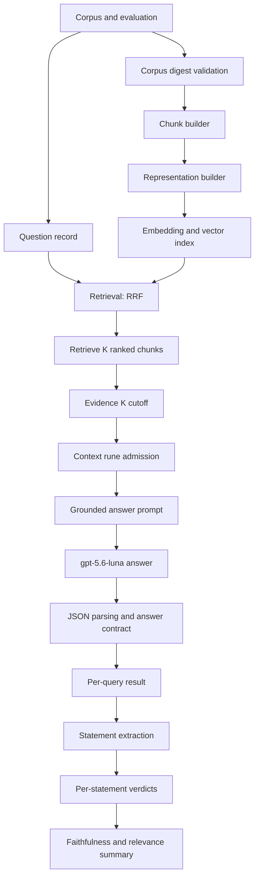

# Deep Dive: Diagnosing Narrow Grounded Answers in TTC RAG

> [!summary]
> - Evidence admission is the strongest demonstrated cause of narrow answers.
> - More retrieved chunks improve Recall@10 but do not automatically improve answer validity.
> - Multipart prompting requires request-level completeness measurements; output length is not coverage.

## Executive Summary

The TTC RAG evaluation produced a recurring symptom: a question containing
several explicit requests sometimes received only one answer. The symptom was
initially ambiguous. It could have resulted from retrieval failure, incomplete
chunk construction, an evidence cutoff that removed relevant material after
retrieval, a generation prompt that did not require request-by-request
coverage, or a contract validator that classified otherwise useful output as
invalid. Treating the symptom as a single prompt defect would have hidden these
distinct failure modes.

This report analyzes a controlled experiment sequence over the 200-document TTC
corpus and its 148-question evaluation set. The sequence varied evidence count,
context budget, chunk size, and answer prompt while preserving the remaining
configuration. It then confirmed three representative configurations over all
148 questions and ran the baseline through the two-stage `gpt-5.6-luna` judge.
The experiment stores complete inputs, preparation artifacts, retrieval rows,
admitted and omitted evidence, provider responses, parsed answers, contract
decisions, usage data, and judge records under the ticket's `sources/`
directory.

The strongest demonstrated cause is evidence admission. Retrieval can return
relevant chunks while the context policy supplies fewer complete chunks to the
answer generator. With a 1,500-rune context budget, every pilot query omitted
at least one retrieved chunk and only 5 of 12 answers were contract-valid. At
3,000 runes, 11 of 12 queries omitted chunks and 6 of 12 were valid. At the
baseline 12,000-rune budget, all five admitted chunks fit for the full
confirmation, so the omission mechanism was inactive.

The full confirmation adds an important result. Increasing evidence K from 5
to 8 improved retrieval Recall@10 from 0.8183 to 0.8588, but valid answers
decreased from 112/148 to 108/148. The additional retrieved material therefore
did not improve the current answer contract and may have introduced distractors
or competing claims. The multipart prompt changed output shape: it increased
mean answer length from approximately 273 to 539 characters in the full run,
but valid answers remained almost unchanged at 111/148. The prompt is useful
for enforcing explicit coverage, but it cannot restore evidence that was not
retrieved or admitted.

The same-model judge found high support among answers that reached judging:
108 answers were judged, with mean faithfulness 0.9901 and mean relevance 1.0.
This result is diagnostic rather than independent validation because answer
generation, statement extraction, and verdict generation all used
`gpt-5.6-luna`. The dominant operational problem is therefore answer
contract validity and completeness, not a high rate of unsupported claims in
the subset that passed the contract.

The practical conclusion is to keep the baseline evidence K=5 and a
non-binding context budget while completing explicit completeness annotations.
The next decisive experiment is a multipart-prompt/K=8 comparison with a
non-binding context budget, scored against those annotations. That experiment
will distinguish improved coverage from increased output length and will make
the production decision measurable.

## 1. Problem Definition

### 1.1 The observed behavior

The affected questions are not uniformly short factual queries. Several contain
multiple requests joined by conjunctions or expressed as a sequence of
procedural requirements. A correct answer must identify each request, locate
the supporting evidence, state the answer for each request, and avoid claiming
facts that the evidence does not support. A response that answers only the
first request can be fluent, cited, and factually correct for the part it
addresses while still failing the task.

The answer-quality harness already had a structured answer contract. It records
whether the provider response parses, whether required fields are present,
whether citations reference admitted chunks, and whether the answer is an
explicit abstention. These checks are necessary but not sufficient for
completeness. A contract-valid answer can still omit one request unless the
evaluation includes a request-level coverage annotation.

The experiment therefore treats “one answer” as a decomposition problem. The
system is analyzed as a sequence of boundaries:

1. The question is represented and used for retrieval.
2. Retrieval produces ranked chunks.
3. The evidence policy selects a prefix or subset for generation.
4. The context policy admits complete chunks subject to a rune budget.
5. The answer prompt instructs the model how to use the admitted evidence.
6. The answer contract validates the returned structure.
7. The judge decomposes valid answers into statements and verifies support.

Each boundary can remove information or change the observable output. The
experiment changes one boundary at a time before combining representative
settings.

### 1.2 Research hypotheses

The design tests four hypotheses.

| Hypothesis | Mechanism | Observable prediction |
|---|---|---|
| H1: chunking | Relevant material is split across chunks or diluted by small chunks. | Chunk size changes retrieval and request-level coverage while other controls remain fixed. |
| H2: evidence admission | Retrieved chunks are not all supplied to generation. | Tight context budgets create omitted chunks and reduce answer validity or completeness. |
| H3: prompt structure | The generator does not explicitly enumerate requests. | A multipart prompt increases numbered coverage and answer length without changing retrieval. |
| H4: interaction | Retrieval, admission, and prompt effects interact. | A prompt improvement is strongest when the relevant evidence is present and admitted. |

H2 is the most directly testable because the harness records both retrieved
chunks and omitted chunk identifiers. H3 is also directly testable because the
prompt is copied into every run and retrieval is held constant. H1 requires
careful interpretation because changing chunk size changes both the index and
the granularity of the evidence passed to generation.

## 2. Experimental System

### 2.1 Corpus and evaluation binding

The evaluation file is cryptographically bound to the 200-document corpus at
`datasets/ttc/corpus.json`. The corpus digest recorded by the evaluation is
`af6538...`; using `corpus-2000.json` or `corpus-full.json` produces different
input digests and is rejected before provider execution. This binding is a
critical reproducibility condition. A retrieval score computed against a
different corpus is not a confirmation run, even if the question IDs are the
same.

The complete evaluation contains 148 questions. Retrieval metrics are reported
for the 144 questions with judged retrieval targets. Answer generation and
contract accounting cover all 148 questions, including questions for which
retrieval metrics are not defined.

The canonical pilot subset contains twelve IDs selected to include the narrow
answer symptom and representative multi-part procedural questions:

```text
ttc-expand-008  ttc-expand-015  ttc-expand-019  ttc-expand-022
ttc-expand-037  ttc-expand-042  ttc-expand-050  ttc-expand-057
ttc-expand-059  ttc-expand-062  ttc-y-002        ttc-y-003
```

### 2.2 Provider assignments

Answer generation and judging use the explicitly selected `gpt-5.6-luna`
profile. The composite profile `ttc-live-luna-codex` selects the OpenAI
Responses provider through the ChatGPT subscription integration. The answer
and judge records include the selected model and provider role. `gpt-5.6-luna-low`
is not used for this report. Umans is retired and does not appear in the new
runs.

The representation and indexing artifacts generated in earlier model eras are
not silently compared as if they were produced by Luna. LunaRoute DeepSeek and
GLM outputs remain valid historical artifacts, but any comparison must record
their model era and role. This separation prevents a change in representation
provider from being misclassified as a chunking or prompt effect.

### 2.3 Pipeline architecture

The answer-quality command writes a self-contained run directory. Its stages
are shown below.



The pipeline has two distinct cutoffs. `RetrieveK` controls how many ranked
chunks are available to the run. `EvidenceK` controls how many of those chunks
are placed in the generation evidence set. The context policy then applies a
third constraint: it appends complete chunks only while the configured rune
budget permits them. A run can therefore retrieve twenty chunks, admit five
evidence chunks, and supply fewer than five complete chunks to the model.

### 2.4 Run record layout

Each run directory contains enough material to inspect the answer without
reconstructing transient provider state.

| Path | Purpose |
|---|---|
| `config.json` | Effective command configuration and experiment knobs. |
| `inputs/corpus.json` | Exact corpus copy used by the run. |
| `inputs/evaluation.json` | Exact evaluation copy and digest binding. |
| `inputs/prompt.txt` | Prompt used for answer generation. |
| `preparation/chunks.json` | Chunk boundaries, lengths, and source IDs. |
| `preparation/representations.json` | Representation records used for indexing. |
| `indexes/` | Bleve and vector index artifacts. |
| `results/per-query.jsonl` | Retrieval, context, generation, and contract data per question. |
| `results/generated-answers.json` | Parsed and raw generation records. |
| `results/answer-contract-summary.json` | Validity, parse, contract, and abstention counts. |
| `results/retrieval-summary.json` | MRR, Recall@10, nDCG@10, and hit rate. |
| `results/judge-per-query.jsonl` | Statements and evidence-backed verdicts. |
| `results/judge-summary.json` | Judge configuration and aggregate scores. |
| `summary.md` | Human-readable retrieval and contract summary. |

This layout matters because a single aggregate score cannot explain whether a
failure occurred before or after retrieval. The omitted chunk identifiers and
the copied prompt are especially important for the narrow-answer diagnosis.

## 3. Data Model and Measurement Semantics

### 3.1 Question, chunk, and evidence records

The harness operates on explicit records rather than opaque strings. A
question has an ID, the user text, and evaluation targets. A chunk has a stable
ID, source document ID, ordinal, text, and rune length. A retrieval row stores
the ranked chunk IDs and retrieval metrics. The generation context stores the
admitted evidence and the omitted chunk IDs.

An abbreviated per-query structure is:

```json
{
  "query_id": "ttc-expand-008",
  "arm": "rrf",
  "retrieval": {
    "ranked_chunk_ids": ["doc-17#chunk-0", "doc-17#chunk-1"],
    "retrieve_k": 20,
    "evidence_k": 5
  },
  "generated_answer": {
    "context": {
      "evidence": [
        {"chunk_id": "doc-17#chunk-0", "text": "..."}
      ],
      "omitted_chunk_ids": ["doc-17#chunk-2"],
      "used_runes": 1180,
      "max_runes": 1500
    },
    "answer": {
      "answer": "...",
      "citation_chunk_ids": ["doc-17#chunk-0"],
      "abstained": false
    },
    "contract": {"valid": false}
  }
}
```

The distinction between `ranked_chunk_ids`, `evidence`, and
`omitted_chunk_ids` is the central diagnostic distinction. Inspecting only the
retrieval list would incorrectly conclude that the generator saw all relevant
material.

### 3.2 Retrieval metrics

The full runs report standard ranked-retrieval metrics for 144 questions:

- MRR measures the reciprocal rank of the first relevant result.
- Recall@10 measures whether the relevant target set is recovered in the top ten.
- nDCG@10 accounts for graded relevance and rank position.
- Hit rate@10 measures the fraction of queries with at least one relevant hit.

These metrics describe retrieval, not answer completeness. A high hit rate can
coexist with a narrow answer if the relevant chunk is not admitted or if the
prompt does not enumerate every request. Conversely, an answer can be
contract-invalid even when retrieval is correct because the provider response
does not satisfy the JSON schema or abstention rules.

The current retrieval summary also changes when `EvidenceK` changes. This
indicates that the harness's reported retrieval measurement is not completely
independent of the evidence admission cutoff. The raw ranked lists remain
available, but the metric implementation must be corrected before treating a
K sweep as a pure retrieval comparison.

### 3.3 Answer contract metrics

The contract counts are intentionally separate from judge scores.

| Metric | Definition |
|---|---|
| Total | Number of answer rows attempted. |
| Valid | Rows satisfying the answer schema and contract rules. |
| Parse failures | Provider responses that cannot be parsed as the expected structured response. |
| Contract failures | Parsed responses that violate required answer or citation rules. |
| Abstentions | Responses explicitly stating that the evidence is insufficient, according to the harness classification. |

The contract is a gate, not a semantic completeness score. It catches malformed
or unsupported structures, but it does not know how many user requests were
answered unless the evaluation supplies that information.

### 3.4 Judge semantics

The judge is a two-stage process. The first stage extracts atomic statements
from an answer. The second stage checks each statement against the admitted
evidence and returns a support verdict with evidence references and a reason.
Faithfulness is computed over supported statements. Relevance is computed at
the answer level for the judged rows.

```go
type StatementVerdict struct {
	Statement int      `json:"statement"`
	Text      string   `json:"text"`
	Supported bool     `json:"supported"`
	Evidence  []int    `json:"evidence"`
	Reason    string   `json:"reason"`
}

type JudgeRow struct {
	QueryID          string            `json:"query_id"`
	Status           string            `json:"status"`
	Statements       []string          `json:"statements,omitempty"`
	Verdicts         []StatementVerdict `json:"verdicts,omitempty"`
	Faithfulness     float64           `json:"faithfulness,omitempty"`
	AnswerRelevance  float64           `json:"answer_relevance,omitempty"`
}
```

The judge result must be interpreted with its model assignment. In this study,
the answer model and judge model are identical. A high score shows internal
consistency between the generated answer and the evidence supplied to the
judge. It does not measure disagreement with an independent evaluator.

## 4. Experiment Design

### 4.1 Fixed baseline

The baseline uses RRF retrieval, 1,200-rune chunks with 120-rune overlap,
`RetrieveK=20`, `EvidenceK=5`, and a 12,000-rune context budget. The answer
generation profile is `ttc-live-luna-codex`, selecting `gpt-5.6-luna`. The
baseline prompt is the versioned grounded-answer prompt copied into the run.

The large context budget is deliberate. It prevents context admission from
being the active variable in the initial EvidenceK and prompt comparisons. A
separate context sweep then reduces the budget to expose admission behavior.

### 4.2 Pilot matrix

The twelve-query pilot varies one principal parameter at a time.

| Family | Values | Held fixed |
|---|---|---|
| Evidence K | 1, 3, 5, 8, 12 | 1,200/120 chunks; 40,000-rune context |
| Context budget | 1,500; 3,000; 6,000; 24,000; 40,000 | Evidence K=5; 1,200/120 chunks |
| Chunk size | 600/60; 1,200/120; 2,400/240 | Evidence K=5; 12,000-rune context |
| Prompt | Baseline; multipart coverage | Baseline retrieval and evidence settings |

The pilot is diagnostic rather than a production selection. Twelve questions
are sufficient to expose context omissions and prompt shape changes, but not
to establish stable answer-quality estimates.

### 4.3 Full confirmation

The full confirmation repeats three representative settings over all 148
questions:

1. Baseline: K=5, baseline prompt, 12,000-rune context.
2. Evidence K=8: K=8, baseline prompt, 40,000-rune context.
3. Multipart prompt: K=5, multipart prompt, 12,000-rune context.

This sequence tests whether pilot observations survive a larger question set
and separates retrieval improvement from generation behavior.

## 5. Pilot Results

### 5.1 Evidence count

The EvidenceK pilot produced the following validity and citation pattern.

| Evidence K | Valid answers | Mean cited chunks | Mean answer characters |
|---:|---:|---:|---:|
| 1 | 5/12 | 0.42 | 100 |
| 3 | 6/12 | 1.08 | 253 |
| 5 | 9/12 | 2.33 | 381 |
| 8 | 7/12 | 2.75 | 453 |
| 12 | 8/12 | 2.50 | 394 |

The curve is not monotonic. Increasing K from 1 to 5 improves validity and
citation breadth, but K=8 and K=12 do not improve validity over K=5. The
additional chunks can supply missing facts, but they also increase the number
of claims and potential distractors the generator must reconcile. The pilot
does not identify an optimal K; it identifies a trade-off that requires
request-level completeness scoring.

### 5.2 Context admission

The context sweep provides the strongest causal evidence. At 1,500 runes, all
12 queries omitted at least one candidate chunk and only 5 answers were valid.
At 3,000 runes, 11 queries omitted chunks and 6 answers were valid. At 6,000,
24,000, and 40,000 runes, the five baseline chunks fit and the pilot outputs
were identical to the baseline: 9 valid answers and no omitted chunks.

| Context budget | Queries with omissions | Mean admitted chunks | Valid answers |
|---:|---:|---:|---:|
| 1,500 | 12/12 | 1.25 | 5/12 |
| 3,000 | 11/12 | 2.50 | 6/12 |
| 6,000 | 0/12 | 5.00 | 9/12 |
| 24,000 | 0/12 | 5.00 | 9/12 |
| 40,000 | 0/12 | 5.00 | 9/12 |

The threshold is determined by actual chunk lengths. A nominally large budget
does not guarantee complete evidence for every possible chunking strategy, and
a small budget can silently remove a relevant chunk while retrieval metrics
remain high. The run record must therefore expose `UsedRunes`, `MaxRunes`, and
`OmittedChunkIDs` in every answer-quality report.

### 5.3 Chunk size

The 600/60 pilot arm produced 6/12 valid answers and a mean of 1.17 cited
chunks. The 1,200/120 baseline and 2,400/240 arm each produced 9/12 valid
answers, with mean cited chunks of approximately 2.33 and 2.42 respectively.
The larger arm also produced longer answers. This result supports a chunking
effect but does not isolate whether larger chunks improve retrieval, evidence
coverage, or the model's ability to combine related instructions.

Chunk size changes the unit of retrieval and the unit of citation at the same
time. A 600-rune chunk can separate a definition from its qualification; a
2,400-rune chunk can preserve that relation but may include unrelated text.
The correct evaluation therefore needs relevant-unit annotations, not only
document-level retrieval targets.

### 5.4 Multipart prompt

The multipart prompt instructs the model to identify every request, answer each
request explicitly, use numbered answers when appropriate, cite material
claims, and mark unsupported portions. In the pilot it increased answer length
and caused visible request-by-request formatting, but validity was 8/12 versus
9/12 for the baseline. The prompt changed output behavior without improving
the evidence available to the model.

This is the expected boundary behavior. A prompt can change how the model
organizes admitted evidence. It cannot recover a chunk that retrieval missed or
the context policy omitted. The prompt should therefore be evaluated together
with evidence completeness, not as an isolated text-generation change.

## 6. Full Confirmation Results

### 6.1 Aggregate comparison

The full confirmation results are:

| Configuration | Evaluated retrieval queries | MRR | Recall@10 | Valid | Contract failures | Abstentions |
|---|---:|---:|---:|---:|---:|---:|
| Baseline K=5 | 144 | 0.9221 | 0.8183 | 112/148 | 36 | 40 |
| K=8 | 144 | 0.9235 | 0.8588 | 108/148 | 40 | 45 |
| Multipart K=5 | 144 | 0.9221 | 0.8183 | 111/148 | 37 | 39 |

The K=8 arm improves retrieval metrics while decreasing contract validity.
This is not a paradox; retrieval and answer generation consume different
representations of the result set. K=8 supplies three additional chunks to the
evidence stage, but the generator must interpret those chunks under the same
answer contract. The extra material can increase coverage for some questions
and increase ambiguity for others.

The multipart arm leaves retrieval exactly unchanged because the corpus,
chunking, index, retrieval settings, and evidence settings are unchanged. Its
valid count is one lower than baseline, while its mean answer length rises from
approximately 273 to 539 characters. Length is therefore not a valid proxy for
request coverage.

### 6.2 Full-run interpretation

The full baseline has 36 contract failures and 40 abstentions under the
harness's accounting. The judge pass later identifies 36 invalid rows and 4
abstentions among the 148 rows it receives. The difference reflects the
contract and judge classification layers, not a discrepancy in the raw answer
count. Both views are retained because contract validity determines whether an
answer can be served, while judge status determines whether semantic support
can be measured.

The full results reject two simple production changes. First, increasing K is
not justified by Recall@10 alone because the current answer-validity measure
declines. Second, replacing the prompt with the multipart version is not
justified by length or formatting alone. Both changes need request-level
coverage evidence.

## 7. Same-Model Luna Judging

### 7.1 Execution

The baseline run was passed through statement extraction and per-statement
verdict generation. Both stages used the explicit `gpt-5.6-luna` profile, and
the answer generator also used `gpt-5.6-luna`. The complete run is:

```text
sources/03-same-model-judge-baseline-rerun/
  20260801T201547.048928374Z-answer-quality-aeb4e7a06841/
```

The run completed all 148 answer rows. It judged 108 rows, recorded 4
abstentions, and excluded 36 contract-invalid rows from semantic judging.

### 7.2 Results

| Judge result | Value |
|---|---:|
| Answer rows | 148 |
| Judged rows | 108 |
| Abstained rows | 4 |
| Contract-invalid rows | 36 |
| Mean faithfulness | 0.9901 |
| Mean relevance | 1.0000 |

The judged rows are highly supported by the evidence supplied to the judge.
The result narrows the diagnosis: once an answer passes the contract and
contains statements, unsupported factual claims are uncommon under this judge.
The larger failure population is answer emission: abstention, contract
failure, or incomplete request coverage.

### 7.3 Limitation

The judge is not independent. The same model family generated the answer,
extracted its statements, and produced the verdicts. Shared model behavior can
make the judge reproduce the generator's interpretation or fail to detect a
systematic omission. The score is useful for internal evidence-consistency
diagnostics, but it is not an acceptance gate for production quality.

Because Umans is unavailable, the current experiment does not claim a
cross-family judge result. The report records the limitation explicitly rather
than substituting an unrequested model or silently treating Luna as an
independent evaluator.

## 8. Failure Decomposition

### 8.1 Retrieval failure

Retrieval failure occurs when the relevant chunk is absent from the ranked
result set. It is measured by Recall@10, MRR, and the raw ranked chunk IDs. A
prompt change cannot fix this failure. Chunk size and representation changes
can fix it, but they must be evaluated against the same corpus digest and
question targets.

### 8.2 Evidence cutoff failure

Evidence cutoff failure occurs when the relevant chunk is in the retrieved set
but excluded by `EvidenceK`. The EvidenceK pilot shows that K=1 is often too
narrow, while K=8 and K=12 do not automatically improve validity. The correct
metric is not only the number of supplied chunks; it is whether each user
request has at least one admitted supporting chunk.

### 8.3 Context admission failure

Context admission failure occurs after EvidenceK. The policy admits complete
chunks until the rune budget is exhausted and records skipped chunks. The pilot
shows a direct relationship between omission and validity. This is the clearest
currently demonstrated mechanism for the symptom.

### 8.4 Prompt coverage failure

Prompt coverage failure occurs when the generator receives adequate evidence
but does not enumerate the user's requests. The multipart prompt reduces this
risk by requiring explicit request identification and separate answers. It
does not change retrieval or evidence admission, and its full-run validity is
not better than baseline. Its value must be measured by completeness
annotations, not answer length.

### 8.5 Contract failure

Contract failure occurs when the generated response cannot be served under the
structured answer schema. It may reflect malformed output, missing citations,
unsupported claims, or an answer that does not satisfy abstention rules. The
contract failure count is operationally important because a semantically good
answer that cannot be parsed is still unusable by the application.

The decomposition is summarized below.

| Boundary | Evidence available? | Typical symptom | Primary diagnostic |
|---|---|---|---|
| Retrieval | No relevant ranked chunk | Correct answer absent or unsupported | Recall@10, raw ranked IDs |
| Evidence K | Relevant chunk retrieved but excluded | One request omitted | Retrieved vs evidence IDs |
| Context budget | Evidence selected but skipped | Abruptly narrow answer; omitted IDs | Used/max runes, omitted IDs |
| Prompt | Evidence present but not enumerated | One request answered, others ignored | Prompt copy, request-level annotation |
| Contract | Response not serviceable | Invalid or abstained row | Contract fields and error reason |
| Judge | Validity/support interpretation uncertain | Score disagreement | Statement and verdict records |

## 9. Reading a Failing Run

### 9.1 Start with the question record

The first diagnostic step is to read the question text and enumerate its
requests independently of the generated answer. This prevents the answer from
defining the standard by which it is judged. For a question that asks for a
definition, a condition, and a procedure, the evaluator should record three
requests before inspecting retrieval.

The next step is to inspect the evaluation target. If the target contains only a
single document-level relevance label, it can answer whether retrieval found a
related source but not whether every request is supported. The raw target must
be treated as a retrieval target, not as a completeness annotation.

### 9.2 Compare ranked, selected, and admitted evidence

The following inspection sequence identifies the first boundary at which
support disappeared:

```text
ranked_chunk_ids      = chunks returned by RRF
selected_chunk_ids    = first EvidenceK chunks used by the arm
admitted_chunk_ids    = complete chunks that fit the context budget
omitted_chunk_ids     = selected chunks skipped by the context policy
citation_chunk_ids    = chunks cited by the generated answer
```

The sets should be compared in that order. If a supporting chunk is absent from
`ranked_chunk_ids`, the failure is retrieval or representation. If it is ranked
but absent from `selected_chunk_ids`, the failure is EvidenceK. If it is
selected but absent from `admitted_chunk_ids`, the failure is context
admission. If it is admitted but not cited or reflected in the answer, the
remaining candidates are prompt coverage, generation behavior, or contract
classification.

This comparison is more informative than reading the final answer first. A
fluent answer can obscure that its supporting chunk was never supplied. The
run format makes the comparison deterministic because chunk IDs are stable
within the copied preparation artifacts.

### 9.3 Read the context accounting

For each row, inspect `used_runes`, `max_runes`, the number of evidence chunks,
and `omitted_chunk_ids`. A row with `used_runes` substantially below
`max_runes` can still omit a chunk when the omitted chunk itself exceeds the
remaining budget. A row with no omissions does not prove that the evidence is
complete for the question; it proves only that all selected chunks fit.

The distinction matters for chunk-size experiments. Larger chunks can consume
the budget sooner even when the number of chunks is lower. The report must
therefore record rune lengths and not only K values. Comparing K=5 across two
chunk sizes without recording total admitted runes conflates evidence count and
context volume.

### 9.4 Read the answer and contract together

The parsed answer should be inspected alongside the contract result and raw
provider response. The parsed answer reveals what the generator attempted. The
contract result reveals why the harness accepted or rejected it. The raw
response is required when parsing or schema validation fails.

A useful row review records:

- the number of explicit user requests;
- the number of answer items or distinct claims;
- the citation IDs used by each item;
- whether each cited chunk was admitted;
- whether the answer explicitly abstained for unsupported requests;
- the contract failure reason, if any.

These fields support an error taxonomy that aggregate valid counts cannot
provide. In particular, they distinguish “answered one of three requests”
from “abstained because no evidence was available.” Both reduce the valid count,
but they require different interventions.

### 9.5 Read judge rows only after contract classification

The judge does not repair invalid rows. Contract-invalid answers are preserved
in `judge-per-query.jsonl` with an invalid status and are not decomposed into
statements. Abstentions are similarly represented without semantic relevance
judgment. This ordering keeps semantic scores from being inflated by silently
repairing malformed output.

For a judged row, statement extraction can itself reveal a coverage issue. If
the answer contains one statement while the question contains three requests,
the high faithfulness of that one statement does not imply task success. Judge
faithfulness and request completeness must be reported as separate axes.

## 10. Reproducibility, Caching, and Failure Recovery

### 10.1 Why configuration copies matter

Provider profiles, prompt files, and corpus paths are mutable inputs. The run
directory copies the effective configuration and prompt so a later reader can
reconstruct the experiment even if the default profile changes. The command
line remains useful for rerunning, but the copied configuration is authoritative
for what actually executed.

### 10.2 Cache behavior

The experiment uses a shared cache directory for embeddings and provider work.
The rerun of the same-model judge reused cached statement and verdict results,
which reduced execution time while creating a new run directory with a
complete status and summary. Cache reuse does not make two runs identical by
itself. The run manifest and key digests must be inspected to confirm that the
prompt, model profile, evidence, and judge configuration match.

The cache is an optimization, not the source of truth. Raw per-query records
and copied inputs remain necessary because a cache hit can hide the provider
call that produced an earlier result. A report should state whether metrics
were generated from provider calls, cache hits, or a mixture of both.

### 10.3 Interrupted runs

The first judge attempt stopped after partial verdict progress and left
`status.json` in the running state. It was not deleted or overwritten. The
partial directory remains valuable for diagnosing the interruption and proving
that it was excluded from the final metric. A fresh run directory completed
the judge pass using the same explicit model assignments.

This recovery rule applies to future long-running experiments: preserve the
partial artifact, create a new run directory, and record the relationship in
the diary. Reusing a directory would make it difficult to determine which rows
came from which execution and could silently combine incompatible model or
prompt settings.

### 10.4 Validation sequence

The minimum post-run validation sequence is:

1. Confirm `status.json` is complete and the process exit marker is zero.
2. Confirm the run summary reports the expected number of answer rows.
3. Confirm retrieval and contract totals agree with the evaluation cardinality.
4. Confirm provider model and role fields match the experiment design.
5. Confirm judge configuration and same-model limitations are recorded.
6. Validate ticket frontmatter and run `docmgr doctor`.

This sequence catches incomplete detached sessions, wrong corpus files, stale
prompts, and unintentional provider substitutions before metrics enter the
report.

## 11. Implementation Sketches

### 9.1 Context admission

The relevant invariant is that the context policy must expose what it did. A
minimal implementation has the following behavior:

```go
type EvidenceChunk struct {
	ID        string
	Text      string
	RuneCount int
}

type ContextResult struct {
	Evidence       []EvidenceChunk
	OmittedChunkIDs []string
	UsedRunes      int
	MaxRunes       int
}

func AdmitCompleteChunks(chunks []EvidenceChunk, maxRunes int) ContextResult {
	result := ContextResult{MaxRunes: maxRunes}
	for _, chunk := range chunks {
		if result.UsedRunes+chunk.RuneCount > maxRunes {
			result.OmittedChunkIDs = append(result.OmittedChunkIDs, chunk.ID)
			continue
		}
		result.Evidence = append(result.Evidence, chunk)
		result.UsedRunes += chunk.RuneCount
	}
	return result
}
```

The implementation must preserve chunk boundaries. Splitting a chunk at the
context boundary would change citation semantics and could remove the sentence
that establishes a qualification. If the policy intentionally truncates text,
it must record the truncated range and evaluate citations against that range.

### 9.2 Multipart answer contract

The prompt should define coverage as an observable structure. A practical
instruction set is:

```text
Identify every distinct request in the user's question.
Answer each request explicitly; use numbered items when there is more than one.
Support material claims with citations to the supplied chunk identifiers.
Separate supported answers from unsupported requests.
If the evidence is insufficient, state that for the affected request instead
of inventing an answer.
Return the required structured answer object.
```

This instruction is intentionally narrow. It does not tell the model to use
information outside the supplied evidence, and it does not treat output length
as a quality objective.

### 9.3 Request-level completeness annotation

The missing measurement is a request-level annotation. Each selected question
should have a stable list of atomic requests and, for each request, the chunk
IDs that support it. A future evaluator can then compute:

```go
type RequestAnnotation struct {
	ID              string   `json:"id"`
	Text            string   `json:"text"`
	SupportingChunks []string `json:"supporting_chunks"`
}

type CompletenessResult struct {
	RequestsTotal   int
	RequestsAnswered int
	RequestsSupported int
}

func Completeness(answered, supported []bool) CompletenessResult {
	result := CompletenessResult{RequestsTotal: len(answered)}
	for i := range answered {
		if answered[i] {
			result.RequestsAnswered++
		}
		if i < len(supported) && supported[i] {
			result.RequestsSupported++
		}
	}
	return result
}
```

The annotation distinguishes four cases: the request was answered and
supported; answered but unsupported; not answered despite available evidence;
and not answerable from the admitted evidence. This is the measurement needed
to select K and the prompt.

### 9.4 Experiment command

The full confirmation command has explicit corpus, profile, and budget
parameters. A reproducible invocation is:

```bash
GOCACHE=/tmp/rag-ttc-gocache go run ./cmd/rag-ttc experiments answer-quality run \
  --profile ttc-live-luna-codex \
  --corpus datasets/ttc/corpus.json \
  --evaluation datasets/ttc/evaluation.json \
  --run-root ttmp/.../sources/02-full-confirmation/baseline \
  --cache-directory .cache/rag-ttc \
  --arms rrf \
  --chunk-runes 1200 \
  --overlap-runes 120 \
  --retrieve-k 20 \
  --evidence-k 5 \
  --context-runes 12000 \
  --embedding-budget 2130 \
  --generation-budget 148 \
  --generation-workers 2 \
  --allow-unpriced-provider
```

The judge adds explicit model assignments:

```bash
--judge \
--judge-statements-profile gpt-5.6-luna \
--judge-verdicts-profile gpt-5.6-luna \
--judge-budget 224
```

The command must copy its effective configuration into the run directory. A
report that lists only shell flags without the copied configuration is not
reproducible because profile defaults and prompt files can change.

## 10. Decision Framework

The current evidence supports the following operating defaults.

| Decision | Current recommendation | Evidence |
|---|---|---|
| Corpus | Use `datasets/ttc/corpus.json` with digest validation. | Evaluation is bound to this corpus. |
| Chunking | Keep 1,200/120 as the comparison baseline. | 600/60 underperformed in pilot; 2,400/240 needs broader annotation. |
| RetrieveK | Keep 20 for the current RRF arm. | Retrieval target is stable; other K values were not isolated. |
| EvidenceK | Keep 5 provisionally. | K=8 improved recall but reduced valid answers. |
| Context budget | Use a non-binding budget for diagnosis and measure actual rune usage. | Tight budgets caused deterministic omissions. |
| Prompt | Test multipart coverage, but do not adopt on length alone. | It changes structure without improving validity. |
| Judge | Use Luna for diagnostic faithfulness/relevance and record same-model limitation. | Umans is retired; Luna judge pass is complete. |

These are experimental defaults, not permanent product decisions. The production
choice requires request-level completeness and citation correctness.

## 11. Next Experiments

### 11.1 Completeness annotation

Annotate the twelve pilot questions first. For each question, identify every
atomic request, the supporting source chunk or chunks, and whether the request
is answerable from the corpus. This small annotation set can immediately score
baseline, K=8, and multipart outputs.

### 11.2 Multipart/K=8 interaction

Run the multipart prompt with K=8 and a non-binding context budget. This
combination tests whether the prompt can use the extra evidence without the
context policy dropping chunks. Compare request coverage, supported-request
coverage, citation count, invalidity, and answer length.

### 11.3 Independent retrieval measurement

Separate retrieval scoring from evidence admission. Compute Recall@10 from the
ranked retrieval list before applying EvidenceK and context admission. Report
admission coverage as a separate metric. This prevents an evidence cutoff from
being interpreted as a retrieval regression.

### 11.4 Evidence position

Run evidence-order controls once the harness supports them. Keep the same
admitted set and permute order. If validity or completeness changes, the
generator is sensitive to evidence position even when the evidence set is
constant.

### 11.5 Negative and counterfactual tests

Add withheld-relevant and planted-falsehood cases. A robust grounded answer
system should abstain when a required source is withheld and should not repeat a
false claim merely because it appears in an admitted chunk. These tests are
separate from the current narrow-answer diagnosis and should not be inferred
from the high same-model faithfulness score.

## 12. Limitations

The corpus contains 200 documents and the full evaluation contains 148
questions. The results establish behavior for this corpus and harness, not a
general law for all TTC content. The pilot is especially small and is useful
for mechanism discovery rather than statistical estimation.

The answer contract does not yet encode request-level completeness. A valid
answer may still omit a request, and an invalid answer may contain useful
partial information. The current metrics therefore under-specify the original
user-visible symptom.

The retrieval summary's dependence on EvidenceK requires a measurement fix.
Until that is corrected, K comparisons should be read alongside raw ranked
lists and evidence admission records.

The same-model judge is not independent. Its high scores should not be used to
claim that the system is ready for production or that all multi-part answers
are complete.

Finally, the experiment does not yet include evidence-position permutation,
noise injection, withheld-relevant rejection, planted falsehoods, or alternate
representation builders. Those experiments remain open in the ticket.

## Conclusion

The TTC RAG system does not have one undifferentiated “answer too narrow” bug.
It has multiple boundaries at which request coverage can be lost. Retrieval
can miss a relevant chunk. Evidence K can exclude it. Context admission can
omit it even after selection. The prompt can fail to enumerate requests that
are present in evidence. The contract can reject the resulting structure.

The controlled runs identify context admission as the strongest demonstrated
mechanism. They also show why retrieval Recall@10 cannot be the sole tuning
objective: K=8 recovers more retrieval targets while producing fewer valid
answers. The multipart prompt is a useful structural intervention, but its
benefit must be measured as request coverage rather than text length.

The next engineering step is precise measurement. Annotate requests, separate
retrieval from admission metrics, run multipart/K=8 under a non-binding context
budget, and preserve every raw response. Once those measurements exist, the
system can choose chunk size, evidence K, and prompt structure from observed
coverage and support rather than from aggregate retrieval scores or visual
impressions of answer length.

## References and Experiment Artifacts

### Ticket documents

| Document | Description |
|---|---|
| [`02-design-diagnosing-narrow-grounded-answers.md`](/home/manuel/workspaces/2026-06-30/benchmark-cpu-inference/rag-ttc/ttmp/2026/07/31/RAG-TTC-SYSLAB-001--system-level-rag-experiments-evidence-position-robustness-decomposition-and-judged-answer-quality/design-doc/02-design-diagnosing-narrow-grounded-answers.md) | Experiment design, hypotheses, controls, and provider policy. |
| [`01-intern-guide-the-system-level-experiment-lab-e14-e21.md`](/home/manuel/workspaces/2026-06-30/benchmark-cpu-inference/rag-ttc/ttmp/2026/07/31/RAG-TTC-SYSLAB-001--system-level-rag-experiments-evidence-position-robustness-decomposition-and-judged-answer-quality/design-doc/01-intern-guide-the-system-level-experiment-lab-e14-e21.md) | E14–E21 experiment guide and judge design. |
| [`analysis-01-initial-findings.md`](/home/manuel/workspaces/2026-06-30/benchmark-cpu-inference/rag-ttc/ttmp/2026/07/31/RAG-TTC-SYSLAB-001--system-level-rag-experiments-evidence-position-robustness-decomposition-and-judged-answer-quality/sources/01-narrow-answer-diagnosis/analysis-01-initial-findings.md) | Pilot and full-confirmation interpretation. |
| [`README.md`](/home/manuel/workspaces/2026-06-30/benchmark-cpu-inference/rag-ttc/ttmp/2026/07/31/RAG-TTC-SYSLAB-001--system-level-rag-experiments-evidence-position-robustness-decomposition-and-judged-answer-quality/sources/01-narrow-answer-diagnosis/README.md) | Durable run index and model assignment notes. |

### Pilot artifacts

| Artifact | Description |
|---|---|
| [`query-ids.txt`](/home/manuel/workspaces/2026-06-30/benchmark-cpu-inference/rag-ttc/ttmp/2026/07/31/RAG-TTC-SYSLAB-001--system-level-rag-experiments-evidence-position-robustness-decomposition-and-judged-answer-quality/sources/01-narrow-answer-diagnosis/query-ids.txt) | Versioned twelve-question pilot subset. |
| [`prompts/ttc-grounded-answer-multipart-v1.txt`](/home/manuel/workspaces/2026-06-30/benchmark-cpu-inference/rag-ttc/ttmp/2026/07/31/RAG-TTC-SYSLAB-001--system-level-rag-experiments-evidence-position-robustness-decomposition-and-judged-answer-quality/sources/01-narrow-answer-diagnosis/prompts/ttc-grounded-answer-multipart-v1.txt) | Multipart coverage prompt. |
| [`sources/01-narrow-answer-diagnosis/`](/home/manuel/workspaces/2026-06-30/benchmark-cpu-inference/rag-ttc/ttmp/2026/07/31/RAG-TTC-SYSLAB-001--system-level-rag-experiments-evidence-position-robustness-decomposition-and-judged-answer-quality/sources/01-narrow-answer-diagnosis/) | Pilot run directories with raw evidence and answers. |

### Full confirmation artifacts

| Artifact | Description |
|---|---|
| [`sources/02-full-confirmation/baseline/`](/home/manuel/workspaces/2026-06-30/benchmark-cpu-inference/rag-ttc/ttmp/2026/07/31/RAG-TTC-SYSLAB-001--system-level-rag-experiments-evidence-position-robustness-decomposition-and-judged-answer-quality/sources/02-full-confirmation/baseline/) | Full baseline run. |
| [`sources/02-full-confirmation/evidence-k-8/`](/home/manuel/workspaces/2026-06-30/benchmark-cpu-inference/rag-ttc/ttmp/2026/07/31/RAG-TTC-SYSLAB-001--system-level-rag-experiments-evidence-position-robustness-decomposition-and-judged-answer-quality/sources/02-full-confirmation/evidence-k-8/) | Full K=8 run. |
| [`sources/02-full-confirmation/prompt-multipart/`](/home/manuel/workspaces/2026-06-30/benchmark-cpu-inference/rag-ttc/ttmp/2026/07/31/RAG-TTC-SYSLAB-001--system-level-rag-experiments-evidence-position-robustness-decomposition-and-judged-answer-quality/sources/02-full-confirmation/prompt-multipart/) | Full multipart prompt run. |
| [`sources/03-same-model-judge-baseline-rerun/`](/home/manuel/workspaces/2026-06-30/benchmark-cpu-inference/rag-ttc/ttmp/2026/07/31/RAG-TTC-SYSLAB-001--system-level-rag-experiments-evidence-position-robustness-decomposition-and-judged-answer-quality/sources/03-same-model-judge-baseline-rerun/) | Complete Luna statement/verdict judge pass. |

### External technical references

The experiment uses standard ranked-retrieval measures rather than a new
evaluation theory. The implementation records the exact formulas and raw
per-query values in `results/retrieval-summary.json`. The primary evidence for
this report is therefore the versioned corpus, evaluation file, configuration,
and run artifacts in this ticket rather than an external web source.

## Open Questions

1. What fraction of the 36 baseline contract-invalid rows are missing evidence,
   malformed output, unsupported citations, or incomplete multi-part coverage?
2. Does multipart/K=8 improve request-level supported coverage after context
   admission is made non-binding?
3. At what chunk size does source-level coherence improve without increasing
   distractor material?
4. How much does evidence order affect a fixed admitted set?
5. Can a provider-independent human annotation protocol replace the unavailable
   cross-family judge for acceptance decisions?
6. Does separating representation construction from answer generation change
   the conclusions for LunaRoute DeepSeek/GLM historical artifacts?
