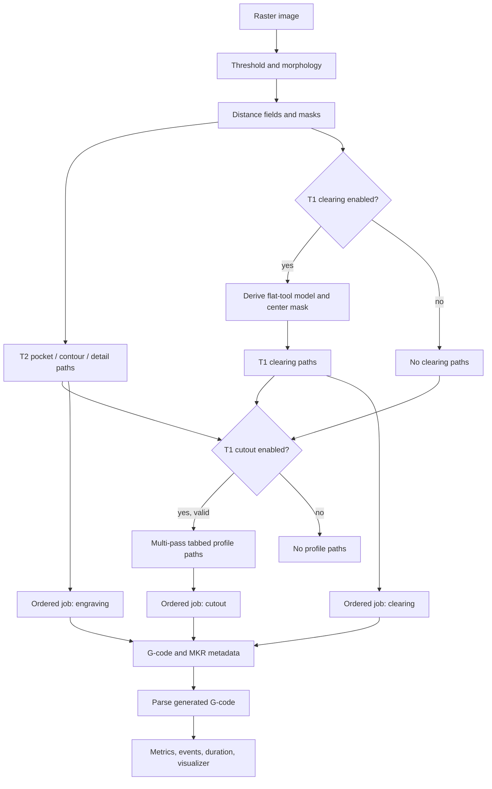
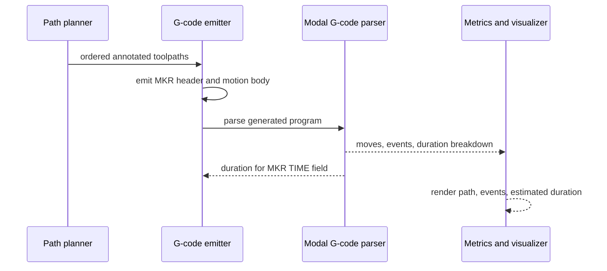

# Multi-Tool Browser CAM: Safe Makera Job Planning

A browser CAM application can generate plausible geometry long before it generates a job that is safe to run. The gap is not primarily a matter of adding a `T1 M6` line. A physical job has tool identity, spindle state, workholding, stock dimensions, depth limits, machine positioning, and human intervention points. Those facts need a representation in the planning model, validation before emission, and visible evidence in the output.

This article documents the multi-tool architecture implemented in `/home/manuel/code/wesen/2026-07-31--cat-mill-roam`. The application begins with a raster image and produces metric absolute-position G-code for a Makera Z1-style workflow. It can plan three operations: optional T1 flat-end broad clearing, mandatory T2 V-bit engraving, and optional T1 tabbed profile cutting. It also parses its own output and external G-code to display non-motion program events and a command-level duration estimate.

The purpose is not to present a universal post-processor. It is to explain a set of implementation rules that make a small CAM application safer, inspectable, and easier to extend.

> [!summary]
> - Model tools and operations on every planned path. Do not make a global spindle/feed setting carry the identity of a physical tool.
> - Keep unsafe physical assumptions out of defaults. A profile cut must fail validation until stock, geometry, depth, hold-down, and M6 behavior are explicit.
> - Derive visualizer events and estimated duration from the same parser that reads the G-code. A second timing model eventually disagrees with the program.
> - Treat Makera metadata as controller-facing description, not cutting semantics. The motion program remains responsible for safe retracts, spindle transitions, feeds, and tool changes.

## Why image engraving becomes a job-planning problem

A single-tool raster engraver has a straightforward control model. Image processing produces a mask, geometry generation produces paths, and a post-processor emits a fixed tool, fixed feeds, and a fixed clearance height. The moment a flat end mill and a V-bit participate in the same job, that model stops being sufficient.

The specific Makera configuration here has two physically distinct tools:

| Tool | Geometry | Reference operating values | Intended operation |
|---|---|---:|---|
| T1 | 3.175 mm flat end mill | 10,000 RPM; 300 mm/min plunge; 1,000 mm/min cut | Broad clearing and tabbed outside profile |
| T2 | 0.3 mm tip, 30° engraving bit | 12,000 RPM; 500 mm/min plunge; 1,000 mm/min cut | Image engraving and narrow variable-depth detail |

The application uses a fixed operation sequence:

```text
optional T1 flat clearing
        ↓
T2 engraving
        ↓
optional T1 profile/cutout
```

This is a planning decision, not merely an output-format choice. Clearing first lets the large cutter remove broad regions efficiently. Engraving then preserves the V-bit as the finishing tool for narrow detail and image edges. The profile runs last so the part remains connected to the stock during the earlier operations. When all three operations are enabled, the resulting physical sequence is `T1 → T2 → T1`.

The implementation deliberately does not expose arbitrary reordering. A fully general operation scheduler needs knowledge of fixturing, machining strategy, material behavior, and operation dependencies. The application has none of that information. It therefore exposes independent operation enablement while retaining an order whose safety rationale is explicit.

## The core representation: paths carry operation and tool identity

The central change is small in type shape and large in effect. A `Toolpath` no longer means only points and depth. It may also declare the physical tool and operation that owns it.

```ts
interface ToolDefinition {
  number: number;
  name: string;
  spindleRpm: number;
  feedXY: number;
  feedPlunge: number;
  safeZ: number;
}

type ToolpathOperation = "clearing" | "engraving" | "cutout";

interface Toolpath {
  kind: "raster" | "contour" | "detail" | "profile";
  depth?: number;
  points: MachinePoint[];
  closed?: boolean;
  variableDepth?: boolean;
  tool?: ToolDefinition;
  operation?: ToolpathOperation;
}
```

This representation appears in `src/types.ts`. The optional fields preserve the old single-tool path shape: an unannotated path falls back to the engraving settings. New paths are annotated by the planner in `src/process.ts`.

The distinction matters because tool selection changes more than a line of G-code. It changes at least five values at once:

1. The `Tn` number used by the controller.
2. The spindle RPM used after the change.
3. The XY feed used for the path.
4. The plunge feed used to enter material.
5. The clearance Z used before and after the operation.

When those values live with tool metadata, the G-code emitter can make a local, deterministic decision for every contiguous operation group. It does not need to infer tool state from a global setting that may have been overwritten by UI activity.

### The planning pipeline

The image pipeline remains responsible for image interpretation. It rasterizes, thresholds, cleans the mask, computes distance fields, generates broad pocket paths, creates contour finishing paths, and traces narrow residual detail. Multi-tool planning begins after those image-derived paths exist.



`processAndGenerate()` performs the critical ordering step in `src/process.ts`. It creates explicit `engravingTool`, `flatTool`, and `cutoutTool` definitions, annotates the paths, and constructs:

```ts
const toolpaths = [...flatPaths, ...engravingPaths, ...cutoutPaths];
```

The order is visible in source and therefore reviewable. It is not reconstructed later from path kind, file position, or a UI label.

## Broad clearing without duplicating the pocket generator

T1 clearing uses the existing pocket generation algorithms rather than a separate implementation. This avoids a common maintenance failure: two pieces of code that both claim to clear a binary mask but differ in offsets, scan direction, edge behavior, or feed semantics.

The relevant derivation is:

```ts
flatSettings = {
  ...settings,
  cutWidth: flatToolDiameter,
  toolRadius: flatToolDiameter / 2,
  stepoverFraction: flatStepoverFraction,
};

flatRadiusPx = flatSettings.toolRadius / model.mmPerPx;
flatCenterMask[i] = mask[i] && distanceToBackground[i] - 0.5 >= flatRadiusPx;
```

The distance field answers a geometric question: at this pixel, is there enough foreground material around the cutter center for the entire flat cutter to fit? A 3.175 mm cutter cannot be centered arbitrarily close to a boundary. The center mask erodes the source mask by the tool radius. Existing raster or contour-offset pocketing then receives a mask appropriate to the T1 footprint.

This choice has two consequences worth stating directly.

First, T1 clearing only occurs in broad regions. Narrow regions remain for T2. That is not a failure to clear; it is the geometric limit of the cutter diameter.

Second, T2 engraving still runs over the image-derived operation. The application does not claim that T1 clearing has removed every region that the V-bit would otherwise visit. A roughing/finishing subtraction algorithm would need a verified coverage model for both cutter geometries. The present strategy trades extra V-bit motion for a simpler and auditable result.

## Profile cutting is a physical contract

An engraving image does not contain enough information to make a safe through-cut. It does not identify the stock boundary, thickness, clamp positions, tabs, or controller behavior during a tool change. The implementation treats profile cutting as a separately configured operation and rejects it when its contract is incomplete.

The profile is a rounded rectangle around artwork bounds:

```text
left   = artworkOriginX - margin
bottom = artworkOriginY - margin
right  = artworkOriginX + artworkWidth + margin
top    = artworkOriginY + artworkHeight + margin
```

The validator in `src/toolpath/profile.ts` requires:

- M6 emission enabled and explicitly confirmed by the operator.
- A final cut depth at least equal to measured stock thickness.
- A positive stepdown.
- A profile entirely inside the configured stock rectangle.
- A corner radius no larger than half the profile’s smaller dimension.
- Either valid tabs or an explicit confirmation of external hold-down.
- A tab height less than final cut depth when tabs are selected.

The relevant control flow is intentionally failure-oriented:

```ts
if (!emitToolChanges || !m6Confirmed) fail("Cutout requires ... M6");
if (cutoutDepth < stockThickness) fail("Final cut depth must reach stock thickness");
if (profileOutsideStock) fail("Cutout profile falls outside configured stock");
if (tabs && tabHeight >= cutoutDepth) fail("Tab thickness must be less than final depth");
if (externalHoldDown && !confirmed) fail("Confirm external hold-down");
```

The important point is not the wording of any one error. The important point is that the post-processor has no success path when the safety-critical values are absent or contradictory. There is no default guessed through-cut depth and no implied fixturing plan.

### Tabs require variable depth in a non-V-bit operation

A tabbed profile has one XY loop but not one Z depth. At a tab span, the cutter must leave material; elsewhere in the same loop, it must reach the current pass depth. Treating the profile as a `detail` path would be semantically misleading because `detail` refers to V-bit image geometry.

The `variableDepth` flag solves this narrowly. The profile generator samples a rounded rectangle, walks its arc length, marks evenly distributed tab spans, and assigns either the pass depth or the shallower tab depth to each point.

```text
for each Z pass:
    depth = min(passStep, finalDepth)
    for each sampled profile point:
        if point lies in a tab span:
            point.depth = depth - tabHeight
        else:
            point.depth = depth
    emit closed profile path with variableDepth = true
```

The G-code emitter recognizes both V-detail and profile tabs as variable-depth motion, but clamps cutout points against `cutoutDepth`, not the engraving target depth. The operation identity prevents a shallow engraving cap from accidentally limiting the through-cut.

## G-code emission: state changes are part of the program

The post-processor in `src/output/gcode.ts` groups contiguous paths by tool and operation. It emits a Makera-style boundary marker at every group and only issues an M6 sequence when the active physical tool changes.

```gcode
G0 Z5
(Change to T1 3.175 mm flat end mill)
T1 M6
S10000 M3
; ... T1 clearing paths ...
M5
G0 Z3
(Change to T2 0.3 mm 30° engraving bit)
T2 M6
S12000 M3
; ... T2 engraving paths ...
M5
G0 Z5
(Change to T1 3.175 mm flat end mill)
T1 M6
S10000 M3
; ... T1 profile paths ...
```

A tool transition has an explicit order:

1. Retract to the incoming tool’s configured clearance height.
2. Stop the spindle when one was active.
3. Emit a human-readable tool instruction.
4. Emit `Tn M6`.
5. Optionally emit a configured dwell for spindle/tool-change procedure.
6. Start the next spindle at the next tool’s RPM.

The output uses `S... M3` in multi-tool mode to match the observed Makera reference file. Legacy single-tool output retains its prior `M3 S...` form. Both are valid G-code word orderings; preserving the old single-tool branch avoids changing output unnecessarily for users who have not enabled optional operations.

### Why `M6` needs an acknowledgement

The application cannot determine whether the sender pauses for M6, whether the operator has an automatic tool changer, or whether a controller ignores tool changes. It presents a checkbox that requires the operator to confirm this behavior before multi-tool paths are generated. This does not prove a physical tool change will be carried out correctly. It prevents the software from pretending that it knows the answer.

The same principle applies to manual tool-change timing. The parser can add an allowance per M6, but that value is an estimate selected in the UI. It is not a controller measurement.

## Makera metadata describes the job; motion commands cut the job

The MakeraBadge reference file begins with `;@MKR|...` records. These records are comments to a normal G-code controller, but they provide structured information to Makera-aware software. The generator now emits a prelude with the same baseline shape:

```text
;@MKR|BEGIN
;@MKR|SCHEMA|v=1.0.0
;@MKR|MACHINE|id=Z1|name=Makera Z1
;@MKR|MATERIAL|id=1214321200100001|...
;@MKR|STOCK|id=cuboid|length=100|width=100|height=1.3|diameter=1
;@MKR|ORIGIN|id=0|type_name=topFrontLeft|x=-50|y=-50|z=0.65
;@MKR|CAM|id=MakeraStudio|name=MakeraStudio|v=0.0.0.1
;@MKR|UNIT|value=mm
;@MKR|TOOL|number=1|...
;@MKR|TOOL|number=2|...
;@MKR|TIME|seconds=...
;@MKR|TOOLPATH|number=1|tool_number=...|name=...
;@MKR|END
```

The default UI values match concrete reference settings: 100 × 100 × 1.3 mm stock, top-front-left metadata origin `(-50, -50, 0.65)`, T1/T2 tool geometry, and the reference feed/spindle values. Stock dimensions in the prelude are generated from configured stock settings. The material string comes from the supplied reference and should be interpreted as a default material identity, not a claim about every future blank.

This distinction prevents an incorrect conclusion: adding the prelude does not make a file physically safe or guarantee that Makera Controller will treat it identically to a MakeraStudio export. It gives the file structured descriptive metadata. Cutting behavior still comes from the motion commands, machine configuration, work offset, tool installation, and physical workholding.

The implementation does not emit the large base64 thumbnail block found in the reference. That omission affects controller presentation, not path execution. A real import into Makera Controller remains the appropriate verification for native job-list and thumbnail behavior.

## Parse the program that will run

A duration estimate based only on generated geometry is attractive because it is easy to calculate. It is also incomplete. It cannot account for rapid moves, modal feed changes, dwell, spindle delays, or M6 allowances unless it re-implements G-code interpretation. Once two implementations exist, they will diverge.

The application instead parses emitted G-code after generation. `src/gcode/parser.ts` retains three classes of result:

| Result | Purpose |
|---|---|
| `GcodeMove[]` | Canvas visualization, bounds, rapid/cut/plunge distances, playback |
| `GcodeEvent[]` | Tool selection/change, spindle start/stop, units, distance mode, dwell, home, program end |
| `DurationEstimate` | Feed, rapid, dwell, M6, spindle-delay components and total |

The estimate is command-level:

```text
G0 time  = Euclidean XYZ distance / configured rapid rate
G1 time  = Euclidean XYZ distance / modal F rate
G2/G3    = time of their approximated cut segments / modal F rate
G4 time  = commanded dwell seconds
M6 time  = configured manual tool-change allowance
M3/M4    = configured spindle-delay allowance
```

The parser tracks modal `G0/G1/G2/G3`, absolute and incremental positioning, coordinates, feed, spindle state, selected/pending tool, and comments. Arc commands are approximated as segments for both visualization and distance accounting. The estimate is visibly labeled as an estimate because it excludes acceleration, machine-specific rapid limits, controller buffering, manual operator variability, and any unmodeled sender pause.



This design has a useful property: the `;@MKR|TIME` field, workspace metric, and visualizer breakdown derive from the same parser assumptions. The header is built after a temporary parse of the motion body; comments do not change motion timing, so prepending the header cannot introduce a timing cycle.

## Program events are not optional visualizer decoration

A path-only visualizer can show where the cutter moves but cannot explain why the cutter stops, why time includes a manual allowance, or where tool state changes. The event model records non-path commands with line numbers and optional duration.

For a verified multi-tool filled-square job, the browser event list showed this sequence:

```text
L11   tool-change: T1 M6 (1m 30s)
L12   spindle-start: S10000 M3
L153  tool-change: T2 M6 (1m 30s)
L154  spindle-start: S12000 M3
L4465 tool-change: T1 M6 (1m 30s)
L4466 spindle-start: S10000 M3
```

The same view reported four toolpath groups, tools `T1, T2`, 6,198 moves, and a duration whose M6 component was 4 minutes 30 seconds. The line-level event list is more useful than a single total because it makes the assumptions inspectable.

A single-tool regression produced one toolpath, no M6 events, legacy `M3 S14000` output before reference defaults were updated, and a zero M6 component. The parser correctly reports no tool metadata when a legacy program has no `T` command. It must not invent a tool selection that never appears in the file.

## Validation fixtures turn image geometry into repeatable evidence

Image processing changes can be difficult to review using a photograph alone. The application therefore bundles four compact SVG fixtures under `src/assets/test-patterns/` and exposes them in the Artwork panel:

| Fixture | Geometry it isolates | Expected use |
|---|---|---|
| `square-outline.svg` | A thick closed contour | Contour and narrow-detail regression |
| `filled-square.svg` | A large solid region | Raster/contour pocketing and T1 clearing regression |
| `line-detail.svg` | Narrow connected strokes | Skeleton tracing and variable-depth V-detail regression |
| `mixed-islands.svg` | Solid islands, holes, and a thin curve | Topology, holes, pocketing, residual detail |

SVG is useful here because the shape definitions are versioned and inspectable. A filled square is exactly a filled square; it does not contain JPEG blocking, uneven lighting, or accidental threshold ambiguity. This does not replace real-material testing, but it gives software changes a stable input set.

The test hierarchy should remain explicit:

1. Use fixtures to detect changes in mask cleanup, path formation, operation ordering, and emitted commands.
2. Use the parser tests to detect changes in modal semantics and timing/event accounting.
3. Use a browser smoke test to confirm the actual UI connects controls, output, and visualizer.
4. Use an air cut and a material test coupon to validate physical machine behavior.

No software-only test demonstrates correct Z zero, tool stickout, clamp clearance, tab strength, or controller M6 handling.

## Failure modes and the decisions that prevent them

### Treating a tool change as a string interpolation problem

A naive emitter selects `T1` or `T2` based on a path kind and continues using global feeds. This can cut a flat-end path at V-bit feeds, leave the spindle running during a manual change, or retract to a clearance appropriate for the wrong tool.

**Decision:** attach a complete `ToolDefinition` to planned paths and emit transitions from the active tool state.

### Generating a cutout from artwork dimensions alone

Artwork dimensions do not establish stock bounds or hold-down. A rectangle around the image can extend past stock, cut deeper than the material requires, or release the part before the job ends.

**Decision:** make profile cutting opt-in and require all physical inputs before paths are generated.

### Showing a rough time estimate as if it were program time

Aggregate path length does not include rapids, modal feed changes, dwell, tool changes, or spindle delay. It creates an output whose reported duration does not match its actual commands.

**Decision:** parse the finished program and expose each timing component.

### Copying Makera metadata as static text

Static header fields become incorrect as soon as stock dimensions, time, used tools, or operation count changes.

**Decision:** use the reference for schema/default identities and generate stock, origin, tools, time, and toolpath records from settings and the plan. The current material identity remains a baseline and should become a user-selectable material catalog entry if the application grows beyond its reference ABS stock.

### Hiding controller-specific uncertainty

M6 behavior is a property of controller and sender configuration. It cannot be inferred from browser code.

**Decision:** require confirmation and keep the generated tool-change comment visible. The UI validates configuration; it does not certify the machine setup.

## Recommended implementation sequence for similar systems

A project extending a single-tool generator should proceed in this order:

1. **Read a real reference program.** Identify control commands, metadata records, tool geometry fields, and operation boundaries. Do not extrapolate hidden behavior from one line.
2. **Add operation/tool types before changing output.** This makes the subsequent planner and emitter changes reviewable.
3. **Introduce validation before adding through-cut geometry.** Make missing physical decisions produce errors, not defaults.
4. **Reuse existing geometry generators through derived settings.** Add a separate algorithm only when cutter geometry or machining strategy genuinely requires it.
5. **Emit safe state transitions and human-readable tool instructions.** The program should be understandable in a plain-text review.
6. **Parse generated output as part of normal processing.** Use that parse for duration, events, and the visualizer.
7. **Add deterministic fixtures and synthetic parser tests.** Cover both geometry classes and G-code modal behavior.
8. **Capture browser evidence and inspect actual output.** A successful build does not prove controls are wired to planning and emission.
9. **Run a physical validation sequence separately.** Confirm controller M6, work offset, clearance, and cuts on sacrificial stock.

## Working rules

The implementation leaves several rules worth carrying forward:

- Each physical operation must have an explicit tool and explicit machining parameters.
- A cutout is unsafe until its stock, boundary, depth, hold-down, and controller assumptions are supplied and validated.
- Tool-change G-code must stop/retract before a manual procedure and start the new spindle explicitly afterward.
- Metadata should describe actual settings and plan state; comments must not become a second stale configuration source.
- A duration is an estimate unless it incorporates the machine’s real acceleration, sender, and operator behavior. Show its components.
- Test fixtures are software evidence, not proof of machining safety.
- A generated file should be inspected as a program before it is treated as a job.

## Source artifacts and verification evidence

The implementation and investigation artifacts are in the source repository:

- Multi-tool design: `ttmp/2026/08/01/ENGRAVER-MULTITOOL-JOB--multi-tool-engraving-flat-clearing-cutout-program-events-and-duration/design-doc/01-multi-tool-job-plan-and-safety-design.md`
- Investigation diary: `ttmp/2026/08/01/ENGRAVER-MULTITOOL-JOB--multi-tool-engraving-flat-clearing-cutout-program-events-and-duration/reference/01-investigation-diary.md`
- Synthetic event/timing test: `ttmp/2026/08/01/ENGRAVER-MULTITOOL-JOB--multi-tool-engraving-flat-clearing-cutout-program-events-and-duration/scripts/01-test-events-and-duration.ts`
- Makera reference: `ttmp/2026/07/31/ENGRAVER-VITE-VIZ--split-app-into-vite-modular-ts-and-add-a-g-code-visualizer/sources/MakeraBadge.nc`
- Browser evidence: `ttmp/2026/08/01/ENGRAVER-MULTITOOL-JOB--multi-tool-engraving-flat-clearing-cutout-program-events-and-duration/artifacts/`

Verification performed during implementation included `npx tsc --noEmit`, `npm run build`, the synthetic event/duration test, the existing Makera parser regression, browser smoke tests for single-tool and T1→T2→T1 jobs, generated G-code inspection, and checked ticket tasks. The current implementation still requires physical confirmation of controller M6 behavior, stock setup, tool stickout, clamps, and tabs before machining.
