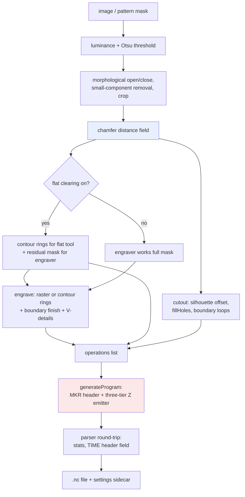
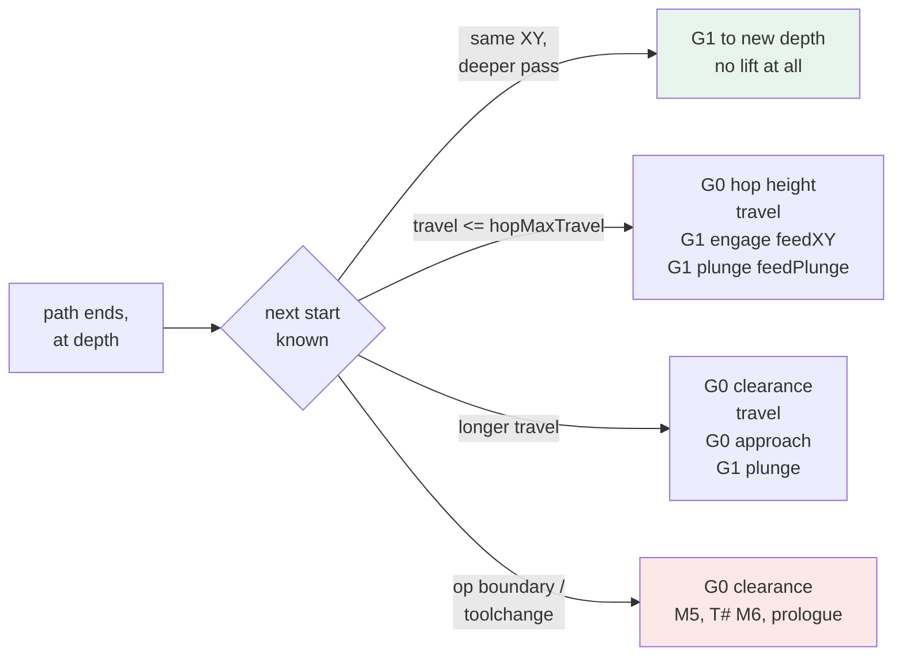

# ABS Bicolor V-Engraver

This project converts a bitmap image into multi-tool CNC engraving jobs for a Makera Z1. It began life as a 466KB single-file HTML artifact generated by ChatGPT and, over one working day, became a modular Vite/TypeScript application with a G-code visualizer, a contour-parallel pocketing engine, rest machining, cutout generation, a Makera-native G-code emitter, and a headless Node batch generator. This note is a technical deep dive into how the system works and why each design decision was made.

> [!summary]
> The project has three identities:
> 1. a browser CAM application: image → threshold → distance fields → toolpaths → multi-tool G-code, with live previews
> 2. a G-code analysis toolchain: a parser/visualizer for real Makera jobs and a duration model calibrated against MakeraStudio's own output
> 3. a headless batch generator (`pnpm gen:testgcode`) that produces traceable test-cut series with per-file settings sidecars

## Why this project exists

The concrete goal is engraving 1.3mm bicolor ABS stock (a gold cap layer over black) on a Makera Z1: cut through the ~0.1mm cap where the artwork is dark, leave it intact elsewhere, and optionally cut the finished badge free. The original single-file app already did the image-processing half of this competently. What it lacked was everything that makes output trustworthy and machine-native: a way to *see* what a G-code file will do before running it, toolpath strategies matching what commercial CAM produces, multi-tool programs with correct tool-change choreography, and reproducible generation outside a browser.

A real artifact anchors the whole effort: `testdata/MakeraBadge.nc`, a 18,531-line job exported from MakeraStudio that engraved a Makera badge on this exact machine and stock. Nearly every design decision below is justified by evidence extracted from that file rather than by convention or guesswork.

## Current project status

Working and verified as of 2026-08-01: the full browser application (dev server via `pnpm dev`), 13 vitest tests, the batch generator, and a delivered test series (9 geometric patterns at 20mm plus a 30mm cat sample) uploaded to `mimimi-2.local:~/Documents/GCODE/2026-08-01/z1-pattern-tests/` with README and JSON sidecars. Test cuts on the machine are the next validation step. Work is tracked in three docmgr tickets under `ttmp/2026/08/01/`: MILL-01 (module split + visualizer), MILL-02 (contour pocketing + multi-tool pipeline), MILL-03 (Z retract scheme), each with an implementation diary.

## Project shape

```
index.html, src/style.css        UI shell (extracted from the original single file)
src/main.ts                      DOM wiring only: settings, canvases, event handlers
src/lib/pipeline.ts              runPipeline() — the whole CAM pipeline, DOM-free
src/lib/imaging.ts               Otsu, morphology, connected components, chamfer
                                 distance, Zhang–Suen thinning, fillHoles
src/lib/geometry.ts              RDP simplification, boundary-loop tracing,
                                 skeleton polyline tracing
src/lib/toolpath.ts              raster pocketing, boundary finish, V-detail paths,
                                 pixel↔machine transforms, nearest-neighbor ordering
src/lib/pocketing.ts             contour-parallel pocketing via distance-field
                                 iso-contours, ring dedupe, stay-down linking
src/lib/operations.ts            ToolSpec/Operation model and generateProgram(),
                                 the multi-tool Makera-style emitter
src/lib/patterns.ts              nine test patterns as pure mask math (incl. a
                                 5×7 bitmap font), shared browser/Node
src/gcode/parser.ts              G-code parser: MKR metadata, toolpath
                                 segmentation, duration model
src/gcode/viewer.ts              pan/zoom canvas visualizer, color modes,
                                 per-toolpath toggles, machine-event list
scripts/generate-test-gcode.ts   headless batch generator (tsx), sidecars, README
testdata/MakeraBadge.nc          the reference MakeraStudio job
gcode-tests/                     generated series + sidecars + batch README
```

## Architecture

The pipeline is a sequence of pure array transformations over a pixel grid, followed by an emission stage. Nothing in the geometric core touches the DOM; the browser supplies only image decoding (canvas) and previews, and Node supplies PNG decoding (pngjs). There is deliberately no WASM and no geometry dependency — a point developed below.



## Implementation details

### The reference file and what it taught

Three separate analysis passes over `MakeraBadge.nc` shaped the system. The first pass (MILL-01) established structure: a `;@MKR|KEY|k=v` metadata header describing machine, material, stock, origin, tools, and toolpaths; three toolpaths (`[T2]2D Pocket` engraving at a single Z of −0.1mm, `[T1]2D Pocket` clearing a hanger hole, `[T1]2D Contour` cutting the badge free, both flat-tool operations using a −0.5/−1.0/−1.5 stepdown ladder through the 1.3mm stock); and a command vocabulary of exactly G0/G1/G21/G90/G28, T#+M6, S#+M3, M5, M2 — no arcs, no work offsets, no canned cycles. Notably, Makera writes `M05` and `M02` with leading zeros at program end but `M5` mid-file, so M-codes must be parsed numerically.

The second pass answered a probe question: the file contains no `G38`, no `G43 H#`, no probe-tool selection of any kind. Tool-length measurement on the Z1 happens inside the firmware's handling of `M6`. A generator therefore should not emit probing commands; it should emit clean `M5` → `T# M6` → `S#### M3` transitions and let the machine do the rest.

The third pass (MILL-03) extracted the Z choreography at line level, and corrected an earlier misreading. A Z-word tally shows 296× `G0 Z3`, 245× `G0 Z2`, 98× `G1 Z1.9 F1000`, 4× `G0 Z5`. The tally alone suggests "1.9 is a hop height," but line context shows `G1 Z1.9 F1000` always appears *between* a travel move and a plunge — it is a feed-engage step on the way down, not a lift. The file uses two reposition cycles:

| Cycle | Sequence | Count |
|---|---|---|
| Full | `G0 Z3` retract → travel → `G0 Z2` approach → `G1 Z-0.1 F500` plunge | ~147 |
| Hop | `G0 Z2` retract → travel → `G1 Z1.9 F1000` engage → plunge | 98 |

The counts cross-check: 245 plunges = 147 + 98, and 245 occurrences of `G0 Z2` = 147 approaches + 98 hop retracts. After each tool change the file adds a `G0 Z5` before descending to Z3 — an extra-cautious first move with a freshly measured tool. This grammar is now reproduced exactly by the emitter (see below).

### The image-processing front end

The front half of the pipeline was ported verbatim from the original artifact, because it was already correct: alpha-over-white luminance, Otsu or manual thresholding, box-kernel morphological opening and closing via integral images, 8-connected small-component removal, and an optional crop to the artwork bounds. Two functions from this stage carry the rest of the system:

**The chamfer distance transform** (`chamferDistance`) computes, for every pixel, an approximate Euclidean distance to the nearest background (or foreground) pixel using the classic two-pass 3-4 chamfer: a forward raster scan propagating from the top-left neighbors with costs 1 and √2, then a backward scan from the bottom-right. Its worst-case anisotropy is about 6% on diagonals, which matters below.

**The boundary-loop tracer** (`traceBoundaryLoops`) walks the edges between foreground and background pixels of a binary mask and returns closed loops in vertex coordinates. It handles multiple regions and holes without special cases, because every boundary edge belongs to exactly one loop.

### Contour-parallel pocketing without a geometry library

The engraving pocket was originally cleared with serpentine raster scanlines. MakeraStudio clears pockets contour-parallel: concentric inward offsets of the boundary spaced by the tool stepover. The obvious implementation route is polygon offsetting — Clipper2's `InflatePaths` with negative deltas, available to TypeScript through `clipper2-ts` or `clipper2-wasm`. The project deliberately took a different route, recorded as decision DR-1 in the MILL-02 design doc.

The key observation is that the two required primitives already existed. For a pocket mask, the set `{p : dist(p) ≥ d}` is exactly the pocket eroded by distance `d`. Its boundary — traced by the existing loop tracer — is the offset ring at inset `d`. Contour-parallel pocketing is therefore:

```
level = toolRadiusPx + 0.5
while true:
    ringMask = { p : dist[p] >= level }
    if empty(ringMask): break
    loops = traceBoundaryLoops(ringMask)
    emit loops (simplified, converted to machine coords)
    level += stepoverPx
```

This formulation has a property that polygon offsetting must work hard for: topology changes are free. When a region narrows past the offset distance — the neck of a dumbbell shape, for example — the thresholded mask simply has two components, and the tracer emits two loops. No self-intersection cleanup, no winding rules, no dependency. Accuracy is bounded by the pixel size (≈0.05mm at typical settings), which is comparable to the chord tolerance MakeraStudio itself uses when it flattens arcs into G1 moves. The API hides the backend, so a later swap to exact vector offsetting remains a local change.

Rings are emitted innermost-first so the final ring — the one that touches the finished wall — is cut last, which is the conventional finish-quality ordering. Nearest-neighbor ordering is applied only *within* one offset level; applying it across levels would let an outer finish ring be cut before inner material was removed.

### Two bugs the simulator found

Running a generated file through MakeraStudio's simulator exposed two defects that neither the unit tests nor the project's own viewer had surfaced, both instructive.

**Duplicate rings from sub-pixel stepover.** A 30° V-bit cutting 0.12mm deep has a top width of 2·0.12·tan(15°) ≈ 0.064mm; a 45% stepover is 0.029mm — smaller than one pixel. Adjacent offset levels then quantize to the same mask, and the identical ring is traced and cut twice. The fix has two parts: the ring step is floored at one pixel, and any level whose region area equals the previous level's area is skipped. The area test is exact, not heuristic: level sets are nested (`{dist ≥ l+s} ⊆ {dist ≥ l}`), so equal area implies an identical set.

**Retract-per-ring choreography.** Every ring plunged and retracted independently, producing ~20 lift/travel/plunge cycles inside the dumbbell's 1.2mm bar. The fix is stay-down linking: when the straight segment from one ring's endpoint to the next ring's start lies entirely inside the tool-center-legal region (`dist ≥ rTool + 0.5px`, sampled every half-pixel), the emitter feeds there at cutting depth instead of retracting. The predicate matters: testing against the *mask* would allow the connector to hug the wall and let the conical flank of the V-bit gouge it; testing against the tool-center region keeps the whole tool inside material that is planned for removal at exactly that depth. On the dumbbell this collapsed 39 plunges to 13.

### Rest machining with two distance transforms

Engraving the entire badge artwork with a 0.3mm-tip bit took MakeraStudio 13 meters of cutting. A 3.175mm flat end mill removes area roughly two orders of magnitude faster, and splitting the work between the two tools is standard rest machining. The implementation uses no polygon booleans — only two chamfer transforms:

```
rFlat        = flatDiameter / 2 (in px)
flatCenter   = { p : distToBackground[p] >= rFlat + 0.5 }   # legal flat-tool centers
flatPaths    = contour rings over distToBackground at rFlat spacing
distToCenter = chamferDistance(flatCenter, zeroAtForeground=true)
cleared      = { p : distToCenter[p] <= rFlat - overlap }   # what the flat tool actually removed
engraveMask  = mask AND NOT cleared
```

The overlap constant (0.25mm) exists because the chamfer's diagonal error can otherwise leave one-pixel slivers of uncut cap at the seam between the tools' territories — a defect observed during development on the corners of the square test pattern. A useful emergent property: on patterns whose features are all narrower than the flat tool (thin stripes, a checkerboard of 2mm cells), `flatPaths` comes out empty and the operation self-cancels, so the generator never emits a pointless tool change.

### The cutout operation

The final operation offsets the artwork silhouette outward by `margin + rFlat` — implemented as a threshold of the distance transform *toward* the artwork — fills interior holes with a border-connected BFS (`fillHoles`, so a ring-shaped artwork produces one outline rather than a moat), traces the boundary, and cuts it in a stepdown ladder (`makePassLadder`: −0.5, −1.0, then −(stock + overcut), matching the badge file's three passes ending 0.2mm past the stock bottom). One supporting detail lives upstream: when cutout is enabled, the auto-crop padding is expanded so the offset contour cannot clip against the canvas edge.

### The multi-tool emitter and the three-tier Z scheme

`generateProgram(ops, model, jobName)` turns an ordered list of operations — each a tool specification, a path list, and a ladder of pass depths — into a complete program. The header reproduces the MakeraStudio prelude field-for-field (SCHEMA, MACHINE Z1, MATERIAL, STOCK with live thickness, ORIGIN with z = thickness/2 as observed in the example, CAM, UNIT, full-geometry TOOL lines with real Makera product IDs, TIME, TOOLPATH mappings). The TIME field is computed by generating the body first and parsing it with the project's own G-code parser — a round trip that guarantees the header estimate, the visualizer display, and the sidecar stats can never disagree, and that makes every generation run a parser regression test.

Z motion follows a three-tier scheme, mirrored from the evidence table above and implemented with deferred retracts. The emitter does not retract when a path ends; it records position and an at-depth flag, and the *next* reposition chooses the cycle, because the correct lift height is a property of the next destination:



The zero-distance case is worth noting: a closed cutout contour ends where its next ladder pass begins, so the tool simply feeds straight down to the next depth with no lift — behavior the Makera file implies for its own contour ladder. The toolchange prologue reproduces the example verbatim (`T# M6` → XY travel → `S# M3` → `G0 Z{clearance+2}` → `G0 Z{clearance}`), with the wrinkle that the prologue pre-positions XY, so the first reposition of the operation must suppress its own travel move via a one-shot flag.

The scheme's parameters (`approachZ`, `hopZ`, `hopMaxTravel`, defaults 2/2/5mm) are user-visible settings clamped to the clearance height. The measured effect across the test series was substantial because retract cost was the dominant overhead on detail-heavy jobs: the checkerboard estimate fell from 17m40s (original) to 10m33s (after stay-down linking) to 7m45s (after the Z scheme); the text pattern from 10m37s to 4m13s.

### The G-code parser and visualizer

The parser (`src/gcode/parser.ts`) supports exactly the union of what the reference file contains and what the emitter produces, plus chorded G2/G3 arcs for foreign files: modal G0/G1, G20/G21 unit scaling, G90/G91, word-level M-code parsing (numerically, so `M05` ≡ `M5`), MKR metadata extraction into structured tool/toolpath/machine records, and toolpath segmentation. Segmentation has a subtlety: MKR files mark toolpath starts with `TOOLPATH_START` comments that arrive *before* the `M5`/`T# M6`/`S# M3` sequence, so per-toolpath attributes (tool number, spindle RPM) must be resolved lazily at the first cutting move rather than at the marker; a freshly marker-started empty toolpath also absorbs a subsequent `M6` instead of spawning a duplicate. For files without markers, `M6` itself is the toolpath boundary.

The duration model is deliberately simple — cut distance at programmed feed plus rapids at an assumed 3000mm/min — and was validated two ways: an independent Python implementation in the MILL-01 ticket scripts agrees with the TypeScript parser to the second (15m30s total for the badge file), and MakeraStudio's own header claims 30 minutes for the same job, establishing that the vendor pads pure motion time by roughly 2× for acceleration and tool changes. Field calibration against real cuts is an open task.

The viewer renders segments on a pan/zoom canvas with an adaptive millimeter grid, three color modes (by toolpath, by tool, by depth), dashed rapids, per-toolpath visibility toggles, a progress scrubber that draws the first N segments with a position marker, and a machine-event list (tool changes, spindle transitions, homing, program end) with line numbers.

### Headless generation and delivery

Because the geometric core is DOM-free, extracting `runPipeline(input, settings, jobName, onStatus)` into `src/lib/pipeline.ts` reduced `main.ts` to DOM wiring, and made batch generation a 100-line Node script rather than a Playwright choreography (which had already bitten once: a Vite HMR reload silently wiped a loaded file mid-verification). Two pieces closed the gap to full headlessness. The test patterns were rewritten from canvas drawing calls to pure mask math — rectangle/disk fills, an even-odd scanline polygon fill for the star, and a 5×7 bitmap font for the text pattern, whose sharp corners and exact stroke widths make it a better engraving test than antialiased vector text. PNG decoding for real artwork uses `pngjs` (pure JavaScript), reproducing the browser's alpha-over-white luminance formula exactly.

`pnpm gen:testgcode` produces, for each job, the `.nc` file and a `.settings.json` sidecar recording the full settings object, per-operation tools and pass depths, output statistics, the generator's git commit, and a timestamp — enough to reconstruct any batch or correlate a physical test cut with the exact code and parameters that produced it. A generated `README.md` summarizes the batch setup and per-file table. The current series (nine 20mm patterns plus the 30mm cat sample, 21 files) lives on `mimimi-2.local:~/Documents/GCODE/2026-08-01/z1-pattern-tests/`.

## Important project docs

- `ttmp/2026/08/01/MILL-01--*/analysis/01-makerabadge-nc-g-code-analysis.md` — the reference-file analysis: structure, MKR schema, non-path commands, per-toolpath Z/feed statistics, duration model.
- `ttmp/2026/08/01/MILL-02--*/design-doc/01-contour-pocketing-and-multi-tool-pipeline-research-and-implementation-guide.md` — the intern-level design guide with decision records DR-1..DR-4 (also uploaded to reMarkable under `/ai/2026/08/01/MILL-02`).
- `ttmp/2026/08/01/MILL-03--*/design-doc/01-z-retract-scheme-design.md` — the evidence-derived Z cycle grammar and its decision records.
- Each ticket's `reference/01-diary.md` — chronological implementation diaries including failures and exact errors.

## Open questions

- How accurate is the duration model against wall-clock machine time? The checkerboard job (estimated 7m45s) is the designated calibration specimen; the result will fix the effective rapid rate and acceleration padding.
- Does dragging the V-bit at depth through already-cut cap (stay-down connectors) leave visible witness marks in gold-on-black ABS, or does the constant depth make it invisible as the geometry predicts?
- Is the 5mm `hopMaxTravel` threshold right? Makera's own hop-vs-full criterion is not observable from a single file.
- Should the cutout support holding tabs? The reference job has none (tape-held stock), so tabs were deferred.

## Near-term next steps

- Run the delivered series on the Z1; compare per-file wall-clock against sidecar estimates.
- Refresh the machine's SD card (`gcodes/pattern-tests/` still holds the pre-fix generation; the server batch is current).
- Retract-free clearing via connected Fermat spirals (Zhao et al. 2016) as the successor to stay-down linking; ring start-point rotation as the cheap intermediate step.
- Update the MILL-02 jump-detector script for linked-path awareness (its open-ring heuristic predates stay-down linking and now reports false positives).
- Expose machine/material/stock-size header fields as settings instead of example-file constants.

## Project working rule

Every claim about what the machine expects must trace to a line range in `testdata/MakeraBadge.nc` or to a measured cut — not to G-code folklore. When the two conflict, the reference file wins until a physical test says otherwise.
