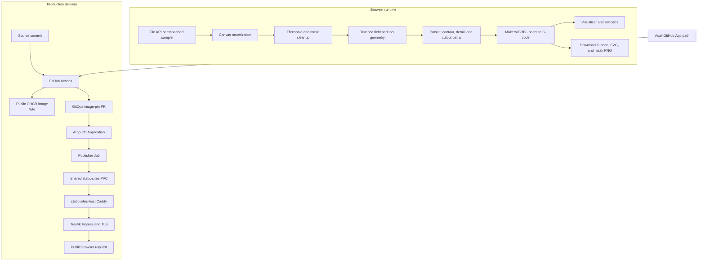
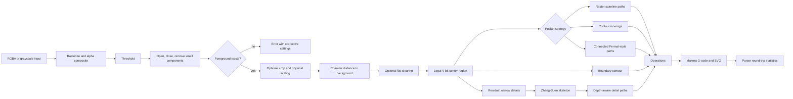

# ABS Bicolor V-Engraver: Browser-Local CAM and Public Static-Site Deployment

This report analyzes the ABS Bicolor V-Engraver project in `/home/manuel/code/wesen/2026-07-31--cat-mill-roam-fable` and its production deployment at `https://cam.yolo.scapegoat.dev`. The application converts raster artwork into a cleaned binary mask, computes cutter-aware geometry, generates shallow V-carving and optional flat-end clearing paths, emits Makera/GRBL-oriented G-code, and renders the resulting program in the browser.

The project has two independent systems. The first is a browser-local computational pipeline. It reads an image through browser APIs, performs raster and geometry processing in TypeScript, and gives the user downloadable G-code, SVG, and mask output. The second is a static delivery pipeline. It builds the Vite application, packages the generated `dist/` tree as `/site` in an immutable public GHCR image, opens a GitOps pull request, and lets Argo CD run a publisher Job that copies the artifact into the shared static-sites volume.

The production result is intentionally a static site. The deployment does not receive artwork, store user files, execute CAM work on the server, or expose an application API. Vault remains involved only in CI authorization: GitHub Actions reads a GitHub App credential from `kv/ci/github/cam/gitops-pr-app` so the release workflow can open a pull request in the k3s GitOps repository. The publisher Job does not require a Kubernetes Vault role or an image-pull Secret because the public GHCR package is anonymously pullable.

> [!summary]
> - **Product:** A browser-local raster-to-toolpath application for thin ABS bicolor stock, with thresholding, morphology, contour/raster/Fermat pocketing, variable-depth details, optional flat clearing, cutout passes, and a Makera-oriented G-code emitter.
> - **Core safety boundary:** A web deployment proves that the bundle is served; it does not prove that a G-code program is safe to machine. Simulation, work-offset checks, Z-zero verification, an air cut, and a stepped depth test remain required.
> - **Delivery:** Vite build → public immutable GHCR image → GitOps image-pin PR → Argo CD → static publisher Job → shared PVC/Caddy host → Traefik and cert-manager.
> - **Production evidence:** Argo is `Synced`, `Healthy`, and `Succeeded`; the active publisher Job is `publish-cam-sha-e17346e`; `cam-tls` is Ready; the public endpoint returns HTTP 200; browser navigation reports zero console errors.

## 1. Project purpose and production outcome

### 1.1 The machining problem

The application targets shallow engraving on thin ABS bicolor stock. A user supplies a raster image. The system must identify the region to engrave, preserve narrow structures, clear broad regions efficiently, and produce a machine program whose depth remains bounded by the measured cap thickness plus a deliberate breakthrough margin.

The input is not a vector drawing. Antialiasing, alpha, noise, holes, disconnected components, white borders, and arbitrary pixel dimensions all affect the result. The implementation therefore exposes image-processing parameters and intermediate visualizations instead of treating raster conversion as an opaque server operation.

The application must also preserve machine-specific details. Its generated programs use millimetres, absolute positioning, XY-plane motion, feed-per-minute semantics, Makera metadata records, tool numbers, spindle commands, clearance/approach/hop Z levels, and a final `G28`/`M2` sequence. The output is a machine-control artifact, not merely a visual path preview.

### 1.2 The deployment problem

Before MILL-05, the source repository had the application and algorithm tests but no production release contract. The deployment needed to satisfy four constraints:

1. The browser must continue to own image and G-code processing.
2. The source repository must publish an immutable artifact and test it in CI.
3. The k3s cluster must receive image changes through a reviewed GitOps pull request rather than direct CI cluster credentials.
4. The static site must use the existing shared static-sites host instead of introducing a dedicated web server for one application.

The final deployment satisfies those constraints. The source repository publishes a public image containing `/site`. The GitOps repository contains a short-lived publisher Job and an Ingress. The shared Caddy service serves the selected release from the static-sites PVC. No CAM-specific HTTP server runs in the cluster.

### 1.3 Final production state

The active source repository is `go-go-golems/go-go-cam`, locally checked out at:

```text
/home/manuel/code/wesen/2026-07-31--cat-mill-roam-fable
```

The k3s GitOps repository is:

```text
/home/manuel/code/wesen/2026-03-27--hetzner-k3s
```

The public artifact is:

```text
ghcr.io/go-go-golems/go-go-cam:sha-e17346e
```

The active static release is:

```text
/srv/sites/cam.yolo.scapegoat.dev/current
  -> releases/sha-e17346e
```

The live checks performed after the final image-pin merge were:

```text
Argo:        Synced / Healthy / Succeeded
Publisher:   publish-cam-sha-e17346e Complete, 1/1
TLS:         cam-tls Ready
HTTPS:       https://cam.yolo.scapegoat.dev/ -> HTTP/2 200
Server:      Caddy
Browser:     ABS Bicolor V-Engraver
Console:     0 errors
```

The deployment report is based on the source implementation, the MILL-05 ticket documents, the archived algorithm research under the ticket's `sources/` directory, the shared static-site infrastructure, and the live rollout evidence.

## 2. System boundaries

The project is easier to reason about when its local computation and delivery responsibilities are kept separate.



The browser pipeline consumes user artwork and produces local output. The delivery pipeline consumes repository files and produces public frontend assets. No edge in the delivery pipeline carries the user's uploaded image or generated G-code.

### 2.1 Browser data boundary

`src/main.ts` stores the current image, processed model, toolpaths, G-code, SVG, settings, and warnings in an `AppState` object. `loadImageDataUrl` creates an `Image`, updates the source canvas, and clears generated state. The image remains in browser memory. `runPipeline` receives pixel arrays and returns a `PipelineResult` without making network requests.

The application downloads output through browser-created object URLs. `downloadMaskPng` renders the mask into a canvas and calls `toBlob`; the generated G-code and SVG use the same browser download model. The server therefore serves JavaScript, CSS, HTML, and the embedded cat sample only.

This boundary has practical consequences:

- The site can be hosted by a static file server.
- There is no server-side artwork retention policy because the server never receives the artwork.
- Browser CPU and memory are the limiting resources for large images.
- A successful page load does not validate the correctness or safety of a machine program.

### 2.2 Machine safety boundary

The UI includes warnings for cap thickness, simulation, work offsets, Z-zero, air cuts, and depth tests. Those warnings are part of the user workflow, but they are not a substitute for physical validation.

The application cannot measure the actual ABS cap, inspect a machine's work coordinate system, verify a loaded tool, or observe the cutter during a job. The production acceptance contract is therefore divided:

| Concern | Evidence produced by the web application | Evidence still required outside the application |
| --- | --- | --- |
| Static delivery | HTTPS response, browser load, asset requests | None beyond normal release checks |
| Raster processing | Mask preview, metrics, warnings | Visual inspection of the selected artwork |
| Toolpath geometry | SVG, visualizer, bounds, path counts | Simulation in the target sender/controller |
| Material depth | Computed target depth from settings | Measured cap thickness and stepped depth coupon |
| Machine motion | Makera metadata and G-code syntax | Work-offset verification, Z-zero check, air cut |

The distinction prevents a deployment success from being interpreted as machining approval.

## 3. Application architecture

### 3.1 Source structure

The source repository has a small Vite application with a DOM-facing entry point and a DOM-free computational core.

| Path | Responsibility |
| --- | --- |
| `index.html` | Controls, canvases, preview regions, visualizer containers, and download actions. |
| `src/main.ts` | DOM event wiring, settings extraction, application state, processing status, and browser downloads. |
| `src/lib/imaging.ts` | Rasterization, luminance, Otsu thresholding, morphology, connected-component filtering, distance fields, hole filling, and thinning. |
| `src/lib/pipeline.ts` | Orchestrates image cleanup, cropping, tool geometry, pocket strategies, detail extraction, cutout paths, SVG, G-code, and statistics. |
| `src/lib/geometry.ts` | Boundary tracing, skeleton polylines, Ramer-Douglas-Peucker simplification, and related geometry utilities. |
| `src/lib/toolpath.ts` | Pixel/machine coordinate conversion, raster paths, contours, detail depths, and path ordering. |
| `src/lib/pocketing.ts` | Distance-field iso-contours, ring collection, contour pocketing, and stay-down linking. |
| `src/lib/fermat.ts` | Connected Fermat-style path adaptation over nested distance-field rings. |
| `src/lib/operations.ts` | Tool definitions, pass ladders, Makera metadata, Z-motion policy, and G-code emission. |
| `src/gcode/parser.ts` | Parser, motion statistics, bounds, tool events, spindle events, and time estimates. |
| `src/gcode/viewer.ts` | Browser visualization of generated and uploaded G-code. |
| `src/lib/fermat.test.ts` | Fermat geometry and legal-region invariants. |
| `src/lib/pocketing.test.ts` | Pocketing, pass-ladder, and G-code motion invariants. |
| `scripts/generate-test-gcode.ts` | Node-side generation of deterministic test programs using the same core pipeline. |

The DOM-free core is a significant design choice. It allows the browser UI and the Node batch generator to use the same implementation, so generated fixtures exercise production code rather than a second test-only algorithm.

### 3.2 State and settings

`readSettings` extracts values from HTML controls and clamps them before constructing a `Settings` object. Derived values are calculated from physical inputs:

```text
halfAngle    = vAngle * pi / 360
 targetDepth = capThickness + breakthrough
cutWidth     = 2 * targetDepth * tan(halfAngle)
toolRadius   = cutWidth / 2
```

Other settings include:

- maximum processing dimension;
- threshold mode and manual threshold;
- morphology radii and minimum component area;
- crop padding and inversion;
- stepover fraction and scan direction;
- machine origin, surface, clearance, approach, and hop Z levels;
- feed and spindle values;
- pocket strategy;
- optional flat clearing;
- optional cutout margin, stock thickness, stepdown, and overcut;
- X/Y mirroring.

Clamping at the UI boundary prevents invalid values from reaching geometry code. `deriveSettings` in `pipeline.ts` performs the same derived-geometry construction for non-DOM callers and ensures `approachZ` and `hopZ` do not exceed `safeZ`.

## 4. Raster-to-model pipeline

The main pipeline in `src/lib/pipeline.ts` is asynchronous because it yields through `nextFrame()` between expensive phases. This keeps the browser able to update status text and render intermediate UI state while processing proceeds.



### 4.1 Rasterization and alpha compositing

`rasterizeImage` limits the largest image dimension to the configured `maxDimension`, creates a canvas, paints a white background, draws the source image with high-quality smoothing, and reads RGBA pixels. Alpha is composited over white before luminance is calculated:

```ts
const a = rgba[i + 3] / 255;
const r = 255 - a * (255 - rgba[i]);
const g = 255 - a * (255 - rgba[i + 1]);
const b = 255 - a * (255 - rgba[i + 2]);
gray[p] = Math.round(0.299 * r + 0.587 * g + 0.114 * b);
```

The result contains both `gray` for computation and `rgba` for previews. A transparent black pixel becomes white after compositing, which avoids treating transparent image regions as black engraving material.

The `maxDimension` limit is a browser-resource guard. It does not establish a complete memory budget because intermediate masks, distance fields, canvases, and path arrays may coexist.

### 4.2 Thresholding and binary cleanup

Otsu thresholding builds a 256-bin histogram and selects the threshold with maximum between-class variance. Manual thresholding uses the configured integer directly. `makeMask` treats pixels at or below the threshold as foreground unless inversion is enabled.

The pipeline then applies:

1. Morphological opening to remove small protrusions and isolated foreground structures.
2. Morphological closing to fill small gaps and connect nearby structures.
3. Eight-neighbor connected-component removal below `minArea`.

The morphology implementation uses integral images for box-window sums. Erosion requires the complete structuring element to remain inside the image and requires the full window sum; dilation requires any foreground pixel in the window. This border behavior is deliberate: erosion does not preserve a partial structuring element at the image edge.

If cleanup removes all foreground pixels, the pipeline throws:

```text
No engraved region remains after thresholding and cleanup. Adjust threshold, inversion, or cleanup values.
```

The error is actionable because the UI can direct the user to threshold, inversion, or cleanup controls rather than exposing an empty toolpath failure later.

### 4.3 Cropping and physical dimensions

When `autoCrop` is enabled, the pipeline finds foreground bounds and expands them by `cropPadding`. If cutout is enabled, it increases padding to account for cutout margin, flat-tool radius, and a small extra pixel allowance. The mask, grayscale pixels, and RGBA preview are cropped together.

The physical model uses the finished width as the primary scale:

```text
finishedHeight = finishedWidth * processedHeight / processedWidth
scaleX         = finishedWidth / processedWidth
scaleY         = finishedHeight / processedHeight
mmPerPx        = finishedWidth / processedWidth
```

The coordinate transform is centralized in `pixelToMachine` and `machineToPixel`. Pixel Y increases downward, so machine Y is computed from the inverted normalized vertical coordinate. Optional X/Y mirroring occurs in normalized space before the physical coordinates are produced.

The same transform must be used for every path family. A separate transform inside Fermat, contour, or detail code would allow different strategies to disagree about origin and mirroring.

### 4.4 Chamfer distance field

`chamferDistance` initializes foreground or background seed pixels to zero and all other pixels to infinity. It then performs a forward pass and a backward pass with axial cost `1` and diagonal cost `sqrt(2)`:

```pseudo
for each pixel in top-left to bottom-right order:
    d[p] = min(d[p], left + 1, up + 1,
               up-left + sqrt(2), up-right + sqrt(2))

for each pixel in bottom-right to top-left order:
    d[p] = min(d[p], right + 1, down + 1,
               down-right + sqrt(2), down-left + sqrt(2))
```

The field is used in two directions. With background as the seed, the value estimates the available foreground half-width. With foreground as the seed, it estimates distance from the artwork boundary for cutout and rest-machining decisions.

This is a chamfer approximation. It is not the exact Euclidean distance transform described in the archived Felzenszwalb-Huttenlocher paper. The current decision is to retain the tested approximation and avoid mixing an algorithm migration with a deployment migration. Replacing it requires geometry regression tests and a documented comparison of boundary error.

### 4.5 V-bit width and depth

For a V-bit with included angle `A`, half-angle `a = A/2`, and target depth `D`, the ideal surface width is:

```text
W = 2 * D * tan(a)
```

The pipeline uses `D = capThickness + breakthrough`, then treats `W/2` as the effective tool radius in the pixel grid. For a narrow detail whose local available half-width is `w`, the depth is:

```text
d = w / tan(a)
d = clamp(d, minimumDepth, targetDepth)
```

This calculation makes the material measurement an input to geometry rather than a comment in the UI. If `capThickness` is wrong, the generated depth can be wrong even when every software test passes.

## 5. Toolpath generation

### 5.1 Flat clearing and rest machining

Flat clearing is optional. When enabled, the pipeline computes a flat-tool center region from the original distance field, generates contour pocket paths for the flat tool, and creates a residual engraving mask by removing the area reachable by the flat cutter.

The flat tool is represented as Tool 1. The V-bit is Tool 2. The residual V-bit mask is recomputed after flat clearing so the V-bit receives the geometry that remains after broad material removal.

A fixed `REST_OVERLAP_MM = 0.25` reduces a thin uncut band between flat and V-bit coverage. This is a geometric overlap parameter, not a guarantee of complete physical clearance. The actual result remains subject to raster resolution, cutter runout, material variation, and machine calibration.

### 5.2 Raster pocketing

`makeRasterPaths` scans the legal center mask in horizontal or vertical stripes. Each stripe is decomposed into contiguous runs. Tracks from the previous stripe are matched to current runs when:

- the endpoint distance is below `maxLinkPx`;
- the connector remains inside the center mask under sampled interpolation;
- the active track has not already been consumed for the stripe.

Unmatched runs start new paths. The stripe order alternates to reduce travel direction changes. A 75,000-segment guard rejects pathological combinations of image size and stepover:

```text
The requested stepover creates more than 75,000 pocket segments.
Increase stepover, reduce artwork size, or use a wider V-bit.
```

The connector test is important. Endpoint proximity alone is insufficient: a connector could cross outside the legal tool-center region and cut material that the selected pocket does not authorize.

### 5.3 Contour pocketing

`collectRings` extracts nested iso-contours from the distance field. The first level is `toolRadiusPx + 0.5`. Subsequent levels advance by the stepover, with a minimum one-pixel step. The function deduplicates levels whose foreground area is unchanged, because pixel quantization can produce the same contour for multiple sub-pixel levels.

`makeContourPocketPaths` processes rings from the innermost level outward. It simplifies each loop, orders loops within a level by nearest distance to the current cursor, and preserves the outermost ring as the final wall finish. When requested, it links adjacent paths at cutting depth only when sampled connector points remain inside the legal pocket region.

This ordering is not a cosmetic optimization. Cutting the final outer ring after interior clearance changes the wall-finish behavior and makes the operation easier to inspect in the G-code viewer.

### 5.4 Connected Fermat-style pocketing

The Fermat strategy uses the same distance-field rings as contour pocketing but constructs open paths across nested loops. The implementation is explicitly an adaptation of Connected Fermat Spirals, not a reproduction of the paper's full topology decomposition.

The algorithm has seven stages:

1. `collectRings` creates nested loop levels.
2. `buildLoopForest` attaches each loop at level `k+1` to the nearest loop at level `k`.
3. `decomposeChain` groups single-child nesting into chains and leaves branching loops as child chains.
4. `fermatChainPath` chooses anchors, creates gap endpoints, traverses alternating loop parity inward, and traverses the other parity outward.
5. `splice` inserts child-chain paths at the nearest parent vertex.
6. Nearby root paths are merged when their endpoint distance is within four stepover units.
7. RDP simplifies the result and `pixelToMachine` converts it to millimetres.

```pseudo
rings = collectRings(distance, toolRadius, stepover)
forest = buildLoopForest(rings)
for root in forest:
    chain = decomposeChain(root)
    path = fermatChainPath(chain.loops, stepover, startHint)
    for child in chain.children:
        path = splice(path, buildChainPath(child, stepover, attachmentHint))
    paths.append(path)
while nearby root paths remain:
    merge them by splicing at the nearest vertices
simplify and convert to machine coordinates
```

The test suite covers disk, annulus, dumbbell, legal center-region, and path-length properties. Those tests establish software invariants. They do not certify cutter behavior on physical material.

### 5.5 Residual details and skeletonization

Broad pocket coverage does not necessarily cover narrow regions. The pipeline computes a residual mask by measuring distance from the broad center mask. It removes small residual components, then applies Zhang-Suen thinning.

Zhang-Suen operates in two deletion subpasses. A foreground pixel is eligible only when its neighbor count is within the allowed range, its 8-neighborhood has exactly one foreground transition, and the pass-specific connectivity preservation conditions hold. The implementation limits iterations to 300 and reports progress every fourth iteration.

The resulting one-pixel skeleton is converted into polylines by graph traversal. Endpoints and branch points start paths; unvisited degree-two cycles are handled separately. RDP simplification uses the physical tolerance converted into pixels. Each retained point receives a depth from the original distance field:

```text
depth = clamp(localHalfWidth / tan(halfAngle), minimumDepth, targetDepth)
```

This makes narrow details variable-depth paths rather than constant-depth loops. A point with a small local available width is cut shallowly; a wider point can approach the target cap depth.

### 5.6 Cutout contour

The optional cutout is generated from distance to the artwork rather than distance to the background. The pipeline creates a band around the artwork at the configured cutout margin plus half the flat-tool diameter, fills enclosed holes, traces boundary loops, simplifies them, and emits closed contours for the flat tool.

Cutout depth uses `makePassLadder`:

```ts
for (let z = step; z < totalDepth; z += step) {
  depths.push(-z);
}
depths.push(-totalDepth);
```

The final pass always reaches the total stock thickness plus configured overcut. The ladder avoids asking the cutter to remove the entire stock thickness in one pass.

## 6. G-code generation and parsing

### 6.1 Operation model

The pipeline produces operations rather than concatenating raw G-code in each algorithm. An operation owns:

```ts
interface Operation {
  name: string;
  tool: ToolSpec;
  paths: Toolpath[];
  passDepths: number[];
}
```

The standard operation list is:

1. `[T2]Engrave` using the V-bit, with a single target-depth pass and variable-depth detail paths.
2. `[T1]Flat Clearing` using the flat end mill, when enabled.
3. `[T1]Cutout` using the flat end mill, with a depth ladder, when enabled.

Empty operations remain in the internal array but are filtered from emission. This allows the pipeline to construct one stable operation model while avoiding empty toolpath markers in the final program.

### 6.2 Makera metadata and motion dialect

`generateProgram` emits a Makera-style header based on the real `testdata/MakeraBadge.nc` reference. The metadata includes schema, machine, material, stock, origin, CAM identity, units, tools, estimated time, and toolpath records.

The motion preamble is:

```gcode
G21
G90
G17
G94
G0 Z<clearance>
```

Tool changes emit `Tn M6`. Spindle start uses `Sn M3` when enabled. Spindle stop `M5` is emitted before a tool change and at the end of the program. The program ends with `G28` and `M2`.

The emitter tracks current tool, spindle state, current XY, current depth state, and whether the first XY position has already been emitted for an operation. This state machine controls three Z levels:

- `clearance`: used for tool changes, long travel, and operation boundaries;
- `approach`: a rapid descent before feed plunging;
- `hop`: a short reposition height, followed by a feed re-engagement;
- `engage`: a small feed move below hop height before cutting resumes.

For a deeper pass at the same XY, the emitter continues down without lifting. For a short move at cutting depth, it uses hop and re-engage. For a long move, it returns to full clearance. The purpose is to reduce unnecessary motion while maintaining an explicit distinction between feed motion and rapid travel.

### 6.3 Parser round-trip

After generation, the pipeline parses its own G-code through `parseGcode`. The parser calculates line count, cut distance, bounds, tool events, spindle events, and estimated motion time for the supported dialect. The returned statistics are shown in the UI.

The parser is not a general RS-274 interpreter. It supports the commands and metadata used by this application. A sender/controller may reject or interpret a syntactically accepted command differently, so generated programs still require simulation and target-machine validation.

## 7. Delivery architecture

### 7.1 Source artifact contract

The source repository uses `Dockerfile.static`:

```dockerfile
FROM alpine:3.20

WORKDIR /
COPY dist/ /site/

RUN test -f /site/index.html \\
    && find /site -type f | sort > /site-manifest.txt
```

The image is not a web server. It has no Nginx, Caddy, Node runtime, or Vite preview process. Its only production role is to carry the built public files from `/site` to the Kubernetes publisher Job.

The source package declares:

```json
{
  "private": true,
  "packageManager": "pnpm@10.13.1",
  "scripts": {
    "build": "tsc --noEmit && vite build",
    "test": "vitest run"
  }
}
```

The `packageManager` field prevents a clean container from selecting a different pnpm major version. The CI test command installs from the frozen lockfile, runs tests, runs the Vite build, and asserts `dist/index.html` before Docker packaging.

### 7.2 Public GHCR and credential separation

The public GHCR decision applies only to the artifact package. It does not grant CI permission to modify the GitOps repository.

| Credential or authority | Location or issuer | Function |
| --- | --- | --- |
| Actions `GITHUB_TOKEN` | GitHub Actions runtime | Pushes the image to GHCR. |
| GitHub App `app_id` and `private_key` | Vault `kv/ci/github/cam/gitops-pr-app` | CI mints an installation token for GitOps PR creation. |
| GHCR pull token | Not used | The public image is anonymously pullable. |
| Kubernetes Vault role | Not used by CAM | The publisher Job has no runtime Vault dependency. |

This separation is necessary because an image can be public while GitOps write authority remains restricted. The source workflow's `permissions` include `packages: write`, `pull-requests: write`, and `id-token: write`; the reusable workflow uses the OIDC token to authenticate to Vault and the GitHub App credential to create the GitOps PR.

### 7.3 GitOps target and immutable Job

`deploy/gitops-targets.json` identifies:

```json
{
  "name": "cam-prod",
  "gitops_repo": "wesen/2026-03-27--hetzner-k3s",
  "gitops_branch": "main",
  "manifest_path": "gitops/kustomize/cam/publish-job.yaml",
  "container_name": "publish",
  "patch_strategy": "static-publisher-job"
}
```

The `static-publisher-job` strategy rewrites every `sha-*` token in the Job manifest. The release token appears in:

- Job name;
- release label;
- image tag;
- shell variable used for the PVC directory and `current` symlink.

A Kubernetes Job pod template is immutable. Changing only the image while retaining the old Job name would cause an update failure or an incorrect relation between the Job object and its release directory. Changing the SHA-bearing name creates a new Job and preserves the completed Job as historical evidence until retention cleanup.

The publisher command is:

```sh
set -eu
host="cam.yolo.scapegoat.dev"
release="sha-<commit>"
base="/srv/sites/${host}"
target="${base}/releases/${release}"
tmp="${target}.tmp"

test -f /site/index.html
rm -rf "${tmp}" "${target}"
mkdir -p "${tmp}"
cp -a /site/. "${tmp}/"
mv "${tmp}" "${target}"
ln -sfn "releases/${release}" "${base}/current"
```

The copy completes into a temporary directory. The target directory is then renamed into place, and only after that does the `current` symlink select the release. The directory layout is:

```text
/srv/sites/cam.yolo.scapegoat.dev/
  current -> releases/sha-e17346e
  releases/
    sha-e17346e/
      index.html
      assets/
```

### 7.4 Shared static-sites host

The CAM Kustomization is in the existing `static-sites` namespace. It contains:

- a named `cam` ServiceAccount with token automount disabled;
- the publisher Job;
- the CAM Ingress.

It does not contain a Deployment, Service, PVC, Nginx configuration, VaultAuth, VaultConnection, VaultStaticSecret, or CAM-specific image-pull Secret. The shared `static-sites-content` PVC and `static-sites-host` Service are platform-owned resources.

The existing Caddy host selects the site by hostname and serves the `current` release. Traefik terminates HTTPS and routes the hostname to the shared service. cert-manager maintains `cam-tls` through the `letsencrypt-prod` ClusterIssuer.

### 7.5 DNS and TLS

Terraform already contains the wildcard DNS record for `*.yolo.scapegoat.dev`, pointing at `91.98.46.169`. CAM therefore did not add a duplicate DNS record. The Ingress declares `cam.yolo.scapegoat.dev` and the `cam-tls` certificate. HTTPS acceptance requires the certificate to be Ready and the exact public hostname to return the generated site.

## 8. Deployment chronology and failure analysis

The deployment was completed through several distinct corrections. Each failure identified a different contract boundary.

### 8.1 Initial Nginx design

The first implementation created a multi-stage Dockerfile with an Nginx runtime, an Nginx configuration, a dedicated CAM Deployment, a Service, a namespace, a NetworkPolicy, and a per-application health endpoint. Local non-root runtime testing exposed port and writable-path problems. More importantly, the design did not match the cluster's established static-sites contract.

The shared host already provided a PVC, Caddy serving, hostname routing, and publisher Job pattern. Retaining Nginx would have created an independent static serving implementation and a second operational model for the same class of workload.

The correction was architectural rather than a permissions patch:

- replace the runtime container with an artifact-only image;
- remove the dedicated Deployment and Service;
- use the existing `static-sites` namespace and shared PVC;
- publish through the established Job pattern;
- route the Ingress to `static-sites-host`.

### 8.2 Private GHCR assumption

The initial cluster package assumed a private GHCR image and added Vault/VSO image-pull resources. The static-site article documented that other applications used this pattern, but that pattern is a package policy rather than a requirement of the publisher Job.

CAM's `/site` contents are public frontend assets. A private image-pull token would not protect user artwork because no artwork is in the image and no artwork is sent to the server. The package was therefore made public, and the CAM-specific `VaultAuth`, `VaultConnection`, `VaultStaticSecret`, Kubernetes Vault policy, Kubernetes Vault role, and image-pull references were removed.

The GitHub App credential was retained because it protects GitOps repository write authority. This was the important distinction:

```text
public artifact access != GitOps write access
```

### 8.3 First source workflow failure: missing GitOps manifest

The first source `main` workflow published the image successfully but failed while opening the GitOps PR. The action log reported:

```text
error: manifest not found: /tmp/gitops-cam-prod-.../gitops/kustomize/cam/publish-job.yaml
```

The target GitOps `main` branch did not yet contain the CAM package. The reusable updater is a patching operation. It expects the manifest, container name, and release-token shape to exist. It does not create the initial application package.

PR #285 was therefore created manually as the initial GitOps bootstrap PR. It added the package, Ingress, ServiceAccount, shared static-site references, and Argo Application declarations. After PR #285 merged, rerunning the source workflow created PR #286 through `app/wesen-gitops-pr-bot`, proving that subsequent image updates use the automated GitOps path.

This is a permanent distinction in the operating model:

- initial application topology requires a reviewed bootstrap PR;
- later image changes are generated by the source release workflow.

### 8.4 GitHub App Vault seed and policy activation

The next workflow run reached the GitHub App Vault step but could not read the credential. The path existed only after it was seeded and the Vault OIDC policy/role declarations were applied.

The operator sequence was:

```bash
cd /home/manuel/code/wesen/2026-03-27--hetzner-k3s
export VAULT_ADDR=https://vault.yolo.scapegoat.dev
export VAULT_TOKEN="$(<\"$HOME/.vault-token\")"

./scripts/seed-gitops-pr-app-credential.sh cam
./scripts/seed-gitops-pr-app-credential.sh --apply cam
./scripts/bootstrap-vault-github-actions-oidc.sh
./scripts/validate-vault-github-actions-oidc.sh
```

The seed helper copied the approved existing App credential into:

```text
kv/ci/github/cam/gitops-pr-app
```

The OIDC bootstrap applied 19 policies and 19 roles across the repository; validation passed. The next source workflow successfully read the App credentials, minted a GitHub App installation token, and opened the GitOps PR.

### 8.5 Argo Application bootstrap

Merging a GitOps Application manifest does not necessarily create the `Application` object in the cluster. The first rollout required:

```bash
export KUBECONFIG=/home/manuel/code/wesen/2026-03-27--hetzner-k3s/.cache/kubeconfig-tailnet.yaml
kubectl apply -f gitops/applications/cam.yaml
kubectl -n argocd annotate application cam \
  argocd.argoproj.io/refresh=hard --overwrite
```

Argo then created the ServiceAccount, publisher Job, and Ingress. The public image was pulled without a Kubernetes Secret. The publisher completed, `current` moved to the SHA release directory, and cert-manager reported a Ready `cam-tls` certificate.

### 8.6 Final documentation commit caused a normal release

The source workflow triggers on every `main` push. Pushing the final ticket documentation commit therefore created a new image and a new automated GitOps PR. PR #287 promoted `sha-e17346e`, even though the application code had not changed. This is correct under the current workflow contract: every source `main` revision produces an immutable artifact and can be promoted through GitOps.

The final state uses `sha-e17346e`, not the earlier `sha-2b00365`. If documentation-only commits should not create production images, the workflow needs a deliberate path filter or release trigger policy. That change should be evaluated separately because it changes the source-to-artifact contract.

## 9. Validation and evidence

### 9.1 Source validation

The source repository passed:

```text
pnpm test

Test Files  2 passed (2)
Tests       18 passed (18)
```

The Vite build passed and emitted:

```text
dist/index.html
 dist/assets/cat-sample-TTOiUomb.png
 dist/assets/index-Cg4JzZkw.js
 dist/assets/index-DeV0uZzl.css
```

The artifact image was built with `Dockerfile.static`. Inspection confirmed the image contained `/site/index.html` and only the generated public bundle files.

The GitHub Actions source run `30714213812` completed successfully for source commit `e17346e`. It ran tests, built and pushed the image, read the GitHub App credential from Vault, minted the installation token, and opened the automated GitOps PR.

### 9.2 GitOps validation

The CAM Kustomization rendered successfully. The cluster-wide validator reported:

```text
Packages checked: 51
Violations:       0
RESULT: PASS — all rendered packages satisfy the GitOps invariants.
```

The automated GitOps validation check passed for PRs #285, #286, and #287.

### 9.3 Live cluster validation

The final Argo state was:

```text
sync=Synced
health=Healthy
phase=Succeeded
revision=fb4c2c2962df1e5a9a90bd72573d26f940cae8c4
```

The final publisher Job was:

```text
publish-cam-sha-e17346e   Complete   1/1   5s
```

The Job output listed files under:

```text
/srv/sites/cam.yolo.scapegoat.dev/releases/sha-e17346e/
```

The live endpoint returned:

```text
HTTP/2 200
content-type: text/html; charset=utf-8
server: Caddy
```

The browser smoke check reported:

```text
Page title: ABS Bicolor V-Engraver
Console errors: 0
```

The snapshot exposed the expected controls: Artwork, Image processing, Material and V-bit, Operations, and Machine and G-code. This validates page loading and initial UI construction, not the entire interaction matrix.

### 9.4 Missing resources that are expected

The following CAM-specific resources do not exist in the final design:

```text
VaultAuth cam
VaultConnection cam-vault
VaultStaticSecret cam-ghcr-pull
Secret cam-ghcr-pull
```

Their absence is evidence that the public-package decision was applied consistently. Other static-site applications in the namespace still have their own Vault/VSO resources; those unrelated resources do not belong to CAM.

## 10. Testing strategy and remaining limitations

### 10.1 Current tests

The focused Vitest suite covers geometry and G-code behavior. The important categories are:

- Fermat paths for disk, annulus, dumbbell, and nested regions;
- legal tool-center containment;
- contour and pocket path behavior;
- pass ladder depth ordering;
- Makera metadata and tool numbering;
- spindle stop before tool change;
- hop versus full-clearance travel;
- direct deepening for repeated XY positions;
- omission of empty operations.

The browser smoke check confirms that the production bundle loads. It does not yet automate image selection, processing, path strategy selection, downloads, or G-code viewer interaction.

### 10.2 Tests worth adding

A future browser-level test should:

1. load the embedded cat sample;
2. select raster, contour, and Fermat strategies;
3. process each strategy;
4. assert that metrics and warnings render;
5. open the generated G-code viewer;
6. trigger G-code, SVG, and mask downloads;
7. load a fixture `.nc` file;
8. assert there are no console errors.

The geometry suite should also gain property tests for every emitted point and every simplified connector. The relevant property is not merely that the path has a bounded length; it is that cutting points and stay-down connectors remain in the legal center region under the same raster tolerance used by the implementation.

### 10.3 Current algorithm limitations

The current implementation has explicit limitations:

- Chamfer distance approximates Euclidean distance and introduces grid-dependent error.
- Raster and contour paths are pixel-grid approximations.
- RDP simplification can alter narrow corners if tolerance is too large.
- The Fermat implementation adapts the paper's connected-spiral idea through nearest-loop parenting and splicing; it does not implement the complete published topology algorithm.
- `maxDimension` limits input resolution but is not a full browser memory budget.
- The G-code parser supports the application's dialect rather than all RS-274 variants.
- The generated program cannot validate machine setup, cutter geometry, stock thickness, work offsets, or sender behavior.

These are not hidden defects. They define the scope of the current release and the conditions for future changes.

## 11. Operating procedure for future releases

### 11.1 Local source checks

```bash
cd /home/manuel/code/wesen/2026-07-31--cat-mill-roam-fable
pnpm install --frozen-lockfile
pnpm test
pnpm build

docker build -f Dockerfile.static -t cam:local .
docker run --rm --entrypoint sh cam:local \
  -c 'test -f /site/index.html && find /site -type f | sort'
```

Inspect the file list before publishing if a new asset type or build plugin has been added. Public package visibility means every artifact file is externally readable.

### 11.2 Source release

A push to `main` runs the reusable workflow. The workflow:

1. checks out the source;
2. installs the locked pnpm graph;
3. runs tests and Vite build;
4. builds and pushes the public GHCR image tagged with the source SHA;
5. reads the GitHub App credential through Vault OIDC;
6. mints an installation token for the k3s GitOps repository;
7. opens or updates the image-pin PR.

The generated PR should be authored by `app/wesen-gitops-pr-bot`. A source workflow can publish successfully while the GitOps step fails; inspect each boundary separately.

### 11.3 GitOps and Argo checks

```bash
cd /home/manuel/code/wesen/2026-03-27--hetzner-k3s
bash scripts/validate_gitops.sh
kubectl kustomize gitops/kustomize/cam >/tmp/cam.yaml
kubectl apply --dry-run=client -f /tmp/cam.yaml

export KUBECONFIG=$PWD/.cache/kubeconfig-tailnet.yaml
kubectl -n argocd get application cam
kubectl -n static-sites get job,pod,ingress,certificate
```

The first application rollout requires the explicit `kubectl apply` command described in Section 8.5. Later releases should not require manual application creation.

### 11.4 Machine acceptance

Before cutting a finished part:

- inspect the generated mask and toolpath visualization;
- verify stock thickness, cap thickness, V-bit angle, work origin, surface Z, and safe Z;
- simulate the G-code in the intended sender/controller;
- verify tool numbers and tool-change order;
- verify units and absolute-positioning behavior;
- perform an air cut;
- run a stepped depth test on scrap ABS;
- inspect the result before increasing production confidence.

A public HTTPS deployment is not evidence that these steps have passed.

## 12. Design decisions

### Decision 1: browser-local processing

**Context.** Artwork may be private, and the current algorithm implementation is already usable without a server runtime.

**Options.** Browser-only processing, server upload and processing, or a worker service.

**Decision.** Keep all image and G-code processing in the browser.

**Rationale.** The design avoids artwork retention, server-side upload handling, authentication for files, and a separate processing service. It also preserves direct preview feedback.

**Consequences.** Large inputs consume browser resources. Processing is not centrally auditable. Users must inspect and validate their own G-code.

### Decision 2: shared static-sites publisher

**Context.** The cluster already provides a shared PVC, Caddy host, and publisher Job contract for static sites.

**Options.** Dedicated Nginx Deployment, Node/Vite preview runtime, or shared static-sites publisher.

**Decision.** Package `/site` in GHCR and publish it with the shared Job.

**Rationale.** The artifact has no runtime behavior. The shared host already owns static serving, hostname routing, fallback behavior, and TLS integration.

**Consequences.** CAM depends on the shared static-sites namespace, PVC, and Caddy service. A future backend would need a separate deployment model.

### Decision 3: public GHCR package

**Context.** The artifact contains public frontend assets and no user artwork or runtime credentials.

**Options.** Public GHCR, private GHCR plus Vault/VSO pull Secret, or a separate object-storage artifact channel.

**Decision.** Use a public SHA-tagged GHCR package.

**Rationale.** It removes a registry credential and VSO dependency without weakening GitOps review or artifact immutability. The CI GitHub App credential remains protected independently.

**Consequences.** The full `/site` tree is public. Artifact contents must be inspected before each class of release change.

### Decision 4: immutable image and release identifiers

**Context.** Argo manages a Kubernetes Job whose pod template cannot be mutated safely after creation.

**Options.** Patch only the image, use `Replace=true`, delete and recreate the Job, or change every SHA-bearing field.

**Decision.** Use `static-publisher-job` and encode the image SHA in the Job name, label, image, and release variable.

**Rationale.** A new Job object represents a new release and avoids immutable pod-template updates. The resulting GitOps diff is reviewable and the completed Job records remain attributable to their source revisions.

**Consequences.** Completed Jobs require retention cleanup. The patch strategy is coupled to the manifest's release-token format.

### Decision 5: shallow depth cap as an explicit physical input

**Context.** Thin bicolor ABS can be damaged by unrestricted V-carving.

**Options.** Fixed depth, unrestricted local depth, or measured cap thickness plus breakthrough.

**Decision.** Compute target depth as `capThickness + breakthrough` and clamp local detail depth to that target.

**Rationale.** The depth rule is visible, configurable, and directly tied to the material boundary the user must test.

**Consequences.** Incorrect material measurements produce incorrect toolpaths. The software cannot infer cap thickness from the image.

### Decision 6: retain chamfer distance and document Fermat adaptation

**Context.** The current code has tested behavior and the deployment task should not silently include an algorithm migration.

**Decision.** Retain the chamfer field for this release and describe Fermat pocketing as an adaptation.

**Rationale.** A precise description prevents maintainers from assuming exact EDT or full CFS guarantees that the implementation does not provide.

**Consequences.** Future geometry improvements require new fixtures, bounds properties, and a deliberate comparison against current output.

## 13. Key lessons

The project established several reusable rules.

1. **A browser-local application should be deployed as an artifact, not as a server runtime.** The production image needs `/site/index.html`; it does not need a web server process inside the image.
2. **Static-site hosting is a platform capability.** A shared Caddy/PVC host reduces per-application infrastructure when the applications have no backend runtime.
3. **Public artifact access and GitOps write access are independent.** Public GHCR removes a Kubernetes pull credential, but CI still needs a restricted GitHub App path to open GitOps PRs.
4. **The initial GitOps package is a bootstrap boundary.** An image-pinning updater can patch an existing manifest but cannot infer application topology from a source repository.
5. **A Kubernetes Job release needs a new object identity.** Updating all SHA-bearing fields is more reliable than trying to mutate an existing completed Job.
6. **Distance fields connect raster geometry to cutter constraints.** The V-bit radius, stepover, legal center region, and variable depth all derive from distance values.
7. **A regression test must be able to fail for the defect it protects against.** Geometry tests should cover connectivity, containment, depth, and path ordering rather than only non-empty output.
8. **Deployment health and machining safety are different acceptance domains.** Argo health, TLS, and HTTP 200 do not validate stock measurements or machine motion.

## 14. References and source map

### Project and ticket

- Source repository: `/home/manuel/code/wesen/2026-07-31--cat-mill-roam-fable`
- MILL-05 ticket: `/home/manuel/code/wesen/2026-07-31--cat-mill-roam-fable/ttmp/2026/08/01/MILL-05--production-deployment-of-abs-bicolor-v-engraver-to-cam-yolo-scapegoat-dev`
- Production design: `ttmp/.../design-doc/01-production-deployment-design-and-implementation-guide.md`
- Investigation diary: `ttmp/.../reference/01-investigation-diary.md`
- Archived algorithm sources: `ttmp/.../sources/`

### Source implementation

- `/home/manuel/code/wesen/2026-07-31--cat-mill-roam-fable/src/main.ts`
- `/home/manuel/code/wesen/2026-07-31--cat-mill-roam-fable/src/lib/pipeline.ts`
- `/home/manuel/code/wesen/2026-07-31--cat-mill-roam-fable/src/lib/imaging.ts`
- `/home/manuel/code/wesen/2026-07-31--cat-mill-roam-fable/src/lib/toolpath.ts`
- `/home/manuel/code/wesen/2026-07-31--cat-mill-roam-fable/src/lib/pocketing.ts`
- `/home/manuel/code/wesen/2026-07-31--cat-mill-roam-fable/src/lib/fermat.ts`
- `/home/manuel/code/wesen/2026-07-31--cat-mill-roam-fable/src/lib/operations.ts`
- `/home/manuel/code/wesen/2026-07-31--cat-mill-roam-fable/src/gcode/parser.ts`
- `/home/manuel/code/wesen/2026-07-31--cat-mill-roam-fable/Dockerfile.static`
- `/home/manuel/code/wesen/2026-07-31--cat-mill-roam-fable/.github/workflows/publish-static.yaml`
- `/home/manuel/code/wesen/2026-07-31--cat-mill-roam-fable/deploy/gitops-targets.json`

### Cluster and platform

- `/home/manuel/code/wesen/2026-03-27--hetzner-k3s/gitops/kustomize/cam/`
- `/home/manuel/code/wesen/2026-03-27--hetzner-k3s/gitops/applications/cam.yaml`
- `/home/manuel/code/wesen/2026-03-27--hetzner-k3s/gitops/kustomize/static-sites-host/`
- `/home/manuel/code/wesen/2026-03-27--hetzner-k3s/gitops/projects/static-sites.yaml`
- `/home/manuel/code/wesen/2026-03-27--hetzner-k3s/vault/policies/github-actions/cam-gitops-pr.hcl`
- `/home/manuel/code/wesen/2026-03-27--hetzner-k3s/vault/roles/github-actions/cam-gitops-pr.json`
- `/home/manuel/code/wesen/2026-03-27--hetzner-k3s/scripts/seed-gitops-pr-app-credential.sh`
- `/home/manuel/code/wesen/2026-03-27--hetzner-k3s/scripts/bootstrap-vault-github-actions-oidc.sh`
- `/home/manuel/code/wesen/go-go-golems/go-go-parc/Research/playbooks/infra/PLAYBOOK - Vite Static Site on the Shared K3s Host.md`

### Deployment evidence

- Source workflow run: `30714213812`
- Initial bootstrap PR: `wesen/2026-03-27--hetzner-k3s#285`
- First generated image-pin PR: `wesen/2026-03-27--hetzner-k3s#286`
- Final generated image-pin PR: `wesen/2026-03-27--hetzner-k3s#287`
- Final GitOps revision: `fb4c2c2962df1e5a9a90bd72573d26f940cae8c4`
- Public endpoint: `https://cam.yolo.scapegoat.dev/`
