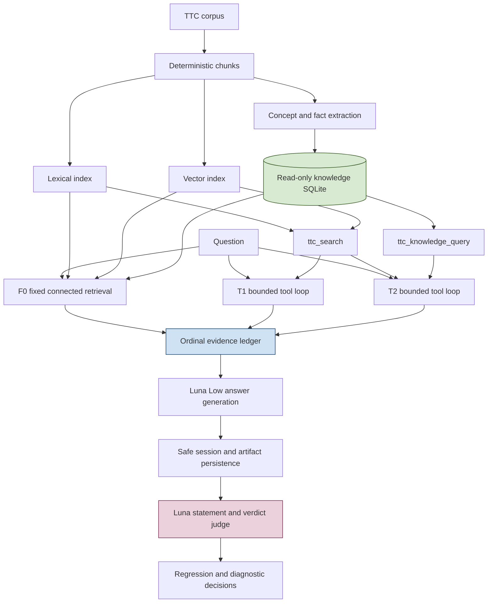
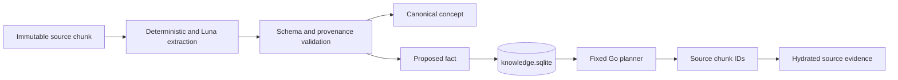
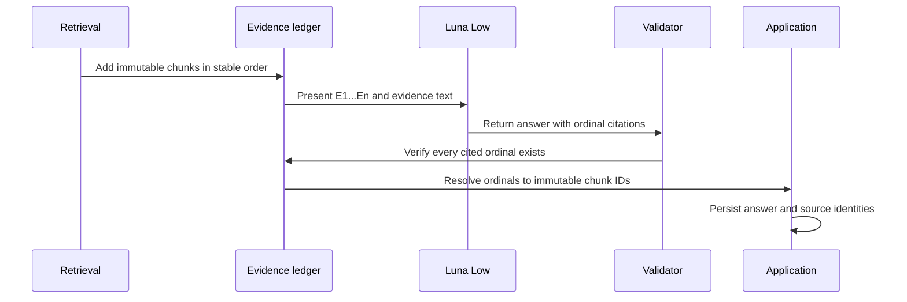
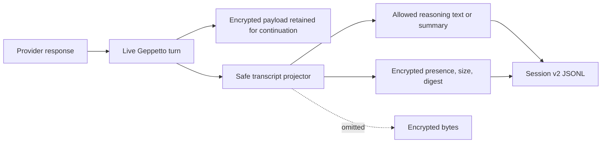
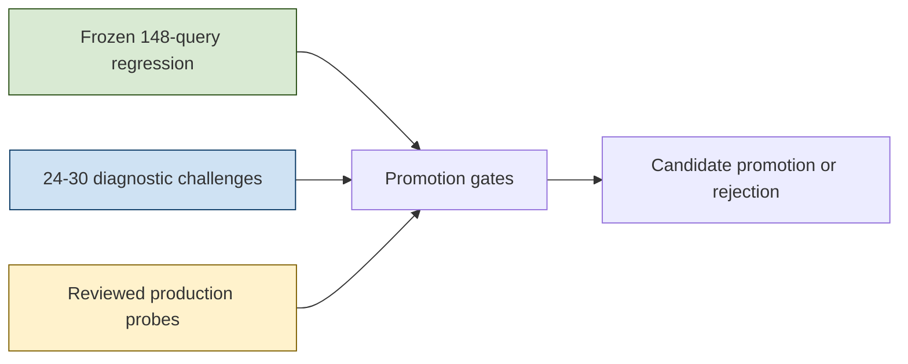

# RAG-TTC: From Incomplete Answers to Observable Evaluation and Post-Saturation Optimization

RAG-TTC is a reproducible question-answering laboratory for the TTC corpus. The work documented here began with a narrow failure: a question requesting information about multiple subjects could receive a grounded answer for only one subject even though the corpus contained the missing evidence. Resolving that failure required more than changing one prompt. It required separating retrieval coverage, context admission, evidence presentation, answer generation, tool execution, persistence, and judging into independently observable stages.

This report presents the complete technical development from the initial connected-retrieval investigation through the final F0/T1/T2 production decision and the post-saturation optimization roadmap. It is intended for an engineer joining the project after the first evaluation cycle. The reader should finish with a precise understanding of what was built, why each component exists, which experiments succeeded, which experiments were rejected, and what work is justified next.

> [!summary]
> - Global concept and fact enrichment was rejected. A narrow two-subject gate improved Recall@10 from `0.8183` to `0.8241` while preserving baseline MRR `0.9221` and changing only 6 of 148 questions.
> - Deterministic ranking and ordinal model-facing citations became production requirements. Public answers continue to expose immutable chunk identifiers through a reversible evidence mapping.
> - A bounded Geppetto tool loop now supports iterative search and optional read-only SQL discovery while retaining safe, optimizer-ready session transcripts.
> - The full frozen F0 control produced 145 judged answers with relevance `0.9000` and faithfulness `0.9763`. T2 failed its target reliability gate and never used SQL, so F0 remains the normal path while T1 and T2 remain diagnostic arms.
> - The 148-question benchmark is now saturated as an aggregate optimization instrument. The next step is a small diagnostic program: classify existing failures, add 24–30 pointed challenge cases, grade answer facets and abstention, and expand only when those additions demonstrate value.

## 1. Project scope and sequence

The project has two connected tickets. `RAG-TTC-CONCEPTDB-001` covers the concept-and-fact database, deterministic connected retrieval, production integration, and bounded database analysis. `RAG-TTC-TOOLLOOP-001` covers configurable search and SQL tools, the bounded multi-inference answer loop, safe transcript persistence, comparative evaluation, and the post-saturation roadmap.

The implementation sequence is important because later components depend on conclusions established by earlier experiments.

| Stage | Question answered | Production result |
|---|---|---|
| Baseline retrieval | Can hybrid retrieval answer the frozen TTC questions reproducibly? | Strong baseline retained. |
| Concept/fact extraction | Can structured corpus facts recover missing subject coverage? | Grounded SQLite artifact retained. |
| A2 global enrichment | Should facts be added to every answer context? | Rejected. |
| A2G gated enrichment | Should facts be admitted only when they cover multiple subjects? | Accepted for six qualifying questions. |
| A3 relation expansion | Does one-hop graph traversal add useful evidence? | Rejected. |
| A0N prompt-only control | Are numbered citations valuable independently of retrieval changes? | Accepted. |
| Production integration | Can evaluated connected retrieval serve chat without losing source identity? | Implemented. |
| Scoped database analysis | Does bounded SQL help diagnose derived knowledge? | Retained for analysis, not serving. |
| Tool loop | Can the answer model search again or inspect SQL safely? | Implemented as T1/T2 experiment arms. |
| Phase 5 evaluation | Should an iterative arm replace fixed retrieval? | No. F0 remains normal. |
| Post-saturation design | How should optimization continue when aggregate scores compress? | Small diagnostic challenge program proposed. |

The resulting system is not a general autonomous research agent. It is a bounded RAG application with explicit experiment identities and retained execution evidence.



## 2. The original failure and its possible causes

The initial symptom was an incomplete answer rather than an unsupported answer. For a comparison or multi-subject question, the system often found strong evidence for one subject. Several chunks about that subject then occupied the bounded answer context. The generator answered from the admitted evidence and omitted the unsupported portion of the question.

That outcome can originate at several boundaries:

- The lexical and vector indexes may not retrieve the missing subject.
- Reciprocal rank fusion may rank redundant chunks above complementary chunks.
- The fixed evidence budget may admit too many chunks for the first subject.
- Chunk boundaries may separate a property from the entity to which it belongs.
- The answer prompt may not enumerate all requested answer facets.
- The generator may fail to synthesize all available evidence.
- A single retrieval pass may be insufficient after the model sees what is missing.

These causes require different fixes. Increasing `top_k` does not repair a prompt that ignores the second requested facet. Prompt changes do not recover evidence discarded before generation. A tool loop cannot compensate reliably if the tool description does not explain how evidence becomes citable. The project therefore treated the answer as the output of a staged system rather than as one model response.

```text
question
  -> lexical/vector candidate retrieval
  -> ranking and fusion
  -> context admission
  -> model-facing evidence presentation
  -> answer inference
  -> contract validation
  -> public citation projection
  -> answer judging
```

Each arrow is an experimental boundary. A useful trace records the values crossing those boundaries.

## 3. Reproducible hybrid retrieval

The baseline retrieves lexical and vector candidates and combines them with reciprocal rank fusion. A fused score for document `d` can be written as:

```text
RRF(d) = sum over channels c of weight(c) / (k + rank(c, d))
```

RRF avoids comparing raw BM25 and vector scores directly. It also creates ties. A deterministic experiment therefore needs a final identity-based ordering at every ranking and truncation boundary.

The critical defect was found in Bleve. Go code sorted returned lexical hits stably, but Bleve had already applied a top-20 cutoff. If more than 20 documents shared the cutoff score, the storage engine could return different members of the tied group. Sorting after truncation could order the selected set but could not restore omitted tied candidates.

The required order is:

```text
take(k, sort(all_candidates, score_desc_then_identity_asc))
```

The unstable order was:

```text
sort(take_arbitrary(k, all_candidates), score_desc_then_identity_asc)
```

The Bleve query now sorts by score descending and representation ID ascending before truncation:

```go
search.SortBy([]string{"-_score", "_id"})
```

Related ordering rules were applied across lexical, vector, fusion, collapse, and evidence-admission paths. Two fresh A0N executions subsequently produced byte-identical retrieval projections with SHA-256:

```text
34f2f5c2207b2d3dbaf615ef0cee2ef21d0f95f6af901193359a4ddd48500047
```

Determinism matters for three reasons. It prevents unchanged questions from receiving different evidence, allows cached comparison artifacts to retain meaning, and ensures that a paired evaluation changes only the component under test.

## 4. Building the concept-and-fact database

The connected-retrieval investigation created a derived SQLite database beside the lexical and vector indexes. Extraction transformed immutable source chunks into proposed concepts, aliases, relations, and facts while preserving exact provenance.

The database was deliberately not treated as primary truth. Each extracted record retains source document and chunk identity, and extracted facts remain proposals subject to validation. This distinction is necessary because model extraction can normalize incorrectly, join unrelated text spans, or emit a plausible relation unsupported by the cited quote.

A simplified fact contract is:

```go
type Fact struct {
    ID              string
    SubjectConcept  string
    Predicate       string
    ObjectText      string
    SourceDocument  string
    SourceChunkID   string
    EvidenceQuote   string
    Confidence      float64
    Status          string
}
```

The source fields provide the path back to corpus evidence. `Status` distinguishes proposed, accepted, and rejected records. The runtime does not allow a fact row to become a final citation by itself.



The extractor and database created useful analysis capabilities, but the first online retrieval experiment established that possessing structured knowledge does not justify adding it globally.

## 5. Why global enrichment failed

The A2 experiment added concept and direct-fact candidates broadly. It improved some difficult cohorts while degrading the overall ranking signal. The measured changes included:

| Cohort | A2 change in Recall@10 |
|---|---:|
| Multi-target | `0.6847 -> 0.6968` |
| Comparison | `0.7803 -> 0.8182` |
| Phase 0 review | `0.4083 -> 0.4833` |

These local gains did not make global enrichment the right default. Structured candidates competed with strong baseline chunks, consumed a fixed evidence budget, and changed evidence order for questions that did not need additional subject coverage. The mean relevance and faithfulness numbers alone could not justify changing every query.

The experiment produced a narrower hypothesis: direct facts are useful when they demonstrate coverage of at least two distinct subjects in the question. This became A2G.

## 6. A2G: the two-subject admission gate

A2G runs baseline retrieval for every question. It also resolves candidate subjects and looks up direct facts. The connected channel is admitted only if direct facts cover at least two distinct resolved subjects.

```text
resolved = resolve_subjects(question)
facts = retrieve_direct_facts(resolved)
covered = distinct_subjects(facts)

if count(covered) < 2:
    return baseline_without_reconstruction

return select_bounded_evidence(
    fuse(baseline, facts),
    require_subject_balance = true,
)
```

The gate changed only 6 of 148 questions. The other 142 questions preserved their baseline retrieval channels, fused rankings, and admitted evidence. Offline composition yielded Recall@10 `0.8241`, compared with baseline `0.8183`, while preserving MRR `0.9221`.

The limited activation rate is a feature. It means the added mechanism has narrow authority and its effect is auditable. A broad improvement mechanism that changes every query requires substantially stronger evidence.

The Blue Ice comparison was the clearest repaired case. It changed from a partial grounded answer with relevance `0.5` to a complete grounded answer with relevance and faithfulness both `1.0`. Manual review of the six changed questions preferred A2G in three cases, rated three as equal, and found no regression.

## 7. Numbered citations and reversible source identity

Earlier prompts exposed opaque chunk identifiers directly to the answer model. Those identifiers are correct for storage and source lookup but difficult for a smaller production model to reproduce exactly. A2G introduced ordinal evidence labels:

```text
E1 -> immutable chunk ID a6f...
E2 -> immutable chunk ID c91...
E3 -> immutable chunk ID 740...
```

The answer model cites `E1`, `E2`, and `E3`. The contract validator checks those labels against a turn-scoped ledger. After validation, the application converts each label back to the immutable chunk ID expected by public APIs, metadata lookup, and persisted artifacts.



The A0N control isolated citation presentation from connected retrieval. It used baseline retrieval with the same numbered evidence and prompt format as A2G. This removed a prior confound in which retrieval gating and citation formatting changed simultaneously. A0N demonstrated that ordinal citations were independently valuable, while the paired A0N/A2G comparison established the incremental value of the gate.

## 8. A3 and the graph stopping rule

A3 tested one-hop relation expansion from resolved concepts. It retrieved 26 complementary facts but did not improve retrieval metrics and slightly lowered mean faithfulness. The extra relations increased the amount of plausible context without reliably adding requested evidence.

This negative result established a stopping rule:

> Do not add graph traversal, ontology query languages, or deeper relation expansion until a documented question fails both baseline retrieval and gated direct facts, and the missing evidence is demonstrably reachable through a bounded relation path.

The database can represent relations without making graph traversal the default serving architecture. Storage capability and online retrieval policy are separate decisions.

## 9. Production connected retrieval

Phase 3.2 extracted A2G from the experiment command into `pkg/rag/connected`. The shared answering package defines a small augmentation interface:

```go
type RetrievalAugmenter interface {
    Augment(
        ctx context.Context,
        baseline RetrievalResult,
        chunks []rag.Chunk,
    ) (RetrievalResult, json.RawMessage, error)
}
```

The connected runtime implements this interface and asserts it at compile time:

```go
var _ answering.RetrievalAugmenter = (*Runtime)(nil)
```

The answering service owns baseline retrieval. The optional augmenter receives the completed baseline result and either returns it unchanged or returns bounded augmented evidence plus an opaque trace. This direction prevents the answering package from importing connected-retrieval implementation details.

The retained augmentation trace records subject resolution, the gate decision, source channels, fused ranks, selected evidence, semantic digests, and timing. The public answer remains expressed in immutable chunk IDs even though the model saw ordinals.

## 10. Scoped database analysis

Phase 4 introduced `scopeddb` over curated SQLite views. Its purpose is diagnosis, not production planning. The analyst or model can ask bounded questions about concepts, predicates, fact support, source coverage, and extraction health without adding a typed Go method for every temporary investigation.

The database path is protected by several independent controls:

- SQLite opens in read-only mode.
- The connection pool is bounded.
- Schema and normalization versions are checked at startup.
- Only curated views are allowed.
- Lexical SQL validation rejects disallowed statements.
- A SQLite authorizer restricts accessed objects and operations.
- Prepared statements must remain read-only.
- Time, row, and cell limits bound execution and output.

The initial views include concept search, fact search, fact support, and relation search. YAML can narrow the compiled allowlist but cannot broaden it.

An important diagnostic finding was that the derived knowledge database covered only the 20-document Phase 1 development slice. A closed connected-retrieval gate could therefore mean either that a question was single-subject or that the relevant source documents had never been extracted. Empty SQL results could not be interpreted as corpus absence.

This coverage boundary changed the next work. Expanding the derived corpus became more important than adding query language power. Every frozen diagnostic question fit bounded SQL, so `scopedjs` was not implemented.

## 11. YAML configuration and semantic identity

Prompts, tool descriptions, enabled tools, bounded limits, and approved views are expected to change during evaluation. These settings were moved into versioned YAML and text assets so experiments can vary them without recompiling the Go binary.

The correct split is:

| Configurable in YAML | Compiled in Go |
|---|---|
| Orchestration prompt paths | Absolute safety ceilings |
| Search and SQL tool descriptions | Exact DTO validation |
| Enabled subset of approved tools | SQL authorizer policy |
| Narrowed view allowlist | Maximum allowed tool universe |
| Search and evidence budgets below ceilings | Turn-loop state machine |
| Provider-call limits below ceilings | Citation validation semantics |
| Transcript redaction and truncation limits | Secret detection and custody rules |

YAML is not permitted to disable security controls or add arbitrary tools. The loader performs strict decoding, safe relative-path resolution, overlay merging, validation against compiled ceilings, and semantic digest calculation.

A semantic digest hashes resolved behavior rather than a filename alone. If a profile references a prompt and two tool-description files, experiment identity must change when any referenced content changes.

```text
semantic_digest = SHA256(
    canonical_yaml(resolved_settings)
    || prompt_bytes
    || search_description_bytes
    || sql_description_bytes
)
```

This makes prompt and tool-description sweeps comparable without pretending that two differently configured runs used the same system.

## 12. Phase 0: contracts before runtime behavior

The tool-loop ticket began by freezing the contracts required for safe iteration. Phase 0 defined:

- the strict `ttc-tool-qa/v1` YAML schema;
- compiled ceilings separate from tunable limits;
- `ttc_search` request and response DTOs;
- the per-turn evidence ledger;
- the final grounded-answer schema;
- `rag-ttc-session/v2` and its `AgentTrace` projection;
- reasoning, encrypted-payload, tool-payload, truncation, and redaction policy;
- fixture prompts, descriptions, profiles, and semantic-digest tests.

This phase prevented later implementation choices from silently changing the meaning of a transcript or experiment. The system knew what a valid search result, evidence citation, final answer, and safe session record looked like before the first live tool loop ran.

## 13. Phase 1: exactly two tools

The model-facing registry contains exactly two possible tools:

1. `ttc_search`, a bounded hybrid source search tool;
2. `ttc_knowledge_query`, the bounded read-only scoped SQL tool.

T1 registers only search. T2 registers search and SQL. There is no arbitrary file tool, network tool, chunk fetch tool, JavaScript evaluator, or database write interface.

The search tool validates query length, applies deterministic hybrid retrieval, hydrates source chunks, deduplicates evidence, assigns stable ordinals across repeated calls, and enforces per-call and per-turn evidence budgets.

The SQL tool is useful for discovery but cannot support final citations. A valid T2 sequence is:

```text
1. Query approved SQL views to discover canonical subjects or predicates.
2. Convert discovered terms into one or more corpus searches.
3. Receive source chunks through ttc_search.
4. Cite only E1...En entries created by those search calls.
5. Produce the final grounded answer.
```

The distinction prevents a generated answer from treating an extraction artifact as the source record.

## 14. Phase 2: the bounded Geppetto inference loop

`pkg/rag/toolanswer.Service` implements the bounded multi-inference workflow. It creates an initial Geppetto turn containing the orchestration prompt and user question, executes model-requested tools serially, appends tool results to the turn, and reserves capacity for a final answer inference.

Serial execution was selected deliberately. Parallel tool calls complicate evidence ordering, tool correlation, cancellation, and budget accounting. No measured latency problem justified that complexity.

A simplified loop is:

```text
turn = new_turn(orchestration_prompt, user_question)
ledger = new_evidence_ledger()

while provider_calls < configured_limit:
    tools = registry.for_current_phase()

    if only_reserved_final_call_remains:
        tools = none

    result = infer(turn, tools)
    append(result, turn)

    if result.requests_tools:
        for call in result.tool_calls_in_order:
            validated = validate_tool_call(call)
            output = execute_with_context(validated)
            ledger.absorb(output.source_evidence)
            append(output, turn)
        continue

    answer = parse_grounded_answer(result)
    validate_citations(answer, ledger)
    return finalize(answer, turn, ledger)

return explicit_provider_call_exhaustion()
```

The reserved terminal call is essential. If every permitted provider call can request another tool, the loop can exhaust its budget without producing a final answer. On the reserved call, tool definitions are removed and the model must finalize from the accumulated evidence.

The service records explicit outcome classes for provider errors, invalid tool input, tool execution failures, limit exhaustion, answer parse failures, invalid citations, cancellation, and successful finalization.

## 15. Evidence ledger and final-answer validation

The evidence ledger is turn-scoped and append-only. Search results are deduplicated by immutable chunk identity. The first admitted chunk receives `E1`, the next new chunk receives `E2`, and repeated results retain their existing labels.

This stability allows multiple searches without changing earlier references:

```text
search 1: chunk A -> E1, chunk B -> E2
search 2: chunk B -> E2, chunk C -> E3
```

The final answer validator checks:

- the response is valid structured JSON;
- required answer fields exist;
- cited evidence labels exist in the ledger;
- unsupported labels are rejected;
- abstention and answer fields satisfy their mutual constraints;
- the result can be projected to immutable public source IDs.

Contract validity is a system-quality metric. An answer with useful prose but invalid citations is not accepted as a grounded result.

## 16. Phase 3: safe, optimizer-ready transcripts

The tool loop records more than final text. It preserves the information required to reproduce, inspect, judge, and later optimize the answer-generation trajectory.

`rag-ttc-session/v2` contains:

- question and final answer data;
- model and provider identity;
- provider-call indices and finish classes;
- token usage and timing;
- tool names, sanitized arguments, results, error classes, and durations;
- iteration-to-block relationships;
- evidence ledger state and final citations;
- prompt, tool-description, configuration, corpus, index, schema, and model digests;
- reasoning text or summaries when allowed by policy;
- encrypted reasoning presence, byte count, and digest without the encrypted bytes.

Geppetto needs encrypted reasoning payloads during live provider continuation, so the runtime does not discard them before the turn completes. The persisted optimizer projection omits those bytes. It records only enough custody metadata to establish that a payload existed and whether two traces carried the same opaque object.



Snapshot cloning occurs synchronously so event observers do not retain mutable provider state. Final blocks are stored once and referenced by ordinal from iterations. Interrupted JSONL tails remain detectable rather than being silently repaired into a different transcript.

These records are already suitable for a later GEPA-inspired optimization loop. They can be imported into SQLite and queried with ad-hoc analysis SQL without integrating `go-minitrace` into the serving runtime.

## 17. Phase 4: application integration

The native tool-answer service was wired into the normal chat runtime. The application constructs the configured registry, routes v2 chat submissions through the bounded service, renders concise tool progress through the existing TUI event sink, and appends one result-plus-trace record after finalization.

The fixed answer service remains available explicitly for F0 evaluation. It is not hidden as a compatibility adapter inside the new runtime. This keeps the experiment arms structurally honest.

The evaluation command was also reorganized to preserve dependency direction:

```text
pkg/rag/tooleval
  owns: Arm, Outcome, Report, FixedArm, deterministic report contracts

cmd/rag-ttc/cmds/chat/tooleval
  owns: application runtime factory, ChatArm, session loading, CLI wiring
```

Research packages do not import application packages. The command layer composes both.

## 18. F0, T1, and T2

Phase 5 compared three narrowly defined arms.

| Arm | Policy | Model tools | Main question |
|---|---|---|---|
| F0 | Fixed deterministic connected retrieval followed by one answer inference | None | How strong is the established production control? |
| T1 | Bounded model-driven retrieval loop | `ttc_search` | Does iterative source search improve completeness? |
| T2 | Bounded model-driven retrieval loop with database discovery | `ttc_search`, `ttc_knowledge_query` | Does SQL discovery add value beyond iterative search? |

The production answering model is `gpt-5.6-luna-low`. The answer-quality judge is `gpt-5.6-luna`. This pairing measures the intended lower-cost production behavior with the stronger selected evaluation model.

The judge runs in two inference stages. Statement extraction decomposes an answer into checkable claims. Verdict generation evaluates each statement against the evidence. The system then derives faithfulness and applies the frozen three-valued relevance rubric.

Judge logging records cell identity, phase, status, statement counts, scores, and timing. It does not log prompts, answer bodies, evidence bodies, or credentials. Judge concurrency is configurable with `--judge-workers`; the full F0 run used four workers. Provider-side cache hits, retries, and quarantined cells are reported explicitly.

## 19. Phase 5 results and production decision

The target T2 repeat failed its promotion gate. Only 8 of 11 answers were contract-valid, and the model made zero SQL calls. The experiment therefore failed to demonstrate either adequate reliability or incremental database-tool value. A broad T2 run would have consumed inference and judging resources without a credible production hypothesis.

The complete F0 control ran all 148 frozen questions.

| Measure | F0 result |
|---|---:|
| Evaluation cells | 148 |
| Contract-valid | 146 |
| Judged | 145 |
| Contract-invalid | 2 |
| Answer-level abstentions | 1 |
| Mean relevance | `0.9000` |
| Mean faithfulness | `0.9763` |
| Relevance `1.0` | 116 |
| Relevance `0.5` | 29 |
| Relevance `0.0` | 0 |
| Faithfulness below `0.9` | 11 |
| Judge cache hits | 0 |
| Judge retries | 0 |
| Quarantined judge cells | 0 |

The two historical query groups were not equally difficult:

| Group | Questions | Judged | Relevance | Faithfulness |
|---|---:|---:|---:|---:|
| `ttc-expand-*` | 69 | 67 | `0.9254` | `0.9874` |
| `ttc-y-*` | 79 | 78 | `0.8782` | `0.9671` |

The production decision is:

- F0 remains the normal question-answering path.
- T1 and T2 remain diagnostic experiment arms.
- Numbered model-facing citations remain part of the production contract.
- T2 is not promoted until a targeted hypothesis produces reliable completion and actual SQL use.
- A3 graph expansion remains disabled.

This is not a decision that iterative tools have no value. It is a decision that the implemented candidate did not beat the fixed path under the current target evaluation.

## 20. Why the benchmark is saturated

The benchmark remains useful, but its aggregate metrics no longer discriminate most plausible improvements. Of 145 judged answers, 116 received relevance `1.0` and 29 received `0.5`. No judged answer received `0.0`.

The mean follows directly:

```text
(116 * 1.0 + 29 * 0.5) / 145 = 0.9000
```

A change that repairs one partial answer moves aggregate relevance by approximately `0.00345`. That movement can be smaller than model or judge variance. More importantly, the aggregate does not state whether an improvement came from retrieval coverage, context admission, generation, citation validity, abstention, or corpus maintenance.

Saturation therefore applies to the current instrument, not to the system's operational requirements. The following remain unsaturated:

- multi-subject completeness;
- required-facet coverage;
- correct abstention for absent or ambiguous information;
- robustness to paraphrase, shorthand, aliases, typos, and reordered constraints;
- tool-loop reliability and actual tool usefulness;
- latency, token use, and provider-call efficiency;
- behavior under smaller production candidates;
- behavior after corpus and derived-index changes.

## 21. The three-layer evaluation model

The post-saturation roadmap separates evaluation into three layers with different responsibilities.

### Layer A: frozen regression

The existing 148 questions remain unchanged. They protect longitudinal comparability, retrieval regressions, citation validity, contract validity, faithfulness, and broad answer relevance.

### Layer B: diagnostic challenge set

An initial 24–30 human-checked cases should target known unresolved boundaries. Six families with four or five cases each are sufficient for the first version:

1. Multi-subject coverage.
2. Comparisons requiring balanced evidence.
3. Multi-constraint or multi-facet answers.
4. Answerability and abstention.
5. Retrieval robustness under realistic wording changes.
6. Tool-choice cases where iterative search or SQL has a specific expected role.

These should be pointed questions, not merely longer questions. Each case must identify what makes it difficult and what evidence or answer facets are required.

### Layer C: reviewed production probes

Real failures can enter a reviewed probe queue after sanitization, deduplication, answerability review, and expected-evidence annotation. Production probes should not be promoted automatically into the frozen benchmark.



## 22. Challenge-case contract

The diagnostic set should add metadata around the existing query type rather than widen production serving DTOs.

```go
type ChallengeCase struct {
    ID                  string
    Query               rag.Query
    Family              string
    DifficultyReason    string
    Answerability       string
    ExpectedFacets      []ExpectedFacet
    ExpectedEvidence    []EvidenceTarget
    ExpectedToolPolicy  string
    Partition           string
    Version             string
}

type ExpectedFacet struct {
    ID          string
    Description string
    Required    bool
    Subject     string
}

type EvidenceTarget struct {
    FacetID       string
    ChunkIDs      []string
    AcceptAny     bool
    AbsenceReason string
}
```

Expected facets are preferable to canonical prose answers. A full reference answer can penalize correct wording differences and can leak one desired generation style into the evaluator. Facets state the information that must be present. Evidence targets state what source support is acceptable.

The first metrics added should be deterministic where possible:

- required-facet coverage;
- expected-evidence recall;
- subject coverage;
- citation validity;
- answer-contract validity;
- abstention precision and recall;
- paired wins, losses, and ties;
- provider calls, tool calls, tokens, and latency.

The existing Luna judge remains frozen for continuity. A small stratified set of 20–30 cells should be compared with human labels before adding more judges or a finer score scale.

## 23. Smaller models as diagnostic instruments

Using a smaller model can reveal whether retrieval context is explicit enough to support a less capable generator. It can also provide a cheaper screening stage for prompt and tool-description candidates. It should not replace the Luna Low production gate merely to make benchmark differences larger.

The first useful experiment is an 8–12 case matrix:

| Evidence | Luna Low | Smaller candidate |
|---|---|---|
| System-retrieved evidence | Measures current production behavior | Measures combined retrieval and model sensitivity |
| Human-checked oracle evidence | Measures residual generation difficulty | Measures whether the smaller model can answer when retrieval is correct |

Interpretation follows from the paired outcomes:

- If both models fail with system evidence and pass with oracle evidence, retrieval or context admission is the likely boundary.
- If Luna Low passes with both evidence sets and the smaller model fails with both, model capability is the likely boundary.
- If a model passes with system evidence but fails with oracle evidence, the oracle package or prompt construction is defective.
- If neither model passes with oracle evidence, the question, facet labels, or answer contract requires review.

The production candidate still has to pass the frozen F0 regression and diagnostic challenge gates under Luna Low.

## 24. Failure attribution

Every non-perfect challenge result should receive one primary failure class and optional secondary evidence. The initial vocabulary should remain small:

```text
CORPUS_ABSENT
RETRIEVAL_MISS
RANKING_OR_ADMISSION
GENERATION_OMISSION
GROUNDING_OR_CITATION
ABSTENTION_ERROR
TOOL_SELECTION_OR_LOOP
CONTRACT_FAILURE
JUDGE_OR_LABEL_DEFECT
```

A deterministic diagnosis procedure can inspect saved artifacts before invoking any additional model:

```text
if expected source is absent from corpus:
    return CORPUS_ABSENT

if expected chunk is absent from retrieval candidates:
    return RETRIEVAL_MISS

if expected chunk is in candidates but absent from admitted context:
    return RANKING_OR_ADMISSION

if required facet is unsupported by admitted evidence:
    return RANKING_OR_ADMISSION

if required facet is supported but absent from answer:
    return GENERATION_OMISSION

if cited label is invalid or claim lacks supporting citation:
    return GROUNDING_OR_CITATION

if expected answerability differs from outcome:
    return ABSTENTION_ERROR

if tool arm fails to finalize or ignores the required tool policy:
    return TOOL_SELECTION_OR_LOOP

return REVIEW_REQUIRED
```

This classification is the basis for targeted optimization. A retrieval miss suggests representation, query, or index changes. A generation omission suggests prompt changes. Tool-loop reliability failures should not trigger ontology work.

## 25. Pragmatic Phase 6 implementation sequence

The roadmap orders work by effort and keeps each phase independently useful.

### Phase 6.0: classify saved failures

Review the 29 partial-relevance answers, two contract-invalid cells, one abstention, and low-faithfulness cases. Produce a versioned review manifest with primary failure classes and write expected facets for an initial 12 cases. This phase requires no new provider calls.

Exit condition: at least 80 percent of reviewed cases receive an agreed primary failure class, or the disagreement is explicitly recorded as a label problem.

### Phase 6.1: author the first challenge set

Expand to 24–30 family-balanced cases. Validate IDs, partitions, required facets, evidence targets, and answerability. Run only F0 first.

Exit condition: the set distinguishes at least two plausible system variants or exposes a meaningful distribution of failure classes.

### Phase 6.2: grade facets and abstention

Add deterministic facet import and abstention confusion metrics. Use Luna only where a human-provided facet label cannot be checked deterministically. Calibrate the judge on a small stratified human sample.

Exit condition: disagreement rates and judge error are understood well enough to interpret candidate deltas.

### Phase 6.3: run the small-model matrix

Select 8–12 difficult cases and compare system versus oracle evidence under Luna Low and one realistic smaller candidate.

Exit condition: each case can be attributed primarily to retrieval/context or generator capability.

### Phase 6.4: add paired robustness transformations

Create paired paraphrase, terse wording, typo, alias, constraint-order, and clarification variants. Compare paired outcomes rather than aggregate scores.

Exit condition: transformations remain semantically equivalent and expose at least one reproducible weakness.

### Phase 6.5: connect candidate optimization

Import challenge outcomes, safe transcripts, and failure classes into the GEPA-inspired candidate evaluator. Change one component per candidate: orchestration prompt, tool description, retrieval profile, or approved SQL-view presentation.

Exit condition: candidate lineage, feedback, validation, and audit custody are reproducible.

### Phase 6.6: add reviewed production probes

Establish a low-volume intake and annotation cadence for real failures.

Exit condition: production probes add new failure modes rather than duplicating the diagnostic set.

### Phase 6.7: consider adaptive exam generation

Generate candidate questions only if manual challenge maintenance becomes a measured bottleneck. Human review remains required before promotion.

Exit condition: adaptive generation must produce useful, non-duplicative cases more efficiently than manual authoring.

## 26. Promotion policy

Candidate promotion should use lexicographic gates rather than one weighted score. Safety and reliability failures cannot be offset by small relevance gains.

The initial order is:

1. No corpus, configuration, or transcript custody violation.
2. No regression in contract validity or citation validity.
3. No material faithfulness regression on the frozen suite.
4. No unacceptable abstention regression.
5. Improvement on the targeted diagnostic family.
6. Acceptable provider-call, token, and latency cost.

Only one major component should change per candidate. A candidate that changes the retrieval profile, orchestration prompt, tool descriptions, and SQL views simultaneously may improve, but the result cannot identify which change should be retained.

## 27. Operational commands and artifacts

The CLI exposes explicit tool-loop run and saved-artifact judge workflows. The exact options should be confirmed through help because profiles and output paths are experiment inputs:

```bash
GOWORK=off GOCACHE=/tmp/rag-ttc-toolloop-gocache \
  go run ./cmd/rag-ttc tool-loop run --help

GOWORK=off GOCACHE=/tmp/rag-ttc-toolloop-gocache \
  go run ./cmd/rag-ttc tool-loop judge --help
```

The full evaluation mode uses `--all-queries`; targeted work uses explicit `--query-ids`. These modes are mutually exclusive to prevent accidental broad provider runs. Judge parallelism is explicit through `--judge-workers`.

The authoritative full F0 artifacts are under:

```text
ttmp/2026/08/02/
  RAG-TTC-TOOLLOOP-001--observable-search-and-sql-tool-loop-for-ttc-question-answering/
    sources/phase5/
      07-full-f0-control-results.md
      full-f0-control/
        tool-loop-report.json
        tool-loop-judge.json
        f0-fixed/
```

`tool-loop-report.json` contains outcomes, answers, citations, usage, latency, and failure status. `tool-loop-judge.json` contains statement extraction, evidence verdicts, faithfulness, and relevance. `f0-fixed/` retains one raw answer artifact per query.

## 28. Code map for a new engineer

Start with these files in order:

| Path | Responsibility |
|---|---|
| `pkg/rag/answering/types.go` | Retrieval, context, grounded answer, contract, and stage observation DTOs. |
| `pkg/rag/connected/` | Production A2G gate, knowledge retrieval, fusion, evidence selection, and augmentation trace. |
| `pkg/rag/ordering.go` | Shared deterministic hit ordering. |
| `pkg/rag/toolconfig/` | Strict YAML loading, validation, overlays, path safety, and semantic digests. |
| `pkg/rag/toolanswer/search.go` | Bounded deterministic source-search tool. |
| `pkg/rag/toolanswer/evidence.go` | Turn-scoped ordinal evidence ledger. |
| `pkg/rag/toolanswer/contract.go` | Final answer and citation validation. |
| `pkg/rag/toolanswer/service.go` | Bounded Geppetto inference and tool loop. |
| `pkg/rag/knowledgetools/scopeddb.go` | TTC-specific bounded SQL runtime and tool registration. |
| `pkg/rag/agenttrace/types.go` | Provider-independent safe trajectory DTOs. |
| `pkg/rag/toolanswer/trace.go` | Snapshot and event projection. |
| `pkg/app/session/types.go` | Durable session v2 schema. |
| `pkg/app/session/recorder.go` | Terminal result-plus-trace append. |
| `pkg/rag/tooleval/runner.go` | Common arm, outcome, and report contracts. |
| `pkg/rag/tooleval/fixed.go` | F0 execution and fixed-arm artifacts. |
| `cmd/rag-ttc/cmds/chat/tooleval/` | Application-owned T1/T2 adapters, factories, judge wiring, and CLI. |
| `cmd/rag-ttc/cmds/experiments/answerquality/judge.go` | Statement/verdict judge and lifecycle logging. |
| `configs/connected-rag/production-v1.yaml` | Frozen connected-retrieval production policy. |
| `configs/tool-qa/production-v1.yaml` | Tool-loop model, tools, limits, descriptions, and transcript policy. |

The two main design documents are:

```text
RAG-TTC-TOOLLOOP-001/design-doc/
  01-intern-guide-to-observable-search-and-sql-tool-loop-question-answering.md
  02-beyond-benchmark-saturation-a-pragmatic-ttc-rag-optimization-roadmap.md
```

The chronological implementation record is `RAG-TTC-TOOLLOOP-001/reference/01-investigation-diary.md`.

## 29. Tests and invariants

The tests protect behavior at the boundaries most likely to invalidate an experiment:

- equal-score lexical, vector, fusion, and cutoff ordering;
- strict YAML fields and compiled ceilings;
- overlay merge behavior and semantic digests;
- safe relative asset paths;
- exact two-tool registration;
- search bounds and evidence deduplication;
- ordinal label stability across repeated searches;
- SQL allowlist narrowing, timeout, row, and cell bounds;
- reserved terminal inference behavior;
- provider-call exhaustion and cancellation;
- invalid final JSON and unsupported citations;
- transcript redaction and credential detection;
- encrypted-payload omission with presence, size, and digest;
- JSON round trips and interrupted JSONL tails;
- research/application dependency direction;
- F0/T1/T2 report compatibility.

These are not incidental implementation tests. They preserve the meaning of evaluation artifacts across code changes.

## 30. Failure modes encountered and retained lessons

### Stable sorting after a cutoff is insufficient

Tie-breaking must occur in the component that truncates the candidate set. A downstream stable sort cannot recover omitted tied candidates.

### Aggregate corpus packaging changes diversity behavior

When many documents share a synthetic source identifier, diversity and per-document evidence rules can collapse unrelated pages. Stable source identity must preserve the operational unit intended by the selector.

### Citation formatting is an experimental variable

Changing opaque IDs to ordinals can change contract validity and generation behavior. Prompt-only controls are required before attributing gains to retrieval.

### Derived-database absence is not corpus absence

The knowledge database initially covered 20 development documents. Empty facts can indicate missing extraction coverage rather than missing source evidence.

### A tool's availability does not establish its value

T2 registered SQL correctly but made zero SQL calls in the target repeat. Tool-call counts and successful completion are part of the evaluation, not implementation trivia.

### Better retrieval does not guarantee a better answer

Additional evidence can displace strong baseline chunks, increase generation burden, or introduce irrelevant statements. Retrieval, context, and answer metrics must be separated.

### Judge execution needs operational visibility

Aggregate progress was insufficient for diagnosing stalled cells. Structured per-cell lifecycle logs and explicit worker counts made the full run operable without logging sensitive content.

### External authentication failures must remain distinct from code failures

The saved-artifact Luna judge initially failed with HTTP 401 under the retired route. Correct profile routing and credential state were repaired without regenerating immutable answer artifacts.

### Cache reuse must be exact

Historical judgments are comparison evidence, not cache entries for regenerated answers. The full F0 judge correctly reported zero cache hits because its answer and evidence inputs were new.

## 31. What was deliberately not built

Several plausible extensions remain deferred:

- unrestricted graph traversal;
- a general ontology query engine;
- `scopedjs` for database analysis;
- arbitrary SQL or database writes;
- parallel tool execution;
- automatic answer-contract repair;
- a separate chunk-fetch tool;
- automatic production-probe promotion;
- multi-judge panels on every cell;
- autonomous benchmark generation;
- one composite score combining safety, quality, and cost.

Each deferred item lacks a measured failure that the simpler system cannot address.

## 32. Current project status

Phases 0 through 5 of the tool-loop ticket are implemented and evaluated. F0 is the selected normal answer path. The tool loop, session v2 persistence, search tool, SQL tool, and evaluator remain available for diagnostic experiments. Phase 6 is designed but not implemented.

The immediate work is Phase 6.0:

1. Load the saved full F0 report and judge artifacts.
2. Enumerate the 32 non-perfect operational outcomes: 29 partial answers, two invalid cells, and one abstention.
3. Inspect retrieval candidates, admitted context, answer facets, citations, and judge statements.
4. Assign a primary failure class.
5. Write expected facets and evidence targets for an initial 12 cases.
6. Review the labels before making new provider calls.

This task should be committed separately from evaluator implementation. The annotation review is a data-quality decision and should remain inspectable on its own.

## 33. Working rules established by the project

> [!important]
> Preserve the frozen 148-query benchmark. Add new diagnostic cases in a separate versioned dataset.

> [!important]
> Search evidence is citable. SQL rows and extracted facts are discovery aids until resolved back to source chunks.

> [!important]
> Apply stable identity tie-breakers before every top-k cutoff, not after it.

> [!important]
> Change one major component per candidate and retain all semantic digests required to identify that change.

> [!important]
> Promote only after hard reliability and grounding gates pass. Do not offset contract or safety regressions with aggregate relevance gains.

> [!important]
> Add architectural power only when a documented failure survives the simpler fixed and gated paths.

## 34. Related project reports

This synthesis is grounded in the following dated reports:

- [[PROJECT REPORT - RAG-TTC Connected Retrieval - Gated Facts, Numbered Citations, and the Graph Stopping Rule]]
- [[PROJECT REPORT - RAG-TTC Phase 3.1 - Deterministic Retrieval and the A0N Production Decision]]
- [[PROJECT REPORT - RAG-TTC Phase 3.2 - Production Connected Retrieval and Reversible Citations]]
- [[PROJECT REPORT - RAG-TTC Phase 4 - Bounded Database Analysis and Derived-Corpus Coverage]]
- [[PROJECT REPORT - RAG-TTC Tool Loop - Observable Multi-Inference QA and the F0 T1 T2 Evaluation]]
- [[PROJ - RAG-TTC Chunk Lab Results - From BM25 Screening to the Hybrid Retrieval Reversal]]
- [[PROJ - RAG-TTC LLM Judge - A Two-Step Decomposed Faithfulness Pipeline from Design to Live Run]]
- [[PROJ - RAG-TTC Luna Era - Executing the Six-Item Sequence on Subscription Economics]]

## 35. Conclusion

The RAG-TTC work converted an incomplete-answer symptom into an observable engineering program. It established deterministic retrieval, tested structured enrichment under controlled gates, separated model-facing citations from source identity, integrated the accepted connected policy into production, exposed bounded SQL for analysis, implemented a constrained multi-inference answer loop, retained safe trajectories, and evaluated the resulting arms with the selected production and judge models.

The strongest result is not a more elaborate retrieval architecture. It is a clearer boundary for when additional mechanisms are justified. Fixed connected retrieval remains the production path because it is reliable, grounded, and broadly strong. The tool loop remains available because it creates diagnostic and optimization opportunities, but it has not yet earned promotion. The benchmark remains valuable because it protects regressions, but it no longer provides enough resolution for optimization by aggregate score.

The next stage is consequently small and concrete: classify saved failures, author a compact diagnostic challenge set, measure facets and abstention, and use smaller models only where they clarify whether evidence or generation is limiting performance. That sequence preserves the evidence accumulated so far and creates a direct path to prompt, tool-description, retrieval, and SQL-view optimization without constructing an oversized evaluation system.
