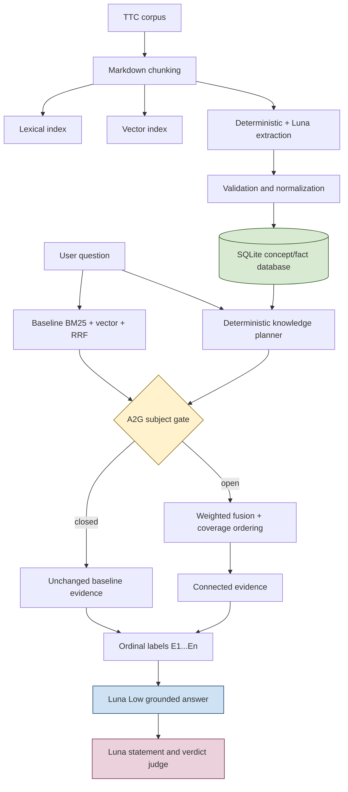

# RAG-TTC Connected Retrieval: Gated Facts, Numbered Citations, and the Graph Stopping Rule

This report documents the design, implementation, and evaluation of a pragmatic concept-and-fact retrieval layer for `rag-ttc`. The work began with a specific answer-quality failure: multi-subject questions could retrieve enough material to answer one requested part while omitting the evidence needed for the remaining subjects or attributes. The resulting answer was narrow and usually faithful, but incomplete. The project tested whether a small source-grounded SQLite database could repair that failure without replacing the established BM25/vector retrieval path or introducing a general graph architecture.

The completed work covers Phase 0 through Phase 3 of ticket `RAG-TTC-CONCEPTDB-001`. It freezes the experiment, builds the smallest grounded database, evaluates direct concept and fact channels, introduces a two-subject admission gate called A2G, replaces opaque citation hashes with ordinal evidence labels, and tests bounded one-hop relation expansion as A3. The result is a positive decision for gated direct facts and a negative decision for graph expansion.

> [!summary]
> - A2G preserves baseline MRR at `0.9221` and increases Recall@10 from `0.8183` to `0.8241` while opening connected retrieval for only 6 of 148 questions.
> - Ordinal evidence labels produce 148 contract-valid answers with no citation failures under the Luna Low production profile.
> - A3 retrieves 26 complementary one-hop facts but produces no retrieval improvement and slightly lowers mean faithfulness, so graph retrieval remains disabled.
> - The next justified work is a deterministic tie-breaker and a prompt-only numbered-citation control, not a deeper graph or ontology.

This report is part of the [[rag-ttc]] project history. It follows [[PROJECT REPORT - rag-ttc - Clean-Slate RAG Experiments in Plain Go]], [[PROJ - RAG-TTC Chunk Lab Results - From BM25 Screening to the Hybrid Retrieval Reversal]], and [[PROJ - RAG-TTC LLM Judge - A Two-Step Decomposed Faithfulness Pipeline from Design to Live Run]].

## 1. The question the project had to answer

The established RAG pipeline already had a strong baseline. It chunks the TTC corpus, indexes lexical and vector representations, retrieves from both channels, combines the rankings with reciprocal rank fusion, admits a fixed evidence budget, and asks a model for a grounded JSON answer. Retrieval quality was not uniformly poor. The relevant weakness was concentrated in multi-target questions, comparisons, and questions containing several requested attributes.

Consider a question that asks the system to compare two plant products. A semantic or lexical query can strongly match one product page. If the first product supplies several high-scoring chunks, those chunks can consume the five-chunk answer budget before the second product reaches the generator. The generator then has three valid choices: answer only the supported side, state that the remaining side is unsupported, or fail the output contract while attempting to compensate. None solves the missing-evidence problem.

The initial hypothesis was therefore narrower than “build a knowledge graph.” It was:

> A source-grounded concept and fact index may add missing subject coverage to selected questions, provided that the ordinary retrieval result remains the default and every added claim retains exact document provenance.

This hypothesis imposed five constraints on the design:

1. SQLite remained the operational database.
2. The online planner remained deterministic Go code.
3. Model-written SQL, generated JavaScript, and unrestricted traversal remained outside the default path.
4. Every extracted fact had to point to an exact source chunk and evidence quote.
5. Each new capability required an isolated evaluation arm and a removal criterion.

These constraints are important because connected retrieval changes more than recall. It changes evidence order, generator context, citations, latency, and the distribution of answer failures. A valid experiment must measure all of those effects.

## 2. The system boundary

The implementation adds a derived knowledge layer beside the existing retrieval indexes. It does not replace either lexical or vector search.



The architecture separates three concerns:

- Extraction turns immutable chunks into proposed concepts and facts.
- Retrieval decides whether structured knowledge contributes candidate chunks.
- Answer generation receives only admitted evidence and must cite it through a strict contract.

The same SQLite artifact supports inspection and future tools, but the online path uses typed repository functions rather than arbitrary queries. The relevant code lives under:

- `pkg/rag/knowledge/`
- `pkg/rag/knowledge/retrieve/`
- `pkg/rag/connectedconfig/`
- `cmd/rag-ttc/cmds/experiments/answerquality/connected.go`
- `configs/connected-rag/`

## 3. Phase 0: freeze the experiment before changing behavior

Phase 0 records the identities that later results depend on. The corpus, evaluation set, chunker settings, baseline run, query subsets, schema version, model assignments, prompts, and evidence limits become explicit inputs. This prevents a later result from silently combining several changes under one arm name.

The frozen experiment uses:

| Input | Frozen value |
|---|---|
| Evaluation | 148 queries, 243 judgments |
| Chunker | Markdown, 1,200 runes, 120 overlap |
| Baseline retrieval | BM25 top 20 + vector top 20 + RRF |
| Fused candidate limit | 30 |
| Evidence limit | 5 chunks |
| Context limit | 12,000 runes |
| Knowledge development slice | 20 documents |
| Answer model | `gpt-5.6-luna-low` production profile |
| Judge model | `gpt-5.6-luna` |
| Knowledge schema | `ttc-concept-facts-v1` |

The experiment also freezes semantically meaningful subsets: single-target, multi-target, comparison, constrained selection, procedure, policy and commerce, baseline-incomplete, and the earlier Phase 0 review set. Whole-set improvement alone would not establish that the original multi-subject failure was repaired.

## 4. Phase 1: construct a source-grounded database

Phase 1 imports documents and chunks, runs deterministic extraction for structural facts, runs Luna extraction on the development slice, validates every generated item, normalizes conservatively, and publishes SQLite. The database is derived data. The source corpus remains authoritative.

The central record types are concepts, aliases, mentions, facts, evidence links, and topics. Facts may refer to literal text, a numeric value and unit, or another concept.

```text
Concept
  id
  canonical_name
  normalized_name
  kind
  status
  confidence

Fact
  id
  subject_id       -> Concept
  predicate
  object_concept_id -> Concept, optional
  object_text       -> optional
  value_number      -> optional
  unit
  status
  confidence

FactEvidence
  fact_id          -> Fact
  chunk_id         -> immutable corpus chunk
  quote
  char_start
  char_end
```

Generated extraction output is not inserted directly. It passes a sequence of checks:

```text
generated JSON
    -> strict schema decode
    -> known chunk identity
    -> exact evidence quote search
    -> character offset assignment
    -> conservative name normalization
    -> duplicate and conflict handling
    -> accepted model or explicit rejection
    -> SQLite publication
```

The exact-quote requirement establishes provenance at ingestion time. A later retrieval trace can name the selected fact, its subject, its predicate, the evidence chunk, and the quoted span. The answer model does not receive an ungrounded database assertion.

### 4.1 Why facts remain proposed

The development extraction was reviewed for structural integrity and source grounding, but it did not include a full human promotion campaign. Extracted records therefore remain `proposed`. The retrieval experiment may evaluate them because it retains evidence, but production code must not treat their normalized predicates as an authoritative ontology.

This distinction becomes important in Phase 3. The database contains many plausible relationships, including broad `other` and `topic` concepts. Source grounding establishes that the text supports an extraction. It does not establish that the extraction is useful for a particular retrieval question.

## 5. Phase 2: direct concepts and facts

Phase 2 evaluates three arms:

| Arm | Baseline | Concept chunks | Direct facts | Relations |
|---|---:|---:|---:|---:|
| A0 | yes | no | no | no |
| A1 | yes | yes | no | no |
| A2 | yes | yes | yes | no |

The planner matches concept names and aliases in the question, rejects ambiguous short terms, detects requested predicate hints, retrieves direct facts through an allowlist, hydrates exact evidence, and produces independent knowledge channels. The planner does not call a model.

The direct-fact predicate policy includes controlled terms such as:

```text
hardiness_zone, mature_height, mature_width, growth_rate,
suitable_for, tolerates, requires, avoids,
has_step, precedes, applies_when, allows,
prohibits, requires_action, alias_of, variant_of, member_of
```

Open-ended predicates remain queryable for analysis but do not automatically enter answer evidence. This is a compiled safety boundary, not only a YAML convention.

### 5.1 Balanced fact and evidence selection

Retrieving facts for several subjects does not guarantee that several subjects survive the evidence budget. Phase 2 exposed several independent starvation points:

- concept matching could resolve an incomplete coordinated product name;
- global fact ordering could place all facts from one subject first;
- a shared evidence query limit could be exhausted by facts with many supporting chunks;
- the fused cutoff could remove the second subject before evidence selection;
- a per-document cap could be incorrect when the corpus is packaged as one aggregate document.

The corrected implementation queries facts per subject, ranks them with predicate hints, interleaves subject buckets, hydrates a bounded number of evidence rows per fact, and applies subject-aware requested-part ordering before the final evidence cutoff.

```go
for each resolvedSubject:
    facts[resolvedSubject] = repository.Facts(
        subject = resolvedSubject,
        predicates = admittedPredicates,
        status = proposed,
        limit = factLimit,
    )

rank each subject bucket
selectedFacts = roundRobin(facts by resolved subject order)

for each selectedFact:
    evidence += repository.EvidenceForFact(selectedFact, limit = 3)

rank evidence by requested predicate and subject complementarity
```

This sequence repaired the Blue Ice versus Carolina Sapphire comparison. The original answer contained evidence for only one side. The corrected A2 cell supplied both products and produced a complete answer with relevance and faithfulness both equal to 1.0.

### 5.2 Why global A2 was rejected

A2 improved difficult cohorts but changed ranking across the full set and increased answer contract failures. The measured pattern was not “facts are harmful.” It was “facts are useful under a narrower admission condition than all questions.”

| Measure | A0 | A2 |
|---|---:|---:|
| Whole-set Recall@10 | 0.8183 | 0.8183 |
| MRR | 0.9221 | 0.8787 |
| Multi-target Recall@10 | 0.6847 | 0.6968 |
| Comparison Recall@10 | 0.7803 | 0.8182 |
| Phase 0 review Recall@10 | 0.4083 | 0.4833 |
| Mean relevance | 0.9167 | 0.9333 |
| Mean faithfulness | 0.9869 | approximately 0.99 |

The A2 result justified a gate, not a global default.

## 6. Phase 2.1: A2G gated direct facts

The original design had already reserved A3 for bounded graph expansion. The Phase 2 result draft temporarily reused A3 for the gate, creating an experiment identity collision. The design and task ledger were corrected before implementation: the two-subject gate became **A2G**, and A3 retained its original graph meaning.

### 6.1 The gate

A2G performs deterministic direct retrieval, counts distinct stable fact subjects, and admits connected channels only when the count reaches two.

```go
baseline := retrieveRRF(question)
knowledge := planner.Retrieve(question)

subjectIDs := unique(
    fact.SubjectID
    for fact in knowledge.SelectedFacts
    if fact.SubjectID != ""
)

if len(subjectIDs) < 2 {
    return baseline
}

return fuseAndSelect(baseline, knowledge)
```

Stable subject IDs are counted rather than display names. Names can differ through spelling, aliases, product labels, or taxonomic normalization. Relation objects do not contribute to this gate because A2G is specifically a direct-fact experiment.

The trace records:

```json
{
  "minimum_fact_subjects": 2,
  "fact_subject_ids": ["concept-...", "concept-..."],
  "open": true,
  "reason": "minimum-fact-subjects-met"
}
```

When the gate closes, the code returns the baseline fused hits and evidence directly. It does not re-run fusion with a single baseline channel, because even mathematically equivalent refusion would change stored scores and could disturb tie ordering.

### 6.2 Numbered evidence citations

The first live Phase 2 attempts exposed a separate generator failure. Luna Low could ground the answer correctly but truncate or alter opaque chunk hashes while copying them into `citation_chunk_ids`. Strict validation correctly rejected those answers.

Connected generation now sees evidence labels `E1` through `En`. The retrieval trace retains the mapping to original chunk IDs.

```text
trace:
  E1 -> chunk-4361ee48a7278064
  E2 -> chunk-6a8f63299f766f77

provider context:
  [E1]
  <first complete evidence chunk>

  [E2]
  <second complete evidence chunk>

provider output:
  "citation_chunk_ids": ["E1", "E2"]
```

The field retains its historical JSON name, but connected-arm values are ordinal labels. Strict validation accepts only labels present in the admitted evidence. Retrieval artifacts and connected traces retain original identities, so the change reduces generation burden without discarding provenance.

### 6.3 A2G results

The full run used Luna Low for 148 answers and Luna for two-stage judging. The gate opened for exactly six questions and remained closed for 142.

| Metric | A0 | A2 | A2G |
|---|---:|---:|---:|
| MRR | 0.9221 | 0.8787 | 0.9221 |
| Recall@10 | 0.8183 | 0.8183 | 0.8241 |
| nDCG@10 | 0.8213 | — | 0.8249 |

The cohort results show what the gate retains and what it gives up:

| Subset | A0 Recall@10 | A2 Recall@10 | A2G Recall@10 |
|---|---:|---:|---:|
| Multi-target | 0.6847 | 0.6968 | 0.6948 |
| Comparison | 0.7803 | 0.8182 | 0.8182 |
| Baseline incomplete | 0.4549 | 0.4861 | 0.4722 |
| Phase 0 review | 0.4083 | 0.4833 | 0.4500 |

A2G gives up part of A2's subset improvement in exchange for preserving baseline MRR and leaving most queries unchanged. Single-target Recall@10 remains 1.0.

The answer contract result is equally important:

| Measure | Historical A0 | A2G |
|---|---:|---:|
| Total cells | 148 | 148 |
| Judged non-abstained | 138 | 147 |
| Abstentions | 2 | 1 |
| Invalid outputs | 8 | 0 |
| Citation successes | not isolated | 147/147 |
| Mean relevance | 0.9167 | 0.8912 |
| Mean faithfulness | 0.9869 | 0.9835 |

The validity improvement is attributable to ordinal labels. The judge-score comparison is not a clean retrieval ablation because Phase 2.1 changed both retrieval gating and citation presentation. All answers were regenerated under the new prompt. A prompt-only A0 ordinal-label arm is required to isolate that effect.

### 6.4 The six admitted questions

The gate opened for:

- `ttc-expand-048`: Danica Globe versus Pancake Arborvitae attributes.
- `ttc-expand-060`: selecting a Thuja privacy-screen product.
- `ttc-expand-069`: third-year fertilizer for Thuja Green Giant.
- `ttc-y-005`: Blue Ice versus Carolina Sapphire site requirements.
- `ttc-y-007`: Thuja Green Giant versus Leyland Cypress as privacy screens.
- `ttc-y-080`: the current sale price of Thuja Green Giant.

Two admitted questions still had Recall@10 equal to 0.5. The gate establishes that multiple grounded subjects are available. It does not establish that every requested attribute or judged target is present. That distinction prevents the admission rule from being mistaken for a completeness proof.

## 7. Phase 3: bounded one-hop relation expansion

Phase 3 asks whether source-grounded relations can add useful evidence beyond A2G. The experiment remains deliberately bounded:

- traversal is outgoing from deterministically resolved concepts;
- depth is one;
- discovered object concepts are never traversed recursively;
- at most eight distinct object concepts are admitted;
- predicates come from a compiled allowlist;
- subject and object kinds are constrained;
- cycles, start-node returns, unsupported kinds, and node-limit exclusions are traced;
- every selected relation and complementary fact retains exact evidence.

The accepted subject kinds are `plant_taxon`, `product`, and `procedure`. The accepted object kinds are `plant_taxon`, `product`, `procedure`, `property`, `policy`, `place`, and `use`. Broad `other` and `topic` concepts are rejected.

### 7.1 A critical implementation correction

The first A3 implementation placed relation evidence in an independent channel. Code review found that A2's direct `Facts` query already includes facts whose object is a concept. Re-emitting those same facts under a new channel would not be graph expansion.

The corrected A3 algorithm uses relations as paths and retrieves complementary facts attached to their bounded object concepts:

```go
startConcepts := resolvedConcepts(question)
directFacts := factsFor(startConcepts)

relations := repository.Relations(
    subjects = startConcepts,
    predicates = graphPredicateAllowlist,
    status = proposed,
)

expandedConcepts := []ConceptID{}
for relation in rank(relations) {
    if invalidKind(relation) || returnsToStart(relation) {
        trace.reject(relation)
        continue
    }
    if adding(relation.ObjectConceptID) exceeds nodeLimit {
        trace.reject(relation)
        continue
    }
    expandedConcepts.add(relation.ObjectConceptID)
}

graphFacts := factsFor(expandedConcepts)
graphFacts = removeFactsAlreadyPresent(directFacts, graphFacts)
graphEvidence := hydrate(relations + graphFacts)
```

This is one-hop expansion because only the original resolved concepts are relation subjects. Object concepts contribute facts, but their outgoing relations are not queried.

### 7.2 A3 results

The six-query smoke and 148-query full run are retrieval-flat against A2G.

| Metric | A2G | A3 |
|---|---:|---:|
| MRR | 0.9221 | 0.9221 |
| Recall@10 | 0.8241 | 0.8241 |
| nDCG@10 | 0.8249 | 0.8249 |
| HitRate@10 | 0.9722 | 0.9722 |
| Contract-valid answers | 148 | 148 |
| Mean relevance | 0.8912 | 0.8912 |
| Mean faithfulness | 0.9835 | 0.9831 |

The planner found accepted relation paths on eleven questions, selected 26 complementary graph facts on six questions, and recorded 66 rejected relations. None of this work improved a judged retrieval target.

Four cells had evidence changes attributable to graph retrieval: `ttc-expand-048`, `ttc-expand-069`, `ttc-y-007`, and `ttc-y-080`. Three retained identical answer scores. `ttc-expand-048` fell from faithfulness 1.0 to 0.9412 while relevance remained 1.0.

The result satisfies the predefined removal condition. Graph expansion is not enabled in the base configuration. The implementation, tests, disabled YAML arm, and traces remain for reproducibility, but Phase 3 stops here.

## 8. What the experiment establishes

The main result is not that structured knowledge always improves RAG, and it is not that graph retrieval never works. The experiment establishes a more precise set of claims for this corpus, extraction artifact, query distribution, and evidence budget.

### 8.1 Direct facts are conditionally useful

Direct fact evidence repairs selected multi-subject failures. Applying it globally changes ranking too broadly. A deterministic coverage gate captures part of the benefit while preserving the baseline's strongest ranking property.

### 8.2 Source grounding is necessary but not sufficient

Every A3 fact was tied to evidence. The graph still failed to improve retrieval. Grounding answers whether a claim came from the corpus. Retrieval usefulness additionally depends on whether that claim supplies a missing requested part and survives the fixed context budget without displacing stronger evidence.

### 8.3 Evidence budgets determine connected-retrieval value

Connected retrieval adds candidates to a bounded context. If the new evidence does not cover a missing subject or attribute, it competes with direct evidence. A graph can contain valid connections and still lower answer quality because the generator sees fewer relevant chunks.

### 8.4 Output contracts are part of system quality

Opaque citation transcription created invalid answers even when evidence and prose were otherwise acceptable. Ordinal labels changed the mechanical task presented to Luna Low and eliminated that failure class. A RAG evaluation that reports only retrieval recall would miss this improvement completely.

### 8.5 Stopping rules prevent architectural drift

Phase 3 had a clear rule: if one-hop expansion was flat, retain direct facts and stop. The result was flat and slightly harmful. The correct outcome is a disabled graph arm, not an attempt to recover sunk design work through depth-two traversal, generated planning, an ontology, or a new database.

## 9. Reproducibility and configuration

The experiment keeps sweepable semantics in YAML and stable mechanisms in Go.

YAML owns:

- arm name;
- prompt paths;
- model roles;
- concept and fact enablement;
- minimum fact subjects;
- graph enablement and predicate list;
- retrieval and evidence limits;
- fusion weights;
- evidence selection mode.

Go owns:

- schemas and typed repository functions;
- compiled safety ceilings;
- exact SQL;
- concept resolution;
- gate computation;
- traversal depth and cycle behavior;
- ranking and deduplication;
- citation validation;
- artifact and trace structure.

An A2G overlay is intentionally small:

```yaml
name: a2g-gated-direct-facts

retrieval:
  knowledge:
    concepts_enabled: true
    facts_enabled: true
    graph_enabled: false
    min_fact_subjects: 2
  fusion:
    baseline_weight: 1.0
    knowledge_weight: 0.6
  selection:
    mode: requested-part-coverage
```

Resolved configuration, prompt contents, database digest, subset digest, responses, traces, judge records, cache observations, failures, and resource usage are stored with each run. Semantic digests change when executable YAML or referenced prompt content changes.

## 10. Failure analysis and technical lessons

### 10.1 Candidate coverage can be lost at several boundaries

Subject-aware ranking applied only at the last evidence step cannot recover a subject removed by an earlier SQL limit. The implementation must preserve complementarity across concept resolution, fact retrieval, evidence hydration, fusion, fused cutoff, and final context admission.

### 10.2 Aggregate corpus packaging changes diversity semantics

The TTC experiment can represent many source pages inside one aggregate document. A per-document evidence cap designed for page-level documents can then treat the entire corpus slice as one source and suppress legitimate evidence. Diversity policies must use the identity unit that matches the corpus representation.

### 10.3 Stable IDs do not guarantee stable order

Comparing the A2G and A3 runs found ten different final evidence sets. Six differences already existed in `baseline_fused` and occurred on closed-gate queries. They are cross-run tie-order differences, not graph effects. A deterministic final tie-breaker, probably chunk ID after all score keys, is required before future byte-for-byte paired ranking claims.

### 10.4 Evaluation arms must have unique names

The temporary A3 naming collision could have mixed two different hypotheses in reports and artifacts. Arm names are part of experimental identity. A2G now means gated direct facts; A3 means bounded one-hop relations.

### 10.5 A stronger judge does not repair a weaker production answerer

The production target is Luna Low, so retrieval, prompt, evidence layout, and output constraints are evaluated with Luna Low. Luna is used for judging. Production validity must follow from the evidence packet and answer contract rather than relying on a stronger answer model.

## 11. Validation and commits

The implementation passed:

- `go test ./... -count=1`;
- `go build -buildvcs=false ./...`;
- scoped `golangci-lint` over the changed knowledge, configuration, and answer-quality packages;
- `docmgr doctor --ticket RAG-TTC-CONCEPTDB-001 --fail-on warning`.

The full repository lint target reported fourteen findings in unrelated or concurrently changing packages. The diary records each category. Scoped lint reported zero issues for the Phase 2.1 and Phase 3 code.

Principal commits include:

| Commit | Purpose |
|---|---|
| `e73fe93` | Reconcile A2G/A3 naming and create the phase task ledger |
| `01a199e` | Add gated facts, ordinal evidence, and bounded relation arms |
| `b5e0898` | Constrain relation expansion by concept kind |
| `3ecbc62` | Retrieve complementary facts from one-hop object concepts |
| `2ef5f78` | Enforce the compiled graph predicate ceiling |
| `924b2bf` | Record Phase 2.1 and Phase 3 results and decisions |

## 12. What comes next

The next justified work is a small reproducibility and causal-control phase, not Phase 4 tooling and not additional graph design.

### 12.1 Stabilize tied baseline rankings

Add a total-order tie-breaker to every relevant retrieval and fusion sort. Run the same frozen configuration twice and compare fused rankings and selected evidence byte-for-byte. This removes cross-run noise from future paired evaluations.

### 12.2 Run A0N: baseline retrieval with numbered citations

A2G changed retrieval admission and citation presentation together. Run a baseline arm with the same ordinal labels and connected answer prompt but no concept or fact channel:

```text
A0N = A0 retrieval + E1...En evidence labels + connected answer prompt
```

Compare A0N and A2G under identical generation and judge contracts. This isolates the answer-level contribution of gated retrieval from the contribution of simpler citations.

### 12.3 Make the production choice

- If A2G improves multi-subject completeness over A0N without lowering relevance or faithfulness, integrate A2G into the normal QA path.
- If A2G does not improve answer quality, retain ordinal citations and keep baseline retrieval as the default.
- Keep A2 and A3 as diagnostic experiment arms.

Phase 4 `scopeddb` and `scopedjs` work remains optional. It should begin only when a concrete analysis question cannot be answered effectively through the fixed typed queries and existing artifacts.

## 13. Working rules preserved by this project

The following rules should govern later connected-retrieval work:

- Preserve baseline retrieval as an explicit arm and default fallback.
- Admit structured evidence through measured gates, not global enthusiasm.
- Count stable identities rather than display strings.
- Preserve provenance from extraction through answer citation.
- Measure answer validity and completeness alongside retrieval recall.
- Keep prompts and sweep parameters in YAML; keep safety and algorithms in Go.
- Treat proposed extractions as proposed records, not authoritative ontology facts.
- Require isolated arms and removal criteria for every new retrieval mechanism.
- Stop graph work when the bounded experiment is flat.

> [!important]
> The selected system is baseline retrieval plus a two-subject direct-fact gate and ordinal citations. Graph traversal, generated SQL, generated JavaScript, and online ontology construction are not justified by the completed evidence.

## 14. Source documents and run artifacts

The source ticket is:

`/home/manuel/workspaces/2026-06-30/benchmark-cpu-inference/rag-ttc/ttmp/2026/08/01/RAG-TTC-CONCEPTDB-001--pragmatic-corpus-concept-and-fact-index-for-connected-rag/`

Start with:

- `design-doc/01-intern-guide-a-pragmatic-concept-and-fact-index-for-connected-rag.md`
- `design-doc/02-configuration-contract-for-retrieval-prompts-and-scoped-tools.md`
- `reference/01-investigation-diary.md`
- `sources/phase1/01-extraction-quality-report.md`
- `sources/phase2/02-phase2-connected-retrieval-results.md`
- `sources/phase2.1/02-phase2.1-a2g-results.md`
- `sources/phase3/02-phase3-a3-results.md`

Canonical full runs:

- A2G: `sources/phase2.1/full/20260802T032419.169142653Z-answer-quality-b92d938b3b2e/`
- A3: `sources/phase3/full/20260802T033329.071961723Z-answer-quality-a7fc7e60a546/`

Each run retains resolved configuration, prompts, responses, strict answer records, connected retrieval traces, judge outputs, subset metrics, operational observations, and reproducibility manifests.
