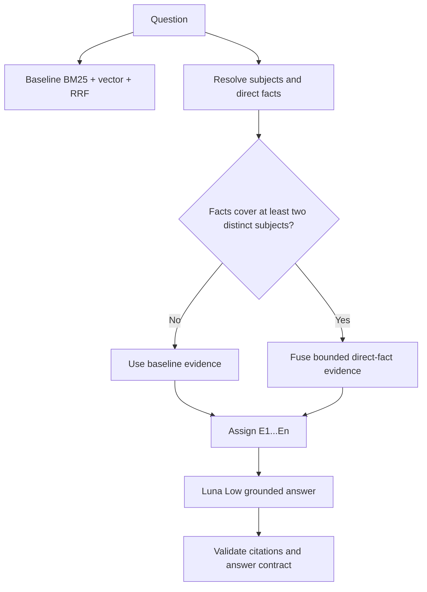

# RAG-TTC Phase 3.1: Deterministic Retrieval, the A0N Control, and the A2G Production Decision

Phase 3.1 converted the promising connected-retrieval result into a controlled production decision. The preceding work showed that gated direct facts could recover missing evidence for multi-subject questions, while unrestricted enrichment and relation expansion were not justified. Two unresolved issues prevented production adoption. First, nominally unchanged baseline queries could receive different evidence in independent executions. Second, the A2G experiment had changed retrieval behavior and evidence presentation at the same time, so its answer-level result could not be attributed solely to gated retrieval.

This phase repaired the ranking defect, introduced the missing prompt-only control named A0N, repeated the full 148-question evaluation on the same code revision, and selected A2G with ordinal citations as the production profile. It also established a precise integration boundary: the selected behavior is complete and reproducible in the answer-quality runner, but it is not yet exposed through the ordinary interactive QA commands.

> [!summary]
> - Stable ordering now occurs inside Bleve before the top-20 cutoff, using score descending and representation ID ascending.
> - Two fresh A0N executions produced byte-identical retrieval projections with SHA-256 `34f2f5c2207b2d3dbaf615ef0cee2ef21d0f95f6af901193359a4ddd48500047`.
> - A2G improved Recall@10 from `0.8183` to `0.8241`, preserved MRR at `0.9221`, and slightly improved answer relevance and faithfulness relative to A0N.
> - All 142 gate-closed questions retained identical retrieval channels, fused rankings, and admitted evidence. Only six questions opened the gate.
> - Manual review preferred A2G in three changed cases, judged three equal, and found no regression.
> - The next implementation phase is to extract the connected runtime into reusable production code and wire it into `chat` and `workspace ask`.

This report continues [[PROJECT REPORT - RAG-TTC Connected Retrieval - Gated Facts, Numbered Citations, and the Graph Stopping Rule]]. That earlier report covers the extraction database, direct-fact retrieval, admission gate, and negative A3 graph result. The present report documents the controls required to turn those experimental findings into an operational choice.

## 1. Why Phase 3.1 was necessary

An evaluation arm is interpretable only when its independent variable is clear and repeated executions preserve inputs and rankings. The earlier A2G result did not yet satisfy both conditions.

The first problem was nondeterminism. Six questions whose knowledge gate remained closed received different admitted evidence across independent runs. Because the gate was closed, the connected knowledge database could not be the cause. The difference had to originate in baseline lexical retrieval, vector retrieval, fusion, or evidence admission.

The second problem was experimental confounding. A2G introduced two changes together:

- It admitted direct-fact evidence when facts covered at least two distinct resolved subjects.
- It replaced opaque chunk identifiers with ordinal evidence labels `E1` through `En` and used the connected answer prompt.

Citation validity improved substantially, but historical mean relevance moved from `0.9167` to `0.8912`. That comparison crossed code revisions, prompt formats, and model executions. It could not determine whether the difference came from retrieval, evidence formatting, prompting, or ordinary generation variance.

Phase 3.1 therefore asked three narrower questions:

1. Can the baseline ranking and admitted evidence be made reproducible across fresh index builds?
2. When prompt and citation format are held constant, does gated retrieval improve the target cases without damaging the rest of the evaluation set?
3. Which configuration should become the declared production profile?

## 2. The ranking defect: stable sorting after truncation is too late

The baseline combines lexical and vector channels using reciprocal rank fusion. The Go code already contained stable comparison rules in several downstream paths. That initially suggested that equal scores should resolve consistently. The missing detail was the location of the lexical cutoff.

Bleve received a request for only the top 20 matches. When more than 20 documents shared the boundary score, Bleve could choose different members of the tied group before returning results to Go. A stable Go sort could order the returned set, but it could not recover an equally scored candidate that Bleve had already excluded.

The difference can be stated formally. Let `C` be the complete candidate set, `k` the requested limit, and `S` a total ordering:

```text
correct:    take(k, sort(C, S))
incorrect:  sort(take_arbitrary(k, C), S)
```

The second expression is nondeterministic whenever the storage engine is permitted to choose an arbitrary subset at a tied cutoff. Determinism requires the tie-breaker to be applied by the component that performs truncation.

The fix was added in `pkg/rag/lexical/bleve/index.go`:

```go
search.SortBy([]string{"-_score", "_id"})
```

The primary key orders relevance score descending. The final key orders Bleve document ID ascending. In this index, the document ID is the immutable representation ID because index construction calls `batch.Index(representation.ID, record)`. This supplies a total order at the exact boundary where Bleve applies the result limit.

### 2.1 Ranking-boundary audit

Determinism must be preserved at every boundary that can reorder or truncate candidates.

| Boundary | Primary order | Final tie-breaker | Reason |
|---|---|---|---|
| Bleve lexical search | score descending | representation ID ascending | Stabilizes membership before top-k truncation |
| Vector results | similarity descending | representation or chunk identity | Stabilizes equal similarities |
| Weighted RRF | fused score descending | chunk ID ascending | Stabilizes equal aggregate scores |
| Knowledge channels | configured score/order | chunk ID ascending | Stabilizes structured candidates |
| Evidence admission | requested-part and rank policy | stable chunk identity | Stabilizes the generator context |

The regression suite now includes 30 equal-score lexical records with a top-20 request. This is intentionally larger than the cutoff. A smaller fixture would prove only that returned ties are sorted; it would not test stable membership at the boundary. A separate weighted-RRF regression verifies the final chunk-ID tie-breaker.

## 3. Traceability as an experimental requirement

The connected runner now retains the ordered baseline channels, fused ranks, and admitted evidence in its trace output. This is more than diagnostic metadata. It permits a reproducibility comparison that ignores model prose and examines the deterministic retrieval state directly.

The projected comparison record is conceptually:

```text
for each question:
    emit question_id
    emit ordered lexical (identity, rank)
    emit ordered vector  (identity, rank)
    emit ordered fused   (chunk_id, rank)
    emit ordered admitted evidence chunk_ids

canonical_json = serialize(records with stable field order)
digest = sha256(canonical_json)
```

Two independent A0N executions rebuilt indexes and processed all 148 questions. Their canonical identity/rank projections were byte-identical and produced the same digest:

```text
34f2f5c2207b2d3dbaf615ef0cee2ef21d0f95f6af901193359a4ddd48500047
```

This check distinguishes retrieval reproducibility from answer reproducibility. Language-model output can vary even when its input is identical. The required infrastructure invariant is that the same corpus, configuration, and query produce the same ordered evidence.

## 4. A0N: the missing prompt-only control

A0N preserves baseline retrieval while adopting the same answer interface used by A2G. Its name denotes A0 retrieval with numbered citations.

| Dimension | A0N | A2G |
|---|---|---|
| BM25 channel | enabled | enabled |
| Vector channel | enabled | enabled |
| Weighted RRF | enabled | enabled |
| Concept/fact lookup | disabled | enabled |
| Multi-subject gate | forced closed | evaluated |
| Connected prompt | enabled | enabled |
| Evidence labels | `E1…En` | `E1…En` |
| Answer model | Luna Low | Luna Low |
| Judge model | Luna | Luna |

The runtime explicitly returns the baseline result with the gate reason `knowledge-disabled`. This is preferable to configuring zero limits and relying on incidental empty results. It makes the control condition visible in traces and prevents a future default change from accidentally activating knowledge retrieval.

Ordinal labels solve a practical citation-contract problem. Internal chunk IDs are designed for durable identity, not reliable model copying. The prompt now presents an ordered evidence list and assigns compact labels:

```text
E1: first admitted evidence chunk
E2: second admitted evidence chunk
...
En: final admitted evidence chunk
```

The answer cites these labels, and the runtime maps them back to immutable chunk identities. A0N isolates this presentation improvement from connected retrieval.

## 5. Controlled evaluation results

The canonical A0N and A2G runs used the same code revision, prompt structure, citation format, models, corpus, query set, and judge. Their only intended retrieval difference was the gated knowledge channel.

### 5.1 Whole-set metrics

| Metric | A0N | A2G | Difference |
|---|---:|---:|---:|
| Valid answers | 148 / 148 | 148 / 148 | 0 |
| Citation successes | 147 + 1 valid abstention | contract-valid | no material loss |
| Mean relevance | 0.8878 | 0.8912 | +0.0034 |
| Mean faithfulness | 0.9831 | 0.9835 | +0.0004 |
| Recall@10 | 0.8183 | 0.8241 | +0.0058 |
| MRR | 0.9221 | 0.9221 | 0 |

The A0N run used 142 answer-cache hits and six misses. This matters when reading small answer-score differences: most unchanged inputs reused prior generations, while changed evidence required new answers. The retrieval comparison remains exact because it is computed from trace identities and ranks rather than model text.

### 5.2 Target-cohort retrieval

| Cohort | A0N Recall@10 | A2G Recall@10 | Difference |
|---|---:|---:|---:|
| Multi-target | 0.6847 | 0.6948 | +0.0101 |
| Comparison | 0.7803 | 0.8182 | +0.0379 |
| Phase 0 review | 0.4083 | 0.4500 | +0.0417 |
| Baseline-incomplete | 0.4549 | 0.4722 | +0.0173 |

The largest improvement appears in comparison questions, which matches the original failure mode. The gate is specifically designed to require direct facts for at least two distinct subjects. It therefore activates where the baseline is most likely to spend its evidence budget on only one side of a question.

### 5.3 Closed-gate invariance

Of 148 questions, 142 kept the knowledge gate closed. Every one of those questions had identical:

- lexical channel identities and ranks;
- vector channel identities and ranks;
- fused chunk identities and ranks;
- admitted evidence identities and order.

Exactly six questions opened the gate and changed evidence. This is the strongest safety property of the design. The feature does not globally perturb a strong baseline. Its effect is limited to the questions satisfying an explicit coverage condition.

## 6. Manual review of the six changed questions

Aggregate metrics cannot determine whether a changed answer became more complete for the requested subjects. The six gate-open questions were therefore reviewed individually.

| Question | Judgment | Technical observation |
|---|---|---|
| `ttc-expand-048` | A2G preferred | Connected evidence improved support; faithfulness rose from 0.9259 to 1.0 |
| `ttc-expand-060` | Equal | A0N was broader; A2G was more operationally focused |
| `ttc-expand-069` | Equal | Both answers satisfied the request with different evidence composition |
| `ttc-y-005` | A2G preferred | Blue Ice versus Carolina Sapphire became a complete two-sided comparison; relevance rose from 0.5 to 1.0 |
| `ttc-y-007` | A2G preferred | Grounding improved; faithfulness rose from 0.963 to 1.0 |
| `ttc-y-080` | Equal | The additional channel did not materially change answer utility |

The review outcome was three A2G preferences, three ties, and no A2G regression. The Blue Ice comparison is decisive because it directly reproduces the motivating defect: A0N supplied enough evidence for only part of the requested comparison, whereas A2G supplied evidence for both subjects.

## 7. Interpreting the historical relevance difference

The earlier baseline relevance value of `0.9167` should not be compared directly with the controlled Phase 3.1 values because it does not represent the same experimental cell. It came from a different run context before the prompt-only control existed. Phase 3.1 answers the actionable question using same-revision controls:

```text
A0N relevance = 0.8878
A2G relevance = 0.8912
```

Under matched prompt and evidence formatting, A2G does not reduce relevance. It improves it slightly. The historical decrease therefore cannot be assigned to gated retrieval. It reflects at least one uncontrolled factor such as prompt revision, citation format, judge execution, or generation variance.

This illustrates a general evaluation rule: when a feature changes retrieval and presentation, create a control that adopts the presentation change without adopting the retrieval change. Otherwise, the answer-level metric cannot identify which change produced the observed effect.

## 8. The production configuration

The selected profile is recorded in `configs/connected-rag/production-v1.yaml`. Its policy is intentionally narrow:

```yaml
profile: production-v1

retrieval:
  baseline: enabled
  knowledge: enabled
  relations: disabled

gate:
  strategy: distinct-subject-direct-facts
  minimum_distinct_subjects: 2

answer:
  evidence_labels: ordinal
  model: gpt-5.6-luna-low

evaluation:
  judge_model: gpt-5.6-luna
```

The exact file contains the complete operational settings; this excerpt records the decision structure. A0N remains the fallback and control. A2 and A3 remain diagnostic arms. Relation expansion and graph retrieval remain disabled because the Phase 3 A3 experiment added 26 complementary facts without improving retrieval and slightly reduced faithfulness.

The resulting decision tree is:



## 9. What is complete and what remains

Phase 3.1 is complete as an experiment and configuration decision. The implementation passed:

- `go test ./... -count=1`;
- `go build -buildvcs=false ./...`;
- answer-quality lint with zero findings;
- ticket validation through `docmgr doctor`.

The wider `pkg/rag` lint scope still reports five unrelated pre-existing findings. They were not changed because they do not affect the experimental result or production selection.

The remaining boundary is application integration. The connected runtime currently lives in the answer-quality experiment runner. The ordinary `chat` and `workspace ask` commands do not load `production-v1.yaml` and do not execute A2G. A configuration file alone does not make the behavior available to users.

The next phase should therefore be Phase 3.2, with a limited scope:

1. Extract the connected planning, gating, fusion, and trace logic into a reusable package such as `pkg/rag/connected`.
2. Define typed inputs and outputs so experimental and interactive callers use the same implementation.
3. Load `production-v1.yaml` through the normal QA command configuration path.
4. Wire the runtime into `chat` and `workspace ask` without creating a compatibility adapter.
5. Add command-level tests for gate-closed invariance, gate-open multi-subject recovery, numbered citations, and deterministic repeated execution.
6. Run a small live smoke evaluation before declaring the configuration operational.

Further ontology growth, unrestricted SQL planning, generated JavaScript traversal, and graph expansion should remain outside this phase. The current evidence supports a bounded direct-fact repair, not a broader architecture.

## 10. Implementation and evidence map

The primary implementation and configuration files are:

- `pkg/rag/lexical/bleve/index.go` — pre-cutoff deterministic lexical ordering;
- `pkg/rag/lexical/bleve/index_test.go` — tied-score cutoff regression;
- `pkg/rag/knowledge/retrieve/` — deterministic knowledge planning and fact retrieval;
- `pkg/rag/connectedconfig/` — YAML configuration model;
- `cmd/rag-ttc/cmds/experiments/answerquality/connected.go` — current connected runtime;
- `configs/connected-rag/arms/baseline-numbered.yaml` — A0N control;
- `configs/connected-rag/production-v1.yaml` — selected A2G production profile.

The ticket contains the durable analysis record:

- `design-doc/03-phase-3.1-deterministic-baseline-a0n-control-and-production-decision.md`;
- `sources/phase3.1/02-phase3.1-a0n-a2g-production-decision.md`;
- `reference/01-investigation-diary.md`;
- complete raw responses, traces, judge records, smoke failures, and comparisons under `sources/phase3.1/`.

The work was committed in five reviewable increments:

| Commit | Purpose |
|---|---|
| `b945fd2` | Freeze the Phase 3.1 design |
| `8397882` | Repair deterministic cutoff behavior and add A0N |
| `be2ead8` | Add the production profile and comparison tooling |
| `f0911c7` | Retain raw runs and evidence |
| `983edb2` | Close Phase 3.1 documentation and tasks |

## 11. Engineering conclusions

Phase 3.1 produced four durable conclusions.

First, stable sorting must precede every limiting operation. A downstream tie-breaker cannot repair candidate membership after an upstream engine has truncated an incompletely ordered set.

Second, reproducibility should be tested on a canonical projection of retrieval identities and ranks. Comparing generated prose is neither necessary nor sufficient for proving deterministic retrieval.

Third, prompt and evidence-format changes require their own control arm. A0N made it possible to attribute the same-revision difference to gated retrieval instead of citation presentation.

Fourth, the production feature should be the smallest policy supported by the evidence. A2G opens on six questions, leaves 142 baseline paths identical, improves the targeted comparison cohort, and introduces no reviewed regression. Direct facts gated by distinct-subject coverage are justified. Global enrichment and graph traversal are not.

The system now has a reproducible experimental result and an explicit production profile. The next work is ordinary software integration: move the evaluated runtime behind a reusable package boundary, connect it to the real QA entry points, and verify that the operational commands preserve the invariants established here.
