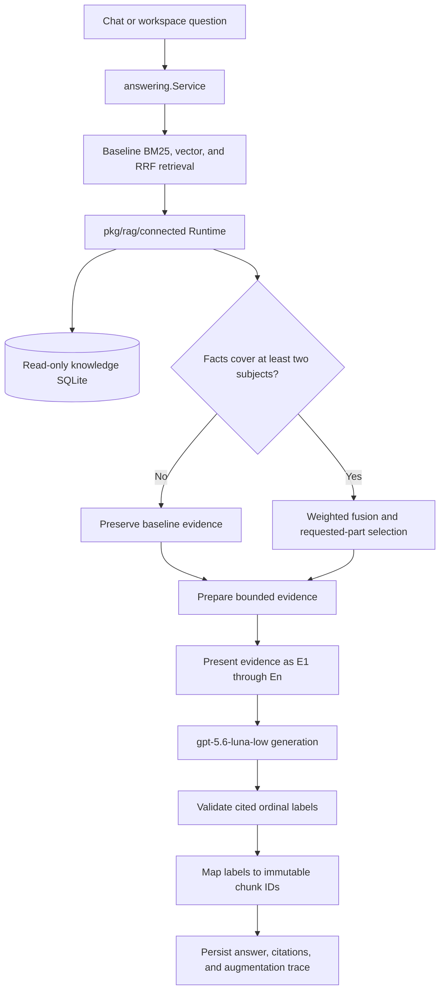

# RAG-TTC Phase 3.2: Production Connected Retrieval and Reversible Ordinal Citations

> [!summary]
> Phase 3.2 moved the connected-retrieval policy selected in Phase 3.1 out of the experiment runner and into the normal RAG-TTC question-answering runtime. The resulting system preserves baseline retrieval for ordinary single-subject questions, selectively adds fact-connected evidence for questions spanning at least two subjects, presents simple ordinal citations to the answer model, and returns immutable chunk identifiers to applications. Full tests and builds passed, and a live `gpt-5.6-luna-low` session demonstrated both the closed-gate and open-gate paths.

This report continues [[PROJECT REPORT - RAG-TTC Phase 3.1 - Deterministic Retrieval and the A0N Production Decision]]. Phase 3.1 established which retrieval behavior should proceed: deterministic baseline ranking, numbered evidence labels, and a gated connected-retrieval arm known as A2G. Phase 3.2 addressed the next engineering question. An experiment configuration is not a production feature until ordinary application entry points execute the same policy, retain sufficient diagnostic state, preserve source identity, and own their resources correctly.

The implementation remained deliberately narrow. It did not introduce generated query plans, graph traversal, model-facing database tools, `scopeddb`, or `scopedjs`. It extracted the already evaluated algorithm into one reusable package and integrated it at the shared answering boundary. This kept the production change aligned with measured evidence rather than expanding the system based on untested possibilities.

## 1. The production gap after Phase 3.1

At the end of Phase 3.1, the strongest candidate was A2G: baseline hybrid retrieval augmented with direct facts only when those facts covered at least two distinct subjects. The gate protected simple questions from global enrichment while improving the evidence available for comparisons and other multi-subject requests. A prompt-only control also established that numbered evidence labels were independently valuable for citation correctness.

However, the working implementation lived under the answer-quality experiment command. That location imposed four limitations.

- Application packages could not depend on a command-specific experiment package without reversing the intended dependency direction.
- The experiment changed evidence identifiers to `E1`, `E2`, and so forth, but normal chat and workspace code requires immutable chunk IDs for metadata lookup and source navigation.
- The connected SQLite repository, resolved configuration, and semantic digests did not yet have a single production lifecycle owner.
- A copied implementation in chat would allow experimental and production behavior to diverge.

Phase 3.2 therefore treated integration boundaries as part of retrieval correctness. The algorithm could not merely produce a good answer in an evaluation runner. It had to produce the same ranked evidence in the shared runtime, expose an inspectable trace, validate exactly what the model saw, and return identifiers that downstream software could resolve.

## 2. Final architecture

The normal answering service remains responsible for baseline retrieval. An optional connected runtime receives that baseline result and the immutable chunk collection. It either returns the baseline result unchanged or produces bounded augmented evidence. Answer preparation then creates model-facing ordinal labels. After generation, contract validation operates on those labels, and successful citations are translated back to chunk IDs.



The central architectural choice is that connected retrieval is an augmentation of a complete baseline result. Baseline retrieval remains the stable foundation. The augmenter is not responsible for embedding, lexical search, or initial fusion, and a closed gate does not reconstruct the baseline. This property limits the new component's authority and makes the closed path easy to test precisely.

## 3. One reusable connected-retrieval runtime

The new `pkg/rag/connected` package owns the reusable A2G implementation. Its runtime contains the resolved YAML configuration, a read-only SQLite knowledge repository, the deterministic planner, semantic digests, fusion and evidence-selection logic, and the repository close operation.

The shared answering package defines a small interface:

```go
type RetrievalAugmenter interface {
    Augment(
        ctx context.Context,
        baseline RetrievalResult,
        chunks []rag.Chunk,
    ) (RetrievalResult, json.RawMessage, error)
}
```

The concrete implementation includes a compile-time assertion:

```go
var _ answering.RetrievalAugmenter = (*Runtime)(nil)
```

This interface expresses the required boundary without exposing internal ranking primitives. The answering service provides the baseline and corpus chunks. The augmenter returns the selected retrieval result and an opaque trace. The answering package does not import the connected package, which prevents an import cycle and keeps future augmentation strategies possible without changing the answer service's domain model.

The trace crosses this boundary as `json.RawMessage` and is stored in `RetrievalResult.AugmentationTrace`. Strongly typed trace construction remains inside `pkg/rag/connected`; durable session code can retain the record without understanding every connected-retrieval field. The retained trace includes planner output, gate decision, retrieval channels, fused ranks, selected evidence, semantic digests, and timing information.

### 3.1 Gate and selection procedure

The runtime implements the evaluated policy rather than a new general-purpose planner. Its effective procedure is:

```text
baseline = retrieve_with_bm25_vector_rrf(question)
plan = resolve_requested_parts_and_direct_fact_subjects(question, knowledge_db)

if distinct(plan.direct_fact_subjects) < 2:
    return baseline, trace(gate="closed")

fact_candidates = retrieve_chunks_for(plan.direct_facts)
fused = deterministic_weighted_fusion(baseline, fact_candidates)
ordered = prioritize_requested_part_coverage(fused, plan.requested_parts)
evidence = enforce_per_document_limits(ordered, evidence_k=5)

return result(fused, evidence), trace(gate="open")
```

Graph facts remain disabled. The production decision was specifically supported by direct-fact results, and the implementation does not broaden that decision. Evidence is bounded to five chunks, uses the evaluated weighted fusion policy, and retains stable final ordering.

## 4. Citation presentation and source identity

Ordinal citations solve a model-interface problem. Long opaque identifiers such as `chunk-6a8f63299f766f77` are valid application identities, but they add avoidable complexity to generation. Labels such as `E1`, `E2`, and `E3` are compact and easy to reproduce exactly. Phase 3.1 showed that this presentation substantially improved citation validity.

Those labels cannot replace source identity throughout the application. Session inspection, TUI source display, workspace metadata lookup, and later evidence analysis all depend on stable chunk IDs. Phase 3.2 therefore formalized a reversible transformation.

| Stage | Citation representation | Required property |
|---|---|---|
| Retrieval | Immutable chunk ID | Stable corpus identity |
| Provider request | `E1…En` | Simple model-visible label |
| Contract validation | `E1…En` | Validate the exact representation generated by the model |
| Public result | Immutable chunk ID | Resolvable source reference |

`Prepared.CitationLabels` stores the mapping from each presented label to its immutable source identifier. The service copies evidence into the provider request and changes only the copied identifiers. It validates the returned answer against the set of labels that the provider received. Only a valid answer is translated.

```text
labels = {
  "E1": "chunk-...",
  "E2": "chunk-...",
}

provider_answer = generate(evidence_labeled_with_E_ids)
validate(provider_answer.citations, allowed=keys(labels))

if valid:
    public_citations = map(provider_answer.citations, labels)
else:
    return contract_failure
```

The order is essential. Mapping before validation would reject valid model output because the model never saw chunk IDs. Omitting the final mapping would leave application consumers with labels that have meaning only within one prompt. Tests cover successful reverse mapping, unknown-label rejection, and trace persistence.

## 5. Runtime ownership and frozen production semantics

`pkg/app/chat.Runtime` now owns an optional connected runtime alongside the index bundle and provider resources. Construction resolves the repository root, configuration path, and database path; opens the read-only repository; and transfers ownership only after the complete chat runtime has been constructed. Failure paths close resources that were already opened. Normal shutdown closes both the search bundle and connected repository.

This lifecycle required more care than adding a pointer field. Runtime construction has several possible failures after SQLite is opened but before a controller exists. An early draft tied cleanup to one error variable, which did not cover returns that produced errors through other expressions. The final implementation uses an explicit ownership guard. Ownership transfers only when construction succeeds.

Connected mode also freezes the settings that define the evaluated production arm:

- the resolved production prompt;
- RRF retrieval strategy;
- baseline top-k;
- final evidence count;
- context rune budget;
- `gpt-5.6-luna-low` semantic identity, implemented with model `gpt-5.6-luna` and profile `ttc-live-luna-low`.

Chat requests and replay requests are normalized back to these values. This prevents mutable TUI controls from silently producing a different experiment arm while the session still claims the production connected profile.

Session configuration records three content identities:

| Identity | Digest |
|---|---|
| Connected YAML configuration | `01030f151f3fe89c9422548738ba558f5383469dc18b26354ade9d2f74eb7b31` |
| Knowledge database | `543e5044db32d2830f37039f734fd5ccbc48b764566b852be33ee09f28811924` |
| Combined retrieval semantics | `deee9a43531f16baa440b60b2a008b9802bb607865485cb58d097d74568c52d4` |

These digests distinguish sessions that used different retrieval semantics without placing database contents or credentials in metadata.

## 6. Command policy and corpus safety

The ordinary `rag-ttc chat` command defaults to `configs/connected-rag/production-v1.yaml` and the corrected canonical Phase 1 knowledge database. Empty connected configuration disables augmentation, but partial configuration is rejected. A configuration without a database, or a database without a configuration, cannot produce a coherent connected runtime.

The shared headless runtime is also used by `workspace ask-go`. That command exposes repository-root, connected-config, and knowledge-database options but leaves them empty by default. A Go source index and the TTC product knowledge database describe different corpora. Enabling TTC defaults in a general workspace command would introduce unrelated facts into retrieval. Explicit opt-in preserves reuse at the implementation level while keeping corpus policy at the command boundary.

This distinction is a practical form of configuration safety: software reuse does not imply shared defaults.

## 7. Verification strategy

Verification covered package behavior, integration behavior, determinism, and a live provider session.

### 7.1 Automated tests

The new and updated tests establish the following properties:

- a closed gate preserves baseline channels, ranks, and evidence;
- disabled knowledge cannot open the gate;
- the canonical Blue Ice comparison resolves multiple subjects and admits evidence tied to at least two subjects;
- repeated augmentation produces identical fused and evidence chunk-ID sequences;
- the provider receives ordinal evidence labels;
- valid ordinal citations map back to chunk IDs;
- unknown ordinal labels fail contract validation;
- the opaque augmentation trace survives into durable results;
- the normal chat runtime opens the real bundle, YAML, and SQLite database through the shared integration path;
- command fields and model-profile constraints are visible and validated.

The canonical offline chat test uses the real TTC index bundle, configuration, planner, SQLite database, fusion logic, answering service, and session path. A local identity-compatible zero-vector embedder and fixture generator replace only the provider calls. This gives broad deterministic coverage without network access or model variance.

Repository-wide validation succeeded:

```bash
GOCACHE=/tmp/rag-ttc-go-cache go test ./... -count=1
GOCACHE=/tmp/rag-ttc-go-cache go build -buildvcs=false ./...
```

Scoped lint found one relevant ignored close error in workspace answering. Commit `ad59553` repaired it. Three pre-existing findings remain in workspace search, workspace index, and session reading; they were recorded rather than included in an unrelated expansion of scope. The ticket also passed `docmgr doctor` after removing a redundant topic outside its controlled vocabulary.

### 7.2 Live Luna Low smoke

The final smoke used the normal chat TUI, the canonical bundle, production connected configuration, corrected knowledge database, and the `ttc-live-luna-low` profile. The retained session is:

```text
20260802T115823.609846045Z-chat-2925d18f0694
```

It reached terminal state `complete` in approximately 67 seconds. Two questions exercised opposite gate paths.

| Case | Gate | Raw citations | Public citations | Result |
|---|---|---|---|---|
| Bloodgood Japanese Maple mature height | Closed: insufficient distinct fact subjects | `E3` | `chunk-744de1c89f1d0328` | Valid answer: approximately 20 feet |
| Blue Ice vs. Carolina Sapphire site requirements | Open: minimum fact subjects met | `E2`, `E3`, `E4` | Three immutable chunk IDs | Valid, complete comparison |

The comparison answer reported that both products prefer full sun and well-drained soil and tolerate difficult soil. It distinguished Carolina Sapphire as suitable for hot, dry, exposed sites and stated that Blue Ice benefits from regular water, especially during dry periods. The connected trace recorded three distinct fact subjects, while graph retrieval remained disabled.

The raw provider output and public session result prove both halves of the citation contract. The model generated ordinal labels, and the persisted answer contained resolvable chunk IDs. A credential-pattern scan of the retained session found no authorization header, bearer token, API-key field, or `sk-` value.

## 8. Implementation history

The work was committed in reviewable checkpoints.

| Commit | Purpose |
|---|---|
| `a7ba742` | Freeze the Phase 3.2 design and task contract |
| `318c4ec` | Extract the reusable connected runtime and citation presentation |
| `97f584b` | Record the extraction diary checkpoint |
| `daddd0c` | Enable connected retrieval in the normal QA runtime |
| `ad97206` | Record the QA integration diary checkpoint |
| `ad59553` | Correct workspace runtime close handling |
| `aee4ec0` | Complete final documentation cleanup |

Several implementation failures produced useful constraints. A multi-file patch failed because a test anchor was absent, so the change was reapplied as focused patches. The first compile exposed an obsolete import in the migrated experiment test. Runtime construction initially declared an error variable in too narrow a scope. The first cleanup design could have leaked SQLite on some returns and was replaced before commit. Live TUI validation required a larger tmux window, and lint required a writable cache under `/tmp`. Each issue was resolved without changing the retrieval design.

## 9. What Phase 3.2 establishes

Phase 3.2 establishes four durable engineering results.

First, evaluation and production now share the implementation of planning, gating, fusion, requested-part ordering, and evidence selection. Experiment-specific code retains model checks and artifact publication, but it no longer owns a second retrieval algorithm.

Second, citations now have an explicit representation boundary. Model usability and application identity are separate requirements, and the answering service satisfies both through validation followed by reverse mapping.

Third, connected retrieval is selective and observable. A single-subject question retains baseline evidence; a supported comparison opens the gate; both decisions are preserved in the session trace with semantic digests.

Fourth, production configuration controls the full evaluated behavior. Prompt, model profile, ranking strategy, evidence limits, and context budget cannot drift independently during connected-mode submission or replay.

## 10. Remaining operational work

The implementation goal is complete. Two small operational improvements remain reasonable.

1. Move the canonical SQLite database from the ticket artifact tree to a dedicated versioned production-assets location if deployment packaging should exclude ticket paths. The database digest and default path must change together.
2. Add a visible TUI status indicator showing that the connected production profile fixes retrieval and evidence controls.

Neither item requires a new retrieval design. Phase 4 remains gated and unauthorized. Current evidence does not justify exposing `scopeddb`, `scopedjs`, generated SQL, or graph traversal to the answer model. Such work should begin only when a concrete evaluation identifies a retrieval failure that bounded direct-fact augmentation cannot address.

## 11. Conclusion

RAG-TTC now executes the selected connected-retrieval policy through its normal QA runtime. The implementation preserves deterministic baseline behavior, opens augmentation only for supported multi-subject questions, retains full diagnostic traces, and uses `gpt-5.6-luna-low` with a validated ordinal citation interface. Applications continue to receive immutable chunk identifiers.

The phase is significant because it closes the distance between an evaluated arm and an operational system without broadening the architecture. The resulting design has one retrieval implementation, one shared answering boundary, explicit resource ownership, reproducible semantic identity, and retained live evidence for both gate outcomes.

## Source material

- Ticket design: `design-doc/04-phase-3.2-production-runtime-integration.md`
- Final results: `sources/phase3.2/01-phase3.2-production-runtime-results.md`
- Chronological implementation record: `reference/01-investigation-diary.md`, Steps 31–34
- Live session: `sources/phase3.2/sessions/20260802T115823.609846045Z-chat-2925d18f0694/`
- Core runtime: `pkg/rag/connected/runtime.go`
- Answering integration: `pkg/rag/answering/service.go`
- Application ownership: `pkg/app/chat/runtime.go`
- Production configuration: `configs/connected-rag/production-v1.yaml`
