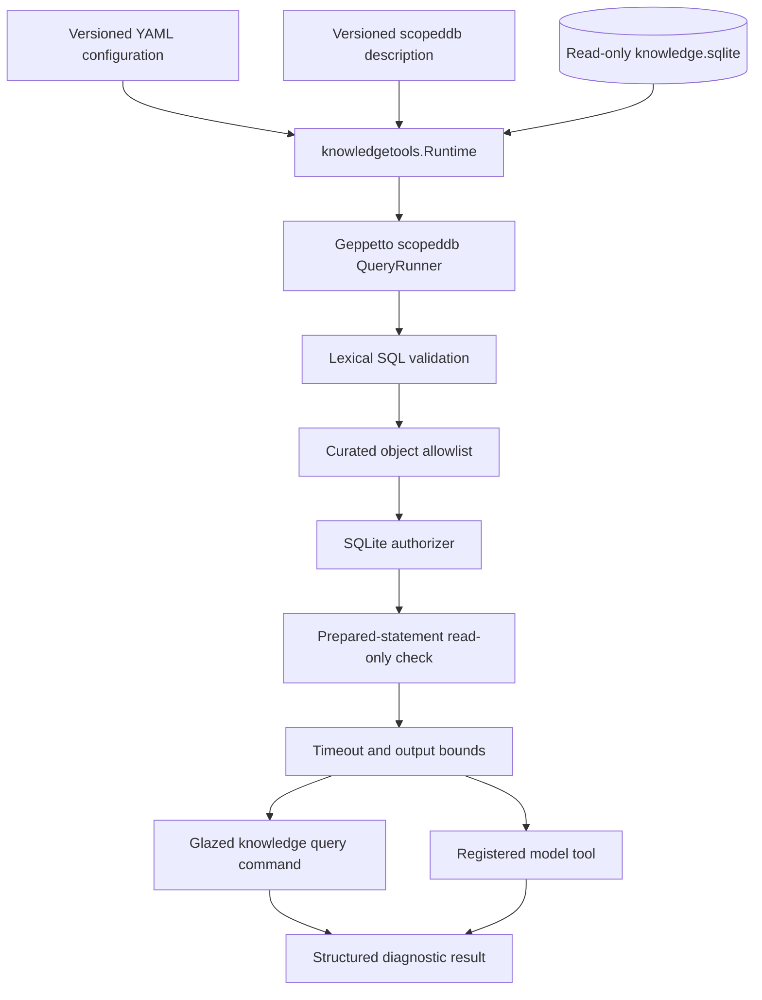

# RAG-TTC Phase 4: Bounded Database Analysis and the Derived-Corpus Coverage Boundary

> [!summary]
> Phase 4 added a bounded, read-only `scopeddb` interface for diagnostic analysis of the TTC concept-and-fact database. The tool is retained for analysis and evaluation, while fixed typed Go queries remain the production retrieval interface. The investigation found that the connected database covers only the 20-document Phase 1 development slice, which changes how closed retrieval gates and empty fact results must be interpreted. Every frozen workflow fit bounded SQL, so `scopedjs` was deliberately not implemented.

This report continues [[PROJECT REPORT - RAG-TTC Phase 3.2 - Production Connected Retrieval and Reversible Citations]]. Phase 3.2 completed the normal A2G question-answering path: deterministic baseline retrieval, selective multi-subject fact augmentation, ordinal model-facing citations, and immutable public chunk identities. Phase 4 did not replace or extend that serving algorithm. It introduced a separate analysis capability for questions that arise during extraction review and retrieval diagnosis.

The distinction between a serving query and an analysis query determines the architecture. Production retrieval needs fixed semantics, stable admission policy, bounded latency, and repeatable evidence selection. Analysis needs controlled flexibility because the exact grouping, comparison, or health question is often unknown until a failure has been inspected. RAG-TTC now supports both needs over one immutable SQLite artifact without allowing generated SQL to define production behavior.

## 1. Why Phase 4 exists

The connected-retrieval experiments produced detailed traces, but traces answer questions anticipated by the implementation. They report resolved concepts, selected facts, gate decisions, ranking contributions, and evidence choices. They do not directly answer arbitrary questions about the derived database, including:

- Which predicates dominate the extracted fact population?
- How many supporting chunks exist for each subject and predicate?
- Does a closed gate reflect a single-subject question, absent facts, or a subject outside the derived corpus?
- Can a comparison query return balanced evidence for both requested subjects?
- Are repeated values supported by multiple independent chunks or produced by normalization fragmentation?

Adding a typed Go repository method for every temporary investigation would expand the production API with operations that have no serving role. Running unrestricted SQLite commands would make the security and reproducibility properties dependent on operator discipline. Phase 4 therefore evaluated a middle position: model- and analyst-facing SQL constrained to curated views, enforced read-only execution, deterministic ordering, explicit limits, and versioned descriptions.

The phase began with a retain/remove rule. The adapter would be retained only if it answered at least one frozen diagnostic question that otherwise required new code or manual database access, preserved exact-source evidence lineage, passed safety and lifecycle tests, and left production A2G unchanged.

## 2. Architectural boundary

The implemented path has four distinct layers.



The TTC-specific adapter lives in `pkg/rag/knowledgetools/scopeddb.go`. It loads the existing connected-RAG configuration contract, validates that scopeddb is enabled, opens the knowledge database in read-only mode, constructs a bounded Geppetto query runner, and supports both direct query execution and model-tool registration. The same runner policy therefore governs the CLI and the tool definition presented to a model.

The normal retrieval runtime does not import or call this package. `pkg/rag/connected` continues to use the typed `knowledge.Reader` API and its fixed planner. This dependency direction prevents an analysis feature from becoming an implicit production planner.

### 2.1 The low-level database ownership change

Model-tool registration requires access to `*sql.DB`, while `SQLiteRepository` intentionally hides its handle. Phase 4 extracted database opening and version validation into:

```go
func OpenReadOnlyDatabase(
    ctx context.Context,
    databasePath string,
) (*sql.DB, error)
```

`OpenRepository` calls this function and retains the normal typed API. `knowledgetools.Runtime` also calls it, then adds the scopeddb authorizer and view allowlist. The low-level opener does not weaken model access by itself. It centralizes read-only DSN construction, connection limits, schema-version checks, and normalization-version checks. The caller owns the returned handle and must close it.

The database DSN includes `mode=ro&_foreign_keys=on`. The pool is restricted to one open and one idle connection. Before a handle is returned, the opener reads `extraction_runs` and verifies the expected schema and normalization versions. A stale or incompatible database fails before tool registration.

## 3. Curated views instead of base tables

The initial implementation exposes four views already published by the Phase 1 database builder.

| View | Diagnostic purpose |
|---|---|
| `concept_search` | Inspect canonical concepts, aliases, kinds, states, and chunk frequency. |
| `fact_search` | Inspect normalized facts, object forms, confidence, status, and support count. |
| `chunk_evidence` | Resolve fact identifiers to exact chunks, quotes, and offsets. |
| `extraction_health` | Read aggregate document, chunk, concept, fact, evidence, and rejection counts. |

Base tables are intentionally absent from the allowed-object registry. This prevents direct access to extraction internals whose schema may change and prevents a model from bypassing the stable semantics of the views. It also keeps some operations, including detailed rejection reporting, in the fixed health API where their contract is already established.

The query runner enforces the boundary at several independent stages.

1. The query must begin with `SELECT` or `WITH` and contain one statement.
2. Every referenced object must be in the compiled view allowlist.
3. Queries reading an object must include `ORDER BY`, ensuring deterministic truncation.
4. A SQLite authorizer denies mutation, attachment, pragma, and schema operations.
5. The prepared statement must report itself as read-only.
6. Execution is subject to caller cancellation and a configured timeout.
7. Rows, columns, and cell text are bounded before results leave the runner.

Prompt instructions are not part of the enforcement mechanism. They tell the model how to use the tool effectively, while compiled validation and SQLite authorization define what the tool can do.

## 4. YAML as experiment identity

The analysis profile is stored in `configs/connected-rag/analysis-scopeddb-v1.yaml`. It selects the scopeddb planner, enables the tool, references its complete description and orchestration prompt, and sets bounded runtime limits.

```yaml
planner:
  mode: scopeddb

tools:
  scopeddb:
    enabled: true
    description_file: >-
      tool-descriptions/connected-rag/scopeddb-analysis-v1.yaml
    limits:
      max_rows: 50
      max_cell_chars: 2000
      timeout: 5s
```

The YAML does not define allowed views, SQL privileges, schema migrations, or arbitrary runtime code. Those remain compiled operations. The configuration controls the inputs expected to change during evaluation: model-visible descriptions, starter queries, limits, and prompt content.

The loader computes a semantic digest over the effective configuration and referenced asset contents. After the starter-query correction described below, the final digest is:

```text
3313a0165992dc4b1a79d67dc6606709018e0a417f9610b33bf217ab37b0d1a9
```

This digest matters because starter queries affect model behavior. Two tools with identical permissions but different comparison examples are different experimental inputs.

## 5. The analyst command

The new Glazed command executes the same runner used for model registration:

```bash
go run ./cmd/rag-ttc knowledge query \
  --database path/to/knowledge.sqlite \
  --sql 'SELECT metric, value
         FROM extraction_health
         ORDER BY metric' \
  --format json
```

Parameters are supplied separately through repeatable `--params` values. Structured output includes the configured columns, truncation state, and semantic configuration digest. This gives an investigation a reproducible identity without creating a second SQL executor.

The command treats a controlled scopeddb rejection as a command error. A disallowed table, missing `ORDER BY`, mutation statement, or malformed multi-statement request therefore fails visibly rather than returning a plausible empty result.

## 6. The comparison truncation defect

The first model-visible comparison query was deterministic but incomplete. It selected facts for two named subjects, ordered by predicate and subject, and applied a global limit. Blue Ice had enough facts to consume the entire result window before Carolina Sapphire rows were reached.

```sql
SELECT ...
FROM fact_search
WHERE subject IN (?, ?)
ORDER BY predicate, subject, fact_id
LIMIT 50;
```

The defect was not nondeterminism. The same incomplete result would be returned consistently. The error was the location of the bound relative to the coverage requirement. A comparison needs a local quota for each requested subject and predicate before the global result is bounded.

The corrected query uses a window function:

```sql
WITH ranked AS (
  SELECT fact_id,
         subject,
         predicate,
         object_concept,
         object_text,
         value_number,
         unit,
         status,
         support_count,
         ROW_NUMBER() OVER (
           PARTITION BY subject, predicate
           ORDER BY support_count DESC, fact_id
         ) AS subject_rank
  FROM fact_search
  WHERE subject IN (?, ?)
    AND predicate IN (?, ?, ?)
)
SELECT *
FROM ranked
WHERE subject_rank <= 3
ORDER BY predicate, subject, subject_rank;
```

The partition establishes balanced representation. `support_count DESC` prioritizes facts with broader source evidence, and `fact_id` supplies a stable final order. The outer query then returns no more than three rows per subject and predicate.

This correction reflects a general bounded-retrieval rule: apply coverage constraints before the cutoff that could destroy coverage. Phase 3.1 applied this principle to lexical tie ordering before top-k. A2G applies it to requested-subject evidence selection. Phase 4 applied it to diagnostic SQL.

## 7. What the database contains

The final Phase 4 query set measured the corrected Phase 1 artifact:

| Record type | Count |
|---|---:|
| Documents | 20 |
| Chunks | 623 |
| Concepts | 1,395 |
| Facts | 2,051 |
| Evidence links | 4,043 |
| Rejections | 1,198 |
| Predicate types | 132 |

Every published fact has status `proposed`. The production planner can use a deliberately narrow subset because it explicitly requests proposed facts only through a compiled predicate allowlist and retains exact source evidence. scopeddb exposes the broader population for diagnosis, so an analyst must not equate visibility with production admission.

The ten largest predicate families show both useful coverage and ontology fragmentation.

| Predicate | Facts | Evidence links |
|---|---:|---:|
| `suitable_for` | 248 | 535 |
| `requires` | 220 | 359 |
| `tolerates` | 144 | 391 |
| `mature_height` | 139 | 444 |
| `requires_action` | 137 | 194 |
| `has_step` | 111 | 167 |
| `growth_rate` | 107 | 315 |
| `mature_width` | 81 | 210 |
| `hardiness_zone` | 79 | 178 |
| `measurement` | 74 | 223 |

This aggregation is a concrete reason to retain scopeddb. No current `knowledge.Reader` method groups the full fact population by predicate and support count. The query answers an extraction-health question without adding serving code.

The fixed `knowledge inspect` command remains superior for stable operational health. It returns concept-kind counts, complete predicate counts, and the rejection distribution:

- 714 unresolved subjects;
- 407 quotes not found;
- 54 normalization conflicts;
- 11 empty names;
- 6 invalid fact values;
- 4 invalid JSON responses;
- 2 duplicate chunk results.

The Phase 4 decision is therefore not that SQL should replace typed health queries. Each surface retains the operations suited to its contract.

## 8. Diagnosing three retrieval cases

### 8.1 Bloodgood Japanese Maple

The Phase 3.2 live question asked for the mature height of the Bloodgood Japanese Maple. A2G closed with `insufficient-distinct-fact-subjects`, while baseline retrieval answered correctly from source chunks.

Phase 4 concept and fact queries returned zero Bloodgood rows. The decisive fact is the database coverage: the connected SQLite artifact contains only the frozen 20-document Phase 1 development slice. The BM25/vector index covers the full 200-document corpus, but the structured knowledge artifact does not.

The gate trace therefore admits two interpretations:

```text
closed gate
├── question is covered but has fewer than two fact subjects
└── one or more question subjects are absent from the derived database
```

The current trace records the gate decision but not this coverage distinction. Empty structured retrieval must not be reported as evidence that the corpus lacks the subject or fact.

### 8.2 Blue Ice and Carolina Sapphire

Both products are heavily represented in the development database. Across `avoids`, `drought_tolerance`, `hardiness_zone`, `requires`, and `tolerates`, Blue Ice has 114 facts with 339 evidence links; Carolina Sapphire has 76 facts with 187 evidence links.

The balanced query recovered the distinctions observed in the Phase 3.2 answer. Blue Ice has a high-support requirement for regular watering during its first years. Carolina Sapphire has high-support tolerance facts for poor, stony soils and drought. Both have explicit drought-tolerance records.

This case confirms the intended A2G mechanism. The database does not generate an answer. It identifies complementary source evidence for two resolved subjects, after which the answer model receives exact chunks.

### 8.3 Third-year Thuja fertilizer

The `ttc-expand-069` evaluation question asks for fertilizer guidance for a third-year Thuja Green Giant. Both A0N and A2G provided general evergreen fertilizer guidance but could not establish a special third-year formula.

A scopeddb query searched Thuja fact values and qualifiers for `third` and returned zero rows. This classifies the result as a content absence in the current derived artifact, not a ranking failure. Additional fusion weight or a larger evidence budget cannot recover a condition that is not represented in the selected source or extracted facts.

## 9. Fixed queries and scopeddb have different jobs

The typed repository and scopeddb operate on the same database but encode different responsibilities.

| Requirement | Typed Go repository | scopeddb analysis |
|---|---|---|
| Concept resolution ranking | Implemented and preferred | Not implemented |
| Product-to-taxon fact bridge | Implemented and traced | Not implemented |
| Predicate admission | Compiled policy | Explicit analyst filter |
| Fact status policy | Typed input | Visible data field |
| Evidence hydration | Bounded method | Curated view query |
| Stable health report | Implemented | Aggregate subset |
| New grouping | Requires code | Direct use case |
| Custom comparison matrix | Requires code | Direct use case |
| Mutation | No API | Denied at multiple layers |

Production retrieval benefits from the restrictions in the left column. It must not change query shape because a model generated a different SQL statement. Analysis benefits from the right column because grouping and filtering needs change during investigation.

The design remains composable because both surfaces preserve fact IDs, chunk IDs, and the same database digest. An analyst can use scopeddb to identify a suspicious fact family, then use `chunk_evidence` or typed repository methods to inspect exact sources.

## 10. Safety and lifecycle verification

The test suite validates capabilities and resource behavior, not only successful queries.

- Allowed view queries with string bind parameters succeed.
- Direct reads from `facts` and other base tables fail.
- `INSERT`, `PRAGMA`, `ATTACH`, and multiple statements fail.
- Queries reading views without `ORDER BY` fail.
- Results stop at the configured row limit.
- Cell strings stop at the configured character limit.
- Caller cancellation produces a controlled query error.
- A deliberately expensive read is interrupted by a 100-millisecond test timeout.
- A closed runtime rejects later calls.
- Two independently opened runtimes retain isolated lifecycle state.
- The registered tool exposes the configured description, tags, version, parameter schema, and executable query function.

No filesystem, network, environment, process, mutation, attachment, or schema capability is registered. The registered operation is one bounded query function over a fixed database and a fixed view set.

Repository validation completed successfully:

```bash
GOCACHE=/tmp/rag-ttc-go-cache go test ./... -count=1
GOCACHE=/tmp/rag-ttc-go-cache go build -buildvcs=false ./...
```

Scoped lint completed with zero issues for `pkg/rag/knowledgetools`, `pkg/rag/knowledge`, and `cmd/rag-ttc/cmds/knowledge`. Two initial lint processes failed because concurrent golangci-lint invocations contend on a global process lock. Sequential execution passed without source changes.

## 11. Why scopedjs was not implemented

The original design allowed a narrow `scopedjs` knowledge module if scopeddb could not express the required workflows. Phase 4 classified each frozen analysis operation:

- filtering concepts and facts;
- grouping by predicate and status;
- ranking within subject and predicate partitions;
- comparing two subjects;
- resolving fact IDs to evidence;
- measuring extraction health.

Each operation fits a bounded SQL query. A second query can retrieve evidence after the first identifies relevant facts. None requires a generated program to hold mutable intermediate state, choose among native helper sequences, or perform iteration unavailable in SQL.

Implementing scopedjs without such a case would add a JavaScript runtime, module capability design, interruption requirements, state-isolation policy, and another model-visible interface without increasing measured diagnostic coverage. The Phase 4 task was therefore completed with an evidence-backed no-build decision.

This decision can be revisited only through a frozen workflow that one bounded SQL query cannot express. The future proposal must identify the required native helpers, prove that the variable sequence is useful, test synchronous interruption and fresh-state behavior, and define a removal criterion.

## 12. Operational rules

The completed phase establishes the following usage policy:

1. Use `knowledge inspect` for the stable health report and rejection summaries.
2. Use `knowledge query` for bounded ad hoc analysis over curated views.
3. Bind user-provided values rather than inserting them into SQL text.
4. End every bounded query with a total deterministic order.
5. For comparisons, enforce per-subject coverage before applying a global limit.
6. Inspect `object_concept`, `object_text`, and numeric fields together.
7. Follow fact IDs to exact chunk evidence before making a content conclusion.
8. Do not enable scopeddb in normal chat or workspace answering.
9. Treat the current SQLite artifact as a 20-document development database.
10. Do not interpret an empty structured result as full-corpus absence.

## 13. Project status and next work

Phase 4 is complete. All seven phase tasks are checked, the mandatory diary contains Steps 35 through 37, `docmgr doctor` passes, and six focused commits preserve the design, implementation, evidence, and completion record.

| Commit | Purpose |
|---|---|
| `f753821` | Freeze the Phase 4 analysis-tool contract. |
| `861f799` | Implement the bounded scopeddb adapter, tests, CLI, and configuration. |
| `2ab9366` | Record the implementation diary checkpoint. |
| `b4ce6e0` | Retain the investigation evidence and corrected starter query. |
| `55ec985` | Complete the Phase 4 design, diary, task ledger, and index. |
| `caba21c` | Clarify the authorization and scopedjs no-build completion gate. |

The next knowledge-index problem is not JavaScript composition. It is coverage. A full-corpus extraction experiment should preserve the 20-document artifact as a development control, measure the cost and quality of the remaining 180 documents, and add a coverage identity to connected traces. That identity should distinguish at least:

```text
subject outside derived corpus
subject covered but unresolved
subject resolved without admitted facts
facts selected but gate below minimum subjects
gate open with admitted evidence
```

This change would make closed-gate traces diagnostically complete without changing the selective A2G policy.

## 14. Conclusion

Phase 4 established a controlled analysis surface over the TTC knowledge database. The implementation reuses the existing YAML identity contract, published SQLite views, Geppetto read-only enforcement, and Glazed structured output. It adds flexibility where analysis needs it and retains fixed semantics where production needs them.

The investigation justified retaining scopeddb, corrected a model-visible comparison query, rejected scopedjs as unnecessary, and identified the partial derived corpus as the principal limitation. The result is a smaller and more precise architecture: fixed Go planning for answers, bounded SQL for diagnosis, exact source chunks for evidence, and no additional execution layer without a demonstrated requirement.

## Source material

- `ttmp/2026/08/01/RAG-TTC-CONCEPTDB-001--pragmatic-corpus-concept-and-fact-index-for-connected-rag/design-doc/05-phase-4-model-facing-analysis-tools.md`
- `ttmp/2026/08/01/RAG-TTC-CONCEPTDB-001--pragmatic-corpus-concept-and-fact-index-for-connected-rag/sources/phase4/01-scopeddb-investigation-results.md`
- `ttmp/2026/08/01/RAG-TTC-CONCEPTDB-001--pragmatic-corpus-concept-and-fact-index-for-connected-rag/sources/phase4/02-scopeddb-query-results.json`
- `ttmp/2026/08/01/RAG-TTC-CONCEPTDB-001--pragmatic-corpus-concept-and-fact-index-for-connected-rag/reference/01-investigation-diary.md`, Steps 35–37
- `pkg/rag/knowledgetools/scopeddb.go`
- `pkg/rag/knowledgetools/scopeddb_test.go`
- `cmd/rag-ttc/cmds/knowledge/query.go`
- `configs/connected-rag/analysis-scopeddb-v1.yaml`
- `tool-descriptions/connected-rag/scopeddb-analysis-v1.yaml`
