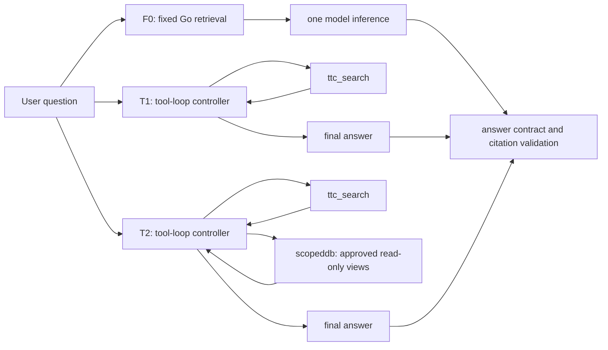
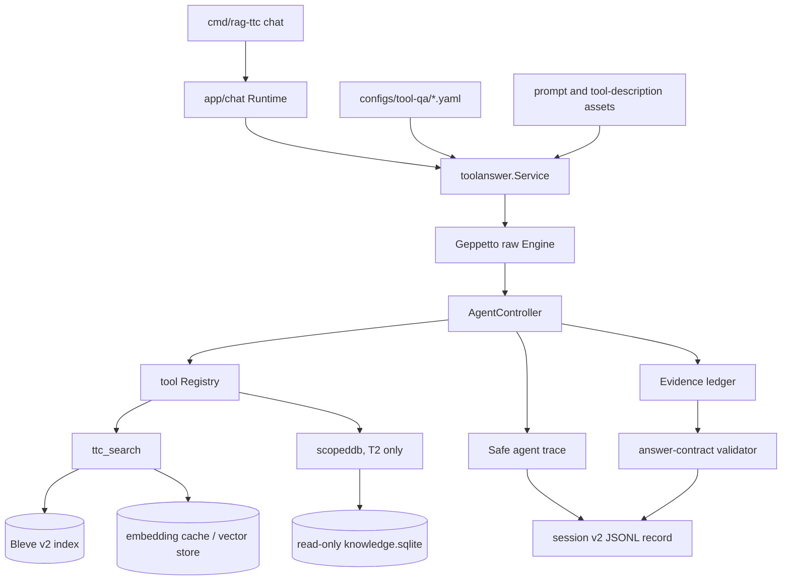
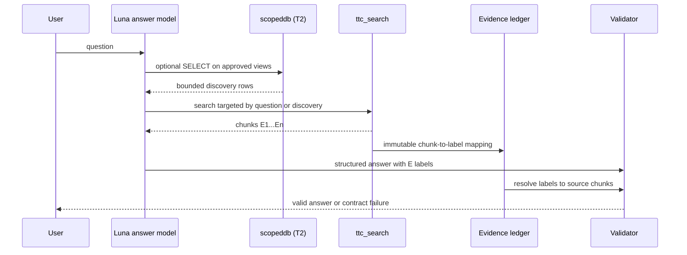

# RAG-TTC Tool Loop: Observable Multi-Inference QA and the F0/T1/T2 Evaluation

> [!summary]
> RAG-TTC has moved from a fixed retrieve-then-answer path to an observable, bounded multi-inference question-answering system. The normal chat path can now let `gpt-5.6-luna` decide whether to search the TTC index again or to inspect approved SQLite views, while the application records the complete safe trajectory needed for later evaluation and prompt optimization. The work deliberately separates three experimental arms: F0, fixed connected retrieval; T1, iterative search only; and T2, iterative search plus read-only SQL discovery. Phase 5 has begun its controlled comparison, but no arm has yet been promoted as the final production policy.

The RAG-TTC work began with a concrete failure mode: an apparently simple question could receive one incomplete answer even when the corpus contained evidence for the missing part. That symptom has several possible causes. Retrieval might have failed to select the right chunks; fixed context assembly might have chosen an unbalanced set of chunks; chunk granularity might have separated related evidence; the answer prompt might not have required a complete treatment of all requested subjects; or the model might have needed an additional retrieval action after seeing the initial evidence. A single answer sample cannot reliably distinguish these explanations.

Earlier connected-retrieval work addressed part of the problem by adding deterministic ranking, a narrowly gated fact-based augmentation path, numbered model-facing citations, and a reversible mapping from the displayed evidence labels to immutable chunk identifiers. This report covers the next architectural increment: a tool loop that makes the answer-generation process inspectable and experimentally controllable without turning the production system into an unrestricted agent.

The implementation and its evidence are recorded in the ticket workspace at `rag-ttc/ttmp/2026/08/02/RAG-TTC-TOOLLOOP-001--observable-search-and-sql-tool-loop-for-ttc-question-answering/`. The main design is in `design-doc/01-intern-guide-to-observable-search-and-sql-tool-loop-question-answering.md`; the chronological engineering record is `reference/01-investigation-diary.md`.

## 1. The question answered by this phase

A fixed RAG path has a useful property: its execution is short and easy to replay. It retrieves once, constructs a bounded context, asks a model once, validates the structured response, and returns an answer. Its limitation is that the initial retrieval plan is made before the answer model has inspected any evidence. Questions about multiple subjects, relationships, comparisons, or a missing qualifier can require a second search targeted by what the first result revealed.

The objective is not to make every question run arbitrary chains of tools. The objective is to determine whether bounded, observable additional inference produces measurably better answers than fixed retrieval for the TTC corpus. The system must therefore preserve four properties simultaneously:

- Each tool has a narrow, stable contract and a hard resource budget.
- Search evidence, not database rows, is the only source that may support a final citation.
- Every inference, tool call, evidence selection, and validation outcome is retained in a safe evaluation record.
- The fixed path remains available as an explicit control arm.

These constraints make the answer-generation mechanism testable. They also preserve a sharp difference between model-visible flexibility and serving semantics. A model may choose to run `ttc_search` again; it cannot write a database, alter an index, select arbitrary files, or cite a derived fact row that has no direct source chunk.

## 2. Experimental arms: F0, T1, and T2

The implementation names the comparison arms according to the information and control available to the answer loop.

| Arm | Retrieval and inference policy | Permitted model tools | Purpose |
|---|---|---|---|
| F0 | One fixed retrieval plan followed by one answer inference | None | The fixed connected-retrieval control. |
| T1 | A bounded model-driven loop | `ttc_search` only | Measures whether iterative corpus search improves answer completeness. |
| T2 | The same bounded loop | `ttc_search` and read-only `scopeddb` | Measures the incremental value of structured discovery over iterative search. |

F0 is the established A2G connected-retrieval configuration. Typed Go code resolves query concepts, applies the closed gate for fact augmentation, selects evidence, assigns ordinal labels such as `E1`, and makes one model call. It remains valuable because it establishes a deterministic, low-latency reference point.

T1 introduces no database analysis capability. The model receives a question and may call the regular TTC search tool, inspect the returned chunks, and call search again if the first result is insufficient. The production target model is configured as `gpt-5.6-luna`; the question-answering profile is named `ttc-live-luna-low` because it is the selected lower-cost operating mode, while `gpt-5.6-luna` is retained for evaluation judging.

T2 adds a read-only SQL tool over curated SQLite views. SQL is a discovery mechanism, not final evidence. It can help the model identify canonical subjects, predicates, fact support, and possible relationships; it cannot substitute for source retrieval. If SQL identifies a useful fact, the model must still search the source corpus and cite the resulting evidence labels. This boundary avoids treating an extraction artifact as primary evidence.



The arms are intentionally narrow. F0 versus T1 tests whether a second, model-directed search action has value. T1 versus T2 tests whether database discovery adds value after iterative search already exists. Comparing F0 directly with T2 would conflate both changes.

## 3. Runtime architecture

The implementation is centered in `pkg/rag/toolanswer`. `toolanswer.Service` owns the question-answering workflow, and `toolanswer.Registry` constructs only the enabled tools from a versioned YAML profile. The normal interactive chat runtime in `pkg/app/chat` now invokes the native service rather than emulating a tool loop through the old fixed runtime. The old fixed runtime remains an explicit F0 control, not an adapter hidden inside the new path.



The loop is powered by Geppetto's raw `Engine` and an `AgentController`. This is important because a complete agent turn contains more than a final text string. It contains model requests and results, assistant blocks, tool calls, tool outputs, iteration boundaries, usage accounting, and the evidence selected across the trajectory. Calling the lower-level engine lets RAG-TTC retain those facts instead of reconstructing them from terminal presentation output.

The high-level loop is bounded by policy rather than by an informal prompt instruction. A simplified form is:

```go
for iteration := 0; iteration < policy.MaxIterations; iteration++ {
    result := engine.Infer(ctx, conversation)
    trace.RecordInference(result.Metadata, result.Blocks)

    calls := extractPermittedToolCalls(result.Blocks)
    if len(calls) == 0 {
        answer := parseStructuredAnswer(result)
        return validateAnswer(answer, evidenceLedger)
    }

    for _, call := range calls {
        toolResult := registry.Execute(ctx, call)
        trace.RecordToolCall(call, toolResult)
        evidenceLedger.Merge(toolResult.SearchEvidence)
        conversation = append(conversation, toolResult.AsToolBlock())
    }
}
return ErrIterationBudgetExceeded
```

The real code also applies per-tool call limits, generation and embedding budgets, context cancellation, provider error handling, structured-output validation, and redaction before persistence. The central design point remains the same: a final answer is valid only after the system can connect its displayed citations to the ledger of chunks actually returned by search.

## 4. Tool contracts and the evidence boundary

`ttc_search` is the model's source-evidence tool. It exposes the existing TTC retrieval stack through a constrained input and output schema. Search results carry chunk identity, score, document information, text, and the model-facing ordinal labels that can be cited in a final answer. The model is asked to use those labels, not opaque identifiers.

`scopeddb` is available only when the YAML profile enables it. The implementation originates in the Phase 4 analysis work under `pkg/rag/knowledgetools/scopeddb.go`. It opens `knowledge.sqlite` read-only, checks database compatibility, permits only a curated view allowlist, requires deterministic ordering, enforces prepared-statement read-only status, applies a SQLite authorizer, and bounds rows, columns, cell size, and execution time. The exposed views include `concept_search`, `fact_search`, `chunk_evidence`, and `extraction_health`.

The SQL tool has a deliberately different role from search:

- SQL may find a canonical concept, compare extracted attributes, count support, or reveal a missing term.
- SQL output may guide the next `ttc_search` call.
- Only chunks from `ttc_search` may enter the final evidence ledger.
- Only labels resolved through that ledger may be accepted as final citations.

This sequence matters for faithfulness. The concept-and-fact database is useful derived structure, but it is not independent source material. A database fact can be incomplete, normalized imperfectly, or supported by a subset of the corpus. Requiring a source search before citation makes the answer auditable at the level where the original claim appears.



## 5. Configuration as experimental identity

The profiles under `configs/tool-qa/` define the experiment-facing portion of a run. `production-v1.yaml` represents the normal tool-capable profile. `t1-search-only-v1.yaml` disables the knowledge database and exposes only search. Prompt text and model-visible tool descriptions live as separate, referenced assets, including `prompts/tool-qa/orchestration-search-only-v1.txt`.

YAML controls inputs likely to change during evaluation: enabled tools, prompt assets, descriptions, budgets, limits, model references, and selected retrieval policies. Compiled Go code controls security boundaries, input/output schema enforcement, redaction, database opening, ranking implementation, trace layout, and the answer contract. This division makes prompt and description sweeps practical without allowing configuration to define arbitrary runtime behavior.

The loader computes a semantic digest from the effective configuration and referenced assets. A trace can therefore state which precise orchestration prompt and tool description shaped a run. A path alone is insufficient because content can change while retaining the same filename. The digest turns the resolved configuration into a reproducible experiment input.

## 6. Safe trajectory persistence

The session export was extended to a v2 record that distinguishes fixed and native-agent answers. Fixed results retain the historical `Request` and `Result` fields. Native tool-loop executions retain `AgentRequest`, `AgentResult`, and the detailed `Agent` trace. Presentation code consumes projections of those records rather than forcing the two models into one misleading interface.

The agent trace data transfer objects live in `pkg/rag/agenttrace`; redaction helpers live in `pkg/redact`. The stored record contains enough data to evaluate behavior later:

| Recorded information | Why it is retained |
|---|---|
| resolved YAML and semantic digests | identifies the actual experiment contract |
| provider and model identifiers | separates model behavior from configuration changes |
| inference iterations and block metadata | shows the shape of the multi-inference trajectory |
| token usage, including cached and reasoning tokens | supports cost and latency analysis |
| tool names, sanitized arguments, results, and failures | supports tool-policy and failure diagnosis |
| evidence ledger | proves which chunks could support citations |
| answer-contract result | separates invalid output from retrieval quality |
| encrypted-content presence, byte count, and digest | preserves continuity diagnostics without retaining payload material |

The record intentionally does not persist authorization headers, bearer tokens, API keys, request secrets, or raw encrypted reasoning payloads. Sanitized tool arguments and bounded result fields are persisted only after redaction.

### 6.1 Encrypted reasoning is used live but not archived

Geppetto's OpenAI Responses integration requests `reasoning.encrypted_content`, places it in the live turn payload, and replays it on a subsequent request when the provider expects continuity. It is not discarded before the next model inference. The relevant upstream implementation is in `pkg/steps/ai/openai_responses/helpers.go` in the Geppetto module; RAG-TTC projects the result in `pkg/rag/toolanswer/trace.go`.

The TTC trace deliberately records only whether encrypted content was present, its byte count, and a digest. This is enough to detect that a follow-up inference had continuity material and to compare trace shapes across runs. It avoids making an opaque provider payload a long-lived JSONL artifact. The distinction is operationally important: live execution retains what the provider needs, while persisted evaluation data retains what reviewers need.

## 7. Index reproducibility and deterministic behavior

The tool loop depends on a reproducible retrieval substrate. During Phase 4 integration, the TTC corpus index was rebuilt with the current deterministic Bleve v2 bundle. The resulting corpus artifact covered 200 documents, 1,982 chunks, and 3,964 representations. All 3,964 representation lookups were cache hits, so rebuilding the artifact required no new embedding-provider calls. The recorded corpus digest is `af653…`; the resulting bundle identifier begins `ttc-056cbd53e148922e847ceabab1f7c4ef`.

This work follows the earlier decision to make ranking deterministic. Each relevant ranking and fusion path now has a stable final tie-breaker, normally the immutable chunk ID. Without it, equal scores could cause repeated runs to receive a different evidence ordering even though neither the question nor the index changed. That kind of variation compromises both evaluation and prompt optimization because a change in answer quality could be a ranking artifact rather than a prompt effect.

Deterministic retrieval does not eliminate model variance. It removes one avoidable source of variation and makes the remaining variance visible. The frozen arm contracts in `sources/phase5/01-frozen-arm-contracts.md` specify retrieval configurations, citation conventions, budget boundaries, questions, and judges before the answer-level comparison runs.

## 8. Integration results and failure observations

Phase 4 verified that the native tool loop was actually used by the normal chat application, not merely by a standalone experiment command. The system made live `gpt-5.6-luna` calls, executed `ttc_search`, retained evidence labels, and wrote v2 sessions. A successful single-subject run asking about Blue Ice's relationship to water and soil completed with two Luna calls, one search, five evidence chunks, 3,796 input tokens, 168 output tokens, eight reasoning tokens, and a valid answer contract in 3.91 seconds.

The integration also exposed real defects rather than masking them.

| Observation | Cause | Disposition |
|---|---|---|
| Initial structured-output request was rejected | Luna's Responses-compatible endpoint rejected JSON Schema `uniqueItems` | Removed the schema keyword; Go contract still rejects duplicate citations. |
| Multi-subject comparison ended with `abstained: true` plus citations | The answer violated the application contract; an additional attempted search also exceeded the intentionally small smoke embedding budget | Retained as a prompt/model and budget test case, not converted into a success. |
| First T1 smoke answered with an opaque chunk ID in `citation_chunk_ids` while prose cited `E1` | The raw model output did not obey the output contract | Retained as a valid search-only trajectory but an invalid final answer; batch evaluation will quantify the behavior before changing the prompt. |

The first true T1 smoke is significant because it proves the arm separation. Its resolved configuration had no knowledge-database fields, the registered tool list contained `ttc_search` only, and the trace recorded zero SQL calls. The run executed two Luna inferences, one search, returned five chunks, and completed in 4.07 seconds. It did not pass final answer validation because the model emitted an opaque immutable chunk ID in structured output. The correct response is not to silently repair the answer. The failure belongs in the retained dataset because it measures whether the prompt, output format, and model actually meet the contract.

## 9. The evaluation dataset and future optimization loop

The persisted sessions are intended to support more than manual debugging. They form the concrete substrate for a later self-improvement loop that can sweep prompts, tool descriptions, enabled-tool combinations, and selected SQL-view descriptions while preserving a link from an observed answer back to the complete trajectory that produced it.

For each frozen question, the evaluator will record at least:

- retrieval evidence and evidence order;
- answer relevance and multi-subject completeness;
- citation validity and source faithfulness;
- tool count, search count, SQL count, iterations, and failure class;
- provider model and token-use breakdown;
- wall-clock latency and configured budgets;
- resolved profile and semantic digests.

The expected decision sequence is disciplined. First run the deterministic fixture and smoke checks to verify the contracts. Next run the multi-subject subset, where repeated search and discovery have the clearest opportunity to matter. Then run the full frozen set with Luna-low answering and Luna judging. Compare F0 with T1, then T1 with T2. If an arm shows a plausible advantage, repeat it under the same frozen contract before promotion.

The promotion criterion is not raw relevance alone. A tool loop that obtains a more detailed answer by emitting invalid citations, losing faithfulness, or multiplying cost without a material completeness gain is not a serving improvement. Conversely, a small increase in latency can be justified when the system demonstrably resolves multi-subject evidence gaps while preserving a valid, grounded answer.

## 10. Engineering decisions that keep the system bounded

Several implementation choices are easy to overlook because they are not user-facing features, but they determine whether the evaluation will remain credible.

First, database access is optional at construction time only when the selected profile disables SQL. `toolanswer.NewService` accepts a nil knowledge dependency for T1, and `app/chat.NewRuntime` does not open or digest a database for that arm. This makes “search only” a real operational condition rather than an interface label applied after a database has already been loaded.

Second, answer-contract validation remains outside model control. The answer schema may request an `abstained` flag, prose answer, and citation labels, but Go code checks the final semantics: the citations must be ordinal evidence labels, duplicates are rejected, labels must resolve through the ledger, and abstention cannot be combined with unsupported cited claims. Removing unsupported JSON Schema features for provider compatibility did not remove these checks.

Third, resource accounting is per operation. A search can consume embedding work; an inference consumes generation capacity. The smoke configuration deliberately used low budgets to expose the behavior of the failure path. A budget exhaustion is recorded as a tool failure in the trace, not translated into an empty or successful result.

Fourth, the TUI is a projection of the stored record. It can present tool events and the native evidence ledger without becoming the authoritative implementation of the workflow. This keeps interactive review useful while allowing offline JSONL analysis to answer the same questions reproducibly.

## 11. Current status and the next technical step

Phases 0 through 4 are implemented and committed. They delivered the configuration contract, tool registry, bounded service loop, safe trace schema, Geppetto integration, session persistence, chat integration, T1 separation, and retained smoke trajectories. Phase 5 has frozen the arm contracts and completed its first T1 smoke. The comparative answer-level experiment is not complete, so the correct production decision remains open.

The immediate work is therefore evaluation, not architecture expansion:

1. Run reproducible F0, T1, and T2 fixtures with sufficient budgets to distinguish a tool-policy defect from a smoke-limit failure.
2. Run the preselected multi-subject subset and inspect evidence coverage, not only final scores.
3. Run the full frozen set with `gpt-5.6-luna` in the production answer profile and Luna judging.
4. Repeat any apparently promotable result under the identical frozen contract.
5. Select one serving policy: retain F0, promote T1, or promote T2. Keep the other arms as diagnostic controls.

This is deliberately a small decision surface. The system already captures the raw material required for more sophisticated prompt and tool-description optimization. The next valid conclusion, however, must come from the controlled F0/T1/T2 comparison rather than from adding more tools, more plans, or more database abstractions.

## 12. Reading the implementation

An engineer beginning work on this system should read the following in order:

1. `rag-ttc/ttmp/2026/08/02/RAG-TTC-TOOLLOOP-001--observable-search-and-sql-tool-loop-for-ttc-question-answering/design-doc/01-intern-guide-to-observable-search-and-sql-tool-loop-question-answering.md` for the complete phase plan and API-level rationale.
2. `rag-ttc/pkg/rag/toolanswer/` for the service, registry, policies, trace projector, evidence ledger, and tests.
3. `rag-ttc/pkg/app/chat/` for the application boundary that invokes the native runtime and persists sessions.
4. `rag-ttc/pkg/rag/knowledgetools/scopeddb.go` and `rag-ttc/pkg/rag/connected/` for the SQL discovery boundary and the fixed connected-retrieval control.
5. `rag-ttc/configs/tool-qa/production-v1.yaml` and `rag-ttc/configs/tool-qa/t1-search-only-v1.yaml` for the resolved experiment differences.
6. `rag-ttc/ttmp/2026/08/02/RAG-TTC-TOOLLOOP-001--observable-search-and-sql-tool-loop-for-ttc-question-answering/sources/phase5/` for frozen contracts and raw retained smoke outcomes.
7. `rag-ttc/ttmp/2026/08/02/RAG-TTC-TOOLLOOP-001--observable-search-and-sql-tool-loop-for-ttc-question-answering/reference/01-investigation-diary.md` for the sequence of decisions, test commands, failures, and commits.

The report's central conclusion is narrow: RAG-TTC now has a real, bounded multi-inference tool loop with source-grounded citations and reproducible observability. The unfinished work is to measure whether that extra control improves the corpus questions that motivated it, and to promote only the smallest arm that earns its operational cost.
