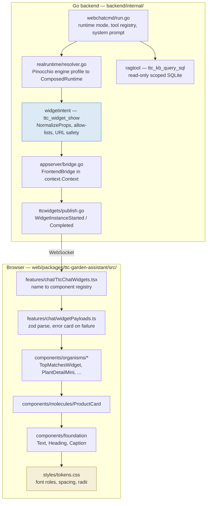
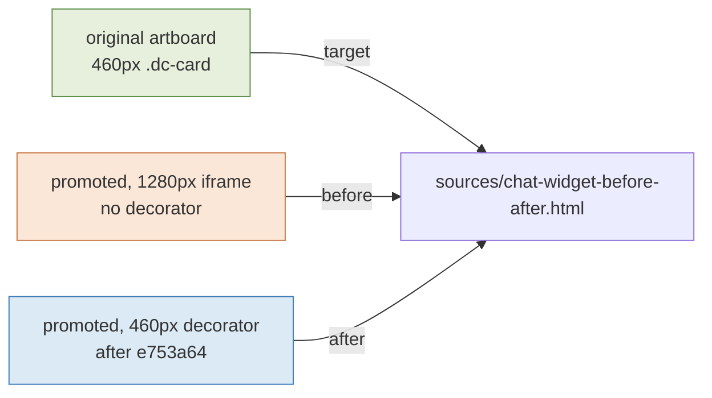

# PROJECT REPORT - TTC Garden Assistant - Chat Widget Visual Parity and the Token-Layer Root Cause

This report explains why the generative chat widgets in the TTC Garden Assistant stopped looking like the design they were ported from, and what the correct repair turned out to be. The investigation had already been done by a previous session, which measured the drift, captured screenshot evidence for eleven widgets, ranked them by severity, and wrote a handoff naming two widgets as severely broken. That work was accurate about the symptoms and wrong about two of the causes. The reason it was wrong is worth more than the repair itself: the analysis was performed by reading CSS custom property *names* rather than resolving them to *values*, and a design system that names things well can hide a defect behind a correct-looking identifier.

The repair changed no spacing, no radius, and no layout. It added ten typography tokens and rebound three components to them. A shared molecule grew an explicit variant, and the defaults for that variant were chosen against a test the repository had already written and was already failing.

> [!summary]
> - The systematic "serif drift" was not in the widget components. `--ttc-font-role-section-title`, `--ttc-font-role-card-title`, and `--ttc-font-role-product-title` all resolve to a Cormorant Garamond display face. The widgets consumed those roles exactly as the project guidelines instruct, and inherited a typographic voice the source design never had.
> - Two "spacing bugs" in the prior handoff were arithmetic errors about token values. `--ttc-space-7` is `16px` and `--ttc-space-4` is `10px`, so both already matched the original exactly. Every non-typographic property of `PlantDetailMini` was pixel-exact before any change.
> - A 43.78% pixel-diff number was mostly a measurement artifact: the reference is a fixed 460px artboard and the subject was captured inside a 1280px Storybook iframe with no width decorator.
> - The shared `ProductCard` molecule has two consumers with genuinely different visual requirements. Its own unit test already asserted the parity behaviour and was already failing, which inverted the variant defaults that had been proposed on paper.
> - The generated DMETA React components are imported for their *types* only — 29 type-only imports, zero value imports — so they never reach the production bundle, but they contribute 31 of 91 Storybook stories and were the source of a stale-story-ID hang in the comparison tooling.

## The system this sits in

The repository builds a chat interface where a language model answers a gardening question in prose and additionally emits rich interactive cards into the chat timeline. The model cannot emit markup. It calls one tool, `ttc_widget_show`, with a widget name drawn from a fixed catalogue of ten and a props object that is decoded into a typed Go struct with `DisallowUnknownFields` before anything is published. The frontend then looks the name up in a registry and renders a hand-written React component.



Four artifacts each claim authority over some aspect of a widget, and conflating them is the origin of most confusion in this codebase.

| Artifact | Location | Authoritative for | Not authoritative for |
|---|---|---|---|
| Imported design prototype | `original/` | fonts, sizes, weights, colors, radii, spacing, icon choice, layout | data shapes, callbacks, behaviour |
| DMETA semantic IR | `dmeta-ir/` | what a widget means; domain types, actions, slots, visual states | any pixel value |
| Generated React scaffolds | `src/generated/dmeta-widgets/` | the TypeScript prop interfaces | visual appearance |
| Promoted React components | `src/components/` | nothing — it is the consumer of the other three | — |

The governing rule, inherited from the earlier promotion work, is that the imported original wins unless a ticket explicitly requires a change. A promoted component may carry a richer semantic contract than the prototype used; that does not license rendering every optional field. The generated `Product` type has an `availabilityLabel`, and the prototype's product card has no stock badge. Both statements are true simultaneously.

## The question and the untrustworthy answer

The prior session measured drift by capturing element screenshots on both sides and computing changed-pixel percentages. The May baseline it compared against:

```text
plant-detail    43.78      upload-prompt   12.93
top-matches     35.06      watering-guide  12.90
filter-bar      25.64      watch-for-signs 12.39
compare-teaser  16.43      quick-picks     12.09
care-calendar   13.51      why-these-work  11.19
                           why-pair        10.09
```

These numbers cannot be read as component drift. The reference side is a `.dc-card` element inside a fixed 460px artboard in `original/Garden Assistant - Design System.html`. The subject side is a `[data-ttc-template="..."]` element inside a Storybook iframe whose `preview.tsx` declared `layout: 'fullscreen'` and `defaultViewport: 'ttcWide'` — 1280 pixels — with no width decorator of any kind. A widget whose root is `display: block` therefore rendered at 1280px on one side and 460px on the other. A large fraction of every number above is that mismatch, and the two worst-ranked widgets are the two whose content is most horizontally elastic.

The prior diary identified this correctly and said so. What it did not do was follow the consequence: if the metric is unreliable, the only remaining method is to compare declared values property by property. That is where the analysis had to restart.

## The method that changed the answer

The promoted CSS reads like this:

```css
/* PlantDetailMini.module.css */
.zoneBadge { top: var(--ttc-space-4); left: var(--ttc-space-4); }
.copy      { padding: var(--ttc-space-7); }
```

and the original reads like this:

```jsx
/* original/organisms.jsx:247 */
<ZoneBadge style={{ position: 'absolute', top: 10, left: 10 }}>{plant.zones}</ZoneBadge>
<div style={{ padding: 16 }}>
```

Reading those two side by side produces a plausible and wrong conclusion, which is what the handoff recorded: *"Promoted body padding is larger (`var(--ttc-space-7)`) than original 16px. Promoted zone badge offset is 16px; original offset is 10px."* Token names carry an intuition about magnitude — a larger index sounds like a larger value, and `space-4` sounds smaller than `10px` looks — and that intuition is unmoored from the scale.

The scale is defined in `src/styles/tokens.css`:

| Token | Value | Token | Value | Token | Value |
|---|---|---|---|---|---|
| `--ttc-space-1` | `4px` | `--ttc-space-5` | `12px` | `--ttc-space-9` | `20px` |
| `--ttc-space-2` | `6px` | `--ttc-space-6` | `14px` | `--ttc-space-10` | `24px` |
| `--ttc-space-3` | `8px` | `--ttc-space-7` | `16px` | `--ttc-space-12` | `32px` |
| `--ttc-space-4` | `10px` | `--ttc-space-8` | `18px` | `--ttc-space-13` | `40px` |

`--ttc-space-7` is `16px`. `--ttc-space-4` is `10px`. Both promoted values already matched the original exactly. Resolving every custom property to a literal before comparing produced a completely different picture of the two "severe" widgets.

For `PlantDetailMini`, every property except typography was exact:

| Property | Original | Promoted (resolved) | |
|---|---|---|---|
| card radius / keyline | `12` / `inset 0 0 0 1px line` | `--ttc-radius-widget` = `12px` / `--ttc-elevation-keyline` = same | exact |
| hero aspect | `16/9` | `16 / 9` | exact |
| zone badge offset | `top:10 left:10` | `--ttc-space-4` = `10px` | exact |
| zone badge padding | `6px 12px` | `--ttc-space-2 --ttc-space-5` = `6px 12px` | exact |
| body padding | `16` | `--ttc-space-7` = `16px` | exact |
| facts grid gap / margin | `12` / `14` | `--ttc-space-5` / `--ttc-space-6` | exact |
| fact value margin-top | `6` | `--ttc-space-2` = `6px` | exact |
| price margin-top | `16` | `--ttc-space-7` = `16px` | exact |
| **plant name** | `700 18px/1.2 DM Sans` | `Heading size="section"` → **`500 36px/1.2 Cormorant`** | **wrong** |

For `TopMatchesWidget`, the same held: card padding `--ttc-space-8` = `18px` matched, grid gap `12px` matched, grid margin `14px` matched, header gap `10px` matched. The layout was never broken. The screenshots suggested "lost card chrome" because the widget was 1280 pixels wide, not because the chrome was gone.

## The root cause

Both remaining defects trace to the same twelve lines of `tokens.css`:

```css
--ttc-font-role-section-title:  500 36px/1.2  var(--ttc-font-display);  /* Cormorant Garamond */
--ttc-font-role-card-title:     500 20px/1.25 var(--ttc-font-display);  /* Cormorant Garamond */
--ttc-font-role-product-title:  500 16px/1.25 var(--ttc-font-display);  /* Cormorant Garamond */
--ttc-font-role-body:           400 16px/1.45 var(--ttc-font-body);     /* DM Sans */
--ttc-font-role-body-compact:   500 13px/1    var(--ttc-font-body);     /* DM Sans */
```

The foundation primitives map their `size` prop onto these roles one-for-one. `Heading size="section"` is `--ttc-font-role-section-title`. `Text size="productTitle"` is `--ttc-font-role-product-title`. The widgets bound to those sizes and got a 36-pixel serif plant name where the design called for an 18-pixel bold sans one.

This is the part that matters for any layered design system. The three serif roles were tuned for the marketing landing page, where an editorial display voice is correct. The chat widgets consume the same roles through the same primitives, because `web/GUIDELINES.md` instructs exactly that:

> Do not solve visual mismatches by adding large feature-specific CSS blocks. Prefer moving repeated visual decisions into the correct layer.

The widget components were not misusing the design system. They were obeying it. The system had one typographic vocabulary and two products that needed different ones, and the second product silently received the first product's voice. No component was wrong, no rule was broken, and the output was wrong anyway.

Two consequences followed directly. First, the fix belongs in the token layer, not in component CSS — patching `PlantDetailMini.module.css` with a `font:` declaration would have produced the right pixels and violated the layering rule that made the defect invisible in the first place. Second, the fix generalizes: adding a chat vocabulary repairs all eleven widgets, not the two being worked on.

A smaller instance of the same failure sat in `TopMatchesWidget.module.css`:

```css
.star {
  color: var(--ttc-gold-600);
  font: var(--ttc-font-role-section-title);   /* a 36px ☆ */
}
```

The original uses `<Icon name="star" size={20} color={gold} />`. The promoted version rendered a `☆` text glyph and sized it with the section-title role, producing a 36-pixel star next to a 20-pixel title. The `Icon` atom already exported `star`, `heart`, and `chevron`; three text glyphs had been substituted for icons that were sitting in the same repository.

## The shared molecule, and a test that was already failing

`ProductCard` is imported by two production consumers:

```text
components/organisms/TopMatchesWidget/TopMatchesWidget.tsx          chat, two-up grid
components/organisms/ProductCollectionSection/ProductCollectionSection.tsx   landing "Popular Products"
```

Its CSS was flat: `border-radius: 0`, `box-shadow: none`, `aspect-ratio: 3 / 4`, body padding `14px 0 0`. That is correct for an edge-to-edge landing grid and wrong for a chat card, which the original draws with a 12px radius, a 1px inset keyline, a 1:1 crop, and `12px 14px 14px` of body padding. It also rendered a red badge from `product.availabilityLabel`, which the original product card does not have at all.

Three repairs were available. Changing the molecule globally breaks the landing page. Forking a chat-only card duplicates a widget implementation, which the guidelines prohibit by name. The remaining option is an explicit variant, and the only open question was which way the defaults should point.

The design document argued for landing-preserving defaults — `surface='flat'`, `showAvailability=true` — on the theory that not disturbing the existing page was the dominant constraint. Running the test suite settled it differently. `ProductCard.test.tsx` contains:

```tsx
it('renders the original compact product-card projection from the generated contract', () => {
  render(<ProductCard product={product} liked />);
  ...
  expect(screen.queryByText('In stock')).not.toBeInTheDocument();
});
```

That assertion was failing, and it was failing *before any change in this ticket*. Verifying that required stashing the working tree and re-running the suite on a clean checkout, which is the step that separates "I broke this" from "this was already broken":

```bash
git stash push -- web/packages/ttc-garden-assistant
pnpm --filter ttc-garden-assistant test    # 2 failed | 28 passed — same two failures
git stash pop
```

The repository had already written down the parity rule and the component had drifted away from it without anyone noticing the red test. Landing-preserving defaults would have required deleting that assertion. The defaults were therefore inverted: the molecule now defaults to the imported original contract, and the landing grid declares its deviation.

```tsx
export interface ProductCardProps extends GeneratedProductCardProps {
  surface?: 'flat' | 'card';       // default 'card'  — the imported original
  showAvailability?: boolean;      // default false   — the original has no badge
}
```

```tsx
// ProductCollectionSection.tsx — the productized variant declares itself
<ProductCard surface="flat" showAvailability product={{ ..., availabilityLabel: product.tag }} />
```

Three arguments support this direction. The parity playbook states that the imported original wins and the productized variant must be explicitly required, and the flat landing grid is the productized variant. The failure direction is correct: a future consumer that forgets the prop gets the source design rather than an undeclared deviation. And the landing page renders identically either way — the badge it displays is a promotional tag (`'Up to 22% off'`), which is a real merchandising requirement and is now visible at the call site instead of being implied by a field name.

## What was built

The change is three layers deep and touches nothing else.

**Tokens.** Ten roles transcribed literally from the original JSX, plus a tracking value and a like-state color:

```css
--ttc-font-role-widget-title:       600 17px/1   var(--ttc-font-body);  /* atoms.jsx:154      */
--ttc-font-role-widget-link:        400 14px/1   var(--ttc-font-body);  /* organisms.jsx:78   */
--ttc-font-role-widget-heading:     700 18px/1.2 var(--ttc-font-body);  /* organisms.jsx:258  */
--ttc-font-role-widget-item-title:  700 16px/1.2 var(--ttc-font-body);  /* molecules.jsx:175  */
--ttc-font-role-widget-caption:     400 13px/1.3 var(--ttc-font-body);  /* molecules.jsx:176  */
--ttc-font-role-widget-caption-lg:  400 14px/1.3 var(--ttc-font-body);  /* organisms.jsx:259  */
--ttc-font-role-widget-price:       600 15px/1   var(--ttc-font-body);  /* molecules.jsx:177  */
--ttc-font-role-widget-price-lg:    600 16px/1   var(--ttc-font-body);  /* organisms.jsx:270  */
--ttc-font-role-widget-fact-label:  500 11px/1   var(--ttc-font-body);  /* organisms.jsx:266  */
--ttc-font-role-widget-fact-value:  600 14px/1.2 var(--ttc-font-body);  /* organisms.jsx:267  */
--ttc-tracking-widget-fact-label:   0.06em;
--ttc-like-active:                  #c74646;                            /* molecules.jsx:167  */
```

**Foundation.** `Text` gained nine `size` values, `Heading` gained `size="widget"` so the plant name keeps its `h3` element without the 36px serif, and `Caption` gained a `size` prop for the 11px fact labels. The uppercase tracking differs between the two Caption sizes, which requires a two-class selector rather than relying on declaration order:

```css
.transformUppercase                        { letter-spacing: 0.08em; }
.sizeWidgetFactLabel.transformUppercase    { letter-spacing: var(--ttc-tracking-widget-fact-label); }
```

**Widgets.** Every change is a rebinding or a glyph-to-icon substitution. No spacing value moved.

```diff
- <Heading level={3} size="section" tone="action">{plant.name}</Heading>
+ <Heading level={3} size="widget"  tone="action">{plant.name}</Heading>

- <Text size="cardTitle"><span className={styles.star}>☆</span><span>{title}</span></Text>
+ <Text size="widgetTitle"><Icon className={styles.star} name="star" size={20} /><span>{title}</span></Text>

- {liked ? '♥' : '♡'}
+ <Icon name="heart" size={16} fill={liked ? 'currentColor' : 'none'} />
```

`tone="action"` is retained on the heading deliberately and with a comment. `Heading`'s `primary` tone resolves to `--ttc-navy-900` (`#0f1d35`) while `action` resolves to `--ttc-navy-800` (`#15243f`), and the original uses navy-800 for plant names. Changing the shared tone mapping to fix one widget would have been the same class of error as the one being repaired.

Every original value had an exact existing spacing token — 10px, 12px, 14px, 16px, 32px are all on the scale — which matters because `scripts/validate-css-strict.mjs` rejects raw non-zero pixel lengths, hex colors, and `rgb()` calls inside `src/components/molecules`. The molecule repair had to be entirely token-expressed and was.

## Verification



The Storybook decorator was added because no before/after screenshot is evidence without it. The first implementation put `padding: 16` on the 460px box itself, and `box-sizing: border-box` reduced the content to 428 pixels, so the captures were narrower than the artboards. Moving the padding to an outer flex wrapper and keeping the inner box at exactly 460 fixed it.

```tsx
context.parameters.ttcChatWidth ? (
  <div style={{ display: 'flex', justifyContent: 'center', padding: 16 }}>
    <div data-ttc-story-frame="chat" style={{ width: 460, maxWidth: '100%' }}>
      <Story />
    </div>
  </div>
) : <Story />
```

Results: `typecheck`, `validate:css-vars`, `validate:css-strict`, `validate:dmeta-manifest`, and `build` all pass. The suite runs 33 passing and one failing test; the failure is `componentManifest.test.ts:20` asserting `toHaveLength(17)` against a manifest holding 31 components. It predates this work, `validate:dmeta-manifest` independently confirms 31 is correct, and it was left alone rather than silently edited.

Three tests now pin the behaviour that was previously only implied:

```tsx
expect(card).toHaveAttribute('data-ttc-surface', 'card');
expect(card.querySelector('[data-ttc-part="favorite"] svg')).not.toBeNull();
expect(screen.getByText('Top Matches').closest('[data-ttc-foundation="Text"]'))
  .toHaveAttribute('data-ttc-text-size', 'widgetTitle');
```

The landing regression was checked by rendering the `ProductCollectionSection` story: flat tiles, 3:4 crop, promo badge, 40px heart, serif section heading. The only visible change on that page is that the heart is now an SVG from the `Icon` atom rather than a `♡` text glyph.

## The generated scaffolds are types, not code

A question that surfaced during the work: are the DMETA-generated React components actually used?

They are not. Across `src/`, there are 29 imports from `generated/dmeta-widgets/` and every one is `import type`. The single value import is `dmeta.generated-manifest.json`, consumed by `componentManifest.ts` to drive the promotion-state test. Because the component imports are type-only, TypeScript erases them and the 31 `.generated.tsx` files never enter the production bundle.

What keeps them present is their own stories. `.storybook/main.ts` globs `../src/**/*.stories.@(js|jsx|ts|tsx)`, which matches `*.generated.stories.tsx`, so Storybook indexes 31 `generated-react-*` stories alongside 60 `component-library-*` stories. That is not free. The comparison tooling identifies widgets by hard-coded story ID, and the two-tree layout has already produced one failure: the drift sweep hung indefinitely because `verbs/original-design.js` still referenced `ttc-garden-assistant-organisms-*` after the titles were reorganized into `ttc-garden-assistant-component-library-organisms-*`. The failure mode was silent — `curl` returned 200 in 7ms while the browser sat on a `sb-preparing-story` loader, and only the browser console revealed `NoStoryMatchError`.

The durable fix is for parity tooling to resolve story IDs from `/index.json` rather than hard-coding them. A cheaper one is to exclude `*.generated.stories.tsx` from the Storybook glob and keep the generated types, which are the part actually doing work.

## Key points

- A design token that is named correctly can still be bound incorrectly. The defect here was invisible in code review because every line read as idiomatic use of the design system, and the wrongness only existed after `var()` resolution.
- Comparing CSS custom properties by name produces confident wrong answers. Resolve every property to a literal before concluding anything about spacing, and record the resolutions so a reviewer can check them.
- A pixel-diff percentage between two differently-sized viewports measures the viewport difference. Normalize the frame before the metric means anything.
- When a shared component serves two products with different visual requirements, the variant that matches the imported source should be the default, and the productized deviation should be the one that declares itself at the call site.
- Run the test suite on a clean tree before attributing a failure to your own change. Here it inverted a design decision: the repository had already encoded the parity rule in an assertion that was failing unnoticed.
- Fixing a defect in the layer where it originates repairs consumers that were not being worked on. Ten typography tokens repair eleven widgets; component-level CSS patches would have repaired two.

## Repo artifacts

- Repository: `/home/manuel/code/wesen/2026-05-27--ttc-design-system`
- Commit: `e753a64` — "Match chat widgets to the original design typography" (21 files, +311/−42)
- Ticket workspace: `ttmp/2026/08/02/TTC-CHAT-UI-001--improve-and-update-the-chat-ui/`
  - `design-doc/01-chat-ui-improvement-analysis-and-plan.md` — system guide, corrected review, decisions A–D, phased plan
  - `reference/01-diary.md` — Steps 1–9, including the decision reversal and three failed attempts
  - `sources/{original,promoted,after}/*.png` and `sources/chat-widget-before-after.html`
- Source of visual truth: `original/organisms.jsx:73` and `:247`, `original/molecules.jsx:149` and `:274`, `original/atoms.jsx:132-160`
- Token layer: `web/packages/ttc-garden-assistant/src/styles/tokens.css`
- Guidelines that shaped the repair: `web/GUIDELINES.md`

## Open questions

- Should `*.generated.stories.tsx` stay in the Storybook glob? They are 31 of 91 stories and contribute nothing to the shipped bundle, but they document the scaffold contract.
- The italic latin names depend on the widget module's `font-style: italic` winning over the foundation `font:` shorthand, which resets `font-style`. This works through stylesheet order and is fragile.
- `componentManifest.test.ts` asserts a component count of 17 against an actual 31. It fails on a clean checkout and needs its own commit.
- The remaining nine widgets should be cheaper now. The substantive items are icon-mapping gaps in `watering-guide` and `care-calendar` and a 2+1 layout that became 3-across in `why-pair`; most of the mild band should resolve by rebinding to the new widget roles.

## Related notes

- [[PROJECT REPORT - RAG-TTC Connected Retrieval - Gated Facts, Numbered Citations, and the Graph Stopping Rule]]
- [[PROJECT REPORT - RAG-TTC Tool Loop - Observable Multi-Inference QA and the F0 T1 T2 Evaluation]]
