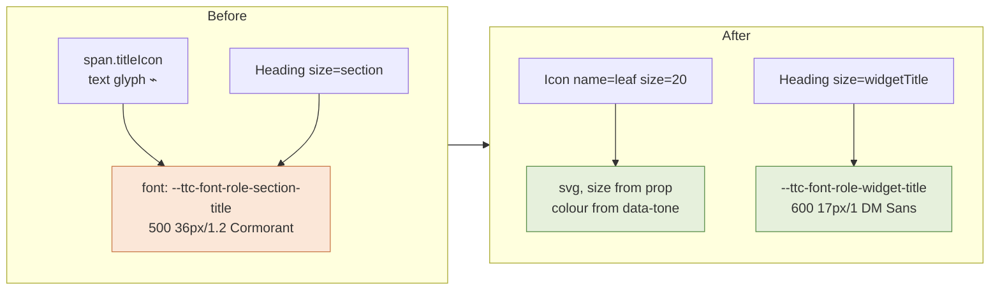
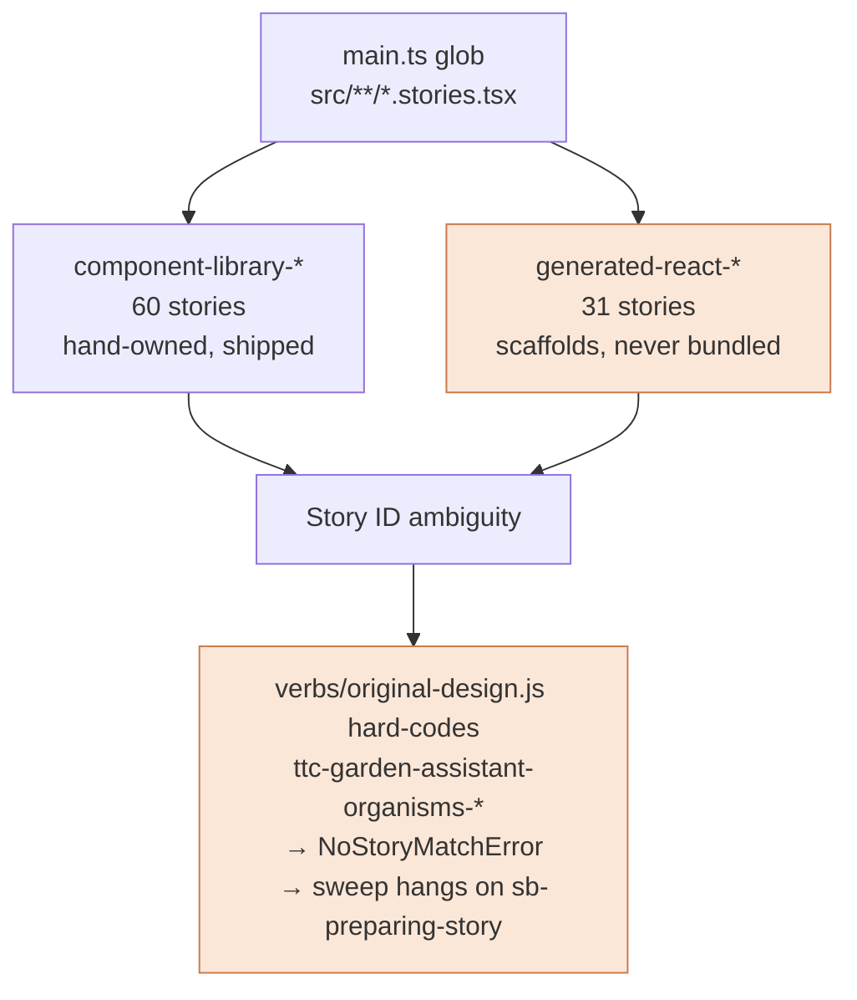

# PROJECT REPORT - TTC Garden Assistant - The Systemic Widget Pass and the Duplication That Hid It

This report continues [[PROJECT REPORT - TTC Garden Assistant - Chat Widget Visual Parity and the Token-Layer Root Cause|the token-layer root cause analysis]], which diagnosed why two generative chat widgets stopped matching the design they were ported from and repaired them. That work was scoped to two widgets because the ticket said so. The scope was wrong, and the way it turned out to be wrong is the subject of this report.

The first repair established that the drift originated in three font-role tokens resolving to a serif display face. What it did not establish was how many components were affected, because the investigation examined only the two widgets the pixel-diff ranking had flagged as severe. When the corrected widgets were viewed next to an uncorrected one, the answer became visible immediately: every widget in the set carried the same two defects, and a third defect that the first analysis had not looked for at all. The reason nobody had noticed is that the defective code was duplicated nine times, and duplication of a defect makes it read as convention.

> [!summary]
> - Nine widgets hand-rolled the same heading row. Each copy contained the same two defects: a `Heading size="section"` binding that resolves to 36px Cormorant, and a text glyph standing in for an icon, sized by `--ttc-font-role-section-title` — so a 36-pixel punctuation character sat beside a 36-pixel serif title.
> - The `Icon` atom already exported every icon the original design uses. Twenty-six text glyphs across eight components were substituting for icons sitting in the same repository. One of them, `□` for `calendar`, is the "empty square" a previous session had recorded as a mystery.
> - `WatchForSignsWidget` set its title glyph to `color: transparent`. The icon was not wrong; it was invisible, and had been for as long as the component existed.
> - `SuggestionStrip` drew a gradient card with a border, an eyebrow and a heading around what the original renders as a bare wrapping row of chips. Card chrome is now opt-in.
> - The generated DMETA React components are imported for their types only — 29 type-only imports, zero value imports — yet contributed 31 of 91 Storybook stories. That second story tree is the direct cause of the stale-story-ID hang that killed the original comparison sweep.
> - A gallery story rendering all thirteen widgets at 460px caught two remaining defects *after* a pass that had already been reviewed component by component.

## Why two widgets were not enough

The first pass repaired `TopMatchesWidget` and `PlantDetailMini`. The ticket's definition of done said to stop there. The evidence that this was wrong arrived as a screenshot of the running application showing `WhyTheseWorkWidget`:

```text
original canvas                        running application
─────────────────────────────          ─────────────────────────────
🌿 Why these work in your front yard    ⌁  Why these work in your
   (600 17px/1 DM Sans, gold leaf)         front yard
                                           (500 36px/1.2 Cormorant,
                                            36px punctuation glyph,
                                            wrapping to two lines)
```

The title occupied roughly four times the vertical space of the original and pushed the stat tiles down the card. This is the same defect the first report diagnosed, in a component that pass had not touched.

The correct inference is not "fix that one too." It is that a defect located in a shared layer will appear in every consumer of that layer, and the consumer list is the unit of repair. The pixel-diff ranking that scoped the original ticket had ranked `why-these-work` eleventh of eleven at 11.19%, below `why-pair` at 10.09% only by a rounding margin. That ranking measured a 1280px-versus-460px viewport mismatch far more than it measured the defect, which the first report already established. Scoping repair work by that metric selected two widgets essentially at random from a set of thirteen that were uniformly affected.

## The duplication

Every widget contained a private copy of the same heading row:

```tsx
<header className={styles.sectionTitle} data-ttc-part="title">
  <span className={styles.titleIcon} aria-hidden="true">⌁</span>
  <Heading level={3} size="section" tone="action">{title}</Heading>
</header>
```

with a private copy of the same CSS:

```css
.sectionTitle { align-items: center; display: flex; gap: var(--ttc-space-4); }
.titleIcon {
  color: var(--ttc-gold-600);
  display: inline-flex;
  flex: 0 0 auto;
  font: var(--ttc-font-role-section-title);   /* 500 36px/1.2 Cormorant */
  line-height: 1;
}
```

Nine copies, differing only in the glyph character and the icon colour. The original design has exactly one such component, `SectionTitle` in `original/atoms.jsx:146`:

```jsx
function SectionTitle({ icon, color = 'gold', children, right, style }) {
  const iconColor = color === 'gold' ? 'var(--ttc-gold-600)' : `var(--ttc-${color})`;
  return (
    <div style={{ display: 'flex', alignItems: 'center', gap: 10, ...style }}>
      {icon && <Icon name={icon} size={20} color={iconColor} />}
      <span style={{
        font: '600 17px/1 var(--ttc-font-body)',
        color: 'var(--ttc-navy-800)', letterSpacing: '-0.01em',
      }}>{children}</span>
      {right && <span style={{ marginLeft: 'auto' }}>{right}</span>}
    </div>
  );
}
```

The promotion process had inlined this component into each consumer rather than promoting it. That is the mechanism by which the defect became invisible. A reviewer opening any single widget sees a heading row that looks like every other heading row in the codebase, which is the strongest available signal that it is correct. There is no file whose job is to be the heading row, so there is no file where the wrong font role is obviously wrong.

The repair extracts it once, as `components/molecules/WidgetSectionTitle`:

```tsx
export function WidgetSectionTitle({ icon, tone = 'gold', headingLevel = 3, right, className, children }) {
  return (
    <header className={...} data-ttc-component="WidgetSectionTitle" data-ttc-part="title" data-tone={tone}>
      <Icon className={styles.icon} name={icon} size={20} aria-hidden="true" />
      <Heading level={headingLevel} size="widgetTitle" tone="action">{children}</Heading>
      {right && <span className={styles.right} data-ttc-part="title-right">{right}</span>}
    </header>
  );
}
```

`size="widgetTitle"` is a new `Heading` size bound to `--ttc-font-role-widget-title` (`600 17px/1` DM Sans) with `-0.01em` tracking. The tone maps to the icon colour through attribute selectors rather than a style prop, so the colour decision stays in CSS where the token lives.

The icon and tone for each widget were read out of the original source rather than chosen:

| Widget | `original/organisms.jsx` | icon | tone |
|---|---|---|---|
| QuickPicksWidget | `:58` | `leaf` | gold |
| TopMatchesWidget | `:76` | `star` | gold |
| WhyTheseWorkWidget | `:101` | `leaf` | gold |
| WhyPairWidget | `:116` | `leaf` | gold |
| WateringGuideWidget | `:137` | `droplet` | water |
| WatchForSignsWidget | `:155` | `eye` | navy |
| CompareTeaser | `:176` | `scale` | navy |
| CareCalendarWidget | `:208` | `calendar` | navy |
| UploadPromptWidget | `:281` | `camera` | navy |

## The glyph substitution

The second defect is independent of typography and was not examined in the first pass. Every icon in every widget was a Unicode character in a `<span>`:

| Component | Glyph | Meaning | Icon that already existed |
|---|---|---|---|
| WhyTheseWorkWidget | `↕ ↔ ☼ ⌁ ♢` | height, spacing, sun, leaf, droplet | `height` `spacing` `sun` `leaf` `droplet` |
| WateringGuideWidget | `□ ♢ ☼ ⌁` | calendar, droplet, sun, leaf | `calendar` `droplet` `sun` `leaf` |
| WatchForSignsWidget | `⊘ ⌁ ◖ ☼` | prohibit, leaf, droplet, sun | `prohibit` `leaf` `droplet` `sun` |
| CareCalendarWidget | `♢ ⌁ ☼ ☁` | water, prune, feed, rest | `droplet` `leaf` `sun` `cloud` |
| WhyPairWidget | `◇ ✦ ☼ ⌁ ♧ ♢` | boxwood, lavender, sun, fern, tree, droplet | `pottedTree` `flower` `sun` `leaf` `tree` `droplet` |
| QuickPicksWidget | `›` | chevron | `chevron` |
| CompareTeaser | `⚖` | scale | `scale` |
| FilterBar | `☷` | sliders | `sliders` |

`src/components/atoms/Icon/Icon.tsx` exports 34 names and implements every one in this table. The glyphs were never a workaround for a missing icon; they were a substitution for an icon in the same package. Three consequences followed from that substitution, each of which had been recorded separately as an unexplained visual problem:

**The empty box.** `□` is the glyph chosen for `calendar` in the watering guide. In the rendering font it has no distinguishing marks, so it renders as an empty square. A previous session's diary recorded this as "icon mapping degradation, including a square/incorrect glyph" without identifying the cause.

**The invisible icon.** `WatchForSignsWidget.module.css` set `.titleIcon { color: transparent }`. Whoever wrote it presumably could not find a glyph for `eye` and hid the placeholder rather than removing it. The widget shipped with a heading row containing an invisible character where the design has an eye icon.

**Size coupling.** Because a glyph is text, its size is controlled by `font`. Every glyph container therefore carried `font: var(--ttc-font-role-section-title)`, which is how a decorative `☆` in `TopMatchesWidget` came to render at 36 pixels. An `<svg>` takes its size from a prop and is immune to this class of error entirely.

The repair replaces each glyph map with a name map and renders the atom at the size the original specifies:

```tsx
// original/organisms.jsx: icons = { water: 'droplet', prune: 'leaf', feed: 'sun', rest: 'cloud' }
const stateIcon: Record<CareMonth['state'], IconName> = {
  water: 'droplet', prune: 'leaf', feed: 'sun', rest: 'cloud',
};
...
<span className={styles.monthDisc} aria-hidden="true">
  <Icon name={stateIcon[month.state]} size={14} stroke={1.8} />
</span>
```

Sizes come from the original call sites: 20px for section titles, 22px for stat tiles, 18px for guide steps, 16px for tag chips, 14px for calendar months, 56px for the why-pair feature tiles.



## The container that should not exist

`SuggestionStrip` renders the follow-up buttons beneath an assistant answer. The promoted implementation wrapped them in a gradient surface with a border, a keyline shadow, an eyebrow reading "Suggested next steps", and a serif heading reading "What would you like to do next?".

The original is `SuggestionRow` at `original/molecules.jsx:93`:

```jsx
function SuggestionRow({ items = [], onPick, style }) {
  return (
    <div style={{ display: 'flex', gap: 10, flexWrap: 'wrap', ...style }}>
      {items.map((it, i) => <SuggestionChip ... >{obj.label}</SuggestionChip>)}
    </div>
  );
}
```

A flex row. No surface, no border, no eyebrow, no heading. The chips carry their own chrome; the row carries none. The promoted version had acquired an entire card around three buttons, which is what reads as a box drawn around the choices.

The repair makes the chrome opt-in rather than deleting it, because the landing and demo surfaces may legitimately want a framed variant:

```tsx
export interface SuggestionStripProps extends GeneratedSuggestionStripProps {
  /** Draw the card surface. Off by default: the original chat design renders a
   *  bare row of follow-up chips with no container. */
  framed?: boolean;
  /** Show the eyebrow + heading block. Off by default for the same reason. */
  showHeader?: boolean;
}
```

This follows the same rule the previous report applied to `ProductCard`: the imported original is the default, and the productized variant declares itself at the call site.

## The gallery, and why component-by-component review was insufficient

The pass above was performed component by component, each change checked against the original source. It was then reviewed by rendering a new story that composes all thirteen widgets in a single 460px column:

```tsx
export const AllWidgets: Story = {
  render: () => (
    <div style={{ width: 460, margin: '0 auto', display: 'grid', gap: 16, padding: 24 }}
         data-ttc-story-frame="chat-gallery">
      <QuickPicksWidget items={quickPicks} />
      <TopMatchesWidget products={products} totalCount={12} />
      ...
      <SuggestionStrip suggestions={[...]} />
    </div>
  ),
};
```

One element screenshot of that container caught two defects the component-by-component pass had missed: `CompareTeaser` still rendered a 36px serif "Compare these plants", and `FilterBar` still showed a `☷` glyph where the original uses the `sliders` icon. Both were missed because both are molecules, and the pass had been organised around the organisms directory.

This is a general result worth keeping. A per-component review answers "is this component correct?" A composed review answers "is the surface correct?", and the second question has a different failure set: it catches components excluded from the work list, inconsistencies between neighbours, and rhythm errors that are invisible when a component is viewed alone. The gallery costs one story file and turns thirteen screenshot round-trips into one.

## The dead scaffold story tree

A question raised during the work: are the DMETA-generated React components used at all?

They are not, in the sense that matters for the bundle. Across `src/`, there are 29 imports from `generated/dmeta-widgets/` and every one is `import type`; the promoted components take the generated prop interfaces and reimplement the component. The only value import is `dmeta.generated-manifest.json`, consumed by `componentManifest.ts` to drive the promotion-state test. TypeScript erases type-only imports, so the 31 `.generated.tsx` files never enter the production bundle.

They were nonetheless present in Storybook, because `main.ts` globbed `../src/**/*.stories.@(js|jsx|ts|tsx)`, which matches `*.generated.stories.tsx`. That produced two parallel widget trees:



The ambiguity is not hypothetical. The original comparison sweep hung indefinitely after its first case because the jsverb referenced `ttc-garden-assistant-organisms-*` after the titles were reorganised into `component-library` and `generated-react` trees. The failure was silent: `curl` returned 200 in 7ms while the browser sat on a `sb-preparing-story` loader, and only the browser console reported `NoStoryMatchError`. Every subsequent `waitFor` blocked for its full timeout.

The scaffold stories were excluded at the glob rather than deleted:

```ts
stories: ['../src/!(generated)/**/*.stories.@(js|jsx|ts|tsx)'],
```

Deletion is the wrong operation for two reasons. `validate-dmeta-manifest.mjs:96` asserts that every path listed in a manifest component's `generated` block exists, and that block includes `stories`; removing the files fails the validator. And the files are generator output, so `dmeta lower-react` would recreate them on the next run. A glob exclusion survives regeneration and requires no edit to a generated artifact.

Result: 31 `generated-react-*` stories to 0, `component-library-*` unchanged at 60.

One implementation note. Storybook's `stories` array did not honour a negation entry — `'!../src/generated/**/*.generated.stories.tsx'` alongside the broad glob left the count at 31. The extglob directory exclusion worked. Verifying this required checking `/index.json` rather than trusting the config, and the first verification attempt was misleading for an unrelated reason: `pkill -f "storybook dev"` did not match the running process, whose command line is `node .../storybook/dist/bin/dispatcher.js dev -p 6008`. The restart bound to port 6010 while 6008 continued serving the old configuration.

## Verification

```text
typecheck                    pass
validate:css-vars            pass   155 variables defined, 1966 references
validate:css-strict          pass   44 token-strict modules, 40 layout-ownership modules
validate:dmeta-manifest      pass   31 generated components, 31 promotion overrides
build                        pass
vitest                       33 pass, 1 pre-existing unrelated failure
go build ./... / go test     pass   9 packages
```

The running stack was exercised end to end. The Go backend runs in provider mode:

```text
serve-chatbot --addr :8091 --runtime provider --profile gpt-5.6-luna-low
              --profile-registry default --rag-db /tmp/rag-eval.db
```

A prompt submitted through the Vite proxy on `:3008` reached `status: finished` with a user message, a `thinking` entity and an assistant answer, confirming the proxy, session store, engine and reasoning plugin.

For widget testing specifically, mock mode is the useful path because it requires no credentials and is deterministic:

```bash
go run ./cmd/ttc-garden-chat serve-chatbot --addr :8092 --runtime mock
```

```bash
SID=$(curl -s -X POST localhost:8092/api/chat/sessions -H 'Content-Type: application/json' -d '{}' \
      | python3 -c "import json,sys; print(json.load(sys.stdin)['sessionId'])")
curl -s -X POST "localhost:8092/api/chat/sessions/$SID/messages" -H 'Content-Type: application/json' \
     -d '{"prompt":"make a shopping plan for a privacy screen in zone 7"}'
sleep 5
curl -s "localhost:8092/api/chat/sessions/$SID"
```

That returns three `ChatWidgetInstance` entities — `ttc.plant_detail_mini.v1`, `ttc.care_calendar.v1`, `ttc.shopping_plan_summary.v1` — each `WIDGET_STATUS_READY` with its props. The snapshot endpoint is the cheapest assertion point in the system: it requires no WebSocket client and returns the full entity list for a session.

One misleading detail encountered during that verification: the submit response reports `"profile":"mock"` even in provider mode. The field echoes `s.defaultProfile`, which `NewServer` initialises to `"mock"` (`appserver/server.go:29`), and it is returned whenever the request body omits a profile. It does not reflect the resolver. The real inference output is the reliable signal.

## Key points

- A defect duplicated across N consumers reads as convention. The absence of a shared component is what prevents the defect from being visible, so extracting the shared component is part of the diagnosis and not only part of the repair.
- Ranking work by a metric you have already shown to be unreliable will select a near-random subset. The first ticket's two-widget scope came from a pixel-diff ordering that the same investigation had documented as dominated by a viewport mismatch.
- A text glyph substituting for an icon couples the icon's size to a font role and silently inherits every typography change. Rendering an SVG from a size prop removes an entire class of defect, and in this codebase every substituted glyph had an implemented atom already available.
- Per-component review and composed-surface review find different defects. Two errors survived a component-by-component pass and were caught by the first screenshot of all thirteen widgets together.
- Generated artifacts that are consumed for their types are still not free: their stories create a second index that ambiguates every tool keyed on story ID. Exclude them at the consumer, not by deleting generator output.
- `color: transparent` on a placeholder is a defect that no test and no type check will ever report. It is only visible to something that looks at the rendered surface.

## Repo artifacts

- Repository: `/home/manuel/code/wesen/2026-05-27--ttc-design-system`
- Commit: `32d7754` — "Restore the original design voice across all chat widgets" (42 files, +360/−228)
- Preceding commit: `e753a64` — the two-widget pass described in the earlier report
- New shared component: `src/components/molecules/WidgetSectionTitle/`
- New review surface: `src/stories/ChatWidgetGallery.stories.tsx` → `sources/after/_gallery.png`
- Storybook config: `web/packages/ttc-garden-assistant/.storybook/main.ts`
- Ticket workspace: `ttmp/2026/08/02/TTC-CHAT-UI-001--improve-and-update-the-chat-ui/`
- Source of visual truth: `original/atoms.jsx:146` (SectionTitle), `original/molecules.jsx:93` (SuggestionRow), `original/organisms.jsx` (per-widget icon/tone)

## Open questions

- `ShoppingPlanSummaryWidget` has no counterpart in the imported design. It retains an eyebrow and a gradient surface, which is now inconsistent with every neighbouring widget. It needs either a design decision or alignment with the others.
- `componentManifest.test.ts:20` asserts a component count of 17 against an actual 31. It fails on a clean checkout, predates this work, and needs its own commit.
- The italic latin names in `ProductCard` and `PlantDetailMini` depend on the widget module's `font-style: italic` winning over the foundation `font:` shorthand, which resets it. This currently works through stylesheet order.
- `verbs/original-design.js` still hard-codes story IDs. Excluding the scaffold tree removes the ambiguity but not the fragility; the tooling should resolve IDs from `/index.json`.
- The `"profile":"mock"` field in the submit response is inaccurate in provider mode and should either report the resolved profile or be removed.

## Related notes

- [[PROJECT REPORT - TTC Garden Assistant - Chat Widget Visual Parity and the Token-Layer Root Cause]]
- [[PROJECT REPORT - RAG-TTC Connected Retrieval - Gated Facts, Numbered Citations, and the Graph Stopping Rule]]
- [[PROJECT REPORT - RAG-TTC Tool Loop - Observable Multi-Inference QA and the F0 T1 T2 Evaluation]]
