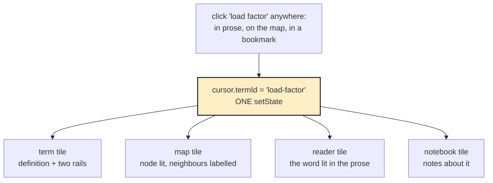
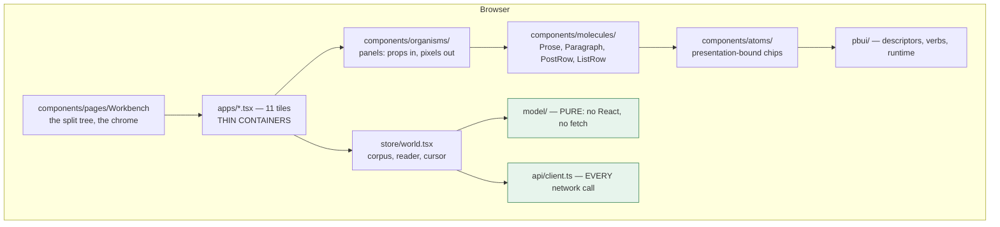

# PROJECT REPORT - hyperblog - A Subscription Blog Whose Cursor Is a Glossary Term

This report explains the design and first implementation of **hyperblog**, a single Go binary that serves a subscription blog through a tiling workbench. The corpus is a glossary of twenty-five terms about memory and hash tables, twelve essays that cross-link into it, and three ordered reading paths. Definitions are free; six of the twelve essays require a membership. The binary embeds the writing, the compiled React workbench, a SQLite store, and an HTTP API. It has one optional external dependency — an OIDC identity provider — and runs as a complete product without it.

The interesting work was not building a blog. It was determining what changes when the unit of navigation is a *term* rather than a *page*, and what a paywall has to be when the client cannot be trusted to enforce it. A secondary thread runs through the whole report: five defects that passed typecheck, unit tests and code review, and were caught only by looking at a rendered screen or by running a check that no test invokes.

> [!summary]
> - The cursor is a glossary term, not a page. Clicking a term anywhere re-derives four tiles at once, and costs one state assignment — no fetch, no route change, no loading state. This is only possible because the entire corpus ships in a single response.
> - Backlinks are derived at load and stored nowhere. `Build()` walks the markdown once and inverts it into six projections. A backlink cannot go stale because it is not a fact; to change what links to what, you edit the prose.
> - The paywall is the absence of bytes, not the presence of a flag. `redactPost` sets `post.Body = nil` on a copy, and everything else about the post — title, date, word count, term set, every backlink — still ships. A client that ignores every flag still cannot render prose it was not sent.
> - Entitlement is eight lines and fails closed. `TierRank` returns `-1` for an unknown tier, which is *below* free, so an unrecognised reader locks everything. That single choice is load-bearing in three separate places.
> - The corpus is authored as markdown with a YAML preamble, following `publish-vault`'s conventions. Its `pkg/vault` was deliberately not imported: it renders notes to an HTML string, and a `[[wikilink]]` inside one has already become an `<a href>` — which destroys the structure the presentation layer needs.
> - Shipped in eight commits: 221 files, 28 185 insertions, 113 Go test functions across four packages, 75 story exports, zero typecheck findings.

## Where the design came from

The product derives from `~/Downloads/pbui-glossary.jsx`, a single-file React sketch whose header comment states three rules in capitals. Those three rules are the architecture, and every section below is a consequence of one of them:

```
THE CURSOR IS A TERM, NOT A PAGE.
BACKLINKS ARE DERIVED, NEVER STORED.
THE WHOLE CORPUS LOADS ON BOOT.
```

hyperblog is the fourth product built on **pbui**, a TypeScript implementation of ideas from the Common Lisp Interface Manager, after datalab, agentlogic and turboproof. pbui supplies the presentation protocol, the window chrome, roughly twenty-eight components, and the workbench document protocol. Everything shared is imported. The governing document is `pbui/docs/playbooks/building-a-new-hyperslop-systems-app-on-pbui.md`, which records what the first three products paid for.

## The first rule: the cursor is a term

In a text editor the cursor is a character position. In a video tool it is a playhead. Here it is whichever term the reader last touched, and every tile bound to it re-derives simultaneously.



The property that matters is what is *absent* from that diagram. There is no fetch, no route change, and no loading state in any of the four tiles. `world.setTerm()` assigns a string and React re-renders; every tile reads what it needs from a corpus already in memory.

This is only affordable because of the third rule, and the two are best understood as a single decision. `GET /v1/corpus` answers with every term, post, series and derived projection in one response of roughly 50 KB. Nothing paginates it. There is no `GET /v1/terms/{id}` and deliberately no way to add one. The cost is that the corpus must stay small enough to ship whole; at a few hundred posts this design would need revisiting. The benefit is that every cross-link in the interface is a map lookup rather than a request, which is what makes a four-tile update feel instantaneous.

## The second rule: derived backlinks

The corpus is a set of markdown files. Definitions and paragraphs reference terms with a wiki-link grammar. When the server starts, `Build()` walks every file once and inverts the references into six projections.

| Projection | Shape | Drawn by |
|---|---|---|
| `Mentions` | term → [{post, paragraphId}] | the term tile's "mentioned in N posts" |
| `UsesIn` | post → [term] | the reader tile's term rail |
| `DefRefs` | term → [term] | the term tile's "leans on" |
| `DefBack` | term → [term] | the term tile's "leaned on by" |
| `Edges` | [{a, b, weight}] | the term map |
| `Topics` | topic → [post] | the index tile's filter |

None of these is persisted. There is no `links` table, no join, and no migration that could disagree with the prose. The practical consequence for anyone maintaining the system is that there is exactly one place to change what links to what, and it is the writing.

The two rails in the term tile are separate deliberately, and merging them would lose the distinction a reader is using the glossary to learn. `DefRefs` is what an author wrote: the terms this definition leans on. `DefBack` is its inverse, which nobody wrote — it is which definitions lean on *this* one. One is built *on*, the other is built *from*.

### The order of Build is the algorithm

```
Build(src Source) (*Corpus, error):
  0. check ids unique, tiers known                → ERROR if not
  1. sort posts NEWEST FIRST
     per block: paragraphId = post.id + ":p" + i   ← notes anchor here
                words += wordCount(plain(text))
  2. per post, per NON-CODE block, per [[ref]]:
        Mentions[term] += {post, paragraphId}      ← one per PARAGRAPH
        UsesIn[post]   += term
  3. per term: DefRefs[term] = refs in its definition (never itself)
               DefBack[to]  += term                 ← the inversion
  4. resolveRelated()  drop dead `related`, REPORT
     buildEdges()      sum three weight sources
     collect diagnostics
  5. per series: terms = union of its posts' terms
```

Three details in that sequence are easy to get wrong and expensive to discover later.

**Paragraph ids are positional and assigned at load.** They are what a note anchors to. Anchoring to a paragraph rather than a character offset means an edit *above* a highlight does not orphan it. The cost is that reordering paragraphs moves notes with the index rather than with the words — the correct trade for prose that is corrected far more often than it is restructured.

**Mentions are one per paragraph, not per occurrence.** A paragraph naming a term three times produces one `Mention`, because a `Mention` is `{post, paragraphId}` and three copies would be three identical rows in the term tile pointing at the same place. The resulting count — "four paragraphs across three posts" — is also the more useful number: it measures how widely an idea is used rather than how often an author repeated a word. The field name originally implied otherwise and a test asserted the wrong thing; both were corrected.

**Code blocks are not scanned.** A benchmark table full of brackets would otherwise sprout links nobody wrote. The frontend states the same rule independently in `Paragraph.tsx`; both say so because neither derives from the other.

### The edge weights are the entire tuning surface of the map

```
3   per DIRECTION   a definition links to another definition
2                   a hand-written `related` entry
1                   co-mention: one post referenced both
```

The weight applies *per direction*, so a pair whose two definitions name each other scores 6 rather than 3. Mutual dependence between two ideas is a stronger claim than one citing the other, and the map should draw such a pair closer. This produces the most surprising number in the file: a test expecting `3+2+1 = 6` for such a pair sees 9. One did, and the test was wrong rather than the code — recorded in the diary as the first of several assertions that real data disproved.

On the shipped corpus the heaviest edges are `cache-line ↔ load-factor` and `load-factor ↔ probe`, both at 14, followed by `open-addressing ↔ probe` at 13. Those three pairs are the spine of the hash-table material, which is the correct answer and was not hand-tuned to produce it.

### Wrong is not the same as unservable

A corpus can be defective without being unservable, and conflating the two produces a server that refuses to start over a typo in an essay. The distinction is carried by a type:

```go
type Diagnostic struct { Kind, Subject, Detail string }
```

The rule: **if a defect would render as something a reader could mistake for working, the offending thing is removed from the index and reported; otherwise it is only reported.** `Build` returns an `error` only for what it genuinely cannot index.

| Defect | Handling | Reasoning |
|---|---|---|
| a `related` entry naming a missing term | **dropped** + reported | it would draw a chip that navigates nowhere |
| a `[[ref]]` naming a missing term | kept + reported | renders as its own text; misleads nobody |
| a term nothing mentions or links to | kept + reported | legitimate, but the best available signal of drift |
| a duplicate id | **error** | cannot be indexed |
| a series naming a missing post | **error** | the path is broken |
| a post with an unknown tier | **error** | `TierRank` fails closed, so it would lock everything and read as a paywall bug |

`Corpus.Diagnostics` ships alongside the writing at `GET /v1/corpus`, and a `diagnostics` tile draws it. A corpus defect is an author's problem, and the author is the person running the binary; a defect visible only in `go test -v` is a defect nobody fixes.

The shipped corpus carries two, both inherited from the source sketch. `cache-line` lists a related term `alignment` that was never defined, and `what-membership-buys` writes `[[series]]`, where `series` is a content type rather than a term. The first is dropped and reported; the second renders as the word "series" and is reported. They remain in the corpus deliberately, because they are also the demonstration that the tile works.

## The authoring format, and a dependency deliberately not taken

The corpus is a small vault of markdown files with a YAML preamble. The filename is the id.

```
pkg/glossary/corpus/
  terms/load-factor.md
  posts/tombstones.md
  series/s-hash.md
```

```markdown
---
name: load factor
short: how full you let a table get before growing it
related: [open-addressing, probe, cache-line, amortized, worst-case]
---
Entries divided by capacity. Let it climb and [[probe]] chains lengthen until
every insert walks half the table; keep it low and you have bought speed with
memory. The familiar 0.75 is not folklore — it is the knee of a curve you can
measure yourself, and it moves with your key size and your [[cache-line]].
```

These conventions are `go-go-golems/publish-vault`'s: the same YAML preamble, the same `[[target|alias]]` grammar, the same filename-is-the-slug rule, and the same principle that backlinks are derived by walking the corpus.

**Its `pkg/vault` was evaluated and deliberately not imported.** `vault.Note` carries an `HTML string` field — the note rendered to a blob — and a `[[wikilink]]` inside that string has already become an `<a href>`. hyperblog cannot use that. In this interface a term reference must survive as *structure* all the way to the browser, because there it becomes a typed `<term>` presentation with an object menu, keyboard reachability, and the ability to satisfy a cross-tile pick. Re-deriving typed nodes by parsing an HTML string back apart would be strictly worse than never rendering it. A second, smaller mismatch: a vault has one flat note type, and this corpus has three with different frontmatter and different rules.

The loader therefore walks the top level of the goldmark AST and takes each node's *source span*, so `Block.Text` holds exactly what the author typed, brackets included. The conventions were taken; the code was not.

## The paywall

### What a locked post keeps

```
KEPT      id, title, dek, date, tier, topics, word count, term set,
          every mention, every backlink, its place in a series
WITHHELD  Body    ← and only Body
```

A reader cannot buy what they cannot see. Concealing that a post exists sells nothing, and it also makes the term tile lie: "four posts mention load factor" would become "two", and the glossary's entire value is that the count is honest.

### The mechanism is one assignment

```go
// pkg/server/handlers_corpus.go
func redactPost(corpus *glossary.Corpus, post glossary.Post, readerTier string) PostView {
    locked := corpus.Locked(post.ID, readerTier)
    if locked == "" { return PostView{Post: post} }
    post.Body = nil                       // ← the COPY, not the shared corpus
    return PostView{Post: post, LockedBy: locked}
}
```

The client is never trusted to enforce it. The workbench draws a lock panel because the body is *absent from the response it received*, not because a flag instructed it to. A client that ignores every flag still cannot render prose it does not have.

That property is what the test suite spends most of its effort defending, and the shape of the test matters:

```go
TestNoLockedProseAppearsAnywhereInTheResponse
    take a distinctive phrase from the locked post's first paragraph
    assert it is NOT in the free reader's response BYTES
    assert it IS in the member's        ← or the test proves nothing
```

The second assertion exists because a byte-absence test passes trivially if the phrase is simply never sent to anyone. Asserting the member receives it is what makes the free reader's absence meaningful.

A companion test guards a subtler failure. The server holds one `*Corpus` for the process lifetime, shared across every request and goroutine. Setting `post.Body = nil` on the shared struct rather than on a copy would delete the prose from the server's own memory — the first free reader would break the product for every member. `TestRedactionDoesNotMutateTheSharedCorpus` calls the endpoint five times as a free reader and then asserts a member still receives paragraphs.

### The same rule at four other surfaces

| Surface | Locked behaviour |
|---|---|
| `GET /v1/corpus` | body withheld, everything else kept |
| `GET /v1/search` | hit kept, match count kept, **snippet withheld** |
| the digest's unread count | locked posts **not counted** — unavailable is not unread |
| "clear the digest" | locked posts **not marked read** — otherwise subscribing later hides them permanently |
| `POST /v1/reading/notes` | **402 PaymentRequired**, with a hint naming the tier |

`402` is a distinct code from `403` because the remedies differ completely: `403` means the credential is too narrow, `402` means the membership is. A client that conflates them offers "sign in" at the moment it should offer "subscribe".

The response also carries `Vary: Cookie, Authorization` and `Cache-Control: private, no-store`. The same URL returns different bodies to different readers and both credentials travel in request headers; without `Vary`, a shared cache would serve one reader another's entitlement, which for a paywall is the worst available cache behaviour.

### Entitlement is eight lines and fails closed

```go
func (c *Corpus) Locked(postID, readerTier string) string {
    p, ok := c.PostByID[postID]
    if !ok { return "" }
    if TierRank(readerTier) >= TierRank(p.Tier) { return "" }
    return p.Tier
}
```

`TierRank` returns `-1` for an unknown tier, which is below `free`. That single return value is load-bearing in three places: it places an anonymous reader below free with no second code path, it makes a corpus with a misspelled tier lock rather than unlock, and it is why `auth.TierAnonymous` can be the string `"anonymous"` without appearing in the tier ladder at all.

## Identity: two axes that never meet

The most consequential distinction in the Go code:

```
SCOPE  is a limit on a CREDENTIAL     "this token may write notes"
TIER   is a property of a PERSON      "this reader paid for MEMBER"
```

They never meet inside `pkg/auth`. A token carrying every scope still cannot read above its holder's tier, and there is a test that constructs exactly that principal and asserts the member post stays locked. The converse also holds and is less obvious: a narrow token reads *less* than no token at all. A token minted without `corpus:read` is refused at an endpoint where an anonymous caller succeeds, because a credential must never be broader than the absence of one.

`membership:write` is separable from `reading:write` specifically so a reader can mint a token for a script that reads their notes without that token being able to cancel their subscription.

### Resolution has three deliberate properties

`resolve()` in `pkg/server/middleware.go`:

1. **A bearer beats a cookie.** An explicit credential wins over an ambient one, so a token-authenticated `curl` issued from a browser-logged-in developer's machine behaves as the token.
2. **An invalid credential resolves to anonymous, not to an error.** A request bearing a stale token against the free glossary must still succeed. Conflating "presented something invalid" with "denied" breaks that, and it leaks whether a token id exists.
3. **Nothing in resolution writes a response.** Rejection is a per-handler decision because the required scope is a per-handler fact. A resolver that wrote its own 401 would make `/healthz` and the SPA shell unreachable without special-casing them twice.

`withTier()` reads the tier from the user row on *every* request rather than baking it into the credential. This is what makes an upgrade or a cancellation take effect on the next request rather than the next sign-in. A disabled account resolves to anonymous through every credential it holds.

### The sign-in flow makes exactly one back-channel call

```mermaid
sequenceDiagram
    participant B as browser
    participant H as hyperblog
    participant P as identity provider
    B->>H: GET /v1/auth/login
    Note over H: mint state/nonce/verifier<br/>store flow row<br/>set hb_flow cookie = state
    H-->>B: 302 to provider
    B->>P: authorize
    P-->>B: 302 back with code + state
    B->>H: GET /v1/auth/callback
    Note over H: cookie state == query state?<br/>TakeAuthFlow (single use)
    H->>P: code exchange
    P-->>H: claims
    Note over H: UpsertUser (JIT provision)<br/>CreateSession
    H-->>B: set hb_session; 302 to /ui/
```

The single exchange is what makes "a provider outage affects only new sign-ins" true rather than aspirational. An already-signed-in reader keeps reading because their session is a row in the local database, not a question asked of somebody else.

Four controls in that sequence are worth naming:

- **The state lives in a row *and* a cookie.** The row alone would let anyone who observes a callback URL redeem it. Requiring both means the callback must arrive in the browser that started the flow, and this is the check that makes login itself un-CSRF-able.
- **`TakeAuthFlow` deletes inside the transaction that reads.** A replayed callback finds nothing. A stale state is burned rather than left available for a second attempt.
- **`safeReturnPath` rejects everything outside `/ui`.** An unvalidated return parameter is an open redirect, and an open redirect on a login endpoint is a phishing primitive: an attacker sends a victim to the real sign-in page and receives them, authenticated, on their own site.
- **Every failure redirects with a code, never a rendered page.** This avoids reflecting provider-supplied text into HTML.

### CSRF, and where the check lives

A session cookie is an *ambient* credential: the browser attaches it to any request to the origin, including one a page on another site triggered. A bearer token is not ambient.

```go
if p.Kind != auth.KindSession { return true }   // bearer: not ambient
if r.Method is GET/HEAD/OPTIONS { return true } // safe
if Origin == cfg.ExternalURL   { return true }
return false                                    // 403 CrossOrigin
```

An *absent* `Origin` on a cookie-authenticated write has no legitimate source — a browser always sends it on a cross-origin unsafe request, and a non-browser client cannot hold the cookie ambiently — so it is refused too. The check lives *inside* `requireAuth` rather than beside it, so there is no way to authorize a mutating request without passing through it. It is the control most likely to be forgotten when adding an endpoint.

### What is stored, and what is not

| Thing | Stored as | Reasoning |
|---|---|---|
| session cookie | its SHA-256, as the primary key | a database dump contains no usable credential |
| API token | public id + SHA-256 of the secret | listable, nameable and revocable without being reproducible |
| the token plaintext | **nowhere** | returned once, at mint |
| the provider's id_token | in the session row | only so a *global* sign-out can pass it to the end-session endpoint |

SHA-256 rather than a slow KDF in both cases. The values are 256 bits from `crypto/rand`, so they are not guessable, and a KDF would add latency to every authenticated request to defend against a dictionary attack that cannot occur.

## The store: ownership as a WHERE clause

hyperblog has no sharing model. There are no shared objects, so there is no ACL and no membership table. Every method touching a reader's own data takes `userID` as its first parameter and places it in the `WHERE` clause of every statement, including writes:

```go
`UPDATE notes SET body = ?, open = ?, updated_at = ?
  WHERE id = ? AND user_id = ?`          // ← the ownership check
if affected == 0 { return ErrNotFound }  // not found == not yours
```

Not a preceding `SELECT`, so there is no window between the check and the write and no way to write the handler that skips it. "Not found" and "not yours" return the same error, so a caller cannot enumerate another reader's note ids. This is the one structural difference from datalab, where authorization is per-drop membership and every handler consults an ACL.

Four store rules earned their comments:

- **The pool holds one connection**, so writes are serial and need no locking. It also means a per-request bookkeeping write serialises the entire server, which is why `TouchSession` is throttled in memory *and* keeps a SQL age predicate for correctness when two processes share the file.
- **Expiry is enforced at read time**, not only by the sweeper. A sweeper that is also the enforcement mechanism makes a paused process an authorization bypass.
- **The idle clock advances; the absolute deadline never does.** Extending it on activity is how a session becomes immortal.
- **Timestamps use a fixed-width fraction.** `time.RFC3339Nano` strips trailing zeros, writing `.1Z` and `.11Z` — and `.1Z` sorts *after* `.11Z` as text even though 100 ms precedes 110 ms. Every "newest first" index in the schema would be subtly wrong.

## The frontend

### Layering



Two rules govern this and both are the first thing to erode: `model/` holds no React and does no fetching, and `organisms/` receive everything as props and emit everything as callbacks. That split is what makes `TermPanel` renderable in four states in Storybook with no provider and no store.

### Presentations and verbs

The product declares ten presentation types — `term`, `post`, `paragraph`, `series`, `topic`, `note`, `mark`, `tier`, `tile`, `workspace`. That list is the set of things a reader can right-click; anything not in it is decoration.

Two rules carry the binding layer. **One descriptor file per type**, rather than one `labelFor`, one `describe` and one `actionsFor` each containing a switch. And **verbs are serialisable data, never closures**:

```ts
export type Verb =
  | { kind: "focusTerm"; termId: string; via: string }
  | { kind: "openPost"; postId: string; paragraphId?: string }
  | { kind: "addNote"; paragraphId: string; noteKind: "highlight" | "note" | "question" }
  | { kind: "setTier"; tierId: string }
  // …
```

Because a verb is data, `actions(value, environment)` stays pure and a test can assert the exact verb a right-click produces with no store, no provider and no DOM. There is exactly one interpreter, in `App.tsx`, which is what makes "right-clicking the same object anywhere does the same thing" structurally true rather than a convention.

**Presentation values are ids, not objects.** A `term` presentation carries `{ id }` and not a `Term`. Beyond keeping verbs small, this means a value cannot go stale: a reader can right-click a term, leave the menu open while the corpus reloads, choose an action, and have it operate on the term as it is *now*.

### The term map is deterministic

`model/layout.ts` runs a force simulation to completion at layout time rather than animating it. Three consequences, and all three are the reason:

- The same corpus always produces the same picture, so a reader who learns where `load factor` sits finds it there tomorrow, and a screenshot in documentation stays accurate.
- There is no animation loop, so the tile costs nothing when nobody is looking at it — which in a workbench of a dozen tiles is the difference between a workbench and a fan.
- It is a pure function of `(terms, edges, width, height)`, testable without a DOM.

Two numerical details are load-bearing. The initial placement is a **circle, not random**: random placement makes the output depend on a seed, and occasionally places two nodes coincident. And the distance is **floored at 1**: two coincident nodes produce `1/0 = Infinity`, and `Infinity × 0 = NaN`, which propagates silently through every subsequent iteration and renders as an empty map with no error anywhere.

## Five defects that passed everything mechanical

This is the part of the project worth generalising. Each of the following passed `tsc --noEmit`, passed the test suite, and produced no console output.

**1. The design tokens were aliased to names that do not exist.** `app.css` defined `--hb-tone-term: var(--pbui-blue)` and six siblings, invented from the source sketch's palette. The family's token contract uses semantic `--pbui-tone-*` names and defines none of the invented ones. An undefined custom property makes the whole declaration invalid at computed-value time, so every chip's 4px left edge silently fell back to ink. There is no build error and no console warning for this condition. It was found by running a grep that compares tokens read against tokens defined in the built CSS, now wired as `make ui-token-check` and part of `ci-check`.

**2. Because the components rendered bare, hand-rolled replacements looked better.** Having broken the tokens, pbui's `Button`, `TextInput`, `TextArea`, `Chip` and `EmptyState` all rendered without borders or padding — so a raw `<button>` with an inline style genuinely looked better, and five such components were written. This is the second documented instance of the same causal chain in this product family, and the mechanism is exact: a CSS defect produces a component-adoption decision. The playbook records that agentlogic ended up using 6 of pbui's ~28 components by this route. All five were deleted once the tokens were fixed.

**3. A chip drew its border twice.** `className="hb-chip"` was set on both the `Presentation` wrapper and an inner `<span>`, and pbui's `Presentation` is itself a `<span>` — producing a 1px box inside a 1px box, one pixel apart. Nothing failed. It was found by looking at a screenshot of the locked-post story.

**4. A test asserted the wrong number and the code was right.** `TestEdgeWeightsSumTheThreeSources` expected `alpha↔beta == 6` and got 9, because the definition weight applies per direction and both fixture definitions name each other. The correct response was to fix the assertion and document the reciprocity rule where it would be read.

**5. A field name implied semantics the code did not have.** `Mentions` looked like it was dropping entries; it was not, because entries are one per paragraph rather than per occurrence. The behaviour was correct and the name and one test were misleading. Both were corrected.

The generalisable observation: four of these five were invisible to every mechanically checkable property of the system, and were caught by looking at a rendered screen, by running a check that no test invokes, or by taking a red assertion on real data seriously rather than assuming the code was wrong.

## A finding about the product family

The refactor that closed defect 2 surfaced a convention that pbui itself follows strictly and that no product built on it followed: every component is a folder containing `Name.tsx`, `Name.stories.tsx`, `index.ts`, and `Name.module.css` when it has styles. `pbui/packages/datalab-ui` is fully compliant at roughly seventy components. agentlogic, turboproof and hyperblog's first draft were not — agentlogic held thirteen components in a single `molecules/index.tsx` and carried a 1140-line global stylesheet.

The convention had never been written down. Two playbook sections now exist as a result — one stating it for new applications, one describing the retrofit — and both were subsequently corrected by their first real use, which found a contradiction between two of their own checks.

## Current status

| | |
|---|---|
| Repository | `github.com/hyperslop-systems/hyperblog`, 8 commits, clean tree |
| Go | ~10 000 lines, 113 test functions across four packages, all passing |
| TypeScript | ~6 800 lines, typechecks clean, 11 component folders, 75 story exports |
| Corpus | 40 markdown files: 25 terms, 12 posts, 3 series, 103 derived edges |
| Ticket | `HYPERBLOG-1`, `docmgr doctor` clean: intern guide, diary, 2 extraction scripts |

The product runs end to end. An anonymous reader receives the whole glossary and no post bodies; `hyperblog reader --tier member --token` provisions a local account without an identity provider and mints a credential; the same URL then returns the prose.

## Open questions and known gaps

- **The frontend has no unit tests.** `model/` is deliberately pure — corpus projections, reading derivations, the force layout — precisely so it can be tested with literals, and those tests were never written. The Go side is well covered; the TypeScript side is covered by typecheck and stories only. This is the largest hole.
- **Four component-scoped rules remain in the global stylesheet.** `.hb-map-edge`, `.hb-map-node`, `.hb-map-label` belong to the map tile and `.hb-rail` to the reader tile. The other twelve classes are genuinely product-wide.
- **The frontend types are hand-written.** `ui/src/model/corpus.ts` mirrors the Go structs manually. The playbook prescribes generating them with a CI staleness check before the frontend has types; `cmd/schemagen` does not exist.
- **The layout is not persisted.** The workbench protocol is fully implemented server-side — revisions, idempotency keys, an SSE stream — and the frontend keeps its split tree in component state. Connecting them is mechanical.
- **No parity fixture.** `pkg/workbenchapp/catalog.go` and `ui/src/appkit/registry.ts` must agree and neither asserts against a shared fixture.
- **No `conventions.test.ts`.** agentlogic gained one during its refactor; nothing currently prevents hyperblog's folder convention from drifting back.
- **`go mod tidy` cannot run offline** against the private pbui module, though `build` and `test` are unaffected.

## Near-term next steps

1. Write the `model/` unit tests. The pure layer exists to be tested and is not.
2. Add `conventions.test.ts` guarding folder shape, an empty `app.css`, and raw controls outside `atoms/`.
3. Move the four remaining component rules into their modules.
4. Persist the layout through the already-implemented workbench protocol.
5. Build `cmd/schemagen` and the `registry.fixture.json` parity check.

## Project working rule

The three capitalised rules from the source sketch are load-bearing rather than decorative, and each has a single enforcement point. If a change makes a cross-link require a request, breaks the single-assignment cursor, or introduces a second place that decides what a reader may read, that change is wrong regardless of what it enables. `Corpus.Locked` and `redactPost` are the only two functions permitted to know about entitlement.

## Related notes

- [[PROJ - PBUI - Presentation-Based UIs in TypeScript and React|pbui]]
- [[PROJECT REPORT - raglab - A Presentation-Based Workbench Over a RAG Provenance Chain|raglab]] — the third product on the same library, and the closest structural comparison
