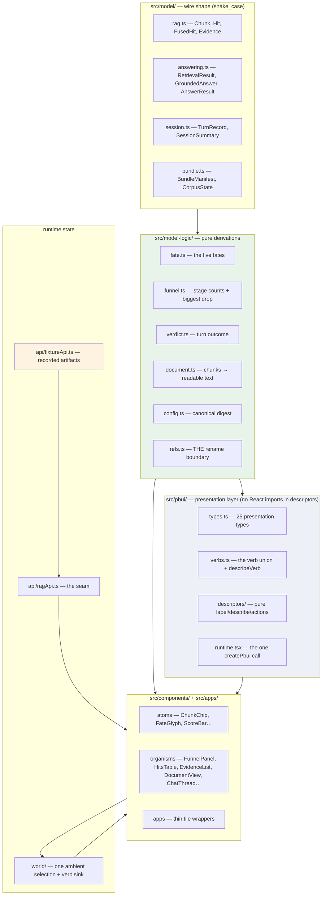

# PROJECT REPORT - raglab - A Presentation-Based Workbench Over a RAG Provenance Chain

This report explains the design and first implementation phase of **raglab**, a browser workbench over `rag-ttc` — a retrieval-augmented generation research lab whose corpus is The Tree Center's plant-nursery content. `rag-ttc` already records, for every answer it produces, the complete chain from source document through chunk, per-channel hit, fused hit, admitted evidence, citation, and grounding verdict. It has recorded 78 chat sessions and roughly 40 experiment runs this way. What it has never had is a way to *look* at that chain: the only interactive surface is a Bubble Tea terminal UI that shows one panel at a time.

The interesting work was not building panels. It was determining what changes when a UI is built on a system that already knows everything the UI wants to say, and then discovering — repeatedly, and only by driving a browser — that a component can be correct in every mechanically checkable way and still communicate nothing. Half of this report is architecture. The other half is five defects that passed typecheck, unit tests, code review, and the accessibility tree, and were caught by measuring rendered geometry, by comparing stories against each other, and once by a reviewer saying the screens looked the same.

> [!summary]
> - The UI's job is not to instrument anything. `rag-ttc` already persists complete per-answer provenance; the job is to make each link in that chain a first-class object with verbs, so "why did the model say that" becomes a click.
> - The central derived concept is **chunk fate** — what became of a chunk in one answer. Five values, computed by a four-pass function whose *ordering* is the whole algorithm. Get the order wrong and the one pathological state the product exists to expose disappears into the happy path.
> - The frontend was built **ahead of the backend**, behind a typed `RagApi` seam, against fixtures extracted verbatim from real recorded sessions. The TypeScript model types mirror the wire shape exactly — snake_case, nanosecond durations — so a fixture is a slice of a real artifact and both languages can assert against the same bytes.
> - Five defects reached a running Storybook. Four produced a working-looking screen with no error anywhere: bars of zero width, menu entries that claimed to be disabled and were clickable, a focus feature that focused nothing, and a tile that structurally could not display the state it was built for.
> - Shipped in nine commits: 87 files, 18 042 insertions, 67 tests, 48 stories, zero typecheck findings.

## What the terminal UI could not do

`rag-ttc`'s TUI has inspector tabs named Funnel, Hits, Evidence, Verdict, and Reach. Their existence is the argument for this project: someone already decided that the retrieval funnel and the fate of each hit are worth looking at, and built views for them. The limitation is structural rather than one of effort. A terminal cannot show a chat answer *and* the funnel *and* the source document at once, it cannot make a chunk identifier in one panel clickable into another, and it cannot support a compare workflow spatially.

Three facts from the survey of `rag-ttc` shaped everything that followed.

**The provenance is already complete.** `pkg/rag/answering/types.go` defines a `RetrievalResult` that keeps three inspection layers deliberately separate — `Channels` (what each retriever said in isolation), `Fused` (what weighted RRF made of their disagreement), and `Evidence` (what survived into candidacy). Collapsing them would be the obvious simplification and would destroy the ability to answer "did vector search find it and fusion bury it?", which is the single most useful question the tool can support.

**Grounding is enforced, and failures are typed.** `ValidateGroundedAnswer` rejects any answer citing a chunk that was not in the supplied evidence, and records a failure category of `parse`, `contract`, or `provider` rather than swallowing it. A rejected answer is not discarded — it is recorded with its text intact, which matters because a rejected answer is precisely the one a researcher wants to read.

**There is no HTTP surface of any kind.** Every capability is a Cobra command or an in-process call from the TUI, and the chat TUI is the only path to an answer for the TTC corpus. This turns "build a UI" into two projects, and it is why the sequencing described below is the right one rather than a compromise.

## The derivation: presentations, verbs, and one selection

The workbench is the fourth product in a family — after datalab, turboproof, and agentlogic — built on [[PROJ - PBUI - Presentation-Based UIs in TypeScript and React|pbui]], a TypeScript implementation of ideas from the Common Lisp Interface Manager. Five concepts carry the whole design.

A **presentation type** is a vocabulary of interface-level types, declared by the product, independent of the language's types. `{sessionId, turnId}` and `{bundleId, chunkId}` are both objects to TypeScript; to the interface one is a `rag.turn` with a turn's verbs and the other is a `rag.chunk` with a chunk's verbs. A **presentation** wraps a visual and makes it live: right-click opens an object menu, hover writes a documentation line, and during a cross-tile pick it pulses if it can satisfy the pending request. A **descriptor** is a pure, React-free function from a value to a label, a JSON description, and a list of actions. A **verb** is serialisable data — a discriminated union arm, never a closure. And an **accept** is a promise for a presentation the user clicks, which is how one tile asks another for an object.

raglab declares 25 presentation types. The list is worth reading, because it is the product:

| Group | Types |
|---|---|
| Corpus | `rag.document`, `rag.chunk`, `rag.representation`, `rag.bundle` |
| Conversation | `rag.session`, `rag.turn`, `rag.answer`, `rag.citation` |
| Retrieval | `rag.hit`, `rag.fusedHit`, `rag.evidence`, `rag.stage`, `rag.strategy`, `rag.config` |
| Measurement | `rag.query`, `rag.judgment`, `rag.run`, `rag.arm`, `rag.metric` |
| Knowledge | `rag.concept`, `rag.fact` |
| Family standard | `tile`, `workspace`, `traceEntry`, `watch.item` |

Two rules govern every value. **A presentation value is a handle, never a payload**: it must be JSON-serialisable, because it flows into the inspector, the watch list, the verb trace, and local storage. Chunk *text* never appears in one; a chunk id and its byte range do. **A value carries what its menu needs to decide**, resolved by the component that already knows it — `TurnRef.hasSibling` exists so the turn descriptor can grey "Compare with sibling" and give a reason without a store lookup, which is what keeps descriptors pure.

A third rule is specific to this domain. `rag-ttc` identifiers are **container-local**: a `TurnID` is unique only within its session, a `chunkId` only within its bundle. Every handle therefore carries its container id, and anything that addresses a turn globally uses a `turnUri()` of the form `session/{sid}/turn/{tid}`.

### Conversions are the navigational backbone

Four of raglab's types are a chunk seen from somewhere in the funnel, and one is a chunk seen from its document. Registering conversions between them means an accept that asks for a chunk is satisfiable by clicking a citation in the chat, a row in the hits table, an evidence card, or a fused-hit bar. The user never has to know which of those the code wanted.

```ts
// src/pbui/runtime.tsx
const conversions = [
  (reference) => {
    switch (reference.type) {
      case "rag.citation":
      case "rag.hit":
      case "rag.fusedHit":
      case "rag.evidence":
        return { type: "rag.chunk", value: { /* ...ids, fate, turn context */ } };
      default:
        return undefined;
    }
  },
  (reference) =>
    reference.type === "rag.chunk"
      ? { type: "rag.document", value: { bundleId, documentId, title: "" } }
      : undefined,
];
```

The direction is always toward the *more general* object. There is deliberately no `chunk → citation` conversion, because not every chunk was cited, and a conversion that can fail is a conversion that lies.

## Chunk fate: the concept the product is built around

`rag-ttc` records the funnel completely but never labels the outcome per chunk. The TUI computes an equivalent in `pkg/app/chatui/hits.go`, trapped under the app package. raglab's version is a pure function of one `AnswerResult`, which is what allows it to be unit-tested against a recorded turn with no DOM and no store.

Five fates, ordered by how far the chunk travelled:

| Fate | Glyph | Meaning |
|---|---|---|
| `retrieved` | R | a channel returned it, but it never became evidence |
| `omitted` | O | it was evidence, and the context policy cut it |
| `uncited` | E | it was in the prompt, and the model did not cite it |
| `cited` | C | it was in the prompt, and the model cited it |
| `cited-unsupplied` | ! | the model cited it and it was **never** in the prompt |

The last is pathological. `rag-ttc`'s contract validator rejects such an answer, so a correctly functioning pipeline never produces one — which is exactly why no recorded session on disk contains an example, and why the UI must still render it. A rejected answer is the one a researcher needs to look at.

### The ordering of the passes is the algorithm

```ts
export function fateMap(result: AnswerResult): Map<ChunkId, ChunkFate> {
  const fates = new Map<ChunkId, ChunkFate>();
  const admitted = new Set(result.context.evidence.map((e) => e.chunk.id));
  const cited = new Set(result.answer.citation_chunk_ids);

  // 1. Widest ring: anything any channel or the fusion mentioned.
  for (const fused of result.retrieval.fused) fates.set(fused.chunk_id, "retrieved");
  for (const hits of Object.values(result.retrieval.channels))
    for (const hit of hits) if (!fates.has(hit.chunk_id)) fates.set(hit.chunk_id, "retrieved");

  // 2. Omissions: explicit when recorded, inferred otherwise.
  const omitted = new Set(result.context.omitted_chunk_ids ?? []);
  if (omitted.size === 0)
    for (const ev of result.retrieval.evidence)
      if (!admitted.has(ev.chunk.id)) omitted.add(ev.chunk.id);
  for (const id of omitted) fates.set(id, "omitted");

  // 3. Admitted evidence resolves to cited or uncited.
  for (const id of admitted) fates.set(id, cited.has(id) ? "cited" : "uncited");

  // 4. Citations resolved against ADMITTED, not retrieval.
  for (const id of cited) if (!admitted.has(id)) fates.set(id, "cited-unsupplied");
}
```

Each pass narrows the previous one. Pass 4 is where the correctness lives: if citations are resolved against the *retrieval* evidence rather than the *admitted* evidence, then a citation of something the context policy cut comes out as `cited`, and the pathological state vanishes into the happy path. Nothing about that failure looks wrong. The test that pins it does not check pass 4 directly — it checks that fused-but-unadmitted chunks report `retrieved` and not `omitted`, which fails if pass 2's inference starts over-claiming.

Pass 2 deserves its own note. `context.omitted_chunk_ids` is **absent from every session recorded as of 2026-07-31**, so the inference fallback — difference the retrieval evidence against the admitted evidence — is the normal path today rather than a defensive branch. Code that reads like a legacy accommodation is in fact the only code that runs.

## The wire shape, and why the model types are snake_case

The design document, written before any recorded artifact had been opened, assumed the JSON would be camelCase because that is what a TypeScript model wants. Opening an actual `turns.jsonl` record corrected four assumptions at once:

```jsonc
{
  "session_id": "...", "turn_id": "turn-0001", "comparison_id": "cmp-0001",
  "request": {
    "query": { "id": "turn-0001", "text": "..." },      // an OBJECT, not a string
    "config": { "strategy": "rrf", "retrieve_k": 20, "evidence_k": 5,
                "rrf_weights": {"lexical": 1, "vector": 1} }
  },
  "result": {
    "retrieval": { "channels": {"bm25": [...20], "vector": [...20]},
                   "fused": [...32], "evidence": [...5],
                   "duration": 51287081 },              // NANOSECONDS
    "context":   { "evidence": [...5], "used_runes": 6000, "max_runes": 12000,
                   "policy": "whole-evidence-chunks-v1" },
    "answer":    { "answer": "...",                     // the field is `answer`
                   "citation_chunk_ids": ["chunk-..."], "abstained": false },
    "contract":  { "valid": true }
  }
}
```

The model types were rewritten to mirror this exactly. That is not a cosmetic decision. A fixture file is then a *verbatim slice of a recorded artifact*, diffable against its source and unmarshallable by a Go parity test with no translation table in between. The alternative — camelCase plus a decode layer — puts an invisible transformation between the file on disk and the thing on screen, and a bug in that layer looks exactly like a bug in the backend.

The codebase therefore has two naming conventions and one boundary between them. `src/model/` is the wire shape, snake_case, an exact mirror. `src/pbui/types.ts` holds presentation handles, camelCase, which are ours and never cross the wire. `src/model-logic/refs.ts` is the only module that renames a field. Any other module reaching across that line would make the boundary two places, and then five.

## Architecture



Four layering laws are enforced structurally rather than by convention: descriptors contain no React and import no components; `src/pbui/` never imports `src/components/`; the tile registry lives in `src/appkit/` and not `src/apps/`, because the tile frame imports `appFor` and a registry under `apps/` would force a forbidden `organisms → apps` edge; and `src/model-logic/` is pure functions over `src/model/` types, unit-testable with no DOM.

## The RagApi seam, and what a fixture may invent

The single most important structural decision of the phase. Components never fetch. They consume one interface with two implementations: `fixtureApi`, which resolves from recorded artifacts and is what Storybook and dev mode use, and eventually `httpApi`, a thin layer over `rag-ttc serve`. The interface is grouped by backend phase, which is also the order the backend will deliver it.

```ts
export interface RagApi {
  // phase 1 — read-only over recorded artifacts, no provider cost
  listBundles(): Promise<BundleSummary[]>;
  getChunk(bundleId: string, chunkId: ChunkId): Promise<Chunk>;
  getDocumentText(bundleId: string, documentId: DocumentId): Promise<DocumentText>;
  listSessions(): Promise<SessionSummary[]>;
  getTurn(sessionId: string, turnId: string): Promise<TurnDetail>;

  // phase 2 — live answering, budget-gated, streaming
  budgets(): Promise<BudgetState[]>;
  search(request: SearchRequest): Promise<RetrievalResult>;
  ask(request: AskRequest): AsyncIterable<TurnEvent>;
  replay(request: ReplayRequest): AsyncIterable<TurnEvent>;

  // phase 3 — writes and the provenance index
  addJudgment(judgment: NewJudgment): Promise<void>;
  findCitingTurns(chunkId: ChunkId): Promise<TurnRef[]>;
}
```

The contract with the Go engineer is three artifacts: this interface, the TypeScript types in `src/model/`, and the fixture JSON files. Because the model mirrors the wire shape, the backend can unmarshal the fixture bytes in a Go test. When either side changes a shape, the fixture changes, and the other side's test fails. Drift becomes a test failure rather than a meeting.

### The rule about invention

A fixture API is tempting to over-build. The version that generates plausible retrieval results for whatever query you type would make the search and chat tiles feel finished — and would be a lie the UI has no way to detect, because fabricated hits look exactly like real ones.

The rule settled on is: **the fixture API may invent timing, and never content.** Timing must be invented, because a recorded turn is a finished object and streaming is a real property of the live API. Content must not be, so `search()` returns a recorded retrieval re-labelled with the asked query and the code states plainly that this is honest only in stories where that is understood, and `ask()` always replays a recorded answer rather than composing one.

Event ordering is part of the contract, not a detail:

```
accepted → observation(lexical) → observation(vector) → observation(fusion)
        → observation(context) → retrieval → token* → done
```

The retrieval result lands *before* generation begins. That is the whole argument for the workbench — the funnel and hits tiles populate while the answer is still being written — and if the fixture stream does not honour the ordering, tiles will be built against an order the real server does not produce.

`NotImplementedYet` carries a capability name and a phase number, so a tile can render "this needs backend phase 3" as an explanatory empty state rather than a red failure. Unimplemented is not broken, and a UI that cannot tell the difference teaches its users to ignore errors.

## Fixtures from real recordings

`scripts/extract-fixtures.py` scans the recorded sessions and classifies each turn by the state it demonstrates, not by its position. Four of the five wanted states were present in the first 27 turns scanned:

- **grounded** — 32 chunks retrieved, 5 admitted, 2 cited.
- **abstained** — an eight-channel multi-query run (`bm25:q0 … vector:q3`) with three model-generated query variants, which declined to answer.
- **contract-fail** — a genuine parse failure: `decode grounded answer: decode JSON value: invalid character '`' looking for beginning of value`. The model wrapped its JSON in a markdown fence.
- **failed** — the provider died mid-generation.

The fifth, `cited-unsupplied`, does not occur. That is good news about the pipeline and a problem for the UI, resolved by synthesising it from a real grounded turn — adding one citation of a chunk that reached the fusion but never the prompt — and labelling it as synthesised everywhere it appears.

The eight-channel abstention turned out to be the most valuable fixture. It broke assumptions no invented fixture would have: channel names are open and compound, so any code compiled against a fixed `{lexical, vector}` list drops them silently; and the funnel's first stage must count *distinct* chunks rather than summing channel lengths, because 8 channels × 20 hits = 160 would make a multi-variant run appear to retrieve eight times as much purely by having more channels.

## Five defects, and what found each one

Four of these produced a working-looking screen with no error anywhere. None was found by typecheck, by the unit suite, or by reading the code.

### 1. Every funnel bar rendered at zero width

Measured in the running page rather than looked at:

```
[{label:"retrieved", count:"32", fillWidthPx:0},
 {label:"admitted",  count:"5 −27", fillWidthPx:0, biggestDrop:"true"}, …]
```

Every count, the biggest-drop marker, and the accessibility tree were correct. The bars were simply not there. The cause is a CSS default rather than a mistake in the rule: `[data-part="funnel-bar-fill"]` is a `<span>`, an inline box ignores `width` and `height` entirely, and `width: 84%` silently did nothing. The track escaped the same fate by accident — it is a grid item of the bar, and grid items are blockified — which is what made the bug confusing. One element in the pair obeyed its sizing and the other ignored it, with no visible difference between the two rules.

The fix is `display: block`. The diagnosis that matters is procedural: "a thin empty rectangle" and "a thin rectangle with a zero-width fill" are the same picture, so looking at the page could never have found it.

### 2. Menu entries that named a disabled reason were clickable

```
{label:"Find citing turns — needs the provenance ind…", disabled:false}
{label:"Mark relevant for query… (accept a query) — …", disabled:false}
```

pbui treats `disabled` and `disabledReason` as **independent fields**: the menu renders the reason as trailing text but sets the button's `disabled` attribute only from `disabled`. A descriptor setting only a reason produces an entry that *looks* correctly explained and still fires its verb. Nothing about the rendering is wrong; only `button.disabled` disagrees.

The fix moves the invariant into the action builder, where no descriptor can express the broken combination:

```ts
export function actions(ptype: string, specs: readonly ActionSpec[]): Action[] {
  return specs.map((spec, index) => ({
    id: `${ptype}:${index}:${spec.label}`,
    ...spec,
    disabled: spec.disabledReason !== undefined,
  }));
}
```

### 3. React was loading twice

```
TypeError: Cannot read properties of null (reading 'useState')
 ❯ react.development.js:1263  (from ../../pbui-0.2.0/node_modules/.pnpm/react@19.2.8/…)
 ❯ g ../../pbui-0.2.0/src/presentation/createPbui.tsx:113
```

pbui is installed as a `link:` dependency, because the available GitHub token lacks the `read:packages` scope and the package had to be built from a local git worktree. A linked package resolves its own peers from its own `node_modules`, so React was instantiated twice and hooks called from the second copy saw a null dispatcher.

The instructive part is *which harness saw it*. Vite's dependency pre-bundling collapses the duplicate, so the application worked in the browser and only the test suite could observe the problem — the exact inverse of defects 1 and 2, where the tests were green and only the browser could see it. Neither harness alone is sufficient.

### 4. A tile that structurally could not show the state it was built for

This one was found by a reviewer saying the EvidenceList and DocumentView stories "kind of seem to be all the same". Fingerprinting the rendered text turned an impression into a measurement:

```
grounded                  1383 chars  {uncited:3, cited:2}   cutLines: []
abstained-with-evidence   1383 chars  {uncited:5}            cutLines: []
with-unsupplied-citation  1383 chars  {uncited:3, cited:2}   cutLines: []   ← identical to grounded
```

The third case being byte-identical to the first is not a weak story. An unsupplied citation is *by definition* absent from the supplied evidence, so a tile that lists supplied evidence had no way to mention it — in exactly the tile whose claim is "this is what the model was given". The tile's claim is a specification, and an answer citing outside that set contradicts it, so the tile is obliged to say so. It now ends with a "cited but never supplied" section below a cut rule, in the danger tone.

### 5. A focus feature that focused nothing

Same investigation, `data-focused` count of zero. The story selected the *busiest* document and then passed a citation id from a *different* document, so no segment ever matched. The story silently demonstrated the absence of the feature it was named for. The general trap: a story that selects its subject independently of the thing it means to demonstrate will eventually demonstrate nothing.

### What the five have in common

Three were invisible because the failure was geometric or attributive rather than structural. One was invisible because it required comparing two states rather than examining one. One was invisible in the browser and visible only under test. The conclusion is not "test more" but something narrower:

- **Assert geometry, not presence.** `getBoundingClientRect()` and `getComputedStyle()` in a live page are a different class of evidence from a snapshot or a role query, and for anything positional they are the only evidence that counts. This is the acceptance rule the pbui family already learned — turboproof once shipped with the object menu rendering unpositioned at the end of the document, invisible, with every mechanical check passing.
- **Assert distinctness, not correctness.** A component that receives a distinguishing input and renders identical output is either missing a feature or has a story that proves nothing. Rendering *correctly* and rendering *distinguishably* are different properties, and only the second is comparative.

Both are now committed tests. `menu-geometry.test.tsx` pins that the menu is positioned at the pointer and that every entry naming a reason is inert. `story-distinctness.test.tsx` asserts that states differing in their inputs differ in their rendered text:

```ts
const seen = new Map<string, string>();
for (const [name, text] of rendered) {
  const duplicate = seen.get(text);
  expect(
    duplicate,
    `"${name}" renders identically to "${duplicate}" — the tile cannot show what distinguishes them`,
  ).toBeUndefined();
  seen.set(text, name);
}
```

## The document view, and reporting what is not shown

`rag-ttc` keeps documents **outside** the index bundle — `manifest.corpus_path` points elsewhere, and the corpus file may be absent or have changed since the index was built. `CorpusState` is therefore `matches | differs | absent`, and the last two are ordinary states rather than errors: the chunks and the index remain perfectly valid, only the document text is untrustworthy.

The document tile has two sources: real text when the API can resolve it, and the indexed chunks when it cannot. The second is implemented by `model-logic/document.ts`, which orders chunks by byte offset, records gaps between non-adjacent ones, and reports coverage as a fraction. On a real turn:

```
segments: [uncited, uncited, cited, uncited]        // ordinals 50, 68, 73, 91
gaps:     18256 bytes | 4204 bytes | 18256 bytes
header:   "4 chunks · 11% of the spanned bytes covered"
notice:   "…3 regions of the document are not covered by any chunk and cannot be shown."
```

The two identical 18 256-byte gaps initially looked like a duplicate-rendering bug and are real: the retrieved ordinals are 50, 68, 73, 91, so the eighteen-chunk gaps on either side of the middle pair are genuinely equal. A reconstruction that could be mistaken for the document would be worse than no document tile, which is why coverage and gap markers are rendered rather than merely computed.

Tinting the **whole** document rather than only the cited parts is the other deliberate choice. An untinted stretch means retrieval never surfaced that passage at all, which is a different and often more interesting failure than the model ignoring something it was given.

### Byte ranges cannot be applied to JavaScript strings

TTC's chunker emits a 120-rune overlap between neighbours, so concatenating chunk text repeats a sentence at every boundary. The obvious fix — slice off the overlapping bytes — is wrong: a string index is a UTF-16 code unit, and the corpus is full of multi-byte characters (typographic quotes throughout, degree signs in the hardiness tables). Slicing by byte count cuts mid-character and mangles the text.

The recorded byte overlap is used only as a *bound*, and the actual overlap is found by searching for the longest suffix of the previous segment that prefixes the current one:

```ts
export function overlapPrefixLength(previous, current, maxBytes) {
  const limit = Math.min(previous.length, current.length, maxBytes);
  for (let length = limit; length > 24; length -= 1) {   // 24: no coincidental trims
    if (previous.endsWith(current.slice(0, length))) return length;
  }
  return 0;
}
```

Two guards matter. The 24-character floor stops a coincidentally shared short phrase from causing a trim that eats real text, and the recorded byte overlap stops the search running away on repetitive content.

## The world store, and what a selection change must invalidate

Four organisms sharing props are correct but isolated. The ambient selection is what makes them a workbench, and it is borrowed from agentlogic's `WorldProvider` including its rule: *two tiles must never disagree about which turn is under inspection.* Selection lives in one place and tiles read it; a tile that wants to be pinned elsewhere takes a document binding instead, which is the family's existing escape hatch rather than a new mechanism.

The interesting part of a selection store is not assignment but invalidation:

```ts
case "focusTurn":
  return {
    ...state,
    selection: {
      ...state.selection,
      sessionId: action.sessionId,
      turnId: action.turnId,
      chunkId: undefined,      // ← the load-bearing lines
      documentId: undefined,
    },
  };
```

A chunk's fate is a property of the answer it appeared in. Carrying `chunkId` across a turn change would leave the document tile tinting one turn's chunks with another turn's fates — silently wrong in exactly the way this product exists to expose, and nothing about it looks broken. It would have shipped.

The verb sink is single by construction. Every verb arrives at one place whether it came from an object menu, a chrome button, or a keyboard shortcut, and verbs the current phase cannot execute are still **traced**, so the trace remains a record of what the user asked for rather than of what happened to be implemented.

## The workbench shell

The shell renders a split tree using pbui 0.2.0's `TileFrame` and `useTileDrag`. The frame draws the tone bar, the drag grip, the split and close buttons, and the labelled drop overlay; the hook owns the drag registry, the hit test, and the banded zone geometry. raglab supplies callbacks and a tree and transcribes nothing, which is what the family playbook exists to enforce.

The layout is plain TypeScript rather than the generated protobuf types, because there is no server to sync a `WorkbenchDocument` to. The field names match the proto and the mutation functions are named after the protocol's mutation cases — `placementSplit`, `placementClose`, `placementReplace`, `swapPlacements`, `dockPlacement`, `resizeSplit` — so the eventual swap is mechanical rather than a redesign.

Two rules in that module are pinned by tests. **The last leaf of a workspace can never be closed**, because an empty workspace is a state a user cannot click their way out of. And **`dockPlacement` removes the source before splitting the target**:

```ts
const without = placementClose(tree, from);
if (without === tree) return tree;   // removal refused (last leaf) → abandon the dock
// only now split the target and insert the moved view
```

The other order briefly duplicates the view, and when removal is refused it stays duplicated permanently.

Measured behaviour on the four-tile provenance layout:

```
split ⬌ on p-funnel        → 4 tiles → 5 tiles, new pane renders the launcher
close ✕ on the new tile    → 5 tiles → 4 tiles
hits row "Show in document"→ p-document gains data-focused="true" ×1
single-tile layout:
  button ✕  disabled: true
  menu      "Close tile — a workspace must keep at le…"  disabled: true
```

The last two lines are "two doors, same verbs" being true rather than intended: the chrome button and the object-menu entry agree about the rule *and* about the reason.

### A design caught before it shipped

`TileFrame` takes plain callbacks, and the first version routed them through a module-level mutable `frameSink`. That is wrong twice: it is a global singleton that breaks the moment two workbenches share a page, and — worse — it gives the chrome buttons an untraced path to state changes, so the trace would quietly stop being a complete record. Replaced with a `usePbui()` read inside the tile, which is the obvious answer once stated.

## Repository layout

```
rag-ttc/ui/
  .storybook/    main.ts, preview.tsx, decorators.tsx, withPbui.tsx
  scripts/       extract-fixtures.py
  src/
    model/       538 lines — wire shape, snake_case, exact mirror
    model-logic/ 1 032 lines — fate, funnel, verdict, document, config, refs
    pbui/        1 602 lines — types, verbs, descriptors, runtime
    components/  3 889 lines — atoms, molecules, organisms, pages
    api/           481 lines — ragApi, fixtureApi
    world/         383 lines — ambient selection + verb sink
    appkit/        157 lines — registry + parity fixture
    apps/          425 lines — thin tile wrappers
    fixtures/      126 lines + 4 recorded turn files
    styles/        601 lines — tokens, reset, app data-parts
```

The Storybook decorators are worth noting because they carry hard-won lessons from datalab. `withPbui` wraps every story in a real provider whose `onPerform` collects verbs into a **visible log**, and renders the real accept banner, object menu, and mouse-documentation line around the story — so right-clicking a chip in a story opens the real menu and the verb it fires appears below. That is not a stub standing in for the real thing; it is the actual seam, with the collector where the workbench's `perform` switch will be. `withTile` bounds every organism story in a clipping tile-shaped flex column, because a component that looks fine on an unbounded canvas and breaks inside a real tile does so because of exactly that constraint.

## Key points

- The UI adds no instrumentation. `rag-ttc` already persists the whole chain; the work is making each link an object with verbs, and the conversions between chunk-shaped types are what make every tile reachable from every other.
- Chunk fate is a four-pass function whose ordering carries the correctness. Resolving citations against admitted rather than retrieval evidence is the difference between exposing the pathological state and hiding it.
- Model types mirror the recorded wire shape exactly, so a fixture is a verbatim artifact slice and the same bytes can be asserted from both languages.
- A fixture API may invent timing and must not invent content. Fabricated retrieval results are a lie the UI cannot detect.
- Four of five defects produced a working-looking screen. Geometry assertions and cross-state distinctness assertions catch a class of failure that presence checks, role queries, and passing tests cannot.
- A tile's stated claim is a specification. "This is what the model was given" obliges the tile to report an answer that cites outside that set.
- Storybook and the browser found different bugs than vitest did, in both directions. The duplicate-React failure was invisible in the browser; the zero-width bars were invisible under test.

## Important project docs

Ticket `RAG-TTC-PBUI-UI-001` in `/home/manuel/workspaces/2026-06-30/benchmark-cpu-inference/rag-ttc/ttmp/2026/08/01/`:

- `analysis/01-pbui-architecture-and-example-app-patterns.md` — the pbui library and the three sibling products
- `analysis/02-rag-ttc-domain-concepts-and-api-gaps-for-an-interactive-ui.md` — domain objects, the provenance chain, and what the backend cannot yet serve
- `design-doc/01-tile-presentation-type-and-verb-catalog-for-the-rag-workbench.md` — the normative catalog: 25 types, the verb union, 20 tiles
- `design-doc/02-intern-guide-building-the-raglab-react-frontend-first-widgets-stories-objects-verbs.md` — the onboarding guide, including the `RagApi` seam and the Storybook conventions
- `reference/01-diary.md` — ten steps in the strict diary format, with every failure recorded verbatim

## Open questions

- The GitHub token lacks `read:packages`, so pbui is built from a local worktree and linked. This has now cost two distinct problems (no CI path, duplicate React) and needs either a scoped token or vendored tarballs.
- `configDigest` is computed UI-side with FNV-1a and prefixed `cfg-`. When `rag-ttc serve` computes the authoritative digest the two must not silently diverge — either the server returns its digest and the UI displays that, or both are pinned by a shared fixture.
- Should `rag-ttc serve` live in `rag-ttc/pkg/server` or in a separate repository importing it? The lab/app boundary test already governs the imports either way.
- `assembleDocument` reports coverage over the span from first to last chunk, not over the document, because the document length is not knowable from chunks alone. The number is therefore optimistic and the label should probably say so.
- `SearchPanel` caps visible channel columns at three, so the eight-channel case wraps. The cap is deliberate but silent.

## Near-term next steps

- Extract bundle-manifest, experiment-run, and evaluation-query fixtures; only turn fixtures exist so far.
- Wire the chat's `retrieval` and `observation` stream events into the world, so the provenance tiles populate live while an answer is still being written. They are currently received and dropped.
- Build the Mod+K launcher modal on pbui's `LauncherShell` and `routeWorkbenchKey`, both already available and unused.
- Backend phase 1: promote the funnel, fate, and answer-quality result types out of `cmd/` and `pkg/app/chatui/` into `pkg/`, add chunk-by-id lookup and representation loading to `indexbundle`, and add a headless `rag-ttc ask` as the forcing function for the serve API.
- Delete `pages/ProvenanceWalk` when the shell fully replaces it; it is scaffolding with an expiry date and says so in its own header.

## Project working rule

Build against real recorded artifacts, never invented ones — the pathological states are the point, and invented fixtures never contain them. Verify in a running browser by measuring geometry and comparing states, not by looking. When a tile makes a claim about what it shows, treat the claim as a specification and check that the tile can contradict itself out loud.

## Related notes

- [[PROJ - PBUI - Presentation-Based UIs in TypeScript and React]] — the library this workbench is built on
- [[PROJ - RAG-TTC Codebase Consolidation - Review-Then-Execute from 49k Lines to a Two-Track Repository]] — the lab/app split that makes the UI extractable
- [[PROJ - RAG-TTC Chunk Lab Results - From BM25 Screening to the Hybrid Retrieval Reversal]] — what the retrieval configurations in the config tile actually do
- [[PROJ - RAG-TTC LLM Judge - A Two-Step Decomposed Faithfulness Pipeline from Design to Live Run]] — the judged-answer machinery the measurement tiles will surface
- [[ARTICLE - Reproducibility Engineering - Digests, Caches, Budgets, and Provenance]] — the content-addressing discipline the config digest follows
- [[PROJECT REPORT - go-go-datadrop v0.3 - One Typed Table, and Four Defects Only a Browser Could Find]] — the same class of browser-only defects in a sibling project
