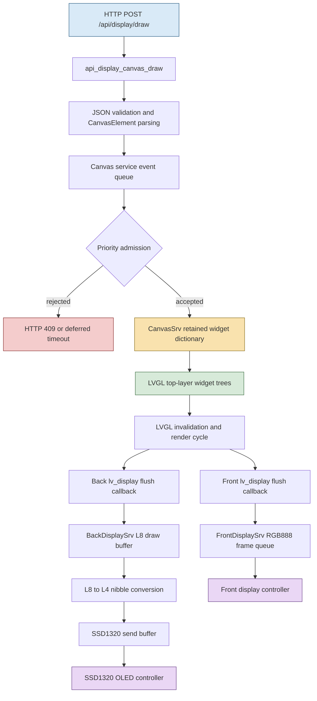
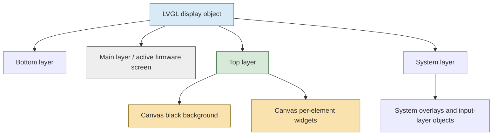
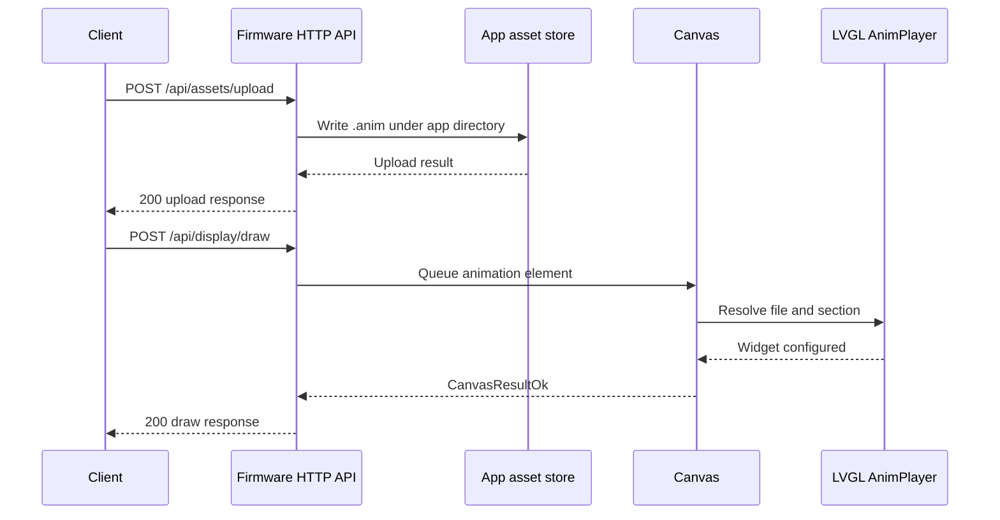

# BUSY Bar Firmware Graphics and UI Architecture

## Executive Summary

The BUSY Bar firmware exposes a JSON drawing API, but the implementation underneath is not a direct pixel-upload endpoint. The HTTP handler parses a request into typed `CanvasElement` records, sends those records to a dedicated Canvas service, and lets that service maintain a retained set of LVGL-backed widgets. The retained state is indexed by element ID and owned by one application ID at a time. A draw request therefore performs an element update, not a full-screen replacement. An element omitted from a later request remains present until the firmware removes it through an explicit clear, a timeout, or a `display_until` deadline.

The Canvas service is a priority-controlled overlay on the normal firmware GUI. It creates widgets in the LVGL top layer for both physical displays, maintains a black background while the Canvas is active, routes Canvas input to an exit handler, and closes the overlay when its retained widget set becomes empty. A new application can replace the active Canvas only when its priority is strictly greater than the current Canvas priority; the current application can update at the current priority. The loader's priority is also part of the admission decision, so an active blocking work session can prevent external drawing even at the maximum API priority.

The rendering path has four distinct representations:

1. JSON display elements arrive through `/api/display/draw`.
2. `CanvasElement` structures and `CanvasWidget` records hold retained UI state.
3. LVGL renders per-display widget trees into direct-mode draw buffers.
4. Front and back display services transfer those buffers to their physical controllers.

The front display uses RGB888 and a frame-sized last-frame buffer. The back display uses an 8-bit luminance buffer in the GUI layer, converts every pair of luminance pixels to one 4-bit SSD1320 byte, swaps host-side draw and send buffers, and transmits the selected buffer on the controller's tearing event. The SSD1320 controller itself has a native 160×160×4-bit GDDRAM model, while the device exposes a 160×80 back display. That geometry difference belongs to the hardware driver and initialization sequence, not to the Canvas element API.

The central engineering consequence is that the firmware offers a retained, single-owner, priority-arbitrated UI surface. Clients should use stable element IDs, explicitly clear application state during screen transitions, serialize competing draw operations, and treat `close` or process termination as distinct from display clearing. These rules explain the stale TEXT and clock behavior observed in JavaScript menu experiments.

## Scope, Evidence, and Method

This report analyzes the firmware revision `4033f805b75bb70e51bfb155fcf9cf7a29b2b054` from the local checkout `/home/manuel/code/others/busy-bar/busybar-firmware`, currently on the `dev` branch. The primary evidence is source code, OpenAPI schema, and integration tests from that checkout. The client repository `/home/manuel/code/wesen/2026-08-02--busy-bar-pi` supplies the Go and JavaScript clients used to exercise the device. External documentation is used to explain LVGL's general rendering contracts and the SSD1320 controller's electrical and memory model; firmware-specific claims are grounded in the local source.

The most important evidence is distributed across these boundaries:

| Boundary | Primary source | What it establishes |
| --- | --- | --- |
| HTTP input | `applications/services/web_server/http_api/api_display.c` | JSON parsing, validation, async Canvas submission, HTTP error mapping |
| API contract | `applications/services/web_server/openapi/assets.yaml` | request shape, element fields, priority range, asset endpoints |
| Retained UI state | `applications/services/canvas/canvas.c`, `canvas.h`, `canvas_i.h` | application ownership, element dictionary, priority checks, timeout lifecycle |
| Widget adaptation | `applications/services/canvas/canvas_widgets.c` | mapping from `CanvasElement` types to LVGL-backed widgets |
| LVGL integration | `applications/services/gui/gui.c` | display objects, buffers, flush callbacks, GUI layers, timer integration |
| Physical front output | `applications/services/front_display/front_display.c` | RGB888 frame size, message queue, last-frame and transmit state |
| Physical back output | `applications/services/back_display/back_display.c` | double buffering, L8-to-L4 conversion, tearing-event transmission |
| Asset playback | `lib/anim_file/anim_file.c`, `anim_file.h` | compiled animation file format and section/player behavior |
| Contract tests | `tests/integration/frontend/display/test_api_display_draw.py`, `test_api_display_priority.py` | validation, lifecycle, priority, screenshot-level behavior |

The source snapshots and downloaded external documents are stored in the ticket's `sources/` directory. The Obsidian article includes a Markdown copy of the same source material in a neighboring source subdirectory so that the article remains readable without requiring access to the firmware checkout.

## The Device Constraints

The firmware drives two physical displays with different geometry and pixel representations. The front display is a small 72×16 RGB888 panel. A complete front frame therefore contains:

```text
72 × 16 × 3 bytes = 3,456 bytes
```

The back display is 160×80 in the GUI model. LVGL renders it as an 8-bit luminance buffer, so the GUI-side frame is:

```text
160 × 80 × 1 byte = 12,800 bytes
```

The back display service converts this buffer to the SSD1320's 4-bit-per-pixel wire format. Two adjacent 8-bit luminance samples become one byte containing two 4-bit values. The physical transfer buffer is therefore:

```text
160 × 80 × 4 bits = 6,400 bytes
```

The display controller's datasheet describes the SSD1320 as a 160×160 controller with 160×160×4-bit GDDRAM and 16 grayscale levels. The physical module used by BUSY Bar exposes an 80-row active region. Firmware must select and map the active window using controller initialization and address configuration. The application-level Canvas does not expose those controller coordinates; it sees a 160×80 display through the GUI service.

This division is important. The Canvas service describes widgets in logical display coordinates. The GUI service owns pixel format and buffer construction. The hardware display services own controller commands, transfer synchronization, brightness, sleep, and power behavior. A change to the Canvas element schema should not require a change to the JSON client when the physical packing changes, and a change to the SSD1320 transfer code should not change the Canvas application's coordinate system.

## System Architecture

The complete path from a remote draw request to emitted display bytes is:



The input path is asynchronous at the HTTP boundary but serialized at the Canvas service boundary. The HTTP request does not directly mutate LVGL objects. It allocates a request context, queues an event, and arranges for the event-loop callback to wake the HTTP connection after the Canvas operation completes. This prevents a network callback from holding the GUI state while parsing or rendering.

The render path is also asynchronous. LVGL renders into display-specific buffers and calls a flush callback. The flush callback submits the buffer to a physical display service. The front and back services do not share transfer state because their controllers have different timing and pixel-format requirements.

## The HTTP Drawing API

The `/api/display/draw` endpoint is implemented as a custom handler rather than a generic JSON-to-struct decoder. `api_display_canvas_draw()` extracts `application_name`, `priority`, `led_notification_color`, and `elements` from the body. It validates the priority range, iterates the JSON array, creates a `CanvasElement` for each item, and submits a cloned element array to `canvas_show_elements_async()`.

A minimal request is:

```json
{
  "application_name": "menu",
  "priority": 100,
  "elements": [
    {
      "id": "title",
      "type": "text",
      "text": "MENU",
      "font": "small",
      "color": "#00FF00FF",
      "display": "front",
      "align": "center",
      "x": 36,
      "y": 8
    }
  ]
}
```

The parser applies common fields before dispatching to a type-specific parser:

```c
canvas_element->id = mg_json_get_str(element, "$.id");
canvas_element->timeout = mg_json_get_long(element, "$.timeout", -1);
canvas_element->x = mg_json_get_long(element, "$.x", 0);
canvas_element->y = mg_json_get_long(element, "$.y", 0);
canvas_element->display = GuiDisplayIdFront;
```

The actual source also enforces mutual exclusion between `timeout` and `display_until`, validates alignment names, and restricts `display` to `front` or `back`. Type-specific parsers then validate the fields required to construct an image, animation player, text label, countdown, or rectangle.

### Element types

| JSON type | Firmware widget | Required or significant fields | Runtime behavior |
| --- | --- | --- | --- |
| `text` | `Label` | `text`, `font` | Font path and color are resolved before the label is updated. Optional width enables scrolling behavior. |
| `image` | `Image` | `path` or `stock_path` | The image is decoded and checked against the target display dimensions before it is accepted. |
| `animation` | `AnimPlayer` | `path` or `stock_path` | The player loads a section from a compiled `.anim` file and applies loop, finish-current, and opacity flags. |
| `countdown` | `Countdown` | `timestamp`, `direction`, `show_hours` | The widget computes display text from the current RTC timestamp. |
| `rectangle` | `RectangleWidget` | positive `width`, `height` | The widget supports no fill, solid fill, horizontal gradient, vertical gradient, radius, and border. |

The OpenAPI schema describes these fields, but the C parser is authoritative for runtime behavior. The integration tests explicitly capture cases where the schema and parser differ. For example, the test helper always supplies `font` for text because the firmware parser requires it even when an OpenAPI default suggests otherwise.

### Asset resolution

Uploaded assets are resolved below an application-specific path:

```text
/ext/user_assets/<application_name>/<path>
```

Stock assets are resolved from shared image or animation directories. The parser intentionally strips the prefix before the final slash and selects the shared directory based on element type. This supports requests such as:

```json
{
  "id": "check",
  "type": "image",
  "stock_path": "shared/checkmark_front_8x8.image"
}
```

The path handling is security-sensitive. Uploaded paths are passed through `mg_path_is_sane()`, and the application name is used as a directory component. A client should not treat `path` as an arbitrary filesystem path.

### Response completion

The HTTP handler returns success only after the Canvas service callback reports `CanvasResultOk`. It maps the internal result enum to HTTP status codes:

| Canvas result | HTTP status | Meaning |
| --- | --- | --- |
| `CanvasResultOk` | 200 | Elements were accepted and updated. |
| `CanvasResultBadParameters` | 400 | The request could not be represented as valid Canvas elements. |
| `CanvasResultLowPriority` | 409 | Priority admission failed or a deferred draw expired. |
| `CanvasResultEmptyScreen` | 400 | No element with a live display interval could open the Canvas. |
| `CanvasResultTooManyElements` | 400 | The request exceeded the 100-element limit. |

A 200 response means the retained widget state was updated. It does not mean that a remote client has received a screenshot or that a physical display transfer has completed. The LVGL render and hardware transfer stages occur after the Canvas update.

## The Retained Canvas Data Model

The Canvas service is the central state machine for remote graphics. Its `CanvasSrv` structure contains the event loop, event queue, GUI handle, per-display background and root widgets, a dictionary of retained widgets, the active application ID, the Canvas priority, deferred draw state, and a low-power lock.

```c
struct CanvasSrv {
    FuriEventLoop* event_loop;
    FuriMessageQueue* event_queue;
    Gui* gui;
    Widget* background[GuiDisplayIdMax];
    Widget* display[GuiDisplayIdMax];
    CanvasWidgetsDict_t widgets;
    char* app_id;
    size_t priority;
    struct {
        bool pending;
        char* app_id;
        size_t priority;
        CanvasElementsArray_t elements;
        CanvasDrawCallback callback;
        void* callback_ctx;
    } deferred;
    FuriEventLoopTimer* deferred_timer;
    LowPower* low_power;
};
```

The retained dictionary is keyed by `CanvasElement.id`. On every accepted draw, `canvas_update_all()` walks the request array and calls `canvas_element_update()` for each element. If the ID already exists, the firmware copies the existing `CanvasWidget` state and updates its underlying LVGL widget. If the ID is new, it allocates the corresponding widget. The update requires the existing type and display to match; changing an element from text to image while reusing the same ID returns `CanvasResultBadParameters`.

The update algorithm is deliberately incremental:

```text
for element in request.elements:
    old = widgets[element.id]

    if old exists and (old.type != element.type or old.display != element.display):
        reject request as bad parameters

    if element has expired:
        delete old widget if present
        remove id
        continue

    if old does not exist:
        allocate widget matching element.type

    update widget properties
    configure timeout timer if required
    widgets[element.id] = widget

if widgets is empty:
    close Canvas screen
```

This algorithm does not iterate over the existing dictionary to delete IDs absent from the request. A request with three elements followed by a request with one element leaves the other two elements in place. This is the primary reason a client must use stable IDs or explicit clearing when implementing screen replacement.

### Time-based removal

The parser accepts either a relative `timeout` or an absolute `display_until` timestamp. The two fields are mutually exclusive when both are positive. The Canvas service converts the selected value into an event-loop timer. When the timer fires, it deletes the widget by ID, removes the dictionary entry, updates the back-display mirror state, and closes the Canvas if no widgets remain.

The timeout is attached to the retained widget, not to the network request. A finite display therefore survives the HTTP connection and continues to be managed by the firmware event loop.

### Canvas open and close

When the first accepted draw arrives and the Canvas has no GUI handle, `canvas_screen_open()` acquires the GUI record, registers an input callback on the system input layer, creates a full-size black background widget and a display root for each physical display in the LVGL top layer, creates a back-display mirror card, and acquires a low-power lock.

When the last retained widget is removed, `canvas_screen_close()` removes the input callback, frees the mirror card and per-display roots, closes the GUI record, resets the priority, and releases the low-power lock. Closing the Canvas removes the overlay. It does not terminate the underlying firmware application that owns the normal screen.

The Canvas input callback consumes all input events while active. A short Back, Busy, Custom, Off, Apps, or Settings event queues a Canvas exit event. That exit clears the Canvas and releases the GUI overlay. Remote clients should therefore treat physical mode changes as an independent source of screen removal.

## Priority Arbitration

Priority admission combines two independent values: the loader priority of the currently running firmware application and the Canvas priority of the active remote application.

The implementation calculates:

```c
loader_prio = loader_get_priority(canvas->loader);
current_priority = max(loader_prio, canvas->priority);
same_app = canvas->gui != NULL &&
           canvas->app_id != NULL &&
           strcmp(app_id, canvas->app_id) == 0;

if (canvas->gui == NULL || same_app)
    reject when priority < current_priority;
else
    reject when priority <= current_priority;
```

This gives the active Canvas owner an update path at its existing priority, while requiring a strict increase when a different application tries to replace it. It also prevents a remote draw from bypassing a higher-priority firmware mode.

The difference between same-application and different-application admission matters:

| Current state | Incoming app | Required priority |
| --- | --- | --- |
| No Canvas, loader priority 10 | Any app | Greater than 10 |
| Canvas app `A`, priority 50 | App `A` | At least 50 |
| Canvas app `A`, priority 50 | App `B` | Greater than 50 |
| Active blocking loader priority 101 | Any remote app | No valid API priority succeeds because API maximum is 100 |

The OpenAPI text and integration tests have not always described the same boundary behavior. The current C implementation and priority integration tests are the authoritative evidence: different applications require strictly greater priority. A client should not rely on equal-priority takeover between different application names.

### Deferred draws

If an asynchronous draw is rejected because the current loader priority is temporarily too high, the Canvas service can store one deferred request and start a 1.5-second timer. A loader priority change queues a reevaluation event. If the request becomes admissible, the service executes it; if not, the callback receives `CanvasResultLowPriority` at timeout. A newer deferred request completes and replaces an older deferred request.

This deferred path is not a general transaction queue. It stores one pending request, does not merge element arrays, and does not preserve a sequence of screen transitions. Clients that need ordering must serialize their own operations.

## LVGL Widget Integration

The firmware uses LVGL as the rendering and widget framework. `gui.c` creates one `lv_display_t` object for the front display and one for the back display. Each display receives a resolution, a color format, a draw buffer, a flush callback, and a theme. GUI layers are created separately for each physical display.

The Canvas service creates its roots in `GuiLayerIdTop`. The normal application screen is in the main layer. The top-layer roots are therefore above normal firmware screens while the Canvas is active. The top layer is per physical display in LVGL; the firmware creates one Canvas background and one Canvas root for each display.

`canvas_widgets.c` adapts each retained element to a concrete widget:

```c
static const struct {
    Widget* (*update)(CanvasWidget*, Widget*, const CanvasElement*);
    void (*delete)(CanvasWidget*);
} canvas_widgets[] = {
    [CanvasElementTypeImage] = {canvas_image_update, canvas_image_delete},
    [CanvasElementTypeAnimPlayer] = {canvas_anim_player_update, canvas_anim_player_delete},
    [CanvasElementTypeText] = {canvas_text_update, canvas_text_delete},
    [CanvasElementTypeCountdown] = {canvas_countdown_update, canvas_countdown_delete},
    [CanvasElementTypeRectangle] = {canvas_rectangle_update, canvas_rectangle_delete},
};
```

The adapter updates properties, then applies a coordinate transform. LVGL positions objects relative to an alignment anchor. The firmware's `canvas_widget_reanchor()` subtracts the selected anchor coordinate from the requested `x` and `y`, which lets the API interpret coordinates relative to the display's top-left coordinate system even when the element is centered or right-aligned.

For example, an API element with `align: "center", x: 36, y: 8` becomes an LVGL object aligned at the center anchor with a position offset that preserves the logical coordinate `(36, 8)`. This logic is shared by every element type, so alignment behavior remains consistent between text, images, rectangles, countdowns, and animations.

### Text

Text elements map to LVGL label widgets. The parser maps a public font name to a firmware font path. The supported names are `tiny`, `small`, `normal`, `condensed`, `bold`, `large`, `extra_large`, and `global`. The widget adapter sets text, font, color, width, and long-content behavior. A nonzero scroll rate enables circular label scrolling and configures start and repeat delays; zero scroll rate uses clipped content.

### Images

Image elements map to LVGL image widgets. The firmware asks the LVGL image decoder for the file header before accepting the element, then compares the decoded width and height with `gui_display_get_parameters(display)`. This validation happens before the element reaches the retained Canvas state. A valid path can still fail if the image exceeds the target display dimensions or cannot be decoded.

### Animations

Animation elements map to `AnimPlayer`. The player receives a resolved file path, section name, playback flags, and opacity. `loop` sets `AnimFilePlayFlagLoop`; `await_previous_end` sets `AnimFilePlayFlagFinishCurrent`. The player is a widget with its own update and delete lifecycle, not a special HTTP streaming path.

### Rectangles

Rectangle elements use a custom widget supporting `none`, `solid`, `gradient_h`, and `gradient_v` fill modes. Solid fills require at most one color. Gradients require two colors. Borders have independent width, radius, and color. A full-display solid rectangle is the most direct way for a client to express an opaque screen background at the element level.

### Countdowns

Countdown elements are converted from string timestamps because JavaScript numeric precision and JSON number parsing are insufficient for every timestamp representation the firmware wants to preserve. The parser converts the string with `atoll()`, maps direction and hour-display enums, and the widget calls `countdown_begin()` during update.

## LVGL Display Objects and Layers

LVGL's display contract matches the firmware structure closely. Each physical display has its own `lv_display_t`, widget tree, active screen, top layer, system layer, draw buffer, and flush callback. The LVGL documentation states that display-sized buffers are required for direct rendering and that a flush callback signals completion with `lv_display_flush_ready()`.

The firmware creates the displays as follows in `gui.c`:

```c
lv_display_t* display = lv_display_create(width, height);
lv_display_set_user_data(display, display_record);
lv_display_set_flush_cb(display, flush_callback);
lv_display_set_color_format(display, color_format);
lv_display_set_buffers(
    display,
    display_record->draw_buffer,
    NULL,
    buffer_size,
    LV_DISPLAY_RENDER_MODE_DIRECT);
```

The actual source uses one allocated draw buffer per LVGL display and direct render mode. Direct mode means the buffer is screen-sized and LVGL renders changes into their final location. The firmware then flushes that buffer through the display service. This is different from partial mode, where a smaller scratch buffer represents only the invalidated area and the flush callback must copy that area to the physical controller.

LVGL provides four permanent screen/layer roots per display: bottom, active screen, top, and system. The BUSY Bar GUI uses a main layer for normal content and a top layer for Canvas widgets. The Canvas additionally creates a black background widget in the top layer. The layer arrangement is therefore:



The black Canvas background is created when the Canvas opens and is full-sized according to the main layer root dimensions. It is not an application element and therefore is not represented in the HTTP payload. The explicit rectangle pattern used by the JavaScript menu is still useful because it makes screen opacity part of the application state and protects against element-level transparency, partial screen regions, and transitions that clear the Canvas.

## Render Buffers and Physical Output

### LVGL to front display

The front GUI display uses `FRONT_COLOR_FORMAT`, which is RGB888 in the firmware configuration. Its buffer size is derived from the 72×16 dimensions and three bytes per pixel. The LVGL flush callback passes the buffer to `front_display_draw()` and calls `lv_display_flush_ready()` immediately because the front display service copies the buffer into its own last-frame storage before transmitting.

The front display service has an event queue with draw, draw-end, brightness, blanking, sleep, power, and battery messages. For a draw message it copies the entire RGB888 frame into `last_frame`. If no transfer is in progress, it sends the frame through the display driver. If a transfer is already active, it marks `need_update` so the next draw-end event schedules another transfer.

The front service therefore has two distinct buffer ownership points:

1. LVGL owns and reuses its GUI draw buffer after the flush callback returns.
2. `FrontDisplaySrv` owns `last_frame` while the physical transfer is in progress.

This copy is what permits the LVGL callback to complete without keeping the LVGL buffer locked until the physical panel transfer ends.

### LVGL to back display

The back GUI display uses an 8-bit luminance color format. Its flush callback calls `back_display_draw()`. The back service contains two physical-transfer buffers, `send_buffer` and `draw_buffer`, protected by a mutex.

The process is:

```text
LVGL renders an L8 frame into the GUI buffer
        |
        v
back_display_draw copies L8 samples into draw_buffer
        |
        v
Draw event swaps draw_buffer and send_buffer
        |
        v
Tearing event checks dirty state
        |
        v
ssd1320_draw(send_buffer)
```

The conversion function packs two L8 values into one L4 byte:

```c
static void buffer_l8_to_l4(uint8_t* dst_l4, const uint8_t* src_l8) {
    for(uint32_t i = 0; i < SSD1320_BUF_SIZE; ++i) {
        const uint32_t draw_idx = 2 * i;
        dst_l4[i] = (src_l8[draw_idx] >> 4) | (src_l8[draw_idx + 1] & 0xF0);
    }
}
```

The low nibble comes from the high four bits of the first L8 pixel. The high nibble comes from the high four bits of the second L8 pixel. This produces two grayscale pixels per controller byte. The display service then swaps buffers on the draw event and waits for the SSD1320 tearing signal before transmitting the pending buffer.

This is host-side double buffering. The SSD1320 has controller-side GDDRAM, but it does not provide a second independently selectable complete frame buffer. The firmware avoids changing the buffer being sent by copying into one host buffer while the other is selected for transmission. The tearing event determines when the selected buffer is written to the controller.

### Controller geometry

The SSD1320 datasheet defines native 160×160 GDDRAM with four bits per pixel. BUSY Bar's 160×80 physical display uses only part of the controller address space. The driver must configure the row window and remapping according to the panel wiring. The application never sees the unused rows because `back_display_get_width()` and `back_display_get_height()` expose the logical 160×80 dimensions to GUI and Canvas code.

The controller datasheet also defines an FR synchronization signal for timing writes relative to display refresh. The firmware's back display service uses a tearing GPIO event and only submits the dirty send buffer on that event. This makes the host-side buffer swap and controller refresh boundary explicit.

## Animation Files and Playback

Animations are not sent as a sequence of JSON frames. The client uploads a compiled `.anim` asset into the application asset directory, then sends an animation element referencing the uploaded basename. The Canvas parser resolves the path and configures `AnimPlayer`; the player reads the compiled asset and renders the selected section over time.

The compiled file format begins with a `bicycle0` signature and stores metadata, section records, and packed frame data. The animation library supports named sections because the Canvas API exposes a `section` field. Playback flags determine whether the player loops and whether it waits for the previous animation to finish.

The upload-and-draw sequence is not atomic:



If upload succeeds and the later draw fails because of priority, the asset remains. A client that retries must account for this persistent asset state. `clear` removes Canvas elements; deleting application assets is a separate `/api/assets/upload` DELETE operation.

## Input, GUI Ownership, and Lifecycle

Canvas input is handled by the firmware GUI service, not by the HTTP display handler. When Canvas opens, it registers an input callback on the system layer and consumes every input event. A short physical mode or navigation event queues a Canvas exit event. The Canvas event loop then clears its retained widgets and closes the top-layer GUI.

This behavior creates two independent lifecycle paths:

| Lifecycle event | Canvas consequence | Underlying application consequence |
| --- | --- | --- |
| HTTP `DELETE` with matching app ID | Clears that application's retained widgets; closes Canvas if empty | Normal firmware UI becomes visible when Canvas closes |
| Physical Back/Busy/Custom/Off/Apps/Settings | Queues Canvas exit and clears Canvas | Loader or mode transition may change the underlying application |
| Loader priority increase | Canvas may be cleared during priority reevaluation | Higher-priority firmware mode owns the display |
| Client process exit | No automatic HTTP clear is guaranteed | Existing Canvas elements can remain until timeout or another actor clears them |
| Input WebSocket disconnect | A client-side stream ends; Canvas state is unaffected | Display widgets remain until explicitly cleared or expired |

The last row is especially important for remote clients. A JavaScript runtime closing its WebSocket or a CLI process receiving SIGTERM does not, by itself, imply a display clear. A client should explicitly call `clear` during a controlled shutdown, and should use element timeouts for displays that must expire even if the client disappears.

## Why the Menu Glitch Occurred

The observed menu behavior had two independent mechanisms.

First, the Canvas is retained. A menu screen that draws `menu-title` and `menu-selection` after a previous screen that drew `menu-text-result` does not remove `menu-text-result` unless the application clears it, reuses the same ID with a compatible type, or allows it to expire. The draw endpoint is not a scene transaction with implicit deletion of omitted IDs.

Second, HTTP draw and clear operations are asynchronous. A JavaScript input callback can start `clear()` and `draw()` without awaiting them. If the TEXT activation draw is still queued or completing when BACK starts its clear, the device event queue can process the older draw after the clear. The resulting visible state contains the old TEXT element and the newly drawn menu.

A safe client-side transition is:

```js
let renderQueue = Promise.resolve();

function enqueue(operation) {
  renderQueue = renderQueue.then(operation, operation);
  renderQueue.catch(error => console.error("render failed", String(error)));
  return renderQueue;
}

function returnToMenu(app) {
  return enqueue(async () => {
    await app.clear();
    await drawMenu(app);
  });
}
```

The queue must contain the complete state transition, not only the final menu draw. Activation, encoder redraw, and BACK must all use the same queue. Otherwise activation can remain concurrent with BACK even if menu redraws are serialized.

An opaque rectangle is a separate concern. It prevents lower-priority or transparent content from contributing visible pixels within the menu's logical display area. It does not delete retained widgets and does not alter application ownership. It should be used together with explicit clear and operation ordering, not as a replacement for either.

## Failure Modes and Diagnostic Rules

### HTTP 400

HTTP 400 means the request could not be converted to valid Canvas state. Investigate:

- missing `application_name`;
- missing or empty `elements`;
- element without `id` or `type`;
- unknown type;
- invalid font, display, alignment, fill, direction, or hour mode;
- image decode failure;
- image larger than the target display;
- conflicting timeout and `display_until`;
- more than 100 elements;
- invalid asset path.

A 400 is not a priority problem. The server rejected the request before or during element construction.

### HTTP 409

HTTP 409 means the request was valid but was not admitted by priority rules. Check both the remote application's priority and the loader state. A priority of 100 does not override an active loader state at 101. Equal priority does not replace a different active Canvas application in the current implementation.

### Stale elements

If old content remains after a new draw, inspect element IDs and the clear path. The diagnostic questions are:

1. Was the old ID present in the new request?
2. Was `clear` sent with the correct application name?
3. Did the client await the clear response before drawing?
4. Could another asynchronous draw have been queued earlier?
5. Did the element have a timeout or `display_until` that is still active?

The firmware does not expose a complete retained element listing through the HTTP API, so source-level ID tracking and screenshot capture are useful during debugging.

### Clock or underlying app visibility

The Canvas top layer is active only while the Canvas owns at least one widget. When the Canvas closes, the underlying GUI becomes visible. A client should not interpret the clock's return after clear as a failed deactivation. It is the expected result of removing the overlay.

If content is visible around an active Canvas screen, inspect the element's opacity, geometry, display selection, and the Canvas background state. A full-display solid rectangle provides an explicit application-owned cover for the target display.

### Tearing and partial frames

The back display service uses a draw buffer, a send buffer, a dirty flag, and a tearing event. If a frame appears partially updated, inspect the buffer swap and tearing callback sequence before changing Canvas logic. A Canvas update can complete before the physical transfer completes. The HTTP 200 response is not a physical-vsync acknowledgement.

## Reimplementation Sketch

A small client or alternative firmware service should preserve the same semantic boundaries. The following pseudocode expresses the important parts without depending on the firmware's C containers:

```text
handle_draw(request):
    parsed = parse_and_validate(request)
    queue_event(CanvasUpdate(parsed))
    wait for CanvasResult
    return result_to_http(result)

canvas_event_loop:
    event = dequeue()

    if event is CanvasUpdate:
        if rejected_by_loader_or_canvas_priority(event):
            defer_or_complete_low_priority(event)
        else:
            if active_app != null and active_app != event.app_id:
                destroy_all_widgets()
                widgets.clear()
                active_app = event.app_id

            if active_app == null:
                active_app = event.app_id

            canvas_priority = event.priority
            for element in event.elements:
                upsert_or_remove_by_id(element)

            if widgets.empty:
                close_canvas_overlay()
            complete(event, Ok)

    if event is CanvasClear:
        if event.app_id == null or event.app_id == active_app:
            destroy_all_widgets()
            widgets.clear()
            close_canvas_overlay()
        complete(event, Ok)

render_loop:
    for display in [front, back]:
        lvgl_refresh(display)
        flush(display)
```

A modern Go client should treat the device API as a retained resource service rather than a stateless frame endpoint:

```go
type Screen struct {
    AppID    string
    Priority int
    Elements map[string]Element
}

func (s *Screen) Replace(ctx context.Context, elements []Element) error {
    if err := s.clear(ctx); err != nil {
        return err
    }
    return s.draw(ctx, elements)
}
```

The `Replace` operation is necessarily a client-side sequence unless the firmware adds an atomic clear-and-draw endpoint. It should be serialized with a mutex, channel, or promise chain when multiple input events can trigger it.

A JavaScript menu needs the same rule:

```js
const opaqueBackground = {
  id: "screen-background",
  type: "rectangle",
  display: "front",
  x: 0,
  y: 0,
  width: 72,
  height: 16,
  fill: "solid",
  fill_colors: ["#000000FF"],
  border_width: 0,
};

async function replaceScreen(app, elements) {
  await app.clear();
  await app.draw({ elements: [opaqueBackground, ...elements] });
}
```

The `busybar` repository's `examples/busybar-js/11-menu.js` applies this pattern and additionally serializes the full render operations through a Promise queue.

## Design Decisions and Alternatives

### Retained widgets versus frame submission

| Approach | Firmware state | Client burden | Suitable behavior |
| --- | --- | --- | --- |
| Retained widgets | Firmware stores IDs, timers, widgets, and ownership | Client describes updates and clears | Text, menus, countdowns, persistent overlays |
| Full-frame submission | Client sends every pixel | Client owns composition and timing | Video, screenshots, custom raster effects |
| Hybrid retained plus animation asset | Firmware stores widgets; player streams compiled frames | Client uploads assets and controls playback | Animations with low network traffic |

The firmware chose retained widgets because text, countdowns, assets, and animations need device-side timing and rendering. The cost is that screen replacement is not implicit. An API consumer must understand update and deletion semantics.

### One active Canvas owner versus multiple application layers

The single-owner model makes priority and teardown tractable. It prevents two remote applications from independently modifying the same LVGL top layer. It also means equal-priority independent applications cannot coexist as separate surfaces. A multi-layer model would allow simultaneous applications but would require per-layer compositing order, lifecycle, resource ownership, and input routing.

### Direct LVGL mode versus partial mode

The firmware uses direct mode with display-sized buffers. This simplifies widget redraw because LVGL writes into the final logical buffer location, and the flush callback can submit the complete buffer to the display service. Partial mode would reduce RAM usage but would require the front and back services to interpret area rectangles and merge partial regions into controller state. The current front and back display services are designed around complete logical frames.

### HTTP acknowledgment versus physical transfer acknowledgment

The API acknowledges Canvas state acceptance, not panel refresh completion. Waiting for a physical transfer in the HTTP request would tie network latency to display controller timing and complicate asynchronous LVGL ownership. The current boundary is appropriate for ordinary UI operations, but clients that need visual confirmation must use the streaming screenshot endpoint and compare frames.

## Testing Strategy

The firmware integration tests provide three useful levels of evidence.

### Parser and schema tests

`test_api_display_draw.py` exercises missing fields, array validation, ID and type validation, alignment, display selection, timeout rules, image and animation paths, and brightness endpoints. These tests define the request-level contract. They should run whenever the OpenAPI schema or parser changes.

### Priority and lifecycle tests

`test_api_display_priority.py` exercises the priority range, stopped and active work-session states, equal-priority behavior, clear and redraw sequences, application eviction, and screenshot-level state. It captures the distinction between loader priority and Canvas priority. These tests are required before changing priority comparisons.

### Client integration tests

The Go repository tests pure HTTP, WebSocket, Promise, and Goja-owner behavior with fakes. Physical tests use a real device and inspect the front or back framebuffer through the streaming endpoint. A JavaScript menu test should verify:

1. menu appears with an opaque background;
2. encoder changes the selection without accumulating stale IDs;
3. OK replaces the menu with a result;
4. BACK clears the result before drawing the menu;
5. rapid OK/BACK sequences do not resurrect the result;
6. process shutdown either clears explicitly or leaves a documented timeout;
7. lower-priority clock content returns after clear.

## Current Findings

The current firmware graphics stack is coherent and well-factored across service boundaries:

- HTTP parsing is separate from Canvas state management.
- Canvas state is separate from LVGL widget adaptation.
- LVGL rendering is separate from physical display transfer.
- Front and back transfer paths own their controller-specific buffering.
- Asset upload and animation playback are separate from element state.
- Loader priority is integrated into Canvas admission rather than left to clients.

The highest-risk behavior for API clients is not the pixel path. It is retained-state semantics combined with asynchronous command ordering. The API name `draw` can suggest a complete scene update, but the implementation performs per-ID upserts. The API name `clear` can suggest device-wide deactivation, but the implementation clears only the selected Canvas owner and then exposes the underlying firmware screen.

The most important client rules are:

- Treat `elements` as an incremental patch.
- Use stable IDs for elements that persist across updates.
- Use explicit clear for a screen replacement.
- Serialize clear, draw, and animation transitions.
- Use an opaque background when the screen must hide lower layers.
- Use a deliberate application priority and handle 409 responses.
- Treat close, WebSocket cancellation, timeout, and display clear as separate operations.
- Use screenshot streaming when visual completion matters.

## Open Questions for Future Investigation

1. **Atomic replacement endpoint.** Would a firmware endpoint that validates, clears, and applies an element array in one Canvas event reduce client race conditions without weakening retained updates?

2. **Retained-state introspection.** Should the API expose the current application ID, priority, element IDs, timeout state, and display assignment for diagnostics?

3. **Per-element z-order.** The current dictionary is keyed by ID, while LVGL child creation order controls widget order. Should the API expose explicit z-order if overlapping widgets become important?

4. **Priority documentation.** The OpenAPI description and C implementation have differed on equal-priority application replacement and loader priority values. The generated documentation should be derived from the same constants or tests as the implementation.

5. **Back-display full-color path.** The Canvas and LVGL layers operate on an L8 logical buffer, while the physical SSD1320 path uses L4. A future full-color or gamma-aware path would require changes below Canvas and new memory/performance measurements.

6. **Physical transfer acknowledgment.** The current HTTP response completes at Canvas acceptance. A separate frame sequence or display-generation counter could allow clients to correlate a draw request with a later physical screenshot.

7. **Asset lifecycle.** Clearing Canvas elements does not delete uploaded assets. A long-running application needs explicit asset cleanup or a firmware policy for application asset expiration.

## References and Sources

### Firmware source snapshots

| Source | Description |
| --- | --- |
| [local-api-display.c](local-api-display-c.md) | HTTP draw and clear parser, element validation, async Canvas submission, response mapping. |
| [local-assets-openapi.yaml](local-assets-openapi-yaml.md) | OpenAPI contract for assets and display elements. |
| [local-canvas.h](local-canvas-h.md) | Canvas result enum, element model, limits, and public service API. |
| [local-canvas.c](local-canvas-c.md) | Canvas event loop, retained widget dictionary, priority logic, timeouts, open/close lifecycle. |
| [local-canvas_i.h](local-canvas_i-h.md) | Canvas widget record and timeout context declarations. |
| [local-canvas-widgets.c](local-canvas-widgets-c.md) | LVGL widget adapters for all Canvas element types. |
| [local-gui.c](local-gui-c.md) | LVGL display creation, direct buffers, layer roots, timers, input queue, and flush callbacks. |
| [local-gui.h](local-gui-h.md) | GUI service public structures and display identifiers. |
| [local-front-display.c](local-front-display-c.md) | Front RGB888 frame ownership, queueing, transfer state, brightness, and power. |
| [local-front-display.h](local-front-display-h.md) | Front display dimensions and service API. |
| [local-front-display-driver.c](local-front-display-driver-c.md) | Front controller transfer implementation. |
| [local-back-display.c](local-back-display-c.md) | L8-to-L4 conversion, host-side double buffering, dirty state, and tearing event. |
| [local-back-display.h](local-back-display-h.md) | Back display dimensions and service API. |
| [local-api-streaming.c](local-api-streaming-c.md) | Display framebuffer streaming endpoint and logical frame extraction. |
| [local-api-status-streaming.c](local-api-status-streaming-c.md) | WebSocket status stream lifecycle and queue backpressure. |
| [local-anim-file.c](local-anim-file-c.md) | Compiled animation file parsing and section/frame access. |
| [local-anim-file.h](local-anim-file-h.md) | Animation file structures, constants, and playback declarations. |
| [local-test-display-draw.py](local-test-display-draw-py.md) | Draw API validation and lifecycle integration tests. |
| [local-test-display-priority.py](local-test-display-priority-py.md) | Priority arbitration and screenshot-level display tests. |

### External technical references

| Source | Description |
| --- | --- |
| [external-lvgl-9-3-display-setup.md](external-lvgl-9-3-display-setup.md) | LVGL 9.3 display objects, buffers, render modes, and flush callbacks. |
| [external-lvgl-display-interface.md](external-lvgl-display-interface.md) | LVGL display interface and buffer behavior. |
| [external-lvgl-9-3-widgets.md](external-lvgl-9-3-widgets.md) | LVGL 9.3 widget catalog. |
| [external-lvgl-layers.md](external-lvgl-layers.md) | LVGL layer creation order, top layer, and system layer behavior. |
| [external-lvgl-github.md](external-lvgl-github.md) | LVGL project overview and integration constraints. |
| [external-flipper-js-gui.md](external-flipper-js-gui.md) | Flipper GUI concepts: event loop, canvas, viewport, views, dispatcher, and scene manager. |
| [external-flipper-gui-framework.md](external-flipper-gui-framework.md) | External GUI framework overview used as a comparison point for service ownership and layer routing. |
| [external-busybar-firmware-github.md](external-busybar-firmware-github.md) | Upstream firmware repository build and source-layout documentation. |
| [external-ssd1320-datasheet.pdf](external-ssd1320-datasheet-txt.md) | Solomon Systech SSD1320 controller datasheet. |
| [external-ssd1320-datasheet.txt](external-ssd1320-datasheet-txt.md) | Text extraction of the SSD1320 datasheet used for searchable citations. |
| [assistant-lvgl-rendering.md](assistant-lvgl-rendering.md) | Kagi Assistant synthesis of LVGL rendering, layers, buffers, and flush semantics. |
| [assistant-ssd1320-display.md](assistant-ssd1320-display.md) | Kagi Assistant synthesis of SSD1320 memory packing, geometry, contrast, and tearing synchronization. |

### External URLs

- LVGL 9.3 display setup: <https://lvgl.io/docs/open/9.3/details/main-modules/display/setup>
- LVGL display interface: <https://lvgl.io/docs/open/9.2/porting/display>
- LVGL 9.3 widgets: <https://lvgl.io/docs/open/9.3/details/widgets/>
- LVGL layers: <https://lvgl.io/docs/open/8.3/overview/layer>
- Flipper JavaScript GUI documentation: <https://developer.flipper.net/flipperzero/doxygen/js_gui.html>
- BUSY Bar firmware repository: <https://github.com/busy-app/busybar-firmware>
- SSD1320 datasheet: <https://cdn.sparkfun.com/assets/d/b/1/f/d/SSD1320_1.0__to_Wisechip_.pdf>
- SSD1320 160×80 module reference: <https://www.raystar-optronics.com/oled-graphic-display-module/REX016080A.html>

## Closing Perspective

The BUSY Bar firmware graphics system is a layered service pipeline with a retained Canvas state machine at its center. The HTTP API is intentionally small because it delegates object lifetime, widget construction, rendering, and physical transfer to specialized services. That decomposition makes the firmware extensible, but it exposes semantics that are easy to miss from JSON alone: draws are incremental, IDs are stateful, application ownership is singular, priority admission is strict across application changes, and clearing the overlay reveals the normal firmware UI.

The physical display path reinforces the same separation. LVGL owns logical widget rendering and direct-mode buffers. The front service owns RGB888 transfer state. The back service owns luminance conversion, L4 packing, double buffering, and tearing synchronization. The SSD1320 controller's native memory layout remains below the logical UI API.

A client that follows the retained-state and lifecycle rules can build reliable menus and animations without depending on firmware internals. A firmware contributor who changes the Canvas service must preserve those rules or update the API contract, tests, and client documentation together.
