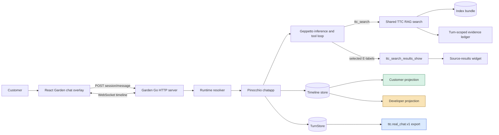
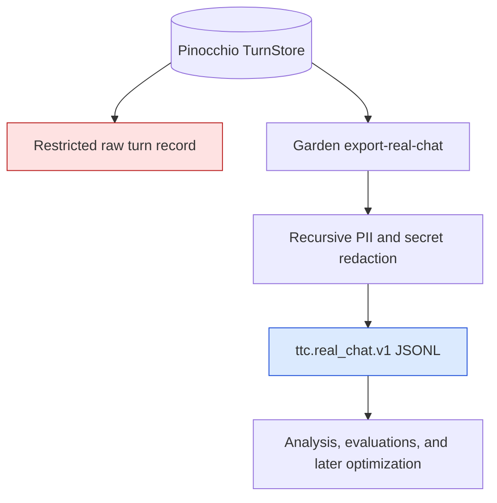
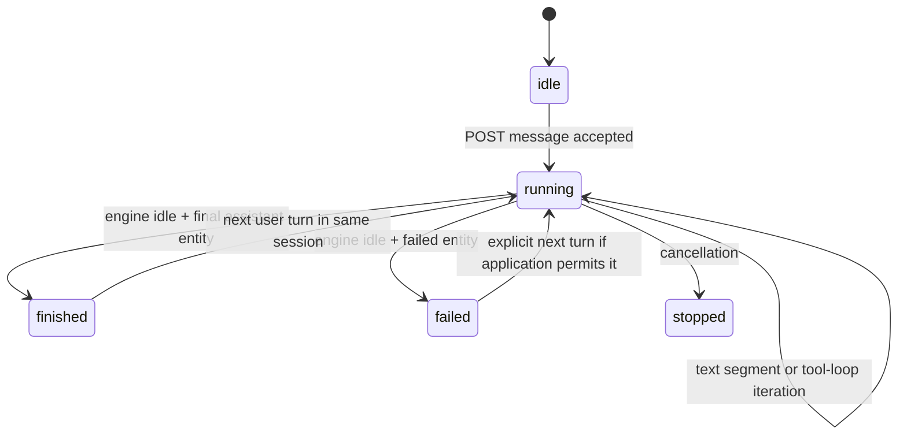

# TTC Garden Assistant: From RAG Prototype to Auditable Customer Chat

This report explains how the Tree Center Garden Assistant was turned from a working RAG demonstration into a customer-facing, inspectable, and repeatably testable chat system. The work did not replace the retrieval system or introduce a new agent framework. It made the existing path explicit: customer questions enter a React overlay, Go owns session and runtime composition, Pinocchio owns inference lifecycle and durable turns, Geppetto owns the model tool loop, the shared TTC RAG package owns evidence admission, and a small set of projections decides what customers, developers, and analysts are allowed to see.

The central result is not a single prompt or benchmark score. It is a set of contracts that make the system operable. Customer mode now excludes reasoning and tool diagnostics. Source cards link only to verified Tree Center pages. Real conversations have a durable, analyst-safe export. A versioned manifest drives both HTTP and browser acceptance. A server-authoritative lifecycle prevents automation from treating an intermediate assistant segment as a completed answer. Finally, Surf exposes a small operator interface for asking the live system and retrieving its canonical transcript.

> [!summary]
> - The production answer target is `gpt-5.6-luna-low`; a real five-case HTTP acceptance run and the same five-case Playwright run both passed 5/5.
> - The system separates customer projection, developer inspection, and analyst export. These are different views over related runtime data, not competing chat implementations.
> - `ttc_search` remains a direct model tool. It supplies a turn-scoped evidence ledger, while `ttc_search_results_show` converts selected evidence into customer-visible source cards.
> - The most important late repair was lifecycle correctness: assistant text marked final for one segment is not necessarily the end of a multi-inference tool loop.

## 1. The problem that remained after RAG worked

A RAG system can retrieve relevant evidence and still be unsuitable for customers. A prototype often has the correct internal behavior before it has the right external behavior. The Garden Assistant already had a real Luna-low model, an index-backed `ttc_search` tool, evidence labels, a source-results widget, and a React chat interface. Those components were sufficient to answer questions. They were not sufficient to establish a product contract for what customers could see, what developers could debug, what analysts could retain, or how a change could be tested later.

Four conditions made that distinction concrete.

- Runtime reasoning and raw tool events were projected into the same timeline as customer messages. A customer could see implementation details such as `ttc_search`, while a developer had no compact in-chat inspection surface.
- The system could admit a retrieved document as evidence, but the source-card payload did not reliably carry a verified public Tree Center URL. A citation label is not a customer resource.
- Pinocchio could persist turns, but default development profiles did not consistently configure durable storage and there was no routine analyst-safe JSONL projection.
- Existing smoke tests created a session but did not execute a full question, tool loop, final answer, multi-turn continuation, widget rendering, or browser-visible acceptance check.

The work therefore had a narrow objective: preserve the proven RAG and tool-loop path, then add only the presentation, persistence, evidence, and testing mechanisms needed to operate it responsibly.

## 2. The completed system

The resulting system has one inference path and several explicit projections. The distinction matters because it prevents a customer UI change from becoming an inference change, and it prevents analyst exports from becoming an accidental customer surface.



The system deliberately does not place a second QA agent between the customer and `ttc_search`. The model can call `ttc_search` directly. The search tool returns admitted evidence labels such as `E1` and `E2`; the model can then call `ttc_search_results_show` with labels from the current turn. That second tool creates the source card widget. The model’s final prose must not contain raw E-labels, URLs, provider citation markup, or a textual “source cards” placeholder because the widget is the public citation surface.

This design keeps the boundaries small. Retrieval remains reusable RAG code. The Garden server adapts it to a customer session. The frontend renders typed timeline entities and typed widget payloads. No layer has to infer another layer’s private data model.

## 3. Phase 0: customer and developer projections

The first completed phase established an audience boundary. A timeline can contain useful information that should not appear in a customer conversation. This is not a prompt-following problem. The runtime can emit reasoning messages, tool calls, tool results, widget events, and provider errors independently of the final answer. The application must decide which of those entities become customer UI.

The Garden server selects a presentation mode, `customer` or `developer`. Customer mode exposes final assistant messages, customer-safe status updates, safe errors, and widgets. It excludes reasoning, raw tool rows, raw tool results, and browser debug payload logging. Developer mode retains those internals in inline expandable rows, including timing, tool inputs and results, widget state, runtime identity, errors, and redacted metadata.

The distinction is structural:

| Concern | Customer mode | Developer mode |
|---|---|---|
| Final answer | Rendered | Rendered |
| Customer status | Rendered | Rendered with surrounding diagnostics |
| Provider reasoning | Hidden | Rendered as an inspectable row when available |
| Tool name, arguments, result | Hidden | Rendered and redacted |
| Runtime identity and timing | Hidden | Rendered |
| Provider failure detail | Safe generic error | Preserved diagnostic detail |
| Browser debug payload logs | Disabled | Available only through the explicit diagnostic path |

### 3.1 Customer-facing status is not chain-of-thought

The system introduces `ttc_status_update`, a typed tool for concise, customer-facing progress text. The prompt permits a short status before substantive search or comparison work, such as “I’m checking Tree Center guidance for shade-tolerant flowering shrubs.” It prohibits conclusions, citations, URLs, tool names, hidden instructions, and internal reasoning.

The status path is backed by a deterministic fallback. If the model does not publish a status, the runtime can show a bounded lifecycle description while work is active. This preserves a useful response during waiting periods without making progress presentation depend entirely on stochastic model behavior.

The essential contract is:

```text
Customer status = brief description of current customer-relevant work
Customer status ≠ provider reasoning summary
Customer status ≠ raw tool name or tool result
```

This contract is enforced at two points. The tool schema and validator restrict status content and replacement behavior; the frontend chooses which typed entity kinds are visible in customer mode. A prompt alone would not provide the same guarantee.

### 3.2 Final-response boundaries

The runtime already has a typed final assistant-message boundary. The implementation therefore did not add a `show_response` tool or require models to wrap every answer in `<response>` tags. Those alternatives would introduce a second model-controlled completion protocol while duplicating a boundary Pinocchio already supplies.

Streaming tags remain technically possible as a future parser mode, but they are not the default product contract. The product boundary is the final assistant timeline entity. The status tool provides the limited pre-answer information that customers need.

## 4. Phase 1: evidence becomes a usable source card

Grounding has two different responsibilities. The retrieval system needs chunks of text and document identity so the model can make supported claims. The customer needs a readable link to a public page. A retrieved chunk is often unsuitable as a public card excerpt: it may start mid-sentence, contain extraction residue, repeat a neighboring chunk, or have no verified public page address.

The serving path now loads a verified source catalog with the index bundle and checks its corpus digest. At evidence admission, it hydrates each citation with title and URL metadata from that exact catalog revision. It does not infer slugs from titles or run arbitrary external searches at answer time.

### 4.1 URL safety is a data-admission rule

The source URL contract performs the following operations before the frontend receives a link:

```text
raw catalog URL
  -> trim
  -> decode HTML entities such as &#038;
  -> parse URL
  -> require https
  -> require approved Tree Center host
  -> emit normalized URL or no URL
```

Only `https` URLs on the approved Tree Center host are accepted. If a source document has no safe verified URL, the source remains visible as an unlinked fallback. This is deliberate. The system would rather show grounded evidence without a link than invent a public address or accept an unsafe host.

The relevant public payload is intentionally small:

```go
type SourceResult struct {
    Citation   string `json:"citation"`
    DocumentID string `json:"documentId"`
    Title      string `json:"title"`
    URL        string `json:"url,omitempty"`
    Snippet    string `json:"snippet"`
}
```

The React widget treats `url` as optional. When it exists, it renders a labeled external link with safe `https`, `_blank`, and `noopener` behavior. When it does not, it renders the source title without converting uncertainty into a broken link.

### 4.2 Why source safety and source usefulness differ

Phase 1 establishes trustworthy links, not the final source-card experience. The card may still display a raw retrieval chunk in `snippet`. That is adequate for evidence inspection and deliberately retained in analyst records, but it is not ideal customer copy. The later Phase 4 plan therefore treats customer excerpts, URL deduplication, and concise card limits as a controlled product-improvement experiment. This sequencing prevents an aesthetic improvement from weakening source provenance.

## 5. Phase 2: durable real chats and analyst-safe exports

The system must retain enough information to understand a conversation after it happens. A final answer alone cannot explain whether a problem came from retrieval, a tool call, a prompt instruction, a missing source URL, a model failure, or a frontend projection. At the same time, routine analysts should not receive encrypted provider bytes or raw hidden chain-of-thought.

Pinocchio already supplied the durable primitives: timeline hydration and a turn store. Phase 2 configured durable paths through devctl profiles and added a Garden-specific export over those records. The result is a versioned line-oriented format, `ttc.real_chat.v1`.



An analyst record can include the effective system prompt, prompt digest, model and runtime identity, RAG bundle and tool configuration identity, user and assistant text, reasoning summaries, tool definitions, tool inputs and results, selected evidence, source metadata, usage data when available, and safe inference metadata. It omits encrypted reasoning bytes and raw hidden chain-of-thought.

The separation is important because it gives each record a clear audience:

- The restricted raw store exists for operators debugging the runtime and persistence system.
- The analyst-safe export exists for quality analysis and future optimization.
- The customer transcript is the exact projection the user saw, with provider citation artifacts removed.

The system also gained basic PII redaction metadata, operations guidance for retention and deletion, and a confirmation-gated deletion command. Durable storage without a deletion procedure would not be adequate for real customer traffic.

## 6. Phase 3: repeatable acceptance over API, browser, and operator CLI

Phase 3 made the completed path testable without manually reproducing a conversation in a browser. It has three complementary interfaces:

| Interface | Primary question | Artifact |
|---|---|---|
| Python HTTP runner | Did the API and tool loop complete with the expected conversation data? | JSONL, terminal snapshots, summary |
| Playwright runner | Did the customer or developer actually see the correct rendered experience? | Result JSONL and screenshots |
| Surf commands | Can an operator ask the running app and retrieve the canonical transcript? | Markdown/Glazed output and optional JSON export |

These tools overlap by design but do not duplicate responsibility. The Python runner owns versioned challenge manifests and repeatable evaluation artifacts. Playwright owns visible UI behavior. Surf owns interactive operator access to the real application through a browser-owned same-origin context.

### 6.1 The manifest-driven HTTP runner

`scripts/ttc_customer_chat_runner.py` reads `configs/customer-chat/customer-chat-v1.json`. The manifest has sixteen cases: five deterministic mock smoke cases and eleven Luna-low cases spanning direct research, comparison, multi-turn continuity, clarification, care, safety, source presentation, and no-evidence behavior.

The runner creates a new session per case, preserves one session across turns within a case, assigns each submission an idempotency key, polls the snapshot endpoint, evaluates deterministic assertions, and writes immutable run artifacts.

```text
for case in manifest:
    session = create_session()
    seen_assistant_ids = set()

    for user_turn in case.turns:
        submit(session, user_turn, idempotency_key())
        snapshot = wait_for_terminal_turn(session, user_turn, seen_assistant_ids)
        retain_customer_exchange(snapshot)
        retain_raw_terminal_snapshot(snapshot)

    evaluate_case_assertions()
    append_jsonl_result()

write_summary()
```

The artifacts separate large raw snapshots from compact JSONL result rows. This makes a run easy to analyze in bulk while retaining the full server response for a later incident investigation.

### 6.2 The lifecycle bug that changed the completion contract

The first real Luna-low five-case execution uncovered a failure that a simple “final text exists” rule could not detect. A tool-using inference can emit an assistant segment such as “I’m checking…” as a finished text segment, then continue to call a tool and synthesize a later answer. The early segment is final for that segment, not final for the complete run.

The original runner looked at hydrated entities and concluded that an assistant message with `final: true`, with no visible active tool call at that exact poll, meant completion. It therefore advanced before the later work appeared. Four early cases captured temporary prose instead of the actual answer.

The repair moved lifecycle authority to the Garden server. `backend/internal/appserver/snapshot.go` probes `chatapp.Service.WaitIdle` with an already-cancelled context. This probe never blocks the HTTP request:

```go
func (s *Server) snapshotStatus(ctx context.Context, sid sessionstream.SessionId, entities []SnapshotEntity) string {
    probeCtx, cancel := context.WithCancel(ctx)
    cancel()
    if err := s.service.WaitIdle(probeCtx, sid); err != nil {
        return "running"
    }
    return snapshotStatus(entities)
}
```

While Pinocchio owns an active run, the endpoint reports `running`. Once the engine is idle, terminal failure and stop states take priority; otherwise, a final assistant entity establishes `finished`. The Python and JavaScript runners were simplified to trust this top-level server lifecycle instead of guessing from text.

The resulting transition model is:



This repair is more general than the customer test. Any client that polls the snapshot endpoint—HTTP automation, a browser test, or Surf—now gets one shared definition of active work.

### 6.3 Customer projection must match the browser

The raw snapshot preserves provider-native citation markup because it is useful diagnostic data. The customer React component strips unsupported provider citation tokens and a source-card placeholder because source cards provide the actual public links. The HTTP runner initially evaluated raw assistant text and incorrectly reported citation leaks that customers could not see.

The runner now applies the same narrow deterministic projection as `TtcChatMessages.tsx` when it constructs the customer transcript, while retaining the untouched raw snapshot separately. This is a useful general rule for evaluation design: score the surface under evaluation, but retain the lower-level input needed to diagnose it.

### 6.4 Real acceptance evidence

The final focused real-model runs used the production-target `gpt-5.6-luna-low` profile.

| Run | Cases | Result |
|---|---:|---:|
| HTTP manifest subset | 5 | 5 passed, 0 failed |
| Customer Playwright subset | 5 | 5 passed, 0 failed |
| Surf `ttc ask` smoke | 1 | Finished customer answer returned |
| Surf `ttc transcript` smoke | 1 | Same session exported with opt-in entities |

The five manifest cases cover a deer-resistant evergreen screen, Blue Ice versus Carolina Sapphire comparison, three-turn Tampa privacy-screen continuity, two-turn bright-shade flowering shrubs, and newly planted-tree watering. The Playwright checks cover terminal completion, accessible controls, no hidden diagnostic rows in customer mode, source link safety, widget identity, lack of horizontal overflow, and browser console/network errors. The retained ticket includes the raw snapshots, per-case JSONL, Playwright result records, five screenshots, and a visual montage.

## 7. Surf as an operator interface, not another RAG implementation

The Surf work began as a deferred note in the Garden design. Completion audit found that the referenced ticket did not actually exist, so the missing `TTC-GARDEN-SURF-001` ticket was created and the smallest useful implementation was built.

`surf-go ttc ask` opens or uses a Surf-owned tab at the Garden URL, runs same-origin JavaScript, creates or continues a session, submits one idempotent message, waits for the server’s authoritative terminal status, and renders a customer-safe transcript, widgets, and source metadata. `surf-go ttc transcript` reads the canonical snapshot for an explicit session ID or the session stored in a kept TTC tab, with an optional internal-entity export.

```text
surf-go ttc ask "How should I water a newly planted privacy tree?" \
  --url http://127.0.0.1:3109 \
  --prompt-timeout-sec 180

surf-go ttc transcript \
  --url http://127.0.0.1:3109 \
  --session-id <session-id> \
  --include-internals \
  --export-file /tmp/ttc-session.json
```

The command does not import Garden RAG or model code. It uses the application API through the browser context, which keeps the reusable Surf tool independent of the Garden implementation and remains compatible with same-origin deployment behavior.

One integration defect was particularly instructive. Surf’s `js` tool serializes the value returned by the script body. The first embedded script invoked an async IIFE but did not return its promise, so the host returned the literal text `undefined`. The correction was not in the API logic; it was the explicit boundary:

```javascript
return (async () => {
  // same-origin session creation, submission, polling, projection
})()
```

This is a small detail with a large diagnostic consequence. The command’s Go parser was correct for structured tool responses; the script simply had not supplied one.

## 8. Validation and the meaning of completion

Completion was audited rather than inferred from commit messages. The ticket checked every Phase 0–3 task against implementation, retained artifacts, and current tests.

```text
(cd backend && go test ./... -count=1)                         PASS
python3 scripts/test_ttc_customer_chat_runner.py                PASS (4)
node --check scripts/ttc_customer_chat_playwright.mjs           PASS
pnpm --dir web typecheck                                        PASS
focused React chat tests                                        PASS (22)
(cd surf-cli/go && go test ./internal/cli/commands ./cmd/surf-go -count=1)
                                                                  PASS
docmgr doctor for both tickets                                  PASS
```

One full frontend-suite issue remains outside this project: a DMETA manifest test expects 17 components while the generated manifest contains 31. Direct execution of the five Garden chat test files passed all 22 relevant tests. The discrepancy is recorded rather than silently treated as a Garden failure, because completion claims must state the actual validation boundary.

The durable evidence lives in the Garden ticket `TTC-GARDEN-UXQA-001` under `sources/phase3/`, particularly:

- `07-luna-http-acceptance/` for customer-visible JSONL, summaries, and raw terminal snapshots;
- `08-luna-playwright-acceptance/` for browser result records and screenshots;
- `09-luna-low-acceptance.md` for the lifecycle and projection corrections;
- `10-phase0-3-completion-audit.md` for the requirement-by-requirement audit.

The Surf ticket `TTC-GARDEN-SURF-001` retains the operator command design, implementation diary, tasks, and a real transcript export.

## 9. Engineering rules that survived the work

Several rules are reusable beyond the Garden Assistant.

- Treat customer UI, developer diagnostics, and analyst records as explicit projections with separate contracts. Do not use a single unfiltered event stream as all three products.
- Make evidence links deterministic. Hydrate them from the indexed corpus revision and reject unsafe URLs before rendering.
- Preserve raw runtime material for restricted diagnosis, but create an intentionally smaller analyst projection rather than distributing encrypted bytes or hidden reasoning by default.
- Use an authoritative lifecycle owner. A client-side heuristic based on text, DOM state, or a single event is insufficient for multi-step inference.
- Evaluate the customer-visible projection, not raw model bytes, while retaining raw bytes separately for diagnosis.
- Keep deterministic testing, visible browser acceptance, and interactive operator access as distinct tools. Their outputs should agree on the state machine, not compete for the same role.
- Add only the narrowest command interface that has a demonstrated operational need. The Surf commands use existing tab and JavaScript infrastructure; they do not create a general agent layer.

## 10. What follows: Phase 4 is quality improvement, not more infrastructure

The completed foundation makes a different kind of work possible. Phase 4 is not a request to redesign retrieval again. It is a controlled customer-experience baseline: a conversation challenge manifest, deterministic product checks, a compact Luna judge, human calibration, source-card improvements, and one bounded prompt or tool-description experiment at a time.

The strongest first customer-facing improvement is likely source-card presentation. The current cards prove provenance but can still expose raw chunk excerpts. The proposed Phase 4 approach keeps internal chunk evidence intact, adds verified page-oriented excerpts, deduplicates by public URL, limits cards to a useful number of distinct pages, and compares the result against the raw-chunk baseline. It is a presentation experiment with explicit grounding constraints.

Later, the durable real-chat export and replayable runner provide the substrate for a pragmatic GEPA-style loop. A stronger model can inspect repeated failed customer trajectories and propose one prompt or tool-description candidate. The production Luna-low system evaluates that candidate on a frozen validation subset. Deterministic, safety, grounding, continuity, and source-presentation regressions reject the candidate. Human review remains the promotion boundary.

The completed phases therefore establish the necessary conditions for improvement work: a customer surface worth measuring, a trusted evidence path, durable records, an authoritative lifecycle, and repeatable real-model tests. The next work should use those conditions rather than replace them.

## Related notes

- [[ARTICLE - rag-ttc - Architecture of a Reproducible Go RAG Evaluation System]]
- [[ARTICLE - rag-ttc - Reproducible TTC RAG Evaluation with Blinded LLM Judges]]
- [[ARTICLE - Building a Tool-Using Go Chat Agent - Geppetto Goja and Glazed]]
- [[ARTICLE - ChatProvider Web Chat Cleanup - Provider Runtime Timeline Adapters and Example Architecture]]
- [[ARTICLE - Canonical Chat Event Protocol - Provider Streams to Browser State]]
