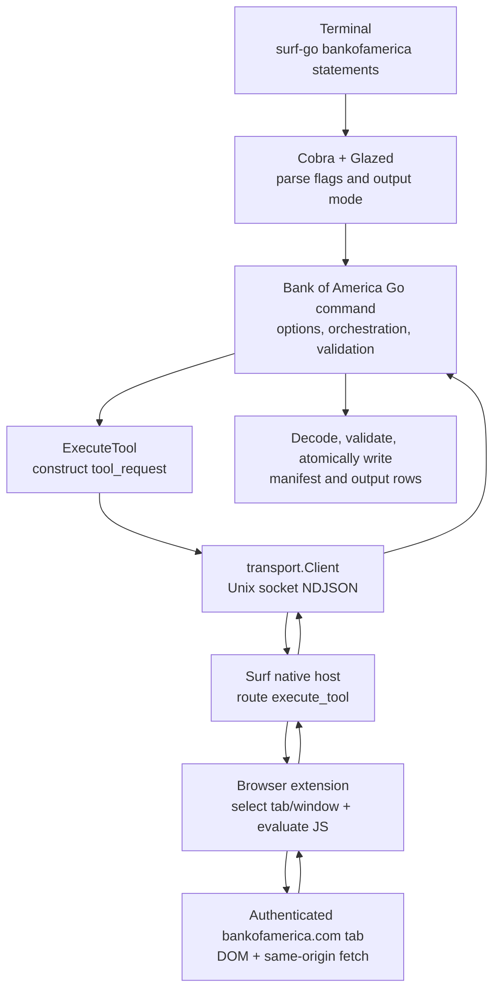
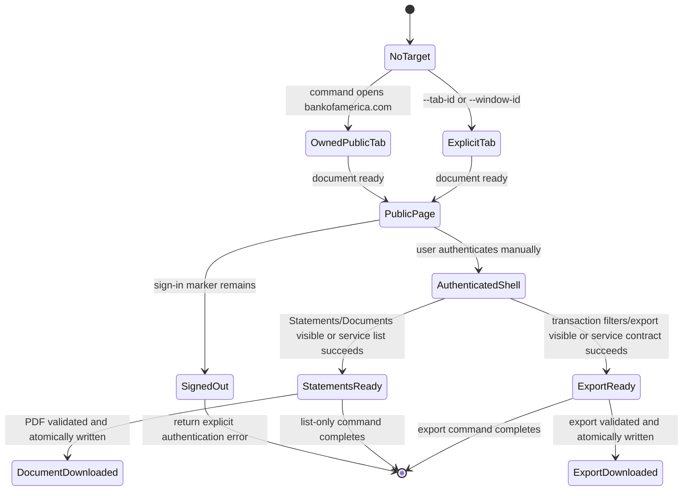

# Authenticated Bank of America Browser Verbs in surf-go: A Deep Technical Project Report

## Executive summary

This report analyzes the implementation of three authenticated Bank of America browser verbs in `surf-go`: `bankofamerica statements`, `bankofamerica statement-download`, and `bankofamerica transactions-export`. The project does not implement a second Bank of America login client. It uses a browser tab that the user has authenticated manually, evaluates a small embedded JavaScript program in that tab, and keeps browser-owned authentication state inside the page. Go owns command parsing, result validation, byte decoding, filesystem writes, and structured output.

The implementation was built from observed runtime contracts rather than guessed endpoints. The investigation established the Statements and Documents gather request, its JSON response shape, the document retrieval endpoint and query fields, the direct PDF representation, the Account Activity transaction form, the nested form field names, and the supported `csv` and `txt` formats. The resulting commands were tested against an authenticated tab and produced a valid 8-page PDF and a 5,822-byte CSV in an external Downloads directory. The downloaded files were not placed in the repository, ticket workspace, or vault.

The central design decision is the authentication boundary. The browser page can access cookies, account-specific state, the hidden transaction account token, and the statement `adx` value. Go must not receive those values. The JavaScript layer uses them to make same-origin requests and returns either constrained metadata or bounded base64 byte chunks. The Go layer rejects malformed envelopes, verifies chunk offsets, validates PDF signatures, writes files atomically, and emits only local artifact metadata.

The report treats the feature as a small acquisition system with explicit state transitions. It explains why page-context execution is necessary, how the three command paths differ, how the response contracts were discovered, how the implementation protects tab ownership and local files, which failure modes were encountered during development, and which tests and live traces support the current result.

> [!summary]
> - Three Bank of America verbs are implemented and registered in `go/cmd/surf-go/main.go`.
> - Authentication and page-owned account values remain inside `bank_of_america.js`.
> - Live validation produced a valid statement PDF and a recent CSV export without committing financial artifacts.
> - The next engineering boundary is release hardening: redacted fixtures, mock-host request-sequence tests, and optional bulk download support.

## 1. Goal, scope, and non-goals

### 1.1 Goal

Build a repeatable `surf-go` command family that can discover Bank of America accounts and available documents in a signed-in browser session, download statement PDFs, and export transaction data into local files suitable for the existing banking analysis workflow.

The command family must be useful to a user who already has a Bank of America Online Banking session open. It must support deterministic output paths, safe interruption and retry, structured output for scripts, and human-readable summaries for interactive use. It must also make the authentication and product-coverage limitations visible instead of representing missing data as success.

### 1.2 In scope

- Safe signed-out and signed-in page probes.
- Discovery of Bank of America account cards and product labels without returning full account numbers.
- Inventory of Statements and Documents UI controls, rows, document types, dates, and download affordances.
- Discovery of the transaction list/filter/export UI and its supported formats.
- Capture of authenticated request metadata and redacted response shapes from the target page context.
- Listing statement/document metadata through a read-only command.
- Downloading one statement PDF, with a later bulk/resumable mode.
- Exporting a transaction date range in a format accepted by the live site.
- Optional manifest generation for downloaded artifacts.
- Unit tests, mock-host request-sequence tests, and manual live-browser validation.

### 1.3 Out of scope

- Automating User ID, password, security questions, one-time codes, device verification, or other Bank of America authentication steps.
- Extracting browser cookies, session tokens, anti-forgery tokens, or local storage secrets into Go.
- Payments, transfers, card controls, profile changes, dispute submissions, or any other mutating operation.
- Bypassing Bank of America UI or service access controls.
- Promising coverage beyond what the signed-in account and product UI actually expose.
- Automatically writing downloaded statements to the repository, ticket, or Obsidian vault.
- Treating an undocumented internal endpoint as stable without a recorded probe and regression fixture.

### 1.4 Definition of done for the first implementation

The implementation should not be declared complete until all of the following are true:

- `statements` can identify an authenticated Bank of America page and return either redacted-safe document metadata or a clear signed-out/not-ready error.
- `statement-download` can download one live statement, decode it if necessary, validate the PDF signature, and atomically write it to an explicit output directory.
- `transactions-export` can export a small, live-supported range in at least one verified format, decode any encoded payload, and validate the resulting file.
- The Go command does not create or close a user-supplied authenticated tab.
- A command-created tab is closed on success, failure, and readiness timeout unless an explicit keep-open option is part of the reviewed design.
- Unit tests cover date parsing, safe filenames, response-shape parsing, chunk reassembly, and atomic writes.
- Mock-host tests verify the exact tool request sequence and tab ownership behavior.
- A live validation run records status, counts, file sizes, and hashes without storing credentials or unredacted financial contents.
- The ticket diary records failed hypotheses, exact errors, and the final evidence.

## 2. Runtime boundary: Go, the native host, and the Bank of America page

The feature crosses two execution environments: the local Go process and the authenticated Bank of America page. They have different data contracts, capabilities, and failure modes. Understanding that boundary explains why the implementation does not move authentication state into Go.

### 2.1 The acquisition boundary

The feature begins with source artifacts and ends with validated local files. A statement PDF and a transaction export are different representations with different selectors and different service contracts. The list command emits document metadata without writing a file. The statement command retrieves one PDF selected by a document ID or a date. The transaction command submits the Account Activity form for a date range and a verified format. No command performs an implicit transformation after the download.

This boundary is deliberate. A browser download can succeed while producing the wrong account, an HTML error page, a truncated file, or an empty export. The acquisition layer therefore records the source selector, response metadata, byte count, and local hash while leaving interpretation to a later, explicit consumer. That separation keeps service-specific browser behavior from becoming coupled to a particular parser or persistence system.

The user-visible artifact layout is controlled by Go. A statement download either receives an explicit `--save-to` path or uses a validated server filename below `--output-dir`. A transaction export either receives an explicit `--save-to` path or uses a deterministic filename derived from its requested dates and format. The browser does not write to the local filesystem; it returns bytes through the native-host result channel.

### 2.2 The `surf-go` runtime

The Go CLI sends newline-delimited JSON requests over a Unix socket to the local Surf native host. The request is routed to the browser extension and evaluated in a selected browser tab. The important call path is:



The division of responsibility is fixed by existing repository patterns:

| Layer | Owns | Must not own |
|---|---|---|
| Cobra/Glazed | command names, flags, output mode, settings decoding | credentials and Bank of America session state |
| Go command | orchestration, validation, response parsing, decoding, files, manifests | cookie/token extraction and direct authenticated login |
| Embedded JavaScript | page readiness, DOM probes, same-origin fetch, response normalization, chunking | local filesystem paths and local writes |
| `transport.Client` | socket framing and timeouts | Bank of America response semantics |
| Native host/extension | browser target selection and JS evaluation | financial-data interpretation |
| Browser page | cookies, session storage, anti-forgery state, origin context | local output policy |
| External consumers | Parsing, analysis, or persistence of downloaded files | Bank of America login and web navigation |

The target state machine should be explicit in both code and diagnostics:



The state machine separates browser readiness from data readiness. A page with a complete document load is not necessarily authenticated, and an authenticated dashboard is not necessarily ready to supply statement or export data. The command should expose the failed state in its error rather than returning an empty list.

## 3. Evidence inventory and what is not known yet

Evidence-first development is especially important for financial websites because the UI, secure widgets, service paths, and authorization requirements can change independently. This section separates verified evidence from unresolved questions.

### 3.1 Repository evidence already available

The following claims are backed by files in the local repositories:

- The AI cleaning stage writes `summary_*.json`, `deposits_*.csv`, and `withdrawals_*.csv` under account/date directories.
- The importer uses a uniqueness key of account, statement date, transaction date, description, and amount for transaction conflict handling.
- Existing `surf-go` commands use embedded JavaScript, `ExecuteTool`, Glazed dual-mode output, explicit tab/window targeting, and page-context base64 chunking.
- Existing `surf-go` tab helpers distinguish command-owned tabs from caller-supplied tabs and clean up owned tabs on readiness failure.

### 3.2 Official public Bank of America evidence

Public search results and official pages establish the following product-level facts:

- The secure Statements and Documents area is at `https://secure.bankofamerica.com/mycomm-acc-stmts-docs/home/`.
- Bank of America’s public credit-card statement FAQ describes viewing and printing statements and downloading transactions for financial-management software.
- Bank of America’s online financial-management FAQ describes filtering transactions, using a More menu, selecting a time period, and starting a download.
- The accessible-banking resources page states that users can view, print, and download up to 18 months of checking-account statements. This is a product/page statement and must not be generalized to every account type.
- The small-business transaction-reporting page says eligible accounts have electronic statements and downloadable transaction information, but consumer and small-business workflows may differ.

These pages do not provide a stable authenticated JSON API contract. They are references for user-visible functionality and product limits. The implementation still needs live page-context evidence for the actual account, document, and export requests.

### 3.3 Authenticated runtime findings from the first live probe session

On 2026-08-03, the user authenticated manually in Surf tab `441403478`. The probes and first production-command validation then ran in that exact tab. The following observations are live evidence for this account and browser session. Results were stored as sanitized metadata under the ticket `scripts/` directory; no names, balances, account suffixes, tokens, transaction rows, or response bodies were committed. Document IDs were used only as page-selected download selectors during live validation.

#### Authenticated Accounts Overview

The top-level account page reported:

```text
origin: https://secure.bankofamerica.com
path: /myaccounts/signin/signIn.go
page title: Bank of America | Online Banking | Accounts Overview
readyState: complete
logout marker: present
profile marker: present
signed-out marker after logout exclusion: false
```

The URL path is unusual: it remains under `/myaccounts/signin/signIn.go` while the page title and body represent an authenticated Accounts Overview. This is another reason not to use a URL suffix alone as application readiness. The authenticated page exposed three account rows in the sanitized account-row probe. The first account action navigated to the Account Activity page.

#### Statements and Documents application

Clicking the visible `Statements & Documents` navigation control changed the page to:

```text
https://secure.bankofamerica.com/statements-documents/home/
```

The page title became `Bank of America | Online Banking | Statements and Docs`. The page loaded a Vue/Vuex-style Statements and Documents application from `secure1.bac-assets.com`. Its resource inventory showed the page bundle, store bundle, available-docs store, and the authenticated service request:

```text
POST /ogateway/dsviewdocuments/omni/statements/v1/gatherDocuments
```

The public bundle context showed the initial request data shape:

```json
{
  "year": "<selected year>",
  "adx": "<selected account or ALL>",
  "docCategoryId": "0000",
  "isAccountView": false
}
```

A live page-context response-shape probe confirmed HTTP 200 JSON with `accountList`, `documentCategoryList`, `documentList`, `errorInfo`, `status`, and `yearList`. Each document record contains page-owned `adx` and `docId` values plus `date`, `dateString`, `docCategory`, `docCategoryId`, `docDisplayName`, `docTypeId`, `productCode`, and download indicators. The production script normalizes this into document metadata without returning `adx`.

The request adds an `Accept-Language` header with `en-US` for the English page. A category-specific request uses the same service and sends a selected document category ID. The page bundle contains the following document-card attributes:

```text
data-ada
data-adx
data-dateavailable
data-doccategoryid
data-docdisplayname
data-docid
```

The sanitized live card probe found document cards with these attributes. It did not return their values. The document actions are `View PDF` and `Download PDF` links represented by `#viewPDFLink` and `#downloadPDFLink` inside each card. The bundle’s `viewPDF` method constructs a retrieve-document URL with these query fields:

```text
adx
documentId
adaDocumentFlag
menuFlag=view|download
request_locale
```

The page module configuration exposes the retrieve-document endpoint as:

```text
/ogateway/dsviewdocuments/omni/statements/v1/docViewDownload
```

The endpoint is called with page-owned `adx` and `documentId` values plus `adaDocumentFlag`, `menuFlag=download`, and `request_locale`. The live document-response metadata probe fetched it with credentials and returned only:

```text
HTTP status: 200
Content-Type: application/pdf
Content-Disposition: present
byte length: 263655
first five bytes: %PDF-
```

This establishes the first real statement-download representation: the page can retrieve a PDF directly as an authenticated PDF response. The production command now uses the observed endpoint inside page context, keeps `adx` in the page, validates `%PDF-`, and constructs a local safe filename.

#### Account Activity and transaction export

Clicking the first account action from Accounts Overview opened:

```text
https://secure.bankofamerica.com/deposit-details/activity/
```

The page title became `Bank of America | Online Banking | Deposit | Account Activity`. The sanitized resource inventory showed:

```text
POST-or-page-service path observed in resource activity:
  /ogateway/addapi/v1/activity
```

The page has a visible `a.download-transactions` control. Clicking it opens a download form whose sanitized contract is:

```text
form action: https://secure.bankofamerica.com/ogateway/addapi/v1/download/form/transaction
method: POST
target: _blank
hidden field: payload.accountToken       value length 64
hidden field: payload.locale             value length 5
select: payload.txnSearchCriteria.txnPeriod
input:  payload.txnSearchCriteria.startDate
input:  payload.txnSearchCriteria.endDate
select: payload.txnSearchCriteria.fileType
```

The page presents these confirmed transaction-period labels:

```text
All dates (18 months)
Month
Custom date range
```

The current page’s transaction-period selector contains 21 options because it includes month choices in addition to the three high-level labels. The format selector has three options, with these confirmed non-placeholder values:

```text
Microsoft Excel Format -> csv
Printable text format  -> txt
```

A small custom-range CSV request was prepared inside the page for January 1–31, 2025. The page enabled the download button after the date and format fields were set. A page-context `FormData` POST to the form action returned:

```text
HTTP status: 200
Content-Type: application/csv
Content-Disposition: present
byte length: 106
```

The response body was not returned or stored. This confirms that transaction export is a direct authenticated form POST returning a downloadable CSV response. The 106-byte result likely represents a small/no-row export or a minimal response, but its contents were intentionally not inspected; a future implementation should validate the decoded file without logging its rows.

These findings change the design from an entirely unverified proposal to a partially observed implementation plan:

- Statement discovery uses the Statements and Documents SPA and its `gatherDocuments` service.
- Statement PDF retrieval can be validated as an authenticated PDF response.
- Transaction export uses an HTML form POST with nested `payload.*` field names and a hidden page-owned account token.
- The first verified formats are `csv` and `txt`, not OFX/QFX/QBO.
- The first implementation should keep all account-token handling inside page context and should not ask Go to construct the form payload from a copied token.

### 3.4 Unknowns that must still be probed

The following remain intentionally unresolved:

- Whether the complete statement history can be fetched reliably across every product and account type; the observed `yearList` and per-year requests cover the current consumer session.
- Whether all account/document metadata remains stable across product pages.
- Whether the account dashboard and all Statements/Documents product widgets remain in the top frame for every product.
- Whether account cards expose stable IDs suitable for a local alias, or whether the page-owned `adx` value must remain entirely inside JavaScript.
- The full set of required request headers beyond the observed `Accept-Language` header.
- Whether Bank of America returns stable server filenames for every statement type; the first live PDF supplied a usable filename, while local filename validation remains authoritative.
- Product-specific history windows and transaction-export limits beyond the visible `All dates (18 months)` option.
- Whether the `txt` export is a structured text format suitable for downstream parsing or only a printable presentation.
- Whether server-side anti-forgery headers or form-origin checks must be generated from page state.
- How account IDs and document IDs behave when multiple checking, savings, credit-card, or joint accounts are present.
- Whether the secure application uses a per-tab `sessionStorage` value similar to Apple Card or relies primarily on cookies.

A guide is not a license to fill these gaps with guessed endpoints. Each remaining unknown needs a small probe, a redacted result, and a diary entry.

## 4. Bank of America product surfaces to investigate

Bank of America exposes multiple user-facing surfaces that may share data but not implementation. Each surface must be probed separately because its selectors, request contracts, and account context can differ.

### 4.1 Account dashboard

The dashboard is the first place to establish signed-in readiness and enumerate product cards. The probe should capture:

- top-level origin, URL, title, and `document.readyState`;
- visible signed-out markers such as `Sign In`, `User ID`, or password labels;
- visible signed-in markers such as account-summary headings, `Accounts`, `Statements & Documents`, `Download`, or account-card elements;
- link/button labels and safe attributes;
- frame names and origins, without returning frame URLs containing query parameters.

The probe must not return full account numbers, available balances, transaction descriptions, or user names. It can return redacted values such as `••••1234` only if the page itself provides a suffix and the suffix is considered necessary for matching.

### 4.2 Statements and Documents

The public secure result identifies a Statements and Documents page at:

```text
https://secure.bankofamerica.com/mycomm-acc-stmts-docs/home/
```

This is a navigation reference, not a claim that direct navigation is always correct. Some secure applications require an in-app link, a signed routing parameter, or a product context established by the account dashboard. The first probe should record whether clicking the visible Statements/Documents link changes the application state without assuming that the URL alone is sufficient.

The statement inventory should identify:

```text
account label or safe account suffix
statement/document date
statement period if shown
document type or category
view control
download control
request-related data attributes
pagination or year selectors
```

The production data model should preserve the raw metadata keys observed in the response while normalizing a small set of fields:

```text
kind
accountKey
accountLabel
documentId
documentType
statementDate
periodStart
periodEnd
filename
availableActions
```

`accountKey` must be a stable non-secret identifier from the service response or a deterministic local index. It must not be a full account number unless the user explicitly requests it and the security review approves it.

### 4.3 Transaction list and export

The credit-card FAQ and online financial-management FAQ establish that transaction downloads are a user-visible Bank of America feature. The live probe must determine whether the control is on the account dashboard, a transaction detail page, or a separate secure widget.

The transaction export inventory should capture:

- date filter inputs and accepted displayed formats;
- account/product selector;
- transaction-type or posted/pending filters;
- export/download button labels;
- format choices such as CSV, QFX, QBO, OFX, or other values;
- visible range and history messages;
- download response behavior.

The first production command should support the smallest verified request shape: the page-context form POST with `csv` or `txt`, nested `payload.*` names, and the page-owned hidden account token. If the site only supports this interactive filter-and-download flow, the page script can fill controls and submit the form while keeping the token in page context. A direct service request is preferable only after its contract is observed because it avoids dependence on download timing and browser file-system events.

## 5. Probe-first investigation workflow

The previous Apple Card project established a repeatable process. Use the same sequence, adapted for Bank of America’s secure account model.

### Phase 0: preserve the user’s browser state

Before opening anything, list browser tabs. The user may already be signed in to Bank of America in a particular tab. Do not close or navigate it during reconnaissance unless the user explicitly provides it as the target.

Recommended approach:

```text
1. Run `surf tab list`.
2. Identify an existing bankofamerica.com tab, if one exists.
3. If no target was supplied, open a fresh tab at the public Bank of America landing page.
4. Pass the fresh tab’s ID to every probe.
5. Do not automate the login form or the security challenge.
6. If the user signs in manually, continue using that exact tab ID.
7. Never return cookies, storage values, or token-bearing URLs in probe output.
```

The Apple Card diary demonstrated why this matters: authentication state can be tab-scoped even inside one browser window. Bank of America’s state model is not yet known, so the safe default is to assume tab specificity until a probe proves otherwise.

### Phase 1: public page shape

Run the safe `01-page-shape-probe.js` against a new public tab. Record only structural information. This establishes selectors for the public sign-in state and prevents a signed-out page from being mistaken for a valid empty account.

### Phase 2: manual authentication boundary

If the user requests live testing, ask them to authenticate manually in the target tab. The agent must not type or submit credentials. If authentication opens a frame or a new origin, record only the frame origin and whether the top page becomes usable. Do not inspect or copy challenge values.

### Phase 3: authenticated readiness

Run `02-authenticated-readiness-probe.js` against the same tab. It should return booleans and safe counts:

```json
{
  "ok": true,
  "origin": "https://secure.bankofamerica.com",
  "readyState": "complete",
  "hasSignedOutMarker": false,
  "hasAccountMarker": true,
  "hasStatementsMarker": true,
  "frameCount": 2,
  "accountCardCount": 3
}
```

This is an example shape, not a captured Bank of America result. It illustrates the privacy boundary: counts and booleans are useful; account values are not needed at this stage.

### Phase 4: DOM inventory

Run the Statements/Documents inventory and transaction export inventory. Record visible text, tag names, classes, roles, accessible labels, safe data attributes, and relative link paths. Avoid recording full `href` values when query parameters may contain account or session state.

### Phase 5: network and request evidence

The browser page is the only safe place to use authenticated request state. Use one of these methods, in descending preference:

1. Inspect stable request functions or response models in a public or loaded application bundle.
2. Use page-context `performance.getEntriesByType('resource')` to inventory same-origin resource paths after a user action, with query strings removed.
3. Add a temporary page-side `fetch`/XHR observer only if it is reversible and does not return bodies or secrets.
4. Use browser DevTools network inspection manually if the page uses a download manager that does not expose useful page state.

The first capture should return method/path/status/header-name lists and a redacted JSON key tree, not the complete response body. Store a local redacted fixture only after removing account numbers, names, addresses, balances, descriptions, IDs that can identify the user, and document payloads.

### Phase 6: promote a production contract

Once one live read succeeds:

- copy only the required path and request construction into the embedded script;
- define an explicit result envelope with `ok`, `status`, `kind`, and normalized data;
- add a mock response fixture;
- add Go parsing and local-file tests;
- add a diary entry with the exact observed status/error and the probe filename;
- repeat the live operation after a fresh login to check that the behavior was not transient.

## 6. Command family

The command names make the output representation explicit. The implementation does not combine document listing, PDF bytes, transaction exports, or later processing into one opaque verb.

### 6.1 `bankofamerica statements`

Purpose: list available statement/document metadata without writing files.

Invocation:

```bash
surf-go bankofamerica statements \
  --product checking \
  --since 2023-01-01 \
  --until 2026-08-03 \
  --max-results 100 \
  --tab-id 123
```

Possible output row:

```json
{
  "kind": "bankofamerica-statement",
  "accountKey": "account-0",
  "accountLabel": "Checking Account",
  "documentId": "redacted-or-service-id",
  "documentType": "statement",
  "statementDate": "2024-11-26",
  "periodStart": "2024-10-29",
  "periodEnd": "2024-11-26",
  "filename": "eStmt_2024-11-26.pdf",
  "downloadable": true
}
```

In Markdown, render dates, account label, document type, and downloadability. Do not render complete account numbers or arbitrary service response bodies.

### 6.2 `bankofamerica statement-download`

Purpose: download one statement PDF selected by service document ID, statement date, or a unique row from a prior manifest.

Invocation:

```bash
surf-go bankofamerica statement-download \
  --product checking \
  --statement-date 2024-11-26 \
  --output-dir "$HOME/Downloads/bankofamerica-statements" \
  --tab-id 123
```

Alternative exact selection:

```bash
surf-go bankofamerica statement-download \
  --document-id '<id from statements output>' \
  --save-to "$HOME/Downloads/bankofamerica-statements/eStmt_2024-11-26.pdf" \
  --tab-id 123
```

The command should support explicit `--save-to` because stable local names are important for repeatable acquisition. When no explicit path is supplied, the server filename may be normalized under `--output-dir`; it must never be used as an unrestricted path.

### 6.3 `bankofamerica transactions-export`

Purpose: request a transaction export for one product/account and date range.

Invocation:

```bash
surf-go bankofamerica transactions-export \
  --product checking \
  --start 2024-01-01 \
  --end 2024-12-31 \
  --format csv \
  --save-to "$HOME/Downloads/bankofamerica-transactions/checking-2024.csv" \
  --tab-id 123
```

The actual format list and date semantics must come from the authenticated UI/service contract. Do not expose `qfx`, `qbo`, `ofx`, or `csv` solely because another institution supports them. A command may start with `--format auto` and a page-side selected default, but the result should record the actual format.

### 6.4 Future `bankofamerica download-all`

Bulk downloads should be a separate phase. A bulk command needs a manifest, resume behavior, rate limiting, a per-document result state, and an explicit partial-failure policy. It should not be implemented by silently looping the single-document command without recording which files succeeded.

Future bulk-download manifest row:

```json
{
  "source": "bankofamerica",
  "kind": "statement",
  "product": "checking",
  "documentId": "...",
  "statementDate": "2024-11-26",
  "path": "/home/user/Downloads/bankofamerica-statements/eStmt_2024-11-26.pdf",
  "bytes": 184221,
  "sha256": "...",
  "status": "downloaded",
  "retrievedAt": "2026-08-03T...Z"
}
```

## 7. Page-context JavaScript contract

The embedded JavaScript should be small, explicit, and mode-driven. It should not render Markdown, write files, or return large unbounded values when a chunked response is possible.

### 7.1 Options prelude

The Go command should inject a JSON-encoded options object before the embedded script:

```go
func buildBankOfAmericaCode(options map[string]any) (string, error) {
    b, err := json.Marshal(options)
    if err != nil {
        return "", fmt.Errorf("marshal Bank of America options: %w", err)
    }
    return fmt.Sprintf("const SURF_OPTIONS = %s;\n%s", b, bankOfAmericaScript), nil
}
```

The options object should contain only non-secret command inputs:

```text
mode
product
accountSelector
documentID
statementDate
start
end
format
offset
chunkSize
```

It must not contain a cookie, password, token, or value copied from browser storage.

### 7.2 Explicit result envelope

All modes should return a predictable JSON object:

```javascript
{
  ok: true,
  kind: 'bankofamerica-statement-list',
  status: 200,
  data: { statements: [...] }
}
```

Failure shape:

```javascript
{
  ok: false,
  kind: 'bankofamerica-error',
  status: 401,
  code: 'unauthenticated',
  error: 'Bank of America session is not authenticated'
}
```

The page script should preserve status codes and a short, redacted server message. It should not return the raw body by default. A separate local probe mode may return a key tree and byte lengths.

### 7.3 Generic page helper

The implementation uses this helper shape, with headers limited to those observed during live probing:

```javascript
function currentPageState() {
  return {
    href: location.href,
    origin: location.origin,
    title: document.title,
    readyState: document.readyState,
    signedOut: /sign in|user id|password/i.test(document.body?.innerText || ''),
  };
}

function failure(code, message, extra = {}) {
  return {ok: false, kind: 'bankofamerica-error', code, error: message, ...extra};
}

async function requestObserved(path, init = {}) {
  // Implement only after a live same-origin request proves the path and headers.
  const response = await fetch(path, {
    credentials: 'include',
    ...init,
    headers: {...(init.headers || {})},
  });
  const text = await response.text();
  let body = null;
  try {
    body = text ? JSON.parse(text) : null;
  } catch (_) {
    body = {rawTextLength: text.length};
  }
  return {ok: response.ok, status: response.status, body};
}
```

Do not add guessed anti-forgery headers. If a live request requires a header, capture the header name and derive its value in the page context. Never return the value to Go.

### 7.4 Response key-tree redaction

During discovery, return a key tree rather than data values:

```javascript
function keyTree(value, depth = 0) {
  if (depth > 4 || value == null) return typeof value;
  if (Array.isArray(value)) {
    return {type: 'array', length: value.length, item: value.length ? keyTree(value[0], depth + 1) : null};
  }
  if (typeof value === 'object') {
    const keys = {};
    for (const key of Object.keys(value).sort()) {
      keys[key] = keyTree(value[key], depth + 1);
    }
    return keys;
  }
  if (typeof value === 'string') return {type: 'string', length: value.length};
  return {type: typeof value};
}
```

This lets a probe distinguish `{data: {documents: [...]}}`, `{accounts: [...]}`, and other envelopes without storing account-specific values.

### 7.5 Chunked document data

If the service returns a large base64 string or a page-side download response that must be transferred through the JS result channel, use offset-based chunks:

```javascript
function chunkString(value, offset, chunkSize) {
  const start = Math.max(0, Number(offset || 0));
  const size = Math.max(4, Number(chunkSize || 500000));
  const end = Math.min(value.length, start + size);
  return {
    offset: start,
    total: value.length,
    chunk: value.slice(start, end),
    done: end >= value.length,
  };
}
```

Use a chunk size divisible by four when the encoded payload is standard base64. The Go side must limit the number of iterations, reject an empty non-final chunk, verify monotonic offsets, and decode only after full reassembly.

## 8. Go command architecture

The production Go file should follow `apple_card.go`, `chatgpt_download.go`, and `claude_export.go` without copying institution-specific assumptions.

### 8.1 Command descriptions and settings

Implemented command types:

```go
type BankOfAmericaStatementsCommand struct { *cmds.CommandDescription }
type BankOfAmericaStatementDownloadCommand struct { *cmds.CommandDescription }
type BankOfAmericaTransactionsExportCommand struct { *cmds.CommandDescription }

var _ cmds.GlazeCommand = (*BankOfAmericaStatementsCommand)(nil)
var _ cmds.WriterCommand = (*BankOfAmericaStatementsCommand)(nil)
```

Shared settings:

```go
type bankOfAmericaSettings struct {
    Socket      string `glazed:"socket-path"`
    TimeoutMS   int    `glazed:"timeout-ms"`
    TabID       int64  `glazed:"tab-id"`
    WindowID    int64  `glazed:"window-id"`
    DebugSocket bool   `glazed:"debug-socket"`
}
```

The settings must expose the browser-target rule directly in help:

```text
--tab-id: authenticated Bank of America tab; authenticate manually in this tab
--window-id: optional browser window target
```

For a first version, use an existing authenticated tab when `--tab-id` is supplied. If no tab is supplied, decide explicitly whether the command opens a new public Bank of America tab and requires the user to authenticate there, or whether the command refuses to run without a target. Do not open a new tab and assume an existing login will transfer.

### 8.2 Target lifecycle

There are two supported lifecycle modes:

1. **Explicit target:** `--tab-id` or `--window-id` identifies a user-owned target. Operate in place. Never close it.
2. **Owned target:** no target is provided, and the command opens a Bank of America URL. The command owns that tab, closes it on all exits by default, and must not claim authentication unless the user authenticated in that same tab.

A single-call read command can use `withOwnedTabRetry` for transient page-lifecycle failures. A future bulk downloader should keep one owned tab for the run to avoid repeated login prompts and should not retry a mutating action. The current Bank of America operations are read-only, but any repeated export still needs an explicit duplicate-file policy.

### 8.3 Shared result parsing

Use `ExecuteTool` from `go/internal/cli/commands/base.go` and `parseResult` from `format.go`:

```go
func runBankOfAmericaJS(
    ctx context.Context,
    client *transport.Client,
    settings *bankOfAmericaSettings,
    options map[string]any,
) (map[string]any, error) {
    code, err := buildBankOfAmericaCode(options)
    if err != nil { return nil, err }

    tab, window := bankOfAmericaTarget(settings)
    response, err := ExecuteTool(ctx, client, "js", map[string]any{"code": code}, tab, window)
    if err != nil { return nil, err }
    if text := extractErrorText(response); text != "" {
        return nil, fmt.Errorf("Bank of America JavaScript: %s", text)
    }

    data, ok := parseResult(response).Data.(map[string]any)
    if !ok { return nil, fmt.Errorf("unexpected Bank of America result shape") }
    if good, _ := data["ok"].(bool); !good {
        return nil, bankOfAmericaAPIError(data)
    }
    return data, nil
}
```

The Go layer should not parse arbitrary page text as a successful data result. The `ok` field and mode-specific `kind` field are part of the command contract.

### 8.4 Statement list flow

Pseudocode:

```text
validate --since and --until
client := new transport client
ensure target page is Bank of America
run page mode=accounts or mode=statements
normalize accounts and documents
filter dates/product in Go
emit one row per document
```

Go should perform date filtering after receiving normalized ISO dates. If the Bank of America response uses locale dates, normalize in the page script only when the original value and locale are available; otherwise preserve the raw display date and mark it unresolved rather than silently guessing.

### 8.5 Statement download flow

Pseudocode:

```text
validate exactly one selector: document-id or statement-date (+ product/account selector)
resolve document ID if only a date was supplied
request document metadata/data in page context
if response is a direct browser URL:
    validate same-origin/allowed-host policy
    fetch bytes in page context or use browser download flow
else if response is encoded data:
    collect chunks
    decode base64 or verified encoding
validate PDF magic bytes: %PDF-
validate/normalize filename
write temporary file in destination directory
rename to final path
emit path, bytes, sha256, document metadata
```

The command should compute SHA-256 after decoding for the manifest and diagnostic output. Hashes are not sensitive document content, but a hash can still identify a known artifact; do not print it unless the user requests metadata output.

### 8.6 Transaction export flow

Pseudocode:

```text
validate product/account selector
parse start/end as YYYY-MM-DD
reject start >= end and future dates
validate format against live-supported choices
convert dates to the service format in page context
run export request
collect direct download or encoded chunks
write decoded bytes atomically
validate extension and basic file structure
emit path, bytes, format, date range, status
```

The first implementation should not force a one-year range unless the live UI proves that rule for Bank of America. It should use explicit service errors for unsupported dates and expose the accepted range in help after validation. If the UI supports only a limited rolling history, the command should report that limitation rather than retrying indefinitely.

## 9. Local artifact model and handoff

The local artifact policy uses stable PDF names and date directories where the service provides enough metadata. The downloader preserves that convention without allowing a server filename to escape the selected output directory.

### 9.1 Recommended output layout

```text
~/Downloads/bankofamerica/
├── statements/
│   ├── checking/
│   │   ├── eStmt_2017-03-29.pdf
│   │   └── eStmt_2024-11-26.pdf
│   ├── savings/
│   └── personal-shared/
├── transactions/
│   ├── checking/
│   │   └── transactions_2024-01-01_2024-12-31.csv
│   └── savings/
└── manifests/
    └── downloads.jsonl
```

The exact account directory should be selected by a stable user-facing label or a locally configured alias, not by a full account number. If two accounts have the same label, the command should require an explicit safe suffix or document ID.

### 9.2 Relationship to later consumers

The downloader intentionally stops after validated local output. A later consumer can parse a PDF, load a CSV into an analysis tool, or archive the files, but those operations require their own contracts and failure handling. The acquisition command reports enough provenance to make that handoff explicit: source kind, document or date selector, output path, byte count, format, and SHA-256.

A consumer should treat the downloaded file as an input artifact rather than assuming that a successful browser request implies semantic correctness. Validation should include file type, parser acceptance, account/product confirmation, and any domain-specific duplicate policy. Those checks belong after the browser boundary because they depend on the consumer's data model.

## 10. File safety, privacy, and provenance

Financial artifacts require stronger local handling than ordinary scraped text.

### 10.1 Filename safety

Server-provided names are untrusted input. Reuse the Apple Card helper pattern but give it Bank of America-specific error messages:

```go
func safeBankOfAmericaFilename(name, requiredExt string) (string, error) {
    name = strings.TrimSpace(name)
    if name == "" || filepath.IsAbs(name) || filepath.Base(name) != name {
        return "", errors.New("unsafe Bank of America filename")
    }
    if strings.ContainsAny(name, `/\\`) || strings.Contains(name, "..") {
        return "", errors.New("Bank of America filename contains a path component")
    }
    for _, r := range name {
        if unicode.IsControl(r) {
            return "", errors.New("Bank of America filename contains control characters")
        }
    }
    if !strings.HasSuffix(strings.ToLower(name), strings.ToLower(requiredExt)) {
        name += requiredExt
    }
    return name, nil
}
```

The output path must be explicit. Do not allow a server filename to replace an absolute `--save-to` path or escape `--output-dir`.

### 10.2 Atomic writes

Use `os.CreateTemp` in the destination directory, write the complete decoded file, close it, and rename it. Remove the temporary file on failure. Do not write directly to the final name during chunk collection. A command interrupted during a large statement download must not leave a partial PDF with the expected completed filename.

### 10.3 Provenance

Every manifest entry should record:

```text
source institution
product/account alias
document or export selector
request date range
retrieval timestamp
local path
byte count
optional SHA-256
format
command version or git commit
```

The manifest should not record cookies, session IDs, request headers containing secrets, full account numbers, or raw response bodies.

### 10.4 Logs

Default logs should contain statuses, counts, file sizes, and sanitized paths. They should not contain:

- passwords or one-time codes;
- cookies or authorization values;
- full account numbers;
- transaction descriptions and amounts unless the user explicitly enables a local debug mode;
- PDF or CSV response bodies;
- signed URLs with query parameters.

If `--debug-socket` is used, warn that socket frames may contain command options and result data. The current transport debug mode logs raw frames, so Bank of America commands should avoid enabling it in normal financial runs.

## 11. Decision records

### Decision: page-context authentication boundary

- **Context:** Bank of America requires an authenticated web session and may use cookies, page storage, anti-forgery values, and per-tab state.
- **Options considered:** Direct Go HTTP client with extracted cookies; browser DOM clicks only; page-context request using the existing session; a new independent login implementation.
- **Decision:** Use page-context JavaScript in a manually authenticated Bank of America tab.
- **Rationale:** It preserves the browser’s existing session and origin context without moving credentials or session material into Go.
- **Consequences:** The command depends on an open authenticated tab and the website’s internal request contract. It must fail clearly when the tab is signed out and must be revalidated when the site changes.
- **Status:** accepted

### Decision: separate statements and transaction exports

- **Context:** A monthly statement PDF and a date-range transaction export have different selectors, response types, formats, and downstream uses.
- **Options considered:** One `download` command with a mode flag; one combined command that always retrieves both; separate list/download/export commands.
- **Decision:** Separate `statements`, `statement-download`, and `transactions-export` commands.
- **Rationale:** The command contract and local validation are easier to understand, test, and resume when each operation has one primary representation.
- **Consequences:** A user may run multiple commands for a complete archive. A later bulk command can compose the stable single-operation functions.
- **Status:** accepted

### Decision: files first, no implicit processing

- **Context:** Downstream consumers may use different identifiers, signs, dates, and duplicate semantics than the Bank of America export.
- **Options considered:** Import every download immediately; write files only; write files and import behind an explicit flag.
- **Decision:** Write files only in the first implementation. Design an explicit future import command.
- **Rationale:** Files preserve the original evidence and allow inspection, reprocessing, and independent provenance. Hidden import side effects make failures and deduplication difficult to audit.
- **Consequences:** Users need a separate processing step. The project must maintain a manifest and clear directory layout.
- **Status:** accepted

### Decision: redacted fixtures instead of raw financial fixtures

- **Context:** API response fixtures are needed for automated tests, but real responses contain sensitive data.
- **Options considered:** Commit raw responses; omit fixtures; generate synthetic/redacted fixtures from observed key shapes.
- **Decision:** Commit synthetic or aggressively redacted fixtures containing only required keys and non-identifying values.
- **Rationale:** Tests need deterministic response shapes without making account data repository content.
- **Consequences:** Fixtures may miss account-specific edge cases. Live validation remains required.
- **Status:** accepted

### Decision: preserve later processing boundaries

- **Context:** Downstream processing stages have their own credentials, parsing rules, and failure handling.
- **Options considered:** Rewrite the entire pipeline as surf-go; make downloader call Textract; add a thin file acquisition boundary.
- **Decision:** Add a thin file acquisition boundary and leave later processing stages explicit.
- **Rationale:** It reduces scope and keeps acquisition, OCR, cleaning, and import independently testable.
- **Consequences:** Operators must understand both workflows. A future integration command can be added only after the file contracts are stable.
- **Status:** accepted

## 12. API and data-contract sketches

These are design contracts for the implementation boundary. They are not claims about exact Bank of America wire responses until live probes confirm them.

### 12.1 Accounts mode

Page result after normalization:

```json
{
  "ok": true,
  "kind": "bankofamerica-accounts",
  "status": 200,
  "accounts": [
    {
      "accountKey": "account-0",
      "label": "Checking Account",
      "product": "checking",
      "safeSuffix": "1234",
      "serviceId": "redacted-id"
    }
  ]
}
```

Go should use `serviceId` only in memory and not print it by default. A local alias file or explicit command selector can map `checking` to the observed account.

### 12.2 Statements mode

```json
{
  "ok": true,
  "kind": "bankofamerica-statement-list",
  "status": 200,
  "accountKey": "account-0",
  "documents": [
    {
      "documentId": "redacted-document-id",
      "documentType": "statement",
      "statementDate": "2024-11-26",
      "periodStart": "2024-10-29",
      "periodEnd": "2024-11-26",
      "filename": "eStmt_2024-11-26.pdf",
      "downloadable": true
    }
  ]
}
```

### 12.3 Document chunk mode

```json
{
  "ok": true,
  "kind": "bankofamerica-document-chunk",
  "status": 200,
  "documentId": "redacted-document-id",
  "filename": "eStmt_2024-11-26.pdf",
  "encoding": "base64",
  "offset": 0,
  "total": 245632,
  "chunk": "...",
  "done": false
}
```

If the service returns a direct download URL instead, the result should report `kind: bankofamerica-document-url` and the page script should fetch and chunk the bytes. The URL must be checked against an allowlist and must never be returned with sensitive query parameters.

### 12.4 Transaction export mode

```json
{
  "ok": true,
  "kind": "bankofamerica-transaction-export-chunk",
  "status": 200,
  "accountKey": "account-0",
  "format": "csv",
  "filename": "transactions_2024-01-01_2024-12-31.csv",
  "encoding": "base64",
  "offset": 0,
  "total": 78612,
  "chunk": "...",
  "done": true
}
```

If the export is a browser download event rather than page data, use a dedicated browser-download mechanism only after documenting its target and completion behavior. Do not report success when the click merely occurred; verify the downloaded file exists, is nonempty, and passes the expected format check.

## 13. Error taxonomy and recovery

Errors should be classified so an operator can decide whether to reauthenticate, change a range, choose an account, or file a compatibility issue.

| Class | Example | Go behavior | Retry? |
|---|---|---|---|
| Transport | socket unavailable, extension disconnected | return wrapped transport error | after checking host |
| Browser lifecycle | target closed, execution context detached | retry only owned read-only tab | limited |
| Signed out | login marker, HTTP 401, no account data | return `bankofamerica session required` | manual login |
| Authorization | HTTP 403 or security challenge | return explicit access error; do not bypass | manual action |
| App not ready | shell loaded but account widget absent | wait, then fail with readiness state | limited |
| Contract drift | expected key missing | return response-shape error and save redacted key tree in probe mode | no blind retry |
| Range/product | unsupported date, account, or format | return service message and accepted inputs if known | after input change |
| Payload | invalid base64, truncated PDF, malformed CSV | no final write; preserve temp cleanup | retry only with bounded policy |
| Local filesystem | permissions, path traversal, full disk | return local error | user action |

The command should not retry HTTP 401 or 403 indefinitely. A service may invalidate a session after one request, and repeated requests can create noisy or confusing audit activity. Reauthentication is a human operation.

## 14. Implementation plan by phase

### Phase 1: ticket probes and source inventory

Files to create under the ticket:

```text
scripts/01-page-shape-probe.js
scripts/02-authenticated-readiness-probe.js
scripts/03-statements-dom-inventory-probe.js
scripts/04-transactions-export-dom-inventory-probe.js
scripts/05-resource-path-inventory-probe.js
```

Tasks:

- run `surf tab list` and record the target-selection method;
- run public page shape probe;
- manually authenticate only if the user requests live testing;
- run authenticated readiness probe in the same tab;
- inspect Statements/Documents and transaction controls;
- save redacted result metadata;
- document exact errors and unknowns in the diary.

Exit criteria: the ticket contains enough evidence to name the application states and identify at least one statement and one export control, or it explicitly records why the account/product did not expose them.

### Phase 2: authenticated request contract

Tasks:

- observe request paths after opening Statements/Documents;
- identify method, path, status, and response key tree;
- capture request header names without values;
- determine whether responses are JSON, direct file responses, URLs, or generated downloads;
- build synthetic/redacted fixtures;
- test one statement and one small export range manually.

Exit criteria: at least one stable read contract and one download representation are recorded with an authenticated result. This ticket meets the initial evidence threshold: the response-shape probe is recorded in `scripts/28`, the retrieve endpoint in `scripts/29`, and the direct PDF contract in `scripts/30`.

### Phase 3: list command

Implemented files:

```text
go/internal/cli/commands/bank_of_america.go
go/internal/cli/commands/scripts/bank_of_america.js
go/internal/cli/commands/bank_of_america_test.go
```

Implementation:

- add common browser flags;
- add command description and Glazed/Writer interfaces;
- embed the page script;
- implement `accounts` and `statements` modes;
- normalize documents and redact output fields;
- add date/product filters in Go;
- register the command group in `go/cmd/surf-go/main.go`;
- add help text explaining manual authentication and tab ownership.

Exit criteria: unit tests pass, the command is registered, and live list mode returns normalized statement metadata. **Implemented and live-validated.**

### Phase 4: one-statement download

Implementation:

- resolve document ID by explicit ID or date;
- support the observed response representation;
- chunk large encoded payloads or page-side fetched bytes;
- validate PDF signature;
- normalize filename and destination path;
- write atomically;
- emit path, bytes, and optional hash;
- add interrupted-write and malformed-payload tests.

Exit criteria: one real PDF opens successfully and the command can resume without leaving a false-complete file. **Implemented and live-validated with atomic output and `%PDF-` validation.**

### Phase 5: transaction export

Implementation:

- validate date syntax and order;
- implement the live service date conversion exactly as observed;
- expose only verified formats;
- support direct bytes, encoded chunks, or browser download according to the captured contract;
- validate CSV/TXT structure only for formats actually supported;
- write atomically and emit a structured result row.

Exit criteria: a small live-supported export succeeds and a deliberately invalid date/range returns a useful error without writing a destination file. **Implemented and live-validated for CSV; TXT remains supported by the same page form contract.**

### Phase 6: bulk and downstream handoff

Only after single-operation behavior is stable:

- add `--all`, `--skip-existing`, `--manifest`, and rate-limit options;
- use one authenticated tab for the run;
- list once, then download each selected document;
- save per-item success/error rows;
- support resume by document ID and path/hash;
- document how later consumers can validate and process the downloaded files;
- design a separate importer only if requested.

## 15. Testing strategy

### 15.1 Pure Go tests

`bank_of_america_test.go` should test pure functions without a browser:

- `validateBankOfAmericaDateRange` accepts valid dates and rejects malformed/future/reversed values;
- product and format validation rejects unknown values;
- response key normalization handles expected optional fields;
- filename safety rejects absolute paths, separators, parent traversal, control characters, and empty names;
- extension normalization preserves `.pdf`, `.csv`, and verified accounting extensions;
- chunk reassembly rejects empty non-final chunks, non-monotonic offsets, and excessive iterations;
- PDF magic validation rejects HTML and truncated data;
- CSV validation rejects empty/non-CSV content when CSV is the expected format;
- options injection serializes user inputs safely and does not expose a secret field;
- atomic writes leave no final file on write failure.

### 15.2 Mock-host integration tests

Use the Unix socket pattern from `go/cmd/surf-go/integration_test.go`. The fake host should decode each request and return a deterministic response. Assert:

```text
explicit --tab-id:
  tool_request js with tabId=<target>
  no tab.new
  no tab.close

owned target:
  tab.new with Bank of America URL
  js readiness request against returned tab
  js operation request against same tab
  tab.close for returned tab on success

failure:
  tab.new
  readiness or JS error
  tab.close still occurs
  no final local file
```

Mock fixtures should cover:

- public signed-out page;
- authenticated account list;
- statement list with two products;
- document response with a PDF chunk sequence;
- transaction export response with CSV chunks;
- HTTP 401/403/500 service errors;
- missing response keys;
- malformed encoded payload.

### 15.3 Live browser validation

The live run should be small and safe:

```bash
surf tab list
surf-go bankofamerica statements --tab-id <authenticated-tab> --max-results 2
surf-go bankofamerica statement-download \
  --tab-id <authenticated-tab> \
  --product checking \
  --statement-date <known-date> \
  --save-to "$HOME/Downloads/bankofamerica-test/eStmt_<date>.pdf"
file "$HOME/Downloads/bankofamerica-test/eStmt_<date>.pdf"

surf-go bankofamerica transactions-export \
  --tab-id <authenticated-tab> \
  --product checking \
  --start <small-start> \
  --end <small-end> \
  --format csv \
  --save-to "$HOME/Downloads/bankofamerica-test/transactions.csv"
```

Do not dump downloaded files into the terminal. Validate with file type, byte count, SHA-256, and a parser that does not print transaction contents. If a file is opened for visual inspection, keep it under `~/Downloads` and exclude it from Git and ticket artifacts.

### 15.4 Artifact validation

The live validation command sequence is intentionally small:

```bash
surf-go bankofamerica statements --tab-id <authenticated-tab> --max-results 2
surf-go bankofamerica statement-download \
  --tab-id <authenticated-tab> \
  --document-id <document-id> \
  --output-dir "$HOME/Downloads/bankofamerica-test"
file "$HOME/Downloads/bankofamerica-test/eStmt_<date>.pdf"

surf-go bankofamerica transactions-export \
  --tab-id <authenticated-tab> \
  --start <small-start> \
  --end <small-end> \
  --format csv \
  --save-to "$HOME/Downloads/bankofamerica-test/transactions.csv"
file "$HOME/Downloads/bankofamerica-test/transactions.csv"
sha256sum "$HOME/Downloads/bankofamerica-test"/*
```

Do not dump downloaded files into the terminal. Validate type, byte count, hash, and parser acceptance without logging transaction rows. Keep live artifacts outside Git and outside the ticket workspace.

## 16. API references and file references

### 16.1 `surf-go` source files

| File | Relevant symbols/sections | Reason to read |
|---|---|---|
| `/home/manuel/code/wesen/surf-cli/go/internal/cli/commands/base.go` | `BuildToolRequest`, `ExecuteTool` | Builds tool requests and attaches explicit browser targets. |
| `/home/manuel/code/wesen/surf-cli/go/internal/cli/commands/format.go` | `parseResult`, `extractErrorText` | Parses native-host results. |
| `/home/manuel/code/wesen/surf-cli/go/internal/cli/commands/tab_ready.go` | `openOwnedTab`, `waitForTabReady`, `withOwnedTabRetry` | Defines lifecycle and cleanup. |
| `/home/manuel/code/wesen/surf-cli/go/internal/cli/commands/apple_card.go` | `buildAppleCardCode`, `runAppleCardJS`, chunking, atomic writes | Most recent institution-specific reference for this feature shape. |
| `/home/manuel/code/wesen/surf-cli/go/internal/cli/commands/scripts/apple_card.js` | session headers, API modes, chunking | Most recent page-context download reference. |
| `/home/manuel/code/wesen/surf-cli/go/internal/cli/commands/chatgpt_download.go` | `runChatGPTDownload`, chunk handling, manifests | Large-file, resumable download reference. |
| `/home/manuel/code/wesen/surf-cli/go/internal/cli/commands/claude_export.go` | `fetchClaudeExportPayload`, `writeClaudeExport` | Encoded page response and local artifact reference. |
| `/home/manuel/code/wesen/surf-cli/go/internal/cli/commands/scripts/freelancer_jobs.js` | page wait and normalized extraction | Small read-only page script reference. |
| `/home/manuel/code/wesen/surf-cli/go/cmd/surf-go/main.go` | root registration and `addAppleCardCommands` | Command-group wiring reference. |
| `/home/manuel/code/wesen/surf-cli/go/cmd/surf-go/integration_test.go` | fake socket host | Request-sequence testing reference. |

### 16.2 Local implementation and evidence files

| File | Relevant behavior |
|---|---|
| `/home/manuel/code/wesen/surf-cli/go/internal/cli/commands/bank_of_america.go` | Command descriptions, settings, page execution, chunk decoding, validation, and atomic writes. |
| `/home/manuel/code/wesen/surf-cli/go/internal/cli/commands/scripts/bank_of_america.js` | Same-origin statement and transaction operations kept in page context. |
| `/home/manuel/code/wesen/surf-cli/go/internal/cli/commands/bank_of_america_test.go` | Filename, date, output-path, atomic-write, and embedded-script tests. |
| `/home/manuel/code/wesen/surf-cli/go/cmd/surf-go/main.go` | Registration of the `bankofamerica` command group. |
| `/home/manuel/code/wesen/surf-cli/ttmp/2026/08/03/SURF-20260803-BANKOFAMERICA1--design-bank-of-america-statement-and-transaction-download-verbs/scripts/28-statements-response-shape-probe.result.txt` | Redacted live `gatherDocuments` response shape. |
| `/home/manuel/code/wesen/surf-cli/ttmp/2026/08/03/SURF-20260803-BANKOFAMERICA1--design-bank-of-america-statement-and-transaction-download-verbs/scripts/29-statements-retrieve-endpoint-probe.result.txt` | Retrieve-document endpoint discovery. |
| `/home/manuel/code/wesen/surf-cli/ttmp/2026/08/03/SURF-20260803-BANKOFAMERICA1--design-bank-of-america-statement-and-transaction-download-verbs/scripts/30-statements-direct-download-probe.result.txt` | Direct PDF response metadata. |

### 16.3 Official Bank of America references

- Statements and Documents secure page: <https://secure.bankofamerica.com/mycomm-acc-stmts-docs/home/>
- Credit card payments and statements FAQ: <https://www.bankofamerica.com/credit-cards/credit-card-payments-statements-faq/>
- Online financial management FAQ: <https://www.bankofamerica.com/online-banking/online-financial-management-faqs/>
- Account access and information FAQs: <https://www.bankofamerica.com/deposits/account-information-and-access-faqs/>
- Accessible banking resources: <https://www.bankofamerica.com/accessible-banking/resources-and-services/>
- Small-business transaction reporting: <https://www.bankofamerica.com/smallbusiness/online-banking/faqs/transaction-reporting/>

These links document public product workflows. They do not replace authenticated runtime probes.

## 17. Open questions

1. What is the current authenticated origin and frame structure for consumer Online Banking?
2. Does the Statements and Documents page expose a stable document ID and download action in the DOM or only through request payloads?
3. Does the site return PDF bytes, a temporary URL, or a browser download event?
4. Which request headers are required beyond ordinary same-origin cookies?
5. Are statement and transaction APIs product-specific for checking, savings, credit cards, and small business?
6. What exact date format and timezone does transaction export accept?
7. What is the current history window for each product?
8. Does the site expose posted and pending transactions through one export or separate controls?
9. Which formats are currently available to the signed-in account?
10. Are transaction export rows stable enough to support a future explicit importer?
11. How should duplicate transactions be identified when exports overlap or include pending-to-posted transitions?
12. Should an owned-tab command stop and request manual authentication, or leave the browser open for the user to authenticate and then continue?
13. How should a long bulk download react to session expiration or an MFA challenge?
14. Should the output manifest be JSONL, CSV, or both?
15. Does Bank of America rate-limit repeated statement downloads, and what delay is appropriate?

Each answer should be added to the diary with a probe name, date, status, and redaction notes.

## 18. Operational checklist

Before coding:

- [x] Read the project report and implementation sources.
- [ ] Read `go/pkg/doc/tutorials/01-building-browser-side-verbs.md`.
- [ ] Read `go/internal/cli/commands/tab_ready.go` and `base.go`.
- [ ] Read `chatgpt_download.go` and the Apple Card implementation for chunked file handling.
- [x] Keep investigation scripts under the ticket’s `scripts/` directory.
- [x] Keep raw financial artifacts outside Git and outside the ticket.

During probing:

- [ ] Preserve existing browser tabs.
- [ ] Never automate credentials or verification.
- [ ] Use the exact authenticated tab ID.
- [ ] Return structure, counts, statuses, and lengths rather than financial bodies.
- [ ] Record every failed endpoint/selector hypothesis.
- [ ] Save redacted results and source URLs.

During implementation:

- [ ] Keep page code in the embedded script.
- [ ] Keep local paths and writes in Go.
- [ ] Use explicit `ok`/`kind` result envelopes.
- [ ] Validate response encodings before writing.
- [ ] Use atomic writes.
- [ ] Add unit and mock-host tests before live validation.
- [ ] Register commands in `go/cmd/surf-go/main.go`.
- [ ] Add help text and a smoke test.

Before handoff:

- [ ] `gofmt` and `go test ./... -count=1` pass.
- [ ] `docmgr doctor --ticket SURF-20260803-BANKOFAMERICA1 --stale-after 30` passes.
- [ ] Live output files are outside Git and outside the ticket.
- [ ] Diary includes exact commands, failures, and evidence.
- [ ] Open questions remain visible rather than hidden behind guessed compatibility.

## 19. Conclusion

The Bank of America feature is a controlled browser acquisition layer. Its responsibilities are narrow: use a manually authenticated tab, discover document metadata, retrieve a selected statement or transaction export through page-owned state, transfer bytes through a bounded result channel, validate the representation, and write the artifact atomically. The implementation does not attempt to reproduce Bank of America's login protocol or move session state into Go.

The observed contracts justify the current command split. Statement discovery is a JSON service call and produces metadata. Statement retrieval is a direct PDF response whose query requires page-owned account and document values. Transaction export is an HTML form submission with a hidden account token and verified `csv` and `txt` options. These are different operations, so separate verbs expose their different selectors, payloads, and validation rules.

The project has completed its first implementation and live acquisition run. The commands produced a valid 8-page PDF and a recent 5,822-byte CSV in an external Downloads directory. The strongest remaining engineering work is release hardening: add redacted fixtures, exercise the native-host request sequence with a mock server, validate TXT semantics, and introduce bulk download only if repeated single-document operation becomes a real need. The authentication boundary, tab ownership rule, and no-artifact-in-repository rule should remain invariant in every future extension.
