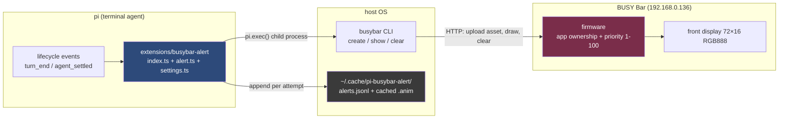
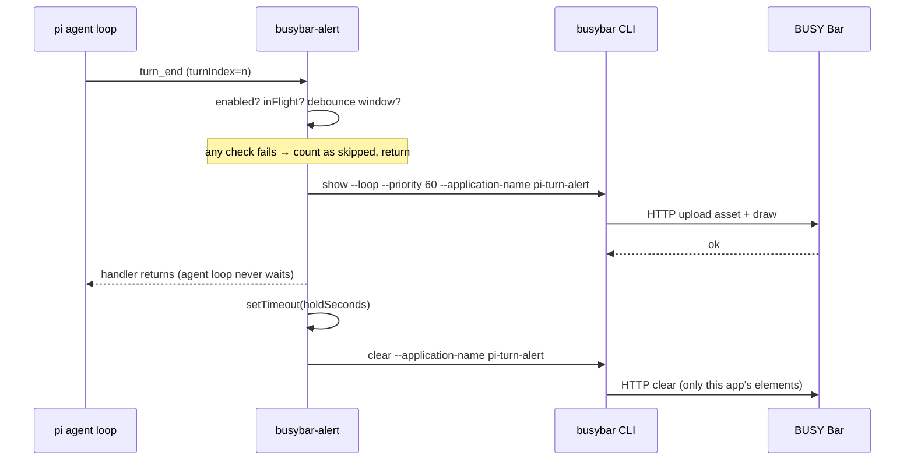

# BusyBar Alert — Turn-End Alerts on a LED Dock

BusyBar Alert is a pi extension that plays a short animation on a BUSY Bar LED dock every time an agent turn finishes. It connects two existing systems that know nothing about each other: the pi coding agent, which emits lifecycle events as it works, and the BUSY Bar, a network-attached desktop display driven by a Go CLI. The extension itself is deliberately small — roughly 800 lines of TypeScript — because all the interesting decisions are about *where* the boundary between the systems should sit, not about code volume.

> [!summary]
> The project has three durable ideas worth preserving:
> 1. A physical notification channel for agent completion, built as a thin adapter between two documented interfaces rather than as new protocol code.
> 2. A trigger-semantics analysis of pi's lifecycle events: `turn_end`, `agent_end`, and `agent_settled` are three different signals, and choosing the wrong one produces either alert spam or missed alerts.
> 3. An observability pattern for hardware-adjacent extensions: every alert attempt is appended to a JSONL log, which makes end-to-end verification a file read instead of an eyewitness report.

## Why this project exists

Agentic coding sessions have an attention problem. A single prompt can keep the agent working for minutes — thinking, calling tools, thinking again. The rational thing to do is switch to another window and come back when the agent is done. But terminals are silent about completion, so "come back when done" degenerates into periodic checking. The cost is not the checking itself; it is the background thread of attention the terminal continues to consume while you try to do something else.

The BUSY Bar solves the notification half of this problem physically. It is a small LED dock with a 72×16 RGB front display that sits in peripheral vision. If the agent could flash it on completion, the "is it done?" check would become free. What was missing was the connection: pi knows when work finishes, the bar knows how to display things, and nothing translated between them.

The project exists to build that translation correctly. "Correctly" has a specific meaning here, and most of this report is about it: the extension must never slow down or crash the agent loop because of hardware, must not spam the display when turns end in rapid succession, and must fail quietly and observably when the device is unplugged.

## The three systems

Understanding the extension requires understanding the three systems it sits between, because the design is mostly a consequence of their boundaries.

**pi** is a terminal coding agent written in TypeScript. It loads extensions as TypeScript source listed in `.pi/settings.json` — there is no build step and no plugin packaging. Extensions receive an `ExtensionAPI` object and subscribe to lifecycle events with `pi.on("turn_end", handler)`. The API also exposes `pi.exec(command, args, options)`, a promise-based child-process runner that returns `{ stdout, stderr, code, killed }`. These two primitives — event subscription and process execution — are the entire surface the extension uses.

**busybar** is a Go CLI that owns the device protocol. It builds animation assets (`create`, `compile`), validates them (`inspect`), uploads and draws them (`show`), removes them (`clear`), and runs a hardware capability tour (`smoke`). Every command emits structured output (`--format json` / `jsonl`), which makes it automation-friendly by design. The extension contains no device protocol code at all; it shells out to this CLI for everything.

**The BUSY Bar firmware** is multi-tenant. Each client draws under an *application name*, and each draw carries a *priority* from 1 to 100. A draw is rejected with HTTP 409 if a higher-priority application is active. `clear` removes only the elements owned by one application name — it does not touch the clock or other applications. These two rules (ownership and priority) shape the extension's defaults: it draws under the application name `pi-turn-alert` at priority 60, above ambient applications but below deliberate priority-100 takeover applications.



The responsibilities are separated on purpose. pi knows *when* a turn ends. The CLI knows *how* to talk to the device. The extension knows only the translation between them. That separation is what makes the extension small, and it is also what makes it robust: improvements to the device protocol arrive through CLI upgrades, not through extension changes.

## Trigger semantics: three events that are not interchangeable

The most consequential design decision is which pi event triggers the alert, and it is consequential because the obvious answer is subtly wrong in two different directions.

pi emits a family of lifecycle events. Verified against the installed package (`@earendil-works/pi-coding-agent` 0.82.1):

| Event | Fires when | Payload | Alert behavior if used |
| --- | --- | --- | --- |
| `turn_start` / `turn_end` | Each turn (one LLM response plus its tool calls) | `turnIndex`, `message`, `toolResults` | Correct per spec, but fires many times per prompt |
| `agent_start` / `agent_end` | A low-level agent run begins/ends | `messages` | Fires too early: pi may auto-retry, auto-compact and retry, or consume queued follow-ups after `agent_end` |
| `agent_settled` | pi will not continue automatically; `ctx.isIdle()` is true | — | Fires exactly once per prompt, but misses per-turn granularity |

A turn is one model response plus the tool calls it triggered. A single user prompt routinely produces several turns in a row. The user's requirement — "an alert when a turn finishes" — maps literally to `turn_end`, and that is the implemented default. But a naive `turn_end` subscription would flash the bar on every intermediate turn, which for a physical display is spam. The resolution is not to change the event but to add two controls:

- **A debounce** (`minIntervalMs`, default 2000 ms). Turns in a burst collapse into one alert; the skipped attempts are counted and logged, not hidden.
- **A mode setting** (`alertOn: "turn_end" | "agent_settled"`). Users who want exactly one flash per prompt can select `agent_settled` without a code change, because the wiring for both events is installed at startup and each hook checks the mode.

The distinction between `agent_end` and `agent_settled` is worth internalizing because it generalizes beyond this project: in any pi status integration, `agent_end` means "a run ended" while `agent_settled` means "the agent is now idle and waiting for the user." Notifications about *completion* belong on `agent_settled`; notifications about *progress* belong on turn events.

## The alert cycle

One alert cycle is a fixed sequence: debounce check, asset check, draw, hold, clear. The sequence was first built and validated as a shell script (ticket script `04-prototype-alert.sh`) so that device behavior could be studied without writing any TypeScript, and the extension's core module is a direct port of it.



Three properties of this cycle carry the design weight.

**The event handler never awaits the network.** `turn_end` handlers run inside pi's agent loop. If the handler awaited a 15-second device timeout, the agent would stall with it. The handler kicks off the cycle and returns immediately; a `setTimeout` owns the clear. If `show` hangs, `pi.exec`'s timeout kills the child process and sets `killed: true`, which the code maps to a "device unreachable" error — pi is unaffected either way.

**Cycles are serialized with an `inFlight` flag, and the flag is released only after the delayed `clear` completes.** Releasing it after `show` returns would allow a fast second turn to start a second `show` while the first animation is still on screen — two overlapping draws under one application name. The lock spans the entire visible period of the alert.

**The animation asset is built once and cached.** `busybar create --pattern spinner --display front --frames 12 --fps 12 --compile-output …` produces a 3990-byte `.anim` (12 frames, 12 fps, 72×16, RGB888). Rebuilding it per alert would add avoidable latency to a time-critical path, so `ensureAsset()` compiles on first use and reuses the file afterward. The cache lives in `~/.cache/pi-busybar-alert/` because the asset is a derived artifact, not source.

The core logic, reduced to its essential structure:

```ts
async function runAlertCycle(exec, settings, state, cacheDir, reason, hooks) {
  const now = Date.now();
  if (state.inFlight || now - state.stats.lastAlertAt < settings.minIntervalMs) {
    state.stats.skipped++;                       // debounce: count, don't hide
    return "skipped";
  }
  state.inFlight = true;
  state.stats.lastAlertAt = now;
  try {
    const anim = await ensureAsset(exec, settings, cacheDir);   // cached .anim
    await run(exec, buildShowArgs(settings, anim), 15_000);     // draw
    state.stats.fired++;
    setTimeout(() => {                                          // clear later,
      void run(exec, buildClearArgs(settings), 5_000)
        .finally(() => { state.inFlight = false; });            // then unlock
    }, settings.holdSeconds * 1000);
    return "fired";
  } catch (err) {
    state.inFlight = false;
    state.stats.errors++;                          // record, notify once, stay quiet
    return "error";
  }
}
```

The function never throws. It runs fire-and-forget from an event handler where a thrown exception would surface inside the agent loop, so every failure path is converted into a return value (`"fired" | "skipped" | "error"`), a stats counter, and a log entry.

## Implementation details

The extension lives at `extensions/busybar-alert/` in `/home/manuel/code/wesen/2026-04-21--pi-extensions` and follows the repo's shared framework: every extension registers itself with `registerPiExtension()` from `extensions/_shared/registry.ts`, which makes it visible in the `/px` launcher with actions, settings, and docs.

| File | Responsibility | Size |
| --- | --- | --- |
| `index.ts` | Registry registration, event hooks (`turn_end`, `agent_settled`, `session_start`, `session_shutdown`), four actions, four slash commands, status widget, JSONL log appender | ~230 lines |
| `alert.ts` | Device-agnostic core: argument builders, `ensureAsset` cache, debounced `runAlertCycle`, self-tests. Imports nothing from pi | ~300 lines |
| `settings.ts` | Settings schema, defaults with `BUSYBAR_ADDR`/`BUSYBAR_TOKEN` environment fallbacks, value apply/serialize | ~190 lines |
| `README.md` | User-facing documentation surfaced through the registry's `docs[]` | short |

Two implementation decisions deserve explanation because they are the reason the code could be verified before any hardware test.

**`alert.ts` takes an `ExecFn` instead of calling `pi.exec` directly.** The type is a two-line function signature:

```ts
type ExecFn = (command: string, args: string[], options?: { timeout?: number })
  => Promise<{ stdout: string; stderr: string; code: number; killed?: boolean }>;
```

`index.ts` injects `pi.exec`; the self-tests inject a fake that records arguments and returns canned results. This single indirection is what allowed the debounce logic, the argument construction, and the error-containment path to be tested under plain `node --experimental-strip-types` before pi was ever started. The self-test suite covers four properties: show arguments contain the device address, token, application name, priority, and `--loop`; clear arguments omit `--token` when no token is configured; a second alert inside the debounce window is skipped while the first is fired; and a failing exec is caught and counted rather than thrown.

**Every alert attempt is appended to `~/.cache/pi-busybar-alert/alerts.jsonl`.** This is the observability backbone of the project. A hardware extension has an awkward verification problem: the primary evidence of success is a light blinking on a desk, which does not survive into a bug report. The JSONL log converts physical events into durable records — timestamp, outcome, reason, asset path, error message. The end-to-end test in §Verification was verified entirely by reading this file.

The settings surface is a schema contribution (plain fields, no custom TUI): master `enabled` switch, `alertOn` mode, device `addr` and `token` (with environment fallbacks), `applicationName`, `display` (front/back, which must match the compiled asset's dimensions), `priority` (1–100, default 60), `holdSeconds` (default 3), `minIntervalMs` (default 2000), `pattern`, and `clearOnShutdown`. The repo's `/px` launcher renders this schema into a settings view automatically.

## Failure modes

The error matrix was designed before implementation, and each row maps to a specific code path:

| Failure | Detection | Behavior |
| --- | --- | --- |
| `busybar` not on `PATH` | `pi.exec` throws | Notify once: install busybar; status shows unreachable |
| Device unreachable | non-zero exit or `killed: true` (timeout) on `show` | One notification per session, then quiet; status `busybar:unreachable`; turns keep being skipped cheaply |
| HTTP 403 (token required) | `403` in stderr | Notification hints at the `token` setting / `BUSYBAR_TOKEN` |
| HTTP 409 (priority conflict) | `409` in stderr | Counted as an error; stats suggest raising `priority` |
| Asset/display mismatch (front asset on back display) | `inspect` at prepare time | The `prepare-assets` action rebuilds the cache for the configured display |
| Turns ending faster than the debounce | timestamp comparison | Silently skipped, counted in stats |

The design principle across all rows: **hardware failures are operational events, not agent events.** The worst outcome of an unplugged bar is one warning notification and a status-bar indicator — never a stalled turn, never a crashed session, never notification spam.

## Verification

The extension was verified in three layers, each catching a different class of defect.

**Layer 1: self-tests without pi.** Running `alert.ts` under `node --experimental-strip-types` with an injected fake exec: 4/4 pass. This layer caught a real bug on the first run — the debounce test failed because the fake exec returns exit code 0 for `busybar create` but cannot produce a real `.anim` file, so `ensureAsset`'s post-create existence check threw. The fix was to pre-seed the cached asset in the test harness, keeping the production check intact. A node-level import check of `index.ts` fails on the extensionless `../_shared/registry` import, but the known-good `session-context` extension fails identically — that is a limitation of node's loader, not a defect; pi's own loader resolves these imports.

**Layer 2: prototype against real hardware.** The shell prototype ran the full cycle — `create`, `inspect`, `show --loop`, hold 3 s, `clear` — against the device at `192.168.0.136`. Every stage returned `ok`, and no API token was required on this LAN. This validated the exact command sequence the extension would later port.

**Layer 3: end-to-end in a live agent session.** An interactive pi session was launched in tmux (a real pty, which the TUI requires) with the model `openai-codex/gpt-5.6-luna` at low thinking, from the repo directory so the project `.pi/settings.json` loaded the extension. One prompt that forces a bash tool call guarantees at least two turns. The resulting `alerts.jsonl`:

```json
{"ts":"2026-08-03T21:05:00.355Z","outcome":"fired","reason":"turn 0","anim":"/home/manuel/.cache/pi-busybar-alert/alert_front_spinner.anim"}
{"ts":"2026-08-03T21:05:02.075Z","outcome":"skipped","reason":"turn 1"}
{"ts":"2026-08-03T21:05:33.123Z","outcome":"fired","reason":"manual test","anim":"/home/manuel/.cache/pi-busybar-alert/alert_front_spinner.anim"}
```

Read the three lines in order and they tell the whole story of the design working as specified. Turn 0 fired an alert, compiling the asset on the fly through `ensureAsset`. Turn 1 arrived 1.7 seconds later — inside the 2000 ms debounce window — and was correctly skipped. The third line is a manual `/busybar-alert-test`, which bypasses the debounce and fired normally. The status bar showed `busybar:on` throughout, and the notification `Alert sent to 192.168.0.136 (app "pi-turn-alert", front, hold 3s)` confirmed the manual path.

One environment-specific trap surfaced during this test and is worth recording: the bare model pattern `--model gpt-5.6-luna` resolved to the provider `azure-openai-responses`, for which no credentials exist on this machine, and the session failed before reaching the extension. The model also exists in the `openai-codex` catalog (ChatGPT-backend OAuth, which is configured), and the provider-qualified form `openai-codex/gpt-5.6-luna` resolves unambiguously. When a model name exists in more than one catalog, always qualify the provider.

## Alternatives considered and rejected

**Direct HTTP from the extension.** Calling the device's HTTP API with `fetch()` would save a process spawn of roughly 50–100 ms but would re-implement asset upload, priority arbitration, and error mapping — all of which the CLI already maintains. Against a 3-second hold time the spawn cost is irrelevant. Rejected: it acquires protocol ownership for no measurable benefit.

**The `busybar script` goja host.** The CLI can host a persistent CommonJS application with `require("busybar")` and a WebSocket input stream — the right tool for interactive, button-driven applications. This extension is the opposite shape: rare, one-shot, output-only. A persistent host process per pi session adds lifecycle management for zero benefit. Rejected for v1; it is the natural path if button input is ever added (for example, "press the bar's button to refocus the terminal").

**Alerting on `agent_end`.** Covered in the trigger-semantics section: `agent_end` does not mean the agent is idle, because auto-retry and auto-compaction can continue the run. The correct "idle" signal is `agent_settled`, and it is exposed as a setting rather than hardcoded.

## Current status

The extension is implemented, tested, and committed in the pi-extensions repository (commit `aa787b2`, ticket docs in `34ab2ce`). It is registered in the project-level `.pi/settings.json`, so every pi session started in that repository loads it. The full design package — intern-ready implementation guide, six-step diary, evidence captures of the CLI help surface and pi event documentation, and the numbered validation scripts — lives in docmgr ticket `PI-EXT-BUSYBAR-ALERT` at `ttmp/2026/08/03/PI-EXT-BUSYBAR-ALERT--pi-extension-turn-end-alert-to-busy-bar-dock/`, and a bundled PDF of the design doc and diary is on the reMarkable at `/ai/2026/08/03/busybar-alert`.

## Open questions

- Should alerts be suppressed for sessions on machines without a bar on the network? Currently the extension handles this gracefully (one warning, then quiet), but the status bar shows `busybar:unreachable` indefinitely.
- Is priority 60 the right default? It sits above ambient applications and below takeover applications, but real-world arbitration behavior depends on what else the user runs on the device.
- Would per-turn alerts with a longer debounce (say 10 seconds) serve better than the 2-second default for users who keep `alertOn: turn_end`?

## Near-term next steps

- Persist settings across pi restarts; currently the schema `onApply` updates in-memory state only, so the environment variables (`BUSYBAR_ADDR`, `BUSYBAR_TOKEN`) are the durable configuration path.
- Add a global install entry in `~/.pi/agent/settings.json` so the extension loads in every repository, not just this one.
- Consider back-display (160×80 gray4) alerts with turn metadata — model name, turn index, elapsed time — rendered as text elements.

## Project working rule

The extension is an adapter, and it should stay one. Any feature that requires knowing the device's wire protocol belongs in the busybar CLI, not in the extension. Any feature that requires knowing pi's internals beyond the public event and exec APIs belongs upstream in pi. The extension's entire job is the translation policy: when to fire, how often, at what priority, and what to record.

## Important project docs

- Design and implementation guide: `ttmp/2026/08/03/PI-EXT-BUSYBAR-ALERT--pi-extension-turn-end-alert-to-busy-bar-dock/design-doc/01-busybar-turn-alert-extension-design-and-implementation-guide.md`
- Six-step implementation diary: same ticket, `reference/01-diary.md`
- Validation scripts (`01`–`04`, including the shell prototype of the alert cycle): same ticket, `scripts/`
- Extension source: `extensions/busybar-alert/` in `/home/manuel/code/wesen/2026-04-21--pi-extensions`
- Framework conventions: `docs/pi-shared-extension-framework-guide.md` in the same repository
- busybar CLI source project (read-only for this work): `/home/manuel/code/wesen/2026-08-02--busy-bar-pi`
