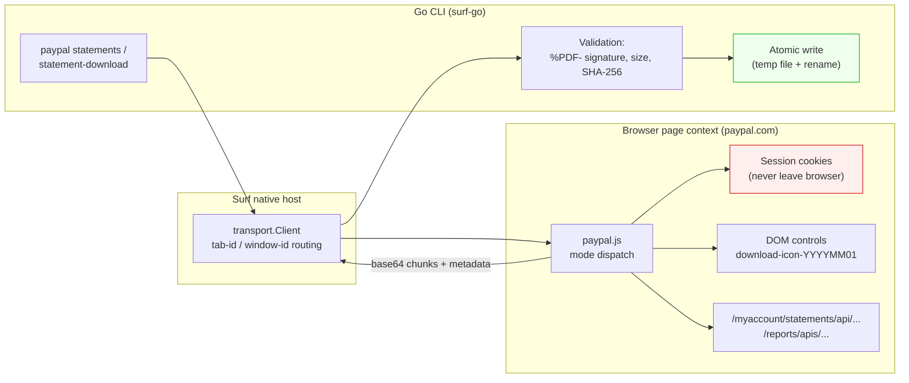
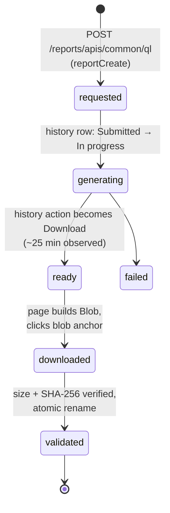

# surf-go: PayPal Statement and Activity Download Deep Dive

This report analyzes how `surf-go` acquired two PayPal download capabilities — monthly statement PDFs and Activity Download CSV reports — and, more importantly, how the underlying page-context contracts were discovered without ever exposing credentials, cookies, tokens, or financial row data to the Go process or to any durable artifact. The monthly statement path is implemented and live-validated. The Activity Download path is fully characterized end-to-end, including a validated real CSV artifact, and is ready for implementation. The ticket workspace is `ttmp/2026/08/03/SURF-20260803-PAYPAL1--design-paypal-statement-and-transaction-download-verbs` in `/home/manuel/code/wesen/surf-cli`.

> [!summary]
> - The browser tab is the authentication authority. Go never sees credentials, cookies, session tokens, or PayPal's internal `document_id` values; page-context JavaScript owns every institution-specific secret and identifier.
> - Every production contract was established by redaction-first probes against the live page before any code was written: probe first, lock the contract, then implement.
> - PayPal Activity Download is not a URL download. It is an asynchronous report job whose bytes materialize as an in-memory Blob inside the page; retrieving them requires intercepting `URL.createObjectURL` and suppressing the page's own anchor click.
> - A signed-out page and an unentitled page look identical until you test authentication first. The initial "no report controls" conclusion was wrong; it was session expiry.

## Why this project exists

Financial institutions expose data through authenticated web sessions, not through stable public APIs. PayPal's official Transaction Search API exists, but it requires OAuth client credentials, a merchant reporting scope, and a secret-management story that is deliberately out of scope for this tool. The design decision at the center of `surf-go` is therefore: use the browser session the user already has, and treat the page's JavaScript context as the only place where institution-specific state is allowed to exist.

This decision has a consequence that shapes everything else. The Go process — the part that writes files, prints structured output, and gets committed to a repository — must never receive anything that could function as a credential or as a durable institution identifier. Cookies stay in the browser. `fetch` runs with `credentials: 'include'` inside the page. PayPal's internal report `document_id` is used by page code and discarded. What crosses the boundary is normalized data: month strings, byte counts, SHA-256 digests, and base64 chunks destined for exactly one validated file write.

## The system boundary

The architecture has three layers, and the boundary between the second and third is where all the interesting constraints live.



The red node is the point of the design: authentication state exists only inside the page. The green node is the other non-negotiable: bytes become a file only after signature validation, and the file appears only via an atomic rename, so a failed or partial download can never leave a truncated artifact behind.

Two failure modes motivated this shape. First, an intercepted or expired session must surface as a typed error (`signed-out`, `not-ready`, `unavailable`), never as an empty success — a blank report page is not the same thing as zero transactions. Second, anything written to disk must be complete and verified, because these artifacts feed downstream accounting workflows that cannot distinguish a truncated CSV from a truthful one.

## The monthly statement contract

### Discovery before implementation

The monthly statements page (`/myaccount/statements/monthly`) renders year accordions with per-month Download buttons. DOM structure alone is not a contract — class names and component hierarchies change with every frontend deploy. The durable anchor turned out to be a `data-testid` attribute on each button: `download-icon-2026 0601`-style values encoding the month directly as `YYYYMM01`. The page script derives its entire listing from these attributes, which means the CLI's month selector is grounded in PayPal's own test hooks rather than in pixel position or row order.

The HTTP contract was locked by a fetch-interception probe that recorded only path, query-key names, and value shapes until the final step, which captured the two static values that matter:

- `GET /myaccount/statements/api/statements/download`
- `monthList=YYYYMM01` (first day of the requested month, eight digits)
- `reportType=standard`

The public CLI interface accepts `YYYY-MM`. The translation to PayPal's encoding happens inside page context and nowhere else:

```javascript
const monthList = `${month.replace('-', '')}01`;
const reportType = 'standard';
const url = new URL(DOWNLOAD_PATH, location.origin);
url.searchParams.set('monthList', monthList);
url.searchParams.set('reportType', reportType);
const response = await fetch(url, {credentials: 'include'});
```

### Moving bytes without trusting the channel

The native-host message channel has practical size limits, so the page script returns the PDF in base64 chunks of 500,000 bytes with an offset cursor. Go drives the loop and enforces progress:

```go
requestOptions["offset"] = lastOffset
data, err := runPayPalJS(ctx, settings, requestOptions)
// ...
offset, ok := numberAsInt(data["offset"])
if !ok || offset != lastOffset {
    return nil, fmt.Errorf("unexpected chunk offset %v; want %d", data["offset"], lastOffset)
}
output = append(output, chunk...)
if done {
    return output, nil
}
if len(chunk) == 0 {
    return nil, fmt.Errorf("no progress at offset %d", lastOffset)
}
lastOffset += len(chunk)
```

Three properties of this loop are worth stating explicitly. The offset is verified on every iteration, so a misbehaving page cannot silently interleave or repeat chunks. An empty non-final chunk is an error, so the loop cannot spin forever. And the reassembled bytes are validated before they touch a permanent path:

```go
if len(bytes) < 5 || string(bytes[:5]) != "%PDF-" {
    return nil, errors.New("PayPal statement response is not a PDF")
}
```

The write itself is atomic: create a temp file in the destination directory, chmod, write, close, rename. A `committed` flag and a deferred cleanup guarantee that any failure before the rename removes the temp file. The rename is the commit point.

### Live validation

The implemented commands were validated against the real account in Surf tab `441403489`:

| Operation | Result |
|---|---|
| `paypal statements` | 25 monthly statements listed |
| `paypal statement-download --month 2026-06` | 280,872-byte PDF, `%PDF-1.4`, written to `~/Downloads/paypal-live/statement-2026-06.pdf` |

The artifact lives outside the repository. Nothing about it — bytes, extracted text, account identifiers — appears in the ticket, the diary, or git.

## The Activity Download investigation

This is the part of the project where the interesting mistakes happened, and where the investigation method mattered more than the code.

### First attempt: a wrong conclusion from a signed-out page

The first probe of `/reports/dlog` found a route titled "Reports" with no usable controls, and the initial interpretation was that the account lacked the reporting entitlement. That conclusion was wrong. A later probe showed the route redirecting to `/signin` — the session had expired. The corrected rule is now written into the design guide: **check authentication before interpreting a missing surface**. A signed-out page and an unentitled page are indistinguishable until you test which one you are looking at.

### The submission contract

After reauthentication, the Activity Download form appeared with transaction-type choices (All transactions, Completed payments, Balance affecting) and five output formats (CSV, TAB, PDF, QuickBooks IIF, Quicken QIF). A redaction-first XHR interception captured the creation request's structure without capturing its values:

```json
{
  "method": "POST",
  "path": "/reports/apis/common/ql",
  "topLevelKeys": ["apiType", "formdata", "isAdmin", "reportType"],
  "values": {"apiType": "reportCreate", "reportType": "DLOG"},
  "formdata": {
    "delivery_channel": "WEB",
    "file_format": "CSV",
    "name": "DLOGCONSUMERTEMPLATE",
    "start_date": {"kind": "date", "length": 14},
    "end_date":   {"kind": "date", "length": 14},
    "filters":    {"kind": "text", "length": 17}
  }
}
```

The static values (`reportCreate`, `DLOG`, `WEB`, `DLOGCONSUMERTEMPLATE`) are recorded because they are constants of the form, not of the account. The date and filter values are recorded only as shapes. The response contains a `document_id` — which the probe deliberately did not store, because the design treats it as a page-owned identifier, not as a Go-facing API token.

### The asynchronous lifecycle

Report generation is not synchronous. The submitted report appeared in the history table as `Submitted`, moved to `In progress`, and stayed there through roughly ninety seconds of polling. About twenty-five minutes later, after a page reload, the action column showed `Download`. A refresh endpoint (`POST /reports/apis/dlog/ql`) backs the history table, and ready rows persist across reloads.



Any future `activity-export` command must model this as an explicit state machine with a long polling budget. A command that assumes request-response semantics will report failure on every real run.

### The byte source: why "Download" is not a download

The final unknown was what actually happens when the ready row's Download button is clicked. The first controlled click showed a `POST /reports/apis/common/ql` returning HTTP 200 — and nothing else. No file appeared anywhere under `$HOME`. No `Content-Disposition` header was visible. A naive implementation would have concluded the download silently failed.

A second probe instrumented the browser's object machinery instead of the network layer, and the mechanism became visible:

1. The page receives the report bytes from the POST response.
2. It constructs an **in-memory `Blob`** (observed size: 1059 bytes, `blob.type` empty).
3. It calls `URL.createObjectURL(blob)` and clicks an anchor with `href=blob:...` and `download="Download.CSV"`.
4. The browser-native blob download goes to an uncontrolled location — in this environment, nowhere findable at all.

The retrieval strategy follows directly: intercept `URL.createObjectURL`, keep the Blob reference, suppress the anchor click (the row stays ready and can be re-clicked, so nothing is lost), read the bytes in page context, and return them through the same chunked base64 channel the PDF path already uses:

```javascript
URL.createObjectURL = function (obj) {
  const url = origCreate(obj);
  if (obj instanceof Blob) window.__surfReportBlob = obj;
  return url;
};
HTMLAnchorElement.prototype.click = function () {
  if (String(this.href || "").startsWith("blob:") && window.__surfReportBlob) {
    return; // suppress the uncontrolled browser download
  }
  return origAnchorClick.apply(this, arguments);
};
```

The captured report was decoded once, verified by size and SHA-256 before the atomic rename, and written to `~/Downloads/paypal-live/activity-2026-08-03.csv`: 1059 bytes, 7 lines, 15 header columns beginning `"Date","Time","TimeZone","Name","Type","Status","Currency","Amount","Fees",...` — the documented Activity Download header shape. The base64 payload traveled from page context to a local temp file to the artifact path and was never echoed into the transcript, the ticket, or git. The stored probe result contains metadata only and says so explicitly.

## What was tricky

**Redaction-first probing is a discipline, not a filter.** Every probe in this project was written to capture structure — key names, value shapes, control labels, MIME types — and to actively avoid values. Dates were replaced with `[DATE]` markers in-page before leaving the browser. The one attempt to capture a filter's exact value was abandoned in favor of a key-tree shape. This discipline is what makes the ticket workspace safe to commit: a reviewer can read every probe result without encountering account data.

**Session state masquerades as product state.** The signed-out reports page produced a confident but false "unavailable" conclusion. The fix was procedural, not technical: reauthenticate, re-probe, and only then reason about entitlement.

**Blob downloads defeat download-directory assumptions.** Browser settings, download prompts, and headless configurations all influence where a `blob:` anchor's bytes land, if anywhere. Capturing the Blob in page context removes the variable entirely — the bytes travel the same audited channel as everything else, and the atomic write is the only path to disk.

**Empty MIME types are normal.** The report Blob carried no `type`. Format must therefore come from the requested `file_format` value, and validation must be signature- or schema-based (a `%PDF-` check for PDFs, a header-shape check for CSVs), never MIME-based.

## Current status

| Capability | State | Evidence |
|---|---|---|
| `paypal statements` | Implemented, live-validated | 25 statements listed from tab `441403489` |
| `paypal statement-download --month YYYY-MM` | Implemented, live-validated | 280,872-byte PDF, SHA-256 verified |
| Activity Download contract | Fully observed, artifact validated | 1059-byte CSV, SHA-256 `05432e08…cb392` |
| `paypal activity-export` command | Unblocked, not yet implemented | Design guide Section 7.3 |

## Open questions and near-term next steps

- Implement `paypal activity-export`: form fill (transaction type, date range, format), submit, poll history to ready with a budget measured in tens of minutes, Blob capture, validated atomic write. Task `[zf2l]` in the ticket tracks this.
- Verify the Blob byte source holds for TAB, PDF, IIF, and QIF formats; only CSV is proven.
- Measure how generation latency scales with date-range size; the single observation (~25 minutes for one day) may be a floor or a constant.
- Determine whether `Download all` on the monthly page is a repeated per-month request or a separate ZIP contract.
- Add mock-host integration tests and fixtures for both providers as hardening work.

## Important project docs

- Design guide: `/home/manuel/code/wesen/surf-cli/ttmp/2026/08/03/SURF-20260803-PAYPAL1--design-paypal-statement-and-transaction-download-verbs/design-doc/01-paypal-statement-and-transaction-download-verbs-intern-design-and-implementation-guide.md`
- Investigation diary (12 steps): same workspace, `reference/01-investigation-diary.md`
- Probe scripts and sanitized results: same workspace, `scripts/01`–`27`
- Implementation: `/home/manuel/code/wesen/surf-cli/go/internal/cli/commands/paypal.go`, `scripts/paypal.js`, `paypal_test.go`
- Related: [[Authenticated Bank of America Browser Verbs in surf-go - Deep Technical Project Report]] and [[PROJECT REPORT - surf-go Apple Card Statement Downloads]] (precedent providers, same boundary design)

## Project working rule

No capability ships from documentation, official or otherwise. A contract enters production code only after a redaction-first probe observes it against the live authenticated page, and a file exists only after signature validation and an atomic rename. When an observation and a conclusion conflict, reauthenticate and re-probe before believing either.
