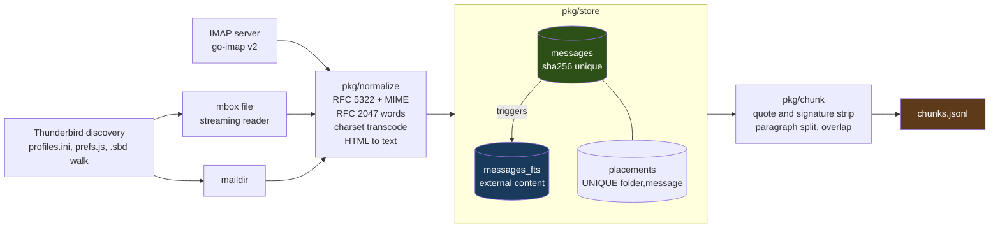
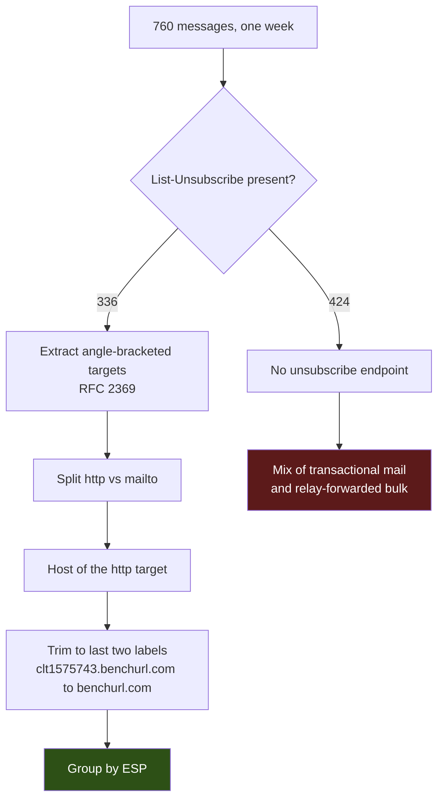

# PROJECT REPORT - bureau - Content-Addressed Mail Indexing and the Measurement That Rewrote the Roadmap

`bureau` reads email from IMAP servers and from local Thunderbird mail stores, normalizes it into one relational model, and writes it into SQLite with an FTS5 full-text index. The resulting database is queryable from the shell and chunk-ready for a retrieval-augmented generation pipeline. It was built in a single day from the `go-go-golems/go-template` scaffold and is 5,609 lines of Go across 13 commits.

The interesting content of this report is not the feature list. It is four decisions that were made against the obvious choice, and three claims that were stated confidently and then turned out to be wrong. Both categories are worth recording because both were settled by measurement rather than by reasoning, and in three of the seven cases the reasoning had produced the wrong answer.

> [!summary]
> - Deduplication keys on `sha256(raw bytes)`, not `Message-ID`. Message-ID is optional in practice, duplicated by mailing-list exploders, and forgeable. The cost is that a message differing only by an added `Received:` header stores twice; the benefit is that a false merge is impossible.
> - A message and its location are separate tables. One `messages` row, N `placements` rows. On a real Thunderbird profile this produced 16,403 messages against 16,975 placements from 17,138 records read — the arithmetic is the design working.
> - The mbox `From_` separator line is never parsed. Thunderbird writes two dialects and the IMAP offline caches, which hold most of the messages, emit a bare `From ` with no address and no date. Every field comes from the RFC 5322 headers that follow.
> - The FTS5 index is external-content, so the body text is not stored twice. That makes index maintenance manual, and the delete trigger must be spelled as a command row carrying OLD values or the index silently accumulates postings for rows that no longer exist.
> - Measuring an IMAP ingest overturned the roadmap's top performance item. 183.3 MB crossed the wire to keep 7.3 MB of indexed text, at 5% CPU. Batched transactions cannot help a network-bound path; selective part fetching can.
> - Aggregating mail by the host behind the `List-Unsubscribe` link rather than by sender collapsed six lookalike domains sending 39 messages a week into one Benchmark Email account.

## Why this project exists

Twenty years of mail spread across four Gmail accounts, an iCloud account, a Cyrus server and a local Thunderbird archive is not queryable. Each of the available approaches fails for a specific reason:

- **Thunderbird's own index** is locked inside Thunderbird. `global-messages-db.sqlite` declares `CREATE VIRTUAL TABLE messagesText USING fts3(tokenize mozporter, ...)`, and `mozporter` is a tokenizer Thunderbird registers at runtime inside its own process. Any external SQLite fails on first read with `unknown tokenizer: mozporter`.
- **IMAP `SEARCH`** is server-side, inconsistent between servers, and returns no structured data.
- **`grep` over mbox files** finds base64-encoded gibberish, misses anything in a non-UTF-8 charset, and cannot distinguish a quoted reply from original text.

The mozporter claim was verified rather than assumed. The probe is preserved in the repository at `ttmp/2026/08/03/BUREAU-001--*/scripts/02-thunderbird-probe.sh` and reads the non-FTS tables successfully — 182,686 rows in `messages`, a clean folder-URI map in `folderLocations` — while failing on the FTS table. gloda is therefore usable as a folder-naming hint and never as a search backend.

## Architecture

Acquisition is plural; normalization is singular. Three source readers converge on one parser, so the IMAP path and the mbox path cannot disagree about what a message means.



The dependency direction is strictly one-way. `pkg/model` imports nothing but `time`. `pkg/store` knows nothing about IMAP or mbox. `pkg/mailsrc/*` knows nothing about SQLite. Coordination lives in `pkg/ingest`.

| Package | Lines | Responsibility |
|---|---|---|
| `pkg/model` | 145 | Normalized `Message`, `Address`, `Attachment`, `Placement` |
| `pkg/normalize` | 372 | RFC 5322 and MIME to `Message`; HTML-to-text scanner |
| `pkg/mailsrc/mbox` | 202 | Streaming Berkeley mbox reader |
| `pkg/mailsrc/maildir` | 111 | Maildir enumeration and flag parsing |
| `pkg/mailsrc/thunderbird` | 426 | `profiles.ini`, `prefs.js`, `.sbd` folder walk |
| `pkg/mailsrc/imapsrc` | 637 | go-imap v2 wrapper, streaming FETCH, `SEARCH SINCE` |
| `pkg/store` | 767 | Schema, migrations, FTS5, idempotent upsert, BM25 search |
| `pkg/ingest` | 459 | Orchestration and the UIDVALIDITY sync algorithm |
| `pkg/chunk` | 258 | RAG chunking |
| `cmd/bureau` | 2,227 | 13 glazed commands |

## The deduplication key

The obvious primary key for a mail corpus is `Message-ID`. It is defined by RFC 5322 to be globally unique, and every message is supposed to carry one. It is not usable as a key, for five independent reasons:

- It is optional in practice. Mail with no `Message-ID` exists in any archive of sufficient age.
- Mailing-list exploders resend the same `Message-ID` to hundreds of recipients.
- Some clients reuse it across drafts.
- It is trivially forgeable, so a hostile message can deliberately collide with a real one.
- The same message stored in `INBOX` and in `Sent` has one `Message-ID` and genuinely different bytes, because the `Received:` chains differ.

`sha256(raw)` has none of these properties. Its meaning is unambiguous: these are literally the same bytes. The cost is that a message differing only by an added header stores twice. That is the correct direction to err — a duplicate row is visible and cheap, while a false merge silently destroys a message.

The second half of the model follows from the first. A message and its location are different facts, and Gmail's label model makes the distinction unavoidable: the same mail appears in `INBOX`, in `[Gmail]/All Mail`, and in three labels. Modelling location as columns on `messages` would force either duplicate rows or an array column.

```sql
CREATE TABLE messages (
    id            INTEGER PRIMARY KEY,
    content_hash  TEXT NOT NULL UNIQUE,     -- the dedup key
    message_id    TEXT,                     -- recorded, never keyed on
    subject       TEXT,
    participants  TEXT,                     -- denormalized for FTS5
    body_text     TEXT,                     -- denormalized for FTS5
    ...
);

CREATE TABLE placements (
    id          INTEGER PRIMARY KEY,
    message_id  INTEGER NOT NULL REFERENCES messages(id) ON DELETE CASCADE,
    folder_id   INTEGER NOT NULL REFERENCES folders(id) ON DELETE CASCADE,
    uid         INTEGER,                    -- IMAP UID
    byte_offset INTEGER,                    -- mbox offset
    UNIQUE(folder_id, message_id)           -- makes ingest idempotent
);
```

`UNIQUE(folder_id, message_id)` with `INSERT OR IGNORE` is what makes a re-run free. The upsert is one transaction:

```text
UpsertMessage(folderID, msg):
    BEGIN
    SELECT id FROM messages WHERE content_hash = ?
    if not found:
        INSERT INTO messages(...)          # trigger mirrors into messages_fts
        INSERT INTO addresses(...)  for each
        INSERT INTO attachments(...) for each
    INSERT OR IGNORE INTO placements(message_id, folder_id, uid, byte_offset, ...)
    COMMIT
```

The design is observable in the ingest counters from a real Thunderbird profile:

```text
folders=207  seen=17138  new-messages=16403  new-placements=16975  parse-errors=35  in 1m5.847s
```

735 records were byte-identical duplicates already stored. 572 messages live in more than one folder. Neither number required special handling; both fall out of the two constraints.

## FTS5 external content, and the trigger that fails silently

An FTS5 table stores its own copy of the indexed text by default. For a mail corpus that doubles the on-disk size, because the body is also wanted in a normal table for display. The `content=` option removes the duplication:

```sql
CREATE VIRTUAL TABLE messages_fts USING fts5(
    subject, participants, body_text,
    content='messages',
    content_rowid='id',
    tokenize='porter unicode61 remove_diacritics 2'
);
```

Two constraints follow, and both are easy to violate.

**The FTS5 column names must exist as columns in the content table.** FTS5 reads values back out of `messages` by name. This is the reason `messages` carries denormalized `participants` and `body_text` columns rather than reconstructing participants from the `addresses` table at query time. With `content=`, reconstruction is not possible.

**The index is not maintained automatically.** Every write must be mirrored. The insert trigger is unremarkable; the delete trigger is not. A delete is spelled as an insert of a *command row* whose first column is the table name and whose first value is the literal string `'delete'`, carrying the OLD values:

```sql
CREATE TRIGGER messages_ad AFTER DELETE ON messages BEGIN
    INSERT INTO messages_fts(messages_fts, rowid, subject, participants, body_text)
    VALUES ('delete', old.id, old.subject, old.participants, old.body_text);
END;
```

Getting this wrong produces no error. The index accumulates postings for rows that no longer exist, and searches begin returning hits that fail to join. The symptom appears later, in a different subsystem, as a deleted message that keeps showing up. `TestFTSIndexIsMaintainedOnDelete` in `pkg/store/store_test.go` exists specifically to make the failure loud: it deletes a row through raw SQL and asserts the search goes quiet.

Two further FTS5 details that cost time:

- **`bm25()` returns negative scores**, and more relevant means more negative. Ranking is `ORDER BY bm25(t) ASC`. Reversing it returns the worst matches first and is not obvious from eyeballing output.
- **The tokenizer is baked into the index.** Changing `remove_diacritics` or dropping `porter` requires a full rebuild.

The driver is `modernc.org/sqlite` v1.55.0, a pure-Go translation of SQLite, chosen over the cgo-based `mattn/go-sqlite3` so that `CGO_ENABLED=0` builds and cross-compilation work. That FTS5 is present in the pure-Go build was verified before the decision, not after. The probe is preserved at `scripts/01-fts5-probe.go`:

```text
sqlite version: 3.53.3
hit: Invoice 42   snippet="Your [invoice] is [overdue], please pay Ünicode" bm25=-0.0000
diacritic-folded hit: Invoice 42
external-content hit: Hello
ALL FTS5 PROBES PASSED (pure-Go, CGO_ENABLED=0 capable)
```

## The mbox separator line

An mbox file is a concatenation of messages, each preceded by a line beginning with the five bytes `From ` — capital F, then a space, which is what distinguishes it from a `From:` header. Most documentation shows a sender address and a date on that line, and most tutorials extract them.

That is wrong for this corpus. Measured against a real Thunderbird profile:

| File | First separator line |
|---|---|
| `Mail/Local Folders/Drafts-…` | `From - Sat, 08 Jul 2023 16:50:18 GMT` |
| `ImapMail/imap.gmail.com/INBOX` | `From ` |
| `ImapMail/imap.gmail-1.com/INBOX` | `From ` |
| `ImapMail/imap.gmail-2.com/INBOX` | `From ` |
| `ImapMail/mail.bl0rg.net/INBOX` | `From ` |

The IMAP offline caches, which hold the overwhelming majority of messages, write a bare `From ` with no address and no date at all. A parser that trusts the separator produces empty senders for almost the entire archive. The design rule is therefore absolute: **the `From_` line is a record delimiter and nothing else**, and every field derives from the RFC 5322 headers that follow it. `mbox_test.go` encodes both dialects as fixtures and asserts the sender survives in each.

A second property of the format has no clean solution. Writers are supposed to escape body lines that would otherwise look like separators, by prefixing `>`. There are two incompatible conventions — mboxo escapes `From `, mboxrd escapes `>*From ` — and no marker recording which was used. A body line reading `>From the desk of Alice` is indistinguishable from an escaped one. Measured in the first 50 MB of one INBOX: 706 lines matching `^From ` and 15 matching `^>From `, with no way to classify the 15. The reader therefore does not unescape by default. A stray `>` in a body is a smaller defect than corrupting legitimately quoted text.

The reader is streaming, because a single INBOX on this machine is 180 MB. It uses `bufio.Reader.ReadBytes('\n')` with a 256 KiB buffer rather than `bufio.Scanner`, whose 64 KiB default token limit fails on the long base64 lines that attachments produce.

## Incremental IMAP sync

Every message in an IMAP mailbox has a UID that is stable and strictly ascending, but only relative to a `UIDVALIDITY` value the server reports on `SELECT`. `UIDVALIDITY` is the generation number of the UID space. If it changes — the mailbox was deleted and recreated, the server was migrated, a backup was restored — every stored UID refers to nothing.

`UIDNEXT` is the UID the server will assign next, which makes the sync rule a single sentence: everything with UID at or above the previously observed `UIDNEXT` is new.

```text
for each mailbox:
    server = SELECT mailbox (read-only)
    stored = load_watermark(mailbox)

    if stored.uid_validity == 0:                       # never synced
        from = 1
    else if stored.uid_validity != server.uid_validity:
        delete_placements(mailbox)                     # stored UIDs are meaningless
        from = 1
    else:
        from = stored.uid_next

    UID FETCH from:*  (UID, FLAGS, INTERNALDATE, RFC822.SIZE, BODY[])
        normalize and store each

    if no error:                                       # partial pass must retry
        save_watermark({server.uid_validity, server.uid_next})
```

Two properties of this implementation are deliberate and easy to lose:

- **The mailbox is selected read-only.** A plain `BODY[]` fetch marks messages `\Seen`. A tool that marks forty thousand messages read is a tool that gets uninstalled. `imap.SelectOptions{ReadOnly: true}` makes the server refuse to set flags at all.
- **The watermark advances only after a clean pass.** A fetch that fails partway leaves the watermark untouched, so the next run retries from the same point rather than skipping the gap.

Deletions are not detected. A message removed on the server stays in the corpus. Doing it correctly requires QRESYNC (RFC 7162) or a full `UID SEARCH ALL` diff per folder on every run, and for a retrieval archive keeping deleted mail is usually the desired behavior.

### Testing this against a real server, not a mock

The plan was a mock using `go-imap/v2/imapserver`. Reading `go-go-golems/smailnail`, which had solved the same problem earlier, changed it: smailnail runs its IMAP tests against a real Dovecot in Docker.

The reason a real server is better here is specific rather than general. The logic under test is how a server issues `UIDVALIDITY` and what the client does when it changes. Against a mock, the test author chooses the `UIDVALIDITY` values, so the test proves only that fabricated numbers round-trip through the author's own code — it passes just as happily if the author's understanding of the protocol is wrong. Against Dovecot, deleting and recreating a mailbox genuinely reissues the UID space, verified before any test was written:

```text
pass 1: uidvalidity=1785772658 uidnext=3 nmsg=2
pass 2: uidvalidity=1785772661 uidnext=2 nmsg=1
=> UIDVALIDITY CHANGED on delete+recreate: the reset branch is testable
```

Two deliberate departures from smailnail's version. The fixture is an importable package, `pkg/mailsrc/imapsrc/imaptest`, rather than helper functions copy-pasted across two `_test.go` files. And each test creates its own uniquely-named mailbox instead of sharing `INBOX`, which removes the need for smailnail's lock file in `TempDir` — and, more importantly, is what makes `Recreate` safe. A shared INBOX cannot be deleted and recreated inside a test suite, so the UIDVALIDITY test exists only because of that change.

The test was verified by mutation rather than assumed to work. Deleting the reset branch from `pkg/ingest/ingest.go` produces:

```text
--- FAIL: TestDovecotUIDValidityChangeForcesResync (0.47s)
    MessagesSeen = 0, want 1; the UIDVALIDITY change should have reset the watermark
      and refetched from UID 1
    placements = 2, want 1
    messages = 2, want 3
```

`MessagesSeen = 0` is the production failure in miniature. Without that branch the client fetches `3:*` against a mailbox whose UIDs restart at 1, finds nothing, reports success, and silently loses every message.

## The measurement that rewrote the roadmap

The design guide listed batched transactions as the largest available performance win, on the reasoning that one transaction per message is obviously wasteful. Ingesting 2,367 messages from a real Cyrus server produced:

```text
folders=1  seen=2367  new-messages=2367  parse-errors=0  in 3m4.186s
7.89s user 2.39s system 5% cpu 3:04.24 total
```

13 messages per second, against 260 per second for a local ingest through the same store. CPU was 5%. Summing what actually crossed the wire:

| | |
|---|---|
| raw message bytes fetched | 183.3 MB |
| attachment payload, drained to `io.Discard` | 36.3 MB — 20% of transfer |
| body text actually indexed | 7.3 MB — 4.0% of transfer |
| effective throughput | 1.00 MB/s |

183 MB crossed the network to keep 7.3 MB. The largest single item was a 16 MB `video/mp4` downloaded in full, counted, and thrown away, because `bureau` fetches `BODY[]` — the entire message — and discards attachment bytes after recording their decoded size.

With 10.3 seconds of CPU inside 184 seconds of wall clock, batching transactions cannot help. It remains correct for local ingest, where 16,403 messages in 66 seconds is genuinely store-bound, so the item was rescoped rather than dropped. The measured bottleneck suggests a different fix: fetch `BODYSTRUCTURE` first, then request only the text parts. That eliminates the 20% that is provably pure waste, plus much of the remaining transfer, which is HTML markup and base64 inline images that the HTML-to-text extractor discards anyway. The cost is one extra round trip per batch, and a conflict with `--store-raw`, which cannot archive byte-exact messages that were never fully fetched.

`COMPRESS=DEFLATE` would be the other lever, and the server advertises it. `go-imap` v2.0.0-beta.8 has no COMPRESS support at all, so that route requires an upstream contribution.

The general form of the lesson: the schema made the waste measurable after the fact. Attachment sizes are recorded even though the bytes are discarded, so `SUM(attachments.size_bytes)` against `SUM(messages.size_bytes)` against `SUM(length(body_text))` turned an impression that the ingest felt slow into a ratio that named the fix.

## Bulk mail: the unsubscribe endpoint as the unit of analysis

The question that drove the last phase was concrete: what arrived last week, and what can be unsubscribed from. Two things were missing.

**A bounded time window.** Answering meant downloading a 60,847-message INBOX. `--since` now accepts RFC3339, `YYYY-MM-DD`, or relative forms (`7d`, `2w`, `3m`). For IMAP it becomes a server-side `UID SEARCH SINCE`, so a week costs a week of bandwidth: 760 messages in 78 seconds. The filter is also applied locally afterwards, because IMAP `SINCE` compares `INTERNALDATE` by date only and admits messages whose `Date:` header is older — 50 of 810 in the real run.

**The `List-Unsubscribe` header.** RFC 2369 gives bulk senders a place to declare themselves, and its presence is the most reliable available signal that a message is bulk mail rather than a person writing. Migration v2 adds `list_unsubscribe`, `list_id` and `precedence` to `messages`.

Capturing it required a correction. The header is defined to hold bare URLs, so the first implementation used `hdr.Get()`. Real senders emit it RFC 2047 encoded:

```text
List-Unsubscribe: =?us-ascii?q?=3Chttps=3A=2F=2Fclt1575743=2Ebenchurl=2Ecom=2Fud=3F9tSN8...
```

Storing that form makes the URL unusable, which defeats the point of capturing the header. Two regression tests now pin the encoded and plain forms.

The analytical result came from choosing a different aggregation key. Grouped by sender, six domains sending 39 messages in a week are six unremarkable rows. Grouped by the host behind the unsubscribe link:

```text
| messages | esp              | distinct_senders |
|       39 | benchurl.com     |                6 |
```

`kickstarnow.com`, `kickstargogo.com`, `kickstarterspot.com`, `kickstartgenius.com`, `kickstarternew.com` and `backerzone.com` all route through Benchmark Email and share the identical 10-character unsubscribe-token prefix `9tSN8Jgb1C`. That is one account operating six disposable lookalike domains, not six senders. Unsubscribing six times selects the wrong unit of action; the ESP is the right one.



The `registrable()` trim is a two-label approximation, not a Public Suffix List lookup. It collapses `clt1575743.benchurl.com` correctly and yields `co.uk` for a British sender. That is acceptable for detecting shared providers and wrong for anything that makes decisions per registrable domain.

## Three claims that were wrong

Each of these was stated with confidence and then contradicted by data. They are recorded because the pattern is more useful than any individual correction.

**The `profiles.ini` default-profile rule.** Every tutorial says the default Thunderbird profile is the `[ProfileN]` section carrying `Default=1`. On the development machine that key sits on `s5x2x3xh.default`, a stale leftover with no `prefs.js` at all, while the profile Thunderbird actually runs is named by a different mechanism entirely:

```ini
[InstallC9B8665BE591BAA4]
Default=spykft27.default-release
Locked=1
```

The `[Install<hash>]` section holds a path, is the profiles.ini Version 2 mechanism, and wins. The failure was immediate and loud — `open .../s5x2x3xh.default/prefs.js: no such file or directory` — which is the good case.

**The roadmap's top performance item.** Described above. Batched transactions were ranked first by reasoning about transaction overhead, without measuring where the time went.

**A headline statistic, produced by a defect in the command written to report it.** The analysis was reported as "46% of your week is one GitHub bot." The arithmetic did not reconcile: a senders row showing 352 messages for `notifications@github.com` plus a no-unsubscribe row showing 284 for the same address exceeded the 358 total for the whole domain. Checking directly:

```text
rows with from_addr = notifications@github.com: 352
    284 (unsub   0)  Manuel Odendahl
     65 (unsub  65)  chatgpt-codex-connector[bot]
      1 (unsub   1)  wesen-gitops-pr-bot[bot]
      1 (unsub   1)  github-advanced-security[bot]
      1 (unsub   1)  Rahul Rampure
```

`notifications@github.com` is a shared envelope address carrying five display names. The `senders` command reported `name` as the first name encountered and `unsub` as a boolean, so a group that is 284 non-unsubscribable personal notifications and 65 bot messages rendered as one unsubscribable bot. Acting on that row would have changed almost nothing.

The fix generalizes past this case, because shared envelope addresses are how most large senders operate. `name` is now the modal name with a `distinct_names` column, and `unsub` is a count rather than a boolean. Any aggregate over a heterogeneous group has to expose how mixed the group is, or it misleads.

The defect was found by cross-checking two views of the same data and noticing they disagreed. That check is worth performing deliberately rather than by accident.

## Verification

The hermetic suite requires nothing and runs in under a second:

```bash
GOWORK=off go test ./...          # 45 test functions across 5 packages
GOWORK=off make lint              # golangci-lint, 0 issues
GOWORK=off make glazed-lint       # glazed CLI conventions
GOWORK=off make logcopter-check   # generated logging areas current
```

The IMAP integration suite requires Docker and is gated behind `BUREAU_DOVECOT_TEST=1`, so the default run and CI stay hermetic:

```bash
make imap-fixture-up              # ghcr.io/spezifisch/docker-test-dovecot
make test-imap                    # 7 tests, all passing
make imap-fixture-down
```

The seven integration tests cover initial sync, incremental sync fetching zero on a no-op run, the UIDVALIDITY reset, `--full`, read-only `\Seen` safety, content round-tripping, and watermark behavior after an interrupted pass.

Coverage has a known shape. `NormalizeMailboxName` is exercised only by unit tests, because the Dovecot fixture reports `/` as its hierarchy delimiter and the function is a no-op there. That gap concealed a real defect: `--mailbox` matched the raw server name while `bureau folders` displayed the normalized one, so on Cyrus a user copying the displayed `INBOX/Archives/2018` into `--mailbox INBOX.Archives.2018` would match nothing and get a successful-looking no-op run.

## Current status

Working and verified against real data:

- Thunderbird profile discovery, mbox and maildir ingest — 207 folders, 17,138 messages, 0.2% parse errors
- IMAP incremental sync against Cyrus IMAPD 3.10.2 — 211 mailboxes on a `.` delimiter, 2,367 messages with zero parse errors
- FTS5 search with BM25 ranking, snippets, and structured filters
- RAG chunking with quote and signature stripping
- 13 glazed commands, all supporting `--format table|json|jsonl|csv|tsv|yaml`

Not built, in the order the measurements justify:

1. Selective IMAP part fetching — `BODYSTRUCTURE`, then text parts only
2. Batched transactions, scoped to local ingest
3. Parallel parsing with a worker pool feeding one writer
4. BM25 per-column weights
5. Conversation threading from the stored `References` and `In-Reply-To`
6. Attachment text extraction from PDF and Office documents
7. Deletion detection via QRESYNC
8. Embedding export and vector search

## Repo artifacts

- Repository: `/home/manuel/code/wesen/2026-08-03--mail-client`, module `github.com/go-go-golems/bureau`, local only with no remote
- Design guide: `ttmp/2026/08/03/BUREAU-001--*/design-doc/01-bureau-analysis-design-and-implementation-guide.md` — roughly 2,400 lines in eight parts, written for an engineer new to mail handling
- Implementation diary: `ttmp/2026/08/03/BUREAU-001--*/reference/01-diary.md` — nine steps recording what was tried and what failed verbatim
- Reproducible probes: `scripts/01-fts5-probe.go` and `scripts/02-thunderbird-probe.sh`
- Prior art consulted: `/home/manuel/code/wesen/go-go-golems/smailnail`, for the Dovecot-in-Docker test pattern

## Open questions

- Is the 1.00 MB/s ceiling the link or Cyrus throttling per connection? The number is suspiciously round. If it is per-connection throttling, parallel folder fetches are a better lever than fetching less data.
- How should the 424 messages with no unsubscribe endpoint be split? The bucket mixes genuine transactional mail with relay-forwarded bulk mail arriving through `privaterelay.appleid.com`. The two warrant opposite actions and `precedence` is captured but unused.
- Should the integration tests run in CI? They currently do not, matching smailnail. A sync regression is caught only when someone remembers to run `make test-imap`.
- Gmail and iCloud require app-specific passwords or OAuth2, so three of the five configured accounts are not yet reachable. Gmail's `[Gmail]/All Mail` duplication would be the strongest available test of the message-placement split.

## Key points

- Content-addressed deduplication is the right default for mail because the alternative key is optional, forgeable and non-unique in practice. Duplicate rows are a smaller failure than false merges.
- FTS5 external-content tables trade disk for manual index maintenance, and the delete path fails silently when the trigger is wrong. Write the test that deletes a row and asserts the index went quiet.
- Format documentation describes the format, not the files. Both the mbox separator rule and the `profiles.ini` default-profile rule were correct in the documentation and wrong on the disk of the machine being indexed.
- A fixture proves the code does what it was told to do; a real server tests whether what it was told was right. The delimiter defect existed in a code path that no fixture-based test could reach.
- Measure before optimizing, including when the bottleneck seems obvious. The reasoning about transaction overhead was sound and the conclusion was wrong, because it never asked where the wall clock went.
- Any aggregate over a group must expose how heterogeneous the group is. A modal value with a distinct count says something true; a first-seen value with a boolean does not.

## Related notes

- [[PROJECT REPORT - RAG-TTC PARC - Deterministic Obsidian Vault Extraction and Content-Addressed Indexing]] — the same content-addressing decision applied to vault extraction rather than mail
- [[PROJ - Smailnail SQLite Mirror, Merge, Enrich, and Annotation Report]] — the earlier IMAP project whose Dovecot-in-Docker test pattern this work adopted
