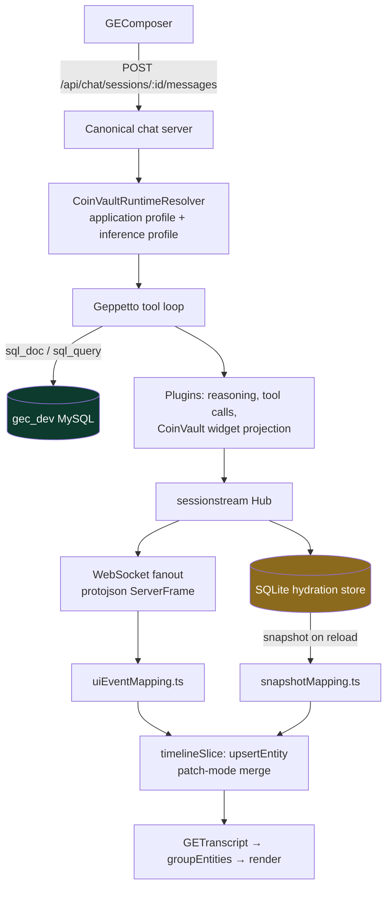
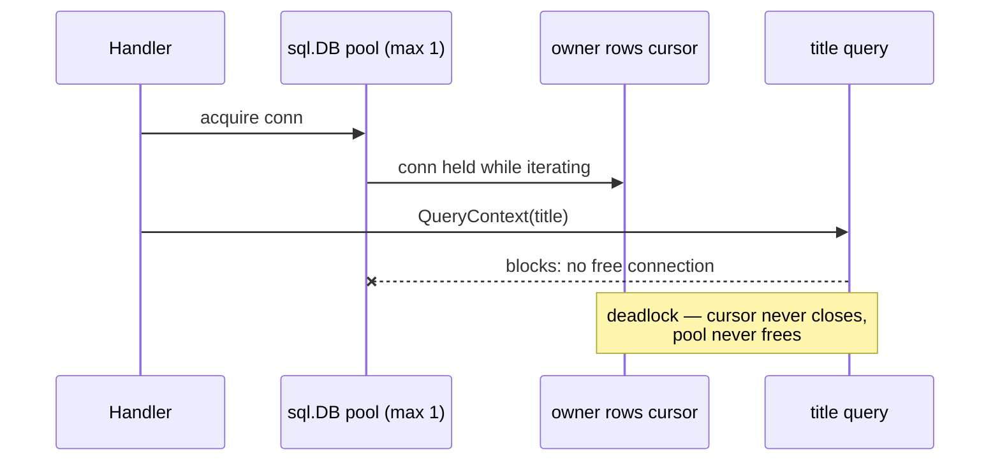
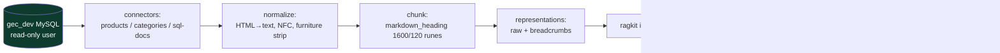

# CoinVault GEC-RAG — Golden Eagle UI Overhaul and RAG Adoption Plan

CoinVault is a Go chat backend plus embedded React frontend that answers business questions against the Golden Eagle Coin (GEC) MySQL database through an LLM tool loop. This note is the technical record of one working day (2026-08-04) that moved the project across three fronts: the repository was unblocked from a stale stash-pop conflict and migrated to glazed v1.4; the chat frontend was rebuilt end to end into the "Golden Eagle" visual and interaction system defined by a standalone prototype; and a concrete plan was written for adopting the rag-ttc retrieval pipeline as a reusable package feeding a `knowledge_search` tool. The first two are shipped and verified against the live inference engine. The third exists as a design document with a phased task list.

> [!summary]
> - The chat UI was replaced wholesale (retro-Mac terminal → Golden Eagle assistant) with **zero changes to the streaming data layer** — the entire overhaul is a render-time reinterpretation of the existing timeline-entity stream, which made reload-hydration parity automatic.
> - Two small additive backend endpoints carry the new UI: `GET /api/chat/conversations` (owner-filtered conversation list with titles derived from the hydration store) and `GET /api/stats/metals` (live spot prices from `metal_histories`).
> - The RAG plan (`GEC-RAG-ADOPT-001`) proposes extracting a reusable `ragkit` module from rag-ttc rather than reimplementing retrieval, and defines the SQL-dump-to-corpus pipeline: ~34k product descriptions cleaned from marketing HTML, faceted by 75k EAV attribute rows.

## Why this project exists

The GEC production system is a legacy PHP storefront over a large MySQL database (products, orders, members, purchasing, metals). CoinVault gives analysts a conversational interface to that data: a Geppetto inference loop with two tools — `sql_doc` (curated schema documentation) and `sql_query` (AST-validated read-only SELECT) — streaming every observable step to the browser over one protobuf-defined WebSocket. The parent architecture ticket, `GEC-RAG-PROD-001`, extends this into a grounded assistant by adding a third peer tool, `knowledge_search`, backed by an immutable document index with per-session evidence labels.

The day's goal had four parts: repair the repository (merge conflict, dependency bump), design and ship a new UI based on a product prototype (`~/Downloads/golden-eagle-logistics-assistant.jsx`, 1,416 lines of self-contained React with a scripted mock engine), plan the rag-ttc adoption, and keep intern-grade design documentation for all of it.

## Current project status

Five commits landed on `main`, all with lefthook pre-commit (golangci-lint + full test suite) passing:

| Commit | Content |
|---|---|
| `9178b59` | GEC-RAG-PROD-001 architecture ticket docs (pre-staged, committed separately) |
| `d5ed4bd` | glazed v1.4.2 bump + stash-conflict resolution + API migrations |
| `d73fdfb` | GEC-UI-OVERHAUL-001 and GEC-RAG-ADOPT-001 tickets with intern design guides |
| `24dec7d` | Golden Eagle chat UI, Phase 1, end to end |
| `874a88e` | Diary and ticket bookkeeping |

The new UI was verified in a real browser against a live model (`gpt-5-nano` via the pinocchio profile registry): streamed reasoning, a `sql_query` tool call completing in 927 ms with an expandable 200-row result table, an answer composed from live database rows, sidebar conversation titles served by the new endpoint, and a page reload that hydrated the identical transcript with zero console errors. Both design guides were bundled to PDF and uploaded to reMarkable under `/ai/2026/08/04/`.

## Project shape

```text
/home/manuel/code/gec/2026-03-16--gec-rag
  cmd/coinvault/            CLI: serve, chat send/export, sql-doc, schema-snapshot
  internal/webchat/         chat server assembly, runtime composition, projection plugin
    sessionstream/          canonical server, handlers, hydration, conversation list (new)
  internal/coinvaulttools/  tool catalog: sql_doc, sql_query registrars + prompt pack
  internal/sqltool/         AST-validated read-only SQL execution
  internal/projection*/     hidden-block extraction → deterministic DB lookup → typed widgets
  internal/stats/           quick stats + metals ticker endpoint (new)
  proto/coinvault/widgets/  typed widget contracts (buf → Go + TS)
  web/src/
    components/goldeneagle/ the new UI (new)
    store/, ws/             Redux timeline model + protobuf WebSocket stack (untouched)
  ttmp/2026/08/04/          GEC-RAG-PROD-001, GEC-UI-OVERHAUL-001, GEC-RAG-ADOPT-001 tickets
```

## Architecture

The system streams state, it does not request it. A submitted prompt returns only `{accepted: true}`; everything the user sees afterwards arrives as UI events over one WebSocket, and the same events are persisted so a page reload replays them as a snapshot.



The frontend's canonical model is one flat list of timeline entities:

```ts
interface TimelineEntity {
  id: string;              // messageId, toolCallId, or "<toolCallId>:result"
  kind: string;            // message | tool_call | tool_result | coinvault.*
  data: Record<string, unknown>;
  createdOrdinal: number;  // server-assigned ordering
  updatedOrdinal: number;
}
```

Streaming works by patching: a `ChatTextPatch` event carries `contentPatch` plus a `patchMode` (APPEND / REPLACE / SNAPSHOT), and `upsertEntity` merges it into the entity by id. Tool arguments accumulate the same way through `inputRawPatch`. Two mapper modules — `web/src/ws/uiEventMapping.ts` for live frames and `web/src/ws/snapshotMapping.ts` for reload snapshots — must produce identical entities; historically they are the source of hydration drift bugs, which is why the UI overhaul deliberately touched neither.

A second, independent path produces typed widgets. The system prompt instructs the model to append hidden blocks such as `<gec:inventory_table:v1>…yaml…</gec:inventory_table:v1>`; `internal/projectionsem` strips them from the visible stream, `internal/projectionlookup` re-queries MySQL deterministically, and `internal/webchat/coinvault_projection_feature.go` publishes protobuf `CoinVault*Upsert` events. The model never fabricates a table cell; the server does the lookup. This invariant survived the redesign untouched.

## Implementation details

### The central design decision: grouping at render time

The prototype renders each assistant turn as one nested unit — avatar, thinking, tool rows, answer card, suggestion pills. The production data model is a flat, ordinal-sorted entity list. The obvious implementation is to restructure the store into nested turns. That was rejected, because the store shape is shared by both mappers and by the hydration snapshot path, and any divergence between live and hydrated structure becomes a parity bug.

Instead, grouping is a pure function applied at render time (`web/src/components/goldeneagle/groupEntities.ts`):

```ts
interface TurnGroup {
  user?: TimelineEntity;
  thinking: TimelineEntity[];
  tools: Array<{ call?: TimelineEntity; result?: TimelineEntity }>;
  answers: TimelineEntity[];
  widgets: TimelineEntity[];   // coinvault.* projections
  errors: TimelineEntity[];    // coinvault.projection_error
}

// A new group starts at every user message. Tool results attach to their
// call by the id convention  result.id === call.id + ":result".
// Orphan results (hydration edge cases) render as result-only rows.
```

The function is unit-tested in isolation against six fixtures, including interleaved tool calls, orphan results, and entities that precede any user message. Because grouping consumes the store's existing sorted selector, hydration parity required no additional work: the reloaded snapshot produces the same entity list, so it produces the same groups. The empirical check confirmed it — reload rendered the identical transcript with zero console errors.

The failure mode this design avoids is worth stating precisely. If grouping lived in the store, every event mapper change would need a mirrored snapshot mapper change, and a missed mirror would produce a transcript that looks right while streaming and wrong after reload. By keeping the store flat, the class of bug is structurally excluded rather than defended against by discipline.

### Token remapping instead of CSS migration

The old UI styled roughly forty CSS modules against a retro-Mac variable namespace (`--mac-win-bg`, `--mac-border`, `--mac-stripe`, …). The five widget renderers (coin cards, inventory table, stats row, stock alert, shipment tracker) are pure presentation and were worth keeping. Rewriting their CSS would have been mechanical churn with regression risk.

The replacement token sheet (`web/src/theme/tokens.css`) therefore defines the Golden Eagle palette under a new namespace and then aliases the legacy names onto it:

```css
:root {
  --ge-gold: #8C6A1D;  --ge-cream: #F3EBD8;  --ge-market: #0D3B2E;
  --ge-surface: #FFFFFF;  --ge-border: #E5E5E3;  /* … */

  /* Legacy aliases: retro-Mac era component CSS reads these. */
  --mac-win-bg: var(--ge-surface);
  --mac-border: var(--ge-border-strong);
  --mac-stripe: var(--ge-surface-muted);
  /* … */
}
```

Every existing widget adopted the new look without a single edit to its own stylesheet. The truly Mac-specific chrome (`DesktopShell`, `MacWindow`, `MenuBar`) was deleted along with the old app shell. The alias block is explicitly transitional: when the legacy components are eventually rewritten or removed, the aliases go with them.

### The tool row state machine and honest latency

The prototype's most information-dense element is the tool row: name, argument preview, and a state that progresses through queued, running, done-with-latency, or failed. The backend emits `tool_call` and `tool_result` as two separate entities and attaches no timestamps to either. Two consequences follow.

First, the renderer merges the pair (via the grouping function above) and derives state:

```text
call present, no result, status ∉ {failed,error}   → running   (spinner)
result present, result.status ∉ {failed,error}     → done      (✓ + latency)
call.status or result.status ∈ {failed,error}      → failed    (✕ + expandable error)
```

Second, latency must be measured client-side — but only honestly. The component records `Date.now()` when it first observes the running state and reports the difference when the state settles. A transcript restored from hydration never passes through the running state, so it shows no latency at all rather than a fabricated zero. This distinction was forced by a lint rule, not chosen freely: the react-hooks purity checker rejected `useRef(Date.now())` in the render path (`Cannot call impure function during render`), and moving the capture into an effect made the observed-transition semantics the natural implementation.

The expanded row shows pretty-printed YAML arguments and, for results that project onto a table shape (`columns` + `row_arrays`), a Table/YAML toggle reusing the pre-existing client-side projection in `web/src/chat/tableProjection.ts`.

### The conversation list endpoint and a single-connection deadlock

The prototype's sidebar lists conversations; the production system had no API for it. Conversation ownership already persists in SQLite — `internal/webchat/sessionstream/conversation_authorization.go` maintains a `coinvault_conversation_owners` table keyed by session id — and the sessionstream hydration store keeps every timeline entity in the same database file. The new endpoint (`conversation_list.go`) joins the two: list the caller's session ids from the owner table, then derive each conversation's title (first user message, truncated to 60 runes) and message count from `sessionstream_entities`.

Two implementation details deserve a record.

**Payload-shape defensiveness.** The hydration schema changed across the sessionstream bump: the pre-bump database on disk uses `timeline_*` tables with entity JSON of the form `{"props":{"role":"user","content":…}}`, while v0.1.0 writes `sessionstream_entities` with flat protojson fields. Rather than encode either assumption in SQL (`json_extract` on a guessed path), the endpoint fetches `payload_json` and extracts role/content in Go, checking the nested `props` shape first and falling back to top-level fields. A schema it does not recognize degrades to an untitled conversation instead of a failed listing.

**The deadlock.** The first implementation hung for the full ten-minute test timeout with no error. The owner store opens its database with `db.SetMaxOpenConns(1)`, and the code iterated the owner-row cursor while issuing per-conversation title queries inside the loop:

```go
rows, _ := db.QueryContext(ctx, `SELECT session_id … FROM coinvault_conversation_owners …`)
for rows.Next() {                       // holds the pool's only connection
    …
    title := titleQuery(ctx, db, id)    // waits forever for a free connection
}
```

The goroutine dump showed the second query parked in `database/sql.(*DB).connectionOpener` — the pool cannot grow, and the held cursor never releases. The fix is structural: drain the owner rows into a slice, close the cursor, then run the title queries sequentially. The constraint is now documented in a comment at the query site, because nothing in the type system prevents reintroducing it.



### The metals ticker

The prototype fakes a spot-price ticker. The GEC database turned out to contain the real thing: `metal_histories` holds 34 million rows of bid/ask/one-day-change per metal. `internal/stats/metals.go` selects the latest row per metal with a self-join on `MAX(id)`, and the frontend polls `GET /api/stats/metals` every 60 seconds with a static fallback array so the ticker renders even when the endpoint is unavailable. The dark-green bar at the top of the UI therefore shows genuine (if snapshot-dated) market data rather than set dressing.

### What was deliberately not built

The prototype contains three systems whose data dependencies do not exist yet, and the design documents scope them to later phases rather than faking them:

- **Epistemic grade hallmarks** (Measured / Estimate / Association / Hypothesis) require answer-level metadata the model does not yet emit through a validated channel.
- **Citation marks and source cards** (`[^1]` → dataset/definition/SQL provenance) require the evidence ledger from the RAG work. The answer card reserves the slot; markers render as plain text until then.
- **Feedback (votes, tags, comments)** requires a persistence service; shipping it in-memory-only would present durable-looking UI over volatile state.

This is the inverse of the prototype's philosophy — it mocked everything to demonstrate interactions; the production Phase 1 renders only what the backend actually produces.

## The RAG adoption plan (GEC-RAG-ADOPT-001)

The second design document answers two questions the parent architecture left open: where the retrieval implementation comes from, and where the corpus comes from.

### ragkit extraction

rag-ttc (`/home/manuel/workspaces/2026-06-30/benchmark-cpu-inference/rag-ttc`, ~72k LOC Go) already implements the parent ticket's contracts, frequently under identical names: `Document`/`Chunk`/`Representation` types, weighted reciprocal-rank fusion with per-channel contribution provenance, content-addressed immutable index bundles published by atomic rename, and a bounded evidence ledger with stable labels. Its library layer is provably clean of application concerns — a boundary test forbids research packages from importing the TUI app — and it has a production consumer: the ttc-garden-assistant backend imports it via a `replace` directive, and that import list defines the public surface an extraction must preserve.

The plan is therefore extraction, not reimplementation: create `go-go-golems/ragkit`, move the generic core (types, chunking, representations, embedding, lexical/bleve, vector/sqlite, indexbundle, retrieval, reranking, generation, answering, evaluation, plus the domain-neutral execution/flow/experiment infrastructure), and keep the geppetto provider adapter as a separately importable package so the core carries no LLM-framework dependency. Five couplings must be broken deliberately: logcopter logging-area prefixes are generated with the old module path; cache keys embed version constants, so extraction is declared a cache epoch rather than chasing byte compatibility; representation prompt constants participate in cache identity and become an injectable `PromptSet`; the `ttc-grounded-answer-v1` contract name becomes configuration; and the boundary test travels along, re-aimed at forbidding core-to-adapter imports. One substantive upgrade is required during the move: rag-ttc's tie-breaking comparator (score → chunk id → representation id) is weaker than the parent ticket's mandated complete ordering (score → best channel rank → document id → chunk ordinal → chunk id), and the extracted package adopts the stronger one.

### Corpus extraction from the SQL dump

The dump (imported into the running `gec_dev` MySQL by `scripts/import-mysql-dump.sh`) was surveyed table by table:

| Source | Rows | Corpus role |
|---|---|---|
| `products` (description, short_description, page_title) | 54,487 total; 18,091 active; 33,940 with >200-char HTML descriptions | `product` documents |
| `product_details` (EAV: YEAR, MINT, GRADE, DENOMINATION, …) | 75,052 | facet metadata on product documents |
| `categories` | 1,048 | `guide` documents |
| `sql-docs/*.yaml` (already curated) | — | `schema_doc` documents, analyst scope |
| `cms_entries` | **0** | empty in this dump — policy content must come from elsewhere |
| `members`, `orders`, payments | 207k+ | excluded: PII and operational data never enter the corpus |

The pipeline per document: deterministic HTML-to-text (block structure preserved, scripts and comments dropped — which doubles as prompt-injection hygiene), boilerplate detection using rag-ttc's existing furniture-pattern statistics (marketing sentences repeated across a product family are measured first, stripped only from a committed pattern list), near-duplicate clustering recorded as diagnostics rather than silently dropped, and facet composition:

```text
# {product name}
Year: 1986 · Mint: US Mint · Grade: BU · Denomination: $50   ← EAV facets
{cleaned description paragraphs}
```

Facets-in-text make lexical retrieval work for queries like "1986 gold eagle BU"; the same facets in structured metadata support later source-role routing. Prices and stock quantities are excluded from document text by construction — a stale indexed price answering a current-stock question is precisely the failure mode the parent architecture's data-plane separation exists to prevent.



## Failure modes encountered and recorded

Each of these cost real time and is written into the ticket diaries with exact errors:

- **Silent SQLite pool deadlock** (described above): a hung test with no error output, diagnosed from the goroutine dump.
- **Pre-commit timeout as workflow constraint**: lefthook runs golangci-lint (~55 s) plus the full test suite serially; commits must be issued as background operations after warming the caches, or they time out.
- **`go build ./...` is a trap in this repo**: archived ticket scripts under `ttmp/.../scripts/` contain duplicate `main` functions; builds must be scoped to `./cmd/... ./internal/... ./pkg/...`.
- **Documented smoke profile is dead**: the `umans-flash` profile named in `docs/howtos/how-to-test.md` returns 401 (invalid API key). This accidentally exercised the new UI's run-failure banner before the working `gpt-5-nano` profile was substituted.
- **Stale build artifacts poisoning lint**: `storybook-static/` was never in eslint's ignore list and produced 14 errors from bundled JS the first time frontend lint ran in anger.

## Important project docs

- `ttmp/2026/08/04/GEC-RAG-PROD-001--…/design-doc/01-ground-up-production-rag-architecture-and-implementation-guide.md` — the parent architecture: peer tools, evidence ledger, immutable bundles, ADRs.
- `ttmp/2026/08/04/GEC-UI-OVERHAUL-001--…/design-doc/01-golden-eagle-chat-ui-overhaul-analysis-design-and-implementation-guide.md` — prototype dissection, gap analysis, phased plan; diary in `reference/01-diary.md`, verification screenshots in `various/`.
- `ttmp/2026/08/04/GEC-RAG-ADOPT-001--…/design-doc/01-adopting-the-rag-ttc-pipeline-reusable-rag-package-and-gec-corpus-extraction-guide.md` — ragkit extraction plan and corpus pipeline; diary in `reference/01-diary.md`.
- Both UI and RAG guides are on reMarkable under `/ai/2026/08/04/`.

## Open questions

- Where does customer-facing policy text actually live? `cms_entries` is empty in this dump; candidates are a fuller production dump, a scrape of the live site's static pages, or authored policy documents with business sign-off.
- Should the evidence ledger be session-scoped or run-scoped? The parent ticket argues session scope (stable labels across follow-ups); the decision must be recorded in transcript metadata either way.
- Does rag-ttc itself re-adopt ragkit after extraction, accepting the cache-epoch invalidation of its experiment artifacts, or does it stay on its internal copy?
- The `groupEntities` widget attachment uses ordinal order rather than the `<messageID>-suffix` id convention; parallel runs, if they ever become possible, would need the stricter correlation.

## Near-term next steps

- **GEC-RAG-ADOPT-001 Phase A**: extract ragkit (the move list and the five coupling breaks are enumerated in §2 of the guide).
- **Phase B**: corpus connectors, normalization, furniture diagnostics, `coinvault knowledge build` command; exit criterion is byte-identical bundles from a pinned dump.
- **Phase C**: `knowledge_search` registered in the tool catalog under an `analyst-rag` application profile.
- **UI ticket remainder**: the `<gec:pills:v1>` projection block for model-suggested follow-ups (small, isolated); then Phase 2 (grades, citations) once the evidence ledger exists.
- **Cleanup**: the legacy `ChatTranscript`/`Composer`/`ToolResultMessage`/`TimelineEntityRow` components are no longer reachable from the app but still carry stories; delete or repurpose.

## Project working rule

Any change to how the transcript renders must be exercised from both mappers — live events (`uiEventMapping.ts`) and hydration snapshots (`snapshotMapping.ts`) — before it merges. The flat entity store plus render-time grouping exists specifically so that this check stays cheap; keep it that way.
