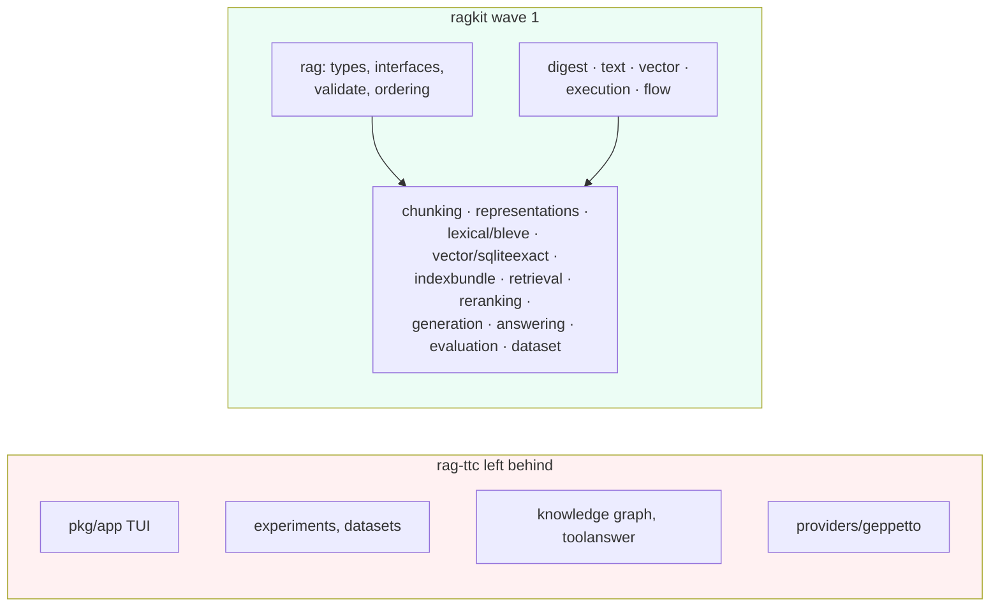
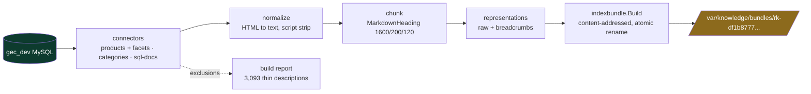
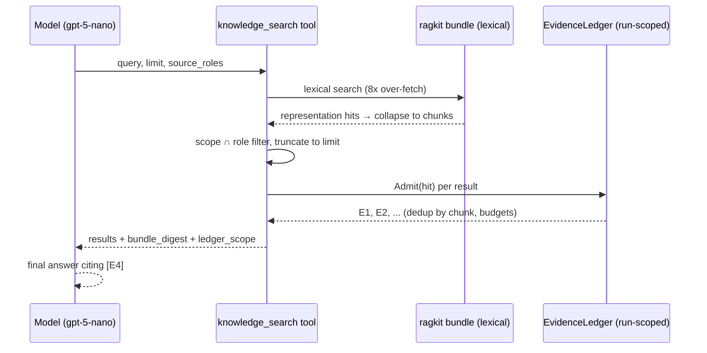

# CoinVault GEC-RAG — ragkit Extraction and knowledge_search Integration

This note records the execution of the RAG adoption plan whose design was documented earlier the same day (see [[CoinVault GEC-RAG - Golden Eagle UI Overhaul and RAG Adoption Plan]]). In one session, four planned units of work went from design to verified implementation: the `<gec:pills:v1>` projection block that lets the model suggest follow-up questions; the extraction of rag-ttc's generic retrieval core into a standalone `ragkit` module; the corpus pipeline that turns the GEC MySQL dump into a 16,032-document immutable index bundle; and the `knowledge_search` tool that serves that bundle inside the production Geppetto tool loop. The session ended with devctl profiles so the whole stack starts with one command. The closing verification was a live model run in which gpt-5-nano searched the real corpus, received labeled evidence, and cited `[E4]` in its answer without any citation-specific prompting.

> [!summary]
> - **ragkit exists**: rag-ttc's wave-1 core (23 packages, ~176 files) now lives at `github.com/go-go-golems/ragkit`, builds and tests green standalone, with all four planned coupling breaks applied plus one genuine generalization upstream lacked — lexical-only bundles.
> - **The corpus is real**: 15,577 product documents, 425 category guides, and 30 schema docs — 44,175 chunks, 88,350 representations — published as a content-addressed bundle whose rebuild reuses the identical directory.
> - **Grounded retrieval works end to end**: `knowledge_search` runs as a peer of `sql_doc`/`sql_query`, admits evidence through a run-scoped ledger with stable `E1..En` labels, and a live model cited those labels unprompted.
> - The central structural insight of the session: the tool catalog's registrar closures execute once per runtime composition, which makes the registrar body the correct — and only — place to construct per-run state such as the evidence ledger.

## Why this session exists

The previous report closed with a plan: extract a reusable RAG package from the rag-ttc research codebase rather than reimplementing retrieval, define the SQL-dump-to-corpus pipeline concretely, and integrate a `knowledge_search` tool per the parent architecture ticket (`GEC-RAG-PROD-001`). Plans of this shape frequently die in the gap between "the design says extract a module" and the mechanical reality of moving 72k lines of research code. This session closed that gap, and the interesting content below is precisely what the design could not know in advance: which assumptions upstream code encoded, where the extraction was mechanical and where it required judgment, and what the production integration forced into the open.

## What shipped

| Repo | Commit | Content |
|---|---|---|
| gec-rag | `b1fc34d` | `<gec:pills:v1>` projection block, backend + proto + frontend |
| ragkit | `d6a1964` | Wave-1 core extracted from rag-ttc, standalone green |
| ragkit | `061d10c` | Lexical-only bundles in Build and Open |
| ragkit | `b869d82` | Neutral `rk-` bundle ID prefix |
| gec-rag | `ca78d55` | Phases A+B: ragkit wiring, `internal/knowledgebuild`, `knowledge build/inspect` commands |
| gec-rag | `d96b556` | Phase C: `internal/knowledge`, `knowledge_search` in the tool loop |
| gec-rag | `2aabd8f` | devctl `rag`/`rag-debug` profiles + `knowledge-build` dynamic command |

All gec-rag commits passed the lefthook pre-commit gauntlet (golangci-lint + full test suite). Ticket diaries in `ttmp/2026/08/04/GEC-RAG-ADOPT-001--…/reference/01-diary.md` record each step with verbatim failures.

## Implementation details

### The pills block: a fourth projection widget with no lookup

CoinVault's typed-widget pipeline works by having the model emit hidden tagged blocks (`<gec:inventory_table:v1>…</gec:inventory_table:v1>`) that a filtering sink strips from the visible stream; the server validates the block, performs a deterministic database lookup, and publishes a protobuf widget event. The pills block follows this machinery exactly with one deliberate deviation: pills carry no facts, so there is no lookup. The validated block — one to four suggestion strings, whitespace-collapsed, deduplicated, truncated at 120 runes — *is* the payload.

That deviation has a placement consequence. The projection feature's `buildWidget` guards all lookups behind a `db == nil` check; pills must be handled *before* that guard or a database-free test composition loses them:

```go
// Pills need no database lookup: the block is validated text, so it is
// handled before the projection-database requirement.
if ev, ok := event.(*projectionblocks.EventPillsRequested); ok {
    return widgetID, pillsWidget{Suggestions: ev.Block.Suggestions}, true, nil
}
if f == nil || f.db == nil {
    return widgetID, nil, true, fmt.Errorf("projection database is not configured")
}
```

One operational obstacle surfaced here: `make proto-generate` was broken because the repo's `buf.gen.yaml` uses remote BSR plugins and the Buf API token is invalid. Code generation proceeded through a local template pointing at `protoc-gen-go` and a freshly installed `protoc-gen-es`; the template is not committed, and the broken remote path remains a known repair item.

The live check was unambiguous: the headless harness (`coinvault chat send … --show-events`) showed `CoinVaultPillsUpsert` on the first request, with no prompt iteration.

### ragkit: what extraction actually required

The design predicted the dependency closure; the extraction confirmed it. Every wave-1 package (`rag` core, chunking, representations, embedding, lexical/bleve, vector/sqliteexact, indexbundle, retrieval, reranking, generation, dataset, answering, evaluation) imports only `pkg/{digest,text,vector,execution,flow}` and two internal helpers — zero geppetto, glazed, or cobra anywhere. The mechanical move was two `sed` passes (import paths, logcopter area strings) over a straight copy, and the module compiled on the first build. That is not luck; it is the payoff of rag-ttc's enforced app/research boundary, now ported forward as `TestCoreDoesNotImportAdapterFrameworks`.



Two of twenty-five test packages failed after the copy, both for the same reason: they loaded rag-ttc's TTC dataset fixtures through relative paths (`../../../datasets/ttc/corpus.json`). The fix was not to carry the fixtures along — TTC content is exactly what must not travel — but to rewrite the tests against self-contained fixtures generated into `t.TempDir()` with digests computed by the same `digest` package the loader validates against.

The four planned coupling breaks were applied, and each was smaller than feared precisely because nothing inside the library consumed the coupled artifact:

1. **Comparator strengthening.** Upstream's `HitRanksBefore` broke score ties by chunk ID then representation ID. The parent architecture demands a complete ordering, so document ID now precedes chunk ID. No upstream test broke, which itself is informative: no existing test pinned tie-break behavior across documents.
2. **Prompts as values.** The representation-generation prompts were package constants that participate in cache identity. They became fields on an injectable `representations.PromptSet`, with `DefaultPromptSet()` carrying the upstream texts *verbatim* — including two strings that were initially paraphrased from memory and then corrected against source, because a paraphrased prompt is a silently different cache population.
3. **Contract naming.** The grounded-answer contract kind (`ttc-grounded-answer-v1`) became `answering.Service.ContractKind`, defaulting to the historical value.
4. **Boundary test.** Ported and re-aimed: core packages must never depend on geppetto, pinocchio, glazed, cobra, or bubbletea; a future `providers/` tree is the only sanctioned exception.

One change was not planned, and it is the most consequential: **upstream assumed hybrid retrieval everywhere**. `indexbundle.Build` refused inputs without an embedding identity, and `Open` refused bundles without a vector index. The CoinVault plan is deliberately lexical-first (embeddings are Phase E, benchmark-gated), and lexical-only is also the permanent rollback configuration for hybrid retrieval. Both functions now branch on a nil vector identity — `Build` additionally rejects stray vector inputs so a half-configured build fails loudly — with a round-trip test that builds, opens without an embedder, and searches.

### The corpus pipeline: 54k rows to 16k documents, deterministically

`internal/knowledgebuild` implements the design's manifest-first shape: a committed YAML manifest names the sources, gates, and chunking parameters; the build refuses nothing silently. The three connectors produce the normalized document contract, with the fields ragkit's `rag.Document` does not model (source role, access scopes, canonical URL, external identity) riding in `Metadata` under documented keys.

The products connector is where the domain knowledge lives. Its query never selects price, cost, or quantity columns — current values belong to `sql_query`, and a stale indexed price answering a live-stock question is the exact failure mode the architecture's data-plane separation exists to prevent. The 75,052 EAV rows of `product_details` (YEAR, MINT, GRADE, DENOMINATION, …) are rendered twice: into the document text as a facet line, so lexical retrieval matches queries like "1986 gold eagle BU", and into metadata, for future role- and facet-aware routing:

```text
# 1986 American Gold Eagle One Ounce
Metal: Gold · Year: 1986 · Grade: BU · Denomination: $50

<cleaned description paragraphs>
```

HTML normalization is a small deterministic renderer over `x/net/html`: block elements become line breaks, list items become dashes, and `script`/`style`/`iframe` subtrees are dropped wholesale — which doubles as the prompt-injection hygiene step, since invisible or executable markup never reaches the corpus. One correctness decision came out of a failing test rather than the design: raw newlines inside HTML text nodes initially became paragraph breaks, but HTML defines that whitespace as insignificant, so the renderer (not the test) was fixed.



The production numbers: 16,032 admitted documents (15,577 products, 425 categories, 30 schema docs), 44,175 chunks, 88,350 representations (raw plus heading-path breadcrumbs), and 3,093 exclusions — active products whose cleaned description falls under 200 runes. That last number is a finding in its own right: roughly a fifth of the active catalog has no substantive prose, which content owners should see.

Determinism is the phase's exit criterion and is enforced by test: building the same sources twice into one output root must produce the identical bundle identity, and the second build must reuse the published directory rather than rewrite it. Against a live database this holds per dump state — the corpus digest in the bundle manifest is the witness, and production builds must run from pinned imports.

### knowledge_search: the registrar-lifetime insight

`internal/knowledge` serves the bundle: `Open` verifies the bundle and loads the digest-checked source corpus (documents are deliberately *not* stored in the bundle; they are served from the corpus JSON the manifest names, so stale titles or URLs cannot be presented as verified); `Search` runs bleve retrieval, collapses representation hits to chunks, and filters by access scope and source role with deterministic ordering; the `EvidenceLedger` assigns stable `E1..En` labels under item and rune budgets.

The structurally interesting problem was evidence scope. The parent design wants labels stable at least within an answer run, but the tool catalog's entries are constructed once at server startup and their registrar closures are shared across every session — any state captured at entry-construction time is global, which would leak evidence labels across users. The resolution exploits a lifecycle fact: `BuildRegistry` invokes each registrar once per runtime composition, and the runtime is composed per submitted message. Constructing the ledger *inside the registrar body* therefore yields exactly one ledger per answer run with no session identity threading at all:

```go
Registrar: func(reg geptools.ToolRegistry) error {
    ledger := NewEvidenceLedger(config.MaxEvidenceItems, config.MaxEvidenceRunes)
    fn := func(ctx context.Context, in SearchInput) (*SearchOutput, error) {
        return runSearch(ctx, service, ledger, config, in)
    }
    return catalog.RegisterSpecTool(reg, spec, fn)
}
```

Because run scope is weaker than the design's preferred session scope, every tool result declares `ledger_scope: "run"` — partly as transcript honesty, partly as a tripwire: if the registrar lifecycle ever changes, the declared scope stops matching reality in a visible place.

Scope filtering deserves an honest caveat, recorded in the code and diary. Filtering happens after ranking, over an 8× over-fetched candidate set. Unauthorized content is never returned — and documents without scopes are rejected outright, on the rule that unscoped content is a build error, not public content — but unauthorized documents still consume candidate rank positions. With today's two scopes (`public`, `analyst`) this is harmless; per-scope indexes must land before scope combinations multiply.



The live verification: a session on the `analyst-rag` profile asked for the difference between proof and brilliant uncirculated coins. The model chose `knowledge_search` with source roles of its own selection, received five evidence items from real product documents, and its answer cited `[E4]` — with no citation-specific prompt engineering beyond one line in the tool description. The same response also carried a pills widget, so both of the session's features composed in a single answer. In the browser, `[E4]` renders as plain text: the citation chips are Phase D, and the UI design already reserves their slot.

### devctl profiles: one-command startup

The repository already had a devctl plugin with three profiles; two more (`rag`, `rag-debug`) now wire the knowledge stack. The plugin gained bundle resolution (`COINVAULT_KNOWLEDGE_BUNDLE` = empty, `auto`, or a path; `auto` picks the newest manifest-bearing directory under `var/knowledge/bundles`, so rebuilding the corpus never requires config edits), a `knowledge-build` dynamic command that runs the corpus build with the profile's MySQL settings, and actionable validation when a bundle is requested but absent. The extension also surfaced a real pre-existing bug: the plugin's `APP_PROFILE` setting existed but was never forwarded to `serve` — `--application-profile` is now passed explicitly.

The pitfalls here were all CLI-surface drift, worth recording because they will bite again: profile switching is per-invocation (`--profile rag`) or via `profile.active` in `.devctl.override.yaml` — there is no `profiles use`; dynamic commands mount as top-level cobra commands (`devctl knowledge-build`, not `devctl run knowledge-build`); and the plugin command catalog is fingerprinted per profile, so editing the plugin or switching profiles requires a one-time `devctl plugins refresh --profile rag`.

```bash
devctl knowledge-build --profile rag   # build or reuse the bundle
devctl up --profile rag                # backend :18933 + Vite :5173
# startup log: knowledge_search enabled bundle_id=rk-df1b8… documents=16032
```

## Failure modes encountered

Each is recorded in the ticket diary with exact errors; the durable ones:

- **Relative-path fixtures do not survive extraction.** Two ragkit test packages silently depended on repository-external data via `../../../`; the general rule is that a library's tests must construct their own fixtures.
- **Hybrid-only assumptions hide in serving code.** The lexical-only failure appeared twice in sequence — first in build validation, then in result measurement (`stat vectors.sqlite`) — because the assumption was distributed, not centralized.
- **Compound-command `cd` plus per-call cwd resets.** A `go mod edit` intended for gec-rag ran twice against ragkit's own `go.mod` (self-requiring the module into itself) because `cd` persists to the end of a compound shell command while each new command resets to the repo root.
- **The timeline export is not the frontend shape.** Scripts against `/api/chat/sessions/{id}/timeline?format=json` must read `entities[].payload` with snake_case fields and registered kinds (`ChatToolResult`), not the browser's normalized entities; a wait loop keyed on the wrong shape spun forever.
- **Remote codegen as a single point of failure.** buf's BSR authentication being invalid blocked all proto generation until local plugins were substituted.

## Open questions

- When does ragkit get published and tagged? gec-rag currently consumes it through a local `replace` directive, which CI cannot resolve remotely.
- Does rag-ttc re-adopt ragkit, accepting the cache-epoch invalidation of its experiment artifacts, or keep its internal copy indefinitely?
- Session-scoped evidence labels: threading session identity into tool contexts would upgrade `ledger_scope` from `run` to the design's preferred session scope — is the added coupling worth it before Phase D?
- The policy corpus gap remains: `cms_entries` is empty in this dump, so `knowledge_search` cannot answer returns/shipping questions and its description says so.

## Near-term next steps

- **Phase D**: `CoinVaultSourceResults` protobuf projection resolved server-side from the ledger, plus the UI citation chips and source cards (the joint task with the Golden Eagle UI ticket).
- **Phase E**: embeddings via a ragkit geppetto adapter, `vectors.sqlite` in the bundle, weighted RRF — gated on benchmark strata, with lexical-only as rollback.
- Furniture-pattern measurement over the product corpus (ragkit's statistics machinery is present but unexercised) before analyst rollout.
- Publish `go-go-golems/ragkit`; replace the local directive with a tagged version.

## Project working rule

Anything the model can request must pass through server-side validation that the model cannot influence: pills are truncated and capped by the server, evidence metadata comes from the digest-verified corpus rather than model output, and access scopes come from configuration, never from tool input. When a new capability is added, the first design question is which of its fields the model is allowed to author — and the default answer is none.
