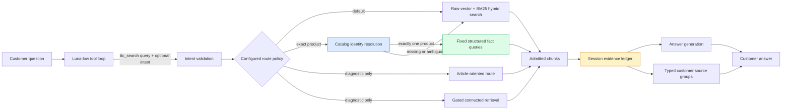
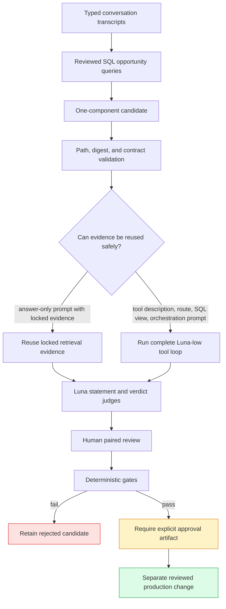

# TTC Garden Intent-Aware RAG Optimization

The TTC Garden Assistant now distinguishes the customer’s question intent, presents admitted evidence according to that intent, and uses a narrowly promoted structured-data route for exact product questions. The implementation was developed through six controlled phases, I0 through I5. Each phase isolated a different concern: observation, presentation, structured facts, retrieval routing, production selection, and bounded self-improvement.

The final production decision is intentionally small. Exact named product questions use deterministic catalog resolution and attributable structured facts. Recommendation, comparison, care, policy, and broad-information questions retain the established hybrid retrieval path. Two broader candidates were rejected because they improved some answers while reducing grounding elsewhere. Those rejected results are part of the system’s design evidence, not discarded attempts.

> [!summary]
> - Query intent is a validated, observable contract rather than a separate planner inference.
> - Product cards display bounded, provenance-bearing facts from admitted evidence; raw excerpts remain available but collapsed.
> - Exact product questions now resolve the named catalog item before ordinary retrieval and return structured facts when identity is unambiguous.
> - Global fact injection and the full intent-routing table were rejected after Luna-low generation, Luna judging, deterministic gates, and human review.
> - A bounded incumbent/challenger workflow now supports isolated prompt, tool-description, SQL-view, and route experiments without automatic production mutation.

## 1. The problem this project addressed

The original Garden Assistant retrieval path used hybrid search to supply chunks to a tool-calling answer model. This worked for many broad questions, but three distinct problems were visible in retained conversations and evaluation data.

First, the same evidence presentation was used for different question types. A comparison requires aligned attributes across multiple products. A product-fact question requires one requested field and enough identity information to establish which product is being described. A care question requires concise instructions and conditions from an article. Rendering every result as a large raw chunk made the source panel difficult to parse and obscured the distinction between product data, article guidance, and policy information.

Second, hybrid similarity was not a reliable identity-resolution mechanism. An exact question about Emerald Green Arborvitae could retrieve other arborvitae products whose text was semantically similar. The answer could then be fully faithful to the retrieved chunk while still being factually wrong about the named product. This established an important separation:

| Property | Question answered |
|---|---|
| Relevance | Did the response address what the user asked? |
| Faithfulness | Are the response’s claims supported by the evidence shown to the model? |
| Correctness | Do the claims match the authoritative product or guide data? |

Third, broad enrichment encouraged unsupported elaboration. Adding more product facts after ordinary retrieval often made responses more responsive, but it also caused the model to make more qualitative claims and recommendations than the evidence supported. A larger context was not automatically a better context.

The project therefore did not begin by adding a general planner, ontology, or unrestricted database tool. It introduced a small intent vocabulary and tested each additional behavior behind a controlled boundary.

## 2. Design constraints

The design used six intents:

- `recommendation`
- `comparison`
- `product_fact`
- `care_or_howto`
- `policy_or_order`
- `broad_information`

Luna-low may provide this value as an optional argument to `ttc_search`. The server validates it. A missing or invalid value falls back to `broad_information` and the default retrieval path. A deterministic keyword classifier exists for diagnostics, but it does not silently override the model-selected value.

This arrangement preserves three properties. The selected intent is inspectable in transcripts. An invalid classification cannot select an undefined route. The system does not incur an additional model call solely to plan retrieval.

The initial routing hypothesis was broader than the final production table:

```yaml
routes:
  recommendation:
    retrieval: hybrid_default
    structured_facts: gated
  comparison:
    retrieval: hybrid_default
    structured_facts: required_when_products_resolve
    connected_facts: gated_multi_subject
  product_fact:
    retrieval: structured_first
    fallback: hybrid_default
  care_or_howto:
    retrieval: article_hybrid
  policy_or_order:
    retrieval: lexical_policy
    fallback: hybrid_default
  broad_information:
    retrieval: hybrid_default
```

This YAML was an experiment definition, not a promise that every branch would ship. Configuration controls intent names, route selection, top-k values, gates, prompts, and tool descriptions. Ranking algorithms, identity-safety rules, provenance, and fallback invariants remain in Go.

## 3. System architecture

The implementation crosses the application and RAG repositories. The application owns the customer session, the `ttc_search` tool boundary, intent observation, product-card projection, and calibration capture. `rag-ttc` owns reusable hybrid retrieval, deterministic fusion, fixed product-catalog queries, route configuration, connected retrieval, and grounded-answer evaluation contracts.



The session evidence ledger is the admission boundary. A customer card may only project chunks or structured facts recorded in that ledger. Presentation code does not retrieve additional evidence, and generated card summaries are not passed back to the answer model as substitutes for original evidence.

### 3.1 Important code locations

| Responsibility | Location |
|---|---|
| Intent enum, parsing, fallback, and diagnostics | `backend/internal/queryintent/queryintent.go` |
| Search tool request, route telemetry, and source admission | `backend/internal/ragsearch/` |
| Intent-aware evidence grouping and field selection | `backend/internal/evidenceview/evidenceview.go` |
| Calibration manifests and per-intent summaries | `backend/internal/calibration/` |
| Customer product and source widgets | `web/packages/ttc-garden-assistant/src/components/organisms/SourceResultsWidget/` |
| Reusable TTC retrieval and deterministic route execution | `rag-ttc/pkg/ttcrag/search.go` |
| Fixed catalog queries and product identity data | `rag-ttc/pkg/` catalog-related packages |
| Connected-retrieval adapter | `backend/internal/ragsearch/connected.go` |
| Production route configuration | `rag-ttc/configs/tool-qa/production-product-fact-v1.yaml` |
| I3 deterministic comparison builder | ticket-local `scripts/01-summarize-i3.py` |
| I5 candidate workflow | ticket-local `scripts/02-i5-bounded-loop.py` |

## 4. I0: make intent observable before changing behavior

I0 added the intent contract and transcript telemetry without changing ranking. This shadow phase prevented a basic experimental mistake: attributing a quality change to intent routing before establishing whether intent was present, valid, and consistent with the expected case.

The retained pre-I0 Luna run contained six turns but no model-selected intent because it used the earlier tool schema. Those six observations were recorded as unknown rather than reconstructed and presented as model output. A deterministic classifier matched five of six expected intents when applied to isolated user messages. The failure occurred on the second turn of a Tampa recommendation conversation:

```text
It should be evergreen and about 8 to 12 feet tall. Deer visit the yard.
```

Without conversation history, this utterance resembles broad information. Within the conversation, it is a continuation of a recommendation request. The result demonstrated why the deterministic classifier remains diagnostic and why evaluation must retain multi-turn context.

The historical run also established an answer-length baseline: median 170.5 words and maximum 359 words. All six turns passed structural checks, but the recommendation answers were visibly too long for the target chat surface. Structural validity was therefore treated as necessary but insufficient.

## 5. I1: improve evidence presentation without changing retrieval

I1 changed only the customer presentation derived from already admitted evidence. It introduced typed groups for products, articles, policy/FAQ pages, and unknown sources. Structured fact groups were reserved for I2 because I1 performed no catalog query.

Product fact extraction accepts exact labelled fields in an admitted product chunk. The initial vocabulary includes mature height, mature width, hardiness zone, sunlight, soil conditions, drought tolerance, growth rate, botanical name, and SKU. A derived `mature_size` value is displayed only when both height and width are present. If two admitted chunks disagree, the field is omitted rather than resolved by an unreviewed heuristic.

The selection algorithm is bounded:

```text
function build_product_group(intent, query, admitted_chunks):
    facts = extract_labelled_fields(admitted_chunks)
    available = fields_with_one_nonconflicting_value(facts)

    requested = preferred_fields(intent, query)

    if intent == comparison:
        selected = intersection(available_fields_for_each_product)
    else:
        selected = requested intersect available

    selected = first_four(selected)

    return {
        requestedFields: requested,
        availableFields: available,
        selectedFields: selected,
        missingFields: requested minus available,
        provenance: chunk_and_document_ids(selected),
        rawEvidence: admitted_chunks
    }
```

For the Blue Ice and Carolina Sapphire comparison, the candidate displayed the same three fields for each product: hardiness zone, sunlight, and mature size. Six aligned facts replaced two initially visible chunk excerpts. Both raw excerpts remained accessible in collapsed disclosures, and all displayed values retained document and chunk provenance.

The controlled comparison held retrieval constant:

| Property | Previous presentation | I1 presentation |
|---|---:|---:|
| Admitted chunks | 2 | 2 |
| Retrieval calls added | 0 | 0 |
| Initially visible raw excerpts | 2 | 0 |
| Initially visible aligned facts | 0 | 6 |
| Raw excerpts retained | 2 | 2 |
| Facts with source provenance | 0 | 6 |

Go tests, TypeScript type checking, focused Vitest coverage, and Playwright customer-mode assertions passed. I1 was promoted because it improved parseability without changing evidence admission or hiding the original source text.

## 6. I2: test global structured-fact augmentation

I2 asked whether products returned by hybrid search should be enriched with exact catalog facts before answer generation. The control and candidate used the same six turns, Luna-low answer model, customer prompt, tool description, index contents, hybrid configuration, and Luna judges. The intended difference was the fact-augmentation flag.

### 6.1 A safety failure discovered before the accepted run

The first candidate exposed a serious identity error. An Emerald Green Arborvitae question retrieved Danica Globe Thuja and Pancake Arborvitae chunks. Those documents resolved successfully in the catalog, so the initial implementation exposed their structured fields. The answer combined dimensions associated with Emerald Green and the hardiness range of Danica.

The fix separated two operations that had previously been conflated:

1. **Catalog resolution** determines whether a retrieved document maps to a catalog product.
2. **Fact admission** determines whether that resolved product is allowed to influence the current answer.

Product-fact and comparison searches now require the normalized resolved product name to occur in the query. Accepted aliases are deliberately narrow: the full title, full slug, or first two title tokens. A mismatch records `target_identity_mismatch` and emits no product facts. Recommendation searches remain retrieval-driven because their purpose is to discover unnamed products.

### 6.2 Matched result

| Metric | Control | Global augmentation | Delta |
|---|---:|---:|---:|
| Mean relevance | 0.8000 | 1.0000 | +0.2000 |
| Mean faithfulness | 0.8218 | 0.7253 | -0.0966 |
| Graded correctness | 3/4 | 3/4 | 0 |
| Median latency | 10,561 ms | 11,209.5 ms | +648.5 ms |
| Median answer length | 164 words | 176.5 words | +12.5 words |
| Maximum answer length | 253 words | 347 words | +94 words |

The candidate was more responsive but less grounded. On the first Tampa recommendation turn, it produced 40 atomic claims and only 15 were judged supported. The structured data encouraged more detail without establishing the combined site constraints or supporting every recommended plant.

The exact Emerald Green question still failed. The target identity gate correctly withheld facts for unrelated products, but post-retrieval augmentation could not provide the Emerald Green row because ordinary retrieval had omitted the named product. This established the requirement for query-first identity resolution.

Global augmentation was rejected. The reusable catalog package, provenance fields, widget support, and target-name safety gate remained in the codebase for narrower routes.

## 7. I3: evaluate intent-based retrieval routing

I3 moved identity resolution ahead of retrieval for exact product questions and evaluated additional experimental routes for comparison, care, and policy questions. The experiment used a frozen five-case, six-turn manifest, isolated runtime databases, byte-identical index manifests, Luna-low generation, Luna statement and verdict judges, and a frozen manual correctness rubric.

The answer normalizer also required repair during this phase. Pre-tool assistant status text could be mistaken for the final response if the calibration runner settled too early. The accepted implementation correlates provider calls and distinguishes intermediate status messages from a true final answer. Earlier runs produced under the previous semantics were retained but excluded.

### 7.1 Aggregate result

| Metric | Hybrid control | Full I3 candidate | Delta |
|---|---:|---:|---:|
| Mean relevance | 0.8000 | 0.9000 | +0.1000 |
| Mean faithfulness | 0.9466 | 0.8687 | -0.0778 |
| Median latency | 10,811 ms | 13,276.5 ms | +22.8% |
| Median answer length | 159.5 words | 146.5 words | -13 words |
| Answer input tokens | 40,685 | 44,457 | +3,772 |
| Answer output tokens | 1,406 | 1,505 | +99 |

The global faithfulness gate allowed a decline of at most 0.03. The observed decline was 0.0778, so the full table failed.

### 7.2 Product facts passed independently

The exact product route resolved Emerald Green before hybrid retrieval, admitted one catalog product, returned eight attributable facts, selected `structured_first`, and exposed no unrelated chunks. The answer reported:

- mature height of 8–12 feet;
- mature width of 3–4 feet;
- hardiness Zones 3–8.

Relevance, faithfulness, and manual correctness all passed. The control reported Zones 2–7 from unrelated evidence and failed correctness even though its statement was faithful to the retrieved chunk. The product-fact route was therefore promoted independently of the failed aggregate candidate.

### 7.3 Other routes did not pass their gates

The comparison model naturally issued one search per product. The outer connected-retrieval gate correctly remained closed because neither call contained two named products. A separate diagnostic proved that a combined two-product query can activate connected retrieval, but the matched customer run did not demonstrate an answer-level improvement. Connected retrieval remained diagnostic.

The care route selected article-oriented retrieval as configured, yet watering faithfulness declined from 1.0000 to 0.8462. Statements about checking soil and pausing after heavy rain were sensible but unsupported by the exact visible chunks. The route returned to default.

Recommendation remained unreliable even on default retrieval. One Tampa response recommended a product whose retained hardiness range did not cover the relevant warmer conditions. This was classified as a benchmark and trustworthy-data problem, not evidence for enabling a broader recommendation route.

The policy route had no frozen policy case and therefore no answer-level promotion evidence.

## 8. I4: select the smallest production routing table

I4 converted the I3 evidence into a production decision. Only `product_fact` changed behavior:

| Intent | Production behavior |
|---|---|
| `product_fact` | Resolve an exact named product first. Return structured facts only for exactly one resolution; otherwise fall back to hybrid retrieval. |
| All other intents | Use the established hybrid default. |

The production configuration is `rag-ttc/configs/tool-qa/production-product-fact-v1.yaml`. Both standard customer and developer profiles reference it. The full I3 table remains available only through explicitly named experiment profiles.

Runtime fallback is deterministic:

```text
if no product name resolves:
    use hybrid_default
else if more than one product resolves:
    use hybrid_default
else if catalog query fails:
    record diagnostic error and use hybrid_default
else:
    use structured_first for the one exact product
```

There is no fuzzy one-token alias guess. A rollback changes the two standard profiles back to `t1-search-only-v1.yaml` and restarts the backend. No schema or data migration is involved.

The real Luna-low acceptance run completed six genuine final answers with zero structural failures. The product-fact turn returned eight structured facts, zero unrelated chunks, and one structured product card. The median latency was 10,354.5 ms and the maximum answer length was 262 words. Other intents selected the default route on every call, proving that failed I3 branches had not leaked into production.

## 9. I5: implement bounded self-improvement

I5 added a practical incumbent/challenger workflow. It does not autonomously edit or deploy production. It identifies failure clusters in retained transcripts, validates a one-component candidate, chooses a safe replay policy, runs the frozen calibration set, applies deterministic and model-based evaluation, and records a decision that requires separate human approval before any production edit.



The workflow recognizes four mutable component kinds:

- a prompt;
- a tool description;
- a fixed SQL view;
- a retrieval route.

Candidate manifests contain exact incumbent and challenger paths, SHA-256 identities, frozen dataset and model identities, replay policy, and a single declared change. Validation checks path containment and symlinks, verifies content digests, and fails closed if a retrieval-affecting component requests cached evidence reuse. Component-specific tests supplement the generic contract. For the first candidate, a Go test compared fully loaded production and candidate configurations and proved that only the search description changed.

### 9.1 Transcript-derived opportunities

Reviewed SQL projected the I3 comparison artifact into a `turn_metrics` table. The largest cluster was unsupported recommendation claims: fourteen across the two Tampa turns. Other clusters included care grounding failures, split multi-subject comparison search, and answer regressions.

The first evaluated candidate targeted the smaller comparison orchestration problem because it permitted a clean one-variable tool-description change. The larger recommendation problem was represented by a separate hard-constraint prompt candidate and was not mixed into the same run.

### 9.2 First bounded candidate result

The tool-description candidate instructed Luna-low to search both named products together for comparisons. It achieved that immediate behavior: the first Blue Ice and Carolina Sapphire call contained both products and all requested attributes. The model then performed a Blue-Ice-only follow-up, omitted Carolina Sapphire hardiness, and changed behavior on unrelated recommendation turns.

| Metric | Production control | Candidate | Delta |
|---|---:|---:|---:|
| Mean relevance | 0.9000 | 0.8000 | -0.1000 |
| Mean faithfulness | 0.8778 | 0.7748 | -0.1030 |
| Median latency | 10,354.5 ms | 11,456 ms | +1,101.5 ms |
| Maximum latency | 14,106 ms | 18,214 ms | +4,108 ms |
| Median answer length | 139.5 words | 128 words | -11.5 words |
| Maximum answer length | 262 words | 348 words | +86 words |

The latency gates passed, but relevance, faithfulness, and human-review gates failed. The decision artifact records `status: rejected` and `production_changed: false`. No approval artifact was created, and production profiles remained unchanged.

This result is particularly useful because the candidate did what its prompt requested while failing the customer-quality objective. Tool-call compliance is not an adequate optimization target. Evaluation must cover final answer completeness, grounding, regressions outside the target slice, and operational behavior.

## 10. Evaluation methodology

The evaluation stack combines deterministic checks, real model execution, model judges, and human review. Each layer answers a different question.

### 10.1 Frozen multi-turn manifest

The primary manifest contains five cases and six turns:

1. Blue Ice versus Carolina Sapphire comparison.
2. Two-turn Tampa privacy-screen recommendation.
3. Emerald Green exact product-fact question.
4. First-season watering question.
5. Unsupported exact disease diagnosis.

The two-turn case is essential. A standalone utterance cannot represent constraints established earlier in a session. Runs use isolated timeline and Geppetto TurnStore databases, a three-second terminal settle interval, and a 120-second turn timeout.

### 10.2 Evidence projection for judging

The judge adapter preserves the full user context needed for the current turn, the actual final assistant response, deduplicated verbatim chunks from visible search results, admitted structured product facts, citations, abstention state, and timing. Faithfulness is judged against the evidence visible to the answer model, not a larger hidden section of the source document.

This is why correctness remains a separate human or deterministic check. A wrong-product answer can be faithful to the wrong-product chunk. The Emerald Green case demonstrated this directly.

### 10.3 Locked model roles

- Answer generation: `gpt-5.6-luna-low`.
- Atomic statement judge: `gpt-5.6-luna`.
- Verdict and relevance judge: `gpt-5.6-luna`.
- Judge concurrency: four workers.

Raw judge provider steps and model metadata are retained in content-addressed caches. Cached judgments are reused only when the content identity is unchanged.

### 10.4 Promotion rules

Aggregate means do not override critical slice failures. A route may ship independently if it passes its own correctness, relevance, faithfulness, latency, and human-review gates while the rest of the candidate is rejected. This is how exact product resolution reached production without enabling article routing or connected comparison retrieval.

## 11. Failure modes and engineering lessons

### 11.1 Retrieval similarity is not product identity

Semantically related product chunks may rank highly for an exact named-product query. Identity-sensitive facts require deterministic resolution against authoritative product records. Vector or lexical similarity can provide explanatory text after identity is established, but it should not decide which product row supplies dimensions or hardiness.

### 11.2 More evidence can reduce faithfulness

Global product enrichment increased relevance and the number of claims. It did not constrain the model to supported claims. Fact admission must be tied to the question’s target and the retrieval role, and answer evaluation must count unsupported statements rather than rewarding responsiveness alone.

### 11.3 Faithfulness does not imply correctness

Faithfulness measures support relative to the supplied evidence. It cannot detect that the retrieval system selected the wrong product unless the judge receives an authoritative identity reference. Product correctness therefore uses retained database records and manual review in addition to evidence-grounding judgments.

### 11.4 Intermediate assistant text is not a final answer

Tool-loop systems emit status updates, reasoning summaries, tool calls, tool results, and a final response. A calibration runner that stops after the first assistant text can record a progress sentence as the answer. Provider-call correlation and a terminal settle interval are part of the answer contract, not incidental test timing.

### 11.5 A routing capability is not a production result

Connected retrieval opened correctly for a synthetic combined query. The natural Luna-low conversation split the comparison into separate calls, so the route did not activate. A route must be evaluated through the actual tool loop and customer prompt. A smoke test proves implementation reachability; it does not prove customer benefit.

### 11.6 Rejected candidates need durable custody

The retained rejected candidates prevent repeated experimentation with the same failed assumptions. Each includes the changed component, configuration digests, response transcripts, judge inputs, raw judgments, human review, deterministic comparison, and final decision. Runtime SQLite databases remain local derived state; normalized JSONL and JSON artifacts form the durable review surface.

## 12. Production operations

Every search result exposes enough data to identify the running experiment and route:

- selected intent and origin;
- configured and effective route;
- semantic configuration digest;
- resolution status and fallback reason;
- resolved, admitted, ambiguous, and missing product counts;
- structured fact count and database provenance;
- customer source-group kind;
- answer presence versus status-only assistant output;
- latency and provider token usage.

Operational review should investigate a rising exact-product fallback rate, ambiguous aliases after catalog refresh, structured-first answers containing unrelated chunks, raw citation syntax reaching customers, source cards missing product identity, or a running digest that differs from the deployed manifest.

The production semantic digest recorded during I4 is `17a7bab3f8b3096443a2aa4cd2ad955c49ef3a32b7652513b4ea7715c77b4ac0`. Digests identify resolved configuration semantics rather than relying only on filenames.

## 13. Verification and project completion

The completed ticket contains 39 checked tasks and a 17-step implementation diary. Verification included:

- the full application Go test suite;
- all-package application and RAG builds with VCS stamping disabled for the linked-worktree environment;
- focused Go tests for routing, catalog resolution, intent parsing, and loaded-config equality;
- TypeScript type checking and focused widget tests;
- Playwright customer-mode presentation assertions;
- nine Python contract and safety tests for the bounded I5 workflow;
- repeated deterministic comparison generation with byte-identical SHA-256 output;
- `docmgr doctor` and frontmatter validation;
- explicit confirmation that standard profiles reference the promoted production configuration and not the rejected I5 arm.

The full RAG test suite has one unrelated workspace integration failure. That test invokes `git show HEAD:go.mod` in the application repository and assumes its Go module is at the repository root; this application keeps its module under `backend/`. All relevant retrieval, configuration, judge, and tool-loop packages pass. The failure was documented rather than repaired inside an unrelated ticket.

The final ticket-close commit is `38b0817`. The principal application implementation commits begin with shadow intent telemetry in `c7667a8`, continue through intent-aware cards, catalog integration, route execution, production promotion, and bounded optimization, and end with the ticket closure. The corresponding `rag-ttc` work includes fixed catalog queries, configurable routes, bounded routing policy, structured-first and connected retrieval, the narrowed production configuration, and the isolated I5 candidate.

## 14. What should happen next

The next delivery ticket is `TTC-GARDEN-PROGRESSIVE-UX-001`. The retrieval project established reliable evidence boundaries, but the real Luna-low acceptance still showed that recommendation answers are too long for a compact chat surface. The next work should preserve the production retrieval table while improving how answers and evidence are presented.

The planned sequence is:

1. Freeze representative customer conversations and presentation contracts.
2. Type and group evidence consistently across product, article, policy, and structured-fact results.
3. Replace raw source walls with concise typed cards that retain expandable evidence and provenance.
4. Generate shorter initial answers with follow-up pills and selectable clarification choices.
5. Integrate the behavior behind controlled configuration.
6. Run human calibration before promotion.

Within I5, the next unevaluated optimization candidate is the isolated hard-constraint prompt for recommendation questions. It should be run only as a separate experiment. It must not be bundled with the rejected comparison tool description. Recommendation quality also requires trustworthy location-to-zone data and stronger product-constraint validation; prompt changes cannot manufacture those facts.

## 15. Working rules preserved by this project

- Observe a new signal before allowing it to change ranking.
- Separate evidence admission, answer generation, and customer presentation.
- Resolve authoritative entities deterministically when exact identity controls the answer.
- Keep missing and conflicting facts missing rather than filling them heuristically.
- Evaluate relevance, faithfulness, correctness, abstention, latency, and answer length separately.
- Freeze model, prompt, data, and judge identities before comparing retrieval arms.
- Promote the smallest route that independently passes its gates.
- Retain rejected candidates and invalid runs with explicit reasons.
- Require a separate human approval artifact before production mutation.
- Keep the default hybrid route available as a deterministic fallback.

## 16. Primary project documents

The complete source record is in:

`/home/manuel/workspaces/2026-06-30/benchmark-cpu-inference/2026-05-27--ttc-design-system/ttmp/2026/08/03/TTC-GARDEN-INTENT-RAG-001--query-intent-and-evidence-type-aware-garden-retrieval-optimization`

Start with:

- `design-doc/01-implementation-guide-for-intent-aware-evidence-selection-and-retrieval-optimization.md`
- `reference/01-investigation-and-implementation-diary.md`
- `sources/01-i0-shadow-baseline.md`
- `sources/02-i1-presentation-only-fact-selection.md`
- `sources/i2/05-i2-structured-fact-augmentation-results.md`
- `sources/i3/05-i3-retrieval-routing-results.md`
- `sources/i4/01-production-decision-and-acceptance.md`
- `sources/i5/05-i5-bounded-self-improvement-results.md`

The ticket’s normalized response data, model-visible judge projections, Luna judgments, human reviews, deterministic comparisons, candidate manifests, and rejection decisions are retained under `sources/`. These artifacts provide the evidence needed to reproduce the production decision or begin the next bounded experiment.
