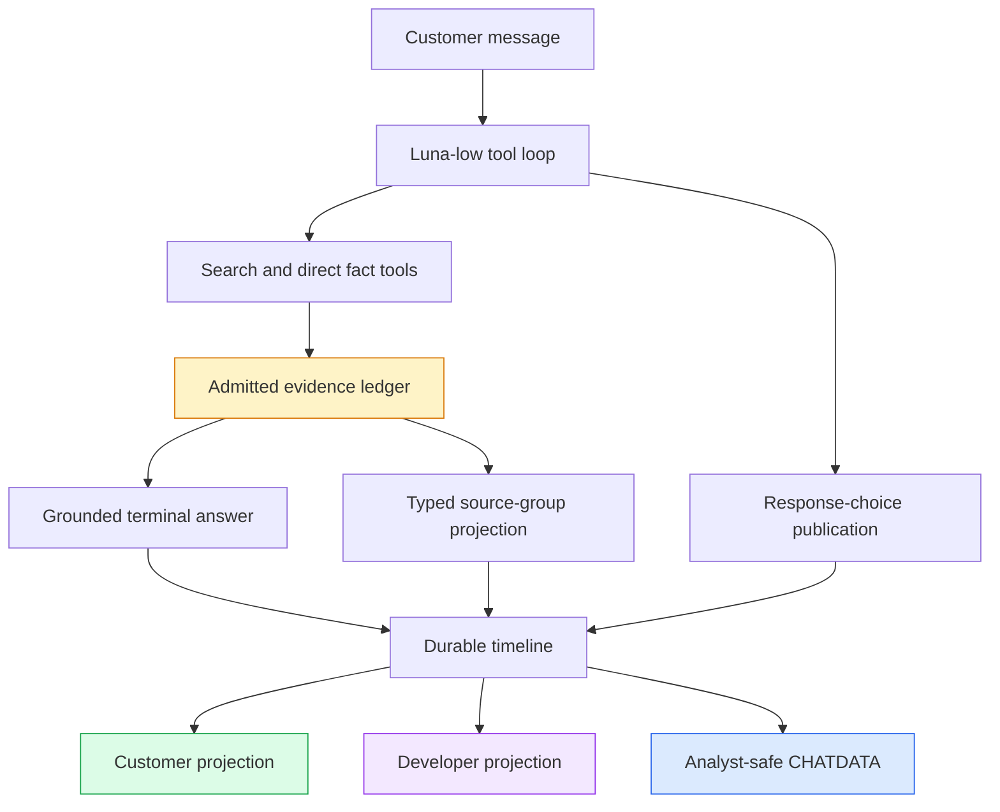

# TTC Garden Assistant Progressive UX — Complete U0–U5 Engineering Record

The TTC Garden Assistant progressive-UX project converts a technically grounded retrieval system into a compact, inspectable customer chat. The work does not replace retrieval. It defines how an answer, its optional continuations, and its supporting evidence become a stable customer interaction while the full execution record remains available to developers and analysts.

This report consolidates the complete U0–U5 implementation. It covers the frozen baseline, deterministic evidence grouping, typed source cards, compact cumulative prompting, replayable response choices, controlled Luna evaluation, real-model browser calibration, the defects found under persistence and hydration, and the final correction from a diagnostic retrieval configuration to the actual production composition.

> [!summary]
> - The project reduced the controlled six-turn median from approximately 140 words to 108 words in the full typed-card arm, while every accepted answer stayed below the 180-word hard ceiling.
> - Customer sources are now grouped evidence entities rather than raw retrieval chunks. Product cards contain verified public links and no more than four authoritative database facts; complete chunk and score lineage remains available to developers.
> - Follow-up pills are ordinary same-session user messages with stable idempotency keys. They therefore preserve context, persistence, replay, hydration, and evaluation semantics.
> - U4 passed its declared relevance, faithfulness, compactness, qualification, latency, and card-consistency gates with Luna-low answers and full-Luna judges.
> - Real U5 runs exposed three integration defects: source publications overwriting one another, intermediate provider attempts appearing as customer answers, and provider citation tokens leaking into the rendered text.
> - The exact production-composition run produced a 119-word comparison and a 96-word continuation. It refused to invent unsupported planting distances and retained deterministic two-turn CHATDATA. Human visual approval remains the final promotion gate.

## 1. The system boundary

The customer experience is built from four different representations of one interaction. Retrieval chunks ground generation. Typed source groups summarize admitted evidence for customers. Timeline entities drive live rendering and hydration. CHATDATA preserves the analyst-safe execution record. Confusing these representations produces concrete failures: a card can accidentally widen the evidence set, a retry can overwrite a prior card, or an intermediate provider attempt can appear as a second answer.

The project therefore uses explicit transformation boundaries.



The customer projection is deliberately smaller than the timeline. It shows the terminal answer for each user turn, typed source cards, and active response choices. Developer mode and CHATDATA retain tool calls, tool results, provider attempts, correlation identifiers, model metadata, errors, and raw evidence.

## 2. U0: freezing the baseline and contracts

U0 established experimental inputs before implementation changed behavior. The team retained the accepted production control, measured answer and card sizes, imported seven calibration cases containing ten turns, inventoried corpus and commerce metadata, and froze two public schemas: `ttc.source-groups.v1` and `ttc.chat-choices.v1`.

The baseline contained a six-turn median of 139.5 words and a maximum of 262 words. Five source cards exposed 4,348 raw snippet characters; four of those cards placed raw chunks directly in customer mode. The corpus contained titles and source URIs for all 200 indexed documents, but it contained no document summaries or category metadata. The commerce database contained 2,594 products, although suitability fields were only partially populated.

These measurements changed the design. Missing metadata could not be treated as an exceptional failure. The contracts required conservative fallbacks:

- An article without a trustworthy document summary renders its verified title and link.
- A product with partial structured data renders only facts actually present in the authoritative catalog.
- An ambiguous or unsafe URL is omitted rather than repaired heuristically.
- An unsupported role becomes `unknown`; the frontend does not infer a more specific type from generated prose.
- Raw chunks remain in developer evidence and transcripts but never become a customer summary.

The baseline script was rerun and produced byte-identical JSON. This made later claims about compactness and metadata coverage reproducible rather than anecdotal.

## 3. U1: evidence typing without evidence expansion

U1 introduced five deterministic evidence kinds: `article`, `product`, `faq_or_policy`, `structured_fact`, and `unknown`. Classification uses immutable corpus roles, exact product resolution, and bounded policy rules. The answer model does not decide the type.

Grouping occurs only after evidence admission. Chunks with the same document identity collapse into one source group. Exact catalog facts may enrich an admitted product group for presentation, but catalog resolution cannot introduce an unadmitted product. Each group preserves:

- every contributing E label;
- every chunk and document identifier;
- the fused score observed when the chunk first entered the session ledger;
- the source role used for classification;
- the complete raw developer evidence;
- database provenance for every structured fact.

The first-admission score is intentional. A chunk may be retrieved again by a later query with another score. Updating its original ledger entry would make historical lineage depend on later calls. The ledger instead records the score at the moment the E label becomes available to the conversation.

Presentation enrichment is separated from answer augmentation:

```text
for each selected E label:
    citation = session_evidence_ledger.lookup(label)
    reject if citation is absent
    group = group_by_admitted_document(citation)

for each admitted product group:
    product = display_catalog.resolve_exact(group.document_id)
    if product is unique:
        attach verified public URL
        attach bounded authoritative display facts

never append another document or product during presentation
```

This is the central trust invariant of the source-card system: presentation may reorganize and summarize admitted evidence, but it may not widen the factual basis of the answer.

## 4. U2: typed cards as a strict customer contract

U2 replaced the legacy flat fields `citation`, `citations`, `chunkIds`, and `snippet` with the typed source-group schema in both Go and TypeScript. The Zod boundary is strict. Unknown fields, unsafe URLs, malformed E labels, or evidence-kind invariant violations produce a visible invalid-widget state rather than a partially trusted card.

The five card variants have bounded responsibilities.

| Kind | Customer content | Explicit exclusions |
|---|---|---|
| Article | Title, document-level subject summary when available, category, verified link | No retrieved chunk presented as a document summary |
| Product | Product name, verified link, up to four authoritative facts | No generated product attributes |
| FAQ or policy | Policy topic, concise description, verified link | No oversized article treatment |
| Structured fact | Compact label/value and database provenance | No unproven prose explanation |
| Unknown | Verified title and link | No guessed kind or summary |

When a full verified document is available, the summary extractor skips titles, headings, empty paragraphs, and list fragments, then selects the first prose paragraph. It normalizes whitespace and bounds the result to 240 Unicode code points, preferring sentence and word boundaries. The summary is thus derived from the full document rather than the embedding chunk.

Customer/developer separation is tested directly. A sentinel raw chunk placed in `developerEvidence` must remain absent from the customer DOM before and after hydration. Source links remain keyboard reachable, cards use semantic headings and definition lists, and the layout has responsive tests.

The strict replacement intentionally has no compatibility adapter. A stale backend publishing the old payload fails visibly. This prevented old chunk cards from silently passing through the new UI during deployment and testing.

## 5. U3: compact cumulative answers and response choices

The prompt-only experiment showed why word count cannot be optimized independently. Candidate v1 achieved a lower median but forgot previously supplied Tampa context on the second turn and asked the customer to repeat their goal and light conditions. Candidate v2 preserved cumulative state and reduced the six-turn median from 145.5 to 109.5 words, with a maximum of 143 words.

The accepted initial-answer contract targets 70–120 words without hard truncation. It requires three elements before optional detail:

1. the recommendation or direct answer;
2. the decisive reason;
3. any material qualification that changes how the customer should act.

Secondary detail becomes two to four follow-up choices. Necessary clarification uses a single question and a short set of complete answer choices. `I don't know` is included only when the unknown is a factual constraint a customer may reasonably lack and the assistant can still proceed productively.

`ttc_chat_choices_show` publishes a strict payload. A click does not invoke a hidden action protocol. It submits the choice's complete message through the normal session endpoint.

```text
select(choice):
    if group.consumed:
        return

    disable(group.choices)
    mark_selected(choice.id)

    idempotency_key = stable_key(session, group, choice)
    send_user_message(
        session_id = current_session,
        content = choice.message,
        idempotency_key = idempotency_key
    )
```

The server reserves idempotency keys per session. Replaying a key with the same message returns a duplicate acceptance without another inference. Reusing the key with different content returns HTTP 409. This preserves a single conversation model across typed input, pills, persistence, replay, and evaluation.

## 6. U4: controlled integration and evaluation

U4 compared four arms with retained responses, traces, CHATDATA, judge inputs, judge outputs, manifests, and deterministic aggregate reports.

| Arm | Turns | Median words | Maximum | Median latency | Qualification | Choices | Cards | Luna relevance | Luna faithfulness |
|---|---:|---:|---:|---:|---:|---:|---:|---:|---:|
| Baseline | 6 | 140.5 | 272 | 12,555 ms | 1.000 | — | — | — | — |
| Prompt only | 6 | 112 | 148 | 10,068 ms | 0.889 | — | — | — | — |
| Choices only | 6 | 98 | 141 | 15,660 ms | 1.000 | 6 | 0 | 0.9167 | 0.9041 |
| Full typed cards | 6 | 108 | 139 | 17,457.5 ms | 1.000 | 6 | 11 | 0.8333 | 0.8825 |

The full candidate passed the declared gates. Its relevance delta against choices-only was `-0.0833`, inside the `-0.10` limit. Its faithfulness delta was `-0.0216`, inside the `-0.05` limit. Median latency increased by 11.5%, below the 25% threshold. Every accepted answer passed the 180-word ceiling, material-qualification checks, card admission checks, lineage checks, citation checks, URL checks, and four-fact bounds.

These are configuration-level comparisons rather than fixed-evidence causal estimates. The independent model-driven loops issued different searches and received different evidence. The results establish that the complete candidate remained inside operational limits; they do not prove that card publication alone caused the answer-score differences.

### 6.1 Tool availability is structural

An early prompt-only arm instructed Luna-low not to call the source-card tool while leaving the tool registered. The model still published ten cards. Tool availability must therefore be configured in the tool registry, not requested in prose. The same issue appeared when the choice description told the model to publish choices after returning its final answer. A terminal answer ends the tool loop, so choice publication had to occur before the terminal response.

### 6.2 Judge evidence follows model visibility

The source-card tool returns selected summaries and database facts to the model before the final answer. An early judge projection omitted those results because it treated the tool as presentation-only. That boundary was incorrect. The corrected rule is:

```text
judge evidence = admitted retrieval evidence
               + successful tool results visible to the answer model

judge evidence != every persisted timeline entity
judge evidence != the entire display catalog
```

Full `gpt-5.6-luna` performed the standard relevance and decomposed faithfulness judgments with four workers and a twelve-call cap per six-answer arm. Answer generation used `gpt-5.6-luna-low`. The deterministic U4 report reproduced byte for byte with digest `sha256:f2f9346abd06a2886f22910c3741e409632c818b865ad2a4e43cc6cc8d7fabb7`.

## 7. U5: real-model release calibration

U5 moved from controlled artifacts to real provider calls, durable session databases, browser rendering, same-session continuation, and hydration. This phase found defects that unit tests and aggregate judges could not expose.

### 7.1 Multiple source publications overwrote one another

Luna-low published Blue Ice and Carolina Sapphire cards in separate calls during one assistant turn. The original widget identity contained only the parent message ID, so the second publication replaced the first. The corrected identity combines parent-turn ownership with a digest of the canonical source-group set:

```text
group_ids = sort(unique(publication.group_ids))
digest = sha256(join(group_ids, "\n"))[0:16]
instance_id = schema_version + ":" + parent_message_id + ":" + digest
```

The same semantic publication remains idempotent, different publications in one turn coexist, and hydration derives the same identity as live streaming. This fix was committed as `8ec1c69`.

### 7.2 Intermediate provider attempts appeared as answers

A tool-using turn can contain intermediate provider text followed by another provider call and the actual terminal answer. The persisted `final` flag is finality within one provider call, not necessarily finality for the customer turn. The frontend adapter had discarded the parent and provider-call correlation fields, so customer mode could render both attempts.

The corrected projection preserves `parentMessageId`, `correlation.providerCallId`, and `final`, then selects the latest provider call for each parent turn. Developer mode and CHATDATA retain all attempts. Customer mode renders only the text segments belonging to the terminal call. This fix was committed as `b7398f5`.

### 7.3 The first retained U5 run was diagnostic, not production-exact

The initial retained session used the broad diagnostic intent-routing configuration. It was useful for presentation testing and found both lifecycle defects, but the accepted I4 production decision promotes the narrower `production-product-fact-v1.yaml` composition. A release report must not treat those configurations as interchangeable.

The corrected production run used:

- profile `ttc-live-luna-low`;
- provider model `gpt-5.6-luna` with low reasoning effort;
- prompt `configs/prompts/customer-u4-full.md`;
- retrieval configuration `configs/tool-qa/production-product-fact-v1.yaml`;
- content-addressed bundle `.cache/rag-ttc/indexes/ttc-056cbd53e148922e847ceabab1f7c4ef`.

The retained production session is `edfc6de6-695c-40dc-9fa1-aa0a8c4fb44b`. The first turn compared Blue Ice and Carolina Sapphire in 119 whitespace-delimited words. It rendered both product cards, eight structured facts, trusted Tree Center links, and three choices: **Spacing plan**, **Maintenance**, and **Foliage color**.

Selecting **Spacing plan** submitted the ordinary message “Give me a spacing plan for a Blue Ice or Carolina Sapphire screen.” The 96-word continuation correctly stated that the retained sources did not publish a definitive tree-to-tree spacing. It used mature widths as planning constraints and asked for screen length and the customer's closure or crowding preference instead of inventing a distance. This is materially safer than the diagnostic continuation, which supplied exact spacing guidance without equivalent production evidence.

Repeated CHATDATA export produced identical bytes with SHA-256 `826579708330da918d6144428873201c0468e014ba1464d7df9a9c68d58f0f8f`. Desktop and 390 × 844 mobile hydration each retained two answers, two product cards per turn, four links across the conversation, six cumulative choices, and zero developer diagnostics.

### 7.4 Raw provider citation syntax leaked into customer text

The production run exposed strings such as `citeE6` literally. The E label is useful, but the provider transport syntax is not customer-readable. The current implementation normalizes supported provider forms at the customer rendering boundary:

```text
citeE6       -> [E6]
citeE1E2   -> [E1 · E2]
【E6】【E7】       -> [E6 · E7]
```

The transformation applies only to assistant text in customer mode. Raw provider content remains unchanged in developer mode, persisted timelines, and analyst exports. Focused tests cover direct normalization and the customer/developer separation. This work is implemented locally and requires the final hydration artifact and focused commit before it becomes part of the release candidate.

## 8. Persistence as an optimization substrate

The release work records more than the visible conversation. Analyst-safe JSONL is intended to include system prompts, tool definitions, tool calls, tool results, reasoning summaries, provider and model metadata, correlation identifiers, errors, evidence lineage, source-group payloads, choices, selected actions, timing, and terminal status.

This enables direct operational analysis:

```sql
-- Questions that become answerable from normalized chat records.
SELECT tool_name, error_code, count(*)
FROM tool_calls
GROUP BY tool_name, error_code;

SELECT intent, percentile_cont(0.5) WITHIN GROUP (ORDER BY answer_words)
FROM turns
GROUP BY intent;

SELECT choice_label, count(*) AS shown, sum(selected) AS selected
FROM response_choices
GROUP BY choice_label;
```

The exact schema may use SQLite JSON functions rather than normalized tables, but the analytical requirement is stable. The record must preserve the inputs and decisions needed to identify prompt, tool-description, retrieval, and presentation optimization opportunities.

## 9. Verification model

No single test layer establishes customer readiness.

| Layer | Property established |
|---|---|
| Go unit and package tests | Deterministic grouping, validation, provenance, idempotency, and persistence |
| React and TypeScript tests | Strict payloads, rendering order, choice lifecycle, hydration, and customer filtering |
| Deterministic scripts | Stable baselines, word counts, structural gates, and reproducible aggregate reports |
| Luna judges | Answer relevance and evidence faithfulness under the model-visible evidence policy |
| Playwright mock tests | Complete widget inventory and deterministic choice-state transitions |
| Playwright real-model tests | Provider loop, persistence, links, cards, continuation, desktop/mobile projection, and hydration |
| Human review | Readability, density, confidence, source usefulness, and release acceptance |

One known unrelated frontend failure remains: a DMETA manifest-count assertion expects 17 promoted components while the generated manifest contains 31. Focused progressive-chat suites and TypeScript checking pass. The unrelated failure is retained rather than hidden or modified in this ticket.

## 10. Current state and remaining work

| Phase | State | Delivered result |
|---|---|---|
| U0 — Baseline and contracts | Complete | Frozen cases, measurements, schemas, and fallback behavior |
| U1 — Evidence typing and grouping | Complete | Deterministic admitted-only source groups with complete lineage |
| U2 — Typed evidence cards | Complete | Strict customer payload and five bounded card variants |
| U3 — Compact answers and choices | Complete | Cumulative compact prompt and idempotent same-session pills |
| U4 — Controlled integration | Complete | Declared quality, latency, compactness, provenance, and browser gates passed |
| U5 — Human release calibration | Awaiting final gate | Production-exact real session retained; citation rendering needs final artifact/commit; explicit approval remains pending |

The remaining sequence is intentionally narrow:

1. Complete the no-cost hydration assertion proving raw provider citation syntax is absent from customer mode and preserved in developer data.
2. Commit the customer-only citation normalization with its focused tests.
3. Update the U5 ticket report and diary so the diagnostic and production-exact sessions are clearly distinguished.
4. Obtain explicit human approval for answer length, source-card usefulness, choices, and desktop/mobile presentation.
5. Promote only the approved prompt and widget configuration.
6. Publish the accepted typed-presentation contract back to the intent-aware RAG ticket.

Broader optimization should proceed only after this gate. Likely next improvements include better document summaries, more precise choice-tool descriptions, direct hardiness-zone and geography tools, richer customer widgets, and transcript-driven prompt sweeps. Those changes can reuse the contracts established here without coupling the production application to the experimental harness.

## 11. Durable engineering conclusions

- Retrieval evidence, model-visible evidence, customer evidence, and analyst evidence are related sets with different inclusion rules.
- Evidence grouping must occur after admission and must retain exact lineage.
- A display catalog may enrich an admitted entity but may not introduce a new one.
- Tool availability is an experimental variable and must be controlled structurally.
- Compactness is acceptable only when cumulative context and material qualifications remain intact.
- A response pill should become an ordinary idempotent user message when the system already has durable session semantics.
- Widget identity must include owning-turn identity and semantic publication identity.
- Provider-call finality does not imply customer-turn finality.
- Customer normalization must not destroy raw provider records needed for debugging and optimization.
- Production calibration must use the exact promoted retrieval composition; diagnostic configurations remain valuable but cannot substitute for release evidence.

## 12. Primary implementation and evidence locations

The ticket root is:

```text
/home/manuel/workspaces/2026-06-30/benchmark-cpu-inference/
  2026-05-27--ttc-design-system/ttmp/2026/08/03/
  TTC-GARDEN-PROGRESSIVE-UX-001--compact-progressive-garden-answers-response-choices-and-typed-evidence-cards/
```

Important implementation paths include:

- `backend/internal/evidenceview/evidenceview.go` for deterministic classification, grouping, lineage, and structured-fact selection;
- `backend/internal/ragsearch/ragsearch.go` for evidence admission and presentation-catalog resolution;
- `backend/internal/choiceintent/choiceintent.go` for the strict response-choice tool contract;
- `backend/internal/chatdata/schema.go` and `backend/internal/chatnormalize/normalize.go` for analyst-safe records;
- `web/packages/ttc-garden-assistant/src/components/organisms/SourceResultsWidget/SourceResultsWidget.tsx` for typed customer cards;
- `web/packages/ttc-garden-assistant/src/components/organisms/ChatChoicesWidget/ChatChoicesWidget.tsx` for selectable continuations;
- `web/packages/ttc-garden-assistant/src/features/chat/TtcChatMessages.tsx` for terminal-attempt selection, semantic ordering, and customer citation normalization;
- `scripts/ttc_presentation_playwright_smoke.mjs` for semantic browser acceptance.

The chronological technical record is in `reference/01-investigation-and-implementation-diary.md`. Controlled metrics are in `sources/u4/`. Real browser and CHATDATA artifacts are in `sources/u5/`, with the production-exact correction under `sources/u5/production-v1/`.

## 13. Related vault reports

- [[PROJECT REPORT - TTC Garden Assistant Progressive UX - From Raw Chunks to Auditable Source Groups]]
- [[PROJECT REPORT - TTC Garden Assistant Progressive UX - Typed Evidence Cards and Compact Answer Controls]]
- [[PROJECT REPORT - TTC Garden Assistant Progressive UX - From Controlled Evaluation to Real-Model Release Calibration]]
- [[PROJ - TTC Garden Intent-Aware RAG Optimization]]
- [[ARTICLE - TTC Garden Assistant - From RAG Prototype to Auditable Customer Chat]]
