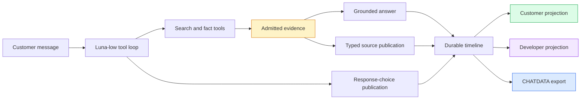

# TTC Garden Assistant Progressive UX — From Controlled Evaluation to Real-Model Release Calibration

The TTC Garden Assistant has progressed from a retrieval experiment into a customer-facing question-answering system with bounded answers, replayable follow-up choices, typed source cards, durable chat records, and real-model browser acceptance. This report explains the complete engineering path that led to the U4 controlled-integration decision and the current U5 release-calibration candidate. It also records the defects that only became visible when a real Luna-low conversation was rendered, continued, persisted, and hydrated in the browser.

This report continues [[PROJECT REPORT - TTC Garden Assistant Progressive UX - From Raw Chunks to Auditable Source Groups]] and [[PROJECT REPORT - TTC Garden Assistant Progressive UX - Typed Evidence Cards and Compact Answer Controls]]. Those reports describe the U0–U3 foundation. The present report connects that foundation to the evaluated and browser-tested system now under human review.

> [!summary]
> - U4 passed its declared quality gates. The full typed-card candidate retained relevance and faithfulness within the permitted deltas, kept every answer below 180 words, preserved material qualifications, and added only 11.5% median latency over the choices-only arm.
> - The evaluation pipeline now judges every datum visible to the model, including summaries and facts returned by the source-card tool. Earlier judge projections omitted that evidence and could misclassify grounded claims.
> - Real Luna-low U5 testing proved that a single assistant turn may publish several source-card tool results and several provider answer attempts. Stable timeline identity therefore requires both semantic publication identity and provider-call correlation.
> - The accepted real session rendered two product cards, eight aligned product facts, three follow-up choices, a same-session spacing continuation, and an article card on both desktop and mobile.
> - The candidate is technically ready for human release review, but prompt and widget promotion remain intentionally gated on explicit approval.

## 1. The program objective

The original RAG work optimized whether the system could retrieve evidence and produce a faithful answer. The customer-facing program adds a second requirement: the answer must fit a small chat surface and make the evidence understandable without exposing retrieval internals. These are related but distinct concerns.

The system must satisfy four contracts at the same time:

1. Retrieval must admit evidence relevant to the customer's question.
2. Generation must use admitted evidence and preserve cumulative conversation state.
3. Presentation must convert evidence into concise, typed customer objects without inventing new evidence.
4. Persistence must retain enough internal data for replay, debugging, evaluation, and later prompt optimization.

The implementation deliberately keeps these contracts separate. Retrieval chunks remain the grounding unit. Source groups are the customer presentation unit. Timeline entities are the live and hydrated UI unit. CHATDATA is the analyst-safe durable record.



This separation permits concise customer output without weakening the evidence retained for analysis.

## 2. What U0 through U3 established

U0 froze the baseline, case manifest, payload contracts, and fallback rules. U1 introduced deterministic evidence kinds and source grouping. U2 replaced raw chunk-oriented customer citations with the strict `ttc.source-groups.v1` payload and five bounded card variants: article, product, FAQ or policy, structured fact, and unknown. U3 introduced a compact prompt and the `ttc.chat-choices.v1` interaction.

The compact prompt was not accepted on word count alone. Its first candidate shortened answers but forgot previously supplied Tampa context during a multi-turn exchange. The revised prompt explicitly treated the conversation as cumulative. It reduced the six-turn median from 145.5 to 109.5 words and the maximum from 270 to 143 words while retaining the user's earlier goal, location, exposure, and zone.

The response-choice tool uses ordinary chat messages rather than a separate action protocol. A selected pill submits its complete message through the existing session. The backend therefore sees a normal user turn, and persistence, replay, hydration, evaluation, and later optimization all observe the same interaction.

```text
on choice selected:
    reject if group is already consumed
    disable every choice in the group
    mark the selected choice
    submit choice.message as an ordinary user message
    preserve the current session identifier
```

The result is a progressive answer structure: the initial answer contains the decision and decisive reasons; choices expose useful next questions; typed cards show the sources supporting the answer.

## 3. U4 experimental design

U4 compared controlled arms rather than releasing a visually plausible candidate. The important comparison was between a choices-only configuration and a full configuration containing the same compact-answer and grounding instructions plus typed source publication. Both arms used `gpt-5.6-luna-low` for answers. Full `gpt-5.6-luna` profiles performed decomposed statement extraction and evidence verdicts. Each six-answer judging arm used four concurrent workers and a twelve-call cap.

The experiment retained raw provider responses, manifests, summaries, tool traces, CHATDATA, judge inputs, judge outputs, and deterministic aggregate reports. This matters because aggregate scores cannot explain why an answer passed or failed. The retained artifacts allow an analyst to inspect the exact retrieved chunks, model-visible tool results, atomic claims, and verdicts.

### 3.1 Structural tool control

An early prompt-only control told the model not to publish source cards while leaving the source-card tool available. Luna-low ignored the prose constraint and published ten cards. This established a durable experimental rule: tool availability must be controlled through the registry or configured tool set, not through a system-prompt request.

The same principle applied to choices. The first tool description instructed the model to publish choices after returning its final answer. A final answer terminates the tool loop, so no choice publication occurred. The contract was corrected to require publication during the tool phase before the terminal answer.

### 3.2 Grounding the candidate

The initial full-card run produced compact output but a faithfulness regression on Tampa cases. Exact sizes, strongest-fit rankings, and light or deer claims appeared without corresponding evidence. The matched prompts were tightened so every horticultural and product claim had to be supported by E-labeled evidence. Unsupported exact attributes, superlatives, diagnoses, causes, and treatments were prohibited.

This change did not attempt to encode horticulture into the prompt. It established an output rule: when the evidence does not support a detail, omit the detail or state the limitation.

## 4. Correcting the judge's evidence boundary

The source-card tool has two effects. It publishes customer presentation state, and it returns a bounded result to the model. That returned result contains selected source summaries and display facts. Because Luna-low can read those values before producing its final answer, they are part of model-visible evidence.

The earlier judge projection treated the tool as presentation-only and excluded its result. This could mark a claim unsupported even when the model had received the supporting fact. The corrected `garden-chat-model-visible-evidence-v2` policy admits only the successful result of `ttc_search_results_show`, assigns stable digest-derived presentation identities, and retains the distinction between answer evidence and arbitrary timeline state.

The governing rule is precise:

```text
judge_evidence = retrieved_admitted_chunks
               + successful_model_visible_tool_results

judge_evidence != all_persisted_timeline_data
judge_evidence != all_display_catalog_data
```

The correction changed the evaluator from a tool-name heuristic to an inference-visibility rule. That rule generalizes to future UI-oriented tools: if their results are returned to the model, their contents belong in faithfulness evaluation.

## 5. U4 results and production interpretation

The grounded choices-only arm achieved mean relevance `0.9167` and mean faithfulness `0.9041`. The grounded full-card arm achieved mean relevance `0.8333` and mean faithfulness `0.8825`.

| Measure | Choices-only | Full typed cards | Full delta | Declared limit |
|---|---:|---:|---:|---:|
| Mean relevance | 0.9167 | 0.8333 | -0.0833 | no worse than -0.10 |
| Mean faithfulness | 0.9041 | 0.8825 | -0.0216 | no worse than -0.05 |
| Median answer length | 124 words | 101 words | -23 words | maximum 180 words |
| Median latency | reference | +11.5% | +11.5% | no more than +25% |

Every accepted answer remained below the 180-word ceiling. Frozen material-qualification groups were represented. Card admission, lineage, citation admission, verified Tree Center URL, and four-fact bounds all passed. The evaluator was run twice and produced identical bytes. Its report digest was `sha256:f2f9346abd06a2886f22910c3741e409632c818b865ad2a4e43cc6cc8d7fabb7`.

These results support a release candidate, but they do not prove that cards caused the answer-level differences. The arms used independent model-driven search loops. Different tool queries can retrieve different evidence. The deltas are therefore operational comparisons of complete configurations, not causal estimates of the renderer alone.

## 6. Browser acceptance before the real-model run

The U4 browser suite exercised all five evidence kinds, source links, fact limits, collapsed evidence, accessible choices, selected and disabled states, complete-message submission, same-session continuation, and a rendered second answer. It also tested hydration rather than only the live stream.

This work exposed a mock-runtime identity defect. Widget fixtures reused instance identifiers across turns, so a later streaming placeholder could replace a completed first-turn card. Mock IDs were changed to include the parent message. The general invariant is:

```text
timeline entity identity = semantic object identity + owning turn identity
```

A UI can reorder widgets by semantic ownership, but it must not reuse an identity that causes historical state to be overwritten.

## 7. U5: the real Luna-low conversation

U5 started the current backend with profile `ttc-live-luna-low`, the frozen content-addressed TTC bundle, the intent-routing configuration, the full progressive tool set, and isolated timeline and turn databases. The frontend connected through its real backend proxy. The retained session identifier is `31384907-7e6a-46a8-8265-d64a857f5187`.

The initial customer request asked for a compact comparison of Blue Ice and Carolina Sapphire Arizona cypress for a full-sun privacy screen. Luna-low produced a concise comparison, published product evidence for both cultivars, and offered three continuations: **Plant spacing**, **Pruning tradeoffs**, and **Fit my site**.

The rendered evidence contained:

- two product cards, one for each named cultivar;
- two verified public Tree Center links;
- eight aligned product facts;
- three response choices;
- no customer-visible raw retrieval chunk.

Selecting **Plant spacing** submitted “How far apart should I plant them for a privacy screen?” in the same session. Luna-low answered with spacing guidance, published the article source **How To Plant a Privacy Screen**, and offered a new set of follow-ups. The original choice group became disabled and retained its selected state.

Desktop hydration showed one visible final answer for the first turn, both product cards, and the three choices. The continuation test proved same-session submission and rendered the second answer. Mobile hydration at 390 × 844 showed both customer answers and all three required source titles.

## 8. Defect one: multiple source publications in one turn

During the first real run, Luna-low called the source-card tool twice in the same assistant turn: once for Blue Ice and once for Carolina Sapphire. The production instance identifier contained only the parent message identifier. The second publication therefore replaced the first. Depending on whether the UI observed live events or hydrated stored state, it could display only one comparison product.

The corrected identifier includes the parent message and a semantic digest of the sorted source-group identifiers:

```text
canonical_group_ids = sort(unique(group.group_id for group in publication))
group_set_digest = sha256(join(canonical_group_ids, "\n"))[0:16]
instance_id = schema_version + ":" + parent_message_id + ":" + group_set_digest
```

This design has three useful properties. Replaying the same publication is idempotent. Two different publications within one turn coexist. Hydration derives the same identity as the live path. The digest is semantic rather than temporal, so retries do not create duplicate cards merely because they occurred later.

The implementation was committed as `8ec1c69` with the message `fix(chat): retain multiple source cards per turn`.

## 9. Defect two: intermediate provider attempts appeared as answers

The fresh real-model run exposed a second lifecycle issue. Luna-low emitted intermediate text while also making a tool call, and that text was persisted with `final: true`. A later provider call produced the actual answer. The stock frontend adapter discarded correlation fields and parent ownership, so customer mode could render both attempts as completed assistant answers.

The fix has two parts.

First, the TTC timeline adapter preserves `correlation.providerCallId`, `parentMessageId`, and `final` for live frames and hydrated snapshots. Second, the customer projection groups assistant messages by parent turn, finds the latest provider call for each parent, and retains all text segments belonging to that terminal call.

```text
latest_call_by_parent = {}

for message in timeline:
    if message is assistant and has provider_call_id:
        latest_call_by_parent[message.parent_id] = message.provider_call_id

visible_customer_messages = [
    message for message in timeline
    if message is not a correlated assistant message
       or message.provider_call_id == latest_call_by_parent[message.parent_id]
]
```

The developer projection can continue to expose all attempts. The customer projection shows only the terminal answer attempt. This is not deletion: the intermediate provider text remains in durable records for debugging and transcript analysis.

This defect establishes another general rule. A boolean `final` field is local to a provider call; it does not necessarily identify the terminal answer for the user turn. The customer boundary needs parent-turn and provider-call correlation.

## 10. Accepted irregularities and remaining review points

The second real turn contained one recoverable tool error. Luna-low first proposed a choice identifier that violated the lowercase-hyphenated, 48-character contract. The tool returned:

```text
choice 1 id must be a lowercase hyphenated identifier of at most 48 characters
```

The model recovered inside the same turn and published valid choices. The customer received a complete answer. This is acceptable for the current calibration candidate because validation prevented invalid durable UI state, but it remains an optimization opportunity for the choice-tool description.

Headless browser screenshots in this environment render some text glyphs as neutral bars. DOM assertions still prove source titles, links, fact fields, accessible labels, choices, and assistant text. These screenshots are useful structural records, but readable human captures remain preferable for final visual approval.

The repository also has a known unrelated frontend test failure: a DMETA manifest assertion expects 17 entries while the current manifest contains 31. Focused progressive-UX suites and TypeScript checking pass. This failure must not be misreported as a progressive-chat regression.

## 11. Persistence and analyst visibility

The real chat architecture records more than customer-visible messages. Analyst-safe exports are intended to retain system prompts, tool definitions, tool calls, tool results, reasoning summaries, model and profile information, message correlation, evidence lineage, widget payloads, selected choices, timing, errors, and terminal status.

This record is the substrate for later optimization. A reviewer can query questions such as:

- Which tool descriptions cause invalid argument retries?
- Which customer intents produce the longest first answers?
- Which claims receive low faithfulness verdicts despite high answer relevance?
- Which follow-up choices are selected, ignored, or repeatedly regenerated?
- Which source kinds dominate comparison, care, location, and policy questions?
- Does a provider emit several final segments or several provider calls for one parent turn?

The customer UI and analyst export therefore serve different readers. Customer mode reduces internal state to the terminal answer, typed evidence, concise status text, and useful choices. Developer mode and CHATDATA retain the execution record needed to improve the system.

## 12. Verification state

The implementation has several independent verification layers.

| Layer | What it proves | Current evidence |
|---|---|---|
| Go unit and package tests | grouping, validation, persistence, deterministic identities | focused packages passed; complete backend suite passed during U4/U5 work |
| TypeScript and React tests | strict payloads, ordering, lifecycle, customer filtering | focused suites passed; type checking passed |
| Deterministic evaluator | stable aggregate metrics and declared gates | identical output across repeated U4 runs |
| Luna judges | claim relevance and evidence faithfulness | full Luna, four workers, twelve-call cap per arm |
| Playwright mock flow | all card variants and choice lifecycle | desktop artifacts retained under `sources/u4/playwright/` |
| Playwright real flow | actual provider, tool loop, persistence, hydration, continuation | desktop and mobile artifacts retained under `sources/u5/playwright-v2/` |
| Human review | density, readability, usefulness, customer confidence | pending explicit approval |

No single layer is sufficient. Unit tests cannot establish answer quality. Judges cannot establish UI ordering. DOM assertions cannot establish readable visual density. Human review cannot replace deterministic regression checks.

## 13. Current status

| Phase | Status | Result |
|---|---|---|
| U0 — Baseline and contracts | Complete | Frozen cases, schemas, fallback behavior, and baseline measurements |
| U1 — Evidence typing and grouping | Complete | Deterministic evidence kinds and admitted-only source groups |
| U2 — Typed evidence cards | Complete | Strict payload and five bounded customer variants |
| U3 — Compact answers and choices | Complete | Cumulative compact prompt and replayable ordinary-message choices |
| U4 — Controlled integration | Complete | Quality, latency, compactness, lineage, citation, and browser gates passed |
| U5 — Human release calibration | In progress | Real desktop/mobile session retained; two lifecycle defects fixed; explicit promotion approval pending |

The code has reached a credible release-candidate state. The remaining work is not another broad architecture phase. It is a bounded review and promotion sequence.

## 14. Near-term next steps

The next actions should remain narrow:

1. Export the accepted U5 session as analyst-safe CHATDATA and retain the exact prompt, tools, provider metadata, results, choices, and correlation fields.
2. Commit the customer terminal-attempt projection and its tests after the final focused regression run.
3. Record the U5 human calibration report, including the recovered invalid choice call and the headless-font limitation.
4. Obtain explicit approval for answer density, source-card usefulness, choice quality, desktop behavior, and mobile behavior.
5. Promote only the approved prompt and widget configuration.
6. Publish the accepted typed-presentation contract back to the intent-aware RAG ticket.

Later optimization can improve source-card summaries, choice-tool descriptions, location and hardiness-zone tools, additional customer widgets, and GEPA-style prompt sweeps. Those efforts should build on the retained transcript and evaluation contracts. They should not reopen the core presentation architecture unless measured customer evidence requires it.

## 15. Working rules preserved by the project

- Retrieval evidence and customer presentation are different projections of one admission record.
- A presentation tool result counts as evidence when the answer model can read it.
- Tool availability is an experimental variable and must be controlled structurally.
- Compactness is valid only after continuity, grounding, and material qualifications pass.
- Widget identities include semantic publication identity and parent-turn ownership.
- Provider-call finality is not user-turn finality.
- Follow-up pills submit ordinary messages so the entire interaction remains replayable.
- Customer mode hides execution internals; developer mode and CHATDATA retain them.
- Promotion follows deterministic checks, real browser validation, and explicit human approval.

## 16. Primary implementation and evidence locations

The main ticket is:

```text
/home/manuel/workspaces/2026-06-30/benchmark-cpu-inference/
  2026-05-27--ttc-design-system/ttmp/2026/08/03/
  TTC-GARDEN-PROGRESSIVE-UX-001--compact-progressive-garden-answers-
  response-choices-and-typed-evidence-cards/
```

Important artifacts include:

- `design-doc/01-compact-progressive-answer-and-typed-evidence-implementation-guide.md`
- `reference/01-investigation-and-implementation-diary.md`
- `tasks.md`
- `sources/u4/03-grounded-integration-decision.md`
- `sources/u4/playwright/`
- `sources/u5/playwright-v2/`

Important implementation paths include:

- `backend/internal/ragsearch/ragsearch.go` for source publication and identity;
- `backend/internal/chatdata/` for analyst-safe chat projection;
- `backend/internal/calibration/` for controlled conversation runs;
- `web/packages/ttc-garden-assistant/src/features/chat/TtcChatMessages.tsx` for customer ordering and terminal-attempt selection;
- `web/packages/ttc-garden-assistant/src/features/chat/ttcTimelineAdapters.ts` for correlation-preserving live and hydration projection;
- `scripts/ttc_presentation_playwright_smoke.mjs` for real and mock browser acceptance.

The project has moved beyond proving that retrieval can answer benchmark questions. It now defines how a grounded answer becomes a durable, inspectable, compact customer interaction. The remaining release decision is intentionally human: whether the current density, choices, and evidence representation are good enough to promote as the production default.
