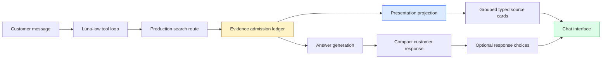

# TTC Garden Assistant Progressive UX — From Raw Chunks to Auditable Source Groups

The TTC Garden Assistant has reached a point where retrieval quality alone no longer determines whether the system feels useful. The production pipeline can retrieve grounded material, resolve exact product facts for the appropriate query class, preserve multi-turn conversation state, and expose citations. The remaining customer-facing problem is presentation: answers are often too long for the chat window, source cards expose large retrieval fragments, and optional detail remains embedded in a single response instead of being available through concise follow-up actions.

This project separates that presentation problem from retrieval optimization. Its purpose is to produce compact initial answers, useful response choices, and source cards that represent documents and products rather than raw chunks. The implementation is organized into phases U0 through U5. U0 and U1 are complete. They establish the measurement baseline, payload contracts, deterministic evidence taxonomy, same-document grouping, product presentation enrichment, and full provenance needed by the customer renderer. U2 through U5 remain to implement and validate the visible experience.

> [!summary]
> - The accepted production baseline has a median response length of 139.5 words and a maximum of 262 words; four of five retained source cards expose raw retrieval text.
> - U0 froze reproducible calibration data and versioned source-group and chat-choice contracts before behavior changed.
> - U1 now groups only admitted evidence, classifies it from immutable corpus roles, preserves citation/chunk/score lineage, and adds catalog facts only to an already admitted product.
> - Retrieval ranking and model-visible evidence remain unchanged. This makes later answer and interface improvements experimentally attributable.
> - The next deliverable is U2: five typed, accessible customer card variants that never render raw chunk text.

## 1. Why this project exists

The production Garden Assistant has two different consumers of retrieved evidence. The answer model requires the original evidence in enough detail to generate a grounded answer. The customer requires a concise explanation of where that answer came from. These consumers should not receive the same representation.

A retrieval chunk is an indexing and generation unit. Its boundaries are selected for search recall, token budgets, and local semantic coherence. A customer source is usually a document, product, FAQ, policy page, or structured database record. Displaying a chunk as if it were a source leaks internal retrieval structure into the interface. It also produces several visible defects:

- One document can appear as several cards because several chunks were admitted.
- A fragment can begin or end mid-discussion and lack the context required to identify its subject.
- Product facts are embedded in prose rather than aligned into fields.
- Citation labels become the primary visual identity even though they are session-local references.
- Long excerpts compete with the answer for the limited vertical space in the chat window.

The calibration review exposed a related answer-design defect. Some responses were useful and grounded but too long for initial display. The preferred interaction has a moderately concise answer, followed by two to four actions such as **Compare growth rates**, **Show spacing advice**, or **See care requirements**. If the assistant needs a factual constraint, it should offer answer choices and include **I don't know** when the conversation can still progress without that fact.

These are presentation and interaction changes. They must be evaluated without changing ranking, retrieval routes, or the evidence shown to the answer model. Otherwise, an improvement in a card or prompt could be incorrectly attributed to retrieval, or a retrieval regression could be hidden by better formatting.

## 2. Relationship to the intent-aware RAG system

This work begins after the intent-aware retrieval project documented in [[PROJ - TTC Garden Intent-Aware RAG Optimization]]. That project established a narrow production routing decision: exact named product questions may use structured-first catalog resolution, while recommendation, comparison, care, policy, and broad-information questions retain the established hybrid route.

The Progressive UX project accepts that production decision as fixed input. It does not add a planner, modify hybrid fusion, change top-k, enable global fact augmentation, or promote experimental connected retrieval. Its boundary is the projection from admitted evidence to the customer interface and the structure of the answer that accompanies it.

This produces a clean sequence of responsibilities:



The evidence ledger is the security and correctness boundary. Presentation may reduce, group, label, and enrich an admitted entity with authoritative display data. It may not admit a new document, repair identity through a guess, or introduce a fact into the answer model's context.

## 3. U0: establish a reproducible presentation baseline

U0 converted qualitative review comments into measured inputs and versioned contracts. This was necessary because answer length, source-card contents, metadata availability, and choice behavior had previously been discussed across several tickets and real conversations. The phase made those properties reproducible in one place.

### 3.1 Frozen calibration set

The U0 manifest contains seven cases and ten turns. It retains the reviewed examples and adds the interaction states required to test response choices:

- Blue Ice versus Carolina Sapphire comparison, including a selected **Compare growth rates** follow-up;
- two-turn Tampa privacy-screen recommendation;
- exact Emerald Green Arborvitae product facts;
- new-tree watering guidance;
- an unsupported diagnosis that requires abstention;
- a factual clarification where **I don't know** must be useful;
- a preference clarification where **I don't know** would be inappropriate.

The manifest uses the existing calibration runner's `choose` field. A selected pill is therefore evaluated as an ordinary user message in the same session. There is no second conversation mechanism for UI actions.

### 3.2 Measured answer baseline

The baseline comes from the accepted real Luna-low I4 production run `20260804T045051.507930459Z-620e64cd05ff6e22`. Word counts use the same whitespace-token convention as the earlier I3/I4 reports, preserving comparison validity.

| Case and turn | Words | Characters | Source cards |
|---|---:|---:|---:|
| Blue Ice comparison | 170 | 1,076 | 2 |
| Tampa recommendation, turn 1 | 247 | 1,674 | 0 |
| Tampa recommendation, turn 2 | 262 | 1,693 | 0 |
| Emerald Green product fact | 24 | 197 | 1 |
| New-tree watering | 83 | 516 | 2 |
| Unsupported diagnosis | 109 | 696 | 0 |

The median is 139.5 words and the maximum is 262 words. Three of six retained answers exceed the 120-word target. Two exceed 180 words. The longest failures occur in recommendation conversations, where the model tends to provide selection criteria, several candidates, caveats, and follow-up questions in one response.

The target is not mechanical truncation. The compact prompt must preserve three elements before offering optional detail:

1. the direct recommendation or conclusion;
2. the decisive reason;
3. any material qualification that changes whether the recommendation is safe or applicable.

The planned default is 70–120 words. Responses above 180 words require an explicit recorded reason during evaluation.

### 3.3 Measured card baseline

The retained run contains five source cards. Four display raw retrieval snippets, and the five cards contain 4,348 snippet characters in total. None contains a document-level summary.

| Evidence presentation | Count | Customer-visible behavior |
|---|---:|---|
| Product cards | 2 | Title, optional URL, and approximately 1,200 characters of chunk text |
| Article cards | 2 | Title, URL, and 749–1,200 characters of chunk text |
| Structured fact cards | 1 | Title, URL, and three selected facts |

This baseline provides a deterministic acceptance criterion for U2: customer mode must display zero raw retrieval chunks. Raw evidence remains available to developers and transcript analysts.

### 3.4 Metadata coverage determines fallback behavior

The corpus contains 200 indexed documents. Every document has a title and source URI, and every document has a deterministic source role. The distribution is 80 products, 48 posts, 35 FAQs, 19 TTC guides, and 18 pages. No document currently has a precomputed `summary` or `category` metadata field.

The commerce database contains 2,594 products. Identity and size fields have high coverage, but suitability fields are present for only about 60 percent of records.

| Product field | Records with value | Coverage |
|---|---:|---:|
| SKU | 2,590 | 99.8% |
| Botanical name | 2,528 | 97.5% |
| Mature height | 2,519 | 97.1% |
| Mature width | 2,504 | 96.5% |
| Hardiness zone | 1,570 | 60.5% |
| Sunlight | 1,564 | 60.3% |
| Soil conditions | 1,561 | 60.2% |
| Drought tolerance | 1,561 | 60.2% |

Missing metadata is therefore part of normal execution. The contract forbids the frontend from filling gaps using answer prose or generated guesses. An article without a valid document summary receives a title and verified link only. A product with two available facts displays two facts. A non-allowlisted URL is omitted. An unsupported source role becomes `unknown` and receives the most conservative presentation.

### 3.5 Frozen wire contracts

U0 introduced two versioned JSON Schemas:

- `ttc.source-groups.v1` describes source identity, evidence kind, lineage, display facts, field selection, and developer evidence.
- `ttc.chat-choices.v1` describes a follow-up or clarification prompt and two to four choices, each with a stable ID, short label, and complete message.

The choice payload deliberately separates the label from the submitted message:

```json
{
  "schemaVersion": "ttc.chat-choices.v1",
  "mode": "follow_up",
  "prompt": "What would you like to compare next?",
  "choices": [
    {
      "id": "growth-rates",
      "label": "Compare growth rates",
      "message": "Compare the growth rates of Blue Ice and Carolina Sapphire."
    }
  ]
}
```

The customer sees the short label. The ordinary chat endpoint receives the complete message. This preserves transcript readability, session continuity, and replay behavior.

## 4. U1: deterministic evidence typing and grouping

U1 implemented the backend foundation required by typed cards. The principal change is that a source result is no longer treated as a flat citation plus snippet. It is an admitted source group with stable identity, kind, lineage, optional structured facts, and developer-only raw evidence.

### 4.1 Classification uses immutable source identity

Earlier card logic could infer a product from textual markers such as `sku:`. That is unsafe because chunk text is content, not source identity. U1 classifies from corpus `source_role`, exact admitted-product catalog resolution, and a limited policy rule for operational pages.

| Input identity | Output kind |
|---|---|
| `source_role=product` | `product` |
| `source_role=faq` | `faq_or_policy` |
| operational page title or URL | `faq_or_policy` |
| post, TTC guide, or ordinary page | `article` |
| exact product resolution for an admitted document | `product` |
| unsupported role without exact resolution | `unknown` |
| direct database evidence without a chunk citation | `structured_fact` |

There are five initial customer variants. The taxonomy is intentionally bounded. It describes the evidence available today without introducing a generic card language or generated ontology.

### 4.2 Grouping occurs after evidence admission

Chunk evidence groups by document ID. If a citation has no document ID, it receives its own `chunk:<chunk-id>` group key so that incomplete records cannot be merged accidentally. Repeated chunks from one document therefore become one customer card while retaining every contributing citation label.

```text
function group_admitted_citations(citations):
    groups = ordered map

    for citation in citations:
        if citation.document_id is not empty:
            key = "document:" + citation.document_id
        else:
            key = "chunk:" + citation.chunk_id

        group = groups.get_or_create(key)
        group.kind = classify_from_source_role(citation.source_role)
        group.lineage.append({
            citation: citation.label,
            document_id: citation.document_id,
            chunk_id: citation.chunk_id,
            source_role: citation.source_role,
            score: citation.first_admission_score
        })
        group.developer_evidence.append(citation.raw_text)

    return groups.in_stable_order()
```

The grouping algorithm cannot add a source. Its input is the selected subset of citations that already exists in the session ledger. The output may contain fewer visual cards than citations because several citations can belong to one document.

### 4.3 First-admission score semantics

The reusable `ttcrag` ledger previously retained citation label, chunk identity, document identity, and text, but discarded the retrieval score. U1 extends the ledger with `SourceRole` and the fused score observed when a chunk first receives its E label.

This timing matters. The same chunk may be returned by a later search with a different query and a different score. Updating the stored value would make the meaning of an existing citation depend on subsequent tool calls. The group therefore records the first-admission score, while the current `ttc_search` result continues to expose the score for the current call.

The distinction should remain explicit in analyst documentation:

- current search score explains the ranking within one tool call;
- first-admission score explains when and with what rank evidence entered the conversation ledger.

### 4.4 Three catalog boundaries prevent evidence leakage

The application now maintains three conceptually separate catalog references.

| Catalog reference | Purpose | Can change answer evidence? |
|---|---|---|
| `catalog` | Experimental post-retrieval augmentation | Yes, when explicitly enabled |
| `queryCatalog` | Query-first exact product route | Yes, because it is an admitted production route |
| `displayCatalog` | Presentation facts for an already admitted source | No |

The `displayCatalog` separation is the most important U1 design decision. A product card needs a verified public URL and a few authoritative facts even when global fact augmentation is disabled. Reusing answer augmentation for presentation would either expose too little information in the card or silently change the model's evidence.

The implemented path is narrower:

```text
selected E labels
    -> validate against session ledger
    -> collect unique admitted document IDs
    -> resolve those documents exactly in display catalog
    -> attach up to four display facts and verified URL
    -> do not add facts to answer-model context
```

If resolution is missing, ambiguous, or fails, the admitted group remains valid and uses conservative title/link presentation. A catalog failure logs a warning; it does not discard the source or broaden resolution.

### 4.5 Structured facts have two legitimate admission paths

Structured facts can appear in two forms.

First, the production `structured_first` route can admit database facts directly for an exact named product. These facts have no E citation or chunk lineage. They remain trustworthy because each fact records its database digest, fixed query ID, source tables and fields, and product item ID. The customer kind is `structured_fact` unless associated product identity allows a product presentation.

Second, presentation-only resolution can attach facts to a chunk-backed admitted product group. These facts improve the source card but do not become answer evidence. If the same field appears in both model-visible facts and presentation facts, U1 deduplicates by document and field.

This design does not treat all displayed information as equivalent. Lineage states whether a value came from admitted chunk evidence, directly admitted structured evidence, or presentation-only authoritative metadata.

## 5. Verification and implementation record

The work is split across the application and reusable RAG repositories.

| Repository | Commit | Result |
|---|---|---|
| `2026-05-27--ttc-design-system` | `d666ba1` | Frozen U0 script, metrics, cases, and schemas |
| `2026-05-27--ttc-design-system` | `dc374a8` | Recorded U0 completion |
| `rag-ttc` | `799fbd7` | Retained source role and first-admission score |
| `2026-05-27--ttc-design-system` | `b0c2001` | Added typed grouping, lineage, and admitted-only display resolution |
| `2026-05-27--ttc-design-system` | `eda2558` | Recorded U1 completion |

The focused and aggregate backend tests passed:

```text
go test ./pkg/ttcrag -count=1
go test ./backend/internal/evidenceview ./backend/internal/ragsearch ./backend/internal/ttcwidgets -count=1
go test ./backend/... -count=1
```

The tests cover the correctness boundaries rather than only serialization:

- unsupported and missing roles fall back to `unknown`;
- a partial product displays only available facts and reports missing fields;
- conflicting extracted values are omitted;
- comparison products use aligned labels when values are available;
- every group retains citation, chunk, document, source-role, and score lineage;
- raw evidence remains present for developer inspection;
- an unadmitted product present in the catalog cannot appear in the output;
- presentation resolution queries only unique admitted document identities.

The implementation also encountered two environment failures that did not require code changes. An unprivileged calibration test could not open an IPv6 loopback listener, and an unprivileged `rag-ttc` test could not read the configured Go build cache. Both commands passed when executed with the required local permissions. The diary retains the exact errors so future failures are not misdiagnosed as regressions.

## 6. Important code and artifact locations

| Responsibility | Location |
|---|---|
| Progressive UX design and phase plan | `2026-05-27--ttc-design-system/ttmp/2026/08/03/TTC-GARDEN-PROGRESSIVE-UX-001--compact-progressive-garden-answers-response-choices-and-typed-evidence-cards/design-doc/01-implementation-guide-for-progressive-answers-and-typed-evidence-presentation.md` |
| Strict implementation diary | same ticket, `reference/01-investigation-and-implementation-diary.md` |
| Phase and task ledger | same ticket, `tasks.md` |
| Reproducible U0 summarizer | same ticket, `scripts/01-summarize-u0.py` |
| Frozen calibration cases | same ticket, `sources/u0/cases.yaml` |
| Frozen JSON Schemas | same ticket, `sources/u0/contracts/` |
| U0 analysis | same ticket, `sources/u0/02-baseline-and-contracts.md` |
| U1 verification report | same ticket, `sources/u1/01-evidence-typing-and-grouping.md` |
| Reusable evidence ledger | `rag-ttc/pkg/ttcrag/search.go` and `types.go` |
| Evidence classification and grouping | `backend/internal/evidenceview/evidenceview.go` |
| Source-widget assembly and display resolution | `backend/internal/ragsearch/ragsearch.go` |
| Session catalog boundaries | `backend/internal/ragsearch/searchtool.go` |
| Go widget payloads | `backend/internal/ttcwidgets/payloads.go` |

## 7. What remains

U0 and U1 complete the measurement and data-model foundation. They do not yet deliver the final customer interface. The remaining phases should proceed in order because each phase isolates one additional variable.

### 7.1 U2: typed evidence cards

U2 replaces the legacy flat `citation`, `chunkIds`, and `snippet` customer payload with the frozen source-group contract. It implements five variants:

- **Article:** verified title and link, optional category, and a valid document-level summary when available.
- **Product:** product name, verified link, and no more than four authoritative facts.
- **FAQ or policy:** compact topic, short description, and verified link.
- **Structured fact:** concise label/value presentation with fixed-query database provenance.
- **Unknown:** verified title and optional link only.

Raw chunk text must be absent from the customer renderer and present in developer inspection. U2 also requires responsive layouts, keyboard navigation, screen-reader labels, hydration coverage, missing-metadata fixtures, and comparison-field alignment tests.

Document summaries require particular care. The current corpus has no summary metadata. An isolated retrieval chunk must not be relabelled as a document summary. The safe initial behavior is title/link-only rendering until a deterministic full-document summary exists.

### 7.2 U3: compact answers and response choices

U3 first runs a prompt-only compactness control with unchanged retrieval and card behavior. If the compact prompt preserves recommendation quality and material qualifications, the phase adds the choice tool and frontend pills.

Choice selection must satisfy four invariants:

1. A choice submits its complete message through the ordinary session endpoint.
2. The group disables immediately after one selection.
3. Idempotency prevents duplicate turns.
4. Reload and hydration preserve the selected state when session persistence is enabled.

Clarification choices include **I don't know** only for factual constraints where the assistant can provide a useful next step without the value. Preference questions do not receive that option.

### 7.3 U4: controlled integration

U4 combines only the U2 and U3 candidates that passed their isolated controls. It reruns the frozen cases using the same production retrieval configuration and retains complete CHATDATA transcripts, tool calls, evidence, widget payloads, model metadata, and judge outputs.

The intended comparison sequence is:

1. current prompt and current cards;
2. compact prompt only;
3. compact prompt plus choices;
4. compact prompt plus choices and typed cards.

This sequence identifies whether a quality change came from answer prompting, interaction structure, or evidence presentation.

### 7.4 U5: human release calibration

Automated measures can verify length, schema validity, provenance, citation consistency, and click behavior. They cannot decide whether the interface feels concise, readable, and helpful in the actual small chat surface. U5 therefore requires real Luna-low multi-turn conversations, mobile-width screenshots, and human review.

Promotion criteria include:

- median initial response at most 120 words;
- no response above 180 words without a recorded reason;
- recommendation and material qualifications preserved;
- useful pills where optional detail exists;
- productive clarification behavior;
- zero raw chunks in customer mode;
- no more than four facts per product card;
- complete source lineage in developer mode and transcripts;
- accepted real customer-mode conversation at mobile width.

## 8. Failure modes and review rules

The project should continue to enforce several rules that are easy to violate during frontend work.

### 8.1 Presentation must not become retrieval

Resolving an admitted product for a public URL and display facts is allowed. Searching for additional products while building cards is not. The selected citation ledger must remain the complete identity set from which cards are built.

### 8.2 Generated prose must not become authoritative metadata

A model answer may contain a useful sentence about a product or article. That sentence is not a product fact, document summary, category, or source title. Customer cards use immutable metadata, fixed-query database values, or an explicitly defined document-summary pipeline.

### 8.3 Customer simplicity must not remove analyst detail

Removing raw chunks from the customer view does not authorize discarding them. Developer mode and analyst-safe CHATDATA exports need system prompts, tool definitions, tool calls, tool results, reasoning summaries, model metadata, grouped provenance, and raw admitted evidence. Customer and analyst projections are different views over the same retained execution record.

### 8.4 Citation labels are lineage, not card identity

E labels are useful in prose and debugging, but a card should be identified primarily by its document or product. Several labels can contribute to one card. Direct database facts may have no E label at all and instead require fixed-query provenance.

### 8.5 Compactness is subordinate to correctness

The system should not meet a word target by removing the condition that determines whether a recommendation applies. Length is a gate combined with directness, qualification retention, relevance, faithfulness, and human review. There is no hard truncation step.

## 9. Current status

The project is active. U0 and U1 are complete and committed in both repositories. The backend now contains the evidence semantics required by the final interface: deterministic type, stable group identity, complete lineage, first-admission score, admitted-only catalog enrichment, conservative fallback, and developer evidence retention.

The next implementation boundary is U2. It should change the public Go and TypeScript source payload together, remove legacy snippet fields rather than maintaining an adapter, implement the five card variants, and prove through tests that raw retrieval text never appears in customer mode. Only after U2 is independently reviewable should compact prompting and response choices be introduced in U3.

## 10. Working rules

> [!important]
> Keep retrieval fixed while presentation is being evaluated. Group only admitted evidence. Use authoritative facts only for an already admitted identity. Preserve raw evidence for developers and analysts, but never render it as customer source content. Introduce one customer-facing variable at a time and retain every rejected result.
