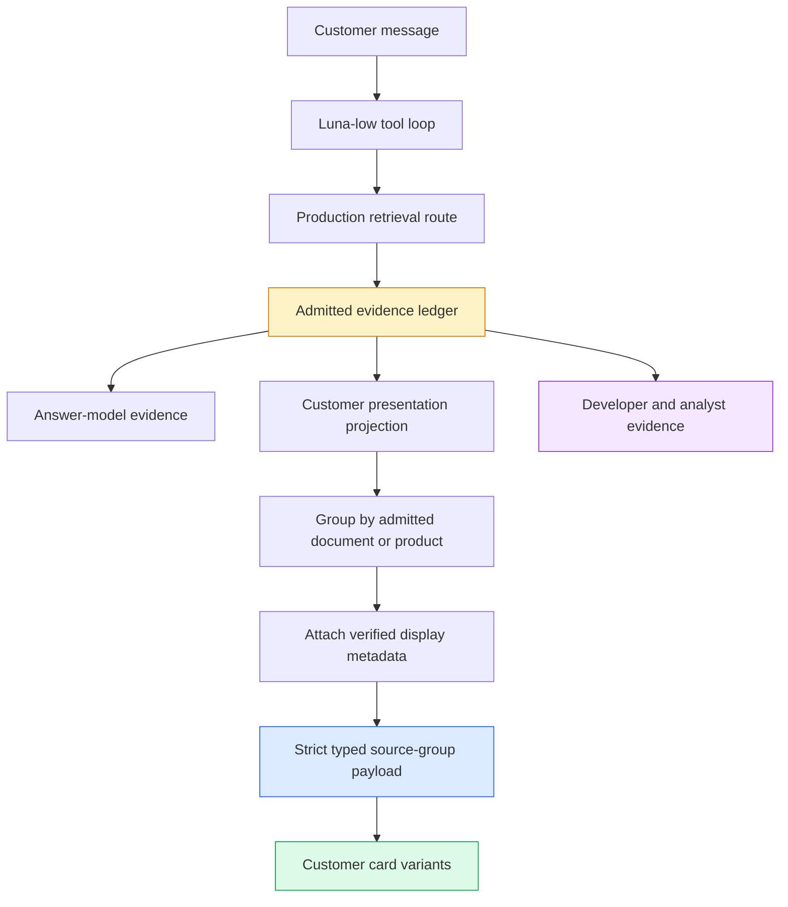

# TTC Garden Assistant Progressive UX — Typed Evidence Cards and Compact Answer Controls

The TTC Garden Assistant now has a strict customer-facing source representation and a measured compact-answer candidate. Retrieval chunks remain available to the model, developers, and transcript analysts, but the customer interface renders documents, products, policies, and structured facts as distinct source entities. A prompt-only control then tested whether the same Luna-low model and retrieval configuration could produce shorter answers without losing the conversation state required for multi-turn recommendations.

This report continues [[PROJECT REPORT - TTC Garden Assistant Progressive UX - From Raw Chunks to Auditable Source Groups]]. That earlier report records the U0 baseline and U1 evidence-grouping foundation. The present report explains U2 in full and records the ongoing U3 experiment. U2 is complete and committed. U3 has a successful prompt candidate, but response-choice tooling, controlled integration, and human release calibration remain unfinished.

> [!summary]
> - U2 replaced the legacy citation-and-snippet payload with the strict `ttc.source-groups.v1` contract and five customer card variants. Customer markup contains no raw retrieval chunks.
> - Article summaries are derived deterministically from full verified documents, never from the retrieved fragment. Product cards show at most four authoritative catalog facts.
> - The first compact prompt reduced length but failed multi-turn continuity. A second candidate explicitly required cumulative conversation-state use and preserved the Tampa recommendation context.
> - The accepted prompt candidate reduced the six-turn median from 145.5 to 109.5 words and the maximum from 270 to 143 words under the same model, retrieval configuration, index, and case manifest.
> - The next implementation unit is `ttc_chat_choices_show`: two to four follow-up or clarification pills submitted as ordinary messages in the same session.

## 1. The presentation boundary

The answer model and the customer interface consume different projections of the same admitted evidence. The model needs verbatim chunks because those chunks contain the text against which claims are grounded. The customer needs source identity, subject, public location, and a small number of interpretable facts. U2 makes this distinction enforceable at the wire-contract and renderer levels.

The governing invariant is:

```text
customer presentation may transform admitted evidence;
customer presentation may not admit evidence.
```

This rule has concrete consequences. Grouping several admitted chunks from one document into one card is valid. Resolving the public URL and display facts of an already admitted product is valid. Searching for an additional product because it would make a card more complete is not valid. Adding presentation facts to the model context is also not valid unless those facts entered through an explicitly configured answer-evidence route.



The ledger is the shared boundary. Both projections retain provenance, but they expose it at different levels of detail.

## 2. U2: a strict typed source contract

The earlier customer payload combined citation labels, chunk IDs, and a long `snippet` field. That shape encouraged the frontend to treat retrieval chunks as display entities. U2 removed the public legacy fields `citation`, `citations`, `chunkIds`, and `snippet`. It did not add a compatibility adapter. A producer must emit the current schema, and a consumer must validate it.

The new payload identifies itself as `ttc.source-groups.v1`. A source group contains stable group identity, evidence kind, title, verified URL, optional document summary or category, structured display facts, lineage, field-selection metadata, and developer evidence. Go serialization normalizes required collections to non-null arrays so that JavaScript does not need to interpret `null` as an empty collection.

Conceptually, the contract has this form:

```typescript
type SourceGroup = {
  groupId: string
  kind: "article" | "product" | "faq_or_policy" |
        "structured_fact" | "unknown"
  title: string
  url?: string
  summary?: string
  category?: string
  facts: DisplayFact[]
  lineage: EvidenceLineage[]
  selectedFields: string[]
  missingFields: string[]
  developerEvidence: DeveloperEvidence[]
}
```

The TypeScript consumer uses strict Zod validation. Unknown properties and invalid cross-field combinations do not silently pass. This decision made stale process state visible during Playwright testing: an old backend still emitted the removed fields and omitted `schemaVersion`, `groupId`, and `lineage`; the current frontend rejected it and showed the invalid-payload state. That failure was useful evidence that the contract boundary worked. It was not accepted as a current-code visual test.

### 2.1 Five bounded variants

The renderer supports five variants rather than a generic card-description language.

| Kind | Customer content | Data deliberately excluded |
|---|---|---|
| `article` | Title, full-document subject summary, optional guide category, verified link | Retrieved chunk text and product facts |
| `product` | Product name, verified public link, up to four authoritative facts | Generated summaries and arbitrary prose excerpts |
| `faq_or_policy` | Policy topic, concise full-document description, verified link | Large article treatment and chunk fragments |
| `structured_fact` | Compact label/value facts with database provenance | Fabricated E labels and chunk lineage |
| `unknown` | Verified title and link | Summary, category, and facts inferred from uncertain identity |

The variants encode data semantics as well as visual differences. A product group must not inherit an editorial summary merely because its underlying corpus document has prose. An unknown group must clear summary, category, and facts even if generic display metadata is available. A direct database fact has no chunk citation; its lineage is an empty array rather than a fabricated citation.

### 2.2 Whole-document summaries

The corpus has titles, source URIs, and deterministic source roles for every indexed document, but it does not have precomputed summary fields. The incorrect implementation would display the top retrieved chunk as the article summary. That text is selected for query relevance, not for document-level description, and can begin in the middle of a section.

U2 instead derives a bounded lead summary at startup from each full verified corpus document. The selector skips titles, headings, list fragments, and the `ttc_guide_categories:` marker. It chooses a prose lead, truncates to 240 Unicode code points, and prefers a sentence or word boundary. TTC guide categories are read from metadata when available and otherwise from the verified guide marker. Product documents do not receive generated document summaries.

```text
function derive_display_summary(document):
    for block in document.blocks:
        if block is title or heading:
            continue
        if block is list-like or category marker:
            continue
        if block is substantive prose:
            return truncate_unicode(block, 240,
                                    prefer_sentence=true,
                                    prefer_word=true)
    return no_summary
```

This is deterministic and does not require another inference call. It also keeps the summary coupled to the indexed corpus version. If the source bundle changes, startup derivation changes with it.

### 2.3 Product and structured-fact presentation

Product cards resolve exact catalog identity only after the product document has been admitted. The display catalog supplies a verified public URL and at most four selected facts. Partial products remain valid: a product with height and sunlight but no hardiness zone displays the two known fields and does not generate the missing values.

Comparison products align labels when the data supports it. If both Blue Ice and Carolina Sapphire have mature height and growth information, both cards use the same visible field labels. This makes a comparison visually parseable without turning the source area into a generated comparison answer.

Structured facts admitted directly from SQL retain database digest, fixed query identity, source table and field, and item identity. Their trust does not depend on E-label lineage because their database provenance is the admission record. Presentation-only catalog facts are different: they enrich a card but are not evidence for claims made by the model.

## 3. Customer and developer representations

Raw evidence was not deleted. It remains in `developerEvidence` and in durable chat records so a developer can inspect exactly what the answer model received. The customer React component does not render that field. A sentinel test proves that raw evidence is absent from customer markup before and after hydration.

This separation is essential for later optimization. Analysts need system prompts, tool definitions, tool results, reasoning summaries, model metadata, evidence chunks, and widget payloads to identify failures. Customers need concise source entities. Removing analyst detail to simplify the customer component would make future evaluation weaker. Rendering analyst detail in customer mode would make the product harder to use.

The final data ownership is:

| Data | Answer model | Customer UI | Developer UI / transcript |
|---|---:|---:|---:|
| Verbatim admitted chunks | Yes | No | Yes |
| E labels | Yes | Secondary lineage label | Yes |
| Full source lineage | Internal | Not expanded by default | Yes |
| Document-level summary | No additional evidence | Yes | Yes |
| Presentation-only product facts | No | Yes | Yes, with provenance |
| Direct admitted SQL facts | Yes | Yes | Yes, with provenance |

## 4. U2 verification

The complete application backend suite passed. TypeScript type checking passed. All 12 focused source-widget tests passed. The complete frontend suite passed 51 of 52 tests; the single failure is an unrelated pre-existing DMETA manifest-count assertion expecting 17 entries while the manifest contains 31.

The focused tests cover more than snapshot appearance:

- Each of the five source kinds renders its permitted fields.
- Unsafe external URLs are rejected before rendering.
- Article and policy summaries use the new summary field rather than raw evidence.
- Product fact count is bounded and comparison labels align.
- Customer markup excludes `developerEvidence` before and after hydration.
- Semantic headings, link names, keyboard focus, and screen-reader structure are present.
- The compact layout has an explicit mobile breakpoint at 30 rem.

The implementation was committed as `a4dd9be` in `2026-05-27--ttc-design-system` with the message `feat(chat): render strict typed evidence cards`. The reusable evidence-role and first-admission-score changes remain in `rag-ttc` commit `799fbd7`.

## 5. U3: isolate compact-answer behavior

U3 begins with a prompt-only control. This order matters because prompt, choices, and cards affect different properties. If they were introduced together, a shorter response could be attributed incorrectly to response pills, or a continuity failure could be hidden by an attractive card.

The control freezes all non-prompt variables:

- Model profile: `ttc-live-luna-low`.
- Registry: `rag-ttc`.
- Retrieval configuration: `production-product-fact-v1.yaml`.
- Corpus bundle: the same content-addressed TTC bundle.
- Case manifest: five cases and six turns.
- Runner and durable response format: unchanged.

The cases cover a named-product comparison, a two-turn Tampa recommendation, an exact product fact, a care answer, and an unsupported diagnosis. Choice-specific cases are deferred until `ttc_chat_choices_show` exists.

### 5.1 Control result

The current customer prompt produced turn lengths of 175, 247, 270, 26, 96, and 116 words.

| Metric | Control |
|---|---:|
| Mean | 155.0 words |
| Median | 145.5 words |
| Maximum | 270 words |
| Turns at or below 120 words | 3 of 6 |

This closely reproduces the U0 finding. Exact product questions are already compact. Recommendation and comparison turns account for most excess length.

### 5.2 Candidate v1: compact but context-breaking

The first candidate added the 70–120 word target and required the recommendation, decisive reason, and material qualification. It produced lengths of 145, 135, 36, 23, 81, and 121 words. The median fell to 101 words and the maximum to 145 words.

Those numbers are not sufficient for acceptance. On the second Tampa turn, the model forgot the earlier planting goal and sun context and asked the customer to provide them again. A prompt that shortens an answer by discarding cumulative conversation state does not improve the chat experience.

This failure establishes an important evaluation rule: compactness is constrained by continuity. Word count is an optimization objective only after the response uses all relevant facts already supplied by the customer.

### 5.3 Candidate v2: explicit cumulative state

The second candidate kept the compact response structure and added an explicit instruction to treat the conversation as cumulative. It forbids asking again for a goal, location, exposure, zone, size, or preference already supplied unless the customer has contradicted or changed it.

Candidate v2 produced lengths of 130, 139, 143, 23, 63, and 89 words.

| Metric | Control | Candidate v1 | Candidate v2 |
|---|---:|---:|---:|
| Mean | 155.0 | 90.2 | 97.8 |
| Median | 145.5 | 101.0 | 109.5 |
| Maximum | 270 | 145 | 143 |
| Multi-turn context preserved | Yes, but verbose | No | Yes |

Candidate v2 preserves the Tampa privacy-screen request, location, exposure, and zone. It recommends a concrete plant, states the relevant condition, and includes the deer-related limitation without repeating the earlier discovery questions. Every response is below the 180-word exception threshold, and the median satisfies the 120-word target.

The correct production decision is therefore not “choose the shortest prompt.” It is “choose the shortest prompt that preserves recommendation utility, material qualifications, grounding, and cumulative session state.” Candidate v2 is the current U3 prompt candidate. It still requires the response-choice implementation and controlled U4 evaluation before release promotion.

## 6. Why clickable choices are the next unit

A compact initial answer cannot contain every useful detail. The system needs a deliberate continuation mechanism. The frozen `ttc.chat-choices.v1` contract supports two modes:

- `follow_up` offers optional detail after a complete compact answer;
- `clarification` offers bounded answers when the assistant needs information before giving a trustworthy recommendation.

The backend tool will be named `ttc_chat_choices_show`. It will validate two to four choices with unique case-insensitive IDs, labels, and complete submitted messages. The frontend will render the choices below the owning answer, accept only one selection, disable the group immediately, and display the selected state.

The click must submit an ordinary user message through the existing chat session:

```text
on_choice_click(choice):
    if group.already_selected:
        return

    disable_all_choices_immediately()
    mark_selected(choice.id)
    submit_chat_message(
        session_id = current_session,
        text = choice.message,
        idempotency_key = stable_selection_key(group.id, choice.id)
    )
```

This avoids a parallel action state. Persistence, turn export, replay, multi-turn inference, and later GEPA-style analysis all observe the selected follow-up as normal conversation data.

“I don’t know” is conditional. It is useful when the model asks for a factual property that a customer may not know and can still make progress without it, such as hardiness zone. It is not useful for a preference such as evergreen versus flowering, because the customer must choose the desired result.

## 7. Failure modes and retained lessons

### 7.1 A valid schema can expose stale deployment state

The Playwright attempt that displayed an invalid payload did not justify weakening validation. It showed that the browser was connected to an old producer. Adding a legacy adapter would have hidden the operational error and extended two public contracts. The correct U4 procedure is to establish clean service ownership, start the current backend and frontend, and then capture visual evidence.

### 7.2 A length target can damage multi-turn behavior

Candidate v1 met the numerical compactness target while failing the interaction. Evaluation must inspect the conversation, not only per-turn statistics. Future compactness judges should explicitly test unnecessary repetition and re-asking of known constraints.

### 7.3 A document summary is not a retrieval snippet

Both are text, but their semantics differ. A snippet explains why a search result matched. A document summary identifies what the source covers. The customer card requires the latter. Conflating them produces contextless source lists and overstates the representativeness of a local fragment.

### 7.4 Display enrichment must not become answer evidence accidentally

Catalog fields can improve a product card without changing what the model is permitted to claim. The separate `displayCatalog` boundary preserves that distinction. Any future field added to a card must retain explicit provenance and must not be inserted into generation context implicitly.

## 8. Current status and remaining phases

| Phase | Status | Result or next decision |
|---|---|---|
| U0 — Baseline and contracts | Complete | Frozen cases, measurements, schemas, and fallback rules |
| U1 — Evidence typing and grouping | Complete | Deterministic kinds, admitted-only grouping, full lineage |
| U2 — Typed evidence cards | Complete | Strict payload and five accessible customer variants |
| U3 — Compact answers and choices | In progress | Candidate v2 selected; choice tool and lifecycle remain |
| U4 — Controlled integration | Pending | Compare baseline, prompt-only, choices, and full-card arms |
| U5 — Human release calibration | Pending | Real Luna-low conversations, mobile/desktop review, promotion |

The immediate implementation sequence is:

1. Promote candidate v2 guidance into the active customer prompt while retaining all prompt-only artifacts.
2. Add a deterministic U3 result summarizer and document the rejected v1 continuity failure.
3. Implement and register `ttc_chat_choices_show` in the backend tool registry.
4. Render and submit one idempotent choice in the same session, including the conditional factual **I don’t know** path.
5. Record choices and selected messages through CHATDATA.
6. Run the four controlled U4 arms with identical retrieval.
7. Perform current-code Playwright tests for all source kinds and the complete choice lifecycle.
8. Retain and review real Luna-low multi-turn conversations at mobile and desktop widths.

## 9. Important files and commits

The implementation ticket is:

`/home/manuel/workspaces/2026-06-30/benchmark-cpu-inference/2026-05-27--ttc-design-system/ttmp/2026/08/03/TTC-GARDEN-PROGRESSIVE-UX-001--compact-progressive-garden-answers-response-choices-and-typed-evidence-cards`

The most important files are:

- `design-doc/01-implementation-guide-for-progressive-answers-and-typed-evidence-presentation.md` defines the phase boundaries and acceptance criteria.
- `reference/01-investigation-and-implementation-diary.md` retains exact commands, failures, decisions, and review instructions.
- `sources/u0/contracts/source-groups-v1.schema.json` and `chat-choices-v1.schema.json` freeze the wire contracts.
- `sources/u2/01-typed-evidence-card-results.md` records U2 implementation and verification.
- `sources/u3/` contains matched control, rejected candidate, and candidate-v2 response artifacts.
- `backend/internal/evidenceview/evidenceview.go` owns classification, grouping, lineage, and display-fact assembly.
- `backend/internal/ragsearch/display_metadata.go` derives full-document presentation metadata.
- `backend/internal/ragsearch/ragsearch.go` publishes admitted source groups.
- `web/packages/ttc-garden-assistant/src/components/organisms/SourceResultsWidget/SourceResultsWidget.tsx` renders the five customer variants.
- `web/packages/ttc-garden-assistant/src/features/chat/widgetPayloads.ts` enforces the strict frontend schema.

Relevant commits are:

| Repository | Commit | Purpose |
|---|---|---|
| `rag-ttc` | `799fbd7` | Preserve source role and first-admission score in the reusable evidence ledger |
| TTC design system | `d666ba1` | Freeze U0 baseline, cases, and contracts |
| TTC design system | `b0c2001` | Group admitted evidence and attach complete lineage |
| TTC design system | `a4dd9be` | Render strict typed customer evidence cards |

## 10. Working rules

The remaining work should preserve five rules.

- Retrieval ranking remains fixed during presentation evaluation. Any retrieval change receives a separate experimental arm.
- Customer cards represent source entities, not retrieval chunks. Raw chunks remain available only to model, developer, and analyst paths.
- Displayed facts come from authoritative records with explicit provenance. Missing values remain missing.
- Compactness is accepted only when the recommendation, decisive reason, material qualification, and prior conversation state survive.
- Response choices are ordinary messages in the existing session. The system must not create a second conversation state for widget actions.

These rules keep the implementation small while preserving experimental attribution, customer trust, and future optimization data.
