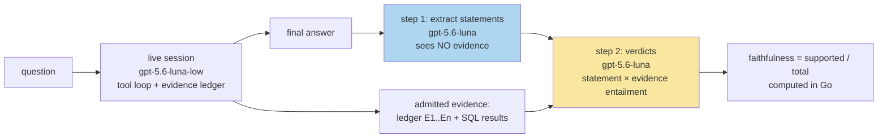

# CoinVault GEC-RAG: Benchmark-Gated Retrieval Optimization and the LLM Judge

This report covers one day of work on ticket GEC-RAG-OPT-001: the
transformation of a working retrieval system into a measured optimization
program. The system itself — hybrid BM25+vector retrieval over a
16,032-document coin-shop corpus, serving a `knowledge_search` tool with a
run-scoped evidence ledger and server-verified citations — was built in the
preceding two days and is documented in the companion notes
[[PROJ - CoinVault GEC-RAG - ragkit Extraction and knowledge_search Integration]]
and
[[PROJ - CoinVault GEC-RAG - Golden Eagle UI Overhaul and RAG Adoption Plan]].
This note is about what happened when every proposed improvement had to
survive a frozen benchmark, and most of them did not.

> [!summary]
> - A 60-question stratified evaluation set with authorization negatives and
>   judge-only questions replaced a 28-question set too coarse to detect real
>   changes; every retrieval candidate now gates on it.
> - Cross-encoder reranking was implemented correctly, driven correctly, and
>   measured five ways — and lost to plain reciprocal-rank fusion every time.
>   The verdict is settled, not provisional, and the losing mechanism ships
>   disabled behind one environment variable.
> - A two-step LLM judge (statement extraction, then per-statement verdicts)
>   produced the first answer-quality baseline: faithfulness 0.860, relevance
>   0.835 — after two instrument failures that were themselves the most
>   instructive results of the day.

## 1. Why this project exists

Retrieval systems accumulate plausible improvements faster than they
accumulate evidence. The hybrid retrieval gate that shipped the previous
evening (hybrid hit@5 0.821 versus lexical 0.714 on the full corpus)
established a working discipline: a change ships when a frozen question set
says it improves retrieval, and not otherwise. GEC-RAG-OPT-001 extends that
discipline into a program. Two work items were committed up front — a
cross-encoder reranker and growth of the evaluation set — and six more were
framed as exploration tracks, each with a hypothesis, a benchmark protocol,
and kill criteria written before any code.

Three model roles were fixed at the start, following the pattern of the
rag-ttc optimization program this work descends from:

| Role | Model | Purpose |
|---|---|---|
| Generation (answering) | `gpt-5.6-luna-low` | The production-target chat model; every judged answer comes from a live session on it |
| Judge | `gpt-5.6-luna` | Statement extraction and per-statement verdicts |
| Optimizer | Claude (the working assistant) | Diagnose from eval output, propose one bounded change per candidate, measure |

Three provenance rules travel with the table: the judge is a witness and
never a gate; the same-family pairing (luna judging luna-low) is a labeled
configuration whose absolute scores are not trusted until a cross-family
ablation runs; and quality scores are computed from binary verdicts, never
requested as bare numbers from a model.

## 2. The measurement foundation

### 2.1 Why 28 questions was not enough

With 28 questions, one flipped question moves hit@5 by 0.036 — larger than
most genuine improvements. The set grew to 60 reviewed questions in seven
strata, each stratum a distinct failure hypothesis:

| Stratum | n | What it isolates |
|---|---|---|
| guide-keyword | 16 | BM25 sanity on buying guides |
| schema-keyword | 6 | analyst-role documentation retrieval |
| paraphrase | 12 | queries that avoid the documents' title words — vector-channel value |
| facet-product | 10 | one product among 15,577 ("2011 san francisco silver eagle MS69") |
| multi-doc | 6 | comparison questions needing evidence breadth |
| scope-negative | 4 | authorization: the correct result is absence |
| unanswerable | 6 | policy questions the corpus provably cannot answer — abstention is correct |

Two mechanics matter. Negatives carry a per-question scope override
(`scopes: [public]`) and pass when the forbidden analyst documents stay
absent from the top-k; they contribute to hit rate but not to MRR, since
reciprocal rank is undefined for absence. Judge-only questions are excluded
from rank scoring entirely and scored by the answer judge (section 4).
Every expected document is verified against the corpus mechanically, and the
eval command warns on stale expectations rather than silently recording
permanent misses.

### 2.2 Determinism as a contract

Every stage of the retrieval pipeline breaks ties on chunk ID: the channel
orderings, the fusion, the reranker's output, the sweep's grid cells. Two
runs of any benchmark on the same bundle produce byte-identical output.
This is not a nicety — with 54 rank-scored questions, the difference between
signal and noise is one flipped question, and a nondeterministic pipeline
would erase the distinction.

## 3. The reranker investigation

The committed hypothesis was standard: retrieval fuses two cheap signals
(BM25 rank agreement with vector-cosine rank), and a cross-encoder that
reads (query, document) pairs jointly is a strictly stronger relevance
model, so rerank-the-top-of-the-pool should raise precision. The corpus
made it plausible — 15,577 templated product pages crowd any gold-adjacent
query. The investigation ran five configurations and the hypothesis failed
every gate. The sequence is worth recording in full because each failure
taught something specific.

### 3.1 The stage

The reranker slots between fusion and the scope filter:

```
candidates = WeightedRRF(lexical, vector)          # rank constant 60
if reranker configured and route == "auto":
    pool     = candidates[:40]                      # limit 5 × over-fetch 8
    evidence = hydrate(pool)                        # chunk text + heading context
    scores   = crossEncoder(query, evidence)        # one forward pass per pair
    head     = blend(pool order, score order)       # second RRF, section 3.4
    candidates = head ++ candidates[40:]
scope/role filter, truncate to k                    # unchanged
```

Reranking is serving configuration, never bundle identity: it is enabled by
environment variables (`COINVAULT_RERANK_URL`, `_MODEL`, `_POOL`,
`_TIMEOUT`, `_FORMAT`) and absent configuration leaves the pipeline
byte-identical. A forced `no-rerank` route lets the eval command score
lexical, hybrid, and hybrid+rerank on one bundle in one run. Rerank
failures degrade to the fused order rather than failing the tool call — a
property that turned out to cut both ways (section 3.3).

The cross-encoder itself runs on a Mac (`mimimi-2.local`) as llama.cpp's
`llama-server --rerank`, reached through an SSH tunnel
(`ssh -fN -L 18012:127.0.0.1:8012`), the same host-and-tunnel convention the
embedding build uses. This is also exactly the reranker rag-ttc used:
`bge-reranker-v2-m3:q4_k_m` on the same port, driven through geppetto's
llamacpp rerank provider.

### 3.2 Five configurations, one verdict

| Configuration | hit@5 | MRR | Note |
|---|---|---|---|
| hybrid (incumbent) | 0.815 | 0.718 | RRF fusion, no reranker |
| bge, bare chunk text | 0.796 | 0.639 | demoted correct guides it could not recognize |
| bge, title-prefixed documents | 0.815 | 0.651 | best paraphrase score of any route (0.500) |
| bge, blended with fusion | **0.833** | 0.682 | best hit@5 ever measured; MRR still short |
| Qwen3-4B, generic endpoint | 0.574 | 0.350 | invalid — template mismatch, section 3.3 |
| Qwen3-4B, official instruct format | 0.796 | 0.681 | fair test; still loses |

The gate requires no regression on either metric. Every configuration
loses MRR. The verdict — keep-hybrid — is settled across two models, two
document compositions, and two integration strategies, and the entire
mechanism remains in the tree one environment variable away from any future
candidate model.

### 3.3 What the failures taught

**Cross-encoders score what they are shown.** The first configuration fed
bare chunk text. Both retrieval channels see document titles (breadcrumb
representations carry them into the indexes), but the reranker saw only
chunk bodies, and demoted correct guide chunks whose bodies do not repeat
their titles. Prefixing the heading path recovered two hits and the best
paraphrase score of any route. Representation composition matters as much
at rerank time as at index time.

**A repurposed language model is not a reranker until its template is.**
Qwen3-Reranker-4B through llama.cpp's generic `/v1/rerank` endpoint returned
relevance scores in the 1e-22 range and collapsed even trivial keyword
strata (guide-keyword 0.875 → 0.438). The model expects its own judgment
template — a system prompt declaring a yes/no task, an
`<Instruct>/<Query>/<Document>` user turn, and a score read from the
probability of the token "yes" — which the BERT-style rerank path never
applies. A second adapter drives the model through `/completion` with a
one-token logprob readout and normalizes P(yes) against P(no); under that
format the model recovered 0.22 of hit rate and 0.33 of MRR. Two diagnostic
rules generalize: near-zero score magnitudes are a template-mismatch
signature, not a quality signal; and a strong model losing keyword queries
to BM25 means the harness is asking the wrong question.

**Fail-open plus benchmarking is a trap.** The first Qwen run timed out on
nearly every query (the hardcoded 30-second HTTP budget against ~45-second
pool scoring), and every timeout silently degraded to the fused order — so
the "reranked" route was mostly measuring plain hybrid. A degraded route
scores as its fallback. The timeout became configurable, and a
rerank-failure counter in eval output is recorded follow-up work.

**Caches must key on everything that changes the answer.** The rerank cache
keyed on candidate identities and an adapter version, but the model name
came from the request — which the service leaves empty. A second model
would have silently served the first model's cached scores. A tagging
wrapper now stamps the configured model onto every request before the cache
computes its key. The general rule: when a wrapper fills in a field after
the cache, the cache never saw it.

### 3.4 The cost arithmetic

Cross-encoding admits no amortization: every (query, document) pair is a
fresh full-prompt forward pass. At pool 40 the benchmark is 54 × 40 = 2,160
passes; for the 4-billion-parameter model at roughly 325 tokens per pair
that measured ~1.1 seconds per pair on the M1 — 45 seconds per query, 40
minutes per benchmark, and permanently outside interactive latency. The
568M bge model runs the same benchmark in about three minutes. Embedding,
by contrast, amortizes completely: documents embed once at build time and
only the query embeds at serve time. This asymmetry, not quality, is the
structural argument against rerankers in this serving shape.

## 4. The judge

Rank metrics stop at "the right document appeared." Nothing they measure
says whether the answer built on those documents is faithful to them. The
judge closes that gap, ported directly from rag-ttc's RAG-TTC-JUDGE-001
design.

### 4.1 The two-step decomposition



Answers come from live sessions against the running stack — the true
production path, including prompts, the tool loop, and the ledger — with the
answering profile pinned per submission. The extractor never sees evidence,
so it cannot bias statements toward what is supported; the verdict step
never invents statements. Zero extracted statements is defined as
abstention, which is the correct behavior for the unanswerable stratum.
Every judge call flows through a durable file cache keyed on (step, prompt
version, model, prompt), so re-judging a run is free and a changed prompt is
a new verdict population that cannot collide with the old one.

### 4.2 The instrument had to be debugged like any instrument

The first full baseline returned numbers too bad to believe: entire strata
at 0.000 faithfulness with six to fifteen statements per answer, while the
paraphrase stratum scored plausibly. Uniform zeros by stratum indicate
systematic bias, not model failure, and the discriminating signal was an
almost-incidental column: tool calls. Answers that used `sql_query` scored
zero because the judge's evidence universe contained only `knowledge_search`
ledger entries — the instrument was penalizing the production system for
using the SQL tool it is designed to use. The fix passes non-knowledge tool
results into the verdict step as additional evidence blocks. The design
lesson deserves stating plainly: *faithful to what* is a decision, and the
evidence universe must include every grounding source the system offers, or
the metric measures tool choice instead of truthfulness.

The second run died at question six on a transient TLS failure to the judge
provider, because one judge error aborted the whole run. The generator now
retries three times with backoff, and questions that still fail become
error rows instead of killing the remaining fifty-three.

Scope-negative questions were also excluded from judging: they test forced
public-scope retrieval, which a live analyst session cannot reproduce. They
remain rank-eval-only.

### 4.3 The baseline

Fifty-two questions scored (two answer-session timeouts recorded as error
rows), same-family pairing labeled:

| Stratum | Faithfulness | Relevance | Note |
|---|---|---|---|
| facet-product | 1.000 | 1.000 | perfect — retrieval is also perfect here |
| guide-keyword | 0.978 | 0.984 | |
| schema-keyword | 0.913 | 0.980 | |
| paraphrase | 0.735 | 0.838 | weakest real stratum, tracking its weak retrieval |
| multi-doc | 0.607 | 0.758 | comparisons padded with unretrieved general knowledge |
| unanswerable | — | — | 5 of 6 correctly abstained |
| **overall** | **0.860** | **0.835** | |

The structure validates the instrument. The low-faithfulness rows are
precisely the known retrieval misses (mirror-finish paraphrase 0.17,
Comstock-dollar paraphrase 0.27); multi-document comparisons leak the most
unsupported claims, because when evidence covers one side of a comparison
the model completes the other side from general knowledge; and the one
abstention failure is named — `policy-layaway`, where the model invented
installment terms instead of declining. Answer faithfulness tracks
retrieval quality, which is the parent design's central prediction and the
justification for spending effort on retrieval at all.

## 5. The exploration tracks: three cheap experiments, three honest verdicts

Three tracks were built in parallel by subagents in isolated git worktrees,
each with a complete inline specification, pure-unit-test constraints, and
its own diary in the ticket. All three merged green (the shared-file merges
were resolved by hand: one agent refactored the exact function another
hooked into).

**Track D — RRF parameter sweep: the surface is flat.** The sweep computes
each question's two channel rankings once and re-fuses per grid cell in
memory — thirty cells over fifty-four questions in seconds. Hit@5 is 0.815
across the entire vectorWeight 1.0–1.25 band at every rank constant tested;
the best cell gains +0.010 MRR with zero hit flips. The default (60, 1.0)
stays. A flat surface is a result: fusion is robust to its parameters on
this corpus, which redirects effort toward representations and evidence
quality rather than fusion tuning.

**Track F — synonym expansion: the instrument cannot see it.** A curated
fifteen-group numismatic synonym table expands the lexical channel's query
(word-boundary, longest-match-first, vector channel untouched, byte-identical
when disabled). The A/B produced identical output — and the explanation is
structural rather than mechanical: the paraphrase stratum deliberately avoids
jargon and the keyword strata already use the corpus's own vocabulary, so no
synonym group can fire in the direction that matters (jargon in the query,
plain text in the corpus). Evaluation sets encode direction. A set whose
paraphrases avoid jargon cannot detect a jargon-expansion feature; the
follow-up is an eval-v3 stratum written in user vocabulary ("BU morgan
dollars", "PF silver eagle").

**Track B — furniture stripping: there is less furniture than believed.**
Build-time boilerplate detection (12-token shingles, furniture when present
in more than 5% of a source-role's documents, only spans of 20+ tokens
stripped, every stripped span in the build report) found meaningful furniture
in only 107 of 425 guide documents (55 KB, dominated by a storefront blurb)
and none in 15,577 product pages — their template variation defeats exact
shingling. The benchmark: 0.815/0.715 versus the incumbent 0.815/0.718. No
detectable difference; the mechanism ships disabled. The run also surfaced
an integration property unit tests could not reach: the bundle's corpus
digest covers the documents it indexed, so a build that strips text must
write the stripped corpus to disk as the file the bundle references (the
original stays as a sibling for review).

## 6. Infrastructure findings

Two operational patterns from this program generalize beyond it.

**Durable per-item caches make experiments cheap and interruption free.**
Embedding, reranking, and judging all flow through content-keyed file
caches. The practical consequences observed: a killed full-corpus embedding
run resumed by replaying 3,000 cached embeddings in 1.4 seconds; two
full-corpus bundle rebuilds in one evening cost minutes each; benchmark
re-runs re-rank and re-judge for free. The embedding story also carries a
hardware lesson: the same build that ran at ~2 embeddings/second on the
CPU-only workstation (13-hour projection, killed at 42%) ran at ~36/second
against Ollama on an M1 through an SSH tunnel — 37 minutes for 88,350
representations — because the endpoint URL is deliberately excluded from
bundle identity, making the provider swap a config change.

**Progress must be observable from outside.** The original embedding build
emitted nothing during its hours of work. Its progress was eventually
measured three independent ways — `/proc/<pid>/io` byte counters, a tcpdump
of the plaintext loopback HTTP prompts mapped back to corpus position
through the deterministic representation order, and finally a proper
progress log line every thousand items with cache hit/miss counts. The
third now exists in the build; the first two are kept as ticket scripts, and
the byte-counter estimate is documented as the one that was wrong (it
guessed a denominator; the prompt-sniffing method measured position exactly).

## 7. Current state

- Serving: hybrid bundle (16,032 documents, BM25 + 768-dim vectors),
  `gpt-5.6-luna-low` answering, reranker and synonyms present but disabled,
  citations and grade hallmarks live in the UI.
- Instruments: 60-question stratified eval with per-stratum reporting and a
  gate row; RRF sweep command; judge with a recorded baseline
  (0.860 / 0.835) and durable caches throughout.
- Verdicts on record: keep-hybrid (five reranker configurations);
  keep-default RRF parameters; synonyms inconclusive pending eval-v3;
  furniture stripping not supported at current thresholds.
- Ticket: GEC-RAG-OPT-001 in `ttmp/2026/08/05/`, with the main diary at
  seven steps and three subagent diaries.

## 8. Open questions

- Paraphrase retrieval (hit@5 0.333, faithfulness 0.735) is the system's
  weak spot and none of the cheap levers moved it. The remaining candidates
  with headroom: generated representations (summaries or hypothetical
  questions per chunk, now affordable through the embed cache), and the
  title+facets embedding channel — though the facet stratum's perfect score
  reduced that track's expected value.
- Track A (a typed `fact_lookup` tool versus the general `sql_query`) is now
  judgeable — its metric is answer faithfulness and tool-loop length, not
  rank.
- The cross-family judge ablation has not run; absolute judge scores remain
  comparison-only numbers until it does.
- Two answer sessions per full judged run exceed the three-minute timeout;
  session-level retry is unimplemented.

## 9. Working rules extracted

1. A change ships when the frozen benchmark says so; a tie goes to the
   incumbent. Negative results are recorded with the same care as wins.
2. One change per candidate; a candidate that bundles two ideas cannot be
   attributed.
3. Instruments are debugged like code: uniform failure by stratum indicates
   instrument bias; individual failure indicates the system.
4. Every cache key must cover every input that changes the cached answer,
   including inputs a wrapper fills in later.
5. Fail-open behavior and benchmarking must never overlap silently; degraded
   routes score as their fallback and must be counted.
6. Determinism everywhere, or one flipped question cannot be distinguished
   from noise.
