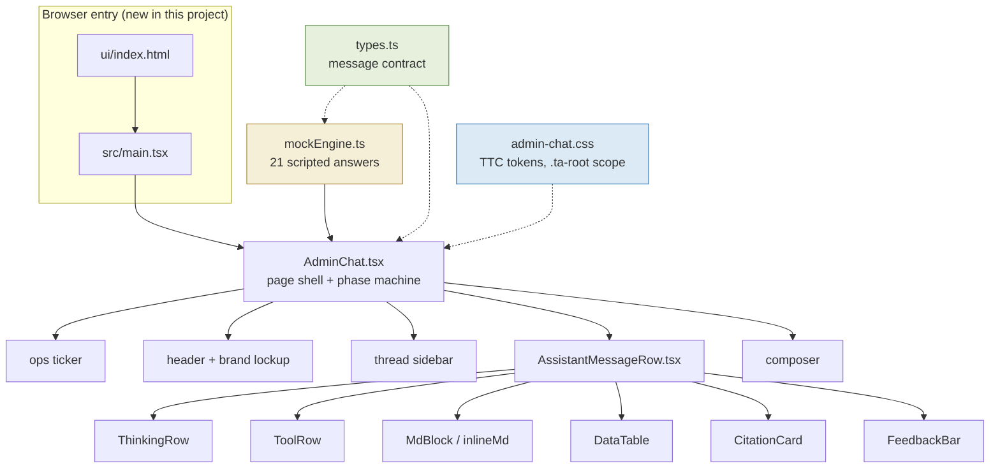
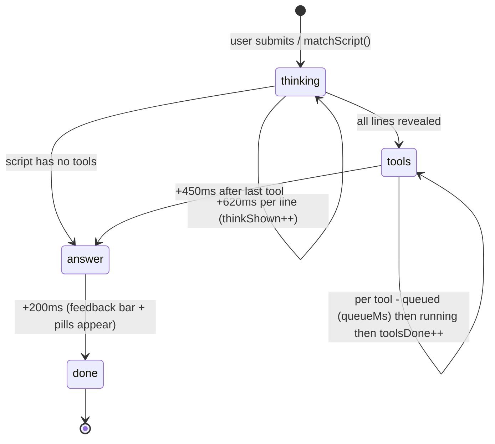
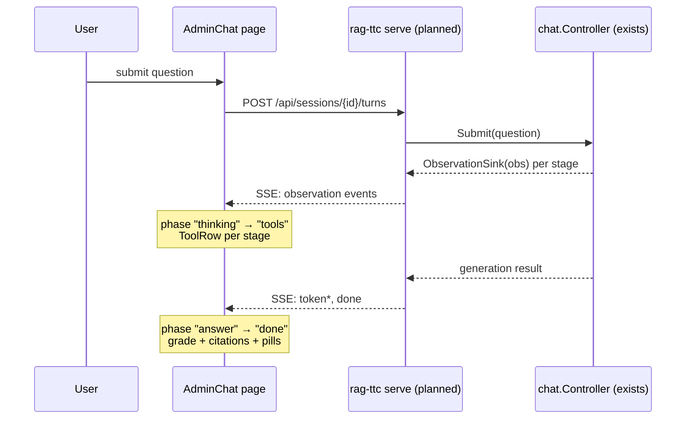

# RAG-TTC Admin Chatbot — Full-Page TTC-Styled Garden Ops Assistant

This project added a full-page, admin-side chatbot to the `rag-ttc` repository: an internal "Garden Ops & BI Assistant" for The Tree Center's operations team, structurally ported from the golden-eagle logistics-assistant prototype and restyled with The Tree Center's brand design system. The page runs on a scripted mock engine today, but every seam where a real streaming backend attaches is typed, marked, and documented. This report explains the system it landed in, the message contract that organizes the whole page, the phase machine that animates a turn, the styling architecture that lets two design systems coexist in one repository, and the integration path to a live RAG backend.

> [!summary]
> 1. A 1,416-line JSX prototype was ported to nine strict-TypeScript modules under `ui/src/components/pages/AdminChat/`, preserving every behavior: staged thinking, tool rows with queued/running/failed/retry states, four epistemic answer grades, citation cards carrying SQL, feedback at message and thread scope, and suggestion pills.
> 2. The port created the first browser entry point in the repository's history (`ui/index.html` + `src/main.tsx`) — before this, the entire UI existed only as Storybook stories.
> 3. Styling is a scoped copy of the TTC brand token sheet under `.ta-root`, so the TTC brand and the repository's existing pbui monospace system never interact.
> 4. Ticket `RAG-TTC-ADMIN-CHAT-001` holds a 12-section intern guide and a 5-step diary; the bundle is on the reMarkable at `/ai/2026/08/05/RAG-TTC-ADMIN-CHAT-001`.

## Why this project exists

The Tree Center operates an online plant nursery, and `rag-ttc` is the research lab for retrieval-augmented generation over its corpus. A customer-facing chat widget already exists in the sibling design-system repository (`2026-05-27--ttc-design-system`): it answers shopper questions inside a 440-pixel floating panel and talks to a live Go backend. What did not exist was an internal surface for the *business* side of the same data — sales trends, inventory cover, grower margins, fraud concentration — questions whose answers are only useful if the reader can tell how much to trust them.

The golden-eagle prototype (`~/Downloads/golden-eagle-logistics-assistant.jsx`) had already worked out the interaction design for exactly this problem, in a different domain (a coin dealer's logistics assistant). Its central idea is epistemic honesty as a first-class UI concern: every answer carries a grade from a closed set, every number carries a citation with the SQL that produced it, and failures — statement timeouts, permission errors — are rendered as content rather than suppressed. The same prototype had previously been taken to production for Golden Eagle Coin as the CoinVault system (`/home/manuel/code/gec/2026-03-16--gec-rag`), which proves the trajectory: build the full interaction surface against a mock engine, then replace the mock seams one at a time. This project repeats the first half of that trajectory for The Tree Center, and documents the second half so it can be executed later.

## The system context: three repositories

Understanding this project requires holding three repositories in view at once, because each one contributes a different kind of specification.

| Repository | Role in this project | What it contributes |
|---|---|---|
| `rag-ttc` (target) | Where the page lives | React 19 + Vite + Storybook workbench, `RagApi` streaming seam, Go answering pipeline |
| `2026-05-27--ttc-design-system` | Visual specification | The `--ttc-*` token sheet, typography, the "navy = authority, gold = expertise" color semantics |
| `gec-rag` (CoinVault) | Integration reference | The production realization of the same prototype: WebSocket streaming, flat timeline entities, server-resolved citations |

Three facts about the target repository shaped every design decision that follows.

First, `rag-ttc/ui` had no browser entry point. The package declared a `dev: vite` script, but there was no `index.html` and no `main.tsx`; the only way to render anything was Storybook on port 6007. "Add a full-page chatbot" therefore meant creating the first real page shell, not adding a route to an existing router — no router exists either.

Second, the repository already has a design language that is *not* the TTC brand. The raglab workbench uses `@hyperslop-systems/pbui`: IBM Plex Mono at 9.5–13px, zero border radius, `--pbui-*` custom properties. The TTC brand — DM Sans, Cormorant Garamond serif display, 12–14px radii, warm off-white canvas — lives in the sibling repository. The admin page was explicitly requested in TTC styling, which forced the scoping architecture described below.

Third, the Go side has a complete streaming vocabulary but no HTTP server. `pkg/rag/answering/types.go` defines ordered per-stage `Observation` events (`lexical`, `vector`, `fusion`, `reranking`, `context`, `generation`, ...), `pkg/app/chat/controller.go` exposes a headless controller with an `ObservationSink` function type, and the frontend defines `RagApi.ask(): AsyncIterable<TurnEvent>` — but the only implementation is a fixture API. The planned `rag-ttc serve` (specified in ticket `RAG-TTC-PBUI-UI-001`) is the missing link, and the admin page is built so that wiring it in is a one-file change.

## Architecture

### The message contract

The entire page renders from one shape. A `ScriptSpec` describes everything one assistant turn can contain, and an `AssistantMsg` is a `ScriptSpec` plus lifecycle state. The types live in `ui/src/components/pages/AdminChat/types.ts`:

```ts
interface ScriptSpec {
  thinking: string;          // newline-separated lines, revealed one at a time
  tools: ToolCallSpec[];     // sequential tool calls, rendered as ToolRows
  grade: Grade | null;       // "measured" | "estimate" | "association" | "hypothesis"
  blocks: Block[];           // interleaved markdown and table blocks
  citations: Citation[];     // sources behind the [^n] markers
  pills: string[];           // suggested follow-up questions
  failed?: boolean;          // hard failure: warn card, no grade
}

interface AssistantMsg extends ScriptSpec {
  id: number;
  role: "assistant";
  phase: "thinking" | "tools" | "answer" | "done";
  toolsDone: number;
  toolState?: "queued" | "running";
  thinkShown?: number;
  feedback?: Feedback;       // vote, tags, comments
}
```

Each field encodes a product principle rather than a rendering convenience. The `grade` field is a closed four-value set because the page's core claim is that an answer's evidentiary status is part of the answer: `measured` means computed from defined data with a stated definition, `estimate` means the number changes if the stated assumptions change, `association` means a correlation that does not establish causality, and `hypothesis` means further evidence is required. The mock scripts demonstrate grade *transitions*: the payment-method question returns an `estimate` because "primary payment method" admits three defensible definitions with materially different answers (8.1%, 13.8%, 15.6% of active customers), and becomes `measured` only after the user pins one definition via a suggestion pill.

The `Citation` shape enforces the second principle — no naked numbers:

```ts
interface Citation {
  id: number;          // matches [^id] markers in markdown text
  title: string;
  dataset: string;     // "orders ⋈ order_lines ⋈ products"
  definition: string;  // the metric definition, verbatim
  rows: string;        // what was included, with counts
  sql?: string;        // the reproducible query
  asOf: string;        // data freshness timestamp
}
```

And `ToolCallSpec` encodes the third — failure is content. A tool call can carry `status: "error"` with verbatim error text, `retryOf` naming the call it retries, and `queueMs` for time spent waiting in a batch queue. The mock includes a statement timeout (15 seconds against a 41M-row join) that recovers by retrying against a nightly rollup table, and a permission failure on `purchasing.grower_costs` that deliberately shows no partial numbers, because a wrong grower ranking is worse than none.

### Component structure



The dependency direction is strict: every component below `AdminChat` renders from `AssistantMsg` alone, and nothing below the page shell knows whether the data came from a mock or a stream. This boundary is the whole integration strategy — the transport can be swapped without touching a single widget.

## Implementation details

### The phase machine

One assistant turn moves through four phases. In the mock, a timer scheduler in `AdminChat.send()` drives the transitions; in production, streaming events will trigger the identical transitions.



The scheduler is worth reading closely because two of its details are load-bearing. First, every timer handle is pushed into a `useRef` array and cleared on unmount; any new stage must do the same or callbacks will fire into unmounted state. Second, the tool wait time is `max(350, (simMs ?? ms) + 250)`: `ms` is the latency *displayed* in the tool row, while `simMs`, when present, is the wait actually *simulated*. The timeout demo displays 15,000 ms but waits 2,600 ms. Collapsing the two fields makes the demo stall for real — the distinction exists so the UI can show honest latencies without imposing them on the viewer.

State updates flow through a message-scoped patcher. `setPhase(patch)` maps over the active thread's messages and merges the patch into the one assistant message by id, keeping all state immutable under plain `useState`:

```ts
const setPhase = (patch: Partial<AssistantMsg>) =>
  updateThread(tid, (t) => ({
    ...t,
    messages: t.messages.map((m) => (m.id === aid ? { ...m, ...patch } : m)),
  }));
```

There is no Redux, no context, no external store. That is a deliberate calibration to the current size: the state is one component's tree, one writer exists, and hydration from a server does not happen yet. The CoinVault reference implementation shows exactly when this stops being enough (see the integration section).

### The mock engine

`mockEngine.ts` is an ordered list of 21 entries of the form `{ test: (q) => boolean, script: ScriptSpec }`, with `matchScript(q)` returning the first script whose regex matches and a `test: () => true` fallback listing the scripted questions. The scripts were re-themed from the prototype's coin-dealer domain to The Tree Center's nursery domain — Privacy Trees as the category rollup, Thuja Green Giant and Leyland Cypress SKUs, growers instead of suppliers, ship-to-state margins where free shipping structurally compresses small-container sales — while preserving the prototype's behavioral coverage exactly: one script per interaction pattern (measured rollup with outlier caveat, sensitivity check, disambiguation, estimate-to-measured transition, association with detection-bias caveat, hypothesis, timeout-plus-retry, background-job filing, permission failure, degraded-mode estimate).

The mock numbers obey the domain's shape: monthly unit volumes ramp from ~1,400 in January to ~3,500 in April, because a nursery's demand curve peaks in spring planting season. These figures are plausible fiction and are flagged as such in the ticket diary; they should be sanity-checked by someone who knows the real business before the demo is shown to stakeholders.

A detail that pays off in testing: the suggestion pills form a directed graph over the script set. Every answer's `pills` array names follow-up questions, and each follow-up matches another script. `mockEngine.test.ts` walks this graph from the starter pills and asserts that every reachable pill resolves to a script with content and that more than ten scripts are reachable — a structural guarantee that no suggestion chip is a dead end.

### The styling architecture: two design systems, one repository

The repository now contains two complete visual languages, and the central styling decision is how they coexist. The answer is scoping: `admin-chat.css` opens with a `.ta-root` block that declares the entire TTC token sheet — brand colors, semantic accents, typography stacks, radii, the keyline shadow — as CSS custom properties on the page's root element. The workbench's `--pbui-*` variables live on `:root` via its own stylesheets. Because the two families share no names and the TTC values never leave `.ta-root`, neither system can leak into the other. The cost is duplication: the token values are copied from `2026-05-27--ttc-design-system/web/packages/ttc-garden-assistant/src/styles/tokens.css` rather than imported, because no published token package exists. That drift risk is recorded in the ticket; the durable fix is a shared `@the-tree-center/tokens` package.

The grade badges show how the port translated the prototype's Tailwind utility classes into TTC semantics. The prototype used emerald/amber/violet/rose; the TTC system already assigns meaning to a leaf green, a sun amber, a lavender, and a danger red, so the mapping preserves both the visual distinction and the brand's own color grammar:

| Grade | TTC accent | Token pair |
|---|---|---|
| Measured | leaf green | `--ttc-leaf` / `--ttc-leaf-soft` |
| Estimate | sun amber | `--ttc-sun` / `--ttc-sun-soft` |
| Association | lavender | `--ttc-lavender` / `--ttc-lavender-soft` |
| Hypothesis | danger red | `--ta-hypo` (from `--ttc-like-active`) |

One CSS mechanism in this file deserves permanent memory because its failure mode is invisible to every automated check. The page resets button styling with:

```css
.ta-root :where(button) { background: none; border: none; }
```

The `:where()` wrapper is not decoration. Written as `.ta-root button`, the selector carries class-plus-type specificity (0,1,1), which outranks every single-class component rule such as `.ta-pill { border: 1px solid ... }` (0,1,0). The symptom during this project was pills, chips, and the send button rendering as bare text — typecheck clean, all tests green, because nothing inspects computed styles. `:where()` contributes zero specificity, so any later class rule wins. pbui wraps its own defaults the same way, which is precisely what allows the workbench's `app.css` overrides to function; the pattern should be treated as mandatory for any scoped element reset.

Two smaller implementation choices round out the styling story. Icons are eighteen hand-written inline SVG components (lucide-style 24×24 stroke paths) rather than a `lucide-react` dependency, because the repository's `link:`-based pbui dependency makes `pnpm` lockfile changes riskier than eighty lines of path data. And fonts load from Google Fonts via a CSS `@import` (DM Sans, Cormorant Garamond, Cinzel, Allura); if the network is absent, the stacks degrade to system serif/sans without layout collapse.

### The entry point

`ui/index.html` and `ui/src/main.tsx` are eleven and twenty lines respectively, but they change the repository's category: `pnpm dev` and `pnpm build` now produce a working application rather than erroring on a missing entry. The build emitted 256 kB of JS and 20.6 kB of CSS on its first successful run — the first `vite build` in the repository's history. The page was deliberately *not* registered as a workbench tile: the appkit registry (`ui/src/appkit/registry.ts`) asserts its catalog against a JSON fixture, and a full-page layout inside a split-tile is the wrong container regardless. The Storybook story (`Raglab/Pages/AdminChat`, `pbui: false`, fullscreen layout) keeps the page visible in the repository's normal review workflow.

## The integration path

The page is a prototype by design, and the integration path is part of the deliverable. Three `@integration` comments in the source mark the seams: `matchScript()` (the brain), the timer block in `send()` (the transport), and the feedback patchers (the review store).

The target contract already exists on both sides. The Go pipeline emits ordered `Observation` events per stage; the frontend's `RagApi.ask()` returns `AsyncIterable<TurnEvent>` with a six-variant union (`accepted`, `observation`, `retrieval`, `token`, `done`, `failed`). The mapping from events to phase transitions is mechanical:

| Backend event | Phase machine effect |
|---|---|
| `accepted {turnId}` | append `AssistantMsg{phase:"thinking"}` |
| `observation {status:"started"}` | `phase:"tools"`; render ToolRow as running |
| `observation {status:"completed"}` | `toolsDone++`; latency from `duration` |
| `observation {status:"failed"}` | tool `status:"error"` with error text |
| `token {text}` | `phase:"answer"`; append to markdown block |
| `done {result}` | `phase:"done"`; grade, citations, pills |
| `failed {error}` | `failed:true` card |



The CoinVault production system contributes five lessons that the ticket guide records for whoever builds this. The wire should deliver flat, ordinal-sorted timeline entities that a pure function groups into turns at render time, so that live streaming and reload hydration share one code path. Stream patches (`APPEND | SNAPSHOT | REPLACE` with offsets) should be applied in the reducer, not in per-event mappers. The model must never author widget payloads: in CoinVault, the model emits hidden blocks containing only evidence IDs and the grade, and the server resolves those IDs against a run-scoped evidence ledger of what retrieval actually returned — unresolvable IDs surface as an explicit projection-error entity. The grade vocabulary is validated server-side against the same closed set of four. And a headless harness that runs the identical event pipeline without HTTP is the fastest way to inspect the exact stream the UI will receive.

Plain `useState` should be replaced by an entity store at a specific threshold, not on principle: when hydration from a server snapshot arrives, when more than one component consumes the stream, or when cancel/stop semantics exist. Redux Toolkit is already in `ui/package.json`, unused, for that day.

## Verification

Verification ran at three levels. Static: `pnpm typecheck` under strict TypeScript with `noUnusedLocals`/`noUnusedParameters`. Behavioral: `pnpm test` — 142 vitest tests across 18 files, of which nine are new; the component tests drive the full phase machine under `vi.useFakeTimers()` by advancing 30 seconds and asserting the grade badge, answer text, and follow-up pills all appear. Visual: the production build served via `pnpm vite preview` in a detached tmux session, driven by Playwright through the empty state, the timeout-then-queued-retry tool sequence, the measured answer table, and the citation card. Four screenshots live in the ticket at `sources/screenshots/ttc-admin-{empty,thinking,answer,citation}.png`.

Two test-design details are worth keeping. The sidebar legend contains the literal words "Measured" and "Estimate", so grade-badge assertions must use `getAllByText` and expect more than one match — `getByText` throws on multiple matches, which is exactly what happened on the first run. And fake-timer tests interact safely with the timer-ref cleanup because `advanceTimersByTime` fires the scheduled callbacks synchronously before unmount.

## Failure modes encountered

The project's diary records each failure verbatim; the four with reuse value are summarized here.

- **Overbroad staging in a ttmp-heavy repository.** `git add ttmp` staged 671 previously-untracked files from other tickets, including SQLite WAL artifacts, producing a 1.6M-insertion commit. Recovery was `git reset --soft HEAD~1 && git reset`, then re-staging only the ticket directory. In repositories that accumulate untracked ticket artifacts, staging must name the specific ticket path.
- **Scoped-reset specificity.** Described fully in the styling section: `.ta-root button` silently defeats `.ta-pill`; `:where()` is the fix. No automated check catches this class of bug; only rendering does.
- **Conflated flag semantics.** The prototype's ticker used one `up` boolean for both arrow direction and color sentiment, which produced "▲ −3" (a green up-arrow on a falling count) the moment a metric's good direction was down. The fix splits `dir: "up" | "down"` from `good: boolean`. Any status strip whose metrics improve in different directions needs both axes.
- **Filesystem-wide search as a fallback.** Locating a screenshot with `find / -name ...` (aliased to `bfs` on this machine) crawled the entire filesystem and had to be killed; the tool's own error message had already named the allowed output roots. Error messages that enumerate valid locations obviate the search.

## Important project docs

- Ticket workspace: `rag-ttc/ttmp/2026/08/05/RAG-TTC-ADMIN-CHAT-001--full-page-admin-chatbot-for-rag-ttc-styled-on-the-ttc-design-system/`
- The intern guide (12 sections, the canonical technical reference): `design-doc/01-admin-chatbot-analysis-design-and-implementation-guide.md`
- The implementation diary (5 steps, includes all failures verbatim): `reference/01-diary.md`
- reMarkable bundle: `/ai/2026/08/05/RAG-TTC-ADMIN-CHAT-001/RAG-TTC-ADMIN-CHAT-001 Admin Chatbot Guide.pdf`
- Prior specifications this work builds on: `rag-ttc/ttmp/2026/08/01/RAG-TTC-PBUI-UI-001--*` (the planned `serve` endpoints) and `gec-rag/ttmp/2026/08/04/GEC-UI-OVERHAUL-001--*` (the CoinVault overhaul guide)
- Source prototype: `/home/manuel/Downloads/golden-eagle-logistics-assistant.jsx`

Commits, all on branch `task/rag-ttc-tui-polish`: `ce0b6ab` (ticket skeleton), `d399633` (exploration synthesis), `c615647` (the implementation, 18 files, 3,730 insertions), `4fe12d2` (diary step 3), `3f9d1c9` (intern guide), `6a98a80` (upload and close-out).

## Open questions

- ~~Should the future `rag-ttc serve` speak SSE with the existing `TurnEvent` vocabulary (simpler, specified in RAG-TTC-PBUI-UI-001) or adopt CoinVault's sessionstream WebSocket protocol (hydration and multi-tab for free, heavier)?~~ **Decided and shipped 2026-08-05: sessionstream.** Follow-up ticket `RAG-TTC-ADMIN-CHAT-002` moved the page onto flat timeline entities, the `hello → subscribe → snapshot → uiEvent` handshake, and render-time turn grouping, with an in-page mock hub playing the scripts as protocol frames and a hydration-parity test (snapshot replay equals live stream) as the port's central invariant. Thread switching now rehydrates from a snapshot on every switch. The remaining backend work is `rag-ttc serve` itself (sessionstream Hub + chatapp wrapping `pkg/app/chat.Controller`), specified in that ticket's design guide.
- `agenttrace.ToolCall` has no TypeScript mirror; the admin page's ToolRow is the first consumer that will need one. Where should that type live — `ui/src/model/` beside the other wire types, or generated from the Go source?
- Does the TTC design-system repository want to publish a token package, or should the admin page's scoped copy remain the accepted duplication?

## Near-term next steps

- Wire `send()` to a streaming source per the event-mapping table; the swap is confined to `AdminChat.tsx`.
- Port CoinVault's sticky-bottom scroll (100px threshold) and stop/cancel affordances before conversations get long.
- Persist feedback to a review service; ticket `RAG-TTC-FEEDBACK-001` covers the raglab side of the same problem.
- Have someone who knows the real business review the mock numbers before any stakeholder demo.

## Project working rule

Every component below the page shell renders from `AssistantMsg` alone; nothing below `AdminChat.tsx` may know where the data came from. Preserving this boundary is what keeps the mock-to-live swap a one-file change, and any PR that leaks transport knowledge into a widget breaks the project's central bet.
