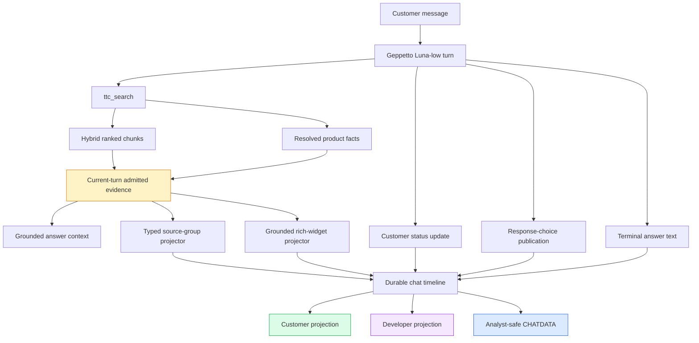
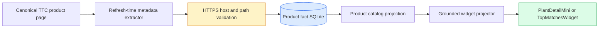
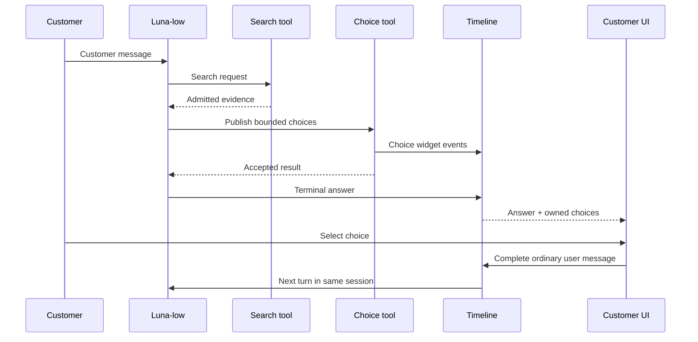

# TTC Garden Assistant Progressive UX — Strict Contracts, Grounded Widgets, and Reliable Choice Invocation

The second half of the TTC Garden Assistant progressive-UX project establishes the production boundary between retrieval evidence, model behavior, authoritative product data, customer widgets, and analyst records. The earlier U0–U5 work produced compact cumulative answers, typed source cards, ordinary-message response choices, durable sessions, and controlled evaluation. U6–U11 hardened that system under real customer conversations and tested whether richer product and care widgets should enter the default customer path.

The result is deliberately selective. The backend can now project `PlantDetailMini`, `TopMatchesWidget`, and `WateringGuideWidget` from admitted evidence and catalog facts without allowing the model to author authoritative product fields. Real product images can be retained at refresh time and rendered with field-level provenance. Strict source-card serialization has been verified across Go and Zod. The grounded projectors are implemented, tested, and observable, but the normal customer profile still exposes typed source cards rather than grounded rich widgets because the matched U10 evaluation found visible benefit in only one of three cases. A later real-chat defect also led to a stronger rule: when Luna-low can provide two to four concrete clarification answers, it must publish response chips rather than print selectable options as Markdown.

This report continues [[PROJECT REPORT - TTC Garden Assistant Progressive UX - Complete U0-U5 Engineering Record]], [[PROJECT REPORT - TTC Garden Assistant Progressive UX - From Controlled Evaluation to Real-Model Release Calibration]], [[PROJECT REPORT - TTC Garden Assistant Progressive UX - From Raw Chunks to Auditable Source Groups]], and [[PROJECT REPORT - TTC Garden Assistant Progressive UX - Typed Evidence Cards and Compact Answer Controls]].

> [!summary]
> - Public collection fields are normalized by the Go producer to JSON arrays. The strict TypeScript boundary continues to reject `null`, malformed payloads, and unsupported fields.
> - Rich widgets are deterministic projections over current-turn admitted evidence and authoritative product records. The model requests an intent and evidence identities; it does not supply prices, zones, URLs, images, inventory, or catalog facts.
> - `PlantDetailMini` passed real-model customer and developer inspection with a verified TTC image. `TopMatchesWidget` passed a real two-product comparison after a responsive-layout repair. `WateringGuideWidget` proved exact per-step lineage and safe abstention, but required fragile model retries.
> - In the matched U10 experiment, source-card control and grounded candidate both scored `0.8333` mean relevance. Faithfulness was `0.9677` versus `0.9722`. Only the single-product case gained visible widget benefit, so the two-of-three promotion gate rejected the grounded invocation policy.
> - U11 reconstructed an actual tool-selection failure from CHATDATA, strengthened the prompt and tool description, and verified with real Luna-low and Playwright that four clarification choices rendered as buttons and submitted a complete same-session message.
> - The accepted production tool set is `full-source-cards`. Grounded projectors remain available through the explicit `full` experiment profile; unrestricted model-authored widgets remain developer-only through `full-developer`.

## 1. The engineering question after U5

U5 demonstrated that a real Luna-low conversation could remain compact, retain earlier customer constraints, render typed evidence, present follow-up choices, survive hydration, and export an analyst-safe execution record. That success exposed the next question: should the application reuse the stronger product and care components already present in the design system?

The frontend already contained promoted implementations of:

- `PlantDetailMini` for one product;
- `TopMatchesWidget` for two to four products;
- `WateringGuideWidget` for a short ordered care procedure.

Those components were registered in the live widget outlet and had Storybook coverage. Their absence from production answers was not caused by missing React code. The missing capability was a trustworthy data path. The generic `ttc_widget_show` tool accepted a complete model-authored payload. Structural validation could confirm that a field was a string or that a URL used HTTPS, but it could not confirm that a displayed zone, image, price, availability label, product identity, or watering instruction came from evidence admitted for the current answer.

The project therefore separated two decisions:

1. Can the backend construct rich widgets whose fields are grounded and auditable?
2. Does exposing those widgets to Luna-low improve the customer experience reliably enough for production?

U6–U9 answer the first question. U10 answers the second. U11 addresses a distinct production behavior discovered after the main evaluation: the model sometimes prints answer choices instead of invoking the choice tool.

## 2. The complete runtime boundary

The assistant is a multi-inference Geppetto tool loop. Each customer message enters a durable session. The model sees the conversation, the customer system prompt, and a profile-specific tool registry. It may publish a status, search the TTC corpus, publish typed sources, request a grounded rich widget, publish response choices, and finally emit the terminal customer answer.

The important distinction is that retrieval, authoritative data, presentation, and analysis are separate projections.



The customer projection contains the terminal answer, bounded status text, typed evidence cards, selected rich widgets, and active choice groups. The developer projection retains tool calls, results, reasoning summaries, intermediate provider attempts, errors, and correlation data. CHATDATA is the durable analyst representation. It contains the system prompt, tool definitions and examples, model identity and settings, admitted evidence, tool results, reasoning summaries, usage, widget payloads, answer text, and session/turn identities.

This separation permits strict customer filtering without sacrificing future prompt, tool, retrieval, or presentation optimization.

## 3. U6: strict producer and browser contracts

### 3.1 The observed null-array defect

A real Pink Pearl crape myrtle conversation produced a source-result payload that the frontend rejected:

```text
Unable to render ttc.source_results.v1
Invalid input: expected array, received null
path: items[0].developerEvidence
```

The failing result was a structured-first product resolution. It contained authoritative database facts but no retrieved chunks. In Go, an uninitialized slice serializes as JSON `null`. The TypeScript contract declared `developerEvidence` as an array. Because the field was present but held `null`, Zod correctly rejected it.

The repair assigns contract ownership to the producer. Every public collection emitted by Go is normalized before serialization:

```go
func normalizeGroupPresentation(group *Group) {
    if group.Citations == nil {
        group.Citations = []string{}
    }
    if group.ChunkIDs == nil {
        group.ChunkIDs = []string{}
    }
    if group.Lineage == nil {
        group.Lineage = []Lineage{}
    }
    if group.DeveloperEvidence == nil {
        group.DeveloperEvidence = []DeveloperEvidence{}
    }
    if group.Facts == nil {
        group.Facts = []Fact{}
    }
}
```

The browser did not receive a compatibility coercion from `null` to `[]`. Keeping Zod strict preserves the ability to detect producer regressions. The project added one producer-shaped JSON fixture consumed by both Go and TypeScript tests. This is stronger than maintaining independent fixtures because it fixes the exact wire representation at the language boundary.

### 3.2 Customer visibility is narrower than analyst custody

A structured product can resolve correctly while lacking the specific fact requested by the customer. After field selection, such a result can contain neither admitted chunk lineage nor a displayed fact. Publishing its title as a source card would imply support that the card does not contain.

The customer publication rule is therefore:

```text
publish group if:
    group.lineage is non-empty
    OR group.displayed_facts is non-empty

retain for developer and analyst data even when publication is skipped
```

This rule distinguishes a useful diagnostic result from a useful customer source. Missing fields, failed product resolution, database query identity, and omitted display fields remain available to analysts. They do not create empty customer cards.

### 3.3 Production replay

The Pink Pearl regression was replayed against the accepted production profile. Session `c0531226-232c-47f4-bd00-e05435c7973d` rendered two verified product source cards and a 72-word terminal answer. The DOM contained no invalid-payload fallback, raw JSON, provider citation syntax, developer evidence, or customer-visible diagnostics. The successful tool result emitted `displayedFacts: []` and normalized collection fields that the strict frontend accepted.

This replay established the stable source-card boundary used by all later retrieval and presentation work.

## 4. Deterministic rich-widget projection

### 4.1 Model-selected intent, backend-owned facts

The grounded path accepts a small model request instead of a complete visual payload. The request identifies a known widget kind and stable evidence identities admitted by the immediately preceding search.

```json
{
  "kind": "top_matches",
  "documentIds": [
    "sha256:product-a",
    "sha256:product-b"
  ],
  "title": "Best matches for your site"
}
```

The model does not submit product names, zones, images, prices, inventory, links, botanical names, or catalog facts. The backend resolves those fields from the current-turn evidence view and authoritative product catalog.

The projector enforces four invariants:

1. Every requested document belongs to the current admission set.
2. Every authoritative value comes from retained corpus metadata or product facts.
3. Missing optional fields are omitted rather than synthesized.
4. The resulting payload must satisfy both Go and TypeScript widget contracts.

The core logic is intentionally bounded:

```text
project(request, latest_search):
    groups = resolve_requested_groups(
        request.document_ids,
        latest_search.admitted_evidence
    )

    reject unadmitted or duplicate identities
    reject unresolved or conflicting product identities

    if request.kind == plant_detail:
        require exactly one product
        return project_authoritative_product(groups[0])

    if request.kind == top_matches:
        require two to four distinct products
        preserve admission rank, then product ID
        return project_authoritative_products(groups)

    if request.kind == watering_guide:
        require exact support for every step
        return project_supported_steps(groups)

    reject unknown kind
```

The projector returns a payload or declines publication. A declined rich widget is not shown to the customer. Its request, rejection reason, omitted fields, and supporting identities remain in CHATDATA.

### 4.2 Current-turn admission

`searchObservation` records the immediately preceding search result and its admitted citations. `ttc_grounded_widget_show` resolves only through that observation. A second search replaces the active admission set for the projector. This prevents a retry from using stale chunk IDs or mixing products from unrelated searches.

The rule is conservative. It simplifies field provenance and makes every projector request explainable. It also creates tool friction when the model performs another search while repairing a request. U9 demonstrated that a once-valid watering chunk becomes invalid after a subsequent search changes the current observation. The rejection is correct under the present contract and is retained for later optimization.

### 4.3 Tool-set isolation

The runtime exposes three meaningful customer/developer configurations:

| Tool set | Typed source cards | Grounded projector | Generic model-authored widgets | Intended use |
|---|---:|---:|---:|---|
| `full-source-cards` | Yes | No | No | Accepted customer production default |
| `full` | Yes | Yes | No | Controlled grounded-widget experiments |
| `full-developer` | Yes | Yes | Yes | Developer inspection and unrestricted widget experiments |

This structure prevents a prompt instruction from being the only isolation mechanism. U4 had already shown that leaving a tool registered while asking the model not to use it does not create a valid control. Tool availability is part of the executable configuration.

## 5. U7: grounded single-product detail

### 5.1 Product projection

`PlantDetailMini` requires one exactly resolved product. The projector derives its name, botanical name, mature size, hardiness zones, sunlight, soil, drought tolerance, verified TTC link, and optional media from authoritative catalog facts. Price and availability are omitted unless the database contains supported values.

The tool result retains more than the public widget:

- selected document and product identities;
- product-catalog database digest;
- fixed query identifier;
- source item identifier;
- projected fields and their lineage;
- omitted fields;
- final widget payload;
- turn and provider correlation identifiers.

This makes a visually compact card fully inspectable without exposing its internal provenance to the customer.

### 5.2 Refresh-time product images

The original WooCommerce/WordPress export retained media identifiers but not a browser-ready attachment URL. The product pages expose canonical image metadata. The project added `refresh-product-images.py`, which reads canonical product paths from SQLite, fetches each storefront page, selects the canonical social image, validates it, and writes `product_meta.image_url`.

Accepted media must satisfy all of the following:

- HTTPS scheme;
- exact host `www.thetreecenter.com`;
- path prefix `/c/uploads/`.

The chat runtime reads the fact database without modifying it. Storefront access occurs during an explicit refresh, not during customer inference. This preserves predictable latency and makes the image URL part of the database snapshot used by the projector.



### 5.3 The field-selection defect found by Playwright

Initial unit tests showed that an image-bearing payload could render. The real Pink Velour replay still displayed the component's gradient fallback. The catalog contained the image, but `evidenceview.Build` had intentionally selected only customer source-card facts and removed `image_url` before the grounded projector received the group.

The repair added an explicit `evidenceview.BuildGrounded` path. `Build` remains bounded for source-card display. `BuildGrounded` retains every authoritative fact for backend projection. The distinction is named in the API rather than implemented through a hidden flag.

The final Pink Velour session `5a40dabb-c37b-435d-af01-bd41f982f6d5` produced a 47-word answer and rendered the verified product photograph, botanical name, zones, mature size, sunlight, and canonical link. The projector reported only `price` and `availability` as omitted. A prompt rule also prevented the model from repeating the widget image as Markdown in the answer.

### 5.4 Developer-mode inspection

The same product turn was replayed under `full-developer`. The in-chat inspector exposed the grounded request and result, image URL, database digest, fixed query, source item, selected facts, omitted fields, payload, and correlation data. No additional diagnostics application was required.

The developer profile initially failed because `.devctl.yaml` accepted `full-developer` while the Glazed CLI field rejected it. Adding the value to the executable choice list aligned configuration validation with runtime validation.

## 6. U8: grounded product shortlists

`TopMatchesWidget` accepts two to four distinct admitted products. It inherits current admission order and uses product ID as the final deterministic tie-breaker. Duplicate products, unresolved identities, unadmitted documents, and conflicting fact identities fail closed.

The real qualification case compared Blue Ice and Carolina Sapphire Arizona cypress for a sunny privacy screen. The projector emitted the products in admitted order with verified TTC images, links, botanical names, and zones. Each product retained its actual fixed catalog resolution query and the shared database digest. Price and availability were omitted.

The 118-word answer and two-card payload were factually successful, but browser measurement detected a 31-pixel horizontal overflow. The product cards were not the cause. A non-wrapping header label had shrunk below its content width inside a flex row. The CSS repair made the metadata label non-shrinking and the title explicitly shrinkable.

Before and after measurement was exact:

| Element | Before scroll width | Before client width | After scroll width | After client width |
|---|---:|---:|---:|---:|
| Chat panel | 440 | 425 | 425 | 425 |
| Timeline | 424 | 393 | 393 | 393 |
| Widget | 424 | 393 | 393 | 393 |

The corrected layout required no second paid inference. Vite hot reload applied the CSS change to the retained browser state, allowing a deterministic visual comparison over the same widget payload.

## 7. U9: watering guidance with exact evidence custody

Watering guidance has a different risk profile from product display. A useful schedule depends on establishment stage, container status, soil, climate, and current weather. The product catalog alone does not ground those instructions.

The first watering projector requires every public step to be an exact normalized substring of an admitted chunk. Each step retains document and chunk lineage in the tool result. Whitespace and case normalization are permitted. Paraphrases, changed pronouns, shortened sentences, stale chunks, unsupported step kinds, and over-specific schedules are rejected.

```text
for requested_step in request.steps:
    source = current_admission.lookup(requested_step.chunk_id)
    reject if source is missing

    normalized_step = normalize_whitespace(requested_step.text)
    normalized_source = normalize_whitespace(source.text)

    reject unless normalized_step is a substring of normalized_source
    reject unsafe or weather-dependent schedules
    reject unsupported step kind

    retain step text + document ID + chunk ID

publish at most four accepted steps
```

The real qualification covered four situations.

| Situation | Customer behavior | Widget result |
|---|---|---|
| Newly planted | Compact answer grounded in a planting guide | Two exact steps published |
| Established | Same-session follow-up with prior context | One exact drought/heat step published |
| Container | Direct container-care question | Three exact steps after several rejected attempts |
| Under-specified | “How often should I water?” | No search or schedule; four clarification chips |

The container replay exposed the practical limitation of a strict model-authored request. Luna-low required five attempts. Requests failed because one sentence exceeded the 180-character display limit, `water_soil` was not an accepted kind, a cited chunk became stale after another search, and one sentence was shortened. The fifth request used admitted chunks, accepted kinds, and exact text.

The customer saw only the final valid guide. CHATDATA retained every failed call and exact rejection. This behavior is safe and auditable, but the hidden retries increase latency without guaranteeing visible benefit. That finding became central to U10.

The under-specified case demonstrates the preferred boundary. The assistant did not search and did not invent a schedule. It gave a 27-word clarification and four ordinary-message choices for newly planted, established, shrub, and container contexts.

## 8. U10: controlled customer evaluation

### 8.1 Experimental design

The production decision compared a source-card-only control with a grounded-widget candidate. Both arms used the same:

- `ttc-live-luna-low` answer profile;
- customer prompt;
- immutable 3,149-document index bundle;
- authoritative product database digest;
- `production-product-fact-v1.yaml` retrieval configuration;
- disabled fact augmentation setting;
- browser build and presentation mode;
- three frozen questions.

Only the tool registry changed. The control had typed source cards and choices but no grounded tool. The candidate added `ttc_grounded_widget_show`. Neither arm exposed the unrestricted generic widget tool.

The three questions targeted the three projector classes:

1. Pink Velour product detail;
2. Blue Ice versus Carolina Sapphire comparison;
3. newly planted watering guidance.

The frozen human gate required visible benefit in at least two of three cases. Safe omission counted as no benefit, because an invisible widget cannot improve the customer experience even when its rejection protects correctness.

### 8.2 Deterministic and judged results

| Case | Control words | Candidate words | Candidate rich widget | Grounded errors | Visible benefit |
|---|---:|---:|---|---:|---:|
| Pink Velour product detail | 38 | 33 | `PlantDetailMini` | 0 | Yes |
| Blue Ice versus Carolina Sapphire | 139 | 130 | None | 0 | No |
| Newly planted watering | 51 | 66 | None | 3 | No |

All six answers stayed below the 180-word hard limit. Four stayed within the normal 120-word target. Citation admission, commerce restrictions, invalid-payload checks, and projected-field provenance passed.

Full `gpt-5.6-luna` judged statement faithfulness and answer relevance using all evidence visible to the answer model. The judge context included raw admitted chunks, structured facts from every search call, and bounded source-card presentations.

| Arm | Mean relevance | Mean faithfulness |
|---|---:|---:|
| Source-card control | 0.8333 | 0.9677 |
| Grounded candidate v2 | 0.8333 | 0.9722 |
| Candidate minus control | 0.0000 | +0.0045 |

The grounded candidate passed the frozen answer-quality thresholds. The failure was product usefulness. `PlantDetailMini` added a verified image and compact product facts. The comparison did not invoke `TopMatchesWidget`. The watering projector rejected three requests and published no guide. The candidate therefore delivered one visible benefit instead of the required two.

### 8.3 The production decision

The project rejected the current model-authored grounded-widget invocation policy. It did not reject the projectors or React components.

Commit `54794fa` made `full-source-cards` the default in the Go command, Python devctl plugin, and normal Luna-low profile. `full` remains an explicit experiment. `full-developer` retains both grounded and generic widget tools.

This decision separates correctness from usefulness:

- Fail-closed validation protects customers from unsupported data.
- A safely omitted widget can still consume tool-loop time and add no visible value.
- Production promotion requires both trustworthy fields and consistent customer benefit.

The strongest next grounded-widget experiment is a deterministic eligibility composer. Instead of requiring Luna-low to construct and retry exact projector requests, backend code can inspect accepted search results and publish a widget only when a narrow known condition is satisfied. That experiment should remain separate from the accepted source-card path.

## 9. U11: reliable response-choice invocation

### 9.1 Reconstructing the failure

A later customer conversation asked for a deer-resistant privacy screen in Michigan. Luna-low returned a useful answer and then printed four selectable-looking alternatives:

```text
- Full sun — I want the fastest tall screen
- Part shade
- Mostly shade
- I’m not sure
```

No buttons appeared. The customer's next message, `make it chips`, was interpreted as a request for inexpensive products. This made the failure materially worse than a formatting problem.

The production turns database identified session `f71d1817-ad50-4330-b41b-fb4360920316`. Its CHATDATA proved that:

- the runtime used the current customer prompt;
- `ttc_chat_choices_show` was registered;
- the frontend renderer was available;
- the model never called the choice tool.

The defect was therefore tool selection, not stale React code or an invalid widget payload.

### 9.2 The strengthened choice contract

The customer prompt now states:

- Never write selectable answer options as bullets, numbered lists, slash-separated alternatives, or inline choices in the final response.
- If a clarification has two to four concrete answers, call `ttc_chat_choices_show` before the final response.
- Put the question and answers only in the tool payload.
- Do not duplicate the clarification question or choices after publication.

The tool description repeats the same must/never boundary close to the generated schema. It also includes a four-choice sun-exposure example. Short labels remain separate from complete submitted messages:

```json
{
  "mode": "clarification",
  "prompt": "What does the planting area get?",
  "choices": [
    {
      "id": "mostly-shade",
      "label": "Mostly shade",
      "message": "The planting area is mostly shaded."
    }
  ]
}
```

The distinction is essential. The label optimizes the small interface. The message becomes ordinary transcript input and must remain understandable when replayed, exported, judged, or read without the original widget.

### 9.3 Real-model Playwright regression

Commit `bb7e64e` implemented the contract and focused tests. A fresh Luna-low replay used the exact formerly failing prompt:

```text
fucking deers easting my plant in michigan, but i want to hide from the neighbors
```

Session `84227d29-2d66-49a2-9608-19ad60339a69` searched, published typed sources, invoked `ttc_chat_choices_show`, and rendered four buttons:

- Evergreen wall
- Seasonal screen
- Mostly shade
- Mostly sun

The final answer contained no selectable option list. Playwright selected `Mostly shade`. The interface marked the button pressed, disabled the group, displayed `Selected: Mostly shade`, and submitted:

```text
The planting area is mostly shaded.
```

The follow-up turn retained Michigan, deer pressure, privacy-screen intent, and the new shade constraint. It recommended Canadian hemlock, published typed source cards grounded in admitted evidence, and offered a new set of follow-up chips. The two-turn CHATDATA retains the strengthened system prompt, both choice-tool examples, model metadata, reasoning summaries, searches, source-card publications, choice calls and results, terminal answers, and the selected ordinary message.

## 10. Why the choice tool runs before final text

A Geppetto tool loop can perform several inference segments in one customer turn. A terminal assistant answer ends that loop. A prompt that says “answer, then publish choices” is not merely imprecise; it specifies an impossible order for a terminal response.

The valid sequence is:



The timeline owns both the answer and its choice group. The choice widget's `parentMessageId` associates it with the completed assistant turn. Selection uses a stable idempotency key so repeated delivery cannot create duplicate inference turns.

## 11. Analyst-safe records as an optimization substrate

The implementation stores more than customer-visible messages because later system optimization requires causal evidence. An analyst must be able to distinguish retrieval failure, evidence admission failure, prompt failure, tool-selection failure, projector rejection, rendering failure, and conversation-state failure.

A useful CHATDATA record includes:

| Data class | Why it matters |
|---|---|
| System prompt | Identifies the exact behavioral policy used by the answer model |
| Tool definitions and examples | Explains which actions were available and how they were described |
| Model/provider/settings | Separates model behavior from application behavior |
| Reasoning summaries | Provides bounded insight into the model's stated plan without exposing hidden chain-of-thought |
| Tool calls and results | Shows searches, selected evidence, retries, projector errors, and publications |
| Raw admitted chunks | Supports statement-level faithfulness judging |
| Structured product facts | Supports catalog claims and projected product fields |
| Widget payloads and lineage | Connects visible cards to authoritative inputs |
| Provider-call correlation | Distinguishes intermediate attempts from the terminal customer answer |
| Session and turn IDs | Supports replay, multi-turn analysis, and exact browser reproduction |
| Usage and duration | Supports latency and cost analysis |

Customer mode intentionally omits most of this information. Developer mode exposes it within the chat. Analyst export preserves it as JSONL so Python, JavaScript, SQLite, or future GEPA-style optimization tools can inspect it without scraping the browser.

## 12. Testing strategy and retained evidence

The project uses several test layers because each catches a different failure class.

### 12.1 Unit and contract tests

Go tests cover source-group normalization, product identity agreement, admitted-document checks, stable ordering, duplicate rejection, omitted-field behavior, exact watering support, unsafe schedule rejection, tool-set features, and choice payload normalization.

TypeScript tests pass the actual Go-produced fixture through Zod, reject explicit `null`, render promoted widgets, verify customer/developer separation, exercise choice selection, and test hydration.

### 12.2 Real provider tests

Real Luna-low runs test whether the small production model can select and satisfy the tools. This layer discovered failures that deterministic unit tests could not predict:

- product image facts were filtered before projection;
- generic Markdown image output duplicated the widget;
- `full-developer` was missing from the CLI enum;
- exact watering requests caused multiple retries;
- a registered choice tool was sometimes not called.

### 12.3 Browser tests

Playwright verifies actual customer behavior rather than payload validity alone. Accessibility snapshots distinguish buttons from formatted answer text. DOM measurements detect horizontal overflow. Clicking a chip proves that the label maps to a complete message and that the original group becomes disabled.

### 12.4 Controlled judges and human calibration

Full Luna judges assess relevance and decomposed statement faithfulness against everything the answer model saw. Deterministic checks validate citations, word limits, provenance, payload validity, and commerce restrictions. Human calibration determines whether a widget makes the chat easier to use. Safe omission protects correctness but does not count as a presentation improvement.

## 13. Failure modes established by the project

### 13.1 Structural validity is not semantic grounding

A JSON schema can verify field types and enumerations. It cannot prove that a product's visible attributes belong to an admitted product or came from an authoritative catalog snapshot. Grounded projection must operate over admitted identities and provenance-bearing facts.

### 13.2 A strict frontend needs a canonical producer

Go `nil` slices and JavaScript arrays are not interchangeable over JSON. Public DTOs need explicit collection normalization. Weakening the browser schema hides defects and creates inconsistent semantics between live rendering and analyst records.

### 13.3 Presentation selection and grounding selection differ

Source cards intentionally select a small number of visible facts. Grounded widgets may need authoritative media and optional fields that source cards do not display. Reusing one filtered representation for both silently loses data. Separate APIs make the distinction reviewable.

### 13.4 Safe omission is not sufficient for promotion

A projector that declines unsupported requests is behaving correctly. If the model repeatedly triggers that rejection, the system spends latency and inference effort while the customer receives no additional value. Promotion needs an observed benefit gate, not only a correctness gate.

### 13.5 Tool availability must be structural

Prompts do not create controlled arms when the disallowed tool remains registered. Tool registries are executable configuration. Controls and candidates must differ in the registry itself.

### 13.6 Visual success does not prove conversational correctness

A screenshot can show a chip without proving what it submits. The selected state, durable user message, session identity, next turn, and exported transcript must agree.

### 13.7 Model tool selection needs both positive and negative guidance

The choice failure persisted despite a valid tool and broad instruction to use it. The successful repair combined a negative prohibition on inline selectable answers with a positive, domain-matched clarification example and explicit terminal ordering.

## 14. Commit and phase record

| Phase | Principal outcome | Representative commits |
|---|---|---|
| U6 | Cross-language source contract and production replay | `1c4484c`, later U6 evidence in `f035749`/`3ec99c0` |
| U7 | Grounded projectors, verified product media, developer inspection | `a586eeb`, `bd3af99`, `337bd15`, `c6b58e1` |
| U8 | Real two-product shortlist and responsive-layout repair | `19858f8` |
| U9 | Exact-lineage watering qualification and retry guidance | `ec547b4`, documentation `d5f1ed1` |
| U10 | Matched customer evaluation and source-card production decision | `dc9c84f`, `b451513`, `54794fa`, `9ce4d1b` |
| U11 | Mandatory bounded-choice invocation and real regression replay | `bb7e64e`, evidence `48d2ad5` |

The ticket now contains 83 checked tasks across U0–U11. The completion evidence includes source reports, screenshots, full CHATDATA, session selectors, deterministic evaluation reports, judge inputs and outputs, code/test references, and a strict-format implementation diary.

## 15. Current production status

The accepted product boundary is:

- Answer generation uses `ttc-live-luna-low`, represented in provider metadata as `gpt-5.6-luna` with low reasoning effort.
- Retrieval uses the qualified 3,149-document immutable bundle and `production-product-fact-v1.yaml`.
- Customer mode exposes status updates, `ttc_search`, typed source-result publication, and response choices.
- The normal customer tool set is `full-source-cards`.
- Grounded rich-widget projectors remain in the explicit `full` evaluation tool set.
- Generic model-authored widget publication remains in `full-developer`.
- Product images are refreshed into the authoritative fact database outside the inference loop.
- Routine analyst exports retain prompts, tools, results, reasoning summaries, metadata, evidence, and widget decisions.

There is one unresolved operational issue outside the customer contract. During the U11 replay, `devctl up --profile ttc-garden-chat-luna-low` returned `E_CONFIG_INVALID` even though `devctl plan` and `devctl doctor` validated the same profile. `devctl restart` launched fresh services long enough to complete two real provider turns and the Playwright regression, but later status reported `MISSING_EXIT_ARTIFACT`, and subsequent direct and tmux restarts reported readiness while port 8091 was unavailable. The feature behavior is verified and committed; persistent local service supervision requires separate devctl investigation.

## 16. Recommended next work

The next work should preserve the accepted source-card path and introduce changes as isolated experiments.

1. **Repair devctl lifecycle reporting and persistence.** Reproduce the false-ready and missing-exit-artifact behavior independently of the chat code. A reliable production-like local profile is required for continued calibration.
2. **Add choice invocation to the behavioral benchmark.** Measure choice-tool use, inline-option leakage, selected-message completeness, and same-session continuity across harder conversations and small-model runs.
3. **Shorten comparison answers.** Both U10 comparison answers exceeded the normal 120-word target. Tune the answer policy without changing retrieval or evidence presentation in the same experiment.
4. **Test a deterministic widget eligibility composer.** Begin with the strongest case: a structured-first exact product result with a verified image. Publish `PlantDetailMini` automatically only when all eligibility rules are satisfied.
5. **Reduce rich-card and source-card duplication.** If a deterministic product card is published, test suppressing redundant product fields or collapsing the corresponding source card while retaining citations and analyst lineage.
6. **Expand calibration conversations.** Include deer/privacy clarification, ambiguous watering, multi-product comparison, missing product facts, stale-search retries, and customer corrections.
7. **Use CHATDATA for targeted optimization.** Query failed tool calls, excessive retries, omitted widgets, answer lengths, repeated questions, and inline-choice violations before attempting broader GEPA-style prompt optimization.

The next experiment should remain small. The strongest candidate is deterministic single-product presentation after exact structured-first resolution. It has a narrow eligibility predicate, demonstrated customer value, and complete authoritative data custody.

## 17. Key implementation files

Backend behavior:

- `/home/manuel/workspaces/2026-06-30/benchmark-cpu-inference/2026-05-27--ttc-design-system/backend/internal/evidenceview/evidenceview.go`
- `/home/manuel/workspaces/2026-06-30/benchmark-cpu-inference/2026-05-27--ttc-design-system/backend/internal/ragsearch/grounded_widgets.go`
- `/home/manuel/workspaces/2026-06-30/benchmark-cpu-inference/2026-05-27--ttc-design-system/backend/internal/choiceintent/choiceintent.go`
- `/home/manuel/workspaces/2026-06-30/benchmark-cpu-inference/2026-05-27--ttc-design-system/backend/internal/chatdata/schema.go`
- `/home/manuel/workspaces/2026-06-30/benchmark-cpu-inference/2026-05-27--ttc-design-system/backend/internal/webchatcmd/run.go`
- `/home/manuel/workspaces/2026-06-30/benchmark-cpu-inference/2026-05-27--ttc-design-system/backend/configs/prompts/customer-v1.md`

Frontend contracts and components:

- `/home/manuel/workspaces/2026-06-30/benchmark-cpu-inference/2026-05-27--ttc-design-system/web/packages/ttc-garden-assistant/src/features/chat/widgetPayloads.ts`
- `/home/manuel/workspaces/2026-06-30/benchmark-cpu-inference/2026-05-27--ttc-design-system/web/packages/ttc-garden-assistant/src/features/chat/TtcChatWidgets.tsx`
- `/home/manuel/workspaces/2026-06-30/benchmark-cpu-inference/2026-05-27--ttc-design-system/web/packages/ttc-garden-assistant/src/features/chat/TtcChatMessages.tsx`
- `/home/manuel/workspaces/2026-06-30/benchmark-cpu-inference/2026-05-27--ttc-design-system/web/packages/ttc-garden-assistant/src/components/organisms/PlantDetailMini/`
- `/home/manuel/workspaces/2026-06-30/benchmark-cpu-inference/2026-05-27--ttc-design-system/web/packages/ttc-garden-assistant/src/components/organisms/TopMatchesWidget/`
- `/home/manuel/workspaces/2026-06-30/benchmark-cpu-inference/2026-05-27--ttc-design-system/web/packages/ttc-garden-assistant/src/components/organisms/WateringGuideWidget/`
- `/home/manuel/workspaces/2026-06-30/benchmark-cpu-inference/2026-05-27--ttc-design-system/web/packages/ttc-garden-assistant/src/components/organisms/SourceResultsWidget/`

Ticket evidence:

- `/home/manuel/workspaces/2026-06-30/benchmark-cpu-inference/2026-05-27--ttc-design-system/ttmp/2026/08/03/TTC-GARDEN-PROGRESSIVE-UX-001--compact-progressive-garden-answers-response-choices-and-typed-evidence-cards/design-doc/02-grounded-rich-widget-expansion-and-production-contract-hardening.md`
- `/home/manuel/workspaces/2026-06-30/benchmark-cpu-inference/2026-05-27--ttc-design-system/ttmp/2026/08/03/TTC-GARDEN-PROGRESSIVE-UX-001--compact-progressive-garden-answers-response-choices-and-typed-evidence-cards/reference/01-investigation-and-implementation-diary.md`
- `/home/manuel/workspaces/2026-06-30/benchmark-cpu-inference/2026-05-27--ttc-design-system/ttmp/2026/08/03/TTC-GARDEN-PROGRESSIVE-UX-001--compact-progressive-garden-answers-response-choices-and-typed-evidence-cards/sources/u10/03-customer-evaluation-and-production-decision.md`
- `/home/manuel/workspaces/2026-06-30/benchmark-cpu-inference/2026-05-27--ttc-design-system/ttmp/2026/08/03/TTC-GARDEN-PROGRESSIVE-UX-001--compact-progressive-garden-answers-response-choices-and-typed-evidence-cards/sources/u11/01-choice-invocation-regression.md`

## 18. Working rules established by this project

> [!important]
> Customer presentation may reorganize admitted evidence, but it may not introduce new evidence. Rich widgets may use authoritative fields for admitted identities, but the model must not author those fields.

The durable engineering rules are:

- Keep customer, developer, and analyst projections distinct.
- Normalize public JSON collections at the Go producer and keep browser validation strict.
- Let models select bounded intent; let deterministic code project authoritative values.
- Treat omitted optional fields as normal, not as a reason to invent content.
- Count safe omission as no customer benefit during promotion evaluation.
- Configure experimental tool availability in registries and profiles, not only prompts.
- Run widget tools before terminal response text.
- Store short chip labels and complete submitted messages separately.
- Validate real interactions through the browser, durable turn data, and analyst export together.
- Preserve negative release decisions and rejected tool calls as optimization evidence.

## Related notes

- [[ARTICLE - TTC Garden Assistant - From RAG Prototype to Auditable Customer Chat]]
- [[PROJECT REPORT - TTC Garden Assistant Progressive UX - Complete U0-U5 Engineering Record]]
- [[PROJECT REPORT - TTC Garden Assistant Progressive UX - From Controlled Evaluation to Real-Model Release Calibration]]
- [[PROJECT REPORT - TTC Garden Assistant Progressive UX - From Raw Chunks to Auditable Source Groups]]
- [[PROJECT REPORT - TTC Garden Assistant Progressive UX - Typed Evidence Cards and Compact Answer Controls]]
- [[PROJ - TTC Garden Intent-Aware RAG Optimization]]
- [[PROJECT REPORT - RAG-TTC Tool Loop - Observable Multi-Inference QA and the F0 T1 T2 Evaluation]]
