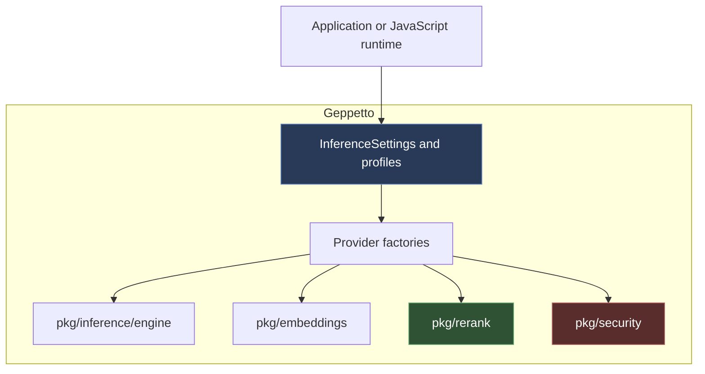
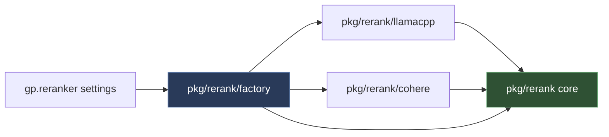
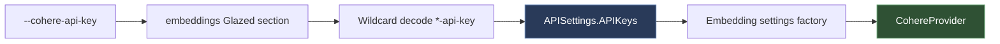

# Cohere Providers in Geppetto: Architecture, Security, and Migration Tooling

This report explains how Cohere reranking and embeddings support entered Geppetto, why an apparently clean rebase was rejected as the integration strategy, how the provider boundaries were hardened, and why the same work produced a new `glazed-migrate` command-line application. The implementation landed through [geppetto PR #408](https://github.com/go-go-golems/geppetto/pull/408) and [glazed PR #620](https://github.com/go-go-golems/glazed/pull/620), both merged on 2026-08-07.

The central engineering result is not merely that two Cohere endpoints can now be called. Geppetto gained a hosted reranker that obeys the modern `pkg/rerank` contract, a Cohere embedding provider that converged on the same network-security conventions during review, and end-to-end profile and JavaScript integration without introducing provider-specific logic into the JavaScript surface. Glazed gained a parse-only migration application that can analyze and rewrite source code even when removed APIs have already made that code fail type checking.

> [!summary]
> - PR #169 was mechanically mergeable but architecturally obsolete. Its protocol knowledge was preserved while its legacy `embeddings.Reranker` abstraction was discarded.
> - The modern rerank provider contract centralizes identity mapping, cardinality, ordering, bounded I/O, safe errors, cost semantics, and outbound URL policy.
> - Review of the embeddings port exposed six boundary inconsistencies. Fixing them aligned base URLs, HTTP clients, URL policy, credential precedence, CLI configuration, and batch cardinality.
> - The glazed v1.4.2 dependency transition produced a first-class `glazed-migrate check|fix` application with structured output, embedded help, cancellation, deduplication, and explicit partial-write reporting.

## 1. The starting question: rebase or port?

The work began with PR #169, opened in May 2025. That pull request added Cohere embeddings and reranking under `pkg/embeddings`. The first task was to determine whether it could be rebased onto current Geppetto.

The rebase probe produced a useful distinction:

| Question | Result |
|---|---|
| Did the old commit cherry-pick with limited conflict? | Yes. Only two straightforward conflicts appeared. |
| Did the resulting embeddings tests pass? | Yes. |
| Did the old reranker target the current architecture? | No. |
| Should PR #169 be merged after resolving conflicts? | No. Its reranker API had been superseded. |

Between PR #169 and this work, Geppetto had introduced `pkg/rerank` through GEPPETTO-RERANKER-001. That package established a transport-neutral provider contract, caller-controlled document identity, deterministic ordering, rich response metadata, bounded network I/O, profile construction, and a provider-neutral Goja API. The old PR defined a smaller `embeddings.Reranker` interface and returned document text directly in results. Merging it would have created two incompatible reranking systems.

The correct strategy was therefore **protocol salvage**:

1. Preserve facts about Cohere's endpoint, headers, request fields, response fields, and billing metadata.
2. Reimplement the reranker against `pkg/rerank.Provider`.
3. Reject the old interface, options, and result types rather than adding compatibility shims.
4. Port embeddings separately into the existing embeddings subsystem.
5. Close PR #169 once both capabilities were superseded.

This decision matters beyond this specific provider. A clean textual merge proves that syntax and nearby types still fit. It does not prove that the abstraction is still valid. Integration decisions must compare contracts, ownership boundaries, failure semantics, and downstream behavior—not only merge conflicts.

## 2. The architecture before Cohere

Geppetto separates model-service behavior into three primitives:



Inference produces model responses. Embeddings transform text into vectors. Reranking scores a query against a candidate set and returns a reordered subset. These packages share settings and provider-construction conventions, but they do not share one universal provider interface because their request and response contracts are different.

The rerank core is intentionally independent of every provider package:

```go
type Provider interface {
    Rerank(ctx context.Context, in Request) (Response, error)
    Model() Model
}
```

A factory is the only package allowed to import all adapters. This preserves dependency direction:



This boundary explains why the JavaScript implementation did not need provider-specific changes. `gp.reranker(settings)` asks the factory to construct the selected provider. Adding `type: cohere` extends the factory's set of implementations while preserving the JavaScript contract.

## 3. The modern rerank contract

A hosted reranker is not only an HTTP client. It must preserve application identity and protect the caller from malformed or ambiguous provider output.

### 3.1 Caller-owned identity

The core request uses durable document IDs:

```go
type Document struct {
    ID   string
    Text string
}

type Result struct {
    DocumentID string
    Index      int
    Score      float64
    Rank       int
}
```

Only text is sent to Cohere. IDs remain inside Geppetto. Cohere returns array indices; the core maps those indices back to caller IDs. This prevents provider response order from becoming application identity and reduces disclosure of application metadata.

The mapping path enforces these invariants:

- The result count must equal `TopN`.
- Every result must contain an index and score.
- Every index must be inside the request document range.
- No index may appear twice.
- Every score must be finite.
- Results are sorted deterministically by score descending, input index ascending, and document ID ascending.
- Ranks are assigned after deterministic sorting.

This means every adapter inherits the same result semantics. Provider-specific code only translates its wire format into raw index/score pairs.

### 3.2 Rich responses without false data

The rerank response records provider, model, duration, request ID, optional usage, and optional cost. Nil values are meaningful:

- `Usage == nil` means the provider did not report token usage.
- `Cost == nil` means pricing is unknown.
- A numeric zero means a known zero, not missing information.

Cohere reports `search_units`, not tokens. The implementation deliberately does not store search units in token fields. `Usage` remains nil. Cost is computed only when a per-search rate is explicitly configured. The factory currently leaves that rate nil because the model metadata has no per-search price field.

This choice avoids producing numerically convenient but semantically false telemetry. Scientific runs and cost aggregators can distinguish unknown information from a measured zero.

### 3.3 Error categories and information safety

The core exposes stable sentinel categories:

- `ErrInvalidRequest`
- `ErrInvalidResponse`
- `ErrUnavailable`
- `ErrRequestTooLarge`
- `ErrResponseTooLarge`

Errors must not contain query text, document text, authorization values, endpoint user information, or provider response bodies. This rule influences every network step. Non-success bodies are drained within a bound but never included in returned errors. Transport errors are replaced with stable classifications because wrapped URL errors can contain proxy addresses, redirect targets, user information, or query parameters.

## 4. Building the Cohere rerank adapter

The Cohere adapter mirrors the existing llama.cpp adapter. This was a deliberate review strategy: shared sequencing makes differences visible.

### 4.1 Construction validates configuration before requests exist

The constructor requires an API key and model, selects the canonical hosted base when none is configured, validates byte limits, constructs `/v2/rerank`, applies outbound policy, and clones the HTTP client with redirect rejection.

A representative section of the final constructor is:

```go
endpoint, err := url.JoinPath(baseURL, rerankPath)
if err != nil {
    return nil, fmt.Errorf(
        "cohere endpoint construction failed: %w: %w",
        err,
        rerank.ErrInvalidRequest,
    )
}
if err := security.ValidateOutboundURL(endpoint, options.OutboundURL); err != nil {
    return nil, fmt.Errorf(
        "cohere endpoint rejected by outbound URL policy: %w: %w",
        err,
        rerank.ErrInvalidRequest,
    )
}

client := cloneClientWithRedirectRejection(options.HTTPClient)
```

The canonical base is `https://api.cohere.com`. A profile may set `cohere-base-url` for a trusted proxy or test server. The outbound policy remains fail-closed: HTTPS public endpoints work by default; plaintext HTTP and local networks require explicit permission.

Redirects are rejected. The Cohere endpoint is canonical, and a redirect creates uncertainty about where credentials and request content are going. The constructor clones an injected HTTP client rather than mutating it, preserving host ownership of the original client.

### 4.2 Request execution is bounded and context-aware

The adapter follows a fixed sequence:

```text
validate core request
resolve effective model
strip caller IDs
encode JSON
check request byte limit
create context-aware POST
set authentication headers
execute with injected client
classify non-2xx without exposing body
read response within byte limit
strictly decode JSON
validate and map results
assemble rich response
```

The request contains only model, query, document text, and `top_n`. Caller IDs never leave the process. Before sending, the encoded payload is checked against `MaxRequestBytes`. The response is read through a bounded helper before strict decoding.

Strict decoding rejects unknown fields and trailing JSON. This trades permissiveness for explicit API-drift handling. If Cohere changes the response schema, tests fail and the DTO must be reviewed deliberately.

### 4.3 Provider-specific response mapping

Cohere's response contains:

```json
{
  "id": "request-id",
  "results": [
    {"index": 3, "relevance_score": 0.98},
    {"index": 1, "relevance_score": 0.71}
  ],
  "meta": {
    "billed_units": {"search_units": 1}
  }
}
```

The adapter maps `relevance_score` to the core raw score and the body `id` to `Response.RequestID`. It does not reinterpret the score as a probability at the core level, even though Cohere documents normalized relevance scores. Provider scores remain provider values.

## 5. Factory, profiles, and JavaScript parity

The provider becomes useful only when configuration reaches it consistently.

### 5.1 Configuration ownership

Semantic rerank settings live in `RerankConfig`:

```yaml
rerank:
  type: cohere
  engine: rerank-v3.5
```

Credentials and endpoints live in API settings:

```yaml
api:
  api_keys:
    cohere-api-key: ${COHERE_API_KEY}
  base_urls:
    cohere-base-url: https://api.cohere.com
```

HTTP timeout, proxy, and transport behavior live in client settings. Plaintext and local-network permissions live in outbound policy maps. This division is important:

| Concern | Owner |
|---|---|
| Provider selection and model | `RerankConfig` or `EmbeddingsConfig` |
| Credentials and provider bases | `APISettings` |
| Timeout, proxy, injected transport | `ClientSettings` |
| HTTP/local-network permission | outbound URL settings |
| Provider construction | factory |
| Runtime request and response | adapter |

No Cohere-specific JavaScript configuration surface was added. The Goja wrapper receives registry-resolved `InferenceSettings`, invokes the factory, and operates through `rerank.Provider`. A new test proved that the existing `gp.reranker(settings)` path handles a Cohere profile, returns mapped IDs and request IDs, reports duration, and leaves usage absent.

### 5.2 Validation is provider-specific

A single generic “rerank settings invalid” message would not tell users how to repair profiles. Validation branches by provider:

- llama.cpp requires a rerank base URL and relevant local-network permissions.
- Cohere requires `inference_settings.api.api_keys.cohere-api-key`.
- Unsupported types report the complete supported set.

This keeps failures close to profile vocabulary. Construction still validates everything again; profile validation improves diagnostics but does not replace provider invariants.

## 6. Porting Cohere embeddings

The embeddings port started smaller because `pkg/embeddings` had a simpler provider contract and existing OpenAI/Ollama conventions. The first implementation preserved that package shape, added Cohere factory and profile validation, allowed dimensions zero to mean “omit `output_dimension`,” and prevented provider error bodies from being copied into application errors.

Live qualification succeeded with `embed-v4.0`: configured dimension 1024, returned vector length 1024.

The first version was functional, but review found that it had not inherited several stricter conventions established by the newer rerank subsystem. Six findings converged the implementation.

### 6.1 Shared base URL semantics

Both capabilities use the same `cohere-base-url`. It must therefore mean the same thing.

The final contract is:

```text
cohere-base-url = https://api.cohere.com
embeddings endpoint = base + /v2/embed
rerank endpoint     = base + /v2/rerank
```

Before review, embeddings treated the value as a complete endpoint while reranking treated it as a base. A single proxy root could not serve both. The final embedding constructor derives its endpoint with `url.JoinPath`:

```go
endpoint, err := url.JoinPath(provider.baseURL, cohereEmbedPath)
if err != nil {
    return nil, fmt.Errorf(
        "cohere embeddings endpoint construction failed: %w",
        err,
    )
}
if err := security.ValidateOutboundURL(endpoint, provider.outboundURL); err != nil {
    return nil, fmt.Errorf(
        "cohere embeddings endpoint rejected by outbound URL policy: %w",
        err,
    )
}
provider.endpoint = endpoint
```

The constructor now returns an error. Endpoint validation happens before any text or bearer credential can be sent.

### 6.2 Host-owned HTTP clients

The initial embedding implementation created `&http.Client{}` per request. That ignored `InferenceSettings.Client`, including timeouts, proxies, TLS behavior, and explicitly injected transports. A caller using `context.Background()` could block indefinitely on a stalled connection.

The final factory calls `settings.EnsureHTTPClient`, then injects the resulting client through `WithCohereHTTPClient`. Requests reuse that client. Tests verify both pointer propagation through the factory and timeout behavior against a stalling test server.

### 6.3 Exact batch cardinality

Embedding cache wrappers assume a positional one-to-one mapping between input text and output vector. A short provider response leaves missing entries. An oversized response can make wrappers index beyond the list of missed indices.

The provider now enforces:

```go
if len(response.Embeddings.Float) != len(texts) {
    return nil, fmt.Errorf(
        "cohere embed API returned %d embeddings for %d texts",
        len(response.Embeddings.Float),
        len(texts),
    )
}
```

Tests cover short, oversized, and empty responses. This is not optional defensive checking. It is the runtime enforcement of the `GenerateBatchEmbeddings` contract.

### 6.4 Credential precedence and CLI routing

Profiles can contain top-level API maps and embeddings-local maps. Local values are more specific, but blank local values must not erase valid top-level credentials. Validation already fell back when the local key was blank; factory merge behavior initially overlaid blank strings unconditionally. The merge now skips blank or whitespace-only local keys and base URLs.

Direct CLI use required a separate fix. `--embeddings-type cohere` had been added as a valid choice, but no `cohere-api-key` field was exposed in the registered embeddings section. The final section includes that field. Existing settings code decodes fields matching `*-api-key` into `APISettings.APIKeys`, so the working command path is:



A dedicated section-registration test protects this indirect route.

## 7. Live qualification and operational evidence

Mock-server tests prove contracts under controlled responses. Live tests prove that production configuration, authentication, transport, and current provider schemas work together.

### 7.1 Reranking

The `cohere-reranker` profile used `rerank-v3.5`. The production path was:

```text
profile registry
→ InferenceSettings validation
→ rerank factory
→ Cohere adapter
→ Cohere v2 /rerank
→ mapped geppetto Response
```

For the query “What is the capital of the United States?”, the five-document fixture produced:

| Rank | Document | Score |
|---:|---|---:|
| 1 | Washington, D.C. text | 0.8396 |
| 2 | Nevada text | 0.1557 |
| 3 | Mariana text | 0.0850 |
| 4 | Punishment text | 0.0778 |
| 5 | Grammar text | 0.0610 |

Observed duration was approximately 221 ms. A second two-document call ranked Paris above Berlin for a France-capital query.

One operational issue appeared in the smoke command: Glazed `stringList` flags split on commas. Text containing `Washington, D.C.` became two list elements and failed the command's `id|text` parser. Programmatic provider calls and profile data were unaffected. The immediate workaround was comma-free CLI text; the durable lesson is that repeated free-text values and comma-delimited list parsing are incompatible unless escaping is explicit.

### 7.2 Embeddings

The `cohere-embedder` profile used `embed-v4.0` and requested 1024 dimensions. The production path returned a real float vector with exactly 1024 elements. The first live call succeeded.

The two live checks validate different properties:

- Rerank validates ordering, relevance scores, identity mapping, and request timing.
- Embed validates authentication, request shape, response decoding, and vector cardinality/dimension.

## 8. Documentation and configuration are part of provider completeness

A provider addition crosses more layers than the factory switch. The documentation audit found that `embeddings-type` still allowed only OpenAI and Ollama even after the Cohere provider existed. Profile YAML bypassed this choice validator, so profile-based tests passed while direct CLI construction remained impossible.

The durable provider-addition checklist is:

1. Implement the adapter and its direct tests.
2. Add the provider factory case.
3. Extend profile validation with repair-oriented errors.
4. Update Glazed choice flags and credential fields.
5. Verify profile stack/merge precedence.
6. Prove JavaScript or other generic wrappers remain provider-neutral.
7. Update topic documentation and documentation indexes.
8. Add opt-in live qualification.
9. Search for old provider enumerations and stale “unsupported provider” tests.

Tests frequently use a future provider name as the unsupported example. When that provider becomes real, those tests must change to another value such as `jina`. This occurred in both rerank and embeddings tests.

## 9. The glazed v1.4.2 migration companion

The workspace also moved dependent repositories to Glazed v1.4.2. Running the existing migration analyzer against Geppetto and Pinocchio produced zero diagnostics: earlier work had already completed the hard sections/values migration. The analyzer itself, however, remained a bare `singlechecker` binary while Glazed's current command conventions expected GlazeCommands, structured rows, universal output flags, logging, and help pages.

PR #620 converted it into a proper application while preserving the analyzer vettool entry point.

### 9.1 Command architecture

The application exposes:

```text
glazed-migrate check [paths...]
glazed-migrate fix [paths...]
```

`check` emits rows containing file, line, column, message, and available-fix count. `fix` emits modified-file rows, skipped-edit rows, and report-only findings requiring manual work. Because both commands implement `cmds.GlazeCommand`, the standard builder supplies `--format`, `--output-fields`, and `--max-output-rows`.

Embedded GeneralTopic and Example help pages document rules R1–R9, automatic versus manual migrations, CI use, JSON output, and the retained vettool.

### 9.2 Why the driver is parse-only

A migration tool for removed APIs must work after those removals make the target fail type checking. The driver therefore parses source with `go/parser`, constructs an analysis pass with empty type information, and relies on import-aware AST rules.

```go
func Scan(ctx context.Context, paths []string) ([]Diagnostic, error) {
    files, err := collectGoFiles(ctx, paths)
    if err != nil {
        return nil, err
    }

    var diagnostics []Diagnostic
    for _, path := range files {
        if err := ctx.Err(); err != nil {
            return nil, err
        }
        fileDiags, err := scanFile(path)
        if err != nil {
            return nil, err
        }
        diagnostics = append(diagnostics, fileDiags...)
    }
    // deterministic file/line ordering
    return diagnostics, nil
}
```

Suggested fix positions are resolved into byte offsets while the parser's `FileSet` is alive. Fixes are grouped per file and applied from the end of each file toward the beginning, preserving earlier offsets.

### 9.3 Review-driven safety corrections

Review found six issues in the first command-framework port:

1. Documentation used `./...`, but `os.Stat` received it literally.
2. Overlapping roots produced duplicate findings and duplicate edits.
3. An older public guide still documented no-subcommand and `-fix` syntax.
4. Empty type information caused dot-imported `GlazedSlug` references to be missed.
5. Cancellation after scanning could still enter the destructive phase.
6. A later file error could leave earlier files modified without reporting them.

The final driver normalizes Go-style `/...` before filesystem cleaning, deduplicates cleaned absolute paths, and passes context through scanning and application. The order of normalization is significant:

```go
// Detect the Go-style suffix before filepath.Clean: Clean("./...") is
// "...", which would otherwise lose the separator.
for _, suffix := range []string{"/...", `\...`} {
    if strings.HasSuffix(path, suffix) {
        root := strings.TrimSuffix(path, suffix)
        if root == "" {
            root = "."
        }
        return filepath.Clean(root)
    }
}
```

Dot-import recognition uses parser object resolution when type information is missing. A same-file local declaration has an `Ident.Obj`; the unresolved imported bare identifier does not. This restores the documented migration while protecting local shadows in the same file. A package-level shadow declared in another file remains a documented edge because the driver parses files independently.

### 9.4 Cancellation and partial writes

`fix` checks cancellation after scanning and before application. `ApplyFixes` checks it before work and before every file write.

Multi-file rewriting is not globally transactional. A write to file A may succeed before reading file B fails. The final API makes that state explicit:

```go
type ApplyResult struct {
    AppliedPerFile map[string]int
    Skipped        int
}

func ApplyFixes(
    ctx context.Context,
    diagnostics []Diagnostic,
) (ApplyResult, error)
```

The command emits `ApplyResult` before returning a later error. If cancellation occurs after one or more successful writes, `context.WithoutCancel` is used only for final result accounting so the formatter can report changed files. Cancellation before writes produces no modifications.

This contract does not claim transactionality. It ensures that non-atomic behavior is observable and testable.

## 10. Testing strategy

The work used several levels of evidence.

### 10.1 Adapter contract tests

The Cohere rerank adapter gained 30 mock-server tests covering:

- construction and URL hygiene;
- authentication headers;
- request and response limits;
- result cardinality and index validity;
- deterministic sorting and tie behavior;
- missing fields and non-finite scores;
- strict JSON and trailing data;
- redirect rejection;
- transport error redaction;
- context cancellation;
- search-unit cost behavior;
- non-success response body non-disclosure.

The embeddings provider added tests for endpoint derivation, URL policy, HTTP client injection, timeout behavior, blank credential fallback, direct CLI key registration, and short/oversized/empty batch responses.

### 10.2 Integration tests

Factory tests verify construction from `InferenceSettings`, profile-oriented diagnostics, base URL override behavior, and provider lists. A Goja test verifies Cohere reranking through `gp.reranker(settings)` without changing JavaScript production code.

### 10.3 Migration tests

The migration driver tests scan, rewrite, rescan idempotency, missing paths, `./...`, overlapping roots, dot imports with local shadows, cancellation-before-write, and partial results on later failure. Command tests verify row emission, manual findings, universal output flags, cancellation, and partial-result formatting.

### 10.4 Repository and release gates

Both repositories ran whole-suite tests and lint hooks. The final review commits also passed:

- race tests on affected packages;
- `go vet` and custom analyzers;
- golangci-lint;
- gosec with zero findings;
- govulncheck with zero called vulnerabilities;
- CodeQL, dependency review, and secret scanning in GitHub Actions;
- a GoReleaser snapshot for Glazed.

Dependency security work in Geppetto also upgraded gRPC and Excelize to remove reported vulnerabilities. In Glazed, OpenTelemetry was upgraded and `govulncheck` was run with `GOWORK=off` so the module's declared Go toolchain, rather than the parent workspace's older toolchain, governed standard-library vulnerability results.

## 11. What code review changed

The review findings were not cosmetic. They revealed mismatched contracts at boundaries.

### 11.1 Geppetto review

The six embeddings findings showed that a minimal port can compile while remaining inconsistent with its surrounding system:

| Finding | Architectural correction |
|---|---|
| Missing direct CLI credential | Complete the configuration path, not only profile YAML. |
| Response cardinality unchecked | Enforce the contract assumed by cache wrappers. |
| Base URL meant endpoint in one capability and base in another | Give shared settings one shared meaning. |
| Blank local credentials shadowed valid top-level credentials | Align merge precedence with validation precedence. |
| Custom destination skipped outbound policy | Validate before sending text and keys. |
| New client per request ignored host settings | Preserve timeout, proxy, TLS, and injected transport ownership. |

The review moved embeddings from functional compatibility toward architectural parity with reranking.

### 11.2 Glazed review

The six migration-tool findings exposed a separate class of correctness:

- documented commands must execute exactly as written;
- filesystem input sets must be normalized and deduplicated;
- parse-only analysis still needs narrow name-resolution rules;
- destructive work must honor cancellation before writes;
- partial effects must be reported even when the command returns an error.

The final implementation is stronger because review tested the command as an operator-facing tool, not only as a library.

## 12. Failure modes and corrections

Several implementation failures are worth retaining because they reveal recurring engineering risks.

### 12.1 Mechanical mergeability hid semantic conflict

PR #169 compiled after a small cherry-pick repair. Merging it would still have duplicated reranking abstractions. The correction was architecture comparison before integration.

### 12.2 Profile tests bypassed CLI choice validation

Cohere profiles worked while direct CLI values could still be rejected by a stale `choice` field. The correction was a repository-wide enumeration audit and a direct section-registration test.

### 12.3 Endpoint representation leaked into tests

Changing embeddings from full-endpoint storage to base-plus-derived-endpoint broke a test that asserted the old representation. The corrected test now asserts both base and endpoint independently, making the semantics explicit.

### 12.4 `filepath.Clean` destroyed package-pattern evidence

The first `/...` normalization draft cleaned the path before detecting the suffix. `filepath.Clean("./...")` returns `"..."`. The corrected code detects the convention before filesystem normalization and includes a direct regression assertion.

### 12.5 Canceled contexts conflicted with error reporting

A canceled context should stop writes, but if cancellation occurs after earlier writes, using that same canceled context to emit result rows can suppress the only record of modified files. The correction separates destructive cancellation from final accounting and uses `WithoutCancel` only when partial modifications already exist.

### 12.6 Workspace toolchains affected vulnerability scans

A parent `go.work` selected Go 1.26.3 while module files declared a newer toolchain containing standard-library fixes. Running module vulnerability checks in workspace mode reported already-fixed standard-library issues. The correction was `GOWORK=off` in the module's `govulncheck` target, matching the sibling repository's behavior.

## 13. Final state

Geppetto PR #408 merged as commit `8e105d9208920cc0ed80fb343c788b648c9b7c11` on 2026-08-07. It contained 18 commits, changed 33 files, and recorded 3,485 additions and 41 deletions. It superseded and closed PR #169.

Glazed PR #620 merged as commit `a2bff0ece5f46b90975d7687f7c0dca2ea516d22` on 2026-08-07. It contained 6 commits, changed 20 files, and recorded 1,539 additions and 40 deletions.

The resulting capability set is:

- `pkg/rerank/cohere` implements the strict modern rerank provider contract.
- `pkg/embeddings` supports Cohere v2 embeddings with shared endpoint, security, client, and cardinality conventions.
- Profile and direct CLI configuration support Cohere credentials and provider selection.
- Existing JavaScript reranking construction supports Cohere without provider-specific production changes.
- Live profile qualification has succeeded for `rerank-v3.5` and `embed-v4.0`.
- `glazed-migrate check|fix` provides structured, documented, cancellation-aware source migration while preserving a separate vettool entry point.

## 14. Working rules for future provider additions

The main rules to carry into future work are precise:

1. **Compare architecture before rebasing old feature code.** Compilation is not evidence that an old abstraction should survive.
2. **Keep provider adapters thin around a strong core.** Identity mapping, ordering, and common validation belong in provider-neutral code.
3. **Validate outbound destinations at construction time.** Do not wait until a request contains credentials and user text.
4. **Give shared configuration keys one meaning.** A base URL must not mean a complete endpoint in one capability and a root in another.
5. **Honor host-owned clients.** Timeout, proxy, TLS, and transport injection are part of configuration correctness.
6. **Enforce exact batch cardinality when downstream code assumes positional mapping.** Short and oversized responses are invalid responses.
7. **Keep missing telemetry distinct from zero.** Do not map provider-specific units into unrelated fields.
8. **Test every configuration route.** Profile YAML, direct CLI sections, factories, and JavaScript wrappers can diverge.
9. **Treat documentation commands as executable contracts.** Run the exact command forms shown to users.
10. **Make destructive partial effects observable.** If global transactionality is absent, return and emit completed changes before errors.
11. **Use parse-only migration when removed APIs break type checking.** Add narrow syntactic shadow guards where type information is unavailable.
12. **Use review findings to repair boundaries, not only lines.** Multiple local findings often identify one missing system-level convention.

## 15. Source map

### Geppetto implementation

- `/home/manuel/workspaces/2026-08-06/add-cohere-reranking/geppetto/pkg/rerank/rerank.go`
- `/home/manuel/workspaces/2026-08-06/add-cohere-reranking/geppetto/pkg/rerank/validate.go`
- `/home/manuel/workspaces/2026-08-06/add-cohere-reranking/geppetto/pkg/rerank/order.go`
- `/home/manuel/workspaces/2026-08-06/add-cohere-reranking/geppetto/pkg/rerank/cohere/provider.go`
- `/home/manuel/workspaces/2026-08-06/add-cohere-reranking/geppetto/pkg/rerank/cohere/provider_test.go`
- `/home/manuel/workspaces/2026-08-06/add-cohere-reranking/geppetto/pkg/rerank/factory/settings_factory.go`
- `/home/manuel/workspaces/2026-08-06/add-cohere-reranking/geppetto/pkg/embeddings/cohere.go`
- `/home/manuel/workspaces/2026-08-06/add-cohere-reranking/geppetto/pkg/embeddings/settings_factory.go`
- `/home/manuel/workspaces/2026-08-06/add-cohere-reranking/geppetto/pkg/js/modules/geppetto/api_reranker.go`
- `/home/manuel/workspaces/2026-08-06/add-cohere-reranking/geppetto/pkg/doc/topics/06-embeddings.md`
- `/home/manuel/workspaces/2026-08-06/add-cohere-reranking/geppetto/pkg/doc/topics/15-reranking.md`

### Glazed migration implementation

- `/home/manuel/workspaces/2026-08-06/add-cohere-reranking/glazed/pkg/analysis/glazedmigration/driver.go`
- `/home/manuel/workspaces/2026-08-06/add-cohere-reranking/glazed/pkg/analysis/glazedmigration/rules_slug.go`
- `/home/manuel/workspaces/2026-08-06/add-cohere-reranking/glazed/cmd/tools/glazed-migrate/cmds/migrate.go`
- `/home/manuel/workspaces/2026-08-06/add-cohere-reranking/glazed/cmd/tools/glazed-migrate/doc/01-glazed-migrate-guide.md`
- `/home/manuel/workspaces/2026-08-06/add-cohere-reranking/glazed/pkg/doc/topics/33-glazed-source-migrations.md`

### Ticket research

- `GEPPETTO-RERANKER-002` — architecture guide, five decision records, phased plan, test matrix, and diary.
- `GEPPETTO-COHERE-EMBEDDINGS-001` — embeddings port and review-hardening diary.
- `GLAZED-MIGRATE-CLI-001` — command-framework port and review-hardening diary.

### Pull requests

- [geppetto PR #408 — Add Cohere rerank and embeddings providers](https://github.com/go-go-golems/geppetto/pull/408)
- [glazed PR #620 — Port glazed-migrate to the Glazed command framework](https://github.com/go-go-golems/glazed/pull/620)
- [geppetto PR #169 — superseded legacy Cohere implementation](https://github.com/go-go-golems/geppetto/pull/169)
