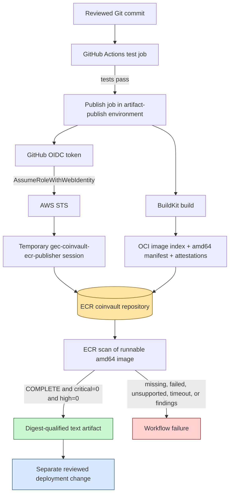
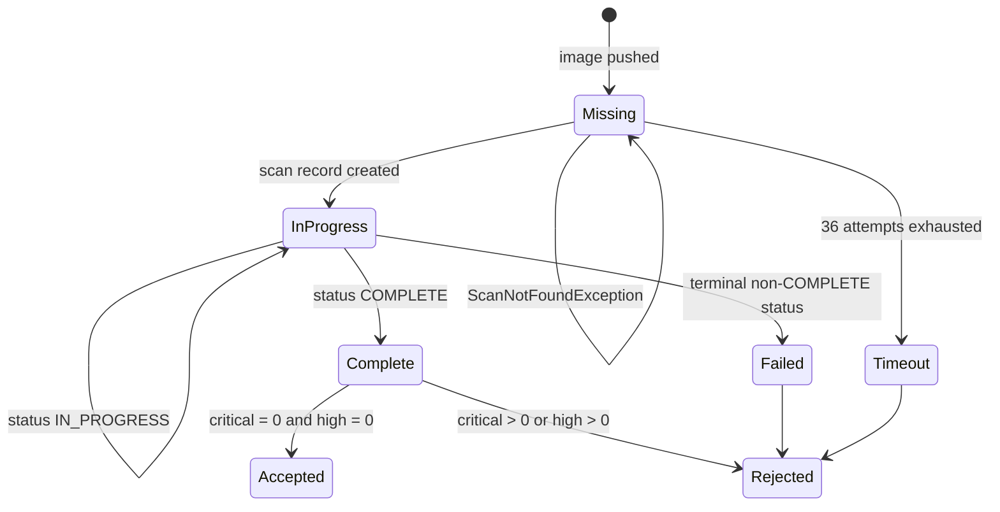

# CoinVault Container Supply Chain: GitHub OIDC, Immutable ECR Images, and Fail-Closed Scanning

CoinVault now has a separate artifact supply chain that converts a tested Git commit into an immutable Amazon ECR image without storing AWS access keys in GitHub. The implementation also demonstrates a less obvious requirement: a vulnerability gate must distinguish a clean scan from an unsupported scan. A package-free scratch image reduced the runtime filesystem but could not be assessed by ECR Basic Scanning. The correct result was rejection, not success.

This report explains the system from the perspective of an engineer who must operate, review, or extend it. It covers the Terraform state boundaries, GitHub workload identity, IAM trust and permissions, OCI image structure, ECR scanning behavior, runtime-base decisions, local acceptance tests, and the deployment handoff. It reports the actual sequence of successful and failed runs because the failures define important security invariants.

> [!summary]
> - GitHub Actions authenticates to AWS with a short-lived OIDC token. No AWS access key is stored in GitHub.
> - The publisher role can upload only to the CoinVault ECR repository and inspect its scan findings. It cannot deploy, delete images, read SSM secrets, pass IAM roles, or modify ECS.
> - The workflow deploys nothing. It emits a digest-qualified image reference only after ECR reports a completed scan with zero critical and zero high findings.
> - Scratch was rejected because ECR could not scan it. A pinned distroless Debian runtime preserves a minimal non-root image while supplying an OS inventory ECR supports.

## 1. The result that matters

The build pipeline is not defined by the fact that Docker can produce an image. Its useful output is a reviewed, test-backed, vulnerability-gated deployment input with a stable identity:

```text
605947888452.dkr.ecr.us-east-1.amazonaws.com/coinvault@sha256:<digest>
```

That string identifies exact image bytes. It is suitable for a later Terraform or ECS task-definition change. The build workflow does not update a service, write an SSM parameter, apply Terraform, query the production database, or move a `latest` tag. Publication and deployment remain separate authorization decisions.

The implementation spans two repositories:

| Repository | Important paths | Responsibility |
|---|---|---|
| `/home/manuel/code/gec/2026-03-16--gec-rag` | `.github/workflows/publish-image.yaml`, `Dockerfile`, `docker/entrypoint.sh` | Test, build, scan, and record the CoinVault image. |
| `/home/manuel/code/gec/goldeneaglecoin.com` | `infra/terraform/account-github-oidc`, `infra/terraform/coinvault-artifacts`, `infra/terraform/coinvault` | Own shared workload identity, artifact storage and publisher authorization, and the separately gated runtime. |

The detailed ticket source is `COINVAULT-AWS-001`, especially `design-doc/03-coinvault-ecr-image-supply-chain-with-github-oidc.md` and `reference/01-investigation-diary.md` under the CoinVault repository's `ttmp/2026/08/05/` directory.

## 2. Security properties before implementation details

The system is easier to evaluate when its claims are stated before its mechanisms.

1. A workflow receives temporary AWS credentials only when GitHub issues a token for the exact CoinVault repository and the protected `artifact-publish` environment.
2. The resulting role session can authenticate to ECR and publish layers and manifests only in the `coinvault` repository.
3. An image tag cannot be moved because ECR tag mutability is `IMMUTABLE`.
4. The deployment handoff is an image digest, not a tag.
5. The handoff artifact is created only after a supported ECR scan reaches `COMPLETE` with zero critical and zero high findings.
6. A missing scan, an unsupported image, a terminal scan failure, a timeout, or a malformed digest causes the workflow to fail.
7. The publication identity has no deployment authority.
8. Shared Terraform state is encrypted in S3 and uses S3-native locking, so authorized colleagues can coordinate without copying local state files.

These properties are independent. Immutable tags do not replace digest pinning. OIDC does not replace least-privilege IAM. A successful scan does not deploy an image. A minimal filesystem does not prove that a scanner assessed it.

## 3. System architecture



There are four control planes in this diagram:

- GitHub controls source revision, workflow execution, and entry into the protected environment.
- AWS IAM and STS control whether the GitHub workload identity can become an AWS role session.
- ECR controls image storage, tag immutability, lifecycle expiration, and Basic Scanning.
- The later deployment process controls whether an accepted digest becomes an ECS task-definition revision.

No single successful step proves the whole chain. The workflow establishes the chain by requiring each step in sequence and withholding its final artifact on failure.

## 4. Terraform state boundaries

The Terraform is divided according to resource lifecycle rather than application name alone.

### 4.1 Account-wide GitHub identity

`infra/terraform/account-github-oidc` owns the AWS IAM OIDC provider for `https://token.actions.githubusercontent.com`. It is account-global because other repositories can reuse the same issuer. Its state is stored at:

```text
s3://gec-terraform-state/account/github-oidc/terraform.tfstate
```

The provider resource has `prevent_destroy = true`. It grants no workload permissions on its own. It only allows IAM trust policies to name GitHub as a federated identity provider.

### 4.2 CoinVault artifact infrastructure

`infra/terraform/coinvault-artifacts` owns:

- the `coinvault` ECR repository;
- the ECR lifecycle policy;
- the `gec-coinvault-ecr-publisher` IAM role;
- the role's repository-scoped publication policy.

Its state is stored at:

```text
s3://gec-terraform-state/coinvault/artifacts/terraform.tfstate
```

The artifact stack reads the OIDC provider ARN from the account stack's remote state. This dependency is read-only. The artifact stack cannot create or destroy the shared identity provider through that data source.

### 4.3 CoinVault runtime infrastructure

The existing runtime remains in `infra/terraform/coinvault`, with state at:

```text
s3://gec-terraform-state/coinvault/terraform.tfstate
```

This stack will eventually own ECS, ALB integration, EFS, logs, and scheduled jobs. It does not own the ECR repository. The separation allows the team to build and evaluate production-shaped artifacts before authorizing runtime creation.

All three backends use encryption and `use_lockfile = true`. Sharing state therefore means granting each operator their own narrowly scoped AWS access to the relevant S3 keys and lock objects. It does not mean sharing the `gec` profile, checking `.tfstate` into Git, or exchanging local state files.

## 5. GitHub OIDC authentication

The publish job declares:

```yaml
permissions:
  contents: read
  id-token: write
```

`id-token: write` authorizes a job to request a signed GitHub OIDC token. It does not grant AWS permissions. AWS evaluates the token when the workflow calls `sts:AssumeRoleWithWebIdentity` through `aws-actions/configure-aws-credentials`.

The IAM trust policy requires two exact claims:

```hcl
condition {
  test     = "StringEquals"
  variable = "token.actions.githubusercontent.com:aud"
  values   = ["sts.amazonaws.com"]
}

condition {
  test     = "StringEquals"
  variable = "token.actions.githubusercontent.com:sub"
  values = [
    "repo:goldeneagle@341577/coinvault@1326945348:environment:artifact-publish",
  ]
}
```

The subject uses immutable GitHub organization and repository database IDs. CoinVault was created after GitHub's immutable-subject transition, so a name-only subject would not match its tokens. The `artifact-publish` environment has a branch policy allowing only `main`. GitHub and AWS therefore check different facts:

- GitHub decides whether the job may enter the environment.
- AWS decides whether a token describing that environment and repository may assume the role.

The environment contains three non-secret variables:

```text
AWS_REGION=us-east-1
AWS_ROLE_ARN=arn:aws:iam::605947888452:role/gec-coinvault-ecr-publisher
ECR_REPOSITORY=coinvault
```

There are no stored AWS access keys. STS credentials exist only for the job's bounded role session and expire automatically.

## 6. Least-privilege publication

ECR authentication requires `ecr:GetAuthorizationToken` with resource `*` because the token is a registry-level operation. Upload and cache-read operations are scoped to the CoinVault repository ARN:

```text
ecr:BatchCheckLayerAvailability
ecr:BatchGetImage
ecr:GetDownloadUrlForLayer
ecr:DescribeImageScanFindings
ecr:InitiateLayerUpload
ecr:UploadLayerPart
ecr:CompleteLayerUpload
ecr:PutImage
```

The role does not receive `ecr:BatchDeleteImage`, `ecr:DeleteRepository`, `ecs:UpdateService`, `ssm:GetParameter`, `iam:PassRole`, or general Terraform authority. Policy simulation confirmed that `PutImage` is allowed and those unrelated operations are denied.

`DescribeImageScanFindings` is necessary because the workflow itself enforces the vulnerability threshold. It is a read operation on the same ECR repository. Adding it does not allow the job to alter findings or scanner configuration.

## 7. Building an immutable OCI artifact

The workflow runs unit tests before starting the publish job. BuildKit then builds and pushes:

```text
coinvault:sha-<full Git commit>
```

ECR rejects attempts to move that tag because the repository uses immutable tags. BuildKit also emits provenance and an SBOM. With those attestations, the digest returned by the build action identifies an OCI image index rather than directly identifying the linux/amd64 runtime manifest.

The distinction is observable:

```text
OCI index digest
├── linux/amd64 runnable manifest digest
├── provenance attestation manifest
└── SBOM attestation manifest
```

ECR scans the runnable image manifest. It does not scan the top-level index as though the index were an operating-system filesystem. The workflow therefore retrieves the index with `BatchGetImage`, parses its manifests, and selects the entry whose platform is `linux/amd64`.

```pseudo
function resolveRunnableDigest(indexDigest):
    index = ECR.BatchGetImage(
        digest = indexDigest,
        acceptedMediaType = OCI_IMAGE_INDEX
    )

    candidate = first index.manifests where
        manifest.platform.os == "linux" and
        manifest.platform.architecture == "amd64"

    require candidate.digest matches "sha256:<64 lowercase hex>"
    return candidate.digest
```

The deployment reference still uses the top-level digest returned by BuildKit because that digest binds the complete published artifact. Scan evaluation uses the platform child that ECR actually inventories.

## 8. The scan state machine

Scan-on-push is eventually consistent. Immediately after a manifest appears, `DescribeImageScanFindings` can return `ScanNotFoundException`; it can then report `IN_PROGRESS`; finally it reaches a terminal state. A one-shot waiter treated the initial missing record as a permanent failure, so the implementation uses bounded polling.



The concrete algorithm is:

```pseudo
function requireCleanScan(runnableDigest):
    for attempt in 1..36:
        result = ECR.DescribeImageScanFindings(runnableDigest)

        if result is ScanNotFoundException:
            sleep(5 seconds)
            continue

        if result.status == IN_PROGRESS:
            sleep(5 seconds)
            continue

        if result.status != COMPLETE:
            fail("terminal ECR scan status", result)

        critical = result.count(CRITICAL, default=0)
        high = result.count(HIGH, default=0)
        medium = result.count(MEDIUM, default=0)
        writeStepSummary(critical, high, medium)

        require critical == 0
        require high == 0
        return

    fail("scan did not complete within three minutes")
```

The upload-artifact step runs after this function. GitHub skips it when the scan gate fails. The existence of the artifact is therefore evidence that the workflow reached the accepted state, not merely that ECR received bytes.

## 9. What the failed images established

The initial Debian slim runtime was scannable but unacceptable. ECR reported four critical and eleven high findings in the first successful publication experiment. A rebuilt Debian runtime reduced the result to four critical and eight high findings, but the threshold remained violated. Most findings came from runtime packages unrelated to CoinVault's normal execution, including Perl and libssh2 components inherited from the general-purpose base.

This result ruled out two incorrect responses:

- The workflow must not ignore the report because CoinVault does not intentionally invoke the vulnerable packages.
- The workflow must not upload the deployment input before the scanner gate.

The next runtime used `FROM scratch`, a statically linked CoinVault binary, a static BusyBox copied as `/bin/sh`, CA roots, application configuration, and the existing entrypoint. The image ran locally as UID/GID 10001 with a read-only root filesystem. ECR still rejected it:

```text
status: FAILED
description: UnsupportedImageError: The operating system and/or package manager are not supported.
```

This is the central technical issue. `imageScanFindings: null` does not mean zero findings. It means ECR produced no findings dataset. The workflow treated the terminal `FAILED` state as failure and withheld the deployment artifact.

## 10. Why distroless is the selected runtime

The selected final stage is pinned by digest:

```dockerfile
FROM gcr.io/distroless/static-debian12:nonroot@sha256:f5b485ea962d9bd1186b2f6b3a061191539b905b82ec395de78cbfae51f20e35 AS runtime
```

The application remains statically linked. The distroless base supplies a minimal Debian identity and package inventory that ECR can recognize, along with standard runtime files. The image copies the pinned BusyBox executable to `/bin/sh` because `docker/entrypoint.sh` maps optional environment settings to CoinVault CLI flags. It runs as `10001:10001`, matching the planned ECS/EFS ownership contract.

The choice preserves these properties:

- The runtime contains no compiler, package manager command, or general administrative toolset.
- The image base and BusyBox source are pinned by SHA-256 digest.
- The CoinVault binary is static and built with `-trimpath`.
- SQLite loadable extensions are omitted from the Go build.
- DNS and user lookup use Go implementations through `netgo` and `osusergo`.
- The root filesystem can remain read-only while `/app/var` is mounted writable.
- ECR receives a supported OS inventory rather than a null scan target.

The remaining review point is the copied standalone BusyBox binary. It is operationally necessary only because the current entrypoint is a shell script. A later simplification could move environment-to-flag mapping into Go and remove the shell entirely, but that is an application change rather than a prerequisite for the supply chain.

## 11. Local production-shaped verification

The runtime was tested locally before another remote publication. The decisive test did not require production credentials or a live database. CoinVault was given a syntactically complete but unreachable MySQL configuration together with `COINVAULT_SKIP_DB_CHECK=true`, allowing the HTTP process to start without registering DB-backed tools.

The container constraints were:

```text
user:                 10001:10001
root filesystem:      read-only
/app/var:             writable tmpfs owned by 10001:10001
published test port:  127.0.0.1:18083 -> 8080
database target:      intentionally unreachable 127.0.0.1:9
```

Docker reported:

```text
running=true readonly=true user=10001:10001
```

`GET /healthz` returned `ok: true`, reported the embedded UI, and correctly described the configured database as unhealthy because probing was skipped. No production or development database was contacted.

One test invocation exposed a configuration-boundary error. `COINVAULT_GEC_MYSQL_*` belongs to CoinVault's bootstrap configuration. The direct `serve` command uses Clay SQL fields such as `COINVAULT_HOST`, `COINVAULT_PORT`, `COINVAULT_DATABASE`, `COINVAULT_USER`, and `COINVAULT_PASSWORD`. `coinvault serve --help` is authoritative for that mapping.

## 12. Operational procedure

### 12.1 Publishing

1. Merge a reviewed change to `main` in `goldeneagle/coinvault`.
2. Confirm the `Test publish candidate` job passes.
3. Confirm the publish job enters `artifact-publish` and exchanges OIDC identity successfully.
4. Confirm BuildKit publishes the full-SHA tag and records a valid OCI index digest.
5. Confirm the scan gate resolves the linux/amd64 child manifest.
6. Confirm ECR reports `COMPLETE`, `CRITICAL=0`, and `HIGH=0`.
7. Download the `coinvault-image-<full-sha>` workflow artifact.
8. Inspect `coinvault-image-uri.txt`; require a repository URL followed by `@sha256:<64 hex>`.
9. Use that exact value in a separately reviewed runtime change.

### 12.2 Terraform changes

For each stack, initialize with the approved AWS profile, format, validate, plan, and inspect the exact resource changes before applying. After application, rerun plan and require no drift.

```text
AWS_PROFILE=gec terraform init
terraform fmt -check -recursive
AWS_PROFILE=gec terraform validate
AWS_PROFILE=gec terraform plan
```

Do not migrate resources between state files by deleting and recreating them. Inspect source and state ownership first. In this implementation the original runtime state contained no managed ECR resources, so removing the unapplied ECR declarations from the runtime configuration did not require a state move.

### 12.3 Authentication failures

If OIDC assumption fails, inspect these values in order:

1. The workflow job declares `id-token: write`.
2. The job names the `artifact-publish` environment.
3. The environment permits the current branch.
4. `AWS_ROLE_ARN` names the expected account and role.
5. The IAM trust policy audience is `sts.amazonaws.com`.
6. The trust policy subject contains the current immutable organization and repository IDs.

Do not create an AWS access key to bypass a workload-identity mismatch. Fix the claims or trust policy.

### 12.4 Scan failures

Interpret scan results by state and findings:

| ECR result | Meaning | Action |
|---|---|---|
| `ScanNotFoundException` shortly after push | Scan record is not visible yet. | Retry within the bounded polling window. |
| `IN_PROGRESS` | Scanner is active. | Retry within the bounded polling window. |
| `COMPLETE`, critical/high both zero | The configured gate accepts the image. | Upload the digest handoff. |
| `COMPLETE`, critical or high nonzero | The image contains findings above policy. | Reject and remediate packages or dependencies. |
| `FAILED` with `UnsupportedImageError` | The scanner cannot assess the filesystem. | Reject; use a supported minimal base or a separately approved scanner. |
| No terminal result after three minutes | Evidence is incomplete. | Reject and investigate service latency or configuration. |

## 13. Common implementation errors

### Treating a tag as deployment identity

A full-SHA tag is useful for navigation, but the deployment must use the digest. Repository policy can make tags immutable; the digest still provides the direct content identity consumed by ECS.

### Scanning the OCI index digest

BuildKit's provenance and SBOM output makes the top digest an OCI index. ECR scan findings belong to the runnable child manifest. Resolve the platform child explicitly.

### Treating null findings as zero findings

Check `imageScanStatus.status` before reading severity counts. Defaulting absent JSON keys to zero is safe only after status is `COMPLETE`.

### Giving the publisher deployment permissions

The CI build role does not need ECS, SSM, IAM role-passing, or Terraform permissions. Add later deployment automation through another role and another approval boundary.

### Coupling ECR creation to runtime creation

Artifacts must exist before runtime rollout can be reviewed. Keep ECR and publisher IAM in an artifact stack whose lifecycle does not depend on `deploy_runtime`.

### Sharing operator credentials to share Terraform state

Shared state belongs in S3; operator identity remains individual. Grant colleagues access to the exact backend keys and lock objects through scoped IAM.

## 14. Evidence and current status

The implementation produced three useful classes of evidence:

- IAM policy simulation allowed `ecr:PutImage` and denied image deletion, ECS update, SSM reads, and `iam:PassRole`.
- Local runtime tests proved the static binary, shell entrypoint, UID 10001, read-only root filesystem, writable state mount, and HTTP health endpoint.
- GitHub runs proved OIDC exchange, ECR push, immutable digest generation, fail-closed vulnerability thresholds, and fail-closed unsupported-image handling.

The final distroless publication evidence is recorded in GitHub Actions run `31209039289` for commit `1d4037cd6bc0b1c0ea1ebe694e518cc36ee81d53`. The test job completed in 49 seconds and the publication job completed in 6 minutes 1 second. AWS independently reported the runnable manifest scan as complete at `2026-08-07T19:00:42Z`.

```text
workflow result: success
OCI index digest: sha256:d4a8a875e0e24736167a473b9610583e29f39a1859220928cd16170661ff1b53
linux/amd64 digest: sha256:5b4236e4c682511a56d85f1d20d36463c24a8cdf9b0005ad5e63535b94d0fb81
ECR scan: COMPLETE; critical=0; high=0; medium=0
handoff artifact: coinvault-image-1d4037cd6bc0b1c0ea1ebe694e518cc36ee81d53
handoff artifact ID: 9006106469
handoff artifact ZIP digest: sha256:ce894c2917db041343b7c93ec322164d5172d4a919cadd9fb5c89cabfb0a5dc7
```

## 15. Working rules

- Store no long-lived AWS credentials in GitHub.
- Match workload identity by immutable repository identity and protected environment.
- Keep artifact publication authority separate from runtime deployment authority.
- Pin production base images by digest.
- Deploy by digest, not by tag.
- Require scanner status `COMPLETE` before interpreting finding counts.
- Treat unsupported, missing, timed-out, and failed scans as rejection.
- Upload the deployment input only after every gate succeeds.
- Keep Terraform state shared in encrypted, locking-enabled S3 backends and keep operator credentials individual.
- Record the Git commit, workflow run, OCI index digest, runnable manifest digest, and scan result together.

## Related notes

- [[PROJ - CoinVault GEC-RAG - Golden Eagle UI Overhaul and RAG Adoption Plan]]
- [[PROJ - CoinVault GEC-RAG - ragkit Extraction and knowledge_search Integration]]
