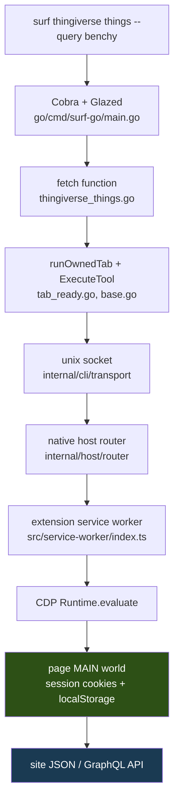
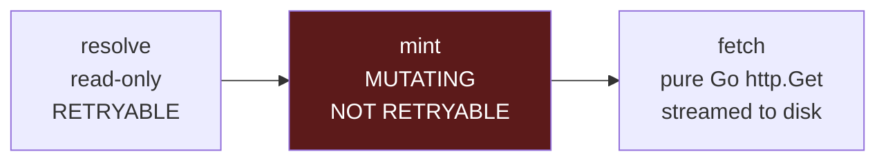

# surf-go 3D Model Marketplace Verbs

Nine CLI verbs were added to `surf-go` for browsing and downloading from
makerworld.com, thingiverse.com and printables.com, and a tenth through
fifteenth were designed for MakerWorld's social surface — collections, likes
and comments. The implementation is straightforward. The interesting part of
the project is what had to be established before any of it could be written,
and the categories of failure that emerged from establishing it.

Every browser verb previously in this repository scrapes rendered DOM. That is
the default because most authenticated web applications do not offer a usable
API to a script running inside one of their own pages. These three sites do,
and taking that path changed the shape of the verbs, the shape of their tests,
and — for two of the three — made downloads possible at all.

> [!summary]
> - The embedded page script is not an extractor but an authenticated HTTP client: it runs in the page's main world, holds the session, and calls the site's own JSON or GraphQL API. Selector rot, the dominant maintenance cost of every other verb in the repository, largely disappears.
> - Three sites produced three different classes of failure that no automated test can detect: silently ignored request parameters, a CDN that rejects Go's default `User-Agent`, and an API whose write route takes a complete set where an append is the obvious reading.
> - Any operation that mints a download link is a mutation regardless of HTTP verb, which means it cannot pass through the repository's owned-tab retry helper. Enforcing that required a socket-level test per site.
> - Anti-automation challenges are a first-class error condition to classify and hand back to the user, not an obstacle to route around.

## Why this project exists

`surf-cli` drives a real Chrome session through a native messaging host. Its
value is that it operates as the user, with the user's cookies, without API
keys or app registrations. The Go CLI (`surf-go`) exposes this as verb families
per site: `chatgpt`, `kagi`, `gmail`, `linkedin`, `upwork`, `freelancer`,
`libgen`, `paypal`, and now three 3D-model marketplaces.

The request was ordinary: browse and download models from three sites. The
existing family template, `freelancer_jobs.go`, is a listing verb that opens a
search page, waits for cards to render, and reads them with CSS selectors. The
first hour of investigation established that this template was the wrong one.

Thingiverse's `/thing:<id>` pages contain no file list in their initial DOM at
all — a probe recorded `stateScriptCount: 0` and `fileLinks: []`. MakerWorld's
search page ships a 694 KB `__NEXT_DATA__` payload whose contents are nested
behind Next.js serialisation. Printables loads 201 JavaScript chunks before
rendering. More decisively, none of the three renders a downloadable file URL
into the page: those URLs are either published in an API response or minted on
demand by an API call. A DOM scraper could list models on all three sites and
download files from none of them.

## Current project status

Nine verbs are implemented, tested and registered on the branch
`task/add-3d-model-verbs` across ten commits.

```
surf thingiverse  things | thing | download
surf printables   models | model | download
surf makerworld   models | model | download
```

Validation reached bytes-on-disk for two of the three families:

| Family | Search | Detail | Download |
|---|---|---|---|
| Thingiverse | live | live | 11,285,384 B (`3DBenchy.stl`) |
| Printables | live | live | 15,954,184 B file; 24,733,548 B pack |
| MakerWorld | live | live | mint contract verified; end-to-end blocked by a captcha |

A second ticket, `SURF-20260807-MWSOCIAL`, designs six further verbs for
MakerWorld's social surface and is ready for handoff. Its API contracts are
established; no code is written.

## Architecture

### The execution path

A verb invocation traverses six layers before reaching the site's API.



The layers from Cobra down to CDP already existed. What this project changed is
what happens in the last two boxes.

### The main world is the whole mechanism

`surf js` evaluates in the page's main world rather than an isolated content
script world. This was not documented anywhere in the repository; it was
established from a stack trace produced by a failing call:

```
Error: TypeError: Failed to fetch (api.thingiverse.com)
    at https://cdn.thingiverse.com/site/js/common_app.bundle.js:2:156104
    at call (<anonymous>:17:21)
```

The `fetch` invoked by the probe resolved into thingiverse.com's own bundle.
That is only possible if the script shares globals with the page.

Three consequences follow, and all three shaped the implementation.

The session is available without any credential handling.
`fetch(path, {credentials: 'include'})` sends the site's cookies;
`localStorage` is the page's real storage. This is why the design works at all:
there is no OAuth application to register, no API key for the user to obtain,
and no token for `surf-go` to store.

The page can interfere. thingiverse.com replaces `window.fetch` with a wrapper
that rejects some cross-origin requests with an opaque `Failed to fetch`. The
production scripts for that site use `XMLHttpRequest`, which the site does not
patch and which still receives normal browser CORS handling.

Interceptors are possible. Patching `window.fetch` and
`XMLHttpRequest.prototype.open` from a probe captures the single-page
application's own traffic, including request bodies. This became the primary
tool for establishing mutation contracts.

### What an API-first page script looks like

The contrast with the DOM-scraping template is worth stating precisely.
`freelancer_jobs.js` is 158 lines: a card selector, a `waitForCondition` poll,
deduplication by URL, a `detectLoggedIn` heuristic that reads header text for
the strings "Log In" and "Sign Up", and a `detectNoResults` regular expression
over `document.body.innerText`.

`thingiverse_things.js` is roughly 140 lines, none of which mention the DOM:

```js
// The /api/v2 bearer is a *user* JWT in localStorage with a 600s TTL. Read it
// immediately before each call — never cache it across calls.
function readToken() {
  try { return (JSON.parse(localStorage.getItem('tv_access_token') || '{}').data) || ''; }
  catch (_) { return ''; }
}

async function apiGet(path) {
  let r = await xhr(path, readToken());
  if (r.status === 401 && isExpiredToken(r.text)) {
    await sleep(1500);                       // let the SPA refresh, then re-read
    r = await xhr(path, readToken());
  }
  …
}
```

The `loggedIn` determination is a status code rather than a heuristic over
header copy. The "no results" determination is `total === 0` rather than a
regular expression over visible text. Both are properties of the API response,
not of the rendering.

### Landing URL selection

A DOM-scraping verb must load the page it scrapes. An API-first verb must not,
because loading it costs time and provides nothing.

```
tab.new /search?q=benchy          →  ad stack, hydration, then call the API
tab.new https://www.thingiverse.com/  →  call the API
```

All nine verbs land on the site root and set `AllowInteractive: true` in their
readiness options, because they need a live execution context on the correct
origin rather than a finished render. The mock-host integration test asserts
the landing URL is the site root specifically so that a later change to a
"matching" search URL fails loudly.

## Implementation details

### Establishing contracts against undocumented APIs

None of the three sites documents the API its own front end uses. Four
techniques were used, in increasing order of intrusiveness, and the order
matters: each was exhausted before moving to the next.

**Reading captured traffic.** The extension's CDP network capture records
request headers. This is how both of Thingiverse's bearer tokens were found:

```bash
surf tab switch --args-json '{"tabId":441403703}'   # capture follows the ACTIVE tab
surf network clear
surf navigate --tab-id 441403703 --url "https://www.thingiverse.com/thing:763622/files"
sleep 12
surf network list --args-json '{"limit":500}' > /tmp/net.yaml
grep -n "thingiverse.com/api" /tmp/net.yaml
```

Reading the `requestHeaders` block above each matching `url:` line showed two
different `Authorization: Bearer` values on the same origin — a short-lived
user JWT on `/api/v2` and a 32-hex application token on `/api/v1`.

**Extracting documents from the client bundle.** Printables disables GraphQL
introspection:

```
POST /graphql/  {"query":"{ __schema { queryType { name } } }"}
→ 400 {"errors":[{"message":"GraphQL introspection has been disabled, …"}]}
```

The operation documents are nonetheless compiled into the SvelteKit chunks. A
probe enumerates every same-origin `script[src]` and
`link[rel=modulepreload]`, fetches each, matches `query X(` / `mutation X(`,
and brace-matches forward to the end of the document. A model page yields 43
operations and 44 fragments.

The brace matching is the part that matters. A fixed-length slice
(`text.slice(i, i + 600)`) truncates mid-document and produces something that
looks correct and does not parse.

**Provoking errors deliberately.** With introspection disabled, the gateway's
error messages are the schema:

```
Value 'BEST_MATCH' does not exist in 'SearchChoicesEnum' enum.
  Did you mean the enum value 'best_match'?
Cannot query field 'dateCreated' on type 'PrintType'.
```

A probe walked twenty-six candidate field names one at a time against
`print(id:)` and built a twenty-field selection from the acceptances; the
rejections were equally informative.

**Driving the real interface with an interceptor.** Used only where the
preceding three failed — which, for MakerWorld's mutations, they did.

### The status dialect as a decision procedure

MakerWorld sits behind a Next.js edge rewrite, and the response to a wrong
request encodes where it died:

| Response | Meaning |
|---|---|
| `404` with a bare `{}` | Edge rewrite miss — the route does not exist |
| `404` with `{"code":404,"error":"The server cannot find the requested resource."}` | Reached the upstream API — route correct, identifier wrong |
| `405` | The route exists and GET is not its method |
| `400` | Route exists, GET permitted, parameters wrong |

This converts endpoint discovery from guessing into a search with feedback. It
also provides something more valuable: a way to prove that a mutation route
exists without invoking it. `GET /api/v1/design-service/design/40146/like`
returns 405, which establishes the route while changing nothing.

`OPTIONS` and `HEAD` were tried as a way to learn the accepted method. Both
return 405 with fifteen response headers and no `Allow` among them. The gateway
does not disclose it, which is why the mutation contracts ultimately required
live capture.

### Vocabulary as a search problem

Two sweeps across four service prefixes — `collection-service`,
`design-user-service`, `design-service`, `user-service` — for every plausible
spelling of "collection" returned bare-`{}` 404s without exception. The concept
is not called that on MakerWorld.

The collections page's Next.js payload contains `favoritesList`,
`systemFavorites` and `collectionsCounts`. Re-sweeping with `favorite` hit
`/api/v1/design-service/my/favorites` on the first attempt.

The generalisable rule: when every path guess produces the "route does not
exist" dialect, the word is wrong rather than the path shape, and the site's
own payload is the fastest place to find the right one.

## The failure class that testing cannot reach

Three defects in this project shared a property: no automated test at any layer
could observe them. They are worth separating from ordinary bugs because the
defence against them is procedural rather than technical.

### Silently ignored request parameters

`GET /api/v2/search/things` on Thingiverse accepts `query`, `q`, `search`,
`keywords` and `name` with HTTP 200 and ignores all of them. It returns the
globally most-liked models for any input. Only `term` filters.

The first implementation shipped `query=` and looked correct. A probe varied
only the parameter name for the phrase "articulated dragon":

| Parameter | Status | `total` | First hits |
|---|---|---|---|
| `query` / `q` / `search` / `keywords` / `name` | 200 | 10000 | #3DBenchy, Cute Mini Octopus, Baby Groot |
| **`term`** | 200 | **444** | Seven the Articulated Dragon, ARTICULATED ice dragon, Articulated Skeleton Dragon |

MakerWorld has the same defect in a different position. Its search accepts a
`sort` parameter — the site's own request sends `sort=trending` — which does
nothing. Ten candidate values returned an identical total of 2815 and an
identical first hit. Ordering is controlled by `orderBy`, and only six of
sixteen plausible spellings for that reorder anything; the remainder fall back
to relevance without complaint.

Consider why each test layer misses this.

- The mock-host integration test cannot see it. The mock answers whatever it is asked; the parameter name is a detail of a string it never inspects.
- Unit tests cannot see it. They exercise URL construction, response parsing and row shaping, all of which are correct.
- A live run cannot see it *if the validation query is chosen badly*. The original validation used "benchy", and #3DBenchy is the most-liked model on Thingiverse — so the wrong answer and the right answer were the same three rows.

Two procedural rules follow, and they are the actual defence:

- Validate a search verb with a query whose expected results are recognisable, and never with a term that is also the corpus's most popular item.
- Run one query under two orderings and confirm the first result changes. If it does not, the ordering parameter is being ignored.

Since no runtime layer can observe a parameter name, the regression guard has
to assert on the embedded script's text:

```go
func TestThingiverseThingsScriptUsesTermParameter(t *testing.T) {
    if !strings.Contains(thingiverseThingsScript, "'?term=' + encodeURIComponent(query)") {
        t.Fatalf("search must be issued with the `term` parameter")
    }
    if strings.Contains(thingiverseThingsScript, "?query=") {
        t.Fatalf("`query=` is silently ignored by the Thingiverse search API")
    }
}
```

This is brittle by construction — reformatting the script breaks it — and it is
used only where no other layer can observe the fact.

### A transport failure that presents as an authentication failure

Printables mints download links through a GraphQL mutation. The returned URL is
unsigned and stable. Fetching it from Go returned:

```
unexpected status 403 Forbidden
```

Three hypotheses were tested and eliminated: the link is session-bound, the
link requires a `Referer`, the link is single-use. A probe fetched the same URL
from the page with `credentials: 'omit'` and received HTTP 206 with
`content-type: model/stl`, and minting twice produced a byte-identical URL.

The cause was found with four `curl` invocations:

| User-Agent | Status |
|---|---|
| `Go-http-client/1.1` (Go's default) | **403** |
| curl's default | 206 |
| absent | 206 |
| a Chrome UA | 206 |
| `surf-cli/1.0 (+https://github.com/nicobailon/surf-cli)` | 206 |

`files.printables.com` rejects Go's default `User-Agent` by name. The download
path now always sends an explicit product token, which `cdn.thingiverse.com`
also accepts, so one constant serves all three sites.

The generalisable observation: when a transfer succeeds in one client and fails
in another, compare the requests rather than the credentials. The failure
presented as an authorisation problem and consumed roughly an hour of
investigation into imaginary session issues.

### A write route whose payload shape is a set, not a delta

MakerWorld's "Add this model to a collection" dialog sends, on confirmation:

```
PUT /api/v1/design-service/my/design/favoriteslist
{"designId":40146,"favoritesIds":[1939401,1749422],"ref_":"def_MWModelDetail_add"}
```

`favoritesIds` is the complete set of collections the model should belong to.
The dialog can send it safely because it first reads the current membership,
pre-checks those boxes, and submits the resulting set.

A verb implementing "add model M to collection X" as
`{"designId": M, "favoritesIds": [X]}` removes M from every other collection it
was in. HTTP 200, no error, no warning.

Nothing in the request declares this. It was noticed because `favoritesIds`
contained two identifiers when only one collection had been checked during that
session — meaning the payload was resubmitting prior membership. The
confirming detail is that the dialog's read call,
`GET /my/design/favoriteslist?designId=40146`, returns
`{"designId":40146,"favoritesIds":[…]}` — the same field name and the same
shape as the write.

A read and a write that share a payload shape are a get/set pair, not
get/append.

A safe alternative exists and was captured from the create-and-add flow:

```
PUT /api/v1/design-service/my/favorites/32634663
{"add":[40146]}
```

Incremental, scoped to one collection, incapable of affecting another. The
design document for the social verbs specifies this route and proposes a
script-text test that fails if the destructive path ever appears.

## Mutations, and why the retry helper is dangerous

The repository provides `withOwnedTabRetry`, which opens a tab, runs an
extraction, closes the tab, and retries the whole cycle on transient
tab-lifecycle errors — `"navigated or closed"`, `"Detached while handling
command."`, `"Cannot find default execution context"`. Its documentation
already warns against using it for mutations.

The non-obvious part of this project is which operations count.

Printables' `GetDownloadLink` mutation returns `output.count`, which is the
model's *new* global download counter. Calling it increments a public number on
another person's model. MakerWorld's `/instance/<id>/f3mf?type=download` is an
authenticated download action against the user's account and feeds per-profile
counters. Neither is a read, despite one of them being an HTTP GET.

Download verbs therefore have a mandatory three-phase structure:



The distinction is enforced by threading a flag into the tab helper:

```go
func runPrintablesScript(ctx context.Context, t printablesTransport,
                         code string, retryable bool) (map[string]any, error) {
    retries := defaultOwnedTabRetryCount
    if !retryable {
        retries = 0     // replaying a mint would double-count downloads
    }
    …
}
```

and locked by a socket-level test that drives the mint's `js` call with
`"Inspected target navigated or closed"` — precisely the error class the retry
helper recovers from — and asserts the command gives up. Its counterpart
asserts the read-only resolve phase still retries.

Thingiverse escapes this entirely. Its detail response carries
`zip_data.files[]` with public, unsigned `cdn.thingiverse.com` URLs, so the
detail verb *is* the resolve phase and there is no mint step. Preserving that
asymmetry matters: harmonising the three families into one shape would add a
pointless round trip and a pointless side effect to the one site that needs
neither.

## Anti-automation as a first-class error

Partway through validating the MakerWorld download verb, the endpoint began
returning:

```
HTTP 418
{"error":"We need to confirm that you are not a robot.",
 "captchaId":"3f7658828704f1d2723a68371726a676",
 "apiServers":["gcaptcha4.geetest.com","gcaptcha4.geevisit.com",
               "gcaptcha4.gsensebot.com"], …}
```

The same design and the same print profile had minted a signed URL an hour
earlier in the same session, so the challenge is triggered by behaviour rather
than by the resource. It persisted across retries, across models, and across
several minutes.

Three decisions followed.

The challenge is classified, not passed through. Emitting the GeeTest JSON at
the user conveys nothing actionable. The verb reports what happened, what to do
about it, and how to make it less likely:

```
Error: makerworld: the site is asking for a captcha before it will issue a
download link.
Open makerworld.com in the browser session surf is attached to, download one
file by hand to clear the challenge, then retry.
Downloading fewer files per run (avoid --all) makes this less likely.
```

The run aborts rather than continuing per file. Every subsequent request in a
challenged session hits the same wall, and continuing makes the situation
worse.

The challenge is not defeated. It exists to establish that a person is present.
The user is one and can answer it legitimately; driving it programmatically
would present an automated client as a person to a site that has explicitly
asked. This also shaped the selection flags: a bulk `--all` across a model with
37 print profiles is the reliable way to earn a challenge, so bulk operations
are explicit and never the default.

The consequence for this project is recorded rather than hidden: MakerWorld's
download verb is the one path without a bytes-on-disk validation.

## Per-site contracts

The three sites converged on the same verb shape and almost nothing else.

| | MakerWorld | Thingiverse | Printables |
|---|---|---|---|
| Transport | REST, same origin | REST, same origin | GraphQL, cross origin |
| Credential | session cookie | `Authorization: Bearer <JWT>` from `localStorage` | session cookie |
| Token lifetime | n/a | **600 s** | n/a |
| Login probe | `/api/v1/user-service/my/profile` | any `/api/v2` route | `query Me` |
| Search | `search-service/select/design2` | `/api/v2/search/things` | `searchPrints2` |
| Detail | `design-service/design/<id>` | `/api/v2/things/<id>/complete` | `print(id:)` |
| File inventory | `instances[]` + `designExtension.model_files[]` | `zip_data.files[]` | `stls`/`gcodes`/`slas`/`otherFiles` |
| Download URL | minted, **signed** | already published, **public** | minted, unsigned |
| Mutating? | yes | **no** | yes |
| Identifier type | int | int | string |

The Thingiverse token deserves emphasis. Its `/api/v2` JWT lives in
`localStorage.tv_access_token` as `{"data":"<jwt>","expires":"…"}`, and its
claims show `exp - iat = 600`. The single-page application refreshes it on its
own schedule. Any implementation that reads the token once and reuses it will
fail intermittently, so the scripts read it inside the request helper and
re-read it on the one retry they perform.

Expiry is reported in two different response bodies depending on the route —
`{"…","type":"INVALID_ACCESS_TOKEN"}` on `/things/<id>/complete` and
`{"error":"unauthorized","message":"Invalid or expired access token."}` on
`/search/things`. Matching only the first misreports a live session as logged
out.

## Current user-facing commands

```bash
# Search
surf thingiverse things --query "articulated dragon" --per-page 10
surf printables models  --query "articulated dragon" --ordering popular
surf makerworld models  --keyword "articulated dragon" --order-by likeCount

# Detail (accepts an id or a full URL)
surf thingiverse thing 763622
surf printables model https://www.printables.com/model/3161-3d-benchy
surf makerworld model 40146 --profiles

# Download
surf thingiverse download 763622 --file 3DBenchy.stl --save-to ~/models/
surf printables  download 835659 --pack --save-to ~/models/
surf makerworld  download 40146 --instance 109644 --save-to ~/models/

# Preview without downloading, and on two sites without minting
surf thingiverse download 763622 --all --dry-run
```

Three behaviours are worth stating because they are deliberate rather than
incidental.

Downloads never guess. A model with several files lists them and stops until
the caller passes `--file`, `--instance`, `--all` or `--pack`. Selecting one of
eleven STLs on the caller's behalf is worse than requiring them to name it.

`makerworld download` fetches a print profile, not the source model. MakerWorld
publishes no download URL for a designer's source uploads even to an
authenticated caller. The flag is `--instance` rather than `--file` so that the
distinction is visible in the command the user types.

A partial `--all` failure still emits rows for the files that succeeded, then
returns an aggregate error. Glazed's `RunIntoGlazeProcessor` returns a single
error, so failing on the first bad file would discard the successes; the
implementation emits every row and returns the aggregate afterwards, which
gives the shell a non-zero exit and the user both the successes and the
diagnosis.

## Important project docs

- `ttmp/2026/08/07/SURF-20260807-3DMODELS1--…/design-doc/01-…` — the intern-oriented analysis, design and implementation guide for the nine verbs
- `ttmp/2026/08/07/SURF-20260807-3DMODELS1--…/reference/02-verified-site-api-contracts-…` — every contract with the probe that proves it
- `ttmp/2026/08/07/SURF-20260807-3DMODELS1--…/reference/01-investigation-diary-…` — the chronological record, including dead ends
- `ttmp/2026/08/07/SURF-20260807-MWSOCIAL--…/design-doc/01-…` — the social-verb design, whose Part II is a mutation-safety chapter
- `go/pkg/doc/tutorials/03-api-first-browser-verbs.md` — the pattern, discoverable as `surf help build-api-first-browser-verbs`

The probes are the most reusable artifact. Three are site-agnostic and worth
promoting to a shared location:

- `08-install-network-interceptor.js` — main-world `fetch`/XHR interceptor
- `17-printables-extract-operation-document.js` — brace-matching GraphQL document extractor
- `18-printables-extract-fragments.js` — fragment extractor

## Open questions

- MakerWorld publishes no download URL for a designer's source uploads. Thirteen route shapes returned the edge-rewrite 404. The design's `--source` flag is blocked on it, and brute-force probing is now inadvisable because of the captcha.
- MakerWorld's end-to-end download validation is outstanding, pending a person clearing the challenge.
- None of the sixteen `orderBy` spellings tried on MakerWorld provides recency ordering, which is a genuine gap for a browse verb.
- Thingiverse's un-like contract could not be captured: clicking the control a second time issued no request. The social design ships `like` without `--undo` rather than shipping a guess.
- `{"remove":[…]}` as the pair of `{"add":[…]}` on MakerWorld's collection route is an inference from symmetry and gates `collect --remove`.
- Rate limits were not probed on any of the three sites. The polite delay between files in an `--all` run is a conservative default rather than a measured one.

## Near-term next steps

- Close the three gating questions in `SURF-20260807-MWSOCIAL` — un-like, `{"remove":…}`, and the comment paging cursor — before the corresponding flags ship.
- Implement the six MakerWorld social verbs against the completed design.
- Apply the same investigation to Thingiverse and Printables social surfaces. Printables should be substantially cheaper: `LikeCreate`, `LikeDelete`, `ModelAddToCollection`, `MyCollections` and `MyCollectionsModels` are already visible in the recovered operation inventory, and GraphQL documents can be extracted from the client without performing a single mutation.
- Promote the three site-agnostic probes to a shared `ttmp/_tools/` location.

## Project working rules

These are the rules the project produced, stated so they can be applied
elsewhere.

- Establish whether an API exists before writing a scraper. Watch what the page itself calls; do not infer from what it renders.
- Read a token immediately before use when its lifetime is short or unknown. Assume it is short.
- Normalise a site's several dialects of "unauthenticated" into a small vocabulary in the page script, and keep "our code omitted the header" distinct from "the user's token expired". They have different remedies.
- Validate a search verb with a query whose expected results are recognisable, and confirm that two different orderings return different first results.
- Treat any operation that mints, counts, or notifies as a mutation regardless of HTTP verb, and never route it through a retry helper.
- Send an explicit `User-Agent` on every request a CDN will see.
- When a read and a write share a payload shape, assume get/set until proven otherwise.
- Classify anti-automation challenges and return control to the user. Do not attempt to satisfy them programmatically.
- Record negative results. Two failed bundle-grep probes are why MakerWorld's mutation contracts required live capture; without them the next person repeats the work.

## Related notes

- [[ARTICLE - surf-go Browser Verbs - Using JS Probes to Build Reliable Web Automation]]
- [[PROJ - surf-cli - Anna's Archive and Z-Library Browser Commands]]
- [[PROJ - surf-go Freelancer Verbs - Browser-Side Command Deep Dive]]
