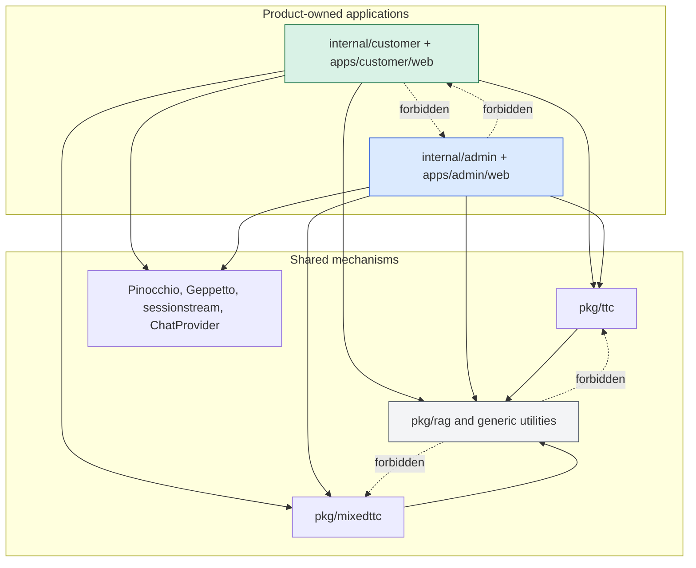
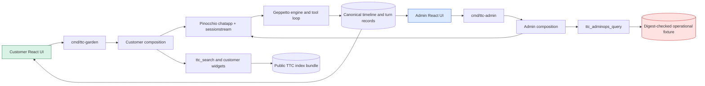
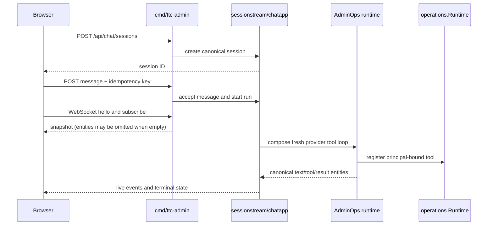
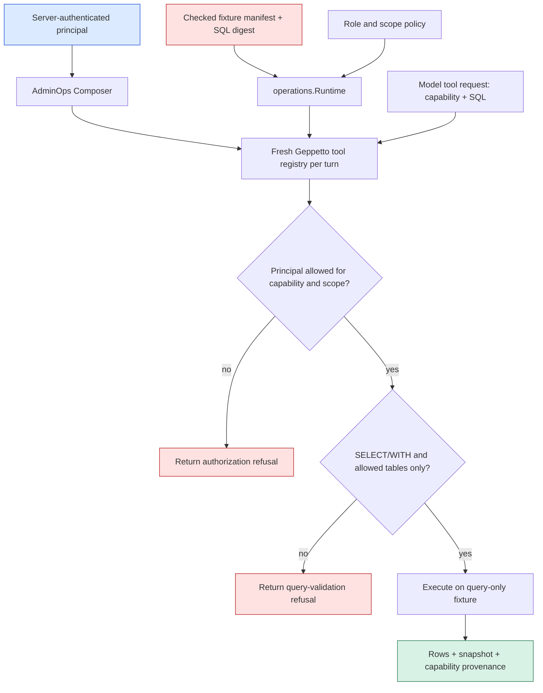

# RAG-TTC Assistant Cutover: Two Products, One RAG Core, and Bounded AdminOps

This report explains the cutover that placed the customer-facing TTC Garden Assistant and the internal TTC AdminOps assistant in one `rag-ttc` repository without pretending that they are one product. The project now has two independently composed applications, two frontend workspaces, two data and benchmark contracts, and one deliberately narrow set of shared RAG mechanisms. The work was a repository and runtime reorganization, but its technical significance is larger: it separates public document-grounded answering from authorized operational querying before either product accumulates more incompatible assumptions.

The cutover is complete through its structural, serving, and initial evaluation phases. Garden runs from the merged repository. AdminOps runs through a canonical server and can execute a bounded, role-scoped operational query tool against a frozen synthetic fixture. The remaining open review is narrower than the completed work: confirm Garden's visible behavior and presentation against the imported source revision. Further customer-RAG optimization is intentionally outside this cutover and belongs to customer benchmark work rather than to AdminOps tool evaluation.

> [!summary]
> - `rag-ttc` is now the single build and serving repository for both products. `cmd/ttc-garden` owns customer serving, `cmd/ttc-admin` owns internal serving, and `cmd/rag-ttc` remains the shared laboratory and evaluator CLI.
> - The shared layer is not a new local “universal assistant” framework. It is the existing generic RAG code plus upstream Pinocchio, Geppetto, sessionstream, and ChatProvider primitives. Product prompts, tools, data, projections, UIs, and benchmarks remain separate.
> - AdminOps is a bounded operational assistant, not a renamed document-search tool. Its model may select a capability and read-only SQL; the server supplies the principal, validates table access, verifies the fixture digest, executes with SQLite query-only mode, and records the attempted decision for deterministic grading.
> - Evaluation is explicitly bifurcated. The customer suite measures public-document retrieval and answer grounding; the AdminOps suite measures authorization, tool choice, result semantics, freshness, and required facts over a synthetic operational snapshot.

## 1. The architectural question the cutover answered

Before this work, the customer Garden Assistant lived in the TTC design-system checkout, while the emerging internal chat experience and RAG laboratory lived in `rag-ttc`. That organization obscured two facts. First, Garden already depended on RAG-TTC code through a local module replacement, so the customer product was not independent of the RAG repository in practice. Second, the internal chat plan had briefly classified the product as a corpus-research assistant even though the intended users need answers about inventory, purchase orders, shipping, payments, customers, and order fulfillment.

Those facts require separate responses. The customer application should move into the repository that already supplies its RAG dependency. The internal application should receive an operational data contract rather than attempting to force inventory questions through a document corpus. Neither response requires extracting every repeated server constructor or React component. The system already uses common upstream chat primitives. The missing architecture was explicit ownership.

The resulting product contracts are different enough that they should be read before any code path.

| Property | Garden Assistant | AdminOps Assistant |
|---|---|---|
| Primary user | A TTC customer choosing, caring for, or buying plants | TTC staff in buying, stock, support, logistics, and accounting roles |
| Authoritative data | Versioned public TTC documents, verified source metadata, and curated public product facts | Synthetic/deidentified operational snapshot, bounded read-only tables, role/scope policy, and optional public document evidence |
| Main question types | Plant suitability, care, comparison, policy, public order guidance | Stock, reservations, orders, payments, shipments, pick batches, purchase orders, inbound trucks, reconciliation |
| Product output | Customer-safe prose, widgets, verified source cards, safe failure messages | Operational answer, capability and freshness provenance, bounded result semantics, internal diagnostics where permitted |
| Serving entry point | `cmd/ttc-garden` | `cmd/ttc-admin` |
| Evaluation contract | 148 public-document questions with retrieval judgments and answer-quality judging | 24 synthetic persona-scoped cases with oracle rows, required facts, authorization, and tool-choice gates |
| Forbidden conflation | It must not gain access to live operations data because the repositories merged | It must not claim that corpus-discovery SQL is operational order or inventory access |

The most important negative rule follows directly from this table: an SQL tool is not automatically an operational tool. The original TTC `ttc_knowledge_query` tool searches derived corpus metadata such as concepts, facts, extraction health, and chunks. It is useful for discovery during document-RAG work. Its result is not authoritative evidence for current inventory or customer payment state. AdminOps therefore received a different tool, a different fixture, a different policy, and a different evaluator.

## 2. The completed repository shape

The repository now makes product ownership visible in paths, commands, benchmark roots, and import tests. The directory shape is not a claim that all code is perfectly generic or perfectly product-specific. It is a practical statement of where a contributor must look before changing behavior.

```text
rag-ttc/
├── cmd/
│   ├── rag-ttc/             # shared RAG laboratory, indexes, experiments, evaluators
│   ├── ttc-garden/          # customer Garden server and embedded customer UI
│   └── ttc-admin/           # AdminOps server and embedded admin UI
├── internal/
│   ├── customer/            # Garden server, prompt, projection, and RAG adapters
│   └── admin/               # canonical chat server, operations runtime, evaluator, feedback
├── apps/
│   ├── customer/web/        # independent Garden React/pnpm workspace
│   └── admin/web/           # independent AdminOps React/pnpm workspace
├── pkg/
│   ├── rag/                 # reusable RAG mechanics
│   ├── ttc/                 # explicitly TTC-owned shared contracts, including ttc_search
│   └── mixedttc/            # visible cleanup queue for unresolved generic/TTC coupling
├── configs/
│   ├── customer/
│   └── admin/
├── benchmarks/
│   ├── customer/{document-qa,behavior}/
│   └── admin/{cases,oracles,judges,splits}/
└── datasets/admin/fixtures/ # synthetic operational snapshot only
```

The package split has three meanings that should not be collapsed into one word such as “shared.”

- `pkg/rag` contains reusable mechanisms: document and chunk types, indexing, retrieval, caching, provider adapters, answer contracts, and evaluation primitives.
- `pkg/ttc` contains contracts intentionally tied to TTC. `pkg/ttc/search` is the former confusingly named `pkg/ttcrag`; it owns the public `ttc_search` serving tool and its evidence ledger. The package path now states both its owner and function.
- `pkg/mixedttc` contains code that currently mixes reusable structure with TTC schemas, prompts, calibration, or composition. The awkward name is intentional. It records refactoring debt instead of allowing the code to appear more generic than it is.

`cmd/rag-ttc/boundary_test.go` turns this map into an executable constraint. It parses Go import declarations and rejects three invalid dependency directions:

```text
generic pkg/*      -X-> pkg/ttc or pkg/mixedttc
internal/admin     -X-> internal/customer
internal/customer  -X-> internal/admin
pkg/*              -X-> either product internal tree
```

The test is deliberately source-oriented rather than architectural prose. A future `pkg/rag` import of an AdminOps or customer package becomes a test failure. A contributor adding a new generic package must add it to the explicit generic-tree list, so broadening the guard is itself a reviewable decision.



## 3. One canonical chat substrate, two product compositions

The two products do share a chat substrate, but it is primarily upstream rather than a newly invented local abstraction. Pinocchio provides chat application lifecycle and profile/runtime resolution. Geppetto provides model inference, tool definitions, tool calls, and the tool-loop engine. sessionstream provides durable timeline entities, snapshot hydration, event fanout, and WebSocket transport. The browser-side ChatProvider provides timeline state and interaction primitives. Each application composes those libraries with its own prompt, tool registry, persistence decisions, projections, and frontend.

This is why two local compositions are correct at the current stage. The Garden server must create customer-safe widgets and source cards from public corpus evidence. The AdminOps server must bind a server-owned principal and an operational fixture to every tool loop. A common local constructor would need product switches for prompts, tools, data sources, principals, widgets, and test contracts. Those switches would hide differences that must remain reviewable.



The canonical chat lifecycle matters because it defines completion and replay semantics. A client creates or selects a session, submits a message with an idempotency key, then subscribes to a snapshot followed by live timeline events. The server owns session, message, and run identity; the browser is not the source of truth for those identifiers. The same application-level facts remain available to scripted and provider-backed modes, so transport smoke tests do not need a different API from production serving.

The AdminOps browser cutover found a concrete protocol defect that demonstrates why this boundary is useful. The imported UI initially defaulted to an in-page mock transport. After it was made to create canonical server sessions, a new session still did not display terminal events. The initial protojson snapshot omitted the empty repeated `entities` field:

```json
{"snapshot":{"sessionId":"…","snapshotOrdinal":"0"}}
```

The client had modeled `entities` as required, so it never considered itself hydrated and buffered later events. The repair treated omitted repeated fields as empty, normalized protojson `uint64` string-or-number values at the AdminOps presentation boundary, and mapped canonical text and answer/source entities without duplicating the final answer. Standalone Vite and Storybook continue to use the local mock backend; only the served AdminOps application uses the canonical server transport.

The sequence below describes the served AdminOps path after that repair.



## 4. The Garden Assistant after the move

Garden was imported as a working product rather than rewritten as a generic chat example. Its Go application now lives in `internal/customer`; `cmd/ttc-garden` embeds the built frontend under `/static/`; its independent React workspace lives in `apps/customer/web`; and its prompts and behavior assets live in `configs/customer` and `benchmarks/customer/behavior`. The move removed the separate design-system checkout from the active build graph while preserving the customer product's own lockfile, dependency generation, components, and testing workflow.

The customer RAG path remains document grounded. `ttc_search` retrieves from the immutable TTC index bundle, assigns evidence labels within a turn, and returns source-backed material. Garden adapts that material into product-specific source cards, verified URLs, and widgets. Customer-safe rendering is a projection concern: a provider failure is represented as a final safe message rather than raw runtime diagnostics, while developer-oriented diagnostics remain separate from the customer conversation.

The provider configuration is likewise partitioned by ownership. The machine-local Pinocchio registry owns reusable provider primitives and credentials. The project `profiles.yaml` owns TTC model choices and composite profiles. A live customer profile combines a reusable OpenAI embedding layer with a project-specific generation layer. The repository documentation records the ordering rule and the secret-safe profile preflight; no credential value belongs in source control or in a browser configuration object.

The important test consequence is that Garden needs three kinds of evidence, each answering a different question.

| Evidence | Question answered | Current cutover result |
|---|---|---|
| Go/frontend build and focused tests | Does the imported product compile and its local contracts hold? | Passed |
| Mock and provider browser/server smoke | Does a real served conversation create, hydrate, render, and finish safely? | Passed |
| Imported-source presentation-parity review | Does the moved customer product still match the chosen source revision visibly and behaviorally? | Still open |

The final row is intentionally open. A provider smoke proves that the merged product executes. It does not prove full visual and behavior parity against the source revision. Leaving that distinction visible prevents a serving success from silently becoming a design-system acceptance claim.

## 5. AdminOps is an operational data product

AdminOps begins with a different source of truth. The frozen fixture at `datasets/admin/fixtures/v1/` contains representative products, warehouses, inventory, reservations, customers, orders and lines, payments/refunds, pick batches, shipments, purchase orders, inbound trucks, and inventory movements. Its manifest declares a snapshot timestamp and the SHA-256 digest of its SQL fixture. `operations.LoadFixture` rejects digest drift before opening SQLite, loads the fixture into memory, forces the connection pool to one connection, and enables `PRAGMA query_only = ON`.

The single-connection rule is a correctness condition. SQLite `:memory:` creates a separate database for a different connection. The AdminOps runtime is shared while Geppetto tool registries are created per accepted turn. If the pool opened a second connection, a tool call could see an empty database rather than the verified fixture. Limiting the pool to one connection ensures that independently constructed turn registries execute against the loaded snapshot.

The public model-facing tool is `ttc_adminops_query`. Its input is intentionally small:

```go
type ToolInput struct {
    Capability string
    SQL        string
}
```

The absent fields matter more than the present fields. Role, scope, fixture path, policy path, and database credentials are not tool inputs. `internal/admin/opsruntime.Composer` receives a server-owned `operations.Principal`, creates a fresh in-memory Geppetto registry for each turn, and registers the tool through a closure that captures that principal. The model can request a named capability and a read-only query. It cannot promote itself from buyer to accounting, replace a scope, choose a different fixture, or receive an unrestricted database handle.



The capability boundary is concrete. For example, `product_stock` may reference `inventory`, `products`, and `warehouses`; `payment_status` may reference `orders` and `payments`; `customer_lookup` may reference only `customers`. The runtime rejects non-`SELECT`/`WITH` statements, rejects write and schema-changing keywords, extracts `FROM` and `JOIN` table names, and rejects any table not admitted by the selected capability. This is not a complete SQL parser or a general production authorization system. It is a bounded operational fixture runtime with enforcement appropriate to its declared contract.

The provider-backed smoke demonstrates the full path. Under the server-owned buyer principal with scope `buying_stock`, the question “How many units of SKU RM-10 are available at warehouse NJ-01?” selected `product_stock`, joined the bounded `products`, `inventory`, and `warehouses` tables, returned `available = 100`, and rendered the answer with snapshot and capability provenance. Two earlier requests that omitted a stable warehouse identifier or used a display name correctly produced clarification rather than pretending that a display label was a unique operational key.

## 6. The evaluation split is the core quality boundary

The repository contains one evaluator command family, but it does not use one benchmark definition for both products. The product/suite resolver in `cmd/rag-ttc/cmds/chat/tooleval/product.go` makes the selection explicit and rejects mismatches before provider construction. This prevents an expensive run from producing a plausible but semantically meaningless result.

```text
customer/document-qa  -> benchmarks/customer/document-qa/queries-148.json
admin/ops-readonly-v1 -> benchmarks/admin/cases/adminops-v1.json

customer runner: rag-ttc tool-loop run
admin runner:    rag-ttc admin-eval
```

The customer corpus has 148 questions and 243 retrieval relevance judgments over public TTC content. It can measure document retrieval, citation behavior, public answer grounding, and customer-facing RAG quality. It cannot determine whether a model selected the correct operational capability, whether a stock query is semantically correct, whether a payment is authorized for a role, or whether a quantity agrees with a dated operational snapshot. Those facts do not exist in its corpus.

The customer tool-loop retains three explicit arms:

| Arm | Execution policy | Model tools | What comparison means |
|---|---|---|---|
| F0 | Fixed connected retrieval then answer | None | Control for one bounded retrieval/answer pass |
| T1 | Bounded native loop | `ttc_search` | Value of additional model-directed search |
| T2 | Bounded native loop | `ttc_search` plus corpus `ttc_knowledge_query` | Incremental value of derived-corpus discovery after iterative search |

T2's SQL remains discovery-only. A model can use a curated corpus view to find a term or relationship, but final claims must return to retrieved source chunks. This evidence rule keeps a derived extraction record from becoming a substitute for public source material.

The first post-cutover customer quality baseline deliberately judged an already retained functional subset rather than generating a new answer. One frozen fulfillment-status question was evaluated across F0, T1, and T2. The two-stage judge made three statement-extraction and three evidence-verdict calls. All three arms were judged with faithfulness `1.0`, answer relevance `1.0`, and zero unsupported claims.

That result validates the customer judging path but does not rank the arms. The question is document-retrieval-only, so a difference in available SQL capability should not be expected. The result is therefore a calibrated baseline, not a justification to alter a prompt or promote T2. The current judge configuration also uses the same model family for answer generation and verdicts; that fact is recorded as an interpretation constraint for future promotion decisions.

AdminOps quality starts from deterministic behavior. The 24 cases cover four personas—buying/stock, customer support, logistics/shipping, and accounting—and include identifier lookup, status explanation, aggregation, reconciliation, dependencies, ambiguity, denial, and unanswerable cases. Every allowed case supplies an expected capability, oracle SQL, expected rows, freshness value, and required answer facts. Denied and abstention cases have their own explicit contract.

The evaluator has two modes because fixture integrity and assistant quality are different questions.

| Mode | Input | What it proves | What it cannot prove |
|---|---|---|---|
| `fixture-contract` | Each case's expected capability and oracle SQL | Fixture, policy, capability mapping, expected rows, and deterministic evaluator agree | The assistant selected any tool or SQL |
| `recorded-attempts` | An `adminops-attempts/v1` artifact created from an actual tool decision | Authorization, selected capability, query validity, query result, freshness, and row-derived answer facts | Language quality unless deterministic gates pass |

The grading order is intentional. `internal/admin/eval/run.go` first checks that an attempt exists. It then evaluates authorization, expected tool choice, query validation, execution, exact result semantics, snapshot freshness, and required facts. The language judge is downstream of those checks; it cannot convert a wrong or overbroad SQL result into a passing operational answer.

```text
for each frozen AdminOps case:
    attempt = recorded attempt for case
    require attempt exists

    check principal role/scope permits selected capability
    check selected capability equals the expected capability
    check SQL is read-only and references only capability-allowed tables
    execute SQL against the checked fixture
    compare rows exactly with the case oracle
    verify snapshot freshness and required row facts

    only if every deterministic gate passes:
        permit bounded language judging
```

The first observed provider attempt exposed why exact result semantics matter. The model selected the correct `product_stock` capability, was authorized, executed valid bounded SQL, returned the required quantity, and produced a grounded final answer. Its first query projected additional display columns, so its row map did not exactly equal the frozen oracle. A one-rule prompt change removed those extra columns but then omitted `sku`, which the oracle expects alongside `available`. Both runs remained `0/1` on deterministic result semantics. This is valuable negative evidence: natural-language plausibility is insufficient, and a targeted next change has a precise target—project the supplied identifier and the requested measure, with no extra fields.

## 7. Product-local UI is a deliberate temporary design

Both browser applications are React workspaces under `apps/`, but they remain separate. Garden retains its customer chat overlay, typed source cards, customer/developer presentation modes, and its own dependency generation. AdminOps retains its full-page internal query UI, timeline mapping, submission ledger, and internal provenance presentation. Each embeds its built assets through its Go command under `/static/`.

The choice not to extract shared React components has a specific condition, not an absence of ambition. A shared UI component should be introduced only after both products require the same interface change twice and the shared contract is stable. At present, source cards, operational query provenance, safe customer failure text, and internal tool diagnostics have different data and audience rules. A shared widget would either become heavily parameterized or conceal product policy behind generic names.

The same condition applies to a shared local server constructor. The customer runtime and AdminOps runtime already share Pinocchio, Geppetto, sessionstream, and browser timeline concepts. Their product compositions differ at the exact point where security and quality rules begin: customer prompt and public evidence widgets versus AdminOps principal-bound operational SQL. The current duplication is narrow and visible; a common local layer would be justified only by repeated, identical future changes.

## 8. Acceptance evidence and the hard-cutover gate

The hard-cutover gate is implemented in `scripts/cutover-smoke.sh`. It checks the repository's actual claims rather than merely compiling one command.

```text
1. Compile the root Go module and run package-boundary tests.
2. Exercise shared RAG bundle/search packages.
3. Verify the locked customer suite digest and embedded Garden static path.
4. Run the deterministic AdminOps fixture suite.
5. Verify the AdminOps embedded static path and both serving roots.
6. Refuse nested product Go modules and obsolete active source paths.
```

The retained Phase E smoke passed with all 24 AdminOps fixture cases and zero deterministic failures. Garden's backend/frontend/mock/provider matrix passed. AdminOps's backend/frontend/scripted/provider matrix passed. The AdminOps browser verification is particularly useful because it exercised canonical session creation, browser-generated idempotency keys, snapshot hydration, live event projection, terminal state, citations, and the bounded provider tool in one rendered product path.

The target is one active product module, not the deletion of every nested `go.mod` file. `ttmp/go.mod` isolates ticket-local reproduction programs from the root package graph. `scripts/codex-oauth-test/go.mod` isolates a credential diagnostic utility. The cutover script verifies that neither participates in `go list ./...`; deleting either would make the build graph less well-defined rather than more coherent.

## 9. What the cutover deliberately did not do

Several tempting changes remain deferred because they would broaden the work without improving the completed product contracts.

- The Git repository and Go module names remain `rag-ttc`. A later rename can be made once the merge is stable and its operational value is clear.
- `pkg/rag` has not yet been replaced by published `ragkit`. The relevant code has been classified first; replacement belongs to a separate benchmark-gated ticket so an import swap is not mistaken for an equivalence proof.
- The repository does not use one pnpm workspace. The two frontends retain their existing dependency generations and lockfiles.
- The repository does not contain an old/new runtime flag or compatibility adapter. The active paths were moved, callers were rewritten, and obsolete paths are scanned by the cutover gate.
- Garden has not received operational order, payment, or stock access. The presence of AdminOps fixture code does not broaden the customer data boundary.

These deferrals are design decisions, not missing cleanup. They preserve the primary property of the current system: a reader can find the owner of a product behavior without following a generic framework through conditionals.

## 10. Current limitations and the next correct work

The cutover leaves one direct product-verification task: the Garden presentation-parity review against the imported source revision. The current implementation has passed builds, mocks, provider smoke, and frontend behavior checks, but the parity review has not been claimed as complete. This should remain a comparison of visible behavior and styling, not an opportunity to refactor the customer UI.

AdminOps is also intentionally scoped. Its fixture is synthetic and versioned; it is not a production operational database. The current loopback command accepts server-owned role/scope flags to make the authorization contract testable. A production deployment must derive the principal from authenticated server-side identity rather than from command-line defaults. The capability-table map is an early least-privilege boundary and should evolve through explicit capability/view additions, not by admitting exceptional arbitrary tables.

Customer quality work needs a representative frozen split before it can make a promotion claim. The current one-question judged baseline established that the judge loop, cache, profile resolution, and evidence scoring work, but it cannot distinguish F0, T1, and T2. The next customer experiment should predeclare questions where tool choice, retrieval supplementation, multi-intent coverage, or abstention can change an observable metric. It should continue to write results under the customer benchmark root and must not use AdminOps tool outcomes as customer-RAG evidence.

## 11. Reading and modification order for a new contributor

Start with the product contract before changing an import or a prompt. The following order is designed to expose the boundaries first and implementation details second.

1. Read the cutover ticket's `index.md`, `tasks.md`, and the intern guide at `ttmp/2026/08/07/TTC-ASSISTANTS-CUTOVER-001--quick-merge-and-cutover-for-separate-admin-and-customer-assistants/`.
2. Read `cmd/rag-ttc/boundary_test.go` and the ownership READMEs in `apps/`, `internal/`, and `benchmarks/`.
3. Read `cmd/ttc-garden/main.go` and `internal/customer/` to understand customer serving and public evidence projection.
4. Read `cmd/ttc-admin/main.go`, then `internal/admin/opsruntime/` and `internal/admin/operations/runtime.go` to understand provider composition and authorization.
5. Read `benchmarks/admin/cases/adminops-v1.json` with `internal/admin/eval/run.go` to understand what a deterministic AdminOps grade means.
6. Read `cmd/rag-ttc/cmds/chat/tooleval/product.go` and `benchmarks/customer/document-qa/suite-v1.yaml` before editing a customer evaluation invocation.
7. Run the retained cutover smoke before treating a structural change as safe:

```bash
GOCACHE=/tmp/rag-ttc-go-build ./scripts/cutover-smoke.sh \
  /tmp/rag-ttc-cutover-smoke
```

The related vault reports provide the pre-cutover context and should be read with this report rather than treated as superseded without qualification:

- [[TTC Garden Assistant: From RAG Prototype to Auditable Customer Chat]] explains the customer product's evidence, projection, persistence, and browser-acceptance foundations.
- [[RAG-TTC Tool Loop: Observable Multi-Inference QA and the F0/T1/T2 Evaluation]] explains the public-document RAG tool-loop experiment and why T2's corpus SQL is not AdminOps SQL.
- [[RAG-TTC Codebase Consolidation: Review-Then-Execute from 49k Lines to a Two-Track Repository]] explains the earlier dependency-boundary work that made the product cutover mechanically safer.

## 12. Working rules preserved by the cutover

The following rules are the durable result of this project report.

- A shared RAG mechanism is not automatically a shared product policy. Share code only where its data and security contracts are genuinely common.
- Product identity must be represented in paths, commands, configuration roots, benchmark roots, and import tests. A README alone is insufficient.
- Customer document QA and operational query evaluation require different evidence universes. A benchmark result is invalid when it is interpreted outside the product contract that produced it.
- A model may propose a capability and query; server-side composition must own the principal, data source, authorization policy, and execution boundary.
- Deterministic tool, authorization, row-shape, freshness, and fact checks precede language quality for operational questions.
- A browser acceptance test must exercise canonical session creation, idempotent submission, snapshot hydration, live event projection, and terminal state. Rendering a mock transcript proves less.
- Temporary duplication is acceptable when it keeps product-specific policy visible. Extract only after repeated identical requirements establish a stable common contract.

The repository is now organized around these rules. That organization gives the next contributor a clear choice at every change: is this public customer RAG, internal operational querying, a genuinely generic RAG mechanism, or visible transitional debt? The answer determines the directory, command, benchmark, and acceptance evidence that should change with the code.
