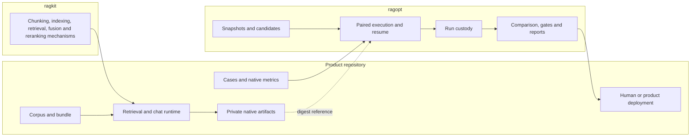
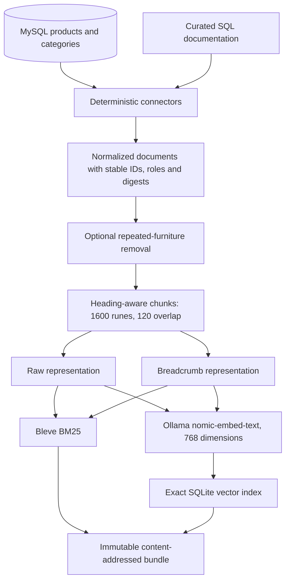
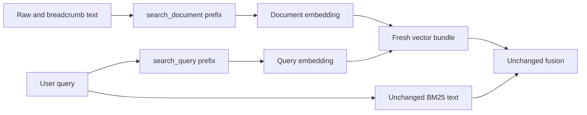

# RAGOPT and GEC-RAG Evaluation: Building an Evidence-Gated Self-Optimization System

This report reconstructs the implementation of `ragopt`, its first two product integrations, and the broader GEC retrieval-evaluation program that now supplies its next experiment. The work began with a specific concern: the GEC retrieval optimizer could execute plausible changes, but it did not yet enforce the immutable identity, paired measurement, failure retention, and promotion custody that had been proved in the earlier `rag-ttc` and `researchctl` work. The result is a small generic harness plus a product-owned evaluation system. The harness is implemented. The RAG-TTC proof has reproduced. The first GEC candidate was correctly rejected. The independently reviewed 80-case GEC retrieval baseline is complete. Candidate-pool diagnosis is now implemented and awaits its first frozen 80-case execution.

> [!summary]
> - `ragopt` now implements immutable run custody, strict one-mutation candidates, resumable paired evaluation, deterministic comparisons, lexicographic product-defined gates, and non-applying promotion reports.
> - The RAG-TTC I5 search-description candidate was run twice from fresh roots. Model behavior changed, but identities, cell custody, gate ordering, and the final rejection reproduced.
> - The first GEC source-role-description candidate completed six production-shaped cells within its approved budget and was rejected for lower relevance, lower source-role match, and a faithfulness-floor breach.
> - GEC retrieval evaluation was upgraded from any-document hit semantics to strict required-document groups, expanded to 80 independently reviewed cases, and used to measure a real lexical-versus-hybrid/no-rerank baseline.
> - Hybrid retrieval improved positive completeness from 41/68 to 48/68, but completed only 5/12 multi-document cases and increased mean latency from 54.8 ms to 1,993.7 ms. The implemented diagnostic will locate each missing evidence group at lexical, vector, fused, and authorized depths 5/10/20/40 before one candidate is selected.

## 1. The engineering problem

A retrieval experiment is not reproducible merely because it prints a score. A promotion claim requires a complete answer to five questions:

1. What exact incumbent and challenger were compared?
2. Which single semantic asset changed?
3. Did both arms execute the same cases and repeat coordinates?
4. Were failures, invalid answers, and missing judge results retained in the denominator?
5. Which explicit policy converted paired evidence into a pass or rejection?

The earlier GEC optimization command had real retrieval mechanisms and useful benchmark output, but its control plane was still distributed across imperative command branches, mutable configuration, small reused datasets, and partially observed judge outcomes. It could run a sweep without producing an immutable candidate or a self-contained run directory that bound corpus, index, suite, models, prompts, safety ceilings, evaluator, and policy together. That deficiency was especially important because the word *self-optimization* had been used for work that was partly design and partly implementation. The first RAGOPT design therefore established an evidence vocabulary with four explicit states:

| State | Required evidence |
| --- | --- |
| Implemented and exercised | Source and tests exist, and the mechanism has been used in a real experiment. |
| Implemented, product-specific | Source exists and worked, but its types or semantics belong to one product. |
| Designed only | A design or task exists without implementation evidence. |
| Deferred | The feature was intentionally excluded pending stronger evidence. |

This distinction changed the implementation sequence. The project did not begin with an autonomous candidate generator, transcript warehouse, general workflow engine, or deployment controller. It began by extracting mechanisms that already worked in `rag-ttc` and `researchctl`.

## 2. Provenance: what was reused and what was not

The implementation lineage comes from three systems.

### 2.1 RAG-TTC supplied the experiment mechanics

The clean-slate `rag-ttc` repository already separated domain capabilities from execution and artifact custody. Its relevant properties were:

- an immutable filesystem run ledger;
- copied inputs with SHA-256 and byte sizes;
- atomic JSON writes and append-plus-`fsync` JSONL results;
- explicit terminal completion and failure;
- strict semantic configuration identities;
- a small native-arm outcome projection pointing to richer product artifacts;
- cache-first expensive-work recovery;
- fixed suites and paired, per-query evidence.

The broader architecture remains documented in [[rag-ttc]] and [[ARTICLE - rag-ttc - Architecture of a Reproducible Go RAG Evaluation System]]. RAGOPT did not copy the entire RAG toolbox. Chunking, representations, BM25, vector search, fusion, answer generation, citations, and judge semantics remain outside the generic harness.

### 2.2 researchctl supplied explicit plan and recovery semantics

`researchctl` demonstrated canonical plan identities, replicate coordinates, terminal-work resume, and refusal to guess about recovery from active work. Its laboratory database, process runner, generalized domain registry, retry attempts, concurrent scheduler, and observation store were intentionally not copied. The narrower rules retained by RAGOPT are:

- canonicalize before scheduling;
- include repeat index in identity;
- persist every completed coordinate;
- distinguish active and terminal state;
- require an explicit single-writer resume;
- keep failures in the result set.

### 2.3 GEC supplied the product pressure

GEC demonstrated why the extracted harness was necessary. It already had a real hybrid knowledge bundle, a three-tool Admin Chat, answer generation, a decomposed LLM judge, caching, and benchmarked retrieval candidates. It also exposed weaknesses that a generic harness cannot repair by itself:

- authorization and answer-contract semantics belong to the product;
- SQL-only success cannot be judged through a knowledge-source-role metric;
- a role-correct search can still retrieve incomplete evidence;
- a contract validator can label malformed or unresolved citations valid;
- aggregate benchmark gains can hide case-level regressions;
- an exclusive Bleve lock affects experiment operations without changing retrieval semantics.

The resulting design is a strict ownership boundary, not an attempt to unify every RAG implementation.



The product defines meaning. `ragkit` may supply reusable RAG mechanisms. `ragopt` defines experimental custody. Deployment remains a separate authority.

## 3. What self-optimization means in this project

The implemented system supports an evidence loop:

```text
diagnose -> propose -> freeze -> evaluate -> compare -> gate -> review -> promote or reject
```

RAGOPT v1 owns `freeze`, `evaluate`, `compare`, and `gate`. Diagnosis and proposal are currently human-directed and product-specific. Promotion is a reviewable plan followed by an explicit action outside RAGOPT. The system is therefore capable of using recorded failures to direct the next candidate without granting a running chatbot authority to rewrite or deploy itself.

The one-mutation rule is literal. If a candidate changes an embedding transform, an RRF weight, and a document-diversity policy together, a positive result cannot be attributed to one cause. Candidate validation therefore compares complete parent and child snapshots and rejects any candidate that changes zero or more than one mutable asset.

## 4. RAGOPT architecture

The current repository is `/home/manuel/code/wesen/go-go-golems/ragopt`. Its generic implementation is concentrated in six packages:

| Package | Responsibility | Principal API |
| --- | --- | --- |
| `pkg/runstore` | Durable active/terminal run directories and copied inputs | `Create`, `Resume`, `Open`, `AppendJSONL`, `Complete`, `Fail` |
| `pkg/candidate` | Strict snapshots and exactly-one-mutation bundles | `LoadCandidate`, `Mutation`, `Candidate` |
| `pkg/eval` | Suites, product arms, durable cells, deterministic schedule, resume | `Arm`, `RunRequest`, `Run`, `Resume` |
| `pkg/compare` | Exact incumbent/challenger joins and numeric deltas | `Build` |
| `pkg/gate` | Strict product-authored policy and lexicographic decision | `LoadPolicy`, `Evaluate` |
| `pkg/report` | Markdown review and non-applying promotion plan | report rendering/writing functions |

The command layer currently exposes artifact-oriented Glazed commands for candidate validation, comparison, and reporting under `cmd/ragopt/commands`. It does not attempt to launch arbitrary product runtimes through a plugin or subprocess protocol.

### 4.1 The run store

`pkg/runstore/types.go:20` defines creation options, `:28` defines copied input identity, and `:45` defines the manifest. `pkg/runstore/run.go:63` implements `Create`; `:35` implements explicit resume. `pkg/runstore/read.go:24` strictly opens an existing run.

Every run begins in `active` state and becomes either `complete` or `failed`. A terminal run rejects subsequent writes. The directory contains canonical configuration, manifest, status, copied inputs, result artifacts, and product-native files:

```text
runs/<run-id>/
├── config.json
├── manifest.json
├── status.json
├── inputs/
│   ├── manifest.json
│   └── <copied immutable inputs>
├── results/
│   └── cells.jsonl
└── native/
    ├── incumbent/
    └── challenger/
```

The durability boundary is one successful `AppendJSONL` call. The method writes one encoded record, appends a newline, and calls `fsync` before returning. This supports recovery after interruption without claiming that in-progress provider work can be resumed. Resume validates the stored canonical configuration digest and requires the caller to ensure that the old writer has stopped.

```text
Create(config):
    canonical = CanonicalJSON(config)
    run_id = timestamp + safe_name + random_suffix
    write config, manifest and active status atomically

AppendCell(cell):
    validate path remains inside run directory
    append JSON line
    fsync file

Resume(directory, expected_config):
    strict_open(directory)
    require state == active
    require digest(expected_config) == manifest.config_digest
    return single active writer
```

The repository commit that introduced this layer is `9f1ccb4` (`feat(runstore): add durable run lifecycle`). The package tests cover path escape, terminal writes, interrupted JSONL, duplicate completion, copied inputs, and stable configuration digests.

### 4.2 Snapshots and candidate bundles

`pkg/candidate/types.go:63` defines `CandidateManifest`; `:74` defines the independently computed `Mutation`; `:83` defines a fully loaded candidate. `pkg/candidate/candidate.go:14` is the strict load entry point.

A snapshot contains:

- a product system name;
- locked assets such as suites, judge prompts, authorization policy, and evaluator inputs;
- mutable assets eligible for isolated replacement;
- semantic scalar dimensions such as corpus digest, index digest, model, and evaluator version;
- a canonical snapshot digest.

A candidate bundle contains complete replacement bytes rather than a patch:

```text
candidate/
├── candidate.yaml
├── parent/snapshot.yaml
├── candidate/snapshot.yaml
├── candidate/assets/<replacement>
└── provenance/<diagnostic references>
```

Validation rejects unknown YAML fields, multiple YAML documents, unsafe paths, symlink escapes, missing files, size or digest mismatches, locked-asset changes, dimension changes, mutable-asset-set changes, and any mutation count other than one. It also requires a proposer identity, hypothesis, expected target, and regression risks.

```text
ValidateCandidate(bundle):
    manifest = strict_decode(candidate.yaml)
    parent = strict_load(parent snapshot and bytes)
    child = strict_load(child snapshot and bytes)

    require parent.system == child.system
    require parent.locked_assets == child.locked_assets
    require parent.dimensions == child.dimensions
    require names(parent.mutable_assets) == names(child.mutable_assets)

    changed = byte_differences(parent.mutable_assets, child.mutable_assets)
    require len(changed) == 1
    require changed[0].name == manifest.mutation.asset
    return immutable resolved candidate
```

This layer landed in commit `d2329dd` (`feat(candidate): validate one-mutation bundles`).

### 4.3 The paired evaluation runner

`pkg/eval/types.go:19` defines an ordered `Suite`; `:54` defines the common `Outcome`; `:69` defines a durable `Cell`; `:113` defines the `Arm` interface; and `:119` defines `RunRequest`. `pkg/eval/runner.go:57` starts a new run and `:85` resumes one.

The product implements only this runtime boundary:

```go
type Arm interface {
    Name() string
    Run(context.Context, Request) (Outcome, error)
}
```

The suite input remains opaque JSON to RAGOPT. The common outcome contains completion, contract validity, abstention, a typed failure, finite numeric metrics, provider/tool/token counts, duration, and a digest-linked native artifact. Product-specific statements, SQL rows, retrieval traces, citations, and answer payloads remain in the native artifact.

The deterministic v1 schedule is:

```text
for case in suite order:
    for repeat in ascending order:
        run incumbent
        append and fsync incumbent cell
        run challenger
        append and fsync challenger cell
```

Interleaving arms per case limits temporal drift. A product arm error becomes a durable failed cell when a native failure artifact can be recorded. Identity or custody errors abort the run because subsequent records would be untrustworthy. Resume loads complete cell keys and skips them; it rejects any suite, policy, candidate, snapshot, arm, or repeat mismatch.

The full cell identity is:

```text
(suite digest,
 policy byte digest,
 candidate ID and digest,
 snapshot digest,
 case ID,
 repeat index,
 arm name)
```

The runner implementation landed in commit `0802670` (`feat(eval): add resumable paired runner`). Tests prove interruption/resume equivalence against uninterrupted scripted arms after canonical sorting.

### 4.4 Comparison and lexicographic gates

`pkg/compare/build.go:22` constructs a strict report. `pkg/compare/types.go:84` defines its full projection. It joins cells by case and repeat, rejects conflicting duplicates and cross-identity inputs, preserves missing pairs explicitly, and computes metric deltas only when both values exist. Missing is never replaced with zero.

`pkg/gate/policy.go:44` defines the product-authored `Policy`. `pkg/gate/evaluate.go:41` evaluates it without I/O or provider calls. Evaluation stops after the first failing phase:

```text
identity
    -> complete pairing and exact copied policy bytes
hard gates
    -> completion, contract validity, failure rate, metric floors
target
    -> declared metric, groups, minimum mean delta, repeat rule
regressions
    -> per-case and aggregate lower bounds
tie-breakers
    -> provider calls, tool calls, tokens and duration
```

This ordering prevents a relevance gain or cost reduction from compensating for an authorization failure, invalid answer contract, missing metrics, or catastrophic faithfulness regression. RAGOPT ships mechanics but no universal RAG thresholds. Every product supplies its own metric names and limits.

The comparison/gate/report phase landed in commit `7fc1a98` (`feat(gates): add paired decisions and promotion reports`). Golden tests cover pass, hard failure, target failure, catastrophic regression, tie breaking, and incomplete pairing.

### 4.5 Reports do not deploy

A passing evaluation produces a Markdown report and a machine-readable promotion plan. The plan describes exact identities, the changed asset, the decision, and the requirement for human application. It contains no code that modifies production configuration. A rejected candidate is retained with all reasons and artifacts.

## 5. First proof: RAG-TTC I5

The first product integration tested a human-authored replacement of the TTC `search_description`. The candidate hypothesized that requiring both comparison subjects and requested attributes in the first search would reduce follow-up work without degrading answer quality. Corpus, index, feedback suite, answer model, judge, prompts, safety ceilings, evaluator, and policy were locked.

### 5.1 The first run found an adapter bias

An initial attempt allowed only one query embedding although the product's real maximum was three searches. That artificial limit produced five abstentions and favored the combined-query challenger. The result was excluded. RAG-TTC commit `90485d8` corrected the budget and separated product cost from judge overhead. This event is important because the harness did not make a biased adapter acceptable; the product integration had to match the real runtime before the evidence could be used.

### 5.2 Corrected run one rejected the candidate

The corrected run recorded six of six cells for three feedback cases. One incumbent arm failed at the four-iteration ceiling. The candidate produced only one contract-valid answer; the other two outcomes were invalid abstentions. The hard contract-validity and faithfulness-coverage gates failed. Validation remained closed.

### 5.3 Fresh-root run two reproduced the decision

The second run used byte-identical configuration and the same suite, policy, candidate, snapshots, source description digests, and ceilings. It consumed:

| Resource | Used | Ceiling |
| --- | ---: | ---: |
| Answer generations | 22 | 24 |
| Search embeddings | 17 | 18 |
| Judge generations | 8 | 12 |
| Provider tokens | 108,548 | 1,000,000 |

Two pairs were fully judged. Candidate relevance tied the incumbent at 1.0, but candidate faithfulness averaged 0.947222 against 0.989362, a mean delta of -0.042139. The third candidate result was an invalid abstention and the corresponding incumbent hit an arm error. The decision remained `fail`.

The correct reproducibility claim is semantic rather than byte-identical model output:

- the same identities yielded the same expected coordinates;
- all six coordinates were retained in each run;
- all three pairs were complete in each run;
- stochastic cell behavior was visible in native artifacts;
- invalid and failed cells were not dropped;
- the same policy produced the same final rejection;
- validation was not run.

This completed the RAG-TTC integration proof while leaving the I5 candidate rejected.

## 6. The GEC system under evaluation

The GEC target is the CoinVault Admin/Analyst chatbot. It answers backend commerce and logistics questions using durable product/catalog knowledge and live relational facts. It is not the TTC customer-facing Garden Assistant.

### 6.1 Offline knowledge construction

The current build starts from active MySQL products and categories plus repository-curated SQL documentation:



`internal/knowledgebuild/connectors.go` owns product, category/guide, and curated SQL extraction. Product IDs are stable values such as `gec:product:123`; category guides use category IDs; curated documentation uses schema-document IDs. The source role is one of `product`, `guide`, or `schema_doc`.

Prices, costs, and inventory quantities are deliberately excluded from the vector corpus because they are volatile operational facts. They remain live SQL data. This creates a required evidence split:

```text
durable descriptive fact -> immutable knowledge bundle
current operational fact  -> bounded read-only SQL
```

The frozen hybrid bundle used in the baseline contains 16,032 documents, 44,175 chunks, and 88,350 raw/breadcrumb representations. Repeated builds reuse cached embeddings for unchanged representation text.

### 6.2 Retrieval pipeline

`internal/knowledge/service.go:200` is the public `Search` boundary. `:268` chooses lexical-only or hybrid retrieval. `:306` performs lexical ranking; `:324` performs vector ranking.

The runtime performs:

```text
query
  -> lexical BM25 over raw and breadcrumb representations
  -> vector query embedding and exact vector ranking
  -> collapse representations to one hit per chunk
  -> weighted reciprocal-rank fusion, k=60, vector weight=1.0
  -> optional reranker, disabled in the measured incumbent
  -> access-scope and source-role filtering
  -> final top-k chunk results
```

Representation collapse prevents the raw and breadcrumb forms of one chunk from occupying two final positions. It does not enforce document diversity. Several chunks from one broad document may still consume the final result budget.

### 6.3 Online Admin Chat

The `analyst-rag` profile exposes three tools:

| Tool | Responsibility |
| --- | --- |
| `sql_doc` | Discover tables, columns, relationships, and curated analyst guidance. |
| `sql_query` | Execute bounded read-only SQL for current operational facts. |
| `knowledge_search` | Retrieve durable product, guide, and schema-document evidence. |

The product composes these tools through the shared Geppetto tool loop. `ragkit` supplies retrieval mechanisms; it does not supply the chat loop. Product prompts, tool descriptions, authorization, evidence admission, final-answer protocol, and UI projections remain GEC-owned.

Authorized knowledge results enter a run-scoped evidence ledger and receive stable citation IDs such as `[E1]`. The final projection resolves cited IDs against admitted evidence. The current investigation found that projection errors were observable but not always consumed by the evaluation adapter as answer-contract failures.

### 6.4 Decomposed judge

The GEC native judge first extracts factual statements from an answer. A second provider call evaluates each statement against admitted knowledge chunks and bounded SQL evidence and also scores relevance. Faithfulness is computed, not prompted:

```text
faithfulness = supported factual statements / factual statements
```

The first GEC proof exposed a retention weakness: the common artifact kept aggregate faithfulness and relevance but did not yet preserve every statement, verdict, supporting evidence ID, and reason in the native outcome. That work belongs to the planned `gec-chat-eval-case/v2` evaluator.

## 7. First GEC RAGOPT proof

Before using GEC evidence for promotion, the isolated product branch repaired authorization and judge-accounting P0 findings. It then froze a six-cell, three-case feedback experiment over a source-role-description candidate. The only changed asset was the complete model-facing `knowledge_search` description.

### 7.1 Candidate hypothesis

The challenger told the model to choose:

- `schema_doc` for schema semantics;
- `product` for exact catalog items and facets;
- `guide` for explanations, history, terminology, and comparisons.

It did not change the tool schema, corpus, index, search implementation, embeddings, fusion, prompts, SQL policy, judge, loop, or gate.

### 7.2 Execution and budget

The product proof used the real local CoinVault session composition, Geppetto v0.13.7 tool loop, actual SQL and knowledge tools, answer provider, and decomposed judge. It completed all six cells in 137.140 seconds:

| Resource | Observed | Ceiling |
| --- | ---: | ---: |
| Answer-provider calls | 19 | 24 |
| Query-embedding requests | 4 | 18 |
| Judge-provider calls | 12 | 12 |
| Answer tokens | 192,407 | 500,000 |

All six cells completed, were contract-valid according to the then-current adapter, did not abstain, and did not fail. Native artifacts remained private because they contained answer, SQL, and business-context data. RAGOPT retained only their paths, sizes, digests, and common metrics.

### 7.3 Result

| Metric | Incumbent | Challenger | Delta |
| --- | ---: | ---: | ---: |
| Answer relevance | 0.953333 | 0.866667 | -0.086667 |
| Faithfulness | 0.862745 | 0.800000 | -0.062745 |
| Source-role match | 0.666667 | 0.333333 | -0.333333 |

The first failed hard gate was a minimum candidate faithfulness of 0.45 against a required floor of 0.80. The candidate was rejected and validation was not run.

### 7.4 Why the source-role hypothesis failed

The three cases separated three failure modes.

1. `orders-table` was answered through `sql_doc` and `sql_query` by both arms. Since neither arm invoked `knowledge_search`, its description could not influence the route. The expected knowledge role incorrectly treated correct SQL behavior as a role failure.
2. `facet-sf-eagle-2011` used SQL to establish the exact product. The challenger then requested only guide evidence for grading context. This was reasonable conditional planning but contradicted a coarse case-level expectation that knowledge retrieval must use the `product` role.
3. `compare-morgan-peace` followed the new guide-only routing instruction but retrieved insufficient complementary evidence. The model filled missing dates, designers, iconography, and history from model memory. Faithfulness fell from 11/17 supported statements, approximately 0.647, to 9/20, or 0.45.

The conclusion is not that source roles are useless. The conclusion is that a prose description is a weak control for probabilistic planning, and `source_role_match` is not a sufficient measure of final route correctness. Tool routing, knowledge role, document coverage, citation resolution, and final grounding must be measured separately.

The harness proof passed: identities, one mutation, production execution, budgets, cells, comparison, and rejection were all valid. The product candidate failed. A second identical GEC execution has not yet completed, so the RAGOPT Phase 5 GEC reproducibility task remains open.

## 8. Why the evaluation corpus had to grow

The source-role proof used only three cases, six cells. That was sufficient to prove the integration boundary and reject one candidate under its frozen policy. It was not sufficient to diagnose the GEC retrieval system or guide broad optimization.

The new `GEC-RAG-EVAL-001` ticket therefore separated retrieval evaluation from final-chat evaluation and rebuilt the retrieval corpus first. The implementation is on branch `codex/gec-rag-eval-001` in `/tmp/gec-rag-eval-001`.

### 8.1 Retrieval schema v3

`internal/knowledge/eval.go:28` defines `ExpectedDocumentGroup`; `:36` defines each question; `:54` strictly loads version 3; `:180` defines per-question results; `:203` defines summaries; and `:234` runs a route.

The central semantic change is required evidence groups. Documents within one group are alternatives. Separate groups are complementary requirements:

```yaml
expected_document_groups:
  - id: morgan
    any_of: [gec:category:69]
  - id: peace
    any_of: [gec:category:70]
```

For each group, the evaluator records satisfaction, first rank, and matched document. It then computes:

```text
coverage = satisfied groups / required groups
complete = every required group is satisfied
first relevant rank = best rank across any satisfied group
MRR = 1 / first relevant rank, else 0
```

MRR and completeness intentionally answer different questions. A comparison may have MRR 1.0 because one required side ranks first while still being incomplete because the second side is absent.

The loader rejects unknown fields, multiple YAML documents, duplicate case IDs, empty groups, mixed positive/negative/judge-only modes, duplicate expected IDs, and invalid access scopes. Positive completeness and authorization-negative pass rate use separate denominators. Query failures remain visible and count as misses.

### 8.2 Corpus shape and review

All 60 previous questions were migrated without changing intended evidence. Twenty new cases were authored from immutable corpus evidence:

- six complementary multi-document comparisons;
- four jargon/paraphrase cases;
- four exact product/facet cases;
- two schema paraphrases;
- two document-concentration probes;
- two authorization negatives.

The new expected document IDs were independently reviewed before retrieval output was opened. Nine were accepted as authored and eleven were revised before the suite was frozen. The resulting suite contains:

| Mode | Count |
| --- | ---: |
| Positive retrieval questions | 68 |
| Authorization-negative questions | 6 |
| Judge-only questions, skipped by retrieval | 6 |
| Total | 80 |

The frozen suite digest is `5c21fcb5cb4982605b9fba0ac214aea643929ec23270a4741ef72dd31dae7667`.

## 9. The measured 80-case incumbent baseline

The baseline compared two routes over the same immutable bundle:

- lexical Bleve BM25;
- hybrid BM25 plus exact vector search and weighted RRF, with reranking and synonyms disabled.

The bundle ID was `rk-55be57b45fc6d624d0341c8ec6965f49`. Because the live Admin Chat process held Bleve's Bolt database open exclusively, the evaluator did not stop production-shaped chat. It copied the corpus and bundle into a private snapshot, hash-verified all 20 bundle files and the sibling corpus, and opened the copy. This changed lock ownership while preserving bytes.

Ollama on `mimimi-2.local` supplied query embeddings through a tmux-managed SSH tunnel. One transport probe plus 74 hybrid queries produced 75 local embedding calls and zero answer or judge calls.

### 9.1 Aggregate result

| Metric | Lexical | Hybrid/no-rerank | Delta |
| --- | ---: | ---: | ---: |
| Positive complete hits | 41/68 | 48/68 | +7 |
| Complete-hit rate | 60.29% | 70.59% | +10.29 percentage points |
| Mean required-group coverage | 63.97% | 75.00% | +11.03 percentage points |
| MRR | 0.6034 | 0.6998 | +0.0963 |
| Authorization-negative pass | 6/6 | 6/6 | equal |
| Query failure rate | 0% | 0% | equal |
| Mean unique documents at 5 | 3.250 | 3.765 | +0.515 |
| Mean maximum chunks per document at 5 | 2.544 | 2.088 | -0.456, better |
| Mean latency | 54.8 ms | 1,993.7 ms | 36.4 times slower |
| p95 latency | 142.2 ms | 2,778.7 ms | 19.5 times slower |

Hybrid improved 12 cases' coverage, regressed one, and left 55 unchanged. It completed eight cases that lexical missed and lost one lexical-only completion. Exact product/facet retrieval was already 14/14 under both routes and therefore needs protection rather than optimization.

### 9.2 Stratum results

| Stratum | Questions | Lexical complete | Hybrid complete | Interpretation |
| --- | ---: | ---: | ---: | --- |
| Facet/product | 14 | 14 | 14 | Already saturated; protect from regression. |
| Schema keyword | 6 | 4 | 6 | Hybrid repairs two cases. |
| Schema paraphrase | 2 | 0 | 1 | Still weak. |
| Guide keyword | 16 | 14 | 14 | Completion flat; hybrid MRR slightly lower. |
| Jargon/paraphrase | 4 | 2 | 2 | One gain cancels one regression. |
| Multi-document | 12 | 2 | 5 | Hybrid doubles group recall but remains incomplete. |
| General paraphrase | 12 | 3 | 4 | Major unresolved vocabulary/representation gap. |
| Document concentration | 2 | 2 | 2 | Completeness hides repeated-document occupancy. |
| Authorization negative | 6 | 6 pass | 6 pass | Safety boundary preserved. |

### 9.3 Multi-document failure

Hybrid satisfies 16 of 24 required comparison groups, twice lexical's eight, but completes only 5 of 12 questions. Seven comparisons remain incomplete. The failure is systematically one-sided: Gold Eagle/Buffalo retrieves only Buffalo; Gold/Silver bars retrieves only gold bars; Silver Eagle/Maple retrieves only Maple; Platinum Eagle/bars retrieves only bars; Silver rounds/bars retrieves only rounds; Pandas retrieves only silver.

Morgan/Peace is the canonical case:

```text
required:
  Morgan -> gec:category:69
  Peace  -> gec:category:70

lexical top-five document pattern:
  category:8, category:8, category:395, category:8, category:8

hybrid top-five document pattern:
  category:8, category:8, product:9567, category:8, product:4806
```

Neither focused guide appears. The broad combined guide `gec:category:8` consumes four lexical slots and three hybrid slots. Hybrid improves average diversity but does not satisfy the complementary evidence contract for this query.

### 9.4 Aggregate gates can hide swaps

`jargon-constitutional-silver` is the one lexical-only regression. Its accepted guide appears at lexical rank 5 and disappears under hybrid. The jargon stratum remains 50% complete only because hybrid gains `jargon-vintage-silver-ingots`. A promotion policy based only on total or stratum means would miss this protected-case regression.

The measured baseline therefore supports three statements:

1. Hybrid is the better incumbent on this suite.
2. Hybrid is not adequate for complementary multi-document evidence.
3. The next experiment cannot be selected solely from final top-five output.

## 10. Active cross-ticket work: candidate-pool diagnosis

The GEC and RAGOPT tickets now meet at a provider-light diagnostic boundary. GEC must explain why required documents missed. RAGOPT must later freeze and compare the selected mutation without learning GEC document semantics.

The cross-ticket design is committed as GEC commit `065e883` (`docs(eval): coordinate retrieval diagnosis and ragopt proof`) and cross-referenced from RAGOPT commit `6c1167c` (`docs(ragopt): link GEC diagnostic proof dependency`).

The candidate-pool implementation is committed at GEC revision `b647991` and its design/task/diary closure is committed at `74a3fcf`. It is implemented and tested, but it has not yet been exercised against the real 80-case bundle. The implementation adds:

- `internal/knowledge/candidate_pool.go`;
- `internal/knowledge/candidate_pool_test.go`;
- `--candidate-pool-depths` in `coinvault knowledge eval`;
- Glazed detail, diagnosis, summary, and failure rows;
- command-shape and numeric-projection tests.

The key APIs are:

| API | Current source location | Purpose |
| --- | --- | --- |
| `CandidatePoolRun` | `internal/knowledge/candidate_pool.go` | Bind results to schema, route, suite, corpus, bundle, depths, budget, and fusion identity. |
| `CandidatePoolDepthResult` | `internal/knowledge/candidate_pool.go` | Score one serving-depth projection. |
| `CandidatePoolStageResult` | `internal/knowledge/candidate_pool.go` | Preserve one stage and its depth projections. |
| `GroupDiagnosis` | `internal/knowledge/candidate_pool.go` | Record first ranks and a deterministic bounded failure class. |
| `CandidatePoolEvalResult` | `internal/knowledge/candidate_pool.go` | Preserve a private per-question trace and failures. |
| `CandidatePoolSummary` | `internal/knowledge/candidate_pool.go` | Produce stage/depth/all-and-stratum aggregates. |
| `RunCandidatePoolEval` | `internal/knowledge/candidate_pool.go` | Retrieve each raw channel once and score all depths. |
| `writeCandidatePoolRun` | `cmd/coinvault/cmds/knowledge.go` | Publish a digested, mode-0600, create-only private artifact. |

### 10.1 Execute once, score many depths

The diagnostic requests depths `5,10,20,40` and retrieves each raw representation channel exactly once at the maximum over-fetch depth. For every requested serving depth it takes that depth's raw prefix, collapses raw/breadcrumb representations to chunks, and then performs weighted reciprocal-rank fusion. It does not fuse once and merely truncate the maximum fused list: representation collapse and fusion must be replayed from each matching raw prefix to preserve serving semantics. This avoids four query embeddings per question and prevents transient latency differences from being confused with depth effects.

```text
for each positive question:
    max_depth = 40
    lexical_raw = lexical_search(query, max_depth * search_depth)
    vector_raw = vector_search(query, max_depth * search_depth)

    for depth in [5, 10, 20, 40]:
        lexical = collapse(lexical_raw[:depth * search_depth])
        vector = collapse(vector_raw[:depth * search_depth])
        fused = weighted_rrf(lexical, vector, k=60, vector_weight=1.0)
        authorized = filter_scopes_and_roles(fused, limit=depth)
        score required groups over each stage at depth
```

Judge-only and authorization-negative cases are not mixed into positive candidate-pool summaries. Existing negative scoring remains in the ordinary evaluator.

### 10.2 Failure classification

For every required evidence group, rank zero means absent within the maximum measured depth, not globally absent from the index. The current deterministic precedence is:

```text
authorized rank <= final depth
    -> admitted-at-final-depth
absent in lexical and vector
    -> absent-from-channels
present in a channel but absent from fused
    -> below-fused-measurement-cutoff
present fused but absent after authorization
    -> removed-by-scope-authorization
authorized rank beyond final depth with >2 dominant-document chunks
    -> below-result-budget-with-concentration
otherwise authorized beyond final depth
    -> below-result-budget
```

The concentration label is observational, not causal. It records that one
document occupies more than two measured positions while the required group is
below budget; it does not claim that a document cap would admit the missing
group without executing that counterfactual. Likewise,
`absent-from-channels` means absent from the maximum measured collapsed channel
lists. The v1 artifact does not expose individual raw-versus-breadcrumb
representation identities, so that class can trigger a narrower
representation-level investigation but cannot prove global index absence.

The diagnostic is explicitly `hybrid/no-rerank` and rejects ambient reranking
or synonym expansion. Independent review found a separate P0 production issue:
the optional reranker currently hydrates chunks before scope and role filtering.
No external reranker should receive candidate text until authorization is moved
ahead of provider submission or an equivalent boundary is proven.

This classification maps directly to candidate selection:

| Evidence | Candidate class |
| --- | --- |
| Required documents absent from vector@40 and the model transform is unverified | Nomic document/query prefix candidate. |
| Required documents present in authorized fused@10/20 but excluded at 5 with repeated broad-document chunks | Deterministic per-document cap candidate. |
| Documents present in channels but systematically lost in fusion | One RRF parameter candidate. |
| Documents absent from both channels despite useful corpus chunks | Query or representation investigation, not reranking. |
| Expected documents contain no supporting material | Corpus or expectation repair, not promotion. |

A reranker is not the immediate default. It can reorder only candidates it receives.

## 11. The Nomic prefix candidate remains a hypothesis

The GEC bundle uses Ollama `nomic-embed-text` at 768 dimensions for indexed raw/breadcrumb representations and runtime queries. The application currently passes raw text on both paths. Nomic's upstream retrieval instructions prescribe asymmetric task prefixes:

```text
indexed text = "search_document: " + representation
query text   = "search_query: " + query
```

This is a credible one-mutation candidate, not an established defect. Before selection, the team must record the installed Ollama digest and Modelfile and verify whether the server already transforms input. If selected, both document and query transforms must change together, BM25 must remain byte-identical, the vector bundle must be rebuilt, and the exact transform must enter bundle and embedding-cache identity.



Prefixing only the query against unprefixed stored vectors is not an admissible experiment. Combining prefixing with diversity, fusion, chunking, or reranking would also violate attribution.

## 12. Full-chat evaluation is a later product phase

Retrieval evaluation asks whether required documents were returned. It does not establish that the Admin Chat selected correct tools, admitted evidence, resolved citations, obeyed the answer contract, or generated supported statements.

The planned strict `gec-chat-eval-case/v2` schema will add:

- optional required admitted-evidence groups;
- expected abstention;
- projection errors and resolved citation IDs;
- a typed `AnswerContractReport`;
- recovered intermediate tool errors versus unresolved final failures;
- statement text, support verdict, evidence IDs, and reasons;
- separate relevance, faithfulness, citation, contract, route, and evidence-coverage metrics.

The broader full-chat suite is planned as 36 independently reviewed cases split before execution:

- 12 feedback cases for candidate iteration;
- 24 disjoint held-out validation cases;
- SQL schema discovery;
- current operational SQL;
- knowledge-only product and guide questions;
- mixed SQL plus knowledge;
- multi-document comparisons;
- jargon and entity ambiguity;
- abstention and insufficient evidence;
- authorization boundaries.

Validation remains closed until an unchanged candidate passes feedback twice. The canonical Admin Chat/sessionstream integration must also be coordinated with its owner so the proven RAG adapter is integrated without overwriting chat-server work.

## 13. Production index refresh: planned, not implemented

The current GEC build is deterministic and manually launched. Production still lacks a schedule, durable job ownership, progress registry, artifact publication, atomic activation, and rollback automation. RAGOPT's production-refresh design proposes a shared protocol for CoinVault/GEC, TTC Garden, and TTC Admin while leaving builders and deployment product-owned.


The pragmatic first GEC refresh remains a nightly full scan. At roughly 16,000 source documents, deterministic rebuild plus content-addressed embedding-cache reuse is simpler and safer than change-data capture. AWS Batch or River can own durable job execution. RAGOPT should eventually own semantic build identity, append-only progress events, acquire/resume semantics, artifact references, evaluation handoff, and a fixed snapshot/build/verify/evaluate/gate/plan coordinator. That work is RAGOPT Phase 7, after v0.1. It is not current implementation.

The proposed build identity excludes timestamps and execution metadata:

```text
build_id = SHA256(canonical JSON {
    source_snapshot_digest,
    curated_docs_digest,
    knowledge_manifest_digest,
    extractor_version,
    chunker_identity,
    representation_identity,
    embedding_provider,
    embedding_model,
    embedding_dimensions,
    container_image_digest
})
```

Retries reconstruct deterministic work and reuse completed content-addressed embedding results. A quality rejection is a successful execution with a negative product decision, not an infrastructure failure.

## 14. Failure chronology and what each failure changed

The diaries are valuable because the final architecture was shaped by operational and measurement failures, not only planned implementation.

| Sequence | Failure or stop | Resulting rule |
| ---: | --- | --- |
| 1 | The earlier self-optimization design was described more strongly than its implementation evidence supported. | Classify mechanisms as implemented, product-specific, designed, or deferred. |
| 2 | The first RAG-TTC adapter allowed one query embedding instead of the real maximum of three. | Freeze product-realistic budgets and discard biased runs. |
| 3 | Corrected RAG-TTC feedback produced invalid abstentions and an arm error. | Preserve invalid and failed cells; do not drop them from the gate. |
| 4 | The fresh-root RAG-TTC run produced different answers and metrics. | Define reproducibility as stable identity, coordinate custody, procedure, and explainable decision—not byte-identical stochastic text. |
| 5 | GEC authorization and judge accounting were not sufficient for promotion evidence. | Repair P0 product semantics before generic proof execution. |
| 6 | Provider-backed GEC execution crossed SQL and business-data boundaries. | Freeze explicit provider data-flow scope, budgets, and user consent before execution. |
| 7 | The GEC source-role candidate lost quality despite plausible instructions. | Keep routing diagnostics separate from evidence coverage and final-answer quality. |
| 8 | A schema answer emitted an unresolved citation projection error yet remained contract-valid. | Make projection and citation resolution part of the future answer contract. |
| 9 | The three-case suite could reject one candidate but could not characterize retrieval. | Build and independently review a broader 80-case retrieval corpus. |
| 10 | Independent review found 11 of 20 proposed expectations needed revision. | Freeze evidence expectations before opening candidate output. |
| 11 | The documented embedding endpoint was initially unavailable. | Stop before queries; verify topology and dimensions with a transport probe. |
| 12 | The real `knowledge eval` command did not expose assumed structured-output flags. | Test the actual Cobra command surface instead of relying on internal Glazed behavior. |
| 13 | The live Admin Chat held the Bleve Bolt file exclusively. | Use a byte-verified private corpus-plus-bundle snapshot; do not interrupt the live service. |
| 14 | Two baseline attempts stopped before query execution due to CLI and bundle gates. | Treat zero-call stops as successful custody behavior, not failed experiments. |
| 15 | Hybrid improved average diversity but still missed seven comparisons. | Measure each required group by channel and depth before selecting reranking or diversity. |

This chronology explains why the current next action is diagnostic rather than generative. The system has already shown that more model calls do not compensate for an unclear retrieval failure class.

## 15. Current status matrix

The following matrix is the most concise statement of what exists as of 2026-08-07.

| Area | Status | Evidence |
| --- | --- | --- |
| RAGOPT repository and contracts | Implemented | `fc3a703` through core commits; RAGOPT-001 design and references. |
| Immutable run store | Implemented and tested | `9f1ccb4`; `pkg/runstore`; package tests pass. |
| Strict one-mutation candidates | Implemented and tested | `d2329dd`; `pkg/candidate`; fixtures cover invalid bundles. |
| Resumable paired runner | Implemented and tested | `0802670`; interruption/resume equivalence test. |
| Comparison, gates, reports | Implemented and tested | `7fc1a98`; golden gate tests. |
| RAG-TTC product integration | Implemented and exercised twice | Two fresh-root I5 runs; stable rejection and custody. |
| GEC product adapter | Implemented on isolated branch | GEC candidate commit `e2d1997`; real six-cell run. |
| GEC source-role candidate | Exercised once and rejected | Run report `reference/09`; no validation. |
| Repeated GEC Phase 5 proof | Incomplete | One GEC run exists; the task requiring a second fresh root remains open. |
| GEC retrieval schema v3 | Implemented and tested | GEC commits `aff96a1`, `25052ed`, and related tests. |
| 80-case retrieval corpus | Implemented and independently reviewed | `80e5dbe`; 20/20 additions approved after revisions. |
| 80-case incumbent baseline | Executed and analyzed | `7b9472c`; lexical/hybrid results above. |
| Candidate-pool diagnostic design | Committed | GEC `065e883`; RAGOPT `6c1167c`. |
| Candidate-pool diagnostic code | Implemented and tested | GEC `b647991`; native schema, one-fetch depth replay, Glazed CLI, private artifact custody, and fixtures. |
| Real depths 5/10/20/40 diagnostic | Not run | Requires a recreated verified bundle/corpus snapshot and embedding tunnel. |
| Nomic prefix candidate | Designed only | Model/Modelfile inspection and fresh bundles remain open. |
| Document-diversity candidate | Proposed only | Must be selected by candidate-pool evidence. |
| Full-chat v2 evaluator and 12/24 suites | Planned | GEC-RAG-EVAL Phases 3–5 remain open. |
| RAGOPT CLI hardening/v0.1 | Planned | Phase 6 remains open. |
| Shared production refresh control plane | Designed only | RAGOPT Phase 7, post-v0.1. |

At the report snapshot, `go test ./pkg/...` passes in RAGOPT. GEC's complete `internal/knowledge` and `cmd/coinvault/cmds` packages pass, as do the repository hook's `go test ./cmd/... ./internal/...`, lint, vet, generation, and web build. Literal `go test ./...` remains red only because two historical `ttmp/.../scripts` directories each contain multiple standalone `main` programs in one Go package. This is repository test-pattern hygiene, not a production-package failure. None of these checks substitutes for exercising the diagnostic against the real bundle.

## 16. Next implementation sequence

The dependency order is now explicit.

### Phase A: candidate-pool diagnostics in GEC — complete

1. Deterministic stage/depth types, bounded classifiers, and identity-bearing native artifacts are implemented.
2. One lexical and one vector execution per positive query is enforced by fixtures.
3. Glazed `--candidate-pool-depths` and required private output custody are verified through the real Cobra command shape.
4. Channel-only hits, fusion cutoff, authorization removal, concentration, complementary groups, invalid depths, deep input ranks, and one-fetch semantics are tested.
5. Production packages and repository hooks pass; excluding historical ticket scripts from literal `go test ./...` remains a separate hygiene task.
6. Code and diary updates were committed separately as `b647991` and `74a3fcf`.

### Phase B: run the frozen 80-case diagnostic

1. Recreate a byte-verified private corpus and bundle snapshot.
2. Recreate the tmux-managed Ollama tunnel and verify model/dimensions.
3. Run depths 5, 10, 20, and 40 once for every positive case.
4. Preserve raw business-sensitive output under ignored ticket sources.
5. Review every incomplete required group and every protected case.
6. Publish only aggregate and sanitized evidence.

### Phase C: freeze exactly one candidate

Choose one of:

- asymmetric Nomic retrieval prefixes;
- a deterministic maximum chunks-per-document policy;
- one RRF parameter mutation;
- no candidate, if corpus or expectation repair is required.

Record hypothesis, expected improvement, risks, exact mutable asset, rejected alternatives, suite, bundle, policy, and evaluator identities before candidate execution.

### Phase D: retrieval gate before chat spending

The candidate must have:

- zero query failures;
- 100% authorization-negative pass rate;
- no exact-product or schema protected-case regression;
- no overall positive completeness or coverage regression;
- at least one reviewed multi-document completion gain;
- explicit latency and embedding-call reporting;
- a list of every case regression.

If it fails, reject it without answer or judge calls.

### Phase E: complete the RAGOPT GEC proof

If the candidate passes retrieval, bind the frozen product adapter, feedback suite, answer/judge profiles, prompts, tool contract, authorization, and budgets through RAGOPT. Run fresh root A, compare and gate, and repeat unchanged from fresh root B only when the protocol requires it. A stable rejection is a valid proof result. Validation remains closed unless both feedback executions pass.

### Phase F: truthful full-chat evaluation

Only after retrieval adequacy should GEC complete the native answer-contract and statement-evidence work, freeze the 12/24 suites, integrate the canonical Admin Chat adapter, and spend provider calls on paired feedback.

### Phase G: harden RAGOPT v0.1

RAGOPT still needs:

- unambiguous byte-digest versus semantic-digest field names;
- `ragopt run inspect`;
- consistent Glazed table/JSON/YAML output;
- Glazed `--log-level` and zerolog wiring;
- corruption diagnostics;
- schema/API documentation and a scripted fixture;
- full build, test, lint, logcopter, and security checks;
- a v0.1 tag only after both consumer proofs satisfy their exit criteria.

## 17. Reading path for a new engineer

Read the systems in dependency order.

### RAGOPT

1. `ttmp/2026/08/06/RAGOPT-001--reusable-reproducible-self-optimization-harness/design-doc/01-ragopt-intern-guide-to-a-reusable-evidence-gated-optimization-harness.md`
2. `pkg/runstore/types.go`, `run.go`, `read.go`, and tests
3. `pkg/candidate/types.go`, `candidate.go`, `snapshot.go`, and tests
4. `pkg/eval/types.go`, `runner.go`, `resume.go`, and tests
5. `pkg/compare/build.go` and `types.go`
6. `pkg/gate/policy.go`, `evaluate.go`, and golden tests
7. `pkg/report`
8. RAGOPT references 06, 08, 09, and 10 for the TTC and GEC proof chronology

### GEC build and retrieval

1. `internal/knowledgebuild/connectors.go`
2. `internal/knowledgebuild/build.go`
3. `data/knowledge-manifest-hybrid.yaml`
4. `internal/knowledge/service.go`
5. `internal/knowledge/tool.go` and `evidence.go`
6. `internal/knowledge/eval.go`
7. `data/knowledge-eval.yaml`
8. `internal/knowledge/candidate_pool.go`

### GEC chat and evaluation

1. `internal/webchat/runtime_prompts.go`
2. `internal/webchat/coinvault_projection_feature.go`
3. `internal/knowledge/judge.go`
4. the product-owned `knowledge_ragopt.go` and trace adapter on the isolated proof branch
5. `GEC-RAG-EVAL-001/reference/05-incumbent-retrieval-baseline-results-and-failure-analysis.md`
6. `GEC-RAG-EVAL-001/design-doc/02-cross-ticket-retrieval-diagnosis-candidate-selection-and-ragopt-proof-plan.md`

## 18. Working rules preserved by the project

- Freeze the suite and expectations before opening candidate results.
- Change one semantic asset per candidate.
- Treat source bytes and canonical semantic identity as distinct useful digests.
- Preserve every cell, including arm errors, invalid contracts, abstentions, and missing metrics.
- Pair by case and repeat before computing aggregate deltas.
- Evaluate hard invariants before target improvement and cost.
- Keep native product artifacts authoritative and private; RAGOPT stores verified references.
- Diagnose retrieval before paying for answer generation and judging.
- Do not use MRR as evidence of complete multi-document coverage.
- Do not call representation-to-chunk collapse document diversity.
- Do not infer reranker value until the required documents are present in its candidate pool.
- Keep validation hidden until feedback passes under an unchanged policy.
- Produce an activation plan; do not let the experiment harness deploy.
- Generalize mechanisms only after a second product demonstrates the same need.

## 19. Related vault notes

- [[rag-ttc]] — the project knowledge map for the clean-slate TTC RAG laboratory.
- [[ARTICLE - rag-ttc - Architecture of a Reproducible Go RAG Evaluation System]] — the typed RAG, execution, and custody foundations from which RAGOPT extracted its narrow core.
- [[PROJ - CoinVault GEC-RAG - Benchmark-Gated Retrieval Optimization and the LLM Judge]] — the prior 60-case GEC optimization campaign, including reranker and judge findings.
- [[PROJ - CoinVault GEC-RAG - ragkit Extraction and knowledge_search Integration]] — the GEC corpus, bundle, retrieval, and tool integration.
- [[ARTICLE - RAG Evaluation and LLM Judges - Behavioral Benchmarks, Judged Metrics, and Judge Reliability]] — judge and benchmark semantics.
- [[ARTICLE - Retrieval Models - Lexical, Vector, and Hybrid Retrieval in RAG Systems]] — channel and fusion fundamentals.
- [[ARTICLE - Reproducibility Engineering - Digests, Caches, Budgets, and Provenance]] — the general identity and expensive-work discipline.

## 20. Source and commit reference

### RAGOPT implementation commits

```text
9f1ccb4  feat(runstore): add durable run lifecycle
d2329dd  feat(candidate): validate one-mutation bundles
0802670  feat(eval): add resumable paired runner
7fc1a98  feat(gates): add paired decisions and promotion reports
f50b311  docs(ticket): record corrected RAG-TTC proof rejection
95a3a81  docs(ticket): record reproduced TTC proof and mission board
88a9325  docs(ragopt): record first GEC proof rejection
de2a855  docs(ragopt): add GEC failure investigation guide
6c1167c  docs(ragopt): link GEC diagnostic proof dependency
```

### GEC evaluation commits

```text
aff96a1  feat(eval): add document-group retrieval scoring
f7560a1  test(eval): expand retrieval corpus to 80 cases
2f01b5f  feat(eval): record retrieval latency and failures
25052ed  feat(eval): expose group and chunk details
80e5dbe  test(eval): freeze independently reviewed corpus
7b9472c  docs(eval): report 80-case incumbent baseline
065e883  docs(eval): coordinate retrieval diagnosis and ragopt proof
b647991  feat(eval): trace hybrid candidate pools
74a3fcf  docs(eval): record candidate-pool implementation
```

### Ticket evidence

- RAGOPT ticket: `/home/manuel/code/wesen/go-go-golems/ragopt/ttmp/2026/08/06/RAGOPT-001--reusable-reproducible-self-optimization-harness`
- GEC evaluation ticket: `/tmp/gec-rag-eval-001/ttmp/2026/08/07/GEC-RAG-EVAL-001--broader-retrieval-and-full-chat-evaluation-corpus`
- RAG-TTC repository: `/home/manuel/workspaces/2026-06-30/benchmark-cpu-inference/rag-ttc`
- GEC proof branch/worktree recorded in the diary: `/tmp/gec-ragopt-phase5`, commit `e2d1997`

The raw GEC proof and baseline artifacts are intentionally not listed as vault assets. They contain business-sensitive answers, SQL-derived context, retrieval text, or judge inputs and remain in private ignored run locations.

## 21. Final assessment

The work completed so far establishes the missing experimental control plane. A candidate can no longer earn promotion from an aggregate score detached from its exact inputs, or improve by causing failures to disappear from the denominator. RAGOPT has been exercised against two real product adapters and has rejected both plausible text candidates. The RAG-TTC integration reproduced its decision from a fresh root. GEC demonstrated production-shaped execution but also showed that its first suite and route metric were too coarse for retrieval optimization.

The 80-case GEC baseline is the substantive correction. It converts the current problem from a vague claim that the RAG system “fails badly” into a measured set of failures: hybrid improves overall retrieval, exact products are already saturated, paraphrases remain weak, multi-document evidence is frequently one-sided, document concentration can consume the result budget, one jargon case regresses, and exact vector retrieval is expensive. The committed candidate-pool diagnostic is designed to decide whether those misses originate in channel recall, fusion, authorization, or final budget occupancy; its remaining proof obligation is the frozen real-bundle execution.

The next valuable result is not a more complex chatbot. It is a complete stage-and-depth account of every missing required evidence group, followed by one isolated product candidate and a reproducible RAGOPT decision. That sequence preserves the project's central engineering discipline: precise identity, minimal mutation, truthful evidence, explicit spending gates, retained negative results, and no production change without review.
