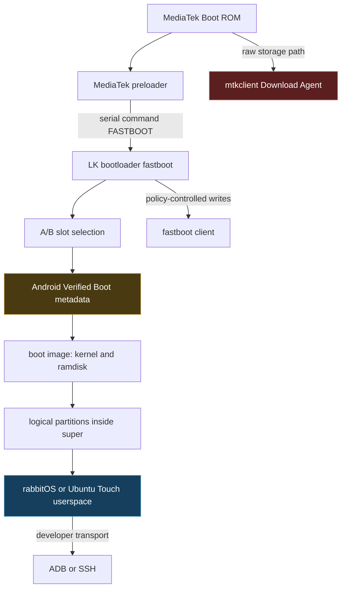
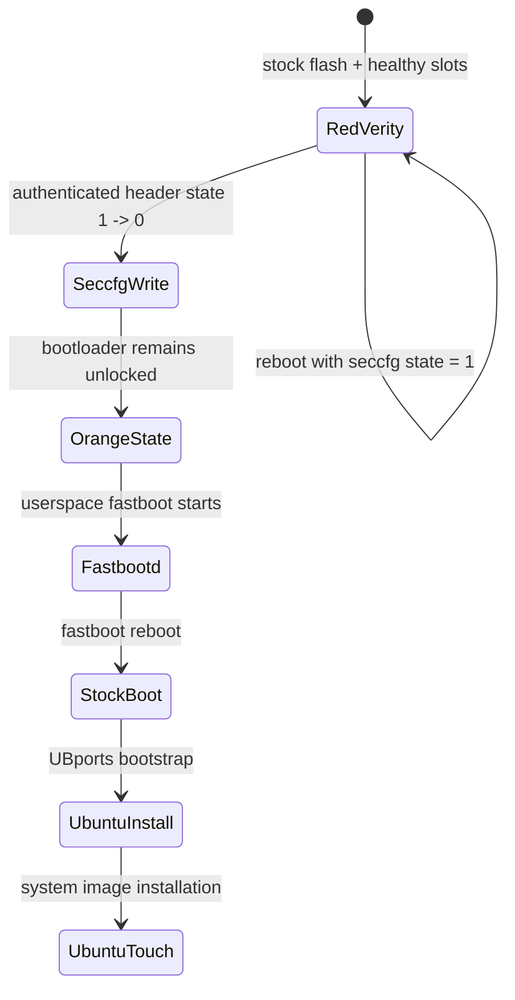

# Rabbit R1: From Persistent dm-verity Failure to Ubuntu Touch App Development

This report reconstructs a complete Rabbit R1 recovery and development session: preserving device-specific partitions, restoring rabbitOS v0.8.293, diagnosing an official WebUSB flasher that relocked the bootloader, repairing persistent MediaTek dm-verity state in `seccfg`, installing Ubuntu Touch, and deploying a QML application over Wi-Fi SSH when USB ADB proved unreliable. The emphasis is on the boot-state transitions, the evidence that justified each destructive operation, and the failure modes that changed the recovery plan.

> [!summary]
> - A coherent stock image set and healthy A/B metadata did not clear the red dm-verity screen. The remaining state was stored in the MediaTek `seccfg` partition: `lock_state=3`, a dm-verity-related word at offset `0x10` set to `1`, and a populated managed-verity record at `0x240:0x2c0`.
> - The corrected `seccfg` image retained the authenticated unlocked header, set the offset `0x10` word to `0`, cleared the managed-verity record, and changed no bytes outside those two regions. Writing that image replaced the red corruption screen with the expected orange unlocked warning and allowed the device to boot.
> - Ubuntu Touch application deployment was ultimately made reliable with Clickable over Wi-Fi SSH. The Rabbit R1 port exposes ADB and MTP only partially; normal Ubuntu Touch boots often produced no USB enumeration, while ADB appeared once during a charging/transition state.
> - The session succeeded because backups, hashes, read-back inspection, slot-state measurements, and stop conditions were established before raw MediaTek writes.

## 1. Scope and final state

The working directory for the recovery is:

```text
/home/manuel/code/others/rabbit-r1
```

At the end of the session, the device had reached the following state:

- Ubuntu Touch 20.04 booted successfully on the Rabbit R1.
- The bootloader remained unlocked, so the orange boot-state warning was expected.
- The persistent red dm-verity failure had been cleared through a reviewed `seccfg` correction.
- Device-specific persistent partitions had local, hashed backups.
- A minimal QML application had been built as an ARM64 Click package.
- The application was installed and launched through Clickable over Wi-Fi SSH.
- USB ADB remained unreliable across normal Ubuntu Touch boots.

The source tree contains the recovery artifacts, local reference documentation, and the example application:

```text
rabbit-r1/
├── apps/hello-world/
├── docs/
├── r1-backup/
├── r1_escape/
├── rabbit_OS_v0.8.293_20250516110545/
├── mtk-gpt.txt
├── post-stock-fastboot-state.txt
├── post-terminal-stock-state.txt
├── post-unlock-slot-state.txt
├── r1-build-seccfg-candidate.py
└── r1-terminal-stock-restore.sh
```

Hardware identifiers captured by tools are intentionally omitted from this report. MediaTek logs can expose the fastboot serial, ME ID, SoC ID, and storage identifiers; those values are not needed to explain the recovery.

## 2. The boot architecture that controlled the investigation

The Rabbit R1 uses a MediaTek MT6765-family platform and an Android A/B partition layout. The session crossed several execution environments, each with different authority over the device.



The distinction between these environments explains several observations that otherwise appear contradictory:

- `mtkclient` could read and write raw eMMC even when fastboot enforced lock policy.
- Sending `FASTBOOT` to the preloader did not itself unlock or flash anything; it only requested transition into LK fastboot.
- Fastboot could flash physical partitions such as `boot_a`, `vbmeta_a`, and `super`, but ADB required a running operating system or recovery.
- A bootloader unlock warning did not imply a dm-verity failure. Orange and red states represent different decisions in the Android boot flow.

The operational rule was therefore to identify the current USB and execution mode before interpreting any command result.

## 3. Starting evidence: firmware and recovery notes

The session began from a detailed local recovery document and an official stock archive:

```text
~/Downloads/rabbit-r1-boot-integrity-and-ubuntu-touch.md
~/Downloads/rabbit_OS_v0.8.293.zip
```

The stock archive was inspected before extraction. Its SHA-256 digest was:

```text
f6c28b221a91055ec5e44ab0ac0ee59c7e6b52fac12ad08f2bb23c8f0551c6c0
```

The archive contained a complete dynamic-partition image and the stock boot-chain payloads:

```text
boot.img
super.img
userdata.img
vbmeta.img
vbmeta_system.img
vbmeta_vendor.img
dtbo.img
lk.img
tee.img
md1img.img
spmfw.img
scp.img
sspm.img
gz.img
MT6765_Android_scatter.xml
MT6765_Android_scatter.txt
```

The distinction between `super.img` and `system.img` was central. `super.img` is the physical dynamic-partition container that carries metadata and logical partitions such as `system`, `vendor`, and `product`. A standalone Android GSI `system.img` is one logical filesystem image. The earlier `r1_escape` flow expected the latter, but no such image was present. Substituting `super.img` into a `fastboot flash system system.img` procedure would have targeted the wrong representation.

The firmware was extracted to:

```text
/home/manuel/code/others/rabbit-r1/rabbit_OS_v0.8.293_20250516110545
```

## 4. Preserving device-specific state before flashing

Raw MediaTek access can reach partitions that ordinary fastboot intentionally avoids. This access is useful for recovery, but it also makes destructive mistakes possible. The session therefore created read-only backups before further flashing.

A dedicated Python virtual environment under `r1_escape/.venv` avoided the common failure in which `sudo python3` selects the system interpreter rather than the interpreter containing `pyusb`, `pyserial`, and the `mtkclient` dependencies.

The partition table was captured with `mtkclient printgpt` and stored in:

```text
/home/manuel/code/others/rabbit-r1/mtk-gpt.txt
```

The GPT established exact names and sizes. The first backup pass preserved:

- `seccfg`, 8 MiB;
- `frp`, 1 MiB.

A second pass preserved calibration, identity, and persistent configuration data:

- `nvcfg`, 32 MiB;
- `nvdata`, 64 MiB;
- `nvram`, 64 MiB;
- `proinfo`, 3 MiB;
- `protect1`, 8 MiB;
- `protect2`, approximately 11 MiB.

The files were stored under:

```text
/home/manuel/code/others/rabbit-r1/r1-backup
```

Their hashes were recorded in `r1-backup/SHA256SUMS`. The backup workflow used separate tmux windows with commands entered but not submitted. This left connection timing under human control: each command was started first, then the powered-off Rabbit was connected when `mtkclient` requested preloader or BROM mode. Only one MediaTek operation ran at a time.

This phase was not optional bookkeeping. `nvram`, `nvdata`, `protect*`, and `proinfo` can contain radio identity, calibration, and provisioning data that a stock image archive cannot reconstruct.

## 5. Why the first stock restore did not produce a usable state

The initial recommendation was to use Rabbit’s official WebUSB flash page. The page paired with the MediaTek preloader, transitioned the device into fastboot, selected the fastboot interface, and then flashed the stock package.

After the flash, however, the red dm-verity screen remained. Fastboot diagnostics revealed an additional problem:

```text
unlocked: no
secure: yes
current-slot: b
slot-successful:a: no
slot-unbootable:a: yes
slot-retry-count:a: 0
slot-successful:b: no
slot-unbootable:b: no
slot-retry-count:b: 6
```

The device had been relocked, slot A was unbootable, and slot B had not yet completed a successful boot.

Inspection of the current WebUSB page source explained why. Its flashing sequence ended with:

```javascript
{ command: 'set_active', args: ['a'] },
{ command: 'lock', args:[] }
```

The implementation dispatched the lock entry as:

```javascript
await device.runCommand('flashing lock')
```

The same script also attempted `preloader_a` and `preloader_b`, even though the device GPT did not expose those partition names. This was a critical turning point in the investigation. The official page was useful for USB mode transitions and package discovery, but its current implementation did not preserve the recovery invariant that the bootloader must remain unlocked while modified or unverified states are under diagnosis.

The earlier advice to prefer the official flasher was therefore revised after source inspection and observed post-flash state. The session did not hide this correction: it became evidence that recovery procedures must be checked against the exact tool revision in use.

## 6. Restoring an unlocked and coherent A/B state

The bootloader reported an unusual unlock-ability value:

```text
unlock_ability = 16777216
```

Despite not being the ordinary textual `0` or `1`, the standardized unlock command succeeded. After confirming the unlock on-device, fastboot reported:

```text
unlocked: yes
current-slot: a
slot-unbootable:a: no
slot-retry-count:a: 6
slot-unbootable:b: no
slot-retry-count:b: 6
```

Selecting slot A reset its unbootable flag and retry count. Neither slot was yet marked successful because neither had completed a normal boot.

A reviewed terminal restore script, `r1-terminal-stock-restore.sh`, then wrote a coherent v0.8.293 image set while preserving persistent partitions. Its important properties were explicit:

- it required `fastboot getvar unlocked` to report `yes`;
- it refused to run without a fastboot device;
- it wrote stock vbmeta images without disable-verification rewriting;
- it mirrored the supplied boot-chain payloads to slots A and B;
- it wrote shared `logo`, `super`, and `userdata` images;
- it did not write preloader;
- it did not touch `seccfg`, FRP, NVRAM, NVData, `protect*`, or `proinfo`;
- it did not relock the bootloader.

The high-level operation was:

```text
erase userdata
for slot in a,b:
    flash vbmeta, vbmeta_system, vbmeta_vendor
    flash modem and auxiliary firmware
    flash lk, boot, dtbo, tee
flash logo
flash super
flash userdata
set active slot A
reboot bootloader
```

Post-restore diagnostics showed both slots available, slot A selected, and the bootloader still unlocked. A normal stock boot nevertheless returned to the same red dm-verity screen.

At this point, three common causes had been controlled:

1. The images came from one stock release.
2. Both A/B boot chains had been restored.
3. Slot metadata no longer marked either slot unbootable.

The persistent failure was therefore outside the ordinary image set and A/B retry metadata.

## 7. Locating the persistent dm-verity state in `seccfg`

The original `seccfg` backup had a MediaTek V4 header. Direct inspection produced:

```text
size                         0x800000
magic                        0x4d4d4d4d  ("MMMM")
version                      4
header size                  0x3c
lock_state                   3
critical/dm-verity state     1
sboot_runtime                0
end marker                   "EEEE"
managed-verity record        nonzero
```

The managed record began at offset `0x240` and contained the persistent key name `avb.managed_verity_mode`. The relevant state can be represented as:

```text
seccfg V4
├── 0x00 magic: MMMM
├── 0x04 version: 4
├── 0x08 header size: 0x3c
├── 0x0c lock_state: 3                 # unlocked
├── 0x10 critical/dm-verity state: 1   # persistent error
├── 0x14 sboot_runtime: 0
├── 0x18 end marker: EEEE
├── authenticated header digest
└── 0x240:0x2c0 managed-verity record  # populated
```

The important constraint was that offset `0x10` could not be changed safely with a generic hex editor. The V4 header includes an encrypted/authenticated digest generated through MediaTek security-engine routines. Editing the data word without regenerating the digest could turn a recoverable dm-verity state into an invalid security configuration.

The recovery used the community work in `jonathanprocter/rabbit-r1-deverity-recovery` as a source procedure. The local `mtkclient` revision was recorded as:

```text
cd27d1cc03ca9f140c591f5d4b9f025e01e44d0e
```

Two focused changes were applied to its V4 generation path:

```diff
- elif lockflag == "unlock" and self.lock_state == 3:
+ elif lockflag == "unlock" and self.lock_state == 3 and self.critical_lock_state == 0:

- self.critical_lock_state = 1
+ self.critical_lock_state = int(
+     os.environ.get("MTK_SECCFG_UNLOCK_CRITICAL_STATE", "0"), 0
+ )
```

The xflash extension was also changed to dump the generated header. A local additional guard made generation read-only:

```python
if os.environ.get("R1_SECCFG_DUMP_ONLY") == "1":
    return True, "Generated seccfg candidate without writing device."
```

This separation mattered. Candidate generation used the device’s MediaTek cryptographic path, but it did not immediately write the result. The generated 512-byte header could be inspected and merged into a fresh full-partition read before any destructive command ran.

## 8. Constructing and validating the corrected partition

A fresh `seccfg-current.bin` was read from the device. The helper script `r1-build-seccfg-candidate.py` then performed two narrowly defined transformations:

```python
base[:len(head)] = head
base[0x240:0x2c0] = b"\x00" * (0x2c0 - 0x240)
```

Before writing its output, the script enforced these invariants:

```python
len(base) == 0x800000
len(head) == 0x200
base[0:4] == b"MMMM"
head[0:4] == b"MMMM"
lock_state == 3
critical_state == 0
managed_nonzero is False
```

The candidate reported:

```text
size 8388608
lock_state 3
critical/dm-verity state 0
managed-verity record nonzero? False
```

A byte-level comparison against the fresh current partition added stronger evidence:

```text
same size: true
changed bytes: 93
first changed byte: 0x10
last changed byte: 0x282
changed outside header/managed regions: false
header bytes changed: 32
managed-record bytes changed: 61
```

The hashes were:

```text
current:   198e99a0a9a4a72d8339bec5173ecef4787b4daf578be38bbbf7bc2e5e9394d1
candidate: 94ccc3d16a04cba5d66766dda3913dd3101034ac9a24e896cb5209f4aa3136dc
```

This audit established more than the expected field values. It proved that no identity, calibration, or unrelated partition content had been introduced into the candidate and that no bytes outside the authenticated header and managed-verity record changed.

## 9. The decisive raw write

The corrected 8 MiB image was written once with `mtkclient`:

```text
Progress: 100.0% Write (Sector 0x4000 of 0x4000)
Wrote .../seccfg-candidate-critical0-clear-verity.bin
  to sector 393216 with sector count 16384.
```

The command completed the full partition rather than failing partway through. After a clean power cycle, the device no longer displayed the red dm-verity corruption screen. It displayed the expected orange unlocked warning and progressed into fastbootd. A normal fastboot reboot then allowed the stock userspace to boot.

The state transition was conclusive:



The write did not “disable all security.” It preserved `lock_state=3`, which already represented the intentionally unlocked bootloader, and removed a persistent managed dm-verity error state that survived ordinary image replacement.

## 10. Installing Ubuntu Touch

The Rabbit R1 Ubuntu Touch installer configuration requires:

- Rabbit R1 hardware;
- stock rabbitOS v0.8 firmware base;
- unlocked bootloader.

The configuration’s bootstrap phase downloads checksum-pinned `boot.img`, `vbmeta.img`, and a complete `super.img`, then performs:

```text
flash vbmeta
flash boot
flash super
format userdata when Wipe Userdata is selected
reboot Ubuntu Touch recovery
install selected system image
```

The installed device used the stable Ubuntu Touch 20.04 channel offered by the installer. Both **Bootstrap** and **Wipe Userdata** were enabled because the device was moving from Android to Ubuntu Touch.

The first boots exposed several Rabbit-specific presentation details:

- The orange warning remained normal because the bootloader stayed unlocked.
- A Rabbit animation and physical camera rotation indicated that boot had progressed beyond the earliest boot-chain stages.
- A large battery display represented powered-off charging mode, not the Ubuntu Touch update interface.
- A short side-button press in charging mode only displayed battery state; a sustained press was needed to power on.
- The small reset pinhole could recover a non-responsive display state without erasing storage, but repeated reset attempts were avoided.

Ubuntu Touch booted successfully and downloaded system updates. After subsequent reboots, the device still reached the orange state and Ubuntu Touch, confirming that the `seccfg` change persisted and that the Ubuntu boot chain was viable.

## 11. Building a minimal Ubuntu Touch application

The application workspace is:

```text
/home/manuel/code/others/rabbit-r1/apps/hello-world
```

Clickable 8.9.0 was available as a Snap. The normal `clickable create` path failed because Clickable attempted to clone a missing upstream metadata repository:

```text
The repository https://gitlab.com/clickable/ut-app-meta-template.git could not be found
```

Rather than blocking on template discovery, the project was created manually using the published pure-QML template structure and current Clickable configuration rules.

The project contains:

```text
apps/hello-world/
├── assets/hello-world.svg
├── qml/Main.qml
├── clickable.yaml
├── CMakeLists.txt
├── hello-world.apparmor
├── hello-world.desktop.in
├── manifest.json.in
└── README.md
```

The Clickable configuration targets Ubuntu Touch 20.04 and Qt 5.12:

```yaml
clickable_minimum_required: "8"
builder: cmake
framework: ubuntu-sdk-20.04
qt_version: "5.12"
kill: qmlscene
```

The application manifest declares its package identity, framework, architecture, launcher hook, and AppArmor policy:

```json
{
  "name": "hello-world.manuel",
  "title": "Hello World",
  "version": "0.1.0",
  "architecture": "arm64",
  "framework": "ubuntu-sdk-20.04",
  "hooks": {
    "hello-world": {
      "apparmor": "hello-world.apparmor",
      "desktop": "hello-world.desktop"
    }
  }
}
```

The application needs no privileged resources, so its AppArmor policy is deliberately empty:

```json
{
  "policy_version": 20.04,
  "policy_groups": []
}
```

The QML UI uses `Ubuntu.Components 1.3`. It displays a label and a button; tapping the button updates the message:

```qml
MainView {
    applicationName: "hello-world.manuel"
    property string message: i18n.tr("Hello from Ubuntu Touch!")

    Page {
        header: PageHeader { title: i18n.tr("Hello World") }

        Column {
            anchors.centerIn: parent

            Label { text: root.message }
            Button {
                text: i18n.tr("Tap me")
                onClicked: root.message = i18n.tr("Hello from the Rabbit R1!")
            }
        }
    }
}
```

The first ARM64 build exposed a manifest-generation error: the CMake file looked for `CLICK_ARCH`, but Clickable exported `ARCH`. The generated manifest therefore used `all`, which conflicted with an ARM64 build. The CMake logic was corrected to prefer `$ENV{ARCH}`.

The final build produced:

```text
hello-world.manuel_0.1.0_arm64.click
```

Click review warned that an ARM64 package contained no compiled binaries. That warning is expected for a pure-QML package: its source is architecture-independent even though the package was emitted for the target device architecture.

## 12. Why USB ADB did not become the deployment path

Ubuntu Touch Developer Mode was enabled and the device was rebooted according to official UBports guidance. Normal Ubuntu Touch boots nevertheless produced no host USB enumeration: not merely an empty `adb devices`, but no corresponding `lsusb` entry.

The host’s `cdc_acm` driver complicated diagnosis. It is required for the Rabbit’s MediaTek preloader serial interface, but a third-party Rabbit troubleshooting guide reports that it can interfere with ADB binding in other operating-system states. The module was blacklisted persistently:

```bash
echo 'blacklist cdc_acm' | sudo tee /etc/modprobe.d/blacklist-cdc_acm.conf
sudo modprobe -r cdc_acm
```

It remained available for explicit recovery use:

```bash
sudo modprobe cdc_acm
# use mtkbootcmd.py
sudo modprobe -r cdc_acm
```

After unloading the module, ADB appeared once:

```text
<device serial> unauthorized usb:3-3 transport_id:1
```

That proved the cable, host port, and ADB installation could work. The authorization state required accepting the device prompt. After another reboot into normal Ubuntu Touch, however, the USB device disappeared entirely again.

Kernel logs from another boot showed transient MediaTek preloader enumeration:

```text
idVendor=0e8d, idProduct=2000
Product: MT65xx Preloader
USB disconnect
```

Those records describe an early boot stage, not a running Ubuntu Touch ADB gadget. Loading `cdc_acm` and sending `FASTBOOT` could recover bootloader fastboot from that state, but fastboot cannot provide ADB; the transports exist in different execution environments.

The official Rabbit R1 device page classifies both ADB and MTP as partial. The session’s observations are consistent with that status:

| Device state | Host observation |
|---|---|
| MediaTek preloader | transient USB `0e8d:2000`; requires `cdc_acm` for serial command |
| Bootloader fastboot | visible to `fastboot devices`; not visible to ADB |
| Powered-off charging/transition | ADB appeared once as unauthorized |
| Normal Ubuntu Touch boot | frequently no USB enumeration at all |

The important conclusion is limited and evidence-based: USB ADB was not reliable enough for iterative application deployment on this port and installation state. The session did not claim that every Rabbit R1 Ubuntu Touch installation lacks ADB.

## 13. Wi-Fi SSH as the reliable development transport

Ubuntu Touch supports SSH with public-key authentication. The host already had an Ed25519 key. A temporary HTTP server exposed only the public key on the local network:

```bash
python3 -m http.server 8000 \
  --bind 192.168.0.39 \
  --directory /tmp/rabbit-key-share
```

On the Rabbit, the Terminal application downloaded and installed the key:

```bash
mkdir -p ~/.ssh
chmod 700 ~/.ssh
wget -O ~/.ssh/authorized_keys http://192.168.0.39:8000/manuel.pub
chmod 600 ~/.ssh/authorized_keys
sudo systemctl start ssh.socket
hostname -I
```

The device reported `192.168.0.5`. Clickable then detected it as ARM64 and installed the package:

```bash
clickable install \
  build/aarch64-linux-gnu/app/hello-world.manuel_0.1.0_arm64.click \
  --ssh 192.168.0.5
```

The initial launch attempt passed only the package name:

```text
hello-world.manuel
```

Lomiri requires the complete application ID, which includes package, hook, and version:

```text
hello-world.manuel_hello-world_0.1.0
```

The installed ID was discovered with:

```bash
lomiri-app-launch-appids | grep hello
```

Launching the complete ID started the QML process:

```bash
lomiri-app-launch hello-world.manuel_hello-world_0.1.0
```

Process inspection confirmed:

```text
/usr/lib/qt5/bin/qmlscene qml/Main.qml
```

`lomiri-app-launch` subsequently reported that it lost its registry connection, but this occurred after the application had started. The running `qmlscene` process provided direct evidence that installation and launch succeeded.

Clickable also emitted repeated `known_hosts` update warnings. The host files had correct ownership and modes; the warning originated from Clickable’s Snap confinement when it attempted an atomic rewrite. SSH connectivity and package installation were unaffected.

The resulting development flow is:


## 14. Failure analysis

### 14.1 Treating a successful image transfer as a successful recovery

Fastboot separates host-to-device transfer from partition writes and boot policy. A successful `Sending` line does not prove a successful `Writing` line, and a successful write does not prove that the selected slot can boot. Every phase therefore required explicit post-operation state checks.

### 14.2 Assuming the official flasher preserved the required lock state

The WebUSB flasher ended by relocking the bootloader. That behavior was not compatible with an active recovery involving previously modified verification state. Source inspection after the failure revealed the exact command. Future use should review the current page implementation before allowing its sequence to complete.

### 14.3 Reflashing vbmeta without controlling persistent state

Stock vbmeta, boot, and super images repaired the ordinary AVB graph, but they did not clear MediaTek’s persistent managed-verity state. Repeating those flashes would have consumed time and slot retries without changing the controlling `seccfg` word.

### 14.4 Editing `seccfg` as ordinary binary data

The V4 header is authenticated. A direct edit at offset `0x10` would not update its encrypted digest. The correct process generated a valid header through `mtkclient`’s MediaTek crypto path, dumped it without writing, merged it into a fresh partition read, and verified all changed regions before one raw write.

### 14.5 Interpreting every black screen as the same failure

During this session a black or backlit screen could represent:

- a display sleep state;
- powered-off charging mode;
- a transition after the orange warning;
- a failed or incomplete boot;
- a state recoverable through the reset pinhole.

The battery percentage screen proved the display worked but did not prove Ubuntu Touch was running. Camera movement and the Rabbit animation provided evidence that later boot stages were executing.

### 14.6 Treating ADB, fastboot, and preloader as interchangeable

They are separate transports. `cdc_acm` helps communicate with preloader; fastboot operates in LK or userspace fastbootd; ADB requires a running recovery or operating system. Recovering fastboot does not directly produce ADB.

### 14.7 Depending on the generated Clickable template

Clickable 8.9.0 failed because its metadata repository was unavailable. The project remained buildable because the actual package contract is small and documented: manifest, desktop entry, AppArmor policy, QML files, assets, and a Clickable build configuration.

## 15. A disciplined recovery sequence

The reusable procedure from this incident is:

1. **Identify the current mode.** Use USB identifiers, `fastboot devices`, `adb devices`, and screen state before issuing commands.
2. **Preserve persistent partitions.** Read `seccfg`, FRP, NVRAM, NVData, `protect*`, and `proinfo`; hash and store them offline.
3. **Restore one coherent stock release.** Write matching boot-chain, vbmeta, and super images while keeping the bootloader unlocked.
4. **Normalize and measure A/B metadata.** Select slot A, reboot the bootloader, and check retry, unbootable, and successful flags.
5. **Attempt one controlled stock boot.** Do not repeatedly consume retries while changing several variables at once.
6. **Escalate to `seccfg` only after stock and slots are controlled.** Inspect the exact V4 fields and persistent record.
7. **Generate an authenticated candidate without writing.** Separate generation, merge, verification, and write into distinct stages.
8. **Compare all changed bytes.** Require an unchanged partition size and changes only in reviewed regions.
9. **Write once and observe.** Do not retry raw writes merely because the device changes USB mode.
10. **Install Ubuntu Touch through its device configuration.** Use Bootstrap and Wipe Userdata when switching from Android.
11. **Choose the development transport based on evidence.** If USB ADB is partial, use SSH rather than repeatedly rebooting a working device.

## 16. Working rules preserved by this project

- Keep the Rabbit bootloader unlocked while Ubuntu Touch or modified verification state is installed.
- Treat orange state as expected and red dm-verity state as a separate failure.
- Never erase or overwrite NVRAM, NVData, `protect*`, or provisioning partitions without a device-specific reason and verified backup.
- Do not mix stock images, GSI images, and Ubuntu Touch images in one flash transaction.
- Do not assume an unsuffixed fastboot partition name targets both A/B slots.
- Record the exact tool revision when a recovery depends on generated authenticated structures.
- Separate candidate generation from raw writes.
- Prefer a fresh device read as the base of a repaired partition rather than an old backup when current lock state may have changed.
- Treat USB transport support as part of the device port, not as a guaranteed property of Ubuntu Touch in general.
- For Clickable, use the complete Lomiri application ID when direct launch by package name fails.

## 17. Current artifacts and review points

The most important local artifacts are:

| Artifact | Purpose |
|---|---|
| `/home/manuel/code/others/rabbit-r1/mtk-gpt.txt` | Captured physical partition layout |
| `/home/manuel/code/others/rabbit-r1/r1-backup/SHA256SUMS` | Integrity record for persistent backups |
| `/home/manuel/code/others/rabbit-r1/r1-terminal-stock-restore.sh` | Reviewed unlocked stock restore sequence |
| `/home/manuel/code/others/rabbit-r1/r1-build-seccfg-candidate.py` | Candidate merge and invariant checks |
| `/home/manuel/code/others/rabbit-r1/post-stock-fastboot-state.txt` | State after WebUSB stock flash and relock |
| `/home/manuel/code/others/rabbit-r1/post-unlock-slot-state.txt` | State after unlock and slot normalization |
| `/home/manuel/code/others/rabbit-r1/post-terminal-stock-state.txt` | State after terminal stock restore |
| `/home/manuel/code/others/rabbit-r1/apps/hello-world` | Minimal Clickable/QML application |
| `/home/manuel/code/others/rabbit-r1/docs` | Local UBports and Clickable reference extracts |

The raw backup directory contains sensitive, device-specific binaries and must not be committed to a public repository. The recovery workspace itself is not currently a top-level Git repository.

## 18. Open questions and next steps

The device is usable, but several technical questions remain:

1. **Why does normal Ubuntu Touch expose no USB gadget on this installation?** The likely investigation target is `usb-moded`, its device configuration, Android USB gadget support in the Halium container, and system logs captured locally on the Rabbit.
2. **Can ADB be made reliable without regressing preloader recovery?** A host-side `cdc_acm` blacklist helped once, but did not explain the absence of all USB enumeration after later normal boots.
3. **Should the Hello World package declare architecture `all`?** Pure QML has no native binary. An architecture-independent package would eliminate the Click review warning, provided the target framework and OpenStore tooling accept it.
4. **Can Clickable launch configuration derive the full Lomiri ID automatically?** The package name alone was insufficient for direct `lomiri-app-launch` in this project.
5. **Should SSH start persistently?** For active development, enabling `ssh.socket` at boot is practical; after development, disabling it reduces exposed services.

The immediate development path is stable: edit QML, build with Clickable, install over SSH, query the full app ID, and launch through Lomiri. USB recovery remains available by manually loading `cdc_acm` and using the preloader command when needed.

## 19. Reproducible command runbook

This section consolidates the commands used during the session into one ordered procedure. It is not a generic flashing script. The reader must confirm that the device is a Rabbit R1, that the firmware package is rabbitOS v0.8.293, and that the GPT partition names match before executing raw reads or writes.

> [!danger] Stop conditions
> Stop if fastboot reports a locked bootloader before a write, if the firmware files or partition sizes differ, if the `seccfg` candidate is not exactly 8 MiB, if `lock_state` is not `3`, or if candidate differences extend outside the authenticated header and managed-verity record. Never copy another device's `seccfg`, NVRAM, NVData, `protect*`, or `proinfo` partitions.

### 19.1 Establish paths and verify the stock archive

The session used these paths:

```bash
R1ROOT="$HOME/code/others/rabbit-r1"
R1ESC="$R1ROOT/r1_escape"
FW="$R1ROOT/rabbit_OS_v0.8.293_20250516110545"
BACKUP="$R1ROOT/r1-backup"
ZIP="$HOME/Downloads/rabbit_OS_v0.8.293.zip"
```

Inspect and hash the archive before extraction:

```bash
ls -lh "$ZIP"
sha256sum "$ZIP"
unzip -l "$ZIP" | head -80
```

Expected archive SHA-256:

```text
f6c28b221a91055ec5e44ab0ac0ee59c7e6b52fac12ad08f2bb23c8f0551c6c0
```

Extract it into the recovery working directory:

```bash
cd "$R1ROOT"
unzip -qo "$ZIP" -d .
find "$FW" -maxdepth 1 -type f -printf '%f\n' | sort
```

The required stock payloads include `boot.img`, `super.img`, `userdata.img`, all three vbmeta images, and the A/B boot-chain firmware listed earlier in this report.

### 19.2 Create one Python environment for MediaTek tools

Using a fixed virtual-environment interpreter prevents `sudo` from silently switching to a Python installation without `pyusb` or `pyserial`:

```bash
cd "$R1ESC"
python3 -m venv .venv
.venv/bin/python -m pip install -U pip wheel pyserial
.venv/bin/python -m pip install -r mtkclient/requirements.txt
```

Verify both required imports:

```bash
"$R1ESC/.venv/bin/python" - <<'PY'
import serial
import usb.core
print("pyserial and pyusb are available")
PY
```

When root access is required, invoke that exact interpreter:

```bash
sudo "$R1ESC/.venv/bin/python" "$R1ESC/mtkclient/mtk" printgpt
```

Do not substitute bare `sudo python3`.

### 19.3 Capture the GPT and persistent backups

Power the Rabbit off and disconnect it before each command. Start the command first; connect the powered-off device only when `mtkclient` reports that it is waiting for preloader or BROM mode. Disconnect it after each command completes. Run only one `mtkclient` process at a time.

```bash
mkdir -p "$BACKUP"
cd "$R1ESC/mtkclient"

sudo "$R1ESC/.venv/bin/python" ./mtk printgpt \
  | tee "$R1ROOT/mtk-gpt.txt"
```

Read the security and unlock-policy partitions:

```bash
sudo "$R1ESC/.venv/bin/python" ./mtk r seccfg \
  "$BACKUP/seccfg-original.bin"

sudo "$R1ESC/.venv/bin/python" ./mtk r frp \
  "$BACKUP/frp-current.bin"
```

Read the persistent calibration and provisioning partitions found in this device's GPT:

```bash
sudo "$R1ESC/.venv/bin/python" ./mtk r nvcfg \
  "$BACKUP/nvcfg-original.bin"

sudo "$R1ESC/.venv/bin/python" ./mtk r nvdata \
  "$BACKUP/nvdata-original.bin"

sudo "$R1ESC/.venv/bin/python" ./mtk r protect1 \
  "$BACKUP/protect1-original.bin"

sudo "$R1ESC/.venv/bin/python" ./mtk r protect2 \
  "$BACKUP/protect2-original.bin"

sudo "$R1ESC/.venv/bin/python" ./mtk r proinfo \
  "$BACKUP/proinfo-original.bin"

sudo "$R1ESC/.venv/bin/python" ./mtk r nvram \
  "$BACKUP/nvram-original.bin"
```

Normalize ownership and record hashes:

```bash
sudo chown -R "$USER:$USER" "$BACKUP"
sha256sum "$BACKUP"/*.bin > "$BACKUP/SHA256SUMS"
cat "$BACKUP/SHA256SUMS"
```

Confirm backup sizes against `mtk-gpt.txt`:

```bash
ls -lh "$BACKUP"
grep -Ei 'seccfg|frp|nvcfg|nvdata|nvram|proinfo|protect1|protect2' \
  "$R1ROOT/mtk-gpt.txt"
```

### 19.4 Enter bootloader fastboot through the MediaTek preloader

The host normally keeps `cdc_acm` blacklisted because it interfered with later ADB experiments. Load it explicitly for preloader serial access:

```bash
sudo modprobe cdc_acm
cd "$R1ESC"
.venv/bin/python mtkbootcmd.py FASTBOOT
```

Start the Python command while the device is powered off and disconnected. Plug in the powered-off Rabbit when it waits. Verify the transition:

```bash
fastboot devices -l
```

The button method can also be attempted from a powered-off state by rotating the scroll wheel upward while holding the side power button until the boot-mode menu appears, then selecting Fastboot. The serial method was more deterministic during this session.

### 19.5 Capture fastboot state before changing it

Fastboot variables are commonly printed on standard error, so redirect both streams:

```bash
{
  date -Is
  fastboot --version
  fastboot devices -l
  fastboot getvar product
  fastboot getvar unlocked
  fastboot getvar secure
  fastboot getvar current-slot
  fastboot getvar slot-count
  fastboot getvar slot-successful:a
  fastboot getvar slot-unbootable:a
  fastboot getvar slot-retry-count:a
  fastboot getvar slot-successful:b
  fastboot getvar slot-unbootable:b
  fastboot getvar slot-retry-count:b
  fastboot getvar is-userspace
} > "$R1ROOT/post-stock-fastboot-state.txt" 2>&1

cat "$R1ROOT/post-stock-fastboot-state.txt"
```

After the WebUSB stock flash, this showed a locked bootloader and slot A marked unbootable. Check unlock eligibility:

```bash
fastboot flashing get_unlock_ability
```

Then unlock and confirm the on-device prompt:

```bash
fastboot flashing unlock
```

The unlock wipes userdata. Re-enter fastboot if the device reboots, then normalize slot A:

```bash
fastboot set_active a
fastboot reboot bootloader
```

Capture the resulting state:

```bash
{
  fastboot getvar unlocked
  fastboot getvar current-slot
  fastboot getvar slot-successful:a
  fastboot getvar slot-unbootable:a
  fastboot getvar slot-retry-count:a
  fastboot getvar slot-successful:b
  fastboot getvar slot-unbootable:b
  fastboot getvar slot-retry-count:b
} 2>&1 | tee "$R1ROOT/post-unlock-slot-state.txt"
```

The required precondition for the terminal stock restore was:

```text
unlocked: yes
current-slot: a
slot-unbootable:a: no
slot-unbootable:b: no
```

### 19.6 Restore the stock image set without relocking

The session created `r1-terminal-stock-restore.sh`. Its executable path was:

```bash
chmod +x "$R1ROOT/r1-terminal-stock-restore.sh"
bash "$R1ROOT/r1-terminal-stock-restore.sh"
```

The script checked for a connected fastboot device, required `unlocked: yes`, verified all source files, and then ran the following effective sequence:

```bash
fastboot erase userdata

for slot in a b; do
  fastboot flash "vbmeta_${slot}" "$FW/vbmeta.img"
  fastboot flash "vbmeta_system_${slot}" "$FW/vbmeta_system.img"
  fastboot flash "vbmeta_vendor_${slot}" "$FW/vbmeta_vendor.img"
  fastboot flash "md1img_${slot}" "$FW/md1img.img"
  fastboot flash "spmfw_${slot}" "$FW/spmfw.img"
  fastboot flash "scp_${slot}" "$FW/scp.img"
  fastboot flash "sspm_${slot}" "$FW/sspm.img"
  fastboot flash "gz_${slot}" "$FW/gz.img"
  fastboot flash "lk_${slot}" "$FW/lk.img"
  fastboot flash "boot_${slot}" "$FW/boot.img"
  fastboot flash "dtbo_${slot}" "$FW/dtbo.img"
  fastboot flash "tee_${slot}" "$FW/tee.img"
done

fastboot flash logo "$FW/logo.bin"
fastboot flash super "$FW/super.img"
fastboot flash userdata "$FW/userdata.img"
fastboot set_active a
fastboot reboot bootloader
```

This sequence intentionally omitted preloader and all backed-up persistent partitions. It also omitted every `flashing lock` operation and every `--disable-verity` or `--disable-verification` flag.

Verify state again before a normal boot:

```bash
{
  fastboot getvar unlocked
  fastboot getvar current-slot
  fastboot getvar slot-successful:a
  fastboot getvar slot-unbootable:a
  fastboot getvar slot-retry-count:a
  fastboot getvar slot-successful:b
  fastboot getvar slot-unbootable:b
  fastboot getvar slot-retry-count:b
} 2>&1 | tee "$R1ROOT/post-terminal-stock-state.txt"
```

Attempt one stock boot:

```bash
fastboot reboot
```

The red dm-verity screen persisted despite a coherent stock set and healthy slot metadata. That result opened the `seccfg` decision gate.

### 19.7 Inspect the current `seccfg` state

The original backup can be inspected without connecting the device:

```bash
cd "$R1ROOT"
python3 - <<'PY'
from pathlib import Path

p = Path("r1-backup/seccfg-original.bin")
b = p.read_bytes()
print("size:", len(b))
print("magic:", b[0:4])
print("version:", int.from_bytes(b[0x04:0x08], "little"))
print("header-size-field:", int.from_bytes(b[0x08:0x0c], "little"))
print("lock_state:", int.from_bytes(b[0x0c:0x10], "little"))
print("critical_or_verity:", int.from_bytes(b[0x10:0x14], "little"))
print("managed_record_nonzero:", any(b[0x240:0x2c0]))
PY
```

The observed values were:

```text
size: 8388608
magic: b'MMMM'
version: 4
header-size-field: 60
lock_state: 3
critical_or_verity: 1
managed_record_nonzero: True
```

### 19.8 Patch `mtkclient` for authenticated, dump-only header generation

The local `mtkclient` revision was recorded before patching:

```bash
cd "$R1ESC/mtkclient"
git rev-parse HEAD
```

Observed revision:

```text
cd27d1cc03ca9f140c591f5d4b9f025e01e44d0e
```

Back up the source files before applying the reviewed community patch:

```bash
REV=$(git rev-parse HEAD)
cp mtkclient/Library/Hardware/seccfg.py "/tmp/seccfg.py.$REV.original"
cp mtkclient/Library/DA/xflash/extension/xflash.py \
  "/tmp/xflash.py.$REV.original"
```

The community patch came from:

```text
https://github.com/jonathanprocter/rabbit-r1-deverity-recovery
patches/mtkclient-seccfg-critical0.patch
```

Apply it and inspect the exact diff:

```bash
git apply /tmp/rabbit-r1-deverity-recovery/patches/mtkclient-seccfg-critical0.patch
git diff -- \
  mtkclient/Library/Hardware/seccfg.py \
  mtkclient/Library/DA/xflash/extension/xflash.py
```

The session added one local safety guard after the generated dump was written:

```python
if os.environ.get("R1_SECCFG_DUMP_ONLY") == "1":
    return True, "Generated seccfg candidate without writing device."
```

This guard belongs immediately after `R1_SECCFG_DUMP` is written and before `writeflash(...)` is called.

### 19.9 Read a fresh base and generate the corrected header

Read the current full partition again rather than constructing the candidate from an older backup:

```bash
cd "$R1ESC/mtkclient"
sudo "$R1ESC/.venv/bin/python" ./mtk r seccfg \
  "$BACKUP/seccfg-current.bin"
```

Power off and reconnect as instructed by `mtkclient`. Disconnect after the read. Generate a 512-byte authenticated header without writing the device:

```bash
sudo env \
  MTK_SECCFG_UNLOCK_CRITICAL_STATE=0 \
  R1_SECCFG_DUMP="$BACKUP/seccfg-generated-critical0.bin" \
  R1_SECCFG_DUMP_ONLY=1 \
  "$R1ESC/.venv/bin/python" \
  "$R1ESC/mtkclient/mtk" \
  da seccfg unlock \
  --preloader "$FW/preloader_k65v1_64_bsp.bin"
```

Again, start with the device powered off and disconnected, then connect it when prompted. The `R1_SECCFG_DUMP_ONLY=1` precondition must be present.

### 19.10 Build and audit the full candidate

Normalize ownership of the fresh read:

```bash
sudo chown "$USER:$USER" "$BACKUP/seccfg-current.bin"
```

Run the checked helper:

```bash
python3 "$R1ROOT/r1-build-seccfg-candidate.py"
```

The helper replaces the first 512 bytes with the generated authenticated header and clears only `0x240:0x2c0`. Required output:

```text
size 8388608
lock_state 3
critical/dm-verity state 0
managed-verity record nonzero? False
```

Perform an independent byte-range audit:

```bash
cd "$R1ROOT"
python3 - <<'PY'
from pathlib import Path
import hashlib

base = Path("r1-backup/seccfg-current.bin").read_bytes()
cand = Path(
    "r1-backup/seccfg-candidate-critical0-clear-verity.bin"
).read_bytes()

changed = [i for i, (a, b) in enumerate(zip(base, cand)) if a != b]
print("same size:", len(base) == len(cand), len(base))
print("changed bytes:", len(changed))
print("first changed:", hex(min(changed)) if changed else None)
print("last changed:", hex(max(changed)) if changed else None)
print(
    "outside header/managed:",
    any(i >= 0x200 and not (0x240 <= i < 0x2c0) for i in changed),
)
print("header bytes changed:", sum(i < 0x200 for i in changed))
print(
    "managed bytes changed:",
    sum(0x240 <= i < 0x2c0 for i in changed),
)
print("sha current:", hashlib.sha256(base).hexdigest())
print("sha candidate:", hashlib.sha256(cand).hexdigest())
PY
```

The session observed 93 changed bytes, all confined to the authenticated header and managed record. `outside header/managed` was `False`.

### 19.11 Write the corrected `seccfg` once

Only after all invariants pass, power the device off, start the write command, and connect the Rabbit when prompted:

```bash
cd "$R1ESC/mtkclient"
sudo "$R1ESC/.venv/bin/python" ./mtk w seccfg \
  "$BACKUP/seccfg-candidate-critical0-clear-verity.bin"
```

The successful session reported:

```text
100.0% Write (Sector 0x4000 of 0x4000)
Wrote ...seccfg-candidate-critical0-clear-verity.bin
  to sector 393216 with sector count 16384.
```

Wait for the process to return. Unplug USB, hold the side button for approximately 10–15 seconds, release, then boot normally. Do not repeat the raw write if the camera moves, the orange warning appears, fastbootd starts, or first-boot setup begins.

If the device stops in fastbootd after the orange warning, connect USB and run:

```bash
fastboot devices -l
fastboot getvar is-userspace
fastboot getvar current-slot
fastboot reboot
```

If it instead returns to bootloader fastboot:

```bash
fastboot set_active a
fastboot reboot
```

### 19.12 Install Ubuntu Touch with UBports Installer

Install or run UBports Installer 0.11.2 as the normal desktop user. The session had both the stable Snap and downloaded Debian package available:

```bash
snap list ubports-installer
/snap/bin/ubports-installer
```

In the GUI select:

```text
Device: rabbit r1
Channel: stable (20.04 OTA-12 during this session)
Bootstrap: enabled
Wipe Userdata: enabled
```

Keep the bootloader unlocked. The installer performs the supported device sequence: download verified artifacts, unpack `super.zip`, flash `vbmeta`, `boot`, and `super`, format userdata, reboot recovery, and install the system image. Do not run independent fastboot commands while it is active.

The orange boot warning remains expected after installation. A large battery percentage screen is powered-off charging mode; unplug and hold the side button for 5–10 seconds to boot rather than repeatedly short-pressing it.

### 19.13 Install Clickable and build the QML application

Clickable was installed as a Snap:

```bash
sudo snap install clickable
sudo snap connect clickable:ssh-keys
sudo snap connect clickable:etc-gitconfig
clickable setup
clickable --version
```

The generated-template command that was attempted was:

```bash
mkdir -p "$R1ROOT/apps"
clickable create \
  --dir "$R1ROOT/apps" \
  --name hello-world \
  --namespace manuel \
  --title 'Hello World' \
  --description 'A minimal Ubuntu Touch Hello World app' \
  --maintainer 'Manuel' \
  --mail manuel@example.com \
  --template pure-qml-cmake \
  --license mit \
  --skip-image-setup
```

It failed because `https://gitlab.com/clickable/ut-app-meta-template.git` was unavailable. The project was then created manually at:

```text
/home/manuel/code/others/rabbit-r1/apps/hello-world
```

The first build exposed a YAML type error because `qt_version: 5.12` was parsed as a number. It was corrected to:

```yaml
qt_version: "5.12"
```

Build the ARM64 package:

```bash
cd "$R1ROOT/apps/hello-world"
clickable build --arch arm64 --accept-review-warnings
```

The output package is:

```text
build/aarch64-linux-gnu/app/hello-world.manuel_0.1.0_arm64.click
```

A pure-QML package can trigger `lint:architecture_specified_needed` because it declares ARM64 but contains no compiled native binaries. The package still built successfully.

### 19.14 Diagnose USB ADB and control `cdc_acm`

The official Ubuntu Touch ADB sequence is:

```text
Settings -> About -> Developer Mode -> enable
reboot
connect USB
```

On the host:

```bash
adb kill-server
sudo modprobe -r cdc_acm 2>/dev/null || true
adb start-server
adb devices -l
```

The session once observed:

```text
<redacted serial> unauthorized usb:3-3 transport_id:1
```

At that point, unlock the Rabbit screen and accept the authorization prompt. After later normal boots the device often did not enumerate at all, consistent with the port's partial ADB/MTP status.

Persistently prevent automatic `cdc_acm` loading on the host:

```bash
echo 'blacklist cdc_acm' \
  | sudo tee /etc/modprobe.d/blacklist-cdc_acm.conf
sudo modprobe -r cdc_acm
lsmod | grep cdc_acm || echo 'cdc_acm is unloaded'
```

Load it only for preloader recovery:

```bash
sudo modprobe cdc_acm
# run mtkbootcmd.py FASTBOOT
sudo modprobe -r cdc_acm
```

If the device appears to cycle before Ubuntu Touch starts, inspect USB events:

```bash
sudo dmesg -w
```

Transient entries with `idVendor=0e8d`, `idProduct=2000`, and product `MT65xx Preloader` identify preloader mode, not ADB.

### 19.15 Configure SSH deployment over Wi-Fi

Create an Ed25519 host key if one does not exist:

```bash
ssh-keygen -t ed25519
```

Serve only the public key on the local network:

```bash
mkdir -p /tmp/rabbit-key-share
cp ~/.ssh/id_ed25519.pub /tmp/rabbit-key-share/manuel.pub
python3 -m http.server 8000 \
  --bind 192.168.0.39 \
  --directory /tmp/rabbit-key-share
```

On the Rabbit, open Terminal and run:

```bash
mkdir -p ~/.ssh
chmod 700 ~/.ssh
wget -O ~/.ssh/authorized_keys \
  http://192.168.0.39:8000/manuel.pub
chmod 600 ~/.ssh/authorized_keys
sudo systemctl start ssh.socket
hostname -I
```

The Rabbit address during the session was `192.168.0.5`. Verify access:

```bash
ssh -o StrictHostKeyChecking=accept-new \
  phablet@192.168.0.5 \
  'printf "SSH_OK\n"; uname -m; systemctl is-active ssh.socket'
```

Install the Click package:

```bash
cd "$R1ROOT/apps/hello-world"
clickable install \
  build/aarch64-linux-gnu/app/hello-world.manuel_0.1.0_arm64.click \
  --ssh 192.168.0.5
```

Discover the complete Lomiri application ID:

```bash
ssh phablet@192.168.0.5 \
  "click list | grep hello-world; lomiri-app-launch-appids | grep hello"
```

The observed ID was:

```text
hello-world.manuel_hello-world_0.1.0
```

Launch it:

```bash
ssh phablet@192.168.0.5 \
  'lomiri-app-launch hello-world.manuel_hello-world_0.1.0'
```

Verify the QML process:

```bash
ssh phablet@192.168.0.5 \
  "pgrep -af 'qmlscene.*Main.qml'"
```

Clickable's Snap printed `known_hosts` atomic-update warnings despite successful SSH and installation. Host inspection showed `~/.ssh` mode `0700` and `known_hosts` mode `0600`; Snap confinement, not host ownership, caused those warnings.

## 20. Wi-Fi reauthentication and disconnect investigation

After SSH deployment worked, the Rabbit repeatedly disconnected from the `yolobolo` network and presented a password dialog. The first hypothesis was that Ubuntu Touch was failing to save the credential. NetworkManager state disproved that hypothesis.

The connection was inspected over SSH without printing the PSK:

```bash
ssh phablet@192.168.0.5 '
UUID=$(nmcli -g connection.uuid connection show yolobolo | head -1)
echo "UUID=$UUID"
nmcli -f \
connection.id,connection.uuid,connection.autoconnect,connection.permissions,\
802-11-wireless.ssid,802-11-wireless.band,802-11-wireless.powersave,\
802-11-wireless-security.key-mgmt,802-11-wireless-security.psk-flags \
connection show "$UUID"
'
```

The relevant output was:

```text
connection.autoconnect: yes
connection.permissions: --
802-11-wireless-security.key-mgmt: wpa-psk
802-11-wireless-security.psk-flags: 0 (none)
802-11-wireless.powersave: 0 (default)
```

`psk-flags: 0` means NetworkManager owns a persisted secret rather than requiring an external agent to supply it on each activation. The journal confirmed this directly:

```text
connection 'yolobolo' has security, and secrets exist. No new secrets needed.
```

The failure sequence was instead:

```text
associated -> 4way_handshake -> completed -> disconnected
...
4way_handshake -> disconnected
Activation: (wifi) disconnected during association, asking for new key
state change: activated -> need-auth
```

NetworkManager interpreted a supplicant or driver disconnect as a possible bad-key condition and requested the already-stored credential again. This behavior matches the failure class described in UBports Ubuntu Touch issue #1018.

Disable Wi-Fi power saving for this connection from the Rabbit Terminal:

```bash
nmcli connection modify yolobolo 802-11-wireless.powersave 2
nmcli connection down yolobolo
nmcli connection up yolobolo
```

The second command intentionally drops SSH. Verify locally on the Rabbit or after reconnection:

```bash
nmcli -f 802-11-wireless.powersave connection show yolobolo
```

Expected result:

```text
2 (disable)
```

If disconnects continue, test the access point with a dedicated compatibility profile:

- WPA2-PSK with AES only;
- WPA3 transition mode disabled;
- 802.11r fast roaming disabled;
- band steering disabled temporarily;
- a dedicated 2.4 GHz SSID.

The supplied `dmesg` excerpt was dominated by MediaTek vendor-kernel diagnostics rather than a crash:

- `charger_thread` and `mt6370_*` lines poll and configure the charger;
- `CHG_STATUS = done` reports completed charging;
- `SPM`, `SODI`, `dpidle`, and wake-source lines record SoC power-state transitions;
- `DISP ESD check` is display health monitoring;
- `MTP do_monitor_work` is periodic gadget-worker activity;
- AUXADC, thermal, and sensor-hub lines are normal hardware polling.

The excerpt contained no kernel panic, charger fault, or direct Wi-Fi authentication diagnosis. For Wi-Fi, the useful command is:

```bash
journalctl -b --no-pager -u NetworkManager \
  | grep -Ei 'wlan0|yolobolo|auth|deauth|disconnect|reason|secret|supplicant'
```

To inspect current link state and nearby access points after reconnecting:

```bash
iw dev wlan0 link
nmcli -f IN-USE,BSSID,SSID,CHAN,FREQ,RATE,SIGNAL,SECURITY \
  device wifi list
```

## 21. References

Local references:

- `/home/manuel/Downloads/rabbit-r1-boot-integrity-and-ubuntu-touch.md`
- `/home/manuel/code/others/rabbit-r1/docs/ubports-app-development.md`
- `/home/manuel/code/others/rabbit-r1/docs/ubports-apparmor-policy-groups.md`
- `/home/manuel/code/others/rabbit-r1/docs/ubports-click-packages.md`
- `/home/manuel/code/others/rabbit-r1/docs/ubports-adb.md`
- `/home/manuel/code/others/rabbit-r1/docs/clickable-installation.md`
- `/home/manuel/code/others/rabbit-r1/docs/clickable-commands.md`

External references:

- [Rabbit R1 Flash Tool](https://rabbit-hmi-oss.github.io/flashing/)
- [Rabbit firmware releases](https://github.com/rabbit-hmi-oss/firmware/releases)
- [Ubuntu Touch Rabbit R1 device page](https://devices.ubuntu-touch.io/device/r1/)
- [UBports Rabbit R1 installer configuration](https://github.com/ubports/installer-configs/blob/master/v2/devices/r1.yml)
- [UBports application development](https://docs.ubports.com/en/latest/appdev/index.html)
- [UBports ADB access](https://docs.ubports.com/en/latest/userguide/advanceduse/adb.html)
- [UBports SSH access](https://docs.ubports.com/en/latest/userguide/advanceduse/ssh.html)
- [Clickable documentation](https://clickable-ut.dev/)
- [Rabbit R1 dm-verity recovery toolkit](https://github.com/jonathanprocter/rabbit-r1-deverity-recovery)
- [Rabbit R1 Ubuntu Touch port repository](https://gitlab.com/ubtouch-on-rabbit/rabbit-r1)
