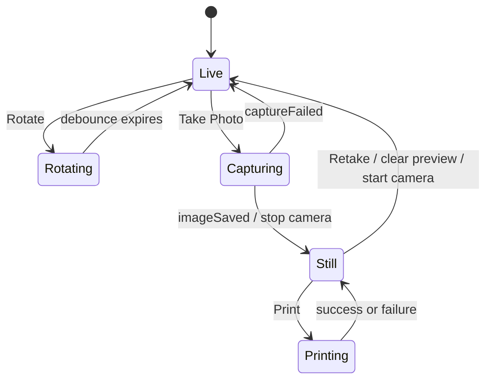

# Rabbit R1 Camera Almanach: A Native Ubuntu Touch Camera-to-Thermal-Print Pipeline

This report explains how a Rabbit R1 running Ubuntu Touch became a dedicated camera-to-thermal-printer appliance. The application controls the Rabbit's rotating physical camera, captures and reviews a still image, submits a deterministic photo layout to Almanach, and receives a synchronous result after the server renders, rasterizes, and prints the image on a 384-dot thermal mechanism.

The final system is intentionally narrow. It does not expose a general layout editor or a collection of unverified image filters. The device presents four meaningful actions—Rotate, Take Photo, Retake, and Print—and sends one paper-calibrated photographic contract: Atkinson dithering, gamma 0.8, printer density 20, and printer speed 80. That contract is validated in source code, server tests, deployment state, request logs, and physical paper output.

> [!summary]
> - The Rabbit application is a C++14, Qt 5.12, QML, and QtMultimedia Click package designed for the 480×640 Ubuntu Touch port. It captures into app-private storage, bounds image processing to 15 MiB and a 1024-pixel maximum edge, and sends an embedded JPEG to Almanach.
> - Rabbit's camera direction is mechanical. One logical Hybris camera remains active while the application writes `0` or `180` to the MS35774 orientation sysfs node; live video and saved JPEGs require separate orientation transforms.
> - Almanach owns the continuous-tone-to-paper conversion. The deployed HTTP path now preserves typed page and block render options, serializes mutable printer settings with bitmap delivery, and fails closed when explicit heat settings cannot be applied.
> - The final physical print established the complete result: the earlier poor output was not evidence against Atkinson dithering. The client had supplied only part of the calibrated recipe, and the HTTP server had discarded or ignored the remaining raster and heat settings.

## 1. The project boundary

The application repository is:

```text
/home/manuel/code/others/rabbit-r1/2026-08-08--r1-camera-almanach
https://github.com/wesen/r1-camera-almanach
```

The principal application lives under:

```text
apps/r1-camera-almanach/
```

The ticket workspace records design, research, scripts, and chronological evidence:

```text
ttmp/2026/08/08/
└── R1-CAMERA-ALMANACH--rabbit-r1-camera-to-almanach-print-app/
    ├── design-doc/
    ├── reference/
    ├── scripts/
    └── sources/
```

Two other repositories participate in the delivered behavior:

```text
/home/manuel/code/wesen/go-go-golems/almanach
/home/manuel/code/wesen/go-go-golems/go-go-parc
```

Almanach renders the layout, converts it to a one-bit bitmap, controls printer heat, and transmits the bitmap. The Obsidian vault preserves the prior physical raster experiments that established the correct photographic settings. This report extends, rather than replaces, the device recovery narrative in [[ARTICLE - Rabbit R1 - From Persistent dm-verity Failure to Ubuntu Touch App Development]] and the print-science analysis in [[ARTICLE - Thermal Rasterization - Dithering, Heat, and Bitmap Fonts]].

The final Rabbit commits are:

| Commit | Purpose |
|---|---|
| `cecfebd` | Bootstrap the native camera application. |
| `8ce5d5b` | Add build, deployment, launch, screenshot, and smoke-test scripts. |
| `e3e05fb` | Document the initial architecture and implementation plan. |
| `ea01eaa` | Validate embedded image layouts against the deployed renderer. |
| `27abfb1` | Complete the first physical camera-to-paper path. |
| `979987b` | Separate capture, review, retake, and print interactions. |
| `705334e` | Document and integrate the rotating camera motor. |
| `b195f9b` | Ship the calibrated single-mode appliance as version 0.1.17. |
| `89d060b` | Record final design and physical validation evidence. |

## 2. The system as a sequence of ownership boundaries

A photograph crosses six distinct representations before it reaches paper. Each transition has an explicit owner.

```mermaid
flowchart LR
    SENSOR["Rabbit camera sensor"] --> HYBRIS["QtMultimedia / Hybris frame"]
    HYBRIS --> JPEG["Saved JPEG in app cache"]
    JPEG --> LAYOUT["Almanach JSON with JPEG data URL"]
    LAYOUT --> PNG["Chrome-rendered 384 px PNG"]
    PNG --> BITMAP["Packed 1-bit bitmap"]
    BITMAP --> PAPER["K118 thermal paper"]

    style SENSOR fill:#263238,color:#fff
    style JPEG fill:#37474f,color:#fff
    style LAYOUT fill:#4e342e,color:#fff
    style PNG fill:#1a3f5f,color:#fff
    style BITMAP fill:#5d4037,color:#fff
    style PAPER fill:#f5f0dc,color:#111
```



The Rabbit owns camera interaction, capture orientation, source-size limits, JPEG encoding, and user intent. Almanach owns HTML rendering, tone conversion, dithering, bit packing, printer-state coordination, and printer transport. The AtomS3R firmware owns Wi-Fi reception, density and speed registers, UART delivery, and the immediate printer mechanism.

This division is necessary because each layer has different information. The Rabbit knows which camera direction the user selected and which file was captured. Almanach knows the final paper geometry and can distinguish page-level and block-level raster policies. The firmware controls device-specific heat and speed registers but does not need to decode JPEG or reproduce browser layout.

The production request path is:

```text
Rabbit 192.168.0.5
  POST http://192.168.0.212/api/render-and-print
  Host: almanach.crib.scapegoat.dev

k3s / Traefik
  -> almanach-render pod
  -> Chrome screenshot
  -> Atkinson rasterization
  -> set speed 80
  -> set density 20
  -> POST bitmap to 192.168.0.126

AtomS3R
  -> UART at 460800 baud
  -> K118 printer
```

The direct LAN address is intentional. Public DNS resolved the Almanach hostname to a Tailscale address that the Rabbit could not reach. The application therefore connects to the k3s LAN address while preserving the ingress `Host` header required by Traefik.

## 3. Why the first implementation used C++ and QML

Ubuntu Touch already supplies Qt, QML, QtMultimedia, Mir/Lomiri application lifecycle integration, and Click packaging. The initial implementation therefore used the platform's native path:

```text
C++14
Qt 5.12
QML
QtMultimedia
Ubuntu.Components 1.3
Clickable 8
```

The language boundary follows responsibility rather than file type convention. QML owns the visible state machine and touch surfaces. C++ owns filesystem access, image decoding, network requests, motor sysfs access, and deterministic JSON construction.

The primary files are:

| File | Responsibility |
|---|---|
| `qml/Main.qml` | Live viewfinder, saved preview, Rotate, Take Photo, Retake, Print, and status presentation. |
| `src/main.cpp` | Application initialization and `QQuickView` hosting. |
| `src/printclient.cpp` | Capture directory, source validation, orientation correction, JPEG encoding, HTTP lifecycle, and motor control. |
| `src/layoutbuilder.cpp` | Deterministic one-photo Almanach request. |
| `tests/layoutbuilder_test.cpp` | Contract-level invariants independent of the device. |
| `tests/qml_load_test.cpp` | Resource and QML instantiation smoke test when Ubuntu Components are available. |

A future Go implementation can reuse the transport and state-machine design, but the first objective was to prove the Ubuntu Touch hardware path with the framework already integrated into the device image.

## 4. Presenting an Ubuntu Components application correctly

The initial process could start, create QML objects, and remain alive while displaying only a black or spinning surface. The defect was not camera permission or QML parsing. It was the top-level window hosting model.

A bare `QQmlApplicationEngine` loaded the `MainView`, but did not reliably present the Ubuntu Components root as a visible Lomiri window. The working implementation uses `QQuickView`, configures the root object to size with the view, and calls `show()` explicitly.

```cpp
QQuickView view;
view.rootContext()->setContextProperty("printClient", &printClient);
view.setResizeMode(QQuickView::SizeRootObjectToView);
view.setSource(QUrl("qrc:/qml/Main.qml"));
view.show();
```

This distinction became an early diagnostic rule: process existence, successful QML object construction, and visible window presentation are separate claims. A systemd unit and a process table can prove the first claim while saying nothing about the third.

The same evidence discipline remained useful throughout the project:

- `systemctl --user status` established application lifecycle.
- the application journal established camera initialization and request callbacks;
- Mir screenshots established actual device pixels;
- socket state established client/server transport;
- Almanach logs established Chrome render completion;
- printer status established firmware reachability;
- paper established physical output quality.

## 5. The capture and review state machine

The final interface is not a continuous-print camera. Capture and print are separate decisions.



The QML state is deliberately small:

```qml
property bool capturePending: false
property bool rotatePending: false
property string capturedPath: ""
property string localStatus: "Ready"
```

`capturedPath` is the principal state discriminator. An empty path means the live camera should be visible. A non-empty path means the saved still should be visible and Print should be enabled.

Capture writes into the app-private cache directory:

```text
/home/phablet/.cache/r1-camera-almanach.manuel/captures
```

This path solved a confinement failure encountered when the application attempted to save into a broader picture-library location. Private cache storage also gives the application a simpler lifecycle: each captured file is internal implementation data rather than a user-managed photo-library asset.

The camera stops after `imageSaved`. This is not required to save a JPEG, but it prevents the native Hybris video surface from competing with the saved-image preview and reduces post-capture interaction failures. Retake clears the saved source and starts the camera again.

The two primary buttons remain disabled by state:

```qml
enabled: !printClient.busy && !root.capturePending
```

for capture/retake, and:

```qml
enabled: root.capturedPath !== "" && !printClient.busy
```

for printing. This prevents a print before capture and prevents concurrent requests from one application process.

## 6. The camera is mechanically rotated

The Rabbit exposes one logical camera to the Ubuntu Touch multimedia stack. Front, rear, and privacy directions are produced by rotating the physical camera module, not by selecting `Camera.FrontFace` or `Camera.BackFace`.

The platform exposes the motor at:

```text
/sys/devices/platform/step_motor_ms35774/orientation
```

Observed positions are:

| Value | Physical direction |
|---:|---|
| `0` | Front/selfie |
| `90` | Down/privacy |
| `180` | Rear |

The application toggles between `0` and `180`:

```cpp
const int current = readOrientation();
const int target = current == 0 ? 180 : 0;
writeOrientation(target);
```

An early implementation stopped the camera, moved the motor, waited, and restarted the camera. That sequence appeared orderly but was incompatible with the Hybris backend: rapid camera teardown and recreation could freeze the viewfinder. The working sequence leaves the camera session intact, writes the motor position, and debounces additional motor requests for 1.8 seconds.

```qml
function rotateCamera() {
    if (root.rotatePending)
        return
    root.rotatePending = true
    root.capturedPath = ""
    preview.source = ""
    printClient.rotateCamera()
    root.localStatus = printClient.status
    rotateDebounceTimer.restart()
}
```

Motor access introduced the most important unresolved security issue. A normal Click confinement profile cannot write an arbitrary hardware sysfs node. The current package therefore uses the `unconfined` template for sideload validation. Click review rejects it:

```text
security:template_valid:r1-camera-almanach.apparmor
(NEEDS REVIEW) 'unconfined' not allowed
```

This is an explicit development exception, not a publication design. A production package needs a narrow privileged service or a platform policy extension that owns the sysfs write and exposes a constrained method such as `SetCameraOrientation(0|90|180)`.

## 7. Live orientation and saved orientation are different problems

The live camera surface and the saved JPEG did not respond to one shared rotation value. The live viewfinder receives buffers through the Hybris video sink and Qt's `VideoOutput`; the saved file passes through image capture metadata, `QImageReader::setAutoTransform`, and the QML `Image` element.

The final UI applies a motor-dependent transform separately:

```qml
VideoOutput {
    autoOrientation: true
    orientation: printClient.cameraMotorOrientation === 0 ? 90 : 270
}

Image {
    rotation: printClient.cameraMotorOrientation === 0 ? 180 : 0
}
```

The C++ print path also applies the required saved-image correction before encoding:

```cpp
reader.setAutoTransform(true);
QImage image = reader.read();

if (m_cameraMotorOrientation == 0)
    image = image.transformed(QTransform().rotate(180));
```

This separation fixed a specific failure: the live composition looked correct, but the captured still appeared rotated. Reusing the live transform for the still was incorrect because the two paths had already applied different orientation handling before QML saw them.

The general rule is precise: orientation must be calibrated at each representation boundary. Sensor orientation, live buffer orientation, JPEG metadata orientation, decoded pixel orientation, preview orientation, and printed orientation are related but not interchangeable values.

## 8. Bounding source processing on the Rabbit

The Rabbit sends a self-contained layout with a JPEG data URL. That removes any requirement for Almanach to reach back into device-local storage, but it also means the client must bound memory and request size.

The C++ path enforces two limits:

```cpp
constexpr int kMaximumSourceBytes = 15 * 1024 * 1024;
constexpr int kMaximumImageEdge = 1024;
```

The processing sequence is:

```pseudocode
path = normalizeLocalPhotoURL(photoUrl)
reject unless path exists and is a regular file
reject if source file > 15 MiB
image = decode with EXIF auto-transform
apply motor-specific still correction
if either dimension > 1024:
    scale to fit within 1024 × 1024
encode JPEG at quality 82
base64-encode JPEG
build deterministic Almanach JSON
POST asynchronously
```

QML separately bounds preview decode with `sourceSize.width` and `sourceSize.height` set to 1024. This matters because a full-resolution decoded still can consume substantially more memory than its compressed JPEG and can make a small device appear unresponsive even when the network and server are healthy.

The application request timeout is 90 seconds. The network operation remains asynchronous, and QML binds button enablement and status to `PrintClient::busy`. Request lifecycle logs include URL, body size, reply creation, and reply completion.

A successful final request looked like:

```text
Posting Almanach request QUrl("http://192.168.0.212/api/render-and-print") 81594 bytes
Almanach reply created QNetworkReplyHttpImpl(...)
Almanach reply finished QNetworkReply::NoError "Unknown error"
```

The text `"Unknown error"` is Qt's error-string value even when `reply->error()` is `NoError`; the enum is the authoritative field.

## 9. Why six presets were removed

The first application shipped six named presets:

```text
PHOTO
FIELD
PORTRAIT
WIDE
LIGHT
CONTACT
```

They changed title text, caption text, image height, crop mode, border, theme, and a nominal thermal tone. They did not represent six paper-calibrated photographic processes. Every choice eventually converged on the same one-bit printer, and the most important controls—gamma, dithering, density, and speed—were either fixed or incompletely delivered.

The preset carousel therefore increased interaction cost while hiding the real output contract. The final `LayoutBuilder` produces one block:

```cpp
const QJsonObject photoBlock{
    {"id", "photo"},
    {"type", "image"},
    {"data", QJsonObject{
        {"src", dataUrl},
        {"alt", "Rabbit R1 photograph"},
        {"height", 320},
        {"fit", "cover"},
        {"border", false},
        {"grayscale", false}
    }}
};
```

The page-level render contract is equally explicit:

```json
{
  "rasterMode": "RASTER_MODE_ATKINSON",
  "gamma": 0.8,
  "printerDensity": 20,
  "printerSpeed": 80
}
```

Page scope is appropriate because the printed page is now photographic content only. A mixed text-and-photo page needs separate block raster and heat policies. A photo-only page does not need content-driven density bands, decorative titles, or text optimized for a heat setting intended for photographs.

The user interface followed the same reduction. The large rounded dark-grey app card and preset pills were removed. The preview and two action buttons sit directly on the matte-black root. The preview retains its own border because that border communicates live-versus-still state and defines the crop.

## 10. Dithering is only one part of photographic output

The poor first photo prints appeared to implicate Atkinson dithering. Existing physical experiments showed otherwise. [[ARTICLE - Thermal Rasterization - Dithering, Heat, and Bitmap Fonts]] had already established the complete recipe on the same class of mechanism:

| Control | Selected value | Physical reason |
|---|---:|---|
| Raster mode | Atkinson | Preserves tone while discarding part of the diffusion error, producing a lighter dot field. |
| Gamma | `0.8` | Opens midtones before quantization and compensates for thermal dot gain. |
| Density | approximately `20` | Prevents adjacent photo dots from spreading into muddy regions. |
| Speed | `80` | Provides the selected dwell/feed behavior for the calibrated photo output. |

Floyd–Steinberg preserved tone but printed denser and exhibited correlated texture. Bayer preserved midtones but imposed a visible periodic grid. Fixed threshold remained correct for text, QR codes, and already-binary graphics, but destroyed continuous photographic tone.

The Rabbit initially sent only the first two controls on the image block:

```json
{
  "rasterMode": "RASTER_MODE_ATKINSON",
  "gamma": 0.8
}
```

The HTTP service also had a semantic split. The CLI print path parsed page render options, applied printer settings, and supported heat bands. The HTTP `/api/render-and-print` path normalized the layout but discarded the extracted top-level `render` map, failed to populate per-block options, and sent the bitmap through a legacy whole-bitmap function without applying page heat.

The practical result was an incomplete system: even a correct Atkinson pattern could be thresholded incorrectly or burned under stale, text-oriented heat. Changing algorithms would not repair that contract violation.

## 11. Repairing the Almanach HTTP contract

Almanach PR #14, merged as commit `e7ceeb18982cbf7283cbe9df0749537e8da4271b`, made HTTP and CLI semantics consistent.

The corrected server render path performs four operations before invoking Chrome:

```pseudocode
layoutJSON, rawPageRender = normalizeRequest(body)
pageRender = parseAndValidate(rawPageRender)
perBlockRender = parseAndValidateBlocks(layoutJSON)
options = applyRenderOptions(defaultHTTPOptions, pageRender)
options.PerBlockRender = perBlockRender
result = renderWithChrome(layoutJSON, options)
```

`RenderResult` carries the effective options into the print stage. This avoids reparsing the consumed request body and guarantees that rasterization and printer delivery use the same validated values.

The printer phase is serialized:

```pseudocode
render result outside lock

lock printer mutex
    set page speed if specified
    if mixed heat regions exist:
        compute density bands
        for each band:
            set density or abort
            send band bitmap
    else:
        set page density if specified or abort
        send complete logical bitmap
unlock printer mutex
```

The lock covers settings and all transport segments. Density and speed are mutable global state in the printer, so locking only individual HTTP calls would permit this invalid interleaving:

```text
Job A: set density 20
Job B: set density 38
Job A: send photo bitmap    # wrong density
Job B: send text bitmap
```

A process-local mutex is sufficient only while the deployment has one printer-facing service replica. Scaling the service horizontally would require a distributed lease, queue, or a printer-side atomic job endpoint.

The implementation fails closed on explicit setting errors. If `/api/printer/density` or `/api/printer/speed` fails, the service returns an error before sending the affected bitmap. Logging the failure and printing anyway would produce paper that violates the caller's contract while still returning success.

## 12. Presence semantics: zero is a valid value

Code review exposed a subtle representation problem. Both printer density and raster threshold permit explicit zero values. A plain integer field cannot distinguish:

```text
value absent
value explicitly set to 0
```

The page-level renderer now uses presence flags such as:

```go
Threshold    uint8
ThresholdSet bool

PrinterDensity    int
PrinterDensitySet bool
```

Per-block raster regions require the same distinction:

```go
type rasterRegion struct {
    YStart       int
    YEnd         int
    Mode         string
    Gamma        float64
    Threshold    uint8
    ThresholdSet bool
}
```

Without `ThresholdSet`, the region conversion interpreted `0` as “inherit the page threshold,” silently replacing an explicit all-white cutoff with the default value, usually 128. Typed protobuf fields carried presence at the schema layer, but that information was lost when copied into an untyped internal integer. The fix preserved presence through every representation.

The review also identified a panic path in segmented printing. A printer could return valid JSON `null`; unmarshalling produced a nil map, and adding a `segments` key panicked. The handler's HTTP panic recovery could keep the process alive while leaving a manually locked printer mutex locked forever. The final code both allocates a map before assignment and releases the mutex through `defer` in a scoped closure.

These fixes produced regression tests for:

- flat and wrapped HTTP render options;
- effective Atkinson, gamma, density, and speed values;
- explicit page threshold zero;
- explicit block threshold zero;
- speed-before-density-before-bitmap ordering;
- mixed density-band ordering;
- fail-closed page setting errors;
- fail-closed mixed-band setting errors;
- segmented `null` printer responses;
- non-interleaving printer critical sections by construction.

## 13. Printer payload size and transport segmentation

A 384-dot printer consumes 48 bytes per bitmap row:

```text
384 bits / 8 = 48 bytes per row
```

The AtomS3R HTTP server was observed to become unreliable above approximately 38 KiB request bodies. Almanach therefore treats 36 KiB as a safe bitmap-body limit and splits taller pages into horizontal segments.

For a 384×421 output:

```text
421 rows × 48 bytes = 20,208 bytes
```

The final Rabbit photo fits in one safe bitmap request. Feed rows and the `X-Feed` header handle paper advance. Larger pages may be split, but all segments of one logical job remain under the printer mutex and inherit the intended page settings.

The firmware UART runs at 460800 baud in the deployed setup. The status endpoint confirmed:

```json
{
  "ok": true,
  "wifi": {
    "connected": true,
    "ip": "192.168.0.126"
  },
  "printer": {
    "baud": 460800,
    "swapped": true
  }
}
```

The `swapped` field records the board-specific UART pin mapping required by the AtomS3R/printer connection.

## 14. Diagnosing apparent hangs by boundary

Several independent failures were initially described as “the app hangs.” Each required different evidence.

| Symptom | Actual boundary | Evidence | Resolution |
|---|---|---|---|
| Process alive, black/spinner surface | Window presentation | QML loaded but no visible top-level view | Host `MainView` with `QQuickView` and call `show()`. |
| Capture could not save | App confinement/filesystem | Capture callback reported inaccessible target | Save under app-private cache. |
| Rotate froze viewfinder | Hybris camera lifecycle | Stop/start around motor command preceded frozen video | Keep camera session active while moving motor. |
| Saved still appeared sideways | Representation-specific orientation | Live preview correct; decoded JPEG wrong | Separate live and still transforms. |
| Print request rendered but never returned | Server-to-printer phase | Chrome completed in under one second; HTTP reply remained pending | Inspect printer delivery and avoid attributing it to rendering. |
| Printer answered ping but not HTTP | Firmware/paper state | Port 80 timed out; printer was out of paper | Load paper; firmware endpoint recovered. |
| App appeared frozen after print | QML geometry | Passive screenshot showed 20-pixel preview and full-height buttons | Bound action row min/preferred/max height in 0.1.17. |
| Multiple physical outputs | Repeated user intent | Three POST/reply pairs in Rabbit journal | Treat every completed tap as a distinct job; add future acknowledgement/debounce. |

The final request logs illustrate correct boundary attribution. Rabbit submitted three rapid jobs:

```text
21:02:51 -> 21:02:53
21:02:56 -> 21:02:59
21:02:59 -> 21:03:02
```

Each server render completed in approximately 0.8–0.9 seconds and returned successfully. An established client socket after completion was Qt's reusable keep-alive connection, not evidence of an active request. The physical printer then completed the queued output.

## 15. QML geometry on a 480×640 target

Removing the outer card simplified the interface but exposed a layout constraint. The preview `Item` requested `Layout.fillHeight: true`, while the action `RowLayout` had only a preferred height. On the device, the row expanded and the preview collapsed to a narrow strip.

The correction gives the row one fixed vertical contract:

```qml
RowLayout {
    Layout.fillWidth: true
    Layout.minimumHeight: units.gu(11)
    Layout.preferredHeight: units.gu(11)
    Layout.maximumHeight: units.gu(11)
}
```

The preview receives the remaining height. This is preferable to hard-coding the preview because the root and margins can continue to adapt while the action targets remain stable.

The final visual hierarchy is:

```text
┌──────────────────────────────────────┐
│                                      │
│              PREVIEW                 │
│ LIVE/STILL                 ROTATE     │
│               STATUS                 │
├──────────────────┬───────────────────┤
│ TAKE PHOTO       │ PRINT             │
│ or RETAKE        │                   │
└──────────────────┴───────────────────┘
```

The background is black. The preview border changes from grey to orange for a saved still. Rotate remains an overlay because it modifies the camera rather than advancing the capture/print workflow. The two bottom actions remain large enough for the Rabbit's small touch display.

## 16. Network reliability and deployment

USB ADB was unreliable on this Ubuntu Touch port, so application deployment used Wi-Fi SSH at:

```text
phablet@192.168.0.5
```

The device repeatedly roamed between two radios sharing the `yolobolo` SSID:

```text
12:A7:93:03:99:3F  5 GHz
12:A7:93:FC:99:3E  2.4 GHz
```

NetworkManager logs showed completed four-way handshakes followed by locally generated disconnects, reassociation, temporary SSID disablement, and misleading `WRONG_KEY` reports even though the saved secret remained present. Pinning the connection to the stronger 2.4 GHz BSSID produced:

```text
BSSID: 12:A7:93:FC:99:3E
frequency: 2412 MHz
signal: -40 dBm
power saving: disabled
```

SSH persistence is provided by enabling socket activation:

```bash
sudo systemctl enable --now ssh.socket
```

The application build and deployment path is:

```bash
ttmp/.../scripts/01-build-and-test.sh
ttmp/.../scripts/02-deploy-rabbit.sh 192.168.0.5 0.1.17
ttmp/.../scripts/03-launch-and-diagnose.sh 192.168.0.5 0.1.17
```

Clickable compiles ARM64 and AMD64 packages. The deliberate `unconfined` policy requires `--accept-review-errors`; this is documented as a sideload exception. The host deterministic test runs from the AMD64 build. Attempting to execute the ARM64 test binary on the x86 host fails because the ARM64 dynamic loader is absent:

```text
aarch64-binfmt-P: Could not open '/lib/ld-linux-aarch64.so.1': No such file or directory
```

The QML resource test is skipped clearly on hosts without `Ubuntu.Components 1.3` and is covered by packaged launch diagnostics on the Rabbit.

Almanach deploys through GitHub Actions, GHCR, GitOps, and Argo CD. The final verified pod used:

```text
ghcr.io/go-go-golems/almanach:sha-e7ceeb1
```

The live health endpoint returned HTTP 200, and the pod was `1/1 Running` on k3s.

## 17. Validation: what each test proves

No single test proves the complete appliance. The validation matrix assigns one claim to each source of evidence.

| Evidence | Claim established |
|---|---|
| `qmllint qml/Main.qml` | QML syntax and statically detectable bindings are valid. |
| ARM64 Click build | The application compiles and packages for the Rabbit. |
| AMD64 build | Host test executables compile against the selected Qt API. |
| `layoutbuilder-test` | The request has one image block and exact Atkinson/gamma/density/speed settings. |
| QML load test | The packaged QML resource can instantiate when Ubuntu Components exists. |
| Rabbit systemd unit | Lomiri launched the application process. |
| Rabbit journal | Camera `0` initialized and HTTP callbacks completed. |
| Mir screenshot | Device geometry, visibility, and actual pixel output match expectations. |
| Almanach Go tests | HTTP option parsing, presence semantics, locking, and printer request order are correct. |
| GitHub CI | Tests, lint, CodeQL, GoSec, dependency review, secret scan, and `govulncheck` passed. |
| k3s pod image | The reviewed merge commit is the code actually deployed. |
| Printer status | AtomS3R network and UART configuration are live. |
| Physical paper | The calibrated output quality is acceptable on the actual mechanism and paper. |

The final paper result is the only evidence that resolves the combined effects of source exposure, gamma, one-bit dot placement, heat, speed, paper chemistry, and mechanism behavior. Screen previews remain useful for crop and composition, but they do not reproduce thermal dot gain.

## 18. Security and publication boundary

The current application is operational but not store-ready. Its capability set includes:

- camera access;
- network access;
- app-private cache storage;
- direct write access to a hardware-specific motor sysfs node.

The first three fit normal application confinement. The fourth does not. Keeping the whole process unconfined expands the effect of any defect in JPEG parsing, QML loading, or network response handling.

The production architecture should move motor control into a small privileged component:


The helper should enforce:

```text
accepted values: 0, 90, 180
no arbitrary path selection
no arbitrary byte payload
one request at a time
bounded operation timeout
structured success and error response
```

The Click app can then return to camera/network confinement. This change is required before ordinary OpenStore publication.

## 19. Remaining engineering work

The application has reached a useful and physically validated state. The remaining work is hardening rather than proving the basic product.

### Privileged motor service

Replace `unconfined` with a narrowly authorized service and document its installation boundary for the Rabbit Ubuntu Touch port.

### Duplicate-job protection

The Print button is disabled while a request is active, but becomes available immediately after success. A user can submit another job while the printer is still completing physical movement. A completed-job acknowledgement or short post-success debounce would make duplicate intent explicit.

### Paper-out status

The printer's paper-out condition presented as an unresponsive HTTP endpoint. Almanach should receive a structured offline/paper-out response or enforce a shorter printer timeout and return a specific 502 error. The Rabbit can then distinguish rendering failure, printer unavailability, and client network failure.

### Server identity

The health endpoint reported version `dev` even while the image tag identified the merge commit. Embedding commit/version metadata in the service response would make deployment verification possible without cluster access.

### Orientation coverage

Positions 0 and 180 are implemented. Position 90 is useful as a privacy state but needs deliberate UI semantics and separate live/still calibration if exposed.

### Continued paper calibration discipline

The one calibrated mode should remain the default. Any future artistic mode should begin with labeled physical strips that vary one controlled parameter at a time. A screen-only filter is not sufficient evidence for a thermal-print preset.

## 20. Working rules preserved by the project

The project establishes a set of reusable engineering rules.

- Treat process, window, camera, file, socket, renderer, printer firmware, and paper as separate evidence boundaries.
- Do not restart a hardware-backed camera session merely because a mechanical component moved; verify whether the backend supports that lifecycle.
- Calibrate live buffers and saved files separately when metadata and rendering pipelines differ.
- Preserve field presence whenever zero is a valid explicit value.
- Serialize mutable peripheral settings with the operation that consumes them.
- Fail closed when a caller explicitly requests hardware settings and those settings cannot be applied.
- Bound compressed input size, decoded image dimensions, preview dimensions, and request timeout independently.
- Keep a deterministic request builder separate from transport code so the payload can be tested without camera hardware.
- Prefer one physically validated product mode over several labels that do not correspond to validated behavior.
- Use physical output as the final authority for a physical rendering system.

## 21. Final state

The final delivered system is:

```text
Rabbit R1 running Ubuntu Touch 20.04
  - native C++/QML application 0.1.17
  - live camera and upright still review
  - MS35774 front/rear rotation
  - explicit Retake and Print
  - app-private captures
  - Wi-Fi SSH deployment

Almanach on k3s
  - merged HTTP render-option parity
  - Atkinson 0.8 photo rasterization
  - density 20 and speed 80
  - printer mutex and fail-closed settings
  - reviewed/deployed image sha-e7ceeb1

AtomS3R / K118
  - LAN address 192.168.0.126
  - 384-dot bitmap input
  - 460800-baud UART
  - successful physical photographic output
```

The final user assessment was concise: the print “looks great,” and the application “works nicely.” The technical significance is that this result is reproducible from a specific request contract, reviewed server semantics, a verified deployment image, and a documented hardware path rather than from ambient printer state or manual post-processing.

## Related notes

- [[ARTICLE - Rabbit R1 - From Persistent dm-verity Failure to Ubuntu Touch App Development]]
- [[ARTICLE - Thermal Rasterization - Dithering, Heat, and Bitmap Fonts]]
- [[ARTICLE - Thermal Dithering Algorithms - Almanach Rasterization Deep Dive]]
- [[PROJ - Almanach Layout DSL v2 - Protobuf Block IR, Typography Presets, and Block-Aware Thermal Rasterization]]
- [[PROJ - SToMS3R - AtomS3R Lite Thermal Printer Firmware]]
- [[ARTICLE - Deep Research - Thermal Receipt Printer Banding Under Low Serial Feed]]
