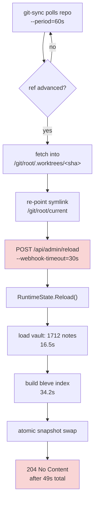
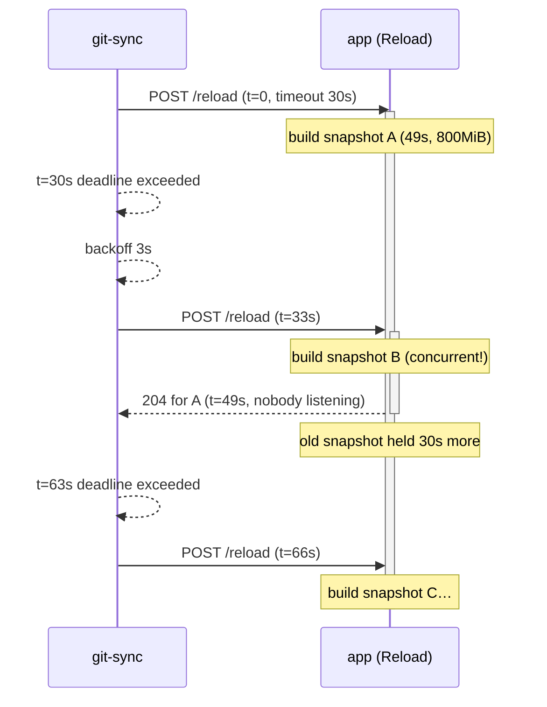

# Reload Amplification: How a Webhook Timeout Became an OOM Crash Loop

The `publish-vault` server that publishes this vault at `parc.yolo.scapegoat.dev` spent nine days in a crash loop. The application container restarted 43 times, every restart ending in exit code 137, with the Go runtime reporting roughly 1.9 GiB of heap-system memory against a 1536 MiB container limit. The obvious reading is that the process needed more memory than it was given.

That reading is wrong, and the way it is wrong is the interesting part. The process was not too large for its limit. It was doing the same expensive work over and over, concurrently, because two independently reasonable configuration values — a reload that takes 49 seconds and a webhook timeout of 30 seconds — combined into a feedback loop that generated unbounded work from a repository that was not changing.

This note explains the failure mechanism, the measurement error that sent the first investigation to the wrong conclusion, and the changes that fixed it. The reusable content is in the last three sections: the amplification pattern generalizes to any system where a slow synchronous operation sits behind a client with a retry policy.

> [!summary]
> - A synchronous endpoint slower than its caller's timeout is a work amplifier, not a slow endpoint. Every timeout produces a retry, and every retry produces another unit of the same expensive work.
> - `Reason: Error` with exit 137 is not the same as `Reason: OOMKilled`. Both surface as "exit 137" in most tooling, and only one of them means the cgroup limit was hit.
> - Measuring a system's default configuration and reporting the result as production behaviour is a specific, repeatable mistake. The deployed configuration differed from the default in exactly the dimension being measured.
> - The durable fix is idempotence, not headroom. Making a repeated reload against unchanged input cost nothing removes the amplification whatever the timeouts are set to.

## Why this note exists

The first investigation produced a 2000-line design document with heap profiles, a per-note memory budget, and a ranked list of remediations. Its top recommendation was to move the search index off the Go heap by enabling a flag that, in production, had already been enabled for months. The measurements were correct; they described the wrong system.

The correction took ten minutes of reading logs from the running pod. That asymmetry is the reason this note exists.

## The system

`publish-vault` serves an Obsidian vault as a website. Three containers run in one pod:

| Container | Role |
| --- | --- |
| `app` | Go server. Loads the vault into memory, builds a search index, serves the API and the pre-rendered HTML. |
| `ssr` | Node sidecar. Renders the React app server-side; reads note data from `app`. |
| `git-sync` | Sidecar that clones the vault repository, updates a symlink when the ref advances, and calls a webhook to tell `app` to reload. |

The publishing path is a pull model. `git-sync` polls the vault repository every 60 seconds. When the ref has advanced it fetches the new commit into a fresh worktree directory, atomically re-points the symlink `/git/root/current` at it, and then issues `POST /api/admin/reload` to the application. The application rebuilds its entire in-memory state from the new directory and atomically swaps it into service.



The two red nodes are where the failure lives. The webhook waits for the reload to finish, and the reload takes longer than the wait.

## The evidence

Three sources, read together, identify the mechanism. Individually, each is ambiguous.

### Container status

```
NAME                                      READY   STATUS    RESTARTS
retro-obsidian-publish-846d8c8bd5-6kbkv   2/3     Running   45

app        restarts=43  lastExit=137  reason=Error
git-sync   restarts=2   lastExit=1    reason=Error
ssr        restarts=0
```

The `app` container has exit code 137 and reason `Error`. Kubernetes reports `OOMKilled` when the kernel's cgroup OOM killer terminates a container. It reports `Error` when the container received SIGKILL from somewhere else — most commonly the kubelet killing a container whose liveness probe has failed, or the runtime terminating a pod that exceeded its limit in a way the OOM killer did not attribute to a single process. Exit 137 alone is `128 + 9`, which is any SIGKILL from any source.

This distinction is worth internalizing because most tooling collapses it. A dashboard that shows "exit 137" and a human who says "OOM" have skipped a step.

### Application log

The application emits a structured line at each phase of a load, including heap statistics. Filtering the previous container's log to reload phases:

```
02:30:07  reload_swapped   heapSys=1.73GiB  duration=48.9s  resolvedRoot=.../f1917789…
02:30:24  reload_start
02:30:41  reload_swapped   heapSys=1.73GiB  duration=49.6s  resolvedRoot=.../f1917789…
02:30:57  reload_start
02:31:16  reload_swapped   heapSys=1.85GiB  duration=51.8s  resolvedRoot=.../f1917789…
02:31:30  reload_start
02:31:46  <killed>
```

Two facts follow immediately. First, reloads are happening continuously — a new one begins roughly 16 seconds after the previous one completes, and each takes about 50 seconds. Second, and decisively, `resolvedRoot` is byte-identical in every line. The symlink points at worktree `f1917789…` throughout. The vault is not changing. Every one of these rebuilds produces exactly the state that was already in service.

### git-sync log

The sidecar explains why it keeps asking:

```json
{"logger":"webhook","msg":"sending webhook","hash":"f1917789…","timeout":"30s"}
{"logger":"webhook","msg":"hook failed","error":"context deadline exceeded","hash":"f1917789…","retry":"3s"}
{"logger":"webhook","msg":"sending webhook","hash":"f1917789…","timeout":"30s"}
{"logger":"webhook","msg":"hook failed","error":"context deadline exceeded","hash":"f1917789…","retry":"3s"}
```

The webhook times out at 30 seconds. The reload needs 49. The call therefore *always* fails from git-sync's perspective, regardless of whether the reload succeeded — and it did succeed, every time, 19 seconds after the caller stopped listening. git-sync waits its 3-second backoff and re-fires for the same hash. There is no exit condition, because the condition git-sync is waiting for (a 204 within 30 seconds) can never occur.

## The mechanism

Put the three observations together and the loop is fully specified:

1. `git-sync` sends the webhook and starts a 30-second timer.
2. `Reload()` begins building a complete second copy of the vault and search index. This takes about 49 seconds and roughly 800 MiB of resident memory.
3. At 30 seconds the caller's context expires. git-sync logs `context deadline exceeded` and schedules a retry in 3 seconds.
4. At 33 seconds the retry arrives. The old `Reload()` is still running. Nothing prevents the new request from starting a *second* concurrent build.
5. The first build completes at 49 seconds and swaps. The replaced snapshot is retained for a further 30 seconds so in-flight requests can finish with it.
6. Steps 3–5 repeat indefinitely.

The memory consequence follows from the arithmetic. A steady-state snapshot is about 800 MiB. During a swap the outgoing snapshot is still held. With a retry every 3 seconds against a 49-second build and a 30-second retention window, the number of live snapshots is bounded only by how fast the process can allocate:

```
live snapshots ≈ 1 (in service)
              + ceil(build_time / retry_interval)   (concurrent builds)
              + ceil(close_delay / build_time)      (retained old snapshots)
```

The observed `heapSys` of 1.73–1.85 GiB against a 1536 MiB limit is what that produces before the container is killed. The process never had a chance to reach a steady state.



Nothing in this diagram requires the vault to change. The loop is self-sustaining on an idle repository.

## The measurement error

The first investigation reproduced the memory profile locally, using a harness that constructed a `Vault` and a search index over the real 1712-note vault and reported `runtime.MemStats` plus a heap profile. The numbers it produced were accurate:

| Scenario | Live heap | HeapSys | Peak RSS |
| --- | ---: | ---: | ---: |
| One snapshot, in-memory index | 984.9 MiB | 1823.4 MiB | 1897.1 MiB |
| Two snapshots, in-memory index | 1967.9 MiB | 3731.4 MiB | 3848.9 MiB |
| One snapshot, on-disk index | 166.2 MiB | 943.0 MiB | 800.3 MiB |

The heap profile attributed 884.7 MiB — 84.5% of the live heap — to bleve's `NewMemOnly` index. The conclusion drawn was that the in-memory search index was the dominant cost and that switching on the existing `--search-index-path` flag was the single biggest available win.

The flag was already on. The deployment has passed `--search-index-path /data/search` against a disk-backed volume since a commit months earlier, and the application logs `persistentSearch="true"` on every load. Production's numbers are the third row of that table, not the first. Its vault load takes 16.5 seconds and 261 MB, not 82 seconds and 1.56 GB.

The harness measured the library's default configuration. The deployment overrides that default. Every conclusion downstream — the ranking of fixes, the claim about the biggest win, the per-note memory budget — inherited the error, and none of the internal cross-checks caught it, because the measurements were internally consistent. They were consistent with the wrong system.

The general rule: when reproducing a production problem locally, the first artifact to read is the deployed configuration, not the source code. A harness that does not take its flags from the manifest is measuring a hypothesis, not the system.

## The fixes

Two layers. The deployment change stops the loop with the currently deployed binary; the application change makes the loop structurally impossible regardless of configuration.

### Deployment

```yaml
# git-sync container
- --webhook-timeout=300s   # was 30s; must exceed the reload duration
- --webhook-backoff=60s    # was 3s; a genuine failure must not become a storm

# app container
env:
  - name: GOMEMLIMIT
    value: "2600MiB"       # ~0.85 x the limit
resources:
  requests:
    memory: 1Gi            # was 256Mi; steady state is ~800MiB
  limits:
    memory: 3Gi            # was 1536Mi; a swap briefly holds two snapshots
startupProbe:              # new
  httpGet: { path: /api/healthz, port: http }
  periodSeconds: 10
  failureThreshold: 60     # 10 minutes for the first load
```

Raising the timeout above the reload duration is the change that breaks the loop. The others remove adjacent hazards:

- The **backoff** bounds the damage if a reload genuinely fails. At 3 seconds, twenty failures per minute each start a rebuild.
- **`GOMEMLIMIT`** gives the Go runtime a heap ceiling below the container limit. Without it the heap grows to roughly twice the live heap before a collection, which is how a 985 MiB live heap reports 1.93 GiB of heap-system memory. It is a soft limit: if the live heap genuinely does not fit, it converts an OOM kill into continuous GC, which is a different failure, not an absence of one.
- The **startup probe** exists because the process binds its port only after the vault is loaded. The previous configuration gave liveness a 90-second initial delay against a 49-second load, leaving almost no margin and none at all under memory pressure. While a startup probe is running, liveness and readiness are suspended.
- The **memory request** was three times smaller than the pod's actual steady state, which misinforms the scheduler about what the node is carrying.

### Application

The deployment change depends on an inequality — reload duration must stay under the webhook timeout — that will silently stop holding as the vault grows. The application change removes the dependency.

```go
func (s *RuntimeState) Reload() error {
    s.reloadMu.Lock()          // serialise: never two builds at once
    defer s.reloadMu.Unlock()

    // Re-check AFTER acquiring the lock. A queued caller is very likely
    // waiting on the reload that just published the revision it wanted.
    if s.canSkipReload() {
        logMemoryPhase("reload_skipped_unchanged", …)
        return nil
    }

    next, err := loadSnapshot(…)
    if err != nil { return err }

    s.mu.Lock()
    old := s.snapshot
    s.snapshot = next
    s.mu.Unlock()

    closeSnapshotAfter(old, oldSnapshotCloseDelay)  // 30s -> 5s
    return nil
}
```

Two properties matter, and the second is subtler than the first.

**Serialisation** means a burst of webhooks costs one build rather than N. This alone caps memory: concurrent builds go to one.

**Idempotence** means a repeat request against unchanged input costs a `stat`. This is what makes the retry loop harmless rather than merely bounded — and it is why the lock ordering matters. Checking before taking the lock would let a caller that arrives mid-build observe the *old* resolved root, decide work is needed, queue, and then rebuild a revision the in-flight reload was already publishing. Checking after acquiring the lock means the queued caller sees the result of the reload it waited for.

The skip condition is deliberately narrow:

```go
func (s *RuntimeState) canSkipReload() bool {
    // Only a symlink root guarantees "same target" implies "same content".
    info, err := os.Lstat(absRoot)
    if err != nil || info.Mode()&os.ModeSymlink == 0 {
        return false
    }
    resolved, err := resolveRoot(configured)
    if err != nil { return false }
    cur := s.currentSnapshot()
    return cur != nil && cur.ResolvedRoot == resolved
}
```

The narrowness is the design. Under a git-sync symlink, each revision is a fresh immutable worktree, so an unchanged target does imply unchanged content. Under a plain directory — local development, a bind mount, the test suite — files can be edited in place while the path stays constant, and skipping would serve stale content. The first version of this guard omitted the symlink test and broke two pre-existing tests that reload after editing a config file in place. Those tests were the only thing standing between the optimization and a stale-content bug.

Verified behaviour after the change:

| Scenario | Result |
| --- | --- |
| 5 concurrent webhooks, directory root | 5 serialised builds, no interleaving |
| 3 webhooks, unchanged symlink target | 3 × `reload_skipped_unchanged`, 0 builds |
| Symlink advanced to a new revision | 1 build, new content served |

## The amplification pattern

Strip out the specifics and the shape is general. A client calls a synchronous endpoint with timeout `T`. The endpoint performs work costing `W` resources and `D` duration. When `D > T`:

- The client observes failure on every call, whether or not the work succeeded.
- A retry policy converts that observation into another call.
- If the endpoint does not deduplicate, each call costs another `W`.
- Concurrent cost grows as `W × ceil(D / retry_interval)` until something is killed.

The system has no negative feedback. Nothing about the work getting slower makes the calls stop; it makes them *more* frequent relative to completions. Memory pressure slows the builds further, which widens the ratio. In the production logs, a second concurrent build of the same vault took 70.7 seconds against 23.5 for the first — the loop actively degrades its own service time.

Three properties, any one of which breaks the loop:

1. **`D < T`.** Configuration only, and fragile: `D` grows with the data.
2. **Deduplication.** A repeated request against unchanged input returns immediately. Removes the amplification at the source.
3. **Asynchrony.** The endpoint acknowledges immediately and performs the work in the background. The client never times out, so it never retries. This trades away the caller's ability to learn whether the work succeeded.

Prefer (2). It is the only one that holds as the system grows, and it composes with the other two.

## Failure modes to check in similar systems

- **A synchronous "reload", "reindex", or "refresh" endpoint behind any automated caller.** Compare the p99 duration against the caller's timeout. git-sync's `--webhook-timeout` defaults to *one second*; anything non-trivial behind it is a latent version of this bug.
- **Retry backoffs measured in seconds in front of work measured in minutes.** The backoff should be on the order of the work, not the network round trip.
- **Absent `GOMEMLIMIT` in a containerized Go service.** The runtime does not read the cgroup limit on its own. Deriving it at startup keeps the two from drifting:

  ```go
  limit, ok := readCgroupMemoryMax()   // /sys/fs/cgroup/memory.max (v2)
  if ok { debug.SetMemoryLimit(int64(float64(limit) * 0.85)) }
  ```

  Note that cgroup v1 signals "unlimited" with a sentinel near `max int64` rather than a keyword, so a naive parse yields a nonsensical multi-petabyte limit.
- **A liveness probe whose initial delay is close to the startup time.** Use a startup probe. A liveness probe that fires during a slow load converts slowness into a restart, and a restart into another slow load.
- **A resource request far below observed steady state.** It does not cause this failure, but it guarantees the scheduler is reasoning about a pod that does not exist.
- **Retained previous state after an atomic swap.** A generous retention window is memory. It only needs to outlive an in-flight *request*, not the operation that replaced it.

## Working rules

- Read the deployed manifest before interpreting any local measurement. If the harness does not take its configuration from the deployment, it is measuring a different program.
- Treat `exit 137` as "received SIGKILL", then determine from what. `Reason: OOMKilled` and `Reason: Error` are different findings with different fixes.
- When an operation is expensive and its trigger is automated, make the operation idempotent before tuning the trigger. Timeouts are a constraint you have to keep satisfying; idempotence is one you satisfy once.
- Log the identity of what an expensive operation is about to rebuild. A single `resolvedRoot` field in the reload log is what made this diagnosable in minutes — it turns "reloads are frequent" into "reloads are redundant".
- Expose a profiling endpoint on a separate listener. Diagnosing this required rebuilding the vault under a local harness because the running process could not be asked where its memory was. `go tool pprof -top http://127.0.0.1:6060/debug/pprof/heap` answers that in one command.
- When an optimization skips work, state precisely what invariant makes the skip safe, and confine the skip to the cases where the invariant holds.

## Source material

- Application repository: `/home/manuel/code/wesen/go-go-golems/publish-vault`
  - `pkg/server/runtime.go` — `Reload`, `canSkipReload`, snapshot lifecycle
  - `pkg/server/memlimit.go` — cgroup-derived `GOMEMLIMIT`
  - `pkg/server/pprof.go` — profiling listener
- Deployment repository: `/home/manuel/code/wesen/2026-03-27--hetzner-k3s`
  - `gitops/kustomize/retro-obsidian-publish/deployment.yaml`
- Ticket `PV-MEMORY-019` in the application repo's `ttmp/` tree carries the full measurement harness, the heap profiles, and the investigation diary, including the correction described above.
