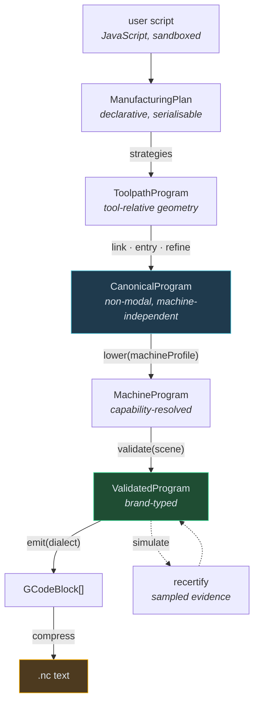
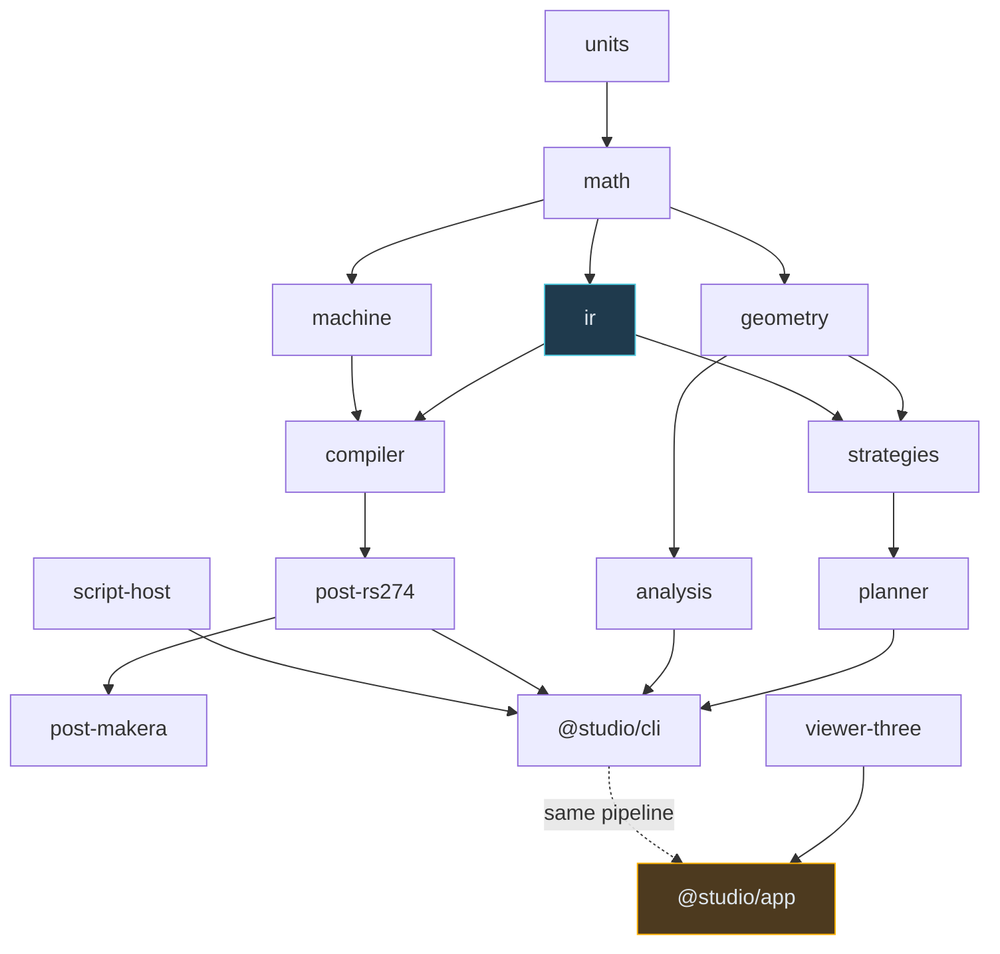
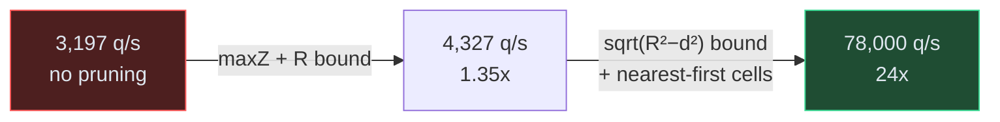

# DROPCUT Studio: A CAM Compiler Where G-Code Is Just a Backend

This note documents the design and implementation of DROPCUT Studio, a browser-based CAM (computer-aided manufacturing) application that turns JavaScript into verified CNC machine code. The system began as three standalone React prototypes and became a sixteen-package TypeScript monorepo built around a single organising claim: **machining, not G-code, is the semantic model**.

The interesting content here is not that the thing works. It is the set of decisions that made it work, the measurements that contradicted the design document, and the three bugs that only a simulator could find.

> [!summary]
> - A non-modal intermediate representation compiles losslessly to modal G-code. This is verifiable, and it is verified by a property test over generated programs.
> - The first working drop-cutter kernel ran 60× slower than the design estimate. The fix was a tighter geometric bound, not micro-optimisation.
> - The material simulator found a rapid move ploughing through 12.9 mm of stock on the first real compile. Two genuine planner defects, neither visible by reading the code.
> - Safety verification reports what was actually established, at what resolution, rather than a boolean.

## Why this project exists

Three JSX prototypes existed in `original/`, totalling 4,861 lines:

| File | Lines | What it does |
| --- | --- | --- |
| `dropcut-cam(1).jsx` | 1,971 | Generates 3-axis toolpaths from a triangle mesh; roughing, three finishing strategies, arc fitting, material verification |
| `dropcut-ide(1).jsx` | 1,673 | Executes a JavaScript DSL, lowers it to an intermediate representation, validates it, emits modal G-code |
| `z1-gcode-checker-l2.jsx` | 1,217 | Parses existing G-code, back-plots it, simulates material removal, reports safety violations |

Read together they form a loop: the first produces G-code, the third consumes it, and the second is the compiler that belongs between them. Read individually they share a defect: each one independently reimplements a Three.js orbit camera, a time-indexed playback scrubber, a heightmap material simulator, and a digital readout. Six components, written three times, each subtly different.

The duplication is a symptom. The cause is that none of the three has a shared model of what a machining program *is*. Each keeps its own ad-hoc representation and derives everything from it.

## The organising claim

The project adopts a design principle supplied as a written note (`original/DESIGN-01-semantic-cam-architecture.md`):

> Do not make G-code the semantic model. Make machining the semantic model, and treat G-code as one serialization backend.

This inverts the usual direction. NIST's RS274/NGC interpreter takes modal G-code and converts it into canonical machining functions. Here the pipeline runs the other way: construct canonical machining semantics first, then compile them to LinuxCNC, GRBL, Fanuc, or Makera.

The consequence is that simulation, time estimation, verification, visualisation and optimisation are all **interpretations of the same program object** rather than separate re-derivations from text. The prototypes demonstrate what happens without this: `verifyJob` re-walks a representation that has already discarded the arcs `compressCut` found.

## Why G-code cannot be the model

G-code is *modal*. Settings persist until changed. `G1` stays active, so a line containing only `X70` is still a feed move. `F800` stays active. `G90` (absolute positioning) stays active. The current tool, plane, and units are all sticky.

This means a G-code line cannot be understood in isolation. `X70` means "rapid to X=70", "feed to X=70 at 800 mm/min", or "feed 70 mm further in X" depending on lines that may be thousands of blocks earlier.

```gcode
G21 G90 G17    ; millimetres, absolute, XY arc plane
T1 M6          ; select tool 1, tool change
S12000 M3      ; spindle 12000 rpm clockwise
G0 Z5.0        ; rapid to safe height
G1 Z-1.5 F300  ; feed down at 300 mm/min
G1 X70 F800    ; cut in X at 800 mm/min
X50            ; ALSO a cut, at 800 mm/min — the mode persists
```

An intermediate representation that inherits this property inherits the hazard. The alternative is to refuse modality in the source language entirely, and reintroduce it only as a compression pass at the very end.

## Architecture

The system is a layered compiler. Every box below is a value that can be inspected, tested and rendered.



Sixteen packages, 13,543 lines of TypeScript, 214 tests. Dependencies run strictly downward: nothing below the application layer imports React or Three.js, which is what makes the core runnable in Node for tests and in a worker for compute.



## Implementation details

### The non-modal intermediate representation

Every canonical command is complete in itself. Each cut carries its own feed rate. Each spindle command carries its own speed. Each arc carries its own geometry.

```ts
export interface CutCmd<F extends FrameId = FrameId> {
  readonly kind: "cut";
  readonly path: Path<F>;
  readonly feed: MmPerMin;      // ALWAYS present, never inherited
  readonly tolerance: Mm;       // the chord tolerance this path was built to
  readonly purpose: CuttingPurpose;
  readonly tool: ToolRef;
  readonly provenance: Provenance;
}
```

There is no `G0` in the IR. A traverse states an *intent* — reach this point safely — and the postprocessor decides whether that becomes one coordinated rapid or a retract/move/descend sequence:

```ts
export interface TraverseCmd<F extends FrameId = FrameId> {
  readonly kind: "traverse";
  readonly to: Point3<F>;
  readonly clearance: ClearanceRequirement;
  readonly provenance: Provenance;
}
```

That distinction is not academic. On a machine whose rapids are not guaranteed to follow a coordinated straight line, emitting a single `G0 X50 Y50 Z2` leaves the path between endpoints unspecified, and the tool can plough through the part. The machine profile declares `rapidSemantics: "coordinated" | "axis-independent"`, and the emitter decomposes accordingly.

### Modality as a compression pass

Emission produces fully explicit blocks — every axis word, every feed, on every line. A separate pure function removes what the controller would infer:

```ts
export function compress(blocks: readonly GCodeBlock[]): GCodeBlock[] {
  let motion, plane, feed, speed;
  const lastAxis: Partial<Record<AxisWord, number>> = {};

  return blocks.map((b) => {
    const next = { ...b };
    if (b.motion === motion) delete next.motion; else motion = b.motion;
    if (b.feed === feed) delete next.feed; else feed = b.feed;
    for (const ax of ["X", "Y", "Z"]) {
      if (near(b.axes?.[ax], lastAxis[ax])) delete next.axes[ax];
      else lastAxis[ax] = b.axes[ax];
    }
    // Arc offsets I/J/K are NEVER dropped: they are relative to the
    // current point and are meaningless to carry over.
    return next;
  }).filter(nonEmpty);
}
```

This is the only place in the codebase that reasons about modality. One pure function, one property test.

### Verifying the central claim

The architecture rests on the assertion that a non-modal IR can be compressed to modal G-code without loss. That is only a claim if it cannot be checked. Because the project also owns a G-code parser, it can be:

```ts
it("compressed output parses back to the same motion as uncompressed output", () => {
  fc.assert(fc.property(arbitraryProgram(), (steps) => {
    const { rawBlocks, document } = emitFor("xyz-3018", steps);
    const a = motionPolyline(parseGcode(formatProgram(rawBlocks)));
    const b = motionPolyline(parseGcode(document.text));
    expect(polylinesMatch(a, b)).toBe(true);
  }), { numRuns: 400 });
});
```

400 generated programs, three machine profiles. The test also asserts that compression genuinely removes words, because a compressor that did nothing would pass trivially.

### Capability-driven lowering

Machine differences are data, never branches. The compiler contains no `if (machine === "Makera")`.

```ts
export interface MachineProfile {
  readonly travels: { x: Range<Mm>; y: Range<Mm>; z: Range<Mm> };
  readonly spindle: { range: Range<Rpm>; directions: readonly SpindleDirection[] };
  readonly interpolation: {
    linear: true; arcXY: boolean; arcXZ: boolean; arcYZ: boolean; helical: boolean;
  };
  readonly rapidSemantics: "coordinated" | "axis-independent";
  readonly dialect: DialectId;
  readonly supportedG: ReadonlySet<number>;
}
```

The Makera Z1 profile came from inspecting a real 18,531-line Makera Studio export. Its census is instructive:

```text
17,439  G1        792  G0        1  G90      1  G28
     1  M5          1  M05       1  M02
     0  G2/G3   ← fully linearized, no arcs at all
```

Makera Studio emits no arcs. So `makeraZ1.interpolation.arcXY = false`, and lowering samples any fitted arc back into a polyline:

```ts
function lowerArcs(path: Path, machine: MachineProfile, tolerance: Mm) {
  return mapSegments(path, (seg) => {
    if (seg.kind !== "arc") return seg;
    const plane = arcPlane(seg.axis);
    if (plane && supportsArcPlane(machine, plane)) return seg;
    return linearize(seg, tolerance);   // capability says no; sample it
  });
}
```

One program compiled for two machines produces arcs in one output and polylines in the other, `M30` versus `M02`, with a structured `;@MKR|` metadata header on one side only — and the difference is entirely in the profile records.

### The drop-cutter problem

Three-axis surface machining reduces to one geometric question. Position a tool at `(x, y)` and lower it until it touches the mesh: what is the Z of the tool tip? That answer as a function of `(x, y)` is the **cutter-location surface**. Driving the tip along it machines the part without gouging.

The naive method — lower in small steps and test for intersection — is slow and inexact. The correct method solves analytically per triangle and takes the maximum. For a ball tool of radius `R`, contact with one triangle decomposes into three cases.

**Vertex contact.** For a vertex at planar distance `d` from the tool axis, the sphere centre sits at

```
z_c = v_z + sqrt(R² − d²)
```

**Edge contact.** Project the axis onto the edge. If perpendicular distance `≥ R` there is no contact. Otherwise the sphere can touch anywhere within `±rp = sqrt(R² − dperp²)` of the projection, and along that interval the edge rises with slope `m`, so the centre height is

```
z_c(s) = z_f + m·s + sqrt(rp² − s²)
```

Differentiating and solving `z_c'(s) = 0` gives the maximum at `s* = m·rp / sqrt(1 + m²)`, clamped to the portion of the interval within the edge's extent.

**Face contact.** For a plane `z = Ax + By + C`, the resting sphere's centre is offset laterally by `R·(A,B)/sqrt(1+A²+B²)`. If that offset point lies inside the triangle, the contact is valid.

Correctness follows because the contact height is the maximum over all features, and each case computes its feature's exact height.

The test that proves the kernel is an identity, not a comparison against the prototype:

```ts
// For a hemisphere of radius R0 and a ball tool of radius R, the
// cutter-location surface is a hemisphere of radius R0 + R, lowered by R.
const expected = Math.sqrt((R0 + R) ** 2 - r * r) - R;
expect(evalZ(x, y)).toBeCloseTo(expected, 0.02);
```

This exercises all three contact cases simultaneously and would not be satisfied by a wrong implementation. A golden-file comparison against the prototype would only have proven faithful copying.

### The performance measurement that contradicted the design

The design document budgeted 200,000 drop-cutter queries per second on a 100,000-triangle mesh. The first working implementation delivered **3,197**.

The estimate was wrong for a structural reason. A 6 mm tool has a disc area of about 28 mm². A mesh with 50 triangles per mm² therefore has roughly 1,400 triangles under the cutter on *every single query*. No amount of optimisation reaches 200,000/s at that density; the work is inherent.

But 3,197/s was also unusable: a 400×400 cutter-location field is 160,000 queries, which is fifty seconds.

The obvious pruning bound is that geometry topping out at `maxZ` can lift the sphere centre no higher than `maxZ + R`. Implemented alone, this bought a factor of 1.35. It is too loose: near the centre of the disc it is tight, but at the rim it rejects almost nothing.

The tighter bound uses horizontal distance. Geometry at squared distance `d²` from the tool axis can lift the centre to at most:

```
maxZ + sqrt(R² − d²)
```

Combined with visiting cells in Chebyshev rings outward from the query point — so the contact is usually found in the first cell and the running best is tight before the outer rings are considered — throughput went to **78,000/s** at typical density.



The lesson is about bounds rather than about JavaScript. A pruning predicate that rejects 30% of candidates and one that rejects 97% look identical in a profiler's call graph; only measuring what the bound actually admits distinguishes them.

The performance budgets in the design document were subsequently replaced with measured values and relabelled as regression guards.

### Constant-scallop finishing

The most mathematically satisfying strategy. Finishing passes should be spaced a constant distance apart *measured along the three-dimensional surface*, so the cusp height between them is uniform regardless of slope. Constant spacing in the XY plane cannot achieve this: on a steep flank, passes that are 0.5 mm apart in XY are much further apart along the surface, and the finish degrades exactly where it is most visible.

Define a scalar field `T` whose level sets are the toolpaths. For consecutive level sets to be `s₀` apart on the surface, `T` must satisfy the Eikonal equation:

```
|∇T| = sqrt(1 + |∇f|²) / s₀
```

The numerator is the surface area element — the factor by which a step in XY stretches when measured on the sloped surface. Steep regions get a larger `|∇T|`, so level sets bunch closer together in XY.

The solver uses fast sweeping. Initialise `T = 0` on the boundary and `+∞` inside, then relax with the Godunov upwind update:

```
T_ij = min(a,b) + f·h                              if |a − b| ≥ f·h
     = (a + b + sqrt(2f²h² − (a−b)²)) / 2          otherwise
```

sweeping in all four diagonal directions. Characteristics of the Eikonal equation are straight lines, and four alternating sweep directions cover every possible characteristic direction, which is why a fixed number of sweeps converges and there is no iterate-until-stable loop.

The behavioural test asserts the property that motivates the strategy:

```ts
it("spaces passes more tightly in XY where the surface is steep", () => {
  const radii = contourMeanRadii(compile(domePlan));
  const gaps = consecutiveDifferences(radii);
  // On a dome, gaps must shrink towards the steep rim.
  expect(mean(outerHalf(gaps))).toBeLessThan(mean(innerHalf(gaps)));
});
```

### The three bugs a simulator found

The material-removal simulator represents stock as a heightmap: a grid of columns, each storing the current top-of-material Z. Cutting lowers columns. It cannot represent undercuts, which is acceptable for three-axis machining where the tool always arrives from above.

On its first run over a real finishing compile it reported a rapid move ploughing through **12.9 mm of stock**. Two genuine planner defects, neither visible by reading the code:

**Retract heights were computed from the part surface.** The linker computed a locally-optimal safe height as `max(part surface along the link) + clearance`. On a finishing-only job with no prior roughing, the material *above* the part is still solid. Near the rim of a dome the part surface is close to zero, so the computed safe height was 2.6 mm — and the stock top was 15 mm. Every such retract rapided through 12.4 mm of untouched block.

The local optimisation is only valid after roughing has cleared the region, and the planner had no way to know whether it had. Retracts are now floored at the stock top. This is conservative and costs travel time; doing better requires stock tracking during planning, which is recorded as a follow-up rather than pretended away.

**Retract traverses ended at cutting depth.** The traverse targeted `path.start`, which is at the depth the cut begins. Its final descent was therefore a *rapid* going straight down into material. Traverses now end at the safe height and the entry planner owns the descent under feed control. This also removed a double descent: the traverse went down, then the entry command descended again from clearance.

**Percent-in-tolerance counted empty margin.** Inherited from the prototype: the in-tolerance figure divided by *all* grid nodes rather than nodes where the part actually rises above the floor. A job that machined nothing still scored well if the stock had a generous margin. Fixed and regression-tested with a deliberately oversized stock.

Residual rapid crash after the first two fixes: zero.

### Verification that states what it established

A boolean `safe: true` invites trust the evidence does not support. The heightmap simulator establishes that *at the sampled grid points, at the sampled positions along each move*, the tool did not go below the target. It says nothing about the space between samples, nothing about the tool holder, and nothing about undercuts.

So each check reports one of four statuses:

```ts
export type CheckStatus =
  | { kind: "verified-exact" }
  | { kind: "verified-to-resolution"; spatial: Mm; numerical: Mm }
  | { kind: "not-checked"; reason: string }
  | { kind: "unverifiable"; reason: string };
```

Rendered:

```text
SAFETY CERTIFICATE
  PASS  travel limits         exact
  PASS  spindle range         exact
  PASS  interlocks            exact
  PASS  gouge                 verified to 0.257 mm grid, 0.020 mm tolerance
  PASS  rapid-through-stock   verified to 0.257 mm grid, 0.020 mm tolerance
  SKIP  fixture collision     not checked — no fixture model defined
  SKIP  holder collision      not checked — tool stickout and holder geometry unknown
  error budget           0.0105 mm  (chord-refinement 0.0100 · gcode-rounding 0.0005)
```

Two properties are worth noting. Fixture and holder collision are *permanently* marked not-checked in this version, which turns them into a visible backlog rather than an invisible gap. And a `job.raw()` escape hatch downgrades every analysable check to `unverifiable`, with simulation evidence explicitly forbidden from upgrading that verdict — the simulator cannot model what the escape does either.

The error budget sums conservatively (plain sum, not root-sum-square) because the contributions are not independent. Writing it down surfaced a term nobody thinks about: `toFixed(3)` in the emitter is ±0.0005 mm of quantisation on every coordinate. It also makes an important warning expressible — requesting a 0.005 mm scallop while arc fitting runs at 0.010 mm tolerance is self-defeating, and the compiler can now say so.

### The scripting sandbox

The user-facing surface is JavaScript:

```js
const ROUGH  = tools.flatEndMill({ name: "6mm flat", diameter: mm(6) });
const FINISH = tools.ballEndMill({ name: "3mm ball", diameter: mm(3) });

job.setup({
  stock: { x: mm(36), y: mm(36), z: mm(16),
           originX: mm(12), originY: mm(12), topZ: mm(15) },
  clearance: mm(20),
  floorZ: mm(0),
});

geometry.mesh("dome", { at: { x: mm(30), y: mm(30) } });

job.withTool(ROUGH, () => {
  job.withSpindle({ speed: rpm(10000) }, () => {
    job.roughSurface({
      stepdown: mm(2), stepover: 0.45, stockToLeave: mm(0.3),
      entry: entry.auto({ maxRampAngle: deg(3) }),
      feed: mmPerMin(1200),
    });
  });
});
```

Two design choices carried over from the prototype are worth keeping.

**Units are boxed at runtime.** TypeScript brands erase, and a user script is not type-checked, so `mm(4)` returns `{ __unit: "mm", v: 4 }`. Passing the wrong brand throws. Passing a *bare number* works but emits a warning. That combination matters: a first-time user typing `diameter: 4` should get a working program and a yellow note, not a red wall.

**Scope combinators make malformed sequences unrepresentable.** `withSpindle(opts, body)` emits the start, runs the body, and emits the stop. There is no way to write the unbalanced form, so the user cannot forget the `M5`.

Sandboxing is honest about its limits. Denied globals are shadowed as function parameters bound to `undefined`, which works where `delete globalThis.x` does not, because a parameter takes precedence over global scope inside the function body:

```ts
const shadowed = DENIED_GLOBALS.filter((n) => !names.includes(n));
compiled = new Function(
  ...names, ...shadowed,
  `"use strict";\n${source}\n//# sourceURL=${SCRIPT_FILENAME}`,
);
compiled(...values, ...shadowed.map(() => undefined));
```

This is defence in depth, not a security boundary. A determined script can still reach objects through prototype chains, and nothing here stops it allocating until the tab dies. Real isolation requires a null-origin iframe or a JavaScript-in-JavaScript interpreter, and that is recorded as a follow-up.

Error locations are mapped back to user source by compiling under a synthetic filename and measuring the line offset at load time:

```ts
function measureLineOffset(): number {
  // A one-line "user script" that throws. Its user line number is 1, so the
  // offset is whatever the engine reports minus one.
  try {
    new Function(`"use strict";\nthrow new Error("probe");\n//# sourceURL=${FILE}`)();
  } catch (e) {
    const m = new RegExp(`${FILE}:(\\d+):`).exec(e.stack);
    if (m) return Number.parseInt(m[1], 10) - 1;
  }
  return 3;
}
```

A hard-coded constant silently misreports every error location, and an engine change would go unnoticed. Measuring it costs one exception at module load.

### State management: the three-tier rule

The predictable failure mode for a React CAM application is putting the toolpath in the Redux store. A finished job is up to 24 MB of typed arrays; the store serialises on every action; DevTools locks up; and the fix people reach for is disabling the serialisability middleware, which is the one thing keeping the store honest.

So every piece of state belongs to exactly one tier:

| Tier | Contents | Enforcement |
| --- | --- | --- |
| Redux store | document (script, machine, setup), UI state, compile *summaries* | `serializableCheck` and `immutableCheck` stay on |
| Artifact cache | programs, G-code documents, render buffers, meshes | module-level `Map`, keyed by id, garbage-collected per compile |
| Refs | Three.js scene, playback clock, DRO text nodes | never enters a component render |

The store holds `artifactId: "artifact:7"`. Components resolve it. When the id changes the viewport rebuilds; when it does not, nothing happens even if unrelated state changed.

The rule is enforced mechanically:

```ts
it("never puts a typed array, Map, Set or function in the store", async () => {
  await store.dispatch(compile());
  const found = findForbidden(store.getState());  // walks the whole tree
  expect(found, found ?? "clean").toBeNull();
});
```

Tier 3 is the one people argue about, so it is worth stating the measurement: the digital readout updates at 60 Hz. Rendering a component tree to change three numbers is not a reasonable use of a reconciler. The prototypes had already discovered this empirically — they wrote the DRO with `ref.textContent` inside the animation frame — and this project makes it a rule rather than a trick.

### The renderer knows nothing about React

React and a 60 Hz WebGL loop have incompatible update models. The only way to keep that boundary honest is to build the renderer as a package that does not import React at all, and drive it through an imperative handle.

```tsx
export function Viewport() {
  const hostRef = useRef<HTMLDivElement>(null);
  const apiRef = useRef<ViewportApi | null>(null);

  useEffect(() => {                    // mounts once, never re-runs
    const api = createViewport(hostRef.current!);
    apiRef.current = api;
    return () => api.dispose();
  }, []);

  const artifactId = useSelector((s) => s.compile.artifactId);
  useEffect(() => {                    // coarse, keyed on an id
    apiRef.current?.setToolpath(getArtifact(artifactId)?.buffers ?? null);
  }, [artifactId]);

  return <div ref={hostRef} className="viewport" />;
}
```

The trail rendering deserves a mention because it is the neatest idea inherited from the prototypes. Rather than rebuilding geometry as playback advances, one `Line` is created over every point with `setDrawRange(0, 0)`, and playback advances the count. A single integer changes per frame.

Coordinates are Z-up throughout, matching machine coordinates. Three.js defaults to Y-up, and one prototype handled that by remapping every point on insertion with `(x,y,z) => new Vector3(x, z, -y)`. That transformation must be remembered at every call site, and the first time one is missed the geometry is silently wrong in a way that looks plausible.

## Current project status

Seven of the design document's eight milestones are built and tested.

| Milestone | Status |
| --- | --- |
| M1 core types and G-code round trip | done |
| M2 geometry kernel | done |
| M3 Three.js viewport | done |
| M4 strategies and planner | done |
| M5 analysis and safety certificates | done |
| M6 React/Redux application shell | done |
| M7 scripting host and CLI | done |
| M8 dialects, import, persistence | partial — dialects and import done; project save/load not built |

Measured performance on the development machine:

```text
drop-cutter    89,981 q/s   18,432 tri (typical density, 14 tri/mm²)
drop-cutter    32,895 q/s   96,800 tri (dense, 50 tri/mm²)
index build         8.7 ms  96,800 tri
gcode parse        60   ms  18,531 lines (MakeraBadge.nc)
```

A real compile of the three-dimensional example:

```text
rough#1    z-level rough: 8 levels at 2 mm stepdown, 8 regions, 0.3 mm stock left
finish#1   constant scallop: 53 iso-scallop contours at 0.488 mm
15,210 lines · est 10:09 · cut 9,843 mm
```

## Project shape

```text
/home/manuel/code/wesen/2026-08-09--cam-software
├── original/                 the three prototypes + the design notes + a real .nc export
├── packages/
│   ├── units/                branded scalars; inch normalises to mm at construction
│   ├── math/                 Vec3, frame-tagged Point3, SE(3) Transform
│   ├── ir/                   Path as a category, canonical commands, ValidatedProgram brand
│   ├── machine/              capabilities as data, tool geometry
│   ├── geometry/             mesh, spatial index, drop-cutter, CL field, contours, Eikonal
│   ├── strategies/           raster, constant-scallop, hybrid, z-level rough, pocket, drill
│   ├── planner/              plan types, entry, linker, refinement, the runner
│   ├── analysis/             dexel simulator, deviation, checks, budgets, certificates
│   ├── compiler/             GCodeBlock IR, compress, lower, validate, recertify
│   ├── gcode-parser/         modal RS-274 interpreter
│   ├── post-rs274/           emitter
│   ├── post-makera/          a dialect that is pure configuration
│   ├── script-host/          capability API and sandbox
│   └── viewer-three/         framework-free viewport
└── apps/
    ├── cli/                  dropcut compile / check / example / machines
    └── studio/               Vite + React 19 + Redux Toolkit + CodeMirror 6
```

## Type-level techniques worth reusing

**Frame-tagged points.** `Point3<"work">` and `Point3<"machine">` are different types. The first implementation did not actually error, because TypeScript inferred the frame parameter from *both* arguments and widened to a union. `NoInfer` fixes it:

```ts
export function apply<A extends FrameId, B extends FrameId>(
  tf: Transform<A, B>,
  p: Point3<NoInfer<A>>,     // without NoInfer, A widens to A | whatever p is
): Point3<B>;
```

The `@ts-expect-error` in the test caught this by reporting "unused directive" — the test caught the *type system* being wrong.

**Certified stages.** A `ValidatedProgram` carries a non-exported unique symbol, so nothing outside the compiler package can synthesise one without an explicit, greppable double cast. Postprocessors accept nothing else, which makes it structurally impossible to emit G-code for an unvalidated program.

```ts
declare const validatedBrand: unique symbol;

export interface ValidatedProgram extends MachineProgram {
  readonly [validatedBrand]: true;
  readonly certificate: SafetyCertificate;
}
```

This is an API-level proof that the pipeline ran, not a proof of machine safety. The distinction is exactly what the certificate exists to express.

**Paths as a category.** A path goes from a start pose to an end pose, and two paths compose only if the first's end equals the second's start. `concat` throws otherwise, rather than silently inserting a connecting move that would hide a planner bug. Associativity and identity are property-tested.

## Common failure modes this project surfaced

- **An unmeasured performance budget is worse than no budget.** The design document's 200,000 q/s figure was an estimate flagged as unmeasured, and it was still treated as a target until the first measurement contradicted it by 60×.
- **A pruning bound that is technically correct can be practically useless.** `maxZ + R` bought 1.35×; `maxZ + sqrt(R² − d²)` bought 24×. Both are sound.
- **Simulation finds a class of bug that review does not.** All three planner defects were in code that reads correctly. The retract logic was locally optimal and globally wrong because it consulted the wrong surface.
- **Strict validation keeps embarrassing the fixtures.** Three separate test failures were the validator being right: facing overshoots one tool radius past the stock edge; 14,000 rpm exceeds the Makera limit; a part centred on the origin needs negative travel. Each time the fix was to the example, not the check.
- **A missing capability can hide behind a missing fixture.** "The dome does not compile for the Makera" looked like a test-data problem. It was actually that nothing in the pipeline mapped a part into the work envelope.

## Working rules that emerged

- Test against analytic ground truth, not against the previous implementation. Parity proves faithful copying; an identity like "hemisphere plus ball gives a hemisphere of radius R0+R" proves correctness.
- Confine modality, non-determinism and mutation to one named function each, and property-test that function.
- When a check cannot establish something, say so in the output rather than omitting it.
- Measure before optimising, and measure what the *bound* admits, not just the wall clock.
- Keep the renderer framework-free so the boundary cannot erode.

## Important project docs

The ticket workspace is at `ttmp/2026/08/09/CAM-001--vite-react-redux-cam-application-with-embedded-js-scripting-ide/`:

- `design-doc/01-dropcut-studio-architecture-analysis-and-implementation-guide.md` — 3,364 lines, eighteen parts, written for an intern with no CAM background. Domain primer, prototype dissection with file:line evidence, the layered design, ten architecture decision records, risks and glossary.
- `reference/01-diary.md` — chronological implementation diary with the failures recorded verbatim.
- `reference/02-prototype-api-reference-and-code-map.md` — function-by-function map of all three prototypes, including eight defects found while reading them.

The user-supplied design notes live in `original/DESIGN-01-semantic-cam-architecture.md` and `original/DESIGN-02-kleisli-composition-for-machine-commands.md`.

## Open questions

- Should the cutter-location field be cached across compiles, keyed by `(mesh hash, tool, bounds, gridSize)`? It costs seconds to build and both hybrid and constant-scallop need one. Within-compile memoisation exists; cross-compile caching would make parameter tweaking near-instant.
- How much does the conservative retract clamp actually cost in travel time on a roughed part? Stock-aware link planning would recover it, but the size of the prize is unmeasured.
- Is the naive `length / feed` time model acceptable? It ignores acceleration and can be 2× optimistic on finishing passes with many short segments. `MachineProfile.accel` exists so a trapezoidal model can be added without a schema change.
- What are the correct `M6` manual tool-change semantics per controller? Both target machines are `toolChange: "manual"`, meaning the program must stop and prompt, and the semantics vary.

## Near-term next steps

- Move planning and simulation into Web Workers. Everything is currently synchronous; cancellation is already a polled flag, so the move is mechanical.
- Implement arc *fitting* (polyline → arcs). Only arc *lowering* exists today. Fitting is a pure optimisation and nothing depends on it.
- Stock-aware link planning, to recover the travel the conservative retract clamp costs.
- Project persistence to IndexedDB and `redux-undo` on the `project` slice.
- Exact toroidal drop-cutter for bull-nose tools; the current implementation is a conservative bound (max of a flat disc and a corner-radius ball) that never gouges but is not exact.

## Project working rule

Every claim about safety must name what was checked and at what resolution. If the pipeline cannot establish something, the output says `not checked` with a reason. The moment that degrades into a boolean, the tool starts lying to people who are about to run a machine.

## Related notes

- [[ARTICLE - Playbook - Self-Contained Go Wasm and JavaScript Browser Applications]] — a comparable "browser application with a compiled core" pattern, using a different toolchain.
