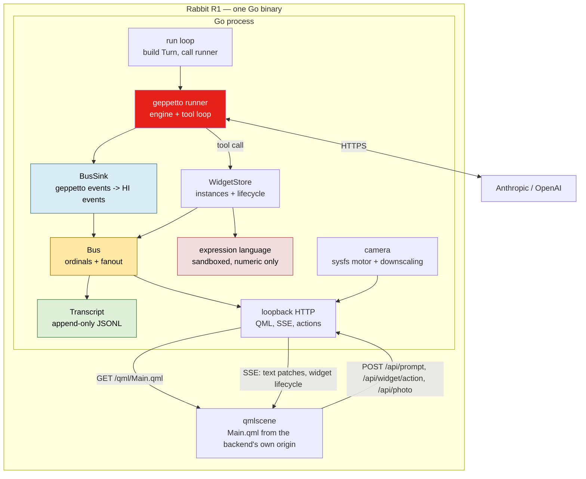

# R1 HI Assistant

HI is an AI engineering assistant for the Rabbit R1 running Ubuntu Touch. A question — typed, or a photograph taken with the device's rotating camera — produces an answer of roughly sixty words streamed onto a 240 × 282 pixel screen. When the answer would benefit from being interactive, the model does not describe a calculator in prose. It emits a specification for one, and the device renders that specification as a native QML widget with editable fields, a choice group, and a result that recomputes.

That last capability is the reason the project is interesting. Everything else — the conversation, the streaming, the packaging — is engineering that has been done before in this repository. Generative UI is not, and most of the design work went into making it typed, streamed, validated, extensible, and honest about where computation happens.

> [!summary]
> Four decisions define this system:
> 1. inference runs **on the device, in a Go process**, which serves its own QML over loopback HTTP
> 2. the `sessionstream` command/event/projection substrate was evaluated and **removed**, replaced by roughly 130 lines of bus
> 3. generative UI is a **typed tool call**, not a tag smuggled through the model's prose
> 4. expressions are evaluated by a **hand-written parser** rather than any general-purpose expression library

## Why this project exists

The starting point was a React prototype, `sources/hi-chat.jsx`, 339 lines. It already had the right interaction design: a hard style contract in the system prompt, a camera path that base64-encodes a JPEG into the message, a brutalist palette shared with the flashcard applications, and a generative calculator.

Two things it did are not portable, and they shaped the design more than anything else.

**It smuggled structured data through prose.** The model appended a `<ui>…</ui>` block containing minified JSON after its answer. The client extracted it with a regular expression, parsed it, and then — on every subsequent request — rewrote the model's own words to strip the block back out before sending the history:

```js
const toApi = (msgs) => msgs.map((m) => ({ role: m.role, content: m.content.map((b) =>
    b.type === "text" ? { …, text: b.text.replace(/<ui>[\s\S]*?<\/ui>/g, "").trim() || "…" } : b) }));
```

Four properties follow from that mechanism, all bad. A malformed brace makes `JSON.parse` throw and the calculator silently not appear. Two blocks mean only the first is seen. There is no schema the model is held to and no channel through which it can be told it produced a bad shape. And the tag cannot stream: it is only usable once the entire message has arrived.

**It called the provider API directly from the client, with no `x-api-key` header at all**, which means it only functioned behind a proxy that injected one. On a personal device that is a decision to be made rather than a detail to inherit.

The project exists to replace both mechanisms with typed ones, and to establish where each responsibility belongs when the runtime is a confined `.click` package on `ubuntu-sdk-20.04` with Qt 5.12.

## Current project status

All five planned phases are implemented and verified against a real provider on the desktop toolchain. **Nothing has run on the device.**

| Phase | Scope | Verified by |
| --- | --- | --- |
| 1 | headless text round trip | live answers from a real provider |
| 2 | bus, transcript, event sink | scripted `geppetto` event sequences; a 50-iteration subscribe/publish race |
| 3 | loopback HTTP, SSE, QML transcript | `curl -N` against the live stream; four screens rendered at 240 × 282 |
| 4 | generative UI widgets | the model produced a working buckling calculator; a resistor divider recomputed over HTTP |
| 5 | camera and click packaging | the model read a four-band resistor off a downscaled photograph |

Sizes: 4,033 lines of Go excluding tests, 2,879 lines of tests, 1,624 lines of QML. 110 tests, green under `-race`. The device binary is a 20 MB statically linked `arm64` ELF built with `CGO_ENABLED=0`.

What is missing:

- any execution on real hardware, which leaves the AppArmor profile unproven
- progressive widget arrival — the widget appears once its specification is complete rather than while it streams
- reasoning traces, which are received and deliberately dropped
- any offline mode beyond rendering a failed run calmly

## Decision 1: where the inference call lives

Three locations are plausible, and the choice determines everything downstream.

| | On the device, in QML | On a server, device as thin client | **On the device, in a Go process** |
| --- | --- | --- | --- |
| Credentials | in QML, or via a proxy | server-side, clean | in the Go process, on-device |
| Streaming | XHR against a vendor API | needs a protocol anyway | loopback, ours |
| Tool calls | hand-rolled JSON parsing | server-side | `geppetto` provides them |
| Reuse | none | some | all of `geppetto` |

The third column wins for a reason unrelated to preference: **the previous ticket already proved the pattern.** The Go build of the flashcard application runs a `CGO_ENABLED=0` binary on the R1 that serves its own QML over a loopback HTTP server, and `qmlscene` loads `Main.qml` from that server. The packaging, the loopback-origin technique, and the boot-screen affordance for screenshots all transfer unchanged.

The loopback-origin technique is worth restating because it removes an entire category of configuration. `Main.qml` is fetched over HTTP from the backend, so the backend's origin *is* the QML file's own origin:

```qml
Component.onCompleted: Backend.init(Qt.resolvedUrl(".."))
```

No port is injected anywhere. There are no context properties and no C++ bridge. State arrives as JSON over a stream and is held in QML.

## Decision 2: removing the substrate

The first draft of the design placed `sessionstream` underneath everything: commands in, canonical backend events out, UI projections for the live screen, timeline projections for a durable transcript, hydration for reconnect. That is the architecture `pinocchio`'s web chat uses and it is well constructed.

It is the wrong size for this application. The substrate earns its cost when several consumers need different views of one event stream, when sessions are numerous, and when reconnecting clients must rebuild state they never observed. HI has one user, one session, one consumer, and a client living in the same process tree as its backend. Subtracting those leaves a transcript file and a mechanism for pushing events at a screen.

Removing it drops a protobuf toolchain and `buf` code generation for every payload, a schema registry, two projection functions per feature, a hydration store implementation, and a policy gate.

Three ideas were kept because they are correct independently of the framework:

- **Handlers publish events rather than returning UI state.** The inference path emits events and something else decides what the screen does. This is what keeps the code that talks to Anthropic from knowing about QML.
- **A durable transcript, appended as events arrive.** A JSON-lines file, replayed on startup.
- **Ordinals.** A monotonic per-session counter on every event, so a client can request everything after *N* and detect gaps.

The replacement is `internal/hi/bus.go`, about 130 lines. The design predicted forty, which was optimistic by roughly three, but the shape held.

The event names and payload shapes are modelled on `pinocchio/pkg/chatapp` deliberately. Publishing them through a real `sessionstream` Hub later is a change confined to `bus.go` and schema registration — not to the handlers, the widgets, or the QML.

## Architecture



Layout:

```
apps/r1-hi-assistant/
├── main.go                      flags, profile resolution, qmlscene supervision
├── internal/
│   ├── inference/profiles.go    the registry chain, resolution, redaction
│   ├── hi/
│   │   ├── prompt.go            the system prompt, versioned
│   │   ├── run.go               the conversation and the run loop
│   │   ├── events.go            the HI event protocol
│   │   ├── bus.go               ordinals, fanout, subscribe-from-ordinal
│   │   ├── transcript.go        append-only JSONL, replay on startup
│   │   ├── sink.go              geppetto events -> HI events
│   │   └── widgets.go           widget instances and their lifecycle
│   ├── widgets/
│   │   ├── registry.go          widget kinds, by widget name and tool name
│   │   ├── calculator.go        the first widget: schema, limits, validation
│   │   └── eval.go              the sandboxed expression language
│   ├── camera/                  the MS35774 stepper; capture confinement
│   └── server/ui.go             loopback HTTP, SSE, actions
├── qml/                         the device UI, including the widget registry
└── clickable.yaml, manifest.json, *.apparmor
```

## Implementation details

### Credentials: engine profiles, and a design error corrected

The design document originally specified an HI-specific `credentials.json`, read from `$XDG_CONFIG_HOME`, with an `HI_API_KEY` environment variable and a `0600` permission check. That was implemented, tested, and then deleted.

The premise was a misreading. The `geppetto` repository states that *profiles do not configure engine/provider credentials; applications own final `StepSettings`*. What that rule means is that profile resolution does not happen inside the engine factory — the application must resolve a profile and hand over a finished settings object. It does not mean profiles hold no credentials. They plainly do; `~/.config/pinocchio/profiles.yaml` contains `api_keys:` entries. The comment on `geppetto`'s own runner example states the rule in the opposite direction from the assumption:

> Credentials must come from the profile stack; examples should not read provider API keys directly from process environment variables.

`geppetto/pkg/engineprofiles` is a first-class package with a YAML file store, chained registry sources, profile stacking, and a SQLite store. `internal/inference` was rewritten around it. HI names a registry chain and a profile slug; which provider, which model, which endpoint, and which key are the profile's business.

The default chain, highest priority first:

1. `$HI_PROFILES`, a comma-separated list — how the click package's launch environment points at the registry inside the confined app data directory
2. `~/.config/hi-assistant/profiles.yaml` — what a device image ships
3. `~/.config/pinocchio/profiles.yaml` — so a development machine already configured for the desktop tools needs no HI-specific setup at all

Entries that do not exist are dropped rather than treated as errors: a laptop lacks (2) and a device lacks (3), and both are normal.

Two constraints were discovered by building it, and both shape the device package.

**Profile stacking does not cross registries.** A device registry that stacks on a base profile in another file fails at load:

```
engine profile YAML registry validation failed: validation error
(registry.profiles[hi].stack[0]): referenced profile "claude-base" not found
in registry "hi"
```

A chained registry lets HI *find* a profile in any source but will not *compose* one across sources. The shipped registry must therefore be self-contained — flattened, with the API settings copied in. The flattening is the format, not a convenience.

**`default_profile_slug` is rejected by the YAML codec**, which points at the convention instead: a registry's default is the profile literally named `default`. HI names its profile `hi` and asks for it by name.

Two properties survived from the discarded design because they were right independently of where the key lives:

- The **permission check**, downgraded from a refusal to a warning. A registry holding `api_keys` and readable by more than its owner is a genuine exposure on a device running other confined applications, but `pinocchio`'s registry is not HI's file to decline to read. It fired correctly on the first real run.
- A **single audited redaction point**. `Resolved.Describe()` is the only path from configuration to a log line, `--show-config` output, or an HTTP response. A test marshals it and asserts the key does not appear.

### The runner layer

The design document describes wiring `Engine.RunInference` directly and attaching sinks with `events.WithEventSinks`. That is accurate but it is not the layer to build on. `geppetto/pkg/inference/runner` already packages this application's shape:

```go
r := runner.New(runner.WithFuncTool("render_calculator", description, fn))
_, handle, err := r.Start(ctx, runner.StartRequest{
    SeedTurn:   conversation,
    Runtime:    runner.Runtime{InferenceSettings: ss, SystemPrompt: prompt, ToolNames: names},
    EventSinks: []events.EventSink{sink},
})
out, err := handle.Wait()
```

`Start` returns a `*session.ExecutionHandle` carrying `Cancel()`, `Wait()`, and `IsRunning()` — the STOP button, the result, and the run-in-flight guard, all three already written. The tool loop arrives through the same call.

The conversation is a single `*turns.Turn` that grows: each run seeds from the current turn, and the turn the engine returns — now carrying the model's text, its tool calls, and their results — becomes the conversation for the next run. This is why HI needs no equivalent of the prototype's `toApi()`. Nothing is hidden from the model, because nothing was smuggled through its prose.

### The bus: three properties and two concurrency bugs

`Bus` has three responsibilities: assign ordinals, persist to the transcript, and fan out to subscribers. The interesting method is the one that replaces snapshot-before-live:

```go
func (b *Bus) Subscribe(fromOrdinal uint64) (<-chan Event, func())
```

It replays the transcript from that ordinal and then switches to live, under one lock, so an event published between taking the snapshot and registering the subscriber cannot fall into the gap between them.

The first implementation was written the obvious way — take the lock, assign an ordinal, copy the subscriber list, release the lock, then append and fan out. Both halves of that are wrong.

**Fanout outside the lock reorders events.** Two publishers can take ordinals 1 and 2 and then deliver 2 before 1. On a screen rendering a streaming message, a reordered text patch is visible corruption.

**Closing races sending.** `cancel()` closed a subscriber's channel while a publisher could be part-way through a send into it, which is a panic rather than a glitch.

Both disappear by holding one lock across ordinal assignment, transcript append, and fanout, and by performing the removal and close under that same lock. That is only safe because the fanout never blocks, which is the next decision:

```go
// deliver drops rather than blocks.
func (s *subscriber) deliver(event Event) {
	select {
	case s.events <- event:
	default:
		s.dropped = true
	}
}
```

A subscriber that stops reading is dropped rather than waited for. Blocking would let a stalled SSE connection stall inference itself, which is a far worse failure on a device with one screen. Dropping is safe *because* the transcript is durable: the client observes its channel close, reconnects with the last ordinal it rendered, and `Subscribe` replays the gap. There is a test that floods a non-reading subscriber with three buffer-lengths of events and asserts the publisher never blocks and the transcript still holds everything.

The race test is worth keeping. It runs subscribe-against-publish fifty times and asserts dense ordinals 1..20 on every iteration. Against the pre-fix implementation it fails within a few attempts.

**A truncated transcript tail is skipped rather than fatal.** The most likely cause of a malformed log is the device losing power mid-append, which truncates the last line. Refusing to start over a half-written event would convert a cosmetic loss into an unusable device. Unparseable lines are counted and reported as a warning, and the log remains appendable afterwards.

### The sink: two vocabularies, one file

`BusSink` is the only place in the application that speaks both `geppetto`'s event vocabulary and HI's. Because of that, a scripted event sequence run through it pins the entire wire protocol without a provider, a network, or a token spend. This is the highest-value test in the system.

The detail copied exactly from `pinocchio/pkg/chatapp/runtime_sink.go` is how a text delta becomes a wire patch — an **offset plus a delta**, never the accumulated string:

```go
bus.Publish(EventTextPatch, TextPatch{
    MessageID: messageID,
    Sequence:  ev.Sequence,
    Offset:    PatchOffset(ev.Text, ev.Delta),  // len(snapshot) - len(delta)
    Text:      ev.Delta,
    Mode:      "append",
})
```

Sending the whole message on every token is quadratic in message length and makes a duplicated frame indistinguishable from a real one. An offset plus a delta is small on the wire and idempotent: a client replaying from an ordinal can apply the same patch twice and arrive at the same string. A test rebuilds a message from its patches to prove it.

**Message identifiers departed from `pinocchio`'s scheme after measuring it.** That scheme composes the run identifier with the provider's segment identifier. Against Claude the result is:

```
"messageId":"238d4b63-c223-47b7-a8b4-d1de2c89d146:text:claude:claude:msg_011CdukpMXid72kXzujzfC77:block:0:text"
```

Ninety characters, repeated in every one of a dozen text patches per reply, plus the segment-started and segment-finished events. Anthropic's segment identifier already contains the provider name twice and the message identifier once; composing it with a UUID compounds that.

HI allocates short local identifiers — `m1`, `m2`, `m3` — and uses the provider's segment identifier as a **map key** rather than as a value. That preserves the property the original scheme existed for, which is that a segment keeps one identity when its events arrive out of order, while what travels on the wire stays short. Uniqueness within the session is all a client needs.

```
1 hi.user_message   {"messageId":"m1","text":"what torque for an M6 bolt in steel","hasImage":false}
4 hi.text_patch     {"messageId":"m2","sequence":0,"offset":8,"text":" M6 property class 8.8…"}
```

### The event protocol

| Event | Payload |
| --- | --- |
| `hi.user_message` | `{messageId, text, hasImage}` |
| `hi.run_started` | `{runId, messageId}` |
| `hi.text_segment_started` | `{messageId, role}` |
| `hi.text_patch` | `{messageId, sequence, offset, text, mode:"append"}` |
| `hi.text_segment_finished` | `{messageId, text, finishReason}` |
| `hi.run_finished` | `{runId, inputTokens, outputTokens, stopReason, durationMs}` |
| `hi.run_failed` / `hi.run_stopped` | `{runId, error}` |
| `hi.widget_started` | `{instanceId, widgetName, parentMessageId, status, props, error}` |
| `hi.widget_patched` | `{instanceId, widgetName, status, patch}` |
| `hi.widget_completed` | `{instanceId, status, error}` |
| `hi.widget_removed` | `{instanceId}` |

Everything else `geppetto` emits — reasoning segments, provider-call metadata, web search progress, the tool lifecycle before it becomes a widget — is deliberately not forwarded. A 240 pixel screen has room for the answer, not for the machinery, and each event the client does not need is one it pays to parse.

### Streaming: server-sent events over QML's XMLHttpRequest

`sessionstream` ships a websocket transport, and `import QtWebSockets 1.1` is the obvious client. It is a separate QML module — `qml-module-qtwebsockets` — not installed on the development machine and not guaranteed on the R1 image. Taking a runtime dependency that might be absent on the target, for a single stream, is a poor trade.

The alternative is server-sent events over QML's own `XMLHttpRequest`, which requires no modules at all — *provided* XHR surfaces partial bodies. That was tested rather than assumed, with a Python server flushing six chunks 400 ms apart:

```
qml: PARTIAL at readyState 3, len=15 new="data: chunk-0\n\n"
qml: PARTIAL at readyState 3, len=30 new="data: chunk-1\n\n"
…
qml: DONE, total len=90, incremental notifications=6
```

One notification per flushed chunk, in order, with no buffering surprise.

The reader in `qml/Backend.js` handles the two consequences of that mechanism:

1. **A notification can arrive mid-frame.** Only frames terminated by a blank line are dispatched; the remainder stays buffered until the rest arrives.
2. **`responseText` is cumulative, not incremental.** Each notification carries the whole body so far, so the reader tracks how much it has consumed rather than re-parsing from the start.

```js
xhr.onreadystatechange = function () {
    if (xhr.readyState === XMLHttpRequest.LOADING || xhr.readyState === XMLHttpRequest.DONE) {
        var whole = xhr.responseText;
        if (whole.length > stream.consumed) {
            stream.buffer += whole.substring(stream.consumed);
            stream.consumed = whole.length;
            drainFrames(stream, onEvent);
        }
    }
};
```

The SSE `id:` field carries the ordinal, which makes reconnection cheap: the client remembers the last identifier it rendered and requests everything after it. The QML treats a closed response as normal and reconnects after one second, because it *is* normal — the bus drops a client that falls behind and this is the recovery path.

Measured behaviour worth recording: Claude's deltas are chunky. A 220-character reply arrived in seven patches, not seventy. Whatever an SSE frame costs, it is not paid per token.

## Generative UI

This is the part of the prototype worth rebuilding rather than porting.

### The replacement for the tag

The specification is a **tool call**. `geppetto` already has typed tool calling with a streaming lifecycle, so the widget specification travels as arguments the provider validates against a JSON schema before delivering.

```
model calls render_calculator      provider validates against the JSON schema
  → Prepare validates the rest     limits, identifiers, cross-field invariants
  → hi.widget_started {props}      the device renders it
  → POST /api/widget/action        the user changes an input
  → hi.widget_patched {patch}      one update mechanism, not two
```

Point for point against the prototype's failures: the specification never touches the prose, so history rewriting disappears; a malformed specification becomes a tool error the model can read and retry rather than a silently missing widget; the four-field and one-choice-group limits move from prose instructions into checked code; and adding a second widget type means adding a file rather than editing a parser.

### The registry, and two names for one widget

The client-side design is `react-chat`'s widget registry translated to QML. A widget is resolved **by name**, so the backend and the client are coupled through a string rather than through a shared type. The consequence is the useful one: a backend that has learned a new widget can publish it to a client that has not, and the client renders something rather than nothing.

```js
// qml/widgets/Registry.js
var components = { "hi.calculator": "Calculator.qml" };

function componentFor(name) {
    if (name && components.hasOwnProperty(name))
        return components[name];
    return "UnknownWidget.qml";           // never blank
}
```

`UnknownWidget.qml` renders a labelled box with the raw properties pretty-printed. This is the same never-blank principle the flashcard applications apply to formulas they cannot typeset, and it means deploying the two halves is not a lockstep operation.

There is a naming trap worth stating precisely. **Tool** names are provider-facing and must match `^[a-zA-Z0-9_-]+$`, so they cannot contain dots. **Widget** names have no such constraint and are namespaced. HI therefore uses `render_calculator` for the tool and `hi.calculator` for the widget, and a test walks the registry asserting no kind uses the same string for both — because conflating them fails only at the provider.

That naming split has a structural consequence. `geppetto` generates a tool's JSON schema from the *parameter type* of the registered function, which is the main advantage this design has over an untyped tag. A generic `func([]byte) (string, error)` produces a useless schema. So the `Kind` interface carries an indirection:

```go
type Kind interface {
	Name() string       // hi.calculator
	ToolName() string   // render_calculator
	Description() string
	NewToolFunc(create func(arguments []byte) (string, error)) any
	Prepare(arguments []byte) (State, error)
	Act(state State, action string, values map[string]float64) (map[string]any, error)
}
```

Each kind returns a concretely typed closure — for the calculator, `func(ctx, CalculatorSpec) (string, error)` — which marshals back to bytes and forwards. The round trip through JSON looks wasteful and is deliberate: `Prepare` accepts bytes because that is what the streaming tool-call events carry, and one validation path is worth a marshal per widget.

### Validation at the boundary, in Go

`rag-ttc`'s widgets validate properties with a zod schema per widget: `schemaVersion: z.literal(1)`, `.strict()` so unknown keys are an error, and `superRefine` for cross-field invariants. Three habits worth copying even without zod.

In HI that validation belongs in **Go**, not QML, and the placement is the point: the backend already holds the schema it handed the model, so it is the only party that can tell the model it was wrong.

```go
func (spec *CalculatorSpec) Validate() error {
	// … title, field count, identifier syntax, duplicate and shadowing checks …

	expression, err := Parse(spec.Result.Expr)
	if err != nil {
		return fmt.Errorf("result expression: %w", err)
	}
	for _, variable := range expression.Variables() {
		if !seen[variable] {
			return fmt.Errorf("result expression uses %q, which is not a field or choice id", variable)
		}
	}
	return nil
}
```

That last check is the one most worth having. A formula naming something the user cannot edit produces a widget that renders and then displays an error, which is worse than one that never renders. A specification that also fails to evaluate at its own starting values is rejected for the same reason.

A rejection reaches **both** parties. The model receives a tool error naming the problem. The screen receives `hi.widget_started` with `status: ERROR` and the same message. Nothing fails silently in either direction — which is precisely the channel the `<ui>` tag never had.

### Where the arithmetic happens, and why the parser is hand-written

The prototype evaluated its expressions with `mathjs` in a browser. The device has no `mathjs` and QML has no mathematics parser, so evaluation moves to Go. The question is then which evaluator.

Re-implementing a parser in QML was rejected: it would be subtly wrong for months. Asking the model to recompute on every field edit was rejected too: a round trip and a token spend for pressing a button, plus non-deterministic arithmetic.

That leaves a Go expression library or a written one, and the conclusion after surveying the options is that **every general-purpose Go expression library is designed to be extended with host functions**, and several make the environment's methods callable by default. When the expressions are authored by a model, an expression language that can reach the host is a remote code execution primitive. Auditing a library for that property is more work than not having the capability.

`internal/widgets/eval.go` is therefore a recursive-descent parser, roughly 250 lines with no dependencies. It evaluates numbers and nothing else. There is no production for a string, a method call, an index, or a field access, so none of them can be *expressed*:

```
expr    := term (('+'|'-') term)*
term    := power (('*'|'/'|'%') power)*
power   := unary ('^' power)?            // right-associative
unary   := ('-'|'+') unary | primary
primary := number | ident | ident '(' args ')' | '(' expr ')'
```

Rejecting by default rather than by blocklist is what keeps the language closed, and there is a test that throws fourteen shapes at it — `"hello"`, `os.Exit(1)`, `a.b`, `a[0]`, `a && b`, `$env`, backticks, `a ? b : c` — and asserts every one fails to parse.

Two limits are enforced during parsing: a 512-byte cap on the source, so a pathological input is rejected before it is examined, and a 200-node budget bounding work and recursion depth together.

The node budget was initially set wrong, in an instructive way. At 256 the *length cap* was the binding constraint on nesting: 512 bytes permits at most 255 nested parentheses, which is under the budget, so a deeply nested expression was rejected for being long rather than for being deep. That is a coincidence of two numbers rather than a guarantee — change either and the stack is exposed again. Lowering the budget to 200 makes it genuinely bind, and there are now two separate tests, one for breadth and one for nesting, each asserting the budget is what rejects.

The worked example carried over from the prototype's own system prompt evaluates correctly:

```
(pi^2*(E*1e9)*I)/((K*L)^2)     E=200, I=1.2e-5, L=3.4, K=1  →  2.05 MN
```

Exponentiation is right-associative — `2^3^2` is 512, not 64 — matching `mathjs` and standard mathematical notation.

### The security rule, stated as an invariant

**The device never posts a string the backend evaluates.**

An action carries an instance identifier, an action name, and numbers. The formula lives server-side, attached to the instance, produced by the model and validated before the widget was published. A client may set declared inputs and may not introduce new ones:

```go
for id, value := range values {
	if _, declared := state.Values[id]; !declared {
		return nil, fmt.Errorf("unknown input %q", id)
	}
	merged[id] = value
}
```

Verified against the running backend:

```
POST /api/widget/action {"instanceId":"w1","action":"calculate","values":{"R2":3300}}
→ {"ok":true,"patch":{"result":{"formatted":"1.24","value":1.2406015037593985,…}}}

POST /api/widget/action {"instanceId":"w1","action":"calculate","values":{"rm":1}}
→ {"error":"unknown input \"rm\"","ok":false}

POST /api/widget/action {"instanceId":"w1","action":"exec","values":{}}
→ {"error":"unknown action \"exec\"","ok":false}
```

The first result is 5 × 3300/13300 = 1.2406 V, which is correct.

### A single action channel

An earlier draft of the design invented `POST /api/calc`, specific to the calculator. `pinocchio`'s `ChatWidgetAction` is the better shape: one channel for every widget's interactions, and the response is a **patch** applied through the same path as a streamed patch. A widget therefore has one update mechanism rather than two, and a future table widget will not need `POST /api/sort`.

## The camera

The R1's camera is mounted on an MS35774 stepper that physically turns the assembly between facing the user and facing away. `apps/r1-camera-almanach` reaches it from C++, and the assumption was that HI would need to as well.

It does not. The kernel exposes the whole driver as one sysfs attribute:

```
/sys/devices/platform/step_motor_ms35774/orientation   # 0 away, 1 towards
```

Two file operations, which Go performs without native code — so `internal/camera` keeps the application CGO-free. The only C++ in the tree is the `qml-runner` test harness, which does not ship.

The detail carried over verbatim from the almanach, because it would be an afternoon to rediscover, is that the **image orientation depends on which way the assembly points**: the viewfinder is rotated 90° in one position and 270° in the other, and the still preview is a further 180° relative to the viewfinder.

```qml
VideoOutput {
    orientation: pane.motorOrientation === 0 ? 90 : 270
}
Image {
    rotation: pane.motorOrientation === 0 ? 180 : 0
}
```

### Capture handover: a filename, and therefore a confinement

QML's `XMLHttpRequest` has no good mechanism for sending a binary file, and both halves of this application are the same process tree on the same device. A capture is therefore handed over as a **path**: QtMultimedia writes to a directory the backend named, and the client posts that filename.

That makes `/api/photo` the one route where the device names a file the backend opens, which is a file-disclosure primitive if left open. It is confined to the capture directory, and the check resolves symlinks on **both** sides before comparing:

```go
root, err := filepath.EvalSymlinks(p.captureDir)
candidate, err := filepath.EvalSymlinks(filepath.Clean(path))
relative, err := filepath.Rel(root, candidate)
if err != nil || relative == ".." || strings.HasPrefix(relative, ".."+string(filepath.Separator)) {
	return "", fmt.Errorf("capture path is outside the capture directory")
}
```

A symlink *inside* the capture directory pointing outside it is exactly what a prefix comparison on the raw path would miss. Three escape shapes plus a symlink are tested.

### Downscaling as a cost control

A photograph is the expensive part of a request. A sixty-word reply is cheap and an image is not. Captures are scaled to fit 768 pixels and re-encoded at JPEG quality 80. `CatmullRom` rather than nearest-neighbour resampling, because reading component markings is the point and aliased text is unreadable.

A 1600 × 1200 test capture became 10.5 KB at 768 × 576. Verified end to end against a real provider with a synthetic four-band resistor:

```
hi.user_message  {"messageId":"m1","text":"what is in this picture","hasImage":true}
hi.text_segment_finished
  {"text":"4-band resistor. Bands: brown(1), black(0), red(x100), gold(±5%).
           \n\nValue = 10 x 100 = 1000 Ω = 1 kΩ, 5% tolerance."}
```

It read the colour bands correctly from the downscaled image, which is the question the scaling decision was risking.

### Graceful absence

Every camera method is safe on a machine with no such device, which is every machine except the R1. `Available()` returns false, `Status()` reports it, and the TURN control disables itself. That is what permits the entire application to be built and screenshotted on a desktop with neither a stepper nor a viewfinder.

A denied *write* is distinguishable from a missing *device*, because under confinement the read can succeed while AppArmor refuses the write, and those need different responses.

`QtMultimedia` is a separate QML module — the same class of dependency the streaming transport deliberately avoided — so `CameraPane.qml` sits behind a `Loader` with `active: false`. A device image lacking the module fails to open the camera rather than failing to start.

## Screens

Rendered at the device's true 240 × 282 panel size. `QT_QPA_PLATFORM=offscreen` is required: with a window manager the view is whatever the manager decides — 951 × 626 under this tiling setup — and `SizeRootObjectToView` scales the design pixels up, which flatters the layout.

A finished exchange, and a run that failed while out of signal:

![[Attachments/r1-hi-assistant/answer.png]]
![[Attachments/r1-hi-assistant/failed.png]]

Mid-stream, and a question answered from a photograph:

![[Attachments/r1-hi-assistant/streaming.png]]
![[Attachments/r1-hi-assistant/photo.png]]

The generative calculator, a rejected specification, and a widget name this client does not know:

![[Attachments/r1-hi-assistant/widget.png]]
![[Attachments/r1-hi-assistant/widget-error.png]]
![[Attachments/r1-hi-assistant/widget-unknown.png]]

The screenshots are driven from **fixture transcripts** rather than from a provider. Four to eight JSON-lines events that the backend replays on connect, through exactly the same snapshot-before-live path a reconnecting client uses. That is deterministic, costs no tokens, and still exercises the real code rather than a mock. Mid-stream is the state most worth a fixture: a segment started and patched but never finished is otherwise a two-second window to catch by hand.

## Failures worth recording

**Two `hi.run_finished` events per run.** A run that calls a tool makes several provider calls, and publishing `hi.run_finished` on every `EventProviderCallFinished` told the UI the run was over while the answer was still arriving — the STOP button vanished mid-stream. Usage is now accumulated in the sink and published exactly once from `EndRun`, summed across provider calls as it is billed, with the last call's stop reason: an intermediate `tool_use` is how the loop continued, not how it ended.

**A QML binding loop.** `text: String(widget.valueFor(id))` on a field, with `onTextChanged` writing back through `setValue`, is a loop, and Qt reports it three times per render. The fix is to *assign* rather than bind — a read-only `backendValue` property, an assignment in `Component.onCompleted`, and a refresh on change that is skipped while the field holds focus, so a patch arriving mid-edit does not remove text from under the user.

**The error widget needed a routing rule finer than "errors use the fallback."** A widget rejected *at creation* has no properties, so its own component has nothing to draw: the first screenshot showed a calculator with the title CALCULATOR, no fields, a button that did nothing, and the reason elided. A widget that errors *after* rendering, from a failed calculation, keeps its own component because it still has fields worth editing. The outlet therefore routes on `status === "ERROR" && isEmpty(props)`, not on status alone.

**A test-only data race, worth fixing anyway.** The SSE test's frame reader collected into a slice shared with a goroutine that outlives a timeout. `-race` passed, because the timeout never fires on a succeeding run — which is precisely the problem. The race would appear only on a *failing* run, when a clear message matters most. Frames now travel over a channel.

**`pkill -f` killed the session's own shell**, exit 144, the same way it did in the flashcard ticket. The capture script already kills by PID with a comment explaining why; the mistake was made in an ad-hoc command outside it.

## Device and toolchain constraints

**`qmlscene` is not really installed.** `/usr/bin/qmlscene` exists but is a `qtchooser` shim: `could not exec '/usr/lib/qt5/bin/qmlscene': No such file or directory`. `dpkg -L qtdeclarative5-dev-tools` lists `qmllint`, `qmlformat`, and nine others, but neither `qmlscene` nor `qml`. The flashcard ticket's `tools/qml-runner.cpp` — thirty lines with `--screenshot` and `--quit-after` — remains the way this is tested.

`qmllint` *is* installed, and is now part of the test suite, so a QML syntax error is a test result rather than a blank screen on a device.

**Directory imports do not work over HTTP.** Qt cannot list a remote directory, so every component directory needs a `qmldir` naming every component. A local build works without one; a build that serves its own QML does not. There is a test that walks the QML tree and asserts every directory containing components has a `qmldir` listing all of them.

**The Clickable container's Go is 1.13**, far too old for this application, which needs `go:embed` and a toolchain new enough for `geppetto`. Since the binary is CGO-free the host cross-compiles it and the custom builder only copies it in.

**`geppetto`'s `engineprofiles` imports `mattn/go-sqlite3`**, which is cgo. It ships a `!cgo` stub, so `CGO_ENABLED=0` still builds and only a `sqlite:` registry source would fail at run time. HI's registries are YAML. The cost is binary size: 20 MB against the flashcard build's 6.1 MB.

**The published module matches the local checkout.** `runner`, `settings`, `tools`, and the canonical tool events are byte-identical between `v0.13.9` in the module cache and `~/code/wesen/go-go-golems/geppetto`, so the application takes an ordinary versioned dependency with no `replace` directive and builds on a machine that has never seen the go-go-golems checkout.

**AppArmor cannot express what the camera motor needs.** The profile requests `networking` (the outbound provider call — the loopback server needs no group), `camera`, and `video_files`. No policy group covers writing a raw sysfs attribute. Under confinement the rotation is *expected* to be denied, which is why the motor reports unavailability rather than failing. Reaching it requires an unconfined template or a custom profile, which is a device-policy decision rather than a packaging one.

## Testing and tooling

110 tests, green under `-race`.

| Package | Tests | What it pins |
| --- | --- | --- |
| `internal/hi` | 36 | the wire protocol, via scripted `geppetto` event sequences; bus ordering and replay; the widget lifecycle |
| `internal/widgets` | 31 | the expression language and its sandbox; specification validation; the tool/widget name split |
| `internal/server` | 19 | every route over `httptest`; SSE replay-then-live ordering; `qmldir` completeness; `qmllint` over the whole tree |
| `internal/inference` | 13 | the profile chain; permission warnings; that `Describe()` never carries a key |
| `internal/camera` | 11 | capture confinement including symlinks; downscaling; motor absence and denial |

Two tooling notes. The screenshot script uses a **fixture profile registry** with a placeholder key, because HI refuses to start without a resolvable profile and a capture should not depend on the operator having one. And `scripts/01-dev-profile.sh` builds HI's self-contained registry from an existing `pinocchio` profile, never echoing the key, creating the file `0600` *before* the secret is written so there is no window at the default umask.

## Important project docs

- `ttmp/2026/08/10/R1-HI-ASSISTANT--…/design-doc/01-hi-assistant-analysis-design-and-implementation-guide.md` — the analysis, design, and implementation guide, revised in place when §13.3 turned out to be wrong
- `ttmp/2026/08/10/R1-HI-ASSISTANT--…/reference/01-investigation-diary.md` — the chronological record, including every failure above
- `apps/r1-hi-assistant/README.md` — how to run it, and the loopback API
- `sources/` — snapshots of `hi-chat.jsx`, the `geppetto` interfaces, `pinocchio`'s chat app and widget plugin, `react-chat`'s registry, and `rag-ttc`'s widget validation. The `sessionstream-*` files remain as the record of a rejected architecture.

## Open questions

- **Nothing has run on the device.** Unverified on hardware: the AppArmor profile, the sysfs write that turns the camera, `QtMultimedia`'s presence on the R1 image, and text entry through Ubuntu Touch's on-screen keyboard on a 240 pixel panel.
- **Text entry is the weakest part of the design.** The camera is the input this device is good at; the text field exists because it is the only general one available. Worth revisiting with the scroll wheel and side button once the application has been used on hardware.
- **Progressive widget arrival is not implemented.** The design has a widget appearing with partial properties while tool arguments stream. What is built publishes complete properties once the arguments are whole, because a half-arrived specification cannot be validated against its own expression. Claude's arguments arrive in a handful of chunks over roughly two seconds, so this is a real difference on screen — degraded rather than broken, and the lifecycle events are already the right shape to add it.
- **The bus is a deliberate simplification.** Revisit if a second consumer of the event stream appears — a companion desktop client, or an export path.
- **Cost per interaction is measured but not budgeted.** A text answer is roughly 240 input and 100 output tokens; a tool call plus its follow-up is roughly 3,000 input; a photograph is roughly 2,000 input. There is no cap or warning.

## Near-term next steps

1. Install the click package on the device and find out which of the four hardware unknowns above is actually a problem.
2. Add progressive widget arrival from `EventToolCallArgumentsDelta`, publishing `started` with `status: STREAMING` and patching the title as it appears.
3. Add a second widget kind. The registry, the outlet, the fallback, and the action channel were all built for this, and none of them has been exercised by a second implementation — which is the only way to find out whether the abstraction is real.
4. Decide what happens offline beyond a calm failure: the transcript is readable, but there is no notion of a queued question.

## Project working rule

Each phase must be independently demonstrable against a real provider before the next one starts, and every non-obvious decision goes in the diary with the evidence that produced it. Four of the five phases surfaced a bug that only a live run would have found — two `run_finished` events, a binding loop, ninety-character message identifiers, and an error widget with nothing to draw. None of them would have appeared in a unit test written against the design.

## Related notes

- [[PROJ - R1 Math Flashcards - Typesetting Mathematics for a Device That Cannot Typeset]] — the sibling application that established the loopback-origin pattern, the `qmldir` rule, and the Go-serves-its-own-QML packaging this project reuses wholesale
