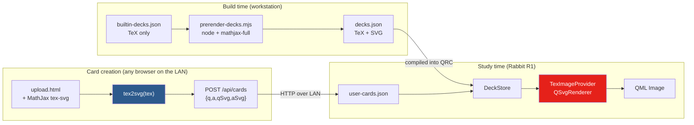
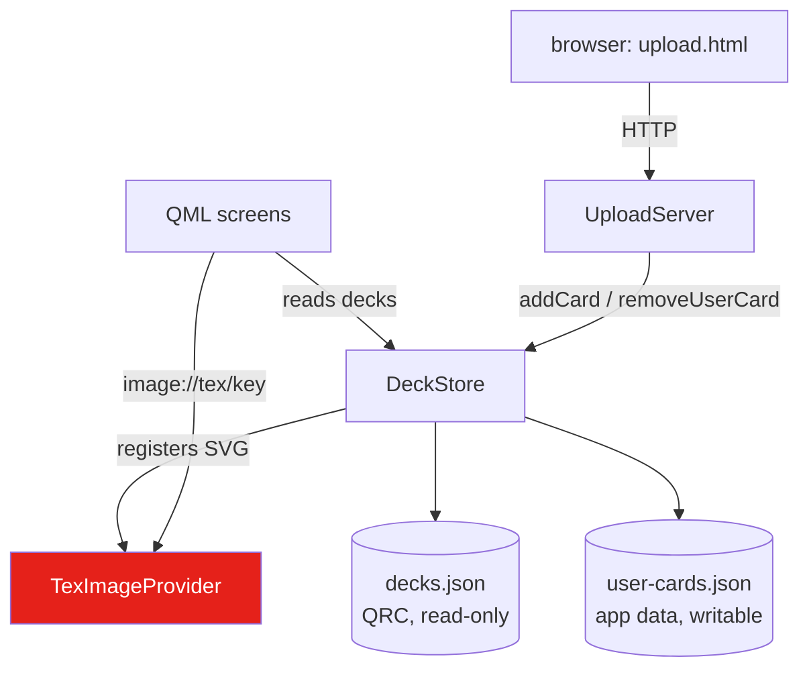

# R1 Math Flashcards

This project is a mathematics flashcard application for the Rabbit R1 running Ubuntu Touch. The cards carry real typeset mathematics — fractions, integrals, matrices, multi-line quantifier statements — on a 240 × 282 pixel screen. The interesting engineering problem is not the study loop, which is a small state machine. It is that the device cannot run a TeX engine, and cannot practically accept typed input, and yet must display arbitrary user-authored formulas.

> [!summary]
> The project has three identities worth separating:
> 1. a port of an existing React prototype to a native Clickable/QML application
> 2. a demonstration that typesetting can be moved entirely out of the runtime, into build time and into a third-party browser
> 3. a small, explicit HTTP server used to make a keyboard-less device authorable from any machine on the same network

## Why this project exists

The starting point was a React prototype (`sources/math-flashcards-v2.jsx` in the ticket workspace) that already had the right interaction design: a brutalist near-black palette with one accent red, a cursor model driven by a scroll wheel, and cards whose question and answer are TeX strings. It ran in a browser, where MathJax is available, `localStorage` exists, and two `<input>` elements are a reasonable card editor.

None of those three assumptions survives a move to the device. The R1 is a confined `.click` package on `ubuntu-sdk-20.04` with Qt 5.12. There is no node runtime available to a confined application, and there will not be one. Its display is 240 pixels wide, which makes a full browser engine an absurd dependency for a formula box. Its text entry is bad enough that an on-device card editor is not a feature but a punishment.

The project exists to establish where each of those three responsibilities actually belongs when the runtime cannot hold them.

## Current project status

The application is implemented and verified on the desktop toolchain. Nothing has run on real hardware yet.

What exists:

- a Clickable/CMake application at `/home/manuel/code/wesen/r1-camera-almanach/apps/r1-math-flashcards`, sibling to the existing `r1-camera-almanach` app and matching its packaging conventions
- four screens in pure QtQuick — deck picker, study loop, session summary, and an uploader control screen
- 21 built-in cards across three decks, prerendered to MathJax SVG at build time
- a `QTcpServer`-based HTTP server exposing a five-route card API on the LAN
- a self-contained browser page that performs TeX typesetting and posts finished SVG to the device
- three test executables: 36 deck-store assertions, 29 HTTP assertions over real sockets, and a QML load test covering all four screens

What is missing:

- any execution on the device itself, which means the AppArmor profile is unproven
- spaced repetition; scoring is per-session, as in the prototype
- editing a card in place, and creating new decks
- confirmation that the hardware scroll wheel produces key events under Ubuntu Touch

## The central design decision

The device cannot typeset. That single fact determines the architecture, and the useful way to state the conclusion is not "we precompute the formulas" but something stricter:

**A formula is typeset exactly once in its life, and never on the device.**

There are exactly two moments at which a formula can come into existence, and each gets its own typesetting environment:

| Moment | Environment | Produces |
|---|---|---|
| Build time | node + `mathjax-full`, `tools/prerender-decks.mjs` | the 21 built-in cards, baked into `decks/decks.json` |
| Card creation | the author's own browser, running `web/upload.html` | one user card, posted to the device as SVG |
| Study time | the device | nothing — it only rasterises |

The second row is the one that resolves the text-entry problem at the same time. Authoring cannot happen on the device because there is no keyboard; it therefore happens on a machine that has one; that machine has a browser; a browser is precisely the environment in which MathJax runs. The constraint and its solution are the same object, which is why the uploader is not a workaround bolted onto the design but the load-bearing part of it.



The consequence worth stating explicitly: the device's rendering path contains no JavaScript at all. `QSvgRenderer` produces a `QImage`, a `QQuickImageProvider` hands it to an `Image` element, and that is the entire pipeline. The package has no web engine dependency, and study screens are instant because there is nothing to interpret.

### Alternatives, and why they were rejected

Four other shapes were available, and each fails on a specific constraint rather than on taste.

Embedding a webview and rendering TeX at display time is the obvious approach and the one that a browser-first prototype naturally suggests. It fails on cost: QtWebEngine is tens of megabytes of RAM and disk, and it would be instantiated to draw a fraction bar on a screen the size of a matchbox. Communication is asynchronous, and styling a webview to blend with QML chrome is fiddly work with no payoff.

A refinement of that idea — instantiate the webview *only* on an editor screen, extract the SVG when the user saves, and cache it — is genuinely clever, and it was the starting proposal for this project. It fails on a subtler point: the webview remains a package dependency even when it is only used on one screen, so the disk and memory footprint is paid regardless; only the runtime cost during study is saved. And it still requires typing TeX on a device with no keyboard. Moving the editor to the network removes both problems at once.

KaTeX in place of MathJax remains viable and is documented as an option. It is smaller and synchronous, and every formula in the current decks falls within its coverage. MathJax won on breadth, because user-authored cards are not bounded by what the built-in decks happen to use.

Pre-rendering to PNG rather than SVG fails immediately. A raster is resolution-locked, cannot be recoloured, and would have to be stored twice — see the discussion of `currentColor` below.

## Architecture

The dependency graph is strictly one-directional, which is what keeps each component testable in isolation:



`DeckStore` knows nothing about HTTP. `UploadServer` knows nothing about QML. `TexImageProvider` knows nothing about decks — it is a keyed collection of SVG documents with a rasteriser attached.

Source layout:

| Path | Responsibility |
|---|---|
| `decks/builtin-decks.json` | TeX source of truth, human-edited |
| `decks/decks.json` | generated and committed; the same decks with SVG baked in |
| `tools/prerender-decks.mjs` | build-time TeX → SVG conversion |
| `tools/fetch-mathjax.mjs` | optional offline MathJax bundle for the uploader |
| `src/deckstore.{h,cpp}` | built-ins plus user cards, merged for display; JSON persistence |
| `src/teximageprovider.{h,cpp}` | SVG string → `QImage`, with recolouring and sizing |
| `src/uploadserver.{h,cpp}` | HTTP/1.1 on `QTcpServer`; the LAN card API |
| `qml/` | `Main.qml`, `screens/`, `components/`, `Theme.js`, `TexUnicode.js` |
| `web/upload.html` | the card editor, which runs in someone else's browser |

## Implementation details

### The image provider, and three problems MathJax creates

`TexImageProvider` is the most subtle file in the codebase, and each of its three design features exists to solve a specific problem that only appears once you take MathJax's SVG output out of a browser and try to render it standalone.

QML consumes the provider as a URL:

```qml
Image { source: "image://tex/ANLY/0/a/0?fg=e5211a" }
```

**Problem one: the payload is large and the binding layer is not free.** A single typeset formula is five to ten kilobytes of markup. If the view model handed to QML carried SVG strings directly, every binding re-evaluation would copy them across the QML/C++ boundary. `DeckStore` therefore registers each formula in the provider under a stable key of the form `<deckId>/<index>/<side>/<line>`, and only that short key reaches QML. The markup stays in a `QHash` on the C++ side, behind a `QReadWriteLock` because `requestImage()` runs on the QQuickPixmap reader thread while registration happens on the GUI thread.

**Problem two: `currentColor` has no meaning outside a document.** MathJax emits its glyph paths with `stroke="currentColor" fill="currentColor"`, expecting the surrounding CSS cascade to supply a value. Rendered standalone, `currentColor` resolves to black, and black on a `#0b0b0b` background is nothing at all. The provider parses `?fg=RRGGBB` out of the request id and performs a string replacement before handing the markup to `QSvgRenderer`:

```cpp
QColor foreground(QStringLiteral("#") + query.queryItemValue(QStringLiteral("fg")));
if (!foreground.isValid())
    foreground = QColor(Qt::white);
svg.replace(QStringLiteral("currentColor"), foreground.name(QColor::HexRgb));
```

The payoff is that one stored formula draws as ink white on the question side and as accent red on the answer side, with nothing duplicated on disk. A PNG pipeline would have required storing every formula twice.

**Problem three: the SVG declares its size in units Qt will not resolve.** The root element looks like this:

```xml
<svg style="vertical-align: -1.75ex;" width="20.126ex" height="5.053ex"
     viewBox="0 -1460 8895.5 2233.3">
```

`ex` is a typographic unit relative to a font that does not exist in this rendering context, and `QSvgRenderer::defaultSize()` cannot be trusted with it. The viewBox, however, is reliable, and MathJax's internal grid is 1000 units per em. That is enough to compute a size:

```
natural_height_px = viewBox.height / 1000 * PIXELS_PER_EM
natural_width_px  = viewBox.width  / 1000 * PIXELS_PER_EM
```

`PIXELS_PER_EM` is 48, which is a deliberate 3× supersample of the roughly 16 pixels the R1 actually displays. QML then scales the raster down, and downscaling a supersampled raster is what keeps a fraction bar from disintegrating. Both edges are capped at 1024 pixels with the aspect ratio preserved.

### Layout policy in two lines of QML

`TexLine.qml` contains the entire sizing policy for a formula, and it is worth reading closely because it is where the provider's 48 px/em convention meets the card's requested em size:

```qml
readonly property real emScale: app.px(emSize) / 48

readonly property real fit: implicitWidth * emScale > maxWidth
    ? maxWidth / (implicitWidth * emScale)
    : 1

width:  implicitWidth  * emScale * fit
height: implicitHeight * emScale * fit
```

The first expression scales the supersampled raster down to the em size the card asked for. The second shrinks it further if the result would still be wider than the card allows. The consequence is a policy rather than a heuristic: **a formula is never clipped, it only gets smaller.** On a 240 pixel screen that is the right trade, because a truncated integral sign is worse than a small one.

### The double render, preserved from the prototype

The React component rendered its content twice: first a synchronous unicode approximation produced by a chain of regular expressions, then real MathJax once the CDN script had loaded. That is not a hack. It is the reason the prototype was never blank — not while loading, not offline, not when the CDN was unreachable.

The QML port keeps the property by porting `texToUnicode()` verbatim into `qml/TexUnicode.js` and wiring it as the fallback branch of `TexLine`:

```qml
readonly property bool useArt: texKey !== "" && art.status === Image.Ready

Image { visible: useArt;  source: "image://tex/" + texKey + "?fg=" + Theme.fg(color) }
Text  { visible: !useArt; text: TexUnicode.toUnicode(tex) }
```

Because the provider returns a null `QImage` for an unknown key or invalid markup, `status` never reaches `Image.Ready` and the fallback engages automatically. A card that arrives without artwork, a formula whose SVG is corrupt, and a key that no longer resolves all degrade to the same legible, ugly, non-blank result. There is no error path to write because the failure is expressed in the type.

### Design pixels rather than a device-independent unit grid

The prototype's numbers are absolute pixels against a 240 × 282 viewport: `padding: 14`, `fontSize: 10`, `letterSpacing: 2`. Ubuntu Touch offers `units.gu()`, a density-independent grid, and translating into it would mean maintaining a second set of numbers forever and re-checking every one of them against the mock.

`Main.qml` keeps the prototype's numbers instead and scales them:

```qml
readonly property real u: Math.max(1, Math.min(width / 240, height / 282))
function px(value) { return Math.round(value * u); }
```

Every screen receives the root as `property Item app` and writes `app.px(14)`. On the device `u` is exactly 1 and the layout is pixel-identical to the React mock. In a larger desktop test window everything scales, and because `px()` feeds real font pixel sizes rather than applying a transform to a rendered texture, the text stays sharp.

There is no QML singleton for the theme. Singletons require a `qmldir` inside the QRC and behave awkwardly under `QQuickView`; a `.pragma library` JavaScript file is simpler, always resolvable, and a theme is constant anyway.

### The cursor model survives the change of input device

Every screen in the prototype was "a list of N items, one of which is selected", driven by a hook that converted wheel deltas into a bounded integer and Enter into a confirmation. The port keeps that structure exactly, and lets touch enter through the same door:

```qml
BrutalRow {
    selected: study.cursor === 0
    onClicked: { study.cursor = 0; study.confirm(0); }   // tap: move, then confirm
}
Keys.onUpPressed:     step(-1)
Keys.onDownPressed:   step(1)
Keys.onReturnPressed: confirm(cursor)
```

A tap moves the cursor and confirms it in one gesture; the wheel moves it and a press confirms. Both paths call the same `confirm(index)` function, so there is exactly one place where a screen's decisions live. Whether the R1's hardware wheel actually emits key events under Ubuntu Touch is unverified, which is why the application is built tap-first and treats the key handlers as a bonus.

### The upload server

Qt 5.12 has no `QHttpServer` — that arrived in Qt 6.4 — and importing a third-party HTTP library for five routes would be a worse trade than writing the parsing explicitly. `UploadServer` is roughly 300 lines on `QTcpServer`.

The parsing loop must tolerate a body that arrives across multiple reads:

```
onReadyRead(socket):
    buffers[socket] += socket.readAll()
    if not tryParse(buffers[socket], &request, &overflow):
        if overflow: send 413; clear buffer
        return                       # body still arriving; wait for more
    clear buffer
    send(socket, route(request))     # then Connection: close
```

`tryParse` locates the `\r\n\r\n` boundary, splits the request line and headers, reads `Content-Length`, and returns false until that many body bytes have arrived. Limits are 16 KiB of headers and 1 MiB of body. A multi-line card with artwork runs to roughly 60 KiB, so the limit is generous while still bounding what a looping client can allocate.

The API:

| Route | Method | Notes |
|---|---|---|
| `/` | GET | the uploader page, served from the QRC |
| `/health` | GET | `{"ok":true,"cardsReceived":n,"decks":n}` |
| `/api/decks` | GET | deck and card summary, TeX only, SVG stripped |
| `/api/cards` | POST | `{deckId,q,a,qSvg,aSvg}`; requires `X-Pair-Code` |
| `/api/cards/delete` | POST | `{deckId,userIndex}`; requires `X-Pair-Code` |
| `/mathjax/<file>` | GET | optional offline bundle from disk; 404 when absent |

`/api/decks` strips SVG deliberately. The uploader page re-typesets anything it needs to display, so including artwork would inflate the response to megabytes for no benefit.

Address discovery walks `QNetworkInterface::allInterfaces()` for the first running, non-loopback IPv4 address, which is the one a laptop on the same network can reach, and that address is what the device displays. `start()` tries the preferred port and then the next seven, so a stale instance does not make the feature unavailable.

### What the pairing code is and is not

`start()` generates four digits from `QRandomGenerator`, displays them on the device, and requires them as an `X-Pair-Code` header on both mutating routes.

This is protection against the wrong device. A second phone on the network, a browser tab left open from yesterday pointing at a DHCP address that has since moved, a housemate with the same application — these are the realistic failure modes on a home LAN, and a four-digit code displayed on the screen you are looking at eliminates all of them.

It is not authentication against an adversary. The traffic is plaintext HTTP and four digits are trivially brute-forceable. The design assumption is that the server is switched on for the minute you are uploading cards and switched off again, which the Upload screen makes a single tap, and which `stop()` enforces by closing the port. Writing that down matters more than the mechanism, because the next person to touch this code will otherwise either over-trust it or replace it with something heavier than the threat model justifies.

The one route that touches the filesystem, `/mathjax/<file>`, resolves inside its static root with `QDir::cleanPath` and refuses anything that escapes:

```cpp
const QString resolved = QDir::cleanPath(root.absoluteFilePath(relative));
if (!resolved.startsWith(QDir::cleanPath(root.absolutePath()) + QLatin1Char('/')))
    return error(403, QStringLiteral("path escapes the static root"));
```

### The browser is part of the system

`web/upload.html` is a first-class source file, tested and served from the device itself. It is not a convenience UI over an API; it is the renderer.

![[Attachments/r1-flashcards/uploader-multiline.png]]

Three details carry the design.

**`fontCache: "none"` is mandatory, and its failure mode is silent.** With MathJax's default global font cache, glyphs are emitted as `<use>` references into a single shared `<defs>` block that lives outside any individual `<svg>`. Extract one of those SVGs, render it standalone, and the result is a correctly sized, entirely blank image — no error, no warning, just nothing. The same setting appears in `tools/prerender-decks.mjs` for the same reason. If formulas ever arrive blank, this is the first thing to check.

```js
window.MathJax = { tex: {…}, svg: { fontCache: "none" }, startup: { typeset: false } };
```

**The preview and the payload come from the same call.** `typesetToSvg()` returns the markup, `renderSide()` both displays it and collects it, and `saveCard()` posts exactly those strings. What the author approves on screen is byte-identical to what lands on the device. The preview box is also constrained to 212 pixels — the device's true content width — so a formula that will be shrunk on the device is visibly tight in the browser.

```js
function typesetToSvg(tex) {
    const node = window.MathJax.tex2svg(tex, { display: true });
    const svg = node.querySelector("svg");
    if (!svg || node.querySelector("[data-mjx-error]")) return null;
    return svg.outerHTML;
}
```

MathJax flags TeX errors with a `data-mjx-error` attribute rather than throwing, so the error check is a DOM query rather than a `catch`. A side containing any failed line disables the save button.

**Bundle first, CDN second.** The page requests `/mathjax/tex-svg.js` from the R1 itself and falls back to cdnjs, reporting which one it got. If neither loads it refuses to upload rather than sending cards the device cannot draw. The bundle is 2.1 MB and gitignored; `tools/fetch-mathjax.mjs` copies only `es5/tex-svg.js`, because the `es5/output/` tree is another two megabytes of CHTML woff fonts that the SVG output jax does not use.

The device rendering of the card composed above:

![[Attachments/r1-flashcards/study-uploaded-multiline.png]]

Five lines of TeX, typed into a textarea on a laptop, typeset by that laptop's browser, transmitted as SVG, and drawn by `QSvgRenderer` at 240 pixels wide. The device never saw the TeX except as a string it stores for later editing.

## Data model

Four JSON shapes exist, and the normalisation boundary between them is worth knowing.

`decks/builtin-decks.json` is human-edited and permissive: `q` and `a` may each be a string or an array of strings, and `qSize`/`aSize` optionally override the default 14 px em.

`decks/decks.json` is the generated form, adding `qSvg`/`aSvg` arrays parallel to the line arrays. It is 319 KiB for 45 formulas and is committed, so a plain `clickable build` requires no node. `CMakeLists.txt` fails at configure time with the exact regeneration command if it is absent.

`user-cards.json` lives at `~/.local/share/r1-math-flashcards.manuel/user-cards.json`, which mirrors the confined path Ubuntu Touch grants an application under its own package name — the same code path therefore works inside and outside the click package. Here, sides are **always** arrays, even for a single line: `DeckStore::addCard()` normalises on write so that nothing downstream ever has to sniff a type again. Writes go through `QSaveFile`, which writes to a temporary file and renames, so a battery pull mid-write cannot leave a truncated deck behind.

The QML view model is the fourth shape, and it contains keys rather than markup:

```jsonc
{ "deckId": "ANLY", "index": 0,
  "userIndex": -1,                     // >= 0 means user-created, hence deletable
  "qTex":  ["\\text{chain rule}"],     // fallback text
  "qKeys": ["ANLY/0/q/0"],             // provider keys, "" when there is no artwork
  "qSize": 0 }
```

The two sources are merged for display but never merged on disk. A rebuild replaces the built-ins without touching anything the user uploaded, and `userIndex` is derived from the position of the boundary between them.

## Failure behaviour

The degradation table is deliberate rather than incidental, and it is worth reading before "fixing" any row:

| Failure | Behaviour |
|---|---|
| Card has no SVG | Unicode approximation via `TexUnicode.js`. Legible, ugly, never blank. |
| SVG is invalid | `QSvgRenderer` invalid → null `QImage` → same fallback. |
| `user-cards.json` corrupt | Logged, treated as empty, built-ins still load. |
| `decks.json` missing at build | CMake fails with the regeneration command. |
| `decks.json` unloadable at run | Fatal, non-zero exit. There is nothing to study. |
| Port 8080 occupied | Tries 8081 through 8087. |
| No MathJax in the browser | The page refuses to upload rather than sending undrawable cards. |
| Wrong pairing code | 403, nothing written. |
| Formula wider than the screen | Scaled down. Never clipped. |

The asymmetry between rows three and five is the interesting one. A corrupt *user* file is survivable because the built-ins still constitute a usable application; a corrupt *built-in* payload is fatal because there is nothing left to do.

## Screens

![[Attachments/r1-flashcards/home.png]]
![[Attachments/r1-flashcards/study-question.png]]
![[Attachments/r1-flashcards/study-answer.png]]
![[Attachments/r1-flashcards/done.png]]
![[Attachments/r1-flashcards/upload.png]]

The study screen shrinks the question from 14 to 12 px em on reveal to make room for the answer, and pre-selects `RIGHT` rather than `WRONG` — both behaviours carried over from the prototype. The summary screen turns accuracy red below 70 %. An empty deck routes to the uploader rather than dead-ending in a study session with no cards.

## Two failures worth recording

**An empty `QVariantMap` is truthy in JavaScript.** `DeckStore::deck()` returns an empty map for an unknown deck id. In QML, that converts to `{}`, which is truthy, so the guard `deck ? deck.cards : []` evaluates to `undefined` rather than `[]` and every subsequent `.length` throws. The correct guard tests the field, not the object:

```qml
readonly property var cards: deck && deck.cards ? deck.cards : []
```

This surfaced as noise in the QML load test and was initially easy to dismiss as a test artifact. It is not: any stale deck id would produce the same errors on the device.

**A single-threaded socket test must pump the event loop, not the socket.** The first run of the HTTP test failed all 21 assertions simultaneously, which is nearly always a harness fault rather than 21 independent bugs. The client called `QTcpSocket::waitForReadyRead()`, which pumps only that socket's own engine. The server object lives on the same thread, so `QTcpServer::newConnection` never fired and the connection was never accepted. The fix is to wait through the dispatcher:

```cpp
while (socket.state() != QAbstractSocket::UnconnectedState && clock.elapsed() < kTimeoutMs) {
    QCoreApplication::processEvents(QEventLoop::AllEvents, 10);
    reply.raw.append(socket.readAll());
}
```

## Qt 5.12 constraints

Developing against desktop Qt 5.15 will let you write code the device rejects. Two specific traps:

- `Connections { function onFoo() {…} }` is Qt 5.15 syntax. On 5.12 the only form that compiles is `Connections { onFoo: … }`. Qt 5.15 emits a deprecation warning for it, which should be ignored.
- `required property` (5.15) and `QQmlComponent::createWithInitialProperties` (5.14) do not exist. Use plain properties, and `beginCreate` / `completeCreate` when properties must be set before bindings first evaluate.

The second point has a testing consequence. Creating a screen and then assigning `deckId` makes every binding evaluate once against an empty deck, which buries real errors under expected ones. `beginCreate` / `completeCreate` avoids that.

## Testing and tooling

Three executables, run under `QT_QPA_PLATFORM=offscreen`:

| Test | What it establishes |
|---|---|
| `deckstore-test` | 36 assertions: built-ins load, artwork registers and rasterises, multi-line cards and size overrides survive into the view model, validation rejects malformed cards, persistence round-trips across a restart, a corrupt user file degrades gracefully, the summary JSON strips SVG. |
| `uploadserver-test` | 29 assertions over real sockets: every route, pairing-code enforcement, malformed bodies, wrong methods, path traversal, deletion, shutdown. |
| `qml-load-test` | Every QML file parses; all four screens instantiate against real data. |

The application binary carries QA affordances that are harmless in the shipped package:

```bash
r1-math-flashcards --screenshot out.png --screen Study --deck ANLY --reveal
r1-math-flashcards --serve                # start the LAN listener at boot
```

`--screenshot` renders one frame at the true 240 × 282 panel size and exits, and it works under the offscreen platform plugin. Every device image in this note was produced that way. `R1FC_WEB_ROOT` overrides where `/mathjax/<file>` is served from, so a desktop build can point at the source tree without an install step.

## Important project docs

The ticket workspace is `ttmp/2026/08/10/R1-FLASHCARDS--rabbit-r1-math-flashcards-qml-app-with-lan-card-uploader` in `/home/manuel/code/wesen/r1-camera-almanach`:

- `design-doc/01-rabbit-r1-flashcards-analysis-design-and-implementation-guide.md` — the full intern-oriented walkthrough
- `reference/01-investigation-diary.md` — chronological record, including both failures above
- `sources/math-flashcards-v2.jsx` — the React prototype being ported
- `scripts/01-build-and-test.sh`, `02-capture-screens.sh`, `03-smoke-upload-api.sh`

## Open questions

- Does the `networking` AppArmor policy group permit `bind()`, or only `connect()`? If the listener fails on-device, the fallback is `"template": "unconfined"`, as used by the sibling `r1-camera-almanach` application.
- Does the hardware scroll wheel produce key events under Ubuntu Touch on this device? The key handlers are speculative.
- Is 48 pixels per em the right supersample factor on the real panel? It was chosen as 3× the nominal 16 px display size and verified only against desktop rasterisation.

## Near-term next steps

1. Run it on the device and correct whatever the AppArmor profile actually requires.
2. Record per-card correct/wrong history in `user-cards.json`, which is the precondition for any scheduling.
3. Add edit-in-place to the uploader. This is nearly free, because the TeX is already stored alongside the SVG precisely so that a card can be re-typeset later.

## Project working rule

Typesetting never moves back onto the device. Any feature that would require it — richer math input, live re-rendering, a font change applied to existing cards — is a feature of the uploader or of the build script, not of the application. The device rasterises; that is the whole of its job.
