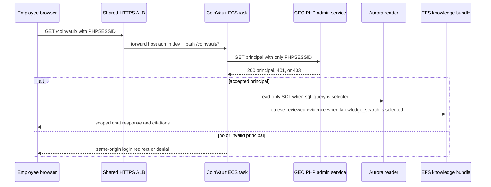
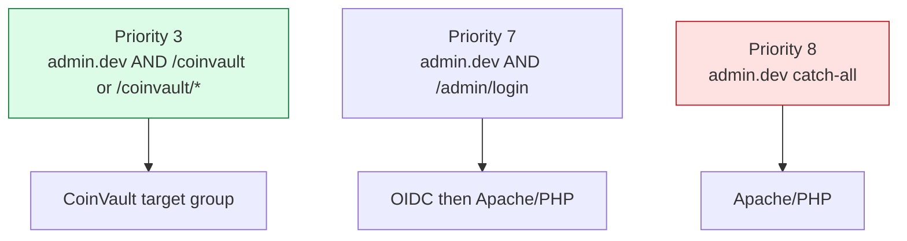
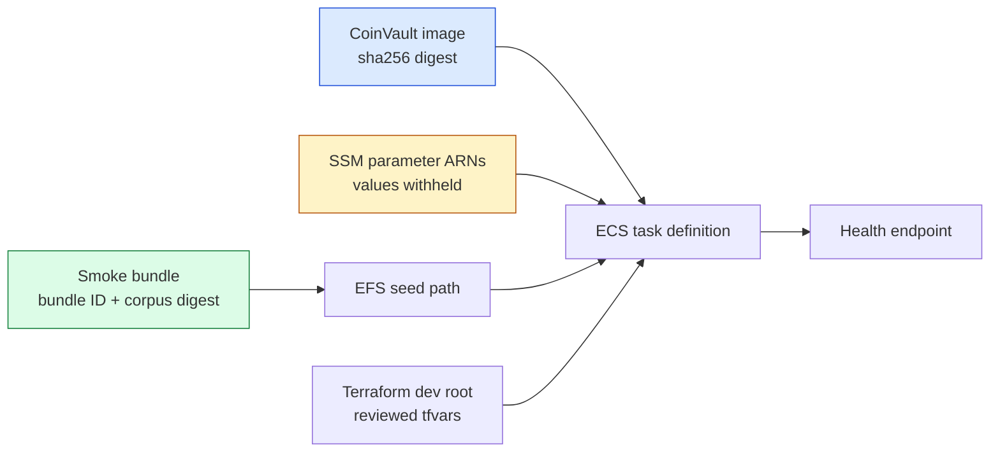

# CoinVault Development Deployment — An Employee-Authenticated RAG Service

CoinVault is becoming a real internal Golden Eagle Coin assistant rather than a
locally demonstrated chat application. It answers employee questions over two
different data planes: a live, read-only MySQL connection for operational facts
such as orders, payments, inventory, and customers; and a reviewed knowledge
bundle for longer-lived explanatory material. The first deployed development
service is deliberately small. It proves the runtime, security boundaries,
immutable-artifact handoff, and request path before the full corpus is allowed
to become the serving dependency.

The deployed service is reachable at
`https://admin.dev.goldeneaglecoin.com/coinvault/`. The service target is
healthy, its MySQL reader connection is healthy, and it has opened a reviewed
20-document vector smoke bundle. The GEC PHP principal endpoint has now been
released to development, but browser authorization is not complete: Apache's
outer development Basic gate rejects CoinVault's cookie-only backchannel before
PHP can resolve the employee. This is a useful state to document precisely. It
separates a working service substrate and deployed PHP authority contract from
an unproven server-to-server session handoff.

> [!summary]
> - CoinVault is an employee-facing ECS service behind the existing shared ALB. It owns chat execution, RAG retrieval, read-only SQL tools, conversation state, and evidence handling; it does not own employee login.
> - GEC PHP remains the authority for employee sessions, active status, and capabilities. CoinVault asks PHP for a small principal document and fails closed if the response is absent, malformed, or insufficiently authorized.
> - The first service uses a digest-pinned image and a separately attested 20-document OpenAI-vector smoke bundle on EFS. The full 114,116-representation index build completed embedding but was killed at a 2 GiB memory limit before publication; it is intentionally a separate remediation effort.
> - There are two release systems. Terraform changes AWS resources and is applied from reviewed plans. GEC application releases deploy `develop` to dev and `master` to production through a GitHub Actions SSH workflow. A successful Terraform apply does not publish PHP routes.

## 1. What is being built

The product question is straightforward: an authorized employee should be able
to ask an internal question and receive an answer grounded either in current
operational data or in a reviewed knowledge corpus. The implementation question
is harder because those information sources have different freshness,
authorization, and failure properties.

An inventory count must come from live database state, through a database
identity that cannot write. A return-policy explanation may come from a
document bundle, where retrieval produces inspectable evidence. An answer may
use both, but neither the language model nor the browser is an authorization
authority. Those properties are enforced below the model and below the UI.

The initial deployment therefore has four independent goals:

1. Serve the CoinVault image through the employee admin hostname.
2. Preserve GEC PHP as the sole owner of employee identity.
3. Give the task only a development read-only database credential and exact
   OpenAI secret references, without placing secret values in Terraform state.
4. Open one known-good RAG artifact before the much larger production-like
   artifact is ready.

## 2. The system boundary

The system has three authorities. Each authority answers a different question,
and the design becomes unsafe when one is treated as evidence for another.

| Authority | Question it answers | Concrete mechanism | What it must not decide |
|---|---|---|---|
| GEC PHP | Who is this employee, and may they use CoinVault? | PHP session, employee active flag, capability check | Which SQL rows or retrieved chunks the answer may expose |
| MySQL | Which live records may this task read? | `gec_dev_ro` grants on the Aurora reader endpoint | Which browser session is an employee |
| CoinVault | Which tools run, which evidence is admitted, and who owns a conversation? | Tool policy, principal validation, evidence ledger, conversation ownership | Whether an arbitrary client assertion is an employee identity |

The resulting request path is intentionally narrow.



The browser sends its PHP session cookie to CoinVault because CoinVault is
mounted at the same employee-admin hostname. CoinVault does not parse the
cookie. Its GEC session resolver forwards only that named cookie to a fixed
principal URL. PHP reads its own session store, derives the employee, verifies
that the employee is active, and verifies `coinvault` or inherited `admin`
capability. A successful response is constrained JSON, not a copy of the PHP
session and not an arbitrary browser-supplied identity.

The principal endpoint contract is defined in
`/home/manuel/code/gec/goldeneaglecoin.com/src/rest/AdminRest.php`. Its
meaningful outcomes are:

| Status | Meaning | CoinVault behavior |
|---|---|---|
| 200 | An active employee has the required capability. | Construct the canonical subject `gec-employee:<id>` and allow the request. |
| 401 | There is no valid PHP employee session. | Redirect to the same-origin GEC login path. |
| 403 | The employee exists but is inactive or lacks a capability. | Deny; do not create a login loop. |
| 404, 405, malformed JSON, or 5xx | The authority contract is absent, wrong, or unavailable. | Fail closed; do not treat it as a user identity. |

The endpoint is now deployed. Reached through the development outer gate and
without a PHP session, it returns PHP JSON `401 Unauthorized` with
`Cache-Control: no-store`. Reached without that outer gate, it instead receives
an Apache HTML Basic challenge before PHP. CoinVault takes the second path
because its resolver forwards only `PHPSESSID`; the resulting browser login
redirect repeats indefinitely.

## 3. Routing is an ordered program

The shared ALB does not choose the most specific route. It evaluates listener
rules in ascending priority and stops at the first matching rule. This matters
because `admin.dev.goldeneaglecoin.com` already had a host-only forwarding rule
to Apache/PHP at priority 8. CoinVault was initially placed at priority 9,
which made its more-specific host-and-path rule unreachable. Apache then
redirected `/coinvault` to the ordinary development site.

The correction did not rename CoinVault or introduce a `dev.goldeneaglecoin.com`
route. It changed one existing listener rule, in place, from priority 9 to
priority 3.



The exact Terraform plan contained no task, image, database, EFS, or target
group mutation. It reported one in-place listener-rule update, `9 -> 3`. The
public checks after apply were equally specific:

```text
GET /coinvault/         -> 302 /admin/login?return_to=%2Fcoinvault%2F
GET /coinvault/healthz  -> 200 JSON: app=coinvault, database healthy
```

This establishes two facts. First, the ALB now reaches CoinVault. Second,
CoinVault is correctly attempting to delegate missing identity to GEC PHP. It
does not establish that PHP can complete the principal handoff; that requires
the PHP release described later.

The relevant infrastructure contract is in:

- `/home/manuel/code/gec/goldeneaglecoin.com/infra/terraform/coinvault-dev/variables.tf`
- `/home/manuel/code/gec/goldeneaglecoin.com/infra/terraform/coinvault-dev/runtime.tf`
- `/home/manuel/code/gec/goldeneaglecoin.com/infra/terraform/modules/coinvault-runtime/main.tf`

## 4. Why the PHP route contains a response-policy exception

PR #967 adds a small endpoint-specific clause to
`src/lib/WebSite.php::handle_rest_server`:

```php
if ($path === $this->get_relative_uri('rest/admin/coinvault/principal')) {
    header('Cache-Control: no-store');
}

RestServer::$restServerHttp->sendResult($res);
```

This code is not how the principal route is dispatched. Dispatch comes from
the `@url GET /admin/coinvault/principal` annotation on the `AdminRest` method.
The clause is a response-policy override. It prevents a persistent cache from
retaining a user-specific authorization document.

The placement is deliberate. The legacy REST server sends its default
`Cache-Control: no-cache, must-revalidate` after a controller method returns.
Putting `no-store` directly in `AdminRest::getCoinvaultPrincipal()` would let
the framework replace it. `WebSite::handle_rest_server()` runs after route
handling and immediately before serialization, which is the point at which a
stronger endpoint policy can reliably replace the default header.

For one endpoint, this narrowly scoped path policy is preferable to modifying
the vendored REST framework. If more endpoints need response policies, the
right next abstraction is a framework-level annotation such as `@noStore`,
parsed alongside the existing `@cache` annotation. That should be introduced
only when there are multiple consumers; a new generic API for one route would
add surface area without improving current correctness.

## 5. Immutable service composition

The service is composed from distinct artifacts. Each is immutable or named by
an explicit identity, and the deployment review asks a different question of
each one.



The current image is pinned by full OCI digest rather than by a mutable tag:

```text
605947888452.dkr.ecr.us-east-1.amazonaws.com/coinvault@
sha256:5f37dc38d0c9f5da72979eb82fb29f5d6c066f0428cdaa22777ff65ea10d02d3
```

The task receives development secrets by exact SSM parameter ARN. Terraform
stores the ARN, not the secret value; ECS resolves the value inside the task.
One approved OpenAI parameter is mapped to purpose-specific environment names
for generation and embeddings. This keeps the application’s profile contract
explicit while avoiding secret duplication.

The generation profile is `gpt-5.6-luna-low`, a stack that resolves through
`openai-responses-base` and `gpt-5.6-luna`. The embedding profile is
`openai-embedding-small`, which resolves `text-embedding-3-small` with 1,536
dimensions. The embedded profile registry is application configuration; it
contains model and provider settings but no API-key value.

The application reports the following runtime facts through its health
endpoint:

```json
{
  "app": "coinvault",
  "ok": true,
  "root": "/coinvault",
  "database": {
    "configured": true,
    "healthy": true,
    "driver": "mysql"
  }
}
```

The health document is intentionally operational. It proves that the service
can open the reader connection and selected knowledge bundle. It does not
prove that a browser session has been accepted or that a model answer is
authorized and grounded.

## 6. Why the first bundle is intentionally small

The initial EFS bundle is a deterministic smoke artifact, not a sample of
whatever happened to be present in the full-build directory. It contains:

| Property | Smoke bundle value |
|---|---|
| Release label | `openai-smoke-v1` |
| Bundle ID | `rk-94b0c43dca815498929e898b560312ca` |
| Documents | 20 |
| Chunks | 54 |
| Representations | 108 |
| Vector model | `text-embedding-3-small` |
| Dimensions | 1,536 |
| EFS path | `/var/lib/coinvault/seeds/openai-smoke-v1/bundles/rk-94b0c43dca815498929e898b560312ca` |

The artifact was archived with a SHA-256 receipt, uploaded to a private S3
object, and copied to a release-specific EFS seed path by a one-shot seeder
task. The serving task opens that exact path. It does not read the mutable full
build directory and it cannot silently substitute a later artifact.

This composition lets the team validate the service in layers:

```text
source selection
  -> deterministic bundle build
  -> retrieval fixture
  -> archive digest
  -> S3 object identity
  -> EFS seed receipt
  -> ECS service configuration
  -> live health check
```

Each arrow is a handoff with inspectable inputs and outputs. A failure at one
handoff does not invalidate evidence collected at earlier handoffs.

## 7. The full-index OOM is a separate engineering problem

The full development indexer made it through embedding: it recorded
`114116 / 114116` representations embedded. It was then terminated with ECS
exit 137 and `OutOfMemoryError` before it emitted an accepted bundle report.
No full bundle was promoted, and the smoke bundle was not modified.

The current implementation retains several large populations during the build:

1. representation values;
2. 1,536-dimensional vector values;
3. lexical index records and their title/body material;
4. bundle-construction and publication structures.

The raw coordinate payload alone is approximately:

```text
114,116 vectors × 1,536 float32 coordinates × 4 bytes
  = 700,104,704 bytes
  ≈ 668 MiB
```

That lower bound excludes Go object headers, slices, document text, lexical
records, SQLite/Bleve construction overhead, serialization buffers, and
simultaneous build stages. A 2 GiB task limit is therefore plausibly exceeded
without requiring a memory leak. The OOM ticket is deliberately separate:
`COINVAULT-INDEX-OOM-001` proposes first measuring and sizing an indexer-only
task, then evolving the RagKit build API toward staged or streaming assembly.

The key operating rule is simple: do not retry the full build automatically,
and do not turn a partial directory into a serving bundle. The durable
embedding cache may make a later controlled retry provider-free, but it must
be inspected before reuse.

## 8. Two deployment systems, two state transitions

The current work spans application release and infrastructure release. They
are deliberately independent.

| Change type | Source branch and review | Release mechanism | Remote result |
|---|---|---|---|
| GEC PHP route, login return handling, principal contract | PR #967 into `develop` | `make deploydev` | GEC development application updated on the webserver |
| CoinVault container image | CoinVault repository CI | GitHub OIDC → ECR | Immutable image digest becomes available |
| ECS/EFS/ALB/task configuration | reviewed Terraform plan | `terraform apply` of saved plan | AWS resources change |
| Knowledge content | reviewed build and seed receipt | one-shot seed task | Explicit EFS bundle path becomes available |

The development deploy command is intentionally explicit:

```bash
cd /home/manuel/code/gec/goldeneaglecoin.com
make deploydev
```

It dispatches `.github/workflows/deploydev.yml` on `develop`. The GitHub
runner locates the webserver with its deployment AWS credentials, connects via
the control host, logs in as the `dev` user, and runs:

```text
/sites/gec/development/repo/deploy2/deploy.sh
```

Production follows the same application-release shape from `master`:

```bash
make deployprod
```

The Make target first checks that the deployed production worktree is clean.
The production workflow also runs on pushes to `master`; it connects as `gec`
and invokes:

```text
/sites/gec/live/repo/deploy2/deploy.sh
```

Neither command applies Terraform. That separation matters operationally: a
PHP release can make a new endpoint available without changing AWS resources,
and an ECS image/route update can succeed while the required PHP contract is
still absent. The current development state demonstrates exactly that case.

## 9. Current state and the next proof sequence

The deployed substrate is real, but the user-facing proof is incomplete.

| Layer | State | Evidence | Remaining proof |
|---|---|---|---|
| ALB route | Complete | Priority 3 CoinVault rule precedes priority 8 admin catch-all | Preserve ordering as shared listener rules evolve |
| ECS service | Complete | One healthy task and target; public health HTTP 200 | Inspect logs during authenticated tool use |
| Database | Complete for connectivity | `gec_dev_ro` reader probe healthy | Run representative read-only SQL queries and policy failures |
| Smoke RAG bundle | Complete for service opening | Exact EFS path and 1,536-dimensional OpenAI identity | Run retrieval and citation scenarios under a real employee session |
| PHP principal | Deployed, but unreachable to CoinVault backchannel | PHP returns JSON 401 through the outer gate; Apache returns Basic 401 without it | Add and review an exact path-only outer-gate exception; test 401/403/200 behavior |
| Login return | Deployed | Browser preserves `/coinvault/`, then loops because principal resolution fails | Retest after backchannel reaches PHP |
| Full vector bundle | Deferred | Embeddings complete; bundle not published after OOM | Implement separate bounded-memory recovery ticket |

The next tests should be performed in this order:

1. Review and manually execute the prepared exact-path Apache exception
   runbook. It requires a candidate/live `dev.conf` diff, a timestamped
   rollback copy, `apachectl configtest`, and a reload only after validation.
2. Verify an anonymous cookie-only request reaches PHP and produces PHP 401,
   not an Apache Basic challenge.
3. Verify an inactive or uncapable employee receives PHP 403.
4. Verify a capable employee receives the constrained 200 principal document.
5. Open `/coinvault/` in the browser and verify no cross-host redirect or loop
   occurs.
6. Submit read-only SQL and knowledge-search questions; inspect citations and
   deny attempts that violate tool policy.
7. Inspect task/application logs and conversation records for session IDs,
   database passwords, OpenAI keys, and unnecessary query-row disclosure.

The tests are ordered because later steps depend on earlier authority
contracts. A model answer cannot demonstrate correct employee authorization if
the principal endpoint is missing; a successful SQL query cannot demonstrate
correct RAG citations; a healthy target cannot demonstrate either.

## 10. Design rules worth retaining

The deployment has produced a set of durable rules for this system.

- **Employee identity stays in GEC PHP.** CoinVault consumes a verified,
  minimal principal and never attempts to interpret PHP session state itself.
- **Database authority stays in the database.** A model tool policy reduces
  application risk, but MySQL grants remain the enforcement boundary for
  reads and writes.
- **Bundles are selected by identity, not discovery.** A serving task receives
  one reviewed content-addressed path; it does not choose the newest mutable
  directory.
- **Shared mechanics do not imply shared state.** The Terraform runtime module
  is shared, but development and production roots have separate backends,
  names, credentials, hostnames, and approval gates.
- **ALB priorities are configuration contracts.** A route can be fully defined
  yet unreachable. Priority inspection belongs immediately before a shared
  listener apply.
- **A deployment is evidence, not an assertion.** Image identity, artifact
  receipt, target health, authentication outcomes, and tool traces must be
  retained separately because they prove different properties.

## Important source material

- Deployment ticket: `/home/manuel/code/gec/2026-03-16--gec-rag/ttmp/2026/08/10/COINVAULT-ENV-DEPLOY-001--environment-aware-coinvault-deployment-from-gec-dev-to-production/`
- OOM ticket: `/home/manuel/code/gec/2026-03-16--gec-rag/ttmp/2026/08/10/COINVAULT-INDEX-OOM-001--bounded-memory-full-knowledge-bundle-build/`
- PHP principal and cache policy: `/home/manuel/code/gec/goldeneaglecoin.com/src/rest/AdminRest.php`, `/home/manuel/code/gec/goldeneaglecoin.com/src/lib/WebSite.php`, and `/home/manuel/code/gec/goldeneaglecoin.com/src/lib/CoinVaultLoginReturn.php`
- Dev runtime root: `/home/manuel/code/gec/goldeneaglecoin.com/infra/terraform/coinvault-dev/`
- Shared Terraform module: `/home/manuel/code/gec/goldeneaglecoin.com/infra/terraform/modules/coinvault-runtime/`
- Application deploy workflow: `/home/manuel/code/gec/goldeneaglecoin.com/.github/workflows/deploydev.yml`, `/home/manuel/code/gec/goldeneaglecoin.com/.github/workflows/deployprod.yml`, and `/home/manuel/code/gec/goldeneaglecoin.com/docs/deploy.md`
- Manual exact-path Apache runbook: `/home/manuel/code/gec/2026-03-16--gec-rag/ttmp/2026/08/10/COINVAULT-ENV-DEPLOY-001--environment-aware-coinvault-deployment-from-gec-dev-to-production/playbook/02-manual-dev-apache-principal-exception-runbook.md`
- Previous RAG implementation report: [[CoinVault GEC-RAG - ragkit Extraction and knowledge_search Integration]]
- Related supply-chain report: [[CoinVault Container Supply Chain - GitHub OIDC, Immutable ECR Images, and Fail-Closed Scanning]]
