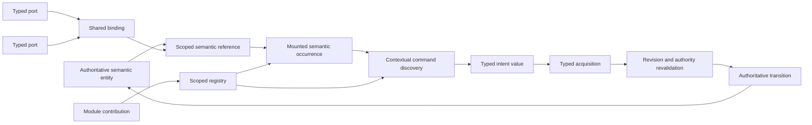
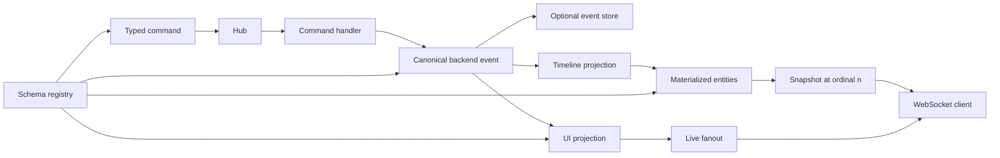
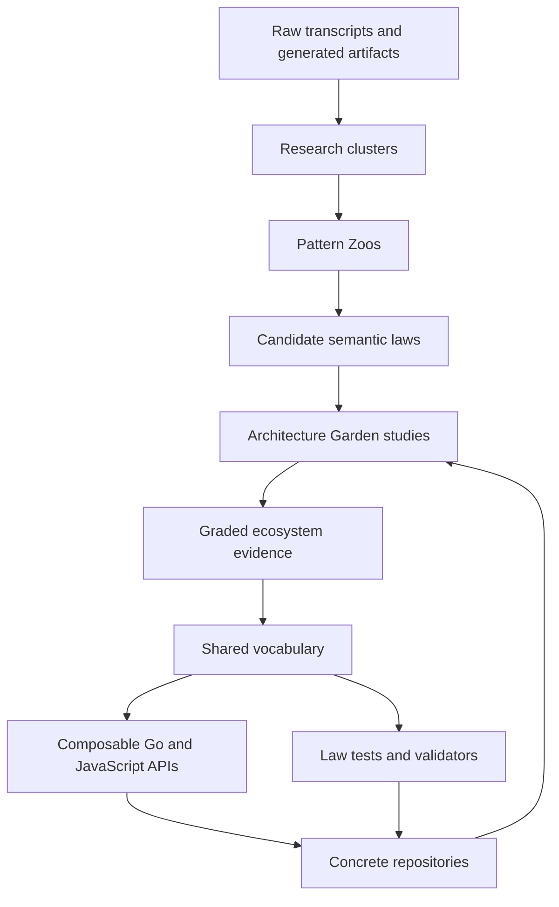

# From Pattern Zoos to an Architecture Garden

The work described here began as an archive problem. Hundreds of generated research artifacts discussed RAG systems, presentation-based user interfaces, interpreters, event streams, experiments, releases, authorization, and mathematical foundations. Many documents appeared to agree. Many used the same words for different structures. Others used unrelated terminology for what turned out to be the same implementation law.

The result is now a small research system inside this vault. The [[Transcripts/Research/00 - Research Clusters Index|Research Clusters]] preserve provenance and subject-level navigation. The [[Transcripts/Research/09 - RAG-MATHS Pattern Zoo|RAG-MATHS Pattern Zoo]] and [[Transcripts/Research/10 - PBUI-MATHS Pattern Zoo Handbook|PBUI-MATHS Pattern Zoo]] extract stable semantic patterns from two large research families. The [[Research/Software Architecture Garden/README|Software Architecture Garden]] tests those proposed laws against concrete repositories. The new [[Research/Software Architecture Garden/sessionstream/README|sessionstream Garden study]] extends the comparison into typed events, projections, hydration, replay, and ordered streaming. Two repository skills make the process repeatable instead of leaving it as one successful investigation.

The central technical conclusion is precise:

> A shared ecosystem vocabulary should be organized around semantic objects, authority boundaries, and laws—not package names, repeated nouns, or preferred frameworks.

That conclusion changes how reusable APIs should be designed. A command is data, not authority. A registry discovers and validates names, but does not grant execution rights. An event is not a projection. A snapshot is not automatically a release. A sequence number is not causal order. A typed schema is evidence about representation, not proof that a business claim is true. Once these distinctions are explicit, mathematical structure becomes practical: it determines which operations compose, which retries are safe, which caches are sound, which views can be rebuilt, and which tests should fail.

> [!summary]
> - The research archive was reduced into two professional-first handbooks containing 26 patterns: 12 for RAG systems and 14 for presentation-based interfaces.
> - The Architecture Garden converted thesis-shaped claims into graded implementation evidence: strong correspondence, partial correspondence, adjacent analogy, negative evidence, and non-equivalence.
> - The sessionstream study exposed a cross-project kernel around typed intent, canonical events, projections, scoped state, prefix-cut snapshots, replay, and trusted schema admission.
> - Substantive review mattered more than structural validation. It removed several attractive but false equivalences and turned implementation defects into negative pattern evidence.
> - The work now has two reusable project skills: `pattern-zoo-authoring` for corpus synthesis and `architecture-garden-analysis` for repository-pinned implementation studies.

## 1. The original problem: a large archive with unstable names

The source archive mixed transcripts, generated theses, implementation reports, textbooks, PDFs, DOCX exports, ZIP bundles, screenshots, patches, and repeated branch outputs. A file inventory could answer where artifacts were stored, but not what the research actually said. Counting files also produced a false measure of confidence: four copied theses in four branch directories are one intellectual artifact, not four independent confirmations.

The first durable layer therefore became a set of subject clusters:

- [[Transcripts/Research/02 - PBUI and CLIM Research|PBUI and CLIM Research]]
- [[Transcripts/Research/03 - RAG and Retrieval Research|RAG and Retrieval Research]]
- [[Transcripts/Research/04 - Mathematics and Formal Foundations|Mathematics and Formal Foundations]]
- [[Transcripts/Research/05 - CNC and CAM Research|CNC and CAM Research]]
- [[Transcripts/Research/06 - Goja, Interpreters, and Language Systems|Goja, Interpreters, and Language Systems]]
- [[Transcripts/Research/07 - Go-Go-WM and Semantic Desktop Research|Go-Go-WM and Semantic Desktop Research]]
- [[Transcripts/Research/08 - Research Operations, DataDrop, and AI Assurance|Research Operations, DataDrop, and AI Assurance]]

These notes separate navigation from synthesis. Raw transcripts preserve prompts and chronology. Generated manuscripts preserve developed arguments. Cluster notes describe subject matter. Pattern handbooks ask a narrower question: which semantic structures survive changes in vocabulary, implementation, and system boundary?

### 1.1 Evidence classes

The archive forced an explicit evidence hierarchy.

| Evidence class | What it can establish | What it cannot establish alone |
|---|---|---|
| Generated thesis or design study | A coherent proposed model, vocabulary, laws, and design consequences | Independent validation or production correctness |
| Transcript branch | How an argument developed and where revisions occurred | Additional confirmation when copied from a shared branch |
| Source code | Actual types, calls, transaction seams, and authority paths at one revision | Operational success without tests or consumers |
| Test | A protected behavior under its fixture and environment | Universal correctness outside its covered boundary |
| Deployment or active consumer | The pattern survives integration and real lifecycle pressure | Formal proof of every invariant |
| Failure, bypass, or migration | Which boundary was missing or incorrectly owned | That the replacement is correct unless separately validated |

This evidence discipline became part of both authoring skills. It also prevented the mathematical material from becoming self-certifying. A generated proof sketch, a property test, an executable validator, and a mechanized proof are four different artifacts.

### 1.2 The archive operation behind the research

The conceptual work depended on a substantial preservation pass. Fourteen ChatGPT conversations active on 2026-08-09 were archived under `Transcripts/2026/08/09/`. The session's operator log recorded 163 downloaded linked outputs, including 25 retained ZIP bundles. Those two figures describe the historical import operation; no file manifest was committed, so they are not independently reproducible from the current worktree. Duplicate conversation titles required explicit disambiguation: one `Branch Branch Designing RAG Abstractions` transcript was restored with a stable suffix rather than silently overwriting its sibling.

The committed generated-artifact inventory contains 300 Markdown and PDF files—183 Markdown documents and 117 PDFs. The operator log also records that subject inventories were refreshed over 142 transcripts and that 402 Research-folder links were checked before synthesis. These are historical execution counts rather than claims recoverable from a retained validation log. The research cluster notes link to artifacts in place instead of moving or duplicating them, preserving original conversation directories and branch context.

This operational work matters because a pattern claim is only as reviewable as its source path. The archive now supports three different reading modes:

1. read a cluster note to understand a subject;
2. read a Zoo chapter to understand a recurring law;
3. follow an exact path-qualified link to inspect the original branch, manuscript, or transcript heading.

### 1.3 The implementation chronology

The work proceeded in five stages:

| Stage | Principal result |
|---|---|
| Archive and cluster | Raw/archive commits `f580025be6d6543ac36cf439e73284071f725a0e` and `8da9f794412bba98bf07d06b50f9345771aa9a31`; eleven Research notes eventually comprised one index, one artifact inventory, seven subject clusters, and two Pattern Zoos |
| RAG synthesis | Twelve-pattern handbook committed in `f1917789dfa5b56f3cead77290d7dd4cb4b33474`, followed by substantive corrections to identity, replay, coupling, release, and authorization examples |
| Reusable method | Pattern Zoo skill committed as `42ffe7a2d60974b66a9d48e00c41420c3ee8c6bb` |
| PBUI synthesis | Fourteen-pattern handbook committed as `6aea9ac681fc33b47702d98f155c339fb4f925a7` |
| Implementation comparison | Garden cross-correlation, sessionstream study, and Architecture Garden analysis skill |

The operator record states that the RAG research bundle, Pattern Zoo playbook, and PBUI handbook were separately rendered and uploaded to reMarkable at these destinations:

```text
/ai/2026/08/09/RAG-MATHS/RAG MATHS Research Pattern Zoo Bundle.pdf
/ai/2026/08/09/Pattern-Zoo-Skill/Pattern Zoo Research and Authoring Playbook.pdf
/ai/2026/08/09/PBUI-MATHS/PBUI_MATHS_Pattern_Zoo_Handbook.pdf
```

These paths are publication-history records; the vault does not contain a cloud receipt or upload manifest that independently verifies them. The PDFs support annotation. The Markdown remains authoritative because it retains exact wikilinks, source headings, and editable mathematics.

## 2. The Pattern Zoo method

A Pattern Zoo is not a glossary. Its unit of organization is a reusable relationship:

```text
recurring problem
  + semantic objects
  + operation or relation
  + laws
  + operational consequence
  + failure modes
  + source sightings
```

The method begins with concrete values. It introduces types and relations only after the implementation problem is clear. It then states laws and translates each law back into production behavior. The advanced mathematics appears in a separate reading lane so that it can be rigorous without obstructing a developer's first encounter with the pattern.

Each chapter follows the same progression:

1. the first-day version;
2. the problem it solves;
3. the mathematical model;
4. advanced category theory or abstract mathematics;
5. worked example and pseudocode;
6. failure modes;
7. names and exact source sightings;
8. key points.

That sequence is a constraint on reasoning, not merely formatting. Beginning with a category name and searching for code that resembles it is backwards. Beginning with duplicate worker deliveries, observing that grouping and order should not matter, and deriving associative, commutative, idempotent merge is legitimate.

## 3. The RAG-MATHS Pattern Zoo

The RAG handbook is approximately 28,000 words and contains twelve patterns. Its sources include RAG-TTC research, compositional retrieval studies, probabilistic optimization work, an intervention-field algebra, and a durable job-system thesis. These sources begin at different boundaries, but a restrained kernel recurs.

| Pattern | Central semantic law | Concrete consequence |
|---|---|---|
| [[Transcripts/Research/09 - RAG-MATHS Pattern Zoo#Pattern 1 — Semantic Identity as Explicit Projection|Semantic Identity as Explicit Projection]] | Identity is computed from a versioned projection of behavior-relevant fields. | Cache keys and deduplication do not depend on incidental struct layout. |
| [[Transcripts/Research/09 - RAG-MATHS Pattern Zoo#Pattern 2 — Entity–Derivation–Observation Separation|Entity–Derivation–Observation Separation]] | What exists, why it exists, and what was measured are distinct record families. | Retrieval scores do not become fact identity; provenance can have multiple witnesses. |
| [[Transcripts/Research/09 - RAG-MATHS Pattern Zoo#Pattern 3 — Accumulate Before Selecting|Accumulate Before Selecting]] | Variant-preserving evidence is joined before ranking, budgeting, or collapse. | Worker timing cannot silently choose truth. |
| [[Transcripts/Research/09 - RAG-MATHS Pattern Zoo#Pattern 4 — Typed Plans and Multiple Interpreters|Typed Plans and Multiple Interpreters]] | One typed plan can receive execution, inspection, estimation, or test interpretations. | Planning syntax remains independent of one runtime implementation. |
| [[Transcripts/Research/09 - RAG-MATHS Pattern Zoo#Pattern 5 — Explicit Outcomes and Observation Algebra|Explicit Outcomes and Observation Algebra]] | Success, abstention, cancellation, and attributable failure are disjoint outcomes with structured observations. | Missing output cannot masquerade as an empty successful answer. |
| [[Transcripts/Research/09 - RAG-MATHS Pattern Zoo#Pattern 6 — Intervention Support, Dependency Closure, and Lawful Reuse|Intervention Support and Dependency Closure]] | Reuse is allowed only outside the closure of declared change support. | Incremental rebuilds retain unaffected artifacts without stale reuse. |
| [[Transcripts/Research/09 - RAG-MATHS Pattern Zoo#Pattern 7: Append-Only Events, Pure Reducers, and Observable Idempotence|Append-Only Events and Reducers]] | Durable event prefixes fold deterministically; duplicates preserve the declared observation. | State can be reconstructed and retries can be reviewed against explicit boundaries. |
| [[Transcripts/Research/09 - RAG-MATHS Pattern Zoo#Pattern 8: Exact Experimental Coordinates and Explicit Coupling|Exact Experimental Coordinates and Coupling]] | Every result is indexed by a complete cell and explicit stochastic relationship. | Comparisons do not silently change estimands when trials fail or randomness differs. |
| [[Transcripts/Research/09 - RAG-MATHS Pattern Zoo#Pattern 9: Constraint-First Decisions and Partial Preference|Constraint-First Decisions]] | Hard feasibility predicates dominate product preference. | Safety, custody, and completeness failures cannot be compensated by better average quality. |
| [[Transcripts/Research/09 - RAG-MATHS Pattern Zoo#Pattern 10 — Large Producers, Small Trusted Validators / Proof-Carrying Artifacts|Large Producers, Small Validators]] | Complex producers submit artifacts to a smaller deterministic admission boundary. | Stochastic or extensible components do not certify their own output. |
| [[Transcripts/Research/09 - RAG-MATHS Pattern Zoo#Pattern 11 — Immutable Release as Synchronization Root|Immutable Release as Synchronization Root]] | One acquired root identifies the complete behaviorally relevant epoch. | A request cannot mix indexes, prompts, policies, and validators from different releases. |
| [[Transcripts/Research/09 - RAG-MATHS Pattern Zoo#Pattern 12 — Authorization Dominates Disclosure|Authorization Dominates Disclosure]] | Every path to protected effects or remote disclosure crosses current authorization over the exact values sent. | A hidden UI action or late output filter cannot become the security boundary. |

The most important restraint is that these are not one universal abstraction. Semantic IDs, execution IDs, artifact hashes, experiment coordinates, and release roots answer different questions. Dependency graphs, provenance graphs, and authorization domination graphs may share traversal machinery while preserving different edge meanings.

## 4. The PBUI-MATHS Pattern Zoo

The PBUI handbook is approximately 29,000 words and contains fourteen patterns. Its independent evidence families include a browser Widget DSL, Wails/QML integration, a React architecture review, linked analytical workspaces, set-theoretic type studies, and proof-oriented architecture branches. Repeated CLIM transcripts and copied P01–P15 artifacts were treated as one lineage rather than independent confirmation.

The patterns form an interaction kernel:



The fourteen chapters distinguish stable application identity from visual occurrence identity; runtime semantic types from TypeScript types; typed input acquisition from ordinary selection; serializable command intent from effects; translation from subtyping; contextual discovery from authorization; contracts from runtime objects; registries from modules; scope from process-global state; canonical state from projections; ports from bindings; graph copy from recursive cloning; and interaction evidence from formal proof.

A compressed map is useful:

| Area | Patterns | Shared concern |
|---|---|---|
| Identity and presentation | [[Transcripts/Research/10 - PBUI-MATHS Pattern Zoo Handbook#Pattern 1 — Semantic Reference|Semantic Reference]], [[Transcripts/Research/10 - PBUI-MATHS Pattern Zoo Handbook#Pattern 2 — Semantic Occurrence|Semantic Occurrence]], [[Transcripts/Research/10 - PBUI-MATHS Pattern Zoo Handbook#Pattern 3 — Runtime Semantic Type|Runtime Semantic Type]] | Which application object is shown, where it is shown, and under which interface meaning? |
| Interaction | [[Transcripts/Research/10 - PBUI-MATHS Pattern Zoo Handbook#Pattern 4 — Typed Input Context|Typed Input Context]], [[Transcripts/Research/10 - PBUI-MATHS Pattern Zoo Handbook#Pattern 5 — Command as Data|Command as Data]], [[Transcripts/Research/10 - PBUI-MATHS Pattern Zoo Handbook#Pattern 7 — Contextual Applicability and Dispatch|Contextual Applicability]] | How is intent discovered, completed, and submitted without confusing visibility with authority? |
| Representation boundaries | [[Transcripts/Research/10 - PBUI-MATHS Pattern Zoo Handbook#Pattern 6 — Explicit Translation|Explicit Translation]], [[Transcripts/Research/10 - PBUI-MATHS Pattern Zoo Handbook#Pattern 8 — Serializable Semantic Contract|Serializable Semantic Contract]] | Which transformations preserve meaning, and what can cross process/toolkit boundaries? |
| Extension and ownership | [[Transcripts/Research/10 - PBUI-MATHS Pattern Zoo Handbook#Pattern 9 — Registry and Module Boundary|Registry and Module Boundary]], [[Transcripts/Research/10 - PBUI-MATHS Pattern Zoo Handbook#Pattern 10 — Scoped Runtime and Context|Scoped Runtime and Context]], [[Transcripts/Research/10 - PBUI-MATHS Pattern Zoo Handbook#Pattern 11 — Authoritative State, Resolver, and Revision|Authoritative State, Resolver, and Revision]] | Where do names, services, state, and freshness live? |
| Coordination and durability | [[Transcripts/Research/10 - PBUI-MATHS Pattern Zoo Handbook#Pattern 12 — Typed Port and Shared Binding|Typed Port and Shared Binding]], [[Transcripts/Research/10 - PBUI-MATHS Pattern Zoo Handbook#Pattern 13 — Graph-Aware Copy and Persistence|Graph-Aware Copy and Persistence]], [[Transcripts/Research/10 - PBUI-MATHS Pattern Zoo Handbook#Pattern 14 — Transactional Interaction and Evidence|Transactional Interaction and Evidence]] | How do multiple views share state, survive copy/reload, and commit one reviewed transition? |

The handbook's strongest operational principle is commit-time revalidation. A command offer can become stale. A selected occurrence can unmount. Permission can be revoked. A binding or topology revision can change. The transaction that performs the effect must resolve current state and recheck the evidence gathered earlier.

## 5. The shared mathematical kernel

The RAG and PBUI zoos are not the same system. Their overlap is nevertheless substantial when expressed as laws.

### 5.1 Explicit projections define identity

Let $X$ be a complete runtime value and $P:X\to Y$ the projection that retains fields relevant to one identity contract. Let $B$ be the byte alphabet, $D$ a set of domain tags, $V$ a set of framing-version identifiers, $\operatorname{Enc}:Y\to B^*$ a canonical encoding, and $H:B^*\to I$ a digest. A typed framing function prevents values from different domains or framing versions from sharing an undifferentiated preimage:

$$
\operatorname{frame}:D\times V\times B^*\to B^*,
\qquad
\operatorname{ID}_{d,v}(x)=H(\operatorname{frame}(d,v,\operatorname{Enc}(P(x)))).
$$

The important function is $P$, not $H$. The projection states which changes preserve identity and which must produce another name. In UI systems, the same principle separates a semantic reference from an occurrence ID and a React key. In experiment systems, it separates operation identity from run identity and artifact identity.

### 5.2 Intent is data; effects belong to interpreters

A serializable command can be modeled as a tagged sum of typed alternatives:

$$
C=C_1+C_2+\cdots+C_n.
$$

Let $S$ be the state space, $A$ the authority-context space, $O$ the outcome space, and $\mathrm{Eff}$ the alphabet of explicit effect descriptions. An interpreter receives a command, current state, and authority context and returns an outcome, successor state, and finite effect plan:

$$
\operatorname{run}:C\times S\times A\to O\times S\times \mathrm{Eff}^*.
$$

This shape appears in PBUI commands, DataDrop verbs, rag-evaluation actions, devctl dynamic commands, and sessionstream command handlers. It does not imply that all projects should share one command interface. It says that transportable intent, current authorization, state transition, and external effects should not be represented by one callback captured at render time.

### 5.3 Ordered histories fold; unordered evidence joins

Two superficially similar operations require different mathematics.

Let $\mathrm{Ev}$ be the canonical-event alphabet. An ordered event history is a word in the free monoid $\mathrm{Ev}^*$, and a replay fold has type $\operatorname{fold}:S\times\mathrm{Ev}^*\to S$. For $s_0\in S$ and histories $x,y\in\mathrm{Ev}^*$:

$$
\operatorname{fold}(s_0,xy)
=
\operatorname{fold}(\operatorname{fold}(s_0,x),y).
$$

Grouping may change; order generally may not.

A duplicate-safe evidence accumulator may instead require a join $\sqcup$ satisfying:

$$
a\sqcup(b\sqcup c)=(a\sqcup b)\sqcup c,
$$

$$
a\sqcup b=b\sqcup a,
$$

$$
a\sqcup a=a.
$$

That is associative, commutative, and idempotent. Calling both operations “merge” hides the crucial difference. Reordering an event history can change state; reordering a semilattice join must not change accepted evidence.

### 5.4 Scopes form a product only under noninterference

If each scope $s$ owns independent state $S_s$, the global state may be modeled as:

$$
S=\prod_{s\in\mathcal S}S_s.
$$

An operation in scope $a$ should not alter observations in scope $b$ when $a\ne b$. This model supports independent PBUI runtimes, sessionstream sessions, devctl runs, and tenants. It does not make a routing key an authorization boundary. Noninterference must still be enforced by the components that admit effects and disclosures.

### 5.5 Snapshots are claims about cuts

For an ordered history, define the prefix relation:

$$
x\preceq y \iff \exists z:\;xz=y.
$$

A snapshot at coordinate $n$ claims to represent one prefix. Correct continuation applies only the suffix:

$$
\operatorname{fold}(S_n,e_{n+1}\ldots e_m)=S_m.
$$

This law appears in several specialized forms:

- sessionstream sends a materialized snapshot and then only newer live UI events;
- publish-vault builds a complete snapshot and atomically swaps the active pointer;
- a RAG request acquires one release root and must not mix epochs;
- a PBUI command revalidates evidence against current entity, policy, and topology revisions.

The forms are related, not aliases. A session hydration cut does not identify a behavior-complete RAG release. An immutable container image does not prove that all behaviorally relevant configuration shares its epoch.

### 5.6 Constraint admission precedes preference

For hard predicates $P_i$, eligibility is:

$$
\operatorname{Eligible}(x)=\bigwedge_i P_i(x).
$$

Preference applies only inside the feasible subset. This law covers experiment promotion, artifact admission, authorization, typed acquisition, and high-consequence human confirmation. The Upwork Tracker study later supplied negative evidence: its dedicated transaction had a strong atomic write shape but incomplete eligibility validation, while a generic path could bypass confirmation entirely.

## 6. From generated theory to repository evidence

The [[Research/Software Architecture Garden/README|Software Architecture Garden]] predates the transcript synthesis. It began on 2026-07-26, before the August archive import and both Pattern Zoos. That chronology matters: the Garden was not invented to validate the Zoos after the fact. It already had a source-first evidence hierarchy, maturity vocabulary, project snapshot discipline, and a record of corrections—including a devctl provenance hash corrected immediately after its first documentation commit.

The Zoos made the Garden more useful by supplying precise candidate laws; the Garden made the Zoos more trustworthy by changing the direction of inference. A Zoo begins with a research corpus and extracts proposed laws. The Garden begins with a pinned repository snapshot, traces runtime paths, identifies authority and failure boundaries, and only then compares the implementation with existing vocabulary.

Eight projects now provide comparison material:

- [[Research/Software Architecture Garden/rag-evaluation-system/README|rag-evaluation-system]]
- [[Research/Software Architecture Garden/go-go-datadrop/README|go-go-datadrop]]
- [[Research/Software Architecture Garden/rag-ttc/README|rag-ttc]]
- [[Research/Software Architecture Garden/devctl/README|devctl]]
- [[Research/Software Architecture Garden/upwork-tracker/README|Upwork Tracker]]
- [[Research/Software Architecture Garden/zitadel-go-test/README|zitadel-go-test]]
- [[Research/Software Architecture Garden/publish-vault/README|publish-vault]]
- [[Research/Software Architecture Garden/sessionstream/README|sessionstream]]

The Garden's comparison scale is intentionally richer than yes/no:

| Relation | Meaning |
|---|---|
| Strong correspondence | The semantic roles, important law, and failure class substantially match. |
| Partial correspondence | A shared nucleus exists, but one project lacks or changes important obligations. |
| Adjacent analogy | The comparison explains a boundary but is not implementation evidence for the pattern. |
| Negative evidence | A bypass or failure demonstrates why the pattern's law matters. |
| Non-equivalence | Similar terminology or representation hides a different semantic object. |

### 6.1 Why substantive review changed the result

The first Garden-to-Zoo comparison was structurally valid and semantically too generous. Every link resolved. Every heading existed. Several claims were still wrong.

A fresh reviewer identified the exact failures:

1. **rag-ttc was not evidence for typed plans with multiple interpreters.** Its experiment policy deliberately remains ordinary Go control flow; no package converts it into a generic workflow graph.
2. **rag-evaluation-system did not establish multiple interpretations of one typed plan.** It had a Widget IR and a principal React rendering path; another interpreter was a possibility, not active evidence.
3. **Upwork Tracker did not confirm constraint-first submission.** The audit found incomplete dedicated validation and a generic submitted-state bypass. It was negative evidence.
4. **rag-ttc run custody was not an immutable release synchronization root.** It lacked request-time root acquisition, activation aliases, mixed-epoch prevention, and reader-safe cleanup. publish-vault supplied the stronger synchronization evidence.
5. **Upwork ownership classes were not the RAG entity–derivation–observation model.** A rebuildable projection is not a derivation object explaining why a semantic entity exists.
6. **Widget IR versus React adapters did not establish PBUI occurrence identity.** A transport node is not a mounted occurrence with registration, generation, and lifecycle laws.
7. **Runtime scoping and authorization dominance were not one invariant.** Per-instance Redux state says nothing about whether every path to a protected effect crosses authorization.
8. **rag-evaluation-system's registry machinery was partly counter-evidence.** Unenforced version labels, duplicated incomplete catalogs, and extension machinery without extension users should not be promoted as a mature registry pattern.

These corrections are among the most valuable outputs of the work. They show why a link checker cannot review architecture semantics. The final Garden matrix now labels strong, partial, and negative evidence directly and preserves non-equivalences in prose.

## 7. Sessionstream as the next comparison project

Sessionstream made the common vocabulary more concrete because its runtime directly exposes commands, canonical events, two projections, event persistence, projection cursors, snapshots, live suffixes, and protobuf boundaries.

### 7.1 The concrete pipeline



The same backend event receives two different interpretations. `UIProjection` produces connected-client observations. `TimelineProjection` produces durable entity updates. Rebuild reads stored backend events and applies only the timeline interpretation; it does not recreate historical live fanout.

This supports a useful common vocabulary:

| Common term | sessionstream object | Meaning |
|---|---|---|
| Scope key | `SessionId` | Routing, ordering, state, cursor, and fanout partition |
| Intent value | `Command` | Typed request submitted to a host-owned handler |
| Canonical event | `Event` | Typed backend occurrence, durable only when an event store is configured |
| Projection | `UIProjection`, `TimelineProjection` | Interpretation of canonical input into one view |
| Materialized entity | `TimelineEntity` | Query-oriented state derived from an event prefix |
| Sequence coordinate | `Ordinal` | Per-session ordering and freshness coordinate |
| Prefix cut | `SnapshotOrdinal` | Greatest event coordinate represented by a snapshot |
| Projection checkpoint | projection cursor | Greatest prefix processed by a named projector |
| Live suffix | buffered/future `UIEvent` values | Observations newer than the snapshot cut |

### 7.2 Snapshot-before-live as an executable law

The WebSocket adapter registers a subscription as hydrating before loading the snapshot. Concurrent live batches are buffered. The server sends the snapshot, removes batches at or before the snapshot ordinal, sorts newer batches, flushes late arrivals under the connection lock, and only then marks the subscription live.

This is a real implementation of a prefix-cut protocol. Tests cover fanout during snapshot load, events already covered by the snapshot, late-buffer ordering, overflow, and concurrent transition to live delivery.

### 7.3 The laws the implementation still owes

The mathematical model also exposed four open correctness obligations.

**Per-session serial application.** Ordinal assignment is locked, but projection and application occur after releasing the ordinal lock. Concurrent publishers can obtain $n$ and $n+1$ and apply them in the opposite order. Current-entity upsert does not reject a lower `LastEventOrdinal`.

**Consistent SQLite cuts.** `Snapshot` reads the cursor and entity rows in separate operations. A concurrent apply can place newer entities beneath an older declared `SnapshotOrdinal` unless both reads share one database snapshot.

**Stable redelivery identity.** SQLite accepts an identical duplicate at the same `(SessionId, Ordinal)` and rejects conflicting content. Bus redelivery can nevertheless receive a new ordinal. Event insertion idempotence is not command idempotence or end-to-end exactly-once behavior.

**Atomic projection progress.** Event append, timeline apply, projector-cursor advance, and fanout are separate boundaries. A monotone cursor is meaningful only if its advancement corresponds to the materialization it claims.

The point is not that sessionstream is poorly designed. The point is that a good abstraction makes its remaining proof obligations visible.

## 8. The implications for JavaScript API design

The long-term goal is not to expose category-theory terminology in JavaScript. It is to derive APIs whose composition rules are predictable.

### 8.1 Branded coordinates

JavaScript and TypeScript should not collapse these values into interchangeable strings:

```text
SemanticId
OccurrenceId
SessionId
RequestId
Revision
EventOrdinal
ProjectionCursor
SnapshotCut
ReleaseId
```

Generated wrappers can preserve exact protobuf or JSON transport while exposing distinct types to application code.

### 8.2 Typed intents instead of serialized callbacks

Prefer:

```javascript
await session.commands.rename({
  subject,
  expectedRevision,
  title,
});
```

The value names intent and carries evidence needed for revalidation. A trusted host resolves current state, checks authority, plans effects, and records an explicit outcome. A menu, keyboard shortcut, agent, REST endpoint, and test can submit the same intent without sharing a UI closure.

### 8.3 Recovery semantics in the API name

A generic `subscribe()` hides whether the client receives a snapshot, replay, best-effort live events, or a gap. Prefer an explicit protocol:

```javascript
for await (const item of session.snapshotThenLive({ sessionId })) {
  switch (item.kind) {
    case "snapshot":
    case "live-event":
    case "overflow":
    case "closed":
  }
}
```

The tagged protocol makes recovery and terminal outcomes explicit in the public contract. JavaScript does not force exhaustive handling: callers can omit a case. A TypeScript binding can add compile-time pressure with a discriminated union and an `assertNever` default branch, provided the compiler and lint configuration preserve exhaustive checking.

### 8.4 Pure projectors and lawful products

Let $p:S_p\times\mathrm{Ev}\to S_p$ and $q:S_q\times\mathrm{Ev}\to S_q$ be independent stateful projectors over the same canonical-event alphabet. Their product projector is typed as follows:

$$
(p\otimes q):(S_p\times S_q)\times\mathrm{Ev}\to S_p\times S_q,
$$

$$
(p\otimes q)((s_p,s_q),e)=(p(s_p,e),q(s_q,e)).
$$

This supports timeline, UI, audit, metrics, and accessibility views without coupling their state representations. The law only remains useful if projectors do not perform hidden effects that alter another projector's input. External I/O belongs in handlers or explicit effect interpreters; projector dependencies such as time, randomness, and mutable metadata must be represented if replay equality matters.

### 8.5 Composition must earn its name

A generic `compose()` method is not enough. For each combinator, the API must state:

- identity element;
- associativity expectations;
- order sensitivity;
- authority and effect boundary;
- retry identity;
- cancellation behavior;
- evidence retained;
- replay semantics.

Without those facts, composition is syntax reuse rather than semantic composition.

## 9. Turning the process into reusable skills

The research process is now encoded in two repository-local skills.

### 9.1 Pattern Zoo Authoring

The `.pi/skills/pattern-zoo-authoring/` package contains:

- `SKILL.md` — workflow and completion contract;
- `references/PLAYBOOK.md` — provenance-aware research method;
- `references/BOOK-TEMPLATE.md` — chapter template;
- `scripts/validate_pattern_zoo.py` — structure, section-order, link, fence, and math checks.

The validator checks necessary conditions: frontmatter, contiguous numbering, required sections, exact Obsidian headings, balanced fences, and PDF-hostile mathematics. It cannot detect an invalid race, a false alias, unsound pseudocode, or an authorization bypass. The playbook therefore requires substantive review after structural validation.

### 9.2 Architecture Garden Analysis

The `.pi/skills/architecture-garden-analysis/` package contains:

- `SKILL.md` — repository analysis workflow and evidence hierarchy;
- `references/PLAYBOOK.md` — a detailed project-study method;
- `references/PROJECT-ENTRY-TEMPLATE.md` — a reusable Obsidian entry structure;
- `scripts/validate_garden_entry.py` — snapshot metadata, required sections, links, headings, fences, math portability, placeholders, and Garden backlink validation.

The Garden skill adds responsibilities that a corpus-oriented Zoo does not have:

1. pin repository, remote, commit, branch, date, and worktree state;
2. trace at least one runtime path end to end;
3. identify authority, transaction, retry, and lifecycle boundaries;
4. grade every comparison by evidence strength;
5. derive mathematics from observed code behavior;
6. preserve architecture debt and negative evidence;
7. connect the resulting laws to Go and JavaScript APIs.

A substantive review found several defects in the validator before publication: embedded wikilinks were skipped, placeholder detection covered only a small subset of the template, snapshot metadata was weakly validated, valid `\mathsf` mathematics was rejected, and optional analytical sections were treated as mandatory. The corrected validator now checks embedded links, broad lowercase template markers while permitting documented HTML and generic types, commit existence and commit-date agreement, remote/branch/worktree syntax and drift, and a small required core with evidence-dependent analytical sections. Five regression tests cover a minimal valid entry, portable `\mathsf`, broken embeds, unresolved placeholders, malformed snapshot metadata, and commit-date mismatch.

The real acceptance test remains whether another repository analysis produces a trustworthy entry with less rediscovery.

## 10. What the combined system now provides

The artifacts form a pipeline:



Each stage corrects a weakness in the preceding one.

- Raw archives preserve provenance but fragment meaning.
- Clusters organize meaning but do not isolate laws.
- Zoos isolate laws but begin from research artifacts.
- Garden studies test laws against code and failures.
- Shared vocabulary allows comparison across repositories.
- APIs and law tests return the result to implementation.

This cycle is deliberately conservative. A pattern becomes ecosystem guidance only after an independent project uses it under comparable pressure and the result prevents a defect or removes duplicate authority.

## 11. Remaining work

Several next investigations would materially strengthen the vocabulary.

### 11.1 Audit independent consumers

Pinocchio and CoinVault should be studied as sessionstream consumers. The key question is not whether they import the framework. It is which sessionstream laws they rely on, which they duplicate, and where product logic bypasses the substrate.

### 11.2 Create an ecosystem glossary only after another comparison

The sessionstream entry proposes terms such as scope key, intent value, canonical event, materialized entity, sequence coordinate, prefix cut, and projection checkpoint. These should remain candidate terms until another repository confirms that they reduce ambiguity rather than simply renaming local objects.

### 11.3 Turn open laws into tests

The highest-value tests are not additional happy-path examples. They are:

- concurrent per-session publication with forced apply inversion;
- stale entity update rejection;
- snapshot reads under concurrent apply;
- duplicate bus delivery with stable message identity;
- event/apply/cursor partial-failure recovery;
- deterministic live-fold versus rebuild equivalence;
- cross-scope noninterference;
- adapter bypass tests for authority domination.

### 11.4 Keep theory proportional to implementation pressure

Category theory, coalgebra, order theory, and type theory are useful when they identify an API shape, law, validator, or counterexample. They should remain explanatory when no implementation decision depends on them. The goal is a restrained semantic kernel, not one framework containing every formal object found in the research archive.

## 12. Artifact and validation record

The principal artifacts are:

| Artifact | Size or scope | Validation state |
|---|---:|---|
| [[Transcripts/Research/09 - RAG-MATHS Pattern Zoo|RAG-MATHS Pattern Zoo]] | 12 patterns; about 28,000 words | Structural, exact-link, mathematics, pseudocode, and substantive review |
| [[Transcripts/Research/10 - PBUI-MATHS Pattern Zoo Handbook|PBUI-MATHS Pattern Zoo]] | 14 patterns; about 29,000 words | Structural, 171-link validation after Garden additions, and substantive review |
| [[Research/Software Architecture Garden/README|Architecture Garden]] | Eight project studies plus cross-correlation matrix | Exact Garden/Zoo links and reviewed evidence grading |
| [[Research/Software Architecture Garden/sessionstream/README|sessionstream study]] | Typed event kernel, ten vocabulary candidates, seven mathematical foundations | 41 links; focused sessionstream tests passed |
| Pattern Zoo skill | 1,174 committed lines across skill, template, playbook, and validator | Reproducible successful validation of both handbooks, including exact pattern and link counts |
| Architecture Garden skill | Skill, 733-line playbook, entry template, validator, and regression suite | Python compile, Ruff, sessionstream validation, and five validator regression tests |

The operator record says that the RAG research bundle, Pattern Zoo authoring playbook, and PBUI handbook were also rendered for reMarkable review. The vault retains no independent upload receipt. Those tablet renditions are publication artifacts; the Markdown files in this vault remain the source documents.

## Conclusion

The work started with a question about organization and ended with an architecture research method.

The resulting method is simple to state:

1. preserve provenance;
2. identify semantic objects before naming patterns;
3. derive laws from concrete failures and required invariants;
4. separate strong evidence from analogy and negative evidence;
5. preserve non-equivalences;
6. translate useful mathematics into API contracts and tests;
7. return to another repository and try again.

The most durable outcome is not the number of chapters or links. It is the ability to ask better implementation questions across projects:

- Which value carries identity, and which carries revision?
- Which component owns authority?
- Which history is canonical, and which state is rebuildable?
- Which operation is order-sensitive?
- Which retry key identifies the same logical request?
- Which snapshot cut does a client actually possess?
- Which validator is small enough to trust independently?
- Which adapter can bypass the policy?
- Which composition law would make this JavaScript API predictable?

Those questions are now shared across RAG systems, semantic interfaces, local operators, experiment infrastructure, event streams, and browser applications. They provide the theoretical underpinnings for more composable APIs without requiring every project to adopt the same architecture.

## Related notes

- [[Transcripts/Research/00 - Research Clusters Index|ChatGPT Research Clusters]]
- [[Transcripts/Research/04 - Mathematics and Formal Foundations|Mathematics and Formal Foundations]]
- [[Transcripts/Research/09 - RAG-MATHS Pattern Zoo|RAG-MATHS Pattern Zoo]]
- [[Transcripts/Research/10 - PBUI-MATHS Pattern Zoo Handbook|PBUI-MATHS Pattern Zoo Handbook]]
- [[Research/Software Architecture Garden/README|Software Architecture Garden]]
- [[Research/Software Architecture Garden/sessionstream/README|Architecture Garden — sessionstream]]
